# ComfyUI 完整学习路线图

## 📚 学习路线概览

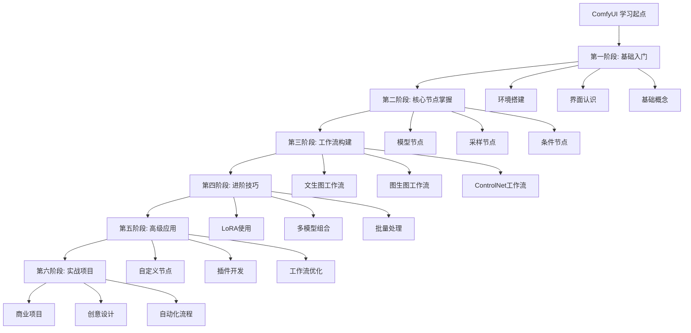

## 🎯 学习目标设定

### 初学者目标 (1-2周)
- ✅ 成功安装并运行 ComfyUI
- ✅ 理解节点式工作流的概念
- ✅ 能够使用基础工作流生成图片
- ✅ 掌握基本的参数调整

### 进阶者目标 (1-2个月)
- ✅ 熟练使用各类核心节点
- ✅ 能够自己搭建完整工作流
- ✅ 掌握 ControlNet 等高级控制技术
- ✅ 理解 LoRA、Embedding 等模型使用

### 高级者目标 (3-6个月)
- ✅ 能够优化工作流性能
- ✅ 开发自定义节点和插件
- ✅ 构建复杂的自动化流程
- ✅ 应用于实际商业项目

---

## 第一阶段: 基础入门 (1-2周)

### 1.1 环境准备

#### 系统要求
- **操作系统**: Windows 10/11, macOS, Linux
- **GPU**: NVIDIA 显卡(推荐 6GB+ 显存)
- **内存**: 16GB+ RAM
- **存储**: 50GB+ 可用空间

#### 安装步骤
```bash
# 1. 克隆仓库
git clone https://github.com/comfyanonymous/ComfyUI.git
cd ComfyUI

# 2. 安装依赖
pip install -r requirements.txt

# 3. 启动 ComfyUI
python main.py
```

#### 关键目录结构
```
ComfyUI/
├── models/               # 模型存放目录
│   ├── checkpoints/     # 主模型(SD/SDXL)
│   ├── vae/             # VAE 模型
│   ├── loras/           # LoRA 模型
│   ├── embeddings/      # Embedding 模型
│   └── controlnet/      # ControlNet 模型
├── input/               # 输入图片目录
├── output/              # 输出图片目录
├── custom_nodes/        # 自定义节点目录
└── web/                 # Web 界面文件
```

### 1.2 界面认识

#### 主要区域划分
1. **工作区 (Canvas)**: 节点编辑的主要区域
2. **节点库 (Node Menu)**: 右键菜单,包含所有可用节点
3. **队列面板 (Queue)**: 显示待处理和正在处理的任务
4. **历史记录 (History)**: 查看之前的生成记录

#### 基本操作
- **添加节点**: 右键 → 选择节点类型
- **连接节点**: 拖动输出点到输入点
- **移动视图**: 鼠标中键拖动
- **缩放视图**: 鼠标滚轮
- **删除节点**: 选中节点 → Delete 键
- **复制节点**: Ctrl+C / Ctrl+V

### 1.3 核心概念理解

#### 节点 (Node)
- **定义**: 执行特定功能的独立单元
- **类型**: 输入节点、处理节点、输出节点
- **属性**: 每个节点有自己的参数配置

#### 工作流 (Workflow)
- **定义**: 多个节点按特定顺序连接形成的处理流程
- **执行**: 从输入节点开始,依次执行到输出节点
- **保存**: 可导出为 JSON 文件分享

#### 数据流向
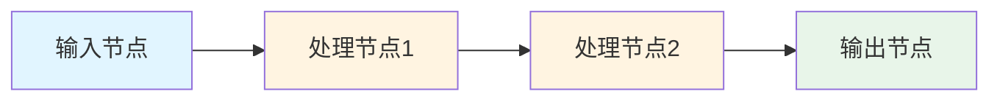

### 1.4 第一个工作流实践

#### 最简单的文生图工作流
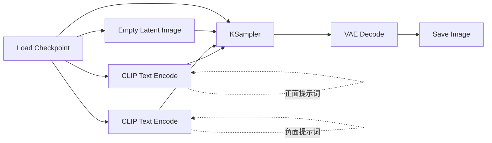

**需要的节点:**
1. **Load Checkpoint**: 加载主模型
2. **CLIP Text Encode** (×2): 编码正面和负面提示词
3. **Empty Latent Image**: 创建空白潜空间图像
4. **KSampler**: 采样器,核心生成节点
5. **VAE Decode**: 解码潜空间图像
6. **Save Image**: 保存最终图片

**参数配置:**
- **Checkpoint**: 选择下载的模型
- **正面提示词**: 描述想要生成的内容
- **负面提示词**: 描述不想要的内容
- **图像尺寸**: 512×512 或 1024×1024
- **采样步数**: 20-30 步
- **CFG Scale**: 7-9

---

## 第二阶段: 核心节点掌握 (2-3周)

### 2.1 加载器节点 (Loaders)

#### Load Checkpoint
- **功能**: 加载主模型
- **关键参数**:
  - `ckpt_name`: 模型文件名
- **输出**: MODEL, CLIP, VAE

#### Load LoRA
- **功能**: 加载 LoRA 微调模型
- **关键参数**:
  - `lora_name`: LoRA 文件名
  - `strength_model`: 模型强度 (0.0-1.0)
  - `strength_clip`: CLIP 强度 (0.0-1.0)

#### Load VAE
- **功能**: 加载独立的 VAE 模型
- **使用场景**: 某些模型自带的 VAE 效果不佳时

### 2.2 条件节点 (Conditioning)

#### CLIP Text Encode (Prompt)
- **功能**: 将文本提示词编码为条件向量
- **提示词技巧**:
  - 使用英文逗号分隔关键词
  - 重要词汇可加权: `(keyword:1.2)`
  - 降低权重: `(keyword:0.8)`

#### CLIP Text Encode (Prompt) Advanced
- **功能**: 支持更复杂的提示词语法
- **高级语法**:
  ```
  (主体:1.3), (风格:1.1), 环境描述
  [不想要的元素:-0.5]
  ```

### 2.3 采样节点 (Sampling)

#### KSampler
- **功能**: 核心采样器,生成图像
- **关键参数详解**:
  - **seed**: 随机种子 (固定可复现)
  - **steps**: 采样步数 (20-50,越高质量越好但越慢)
  - **cfg**: 提示词相关性 (7-15,越高越符合提示词)
  - **sampler_name**: 采样算法
    - `euler`: 快速,适合大多数场景
    - `dpm++_2m`: 高质量,推荐
    - `ddim`: 稳定,适合图生图
  - **scheduler**: 调度器
    - `normal`: 标准
    - `karras`: 更平滑的噪声曲线
  - **denoise**: 去噪强度 (1.0=完全重绘)

#### KSampler Advanced
- **额外功能**:
  - 控制起始步数和结束步数
  - 支持分阶段采样

### 2.4 潜空间节点 (Latent)

#### Empty Latent Image
- **功能**: 创建空白潜空间图像
- **常用尺寸**:
  - SD 1.5: 512×512, 512×768
  - SDXL: 1024×1024, 1024×1536

#### VAE Encode
- **功能**: 将图片编码为潜空间
- **用途**: 图生图工作流

#### VAE Decode
- **功能**: 将潜空间解码为图片
- **位置**: 采样器之后,保存之前

### 2.5 图像处理节点 (Image Processing)

#### Load Image
- **功能**: 从 input 目录加载图片
- **支持格式**: PNG, JPG, WebP

#### Save Image
- **功能**: 保存生成的图片
- **参数**:
  - `filename_prefix`: 文件名前缀

#### Image Scale
- **功能**: 缩放图片尺寸
- **算法选择**:
  - `nearest`: 最近邻(快速)
  - `bilinear`: 双线性(平衡)
  - `lanczos`: 兰索斯(高质量)

---

## 第三阶段: 工作流构建 (3-4周)

### 3.1 标准文生图工作流

#### 基础版本
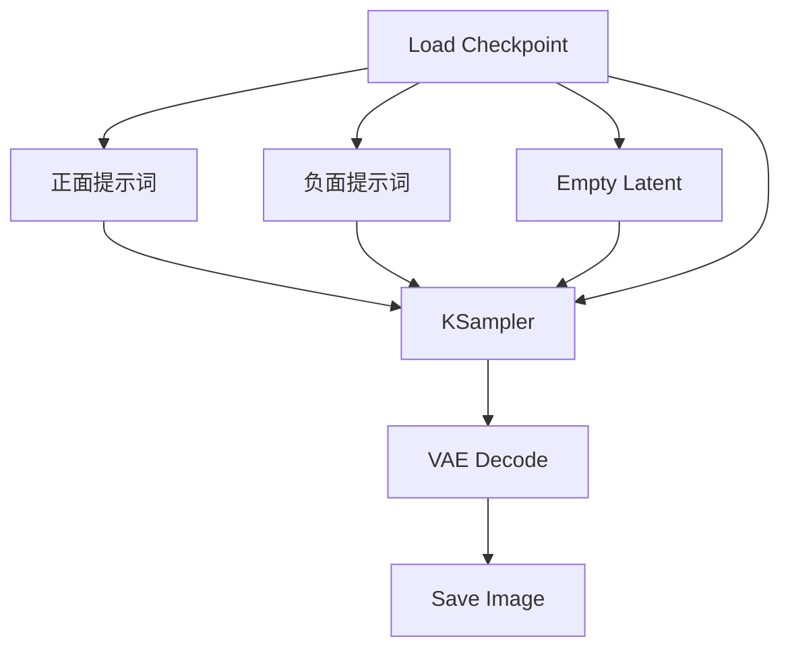

#### 进阶版本 (加入 LoRA)
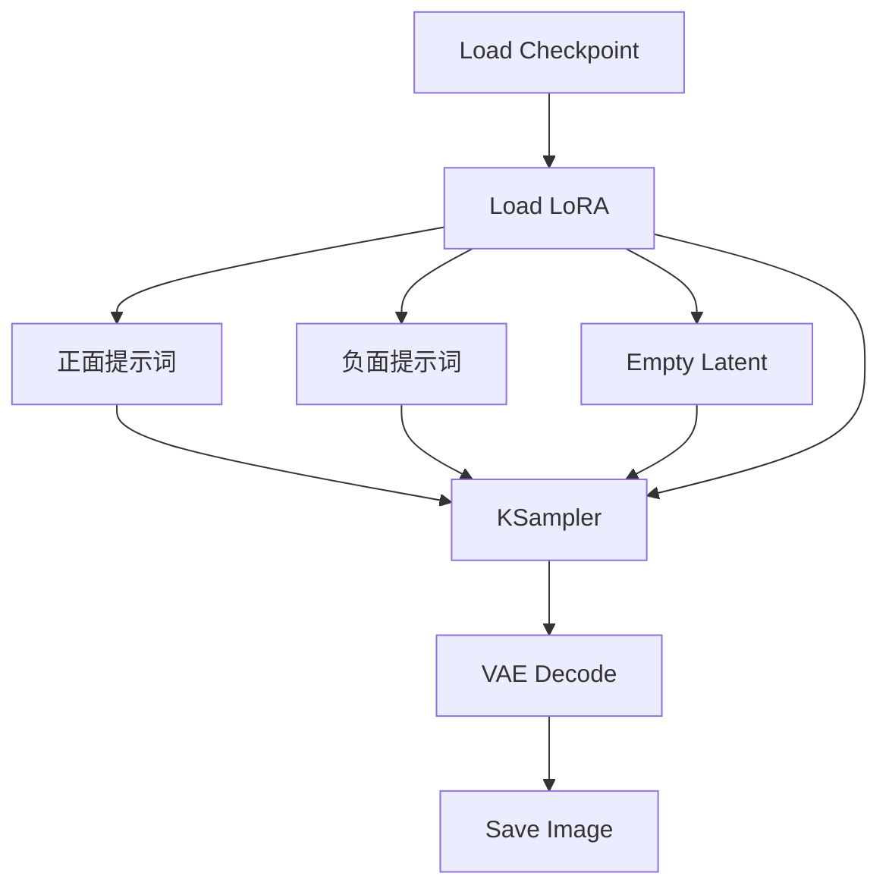

### 3.2 图生图工作流

#### 基础图生图
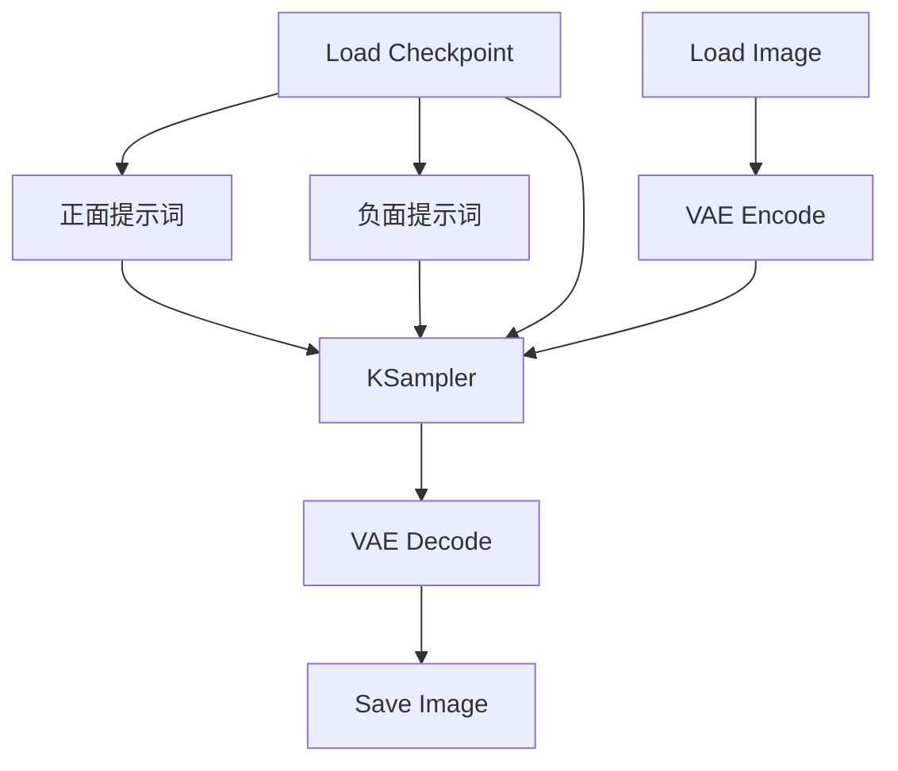

**关键点:**
- `denoise` 参数控制重绘强度
  - 0.3-0.5: 轻微调整
  - 0.5-0.7: 中等修改
  - 0.7-1.0: 大幅重绘

### 3.3 ControlNet 工作流

#### Canny 边缘控制
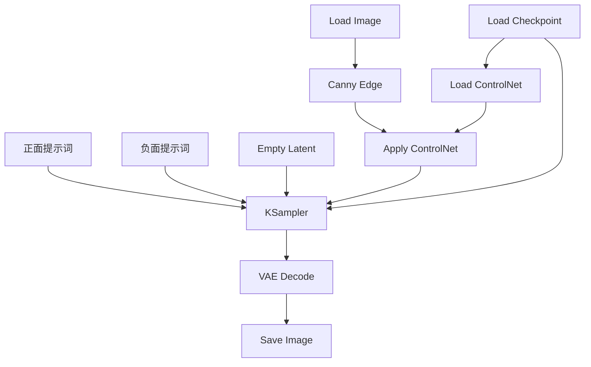

#### 常用 ControlNet 类型
1. **Canny**: 边缘检测,保持结构
2. **Depth**: 深度图,保持空间关系
3. **OpenPose**: 姿态控制,人物生成
4. **Scribble**: 涂鸦控制,快速草图
5. **Lineart**: 线稿控制,插画风格

### 3.4 高清修复工作流 (Hires.fix)

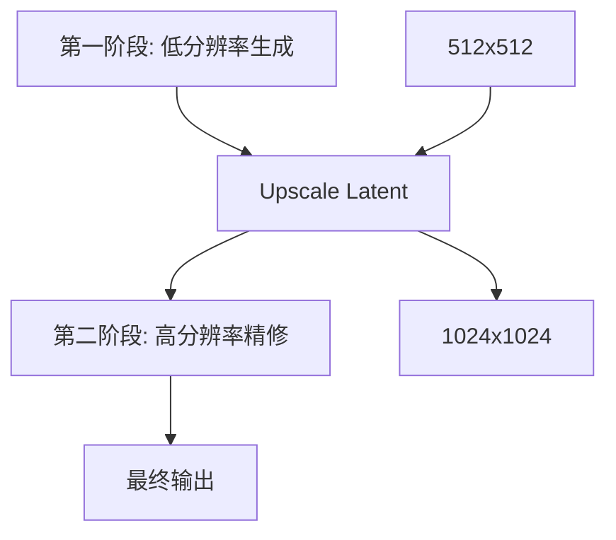

**流程说明:**
1. 先生成低分辨率图片 (512×512)
2. 放大潜空间图像 (Upscale Latent)
3. 低 denoise 值重新采样 (0.4-0.6)
4. 得到高质量大图

---

## 第四阶段: 进阶技巧 (1-2个月)

### 4.1 LoRA 使用技巧

#### LoRA 叠加使用
```java
// 多个 LoRA 组合示例
Load Checkpoint (基础模型)
  ↓
Load LoRA 1 (风格 LoRA, strength: 0.8)
  ↓
Load LoRA 2 (人物 LoRA, strength: 0.6)
  ↓
Load LoRA 3 (细节 LoRA, strength: 0.4)
  ↓
CLIP Text Encode (提示词)
```

**叠加原则:**
- 最多叠加 3-4 个 LoRA
- 权重总和建议不超过 2.0
- 风格类 LoRA 放前面,细节类放后面

#### LoRA 强度调节策略
- **0.2-0.4**: 轻微影响,保留基础模型特征
- **0.5-0.7**: 中等影响,平衡效果
- **0.8-1.0**: 强烈影响,突出 LoRA 特征
- **>1.0**: 过度影响,可能出现异常

### 4.2 批量生成技巧

#### 批量生成不同提示词
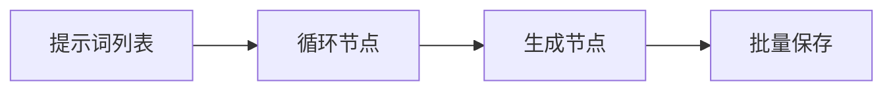

#### 批量生成不同参数
- 使用 **Primitive** 节点创建参数列表
- 连接到 **循环控制节点**
- 自动遍历所有参数组合

### 4.3 面部修复技巧

#### 使用 Face Restore 节点
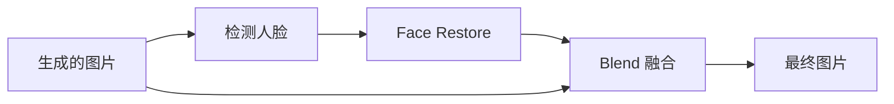

**推荐模型:**
- **CodeFormer**: 修复强度可调
- **GFPGAN**: 修复效果自然

### 4.4 局部重绘 (Inpainting)

#### 工作流结构
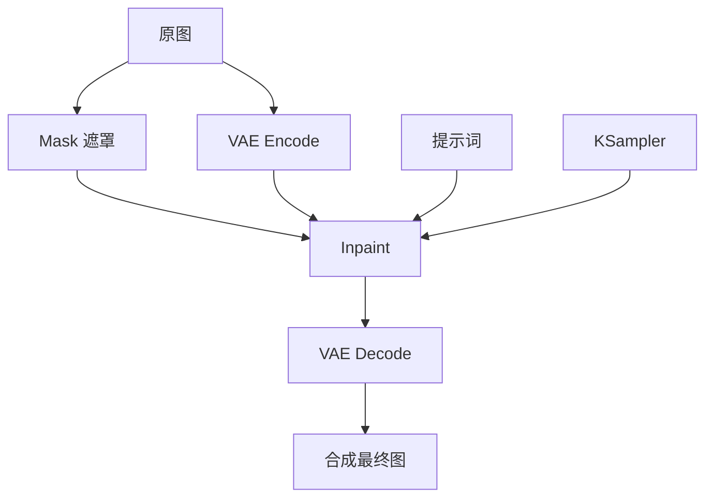

**应用场景:**
- 替换图片中的特定元素
- 修复图片瑕疵
- 扩展图片边界 (Outpainting)

### 4.5 提示词工程进阶

#### 分层提示词结构
```
# 主体层 (权重 1.2-1.5)
(主要角色或物体:1.3)

# 风格层 (权重 1.0-1.2)
(艺术风格, 渲染方式:1.1)

# 环境层 (权重 0.8-1.0)
背景, 光照, 氛围

# 质量层 (权重 1.0)
masterpiece, best quality, highly detailed

# 负面层
(低质量元素, 不想要的内容:1.2)
```

#### 提示词模板示例
```
# 人物肖像模板
(1girl:1.2), (realistic:1.1), (portrait:1.2),
detailed face, beautiful eyes,
soft lighting, bokeh background,
masterpiece, best quality, 8k

# 风景模板
(landscape:1.3), (natural scenery:1.2),
mountain, lake, sunset,
volumetric lighting, cinematic,
ultra detailed, 4k wallpaper
```

---

## 第五阶段: 高级应用 (2-3个月)

### 5.1 自定义节点开发

#### 节点开发基础
```java
// Python 自定义节点示例
class MyCustomNode:
    @classmethod
    def INPUT_TYPES(cls):
        return {
            "required": {
                "image": ("IMAGE",),
                "strength": ("FLOAT", {
                    "default": 1.0,
                    "min": 0.0,
                    "max": 2.0,
                    "step": 0.1
                })
            }
        }

    RETURN_TYPES = ("IMAGE",)
    FUNCTION = "process"
    CATEGORY = "image/processing"

    def process(self, image, strength):
        # 自定义处理逻辑
        processed = self.custom_logic(image, strength)
        return (processed,)
```

#### 常见自定义节点类型
1. **图像处理节点**: 滤镜、特效
2. **工作流控制节点**: 循环、条件判断
3. **模型加载节点**: 自定义模型格式
4. **数据转换节点**: 格式转换、参数映射

### 5.2 插件生态

#### 必装插件推荐

**ComfyUI Manager**
- 功能: 一键安装和管理其他插件
- 地址: https://github.com/ltdrdata/ComfyUI-Manager

**Efficiency Nodes**
- 功能: 优化的高效节点包
- 特点: 减少节点数量,简化工作流

**Impact Pack**
- 功能: 面部检测和修复工具包
- 应用: 人物生成后处理

**Inspire Pack**
- 功能: 创意辅助工具
- 特点: 提示词生成、风格混合

### 5.3 工作流优化

#### 性能优化技巧

**1. 模型加载优化**
```java
// 使用模型缓存
Load Checkpoint (keep_in_memory: true)
  ↓
多次使用同一模型,不重复加载
```

**2. 批量处理优化**
- 使用 Batch 节点合并多张图
- 一次性处理,减少开销

**3. 内存管理**
- 及时清理不用的中间结果
- 使用低 VRAM 模式 (速度换显存)

#### 工作流复用策略

**模块化设计**
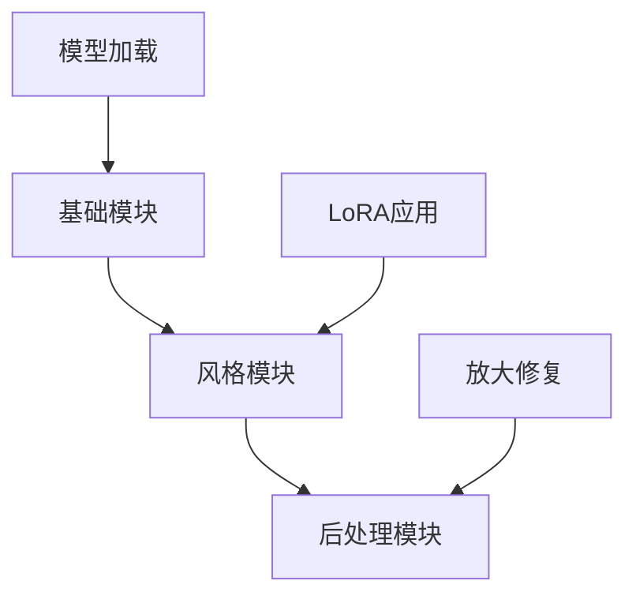

**工作流模板库**
- 文生图模板
- 图生图模板
- ControlNet 模板
- 批量处理模板

### 5.4 AI 视频生成 (AnimateDiff)

#### AnimateDiff 工作流
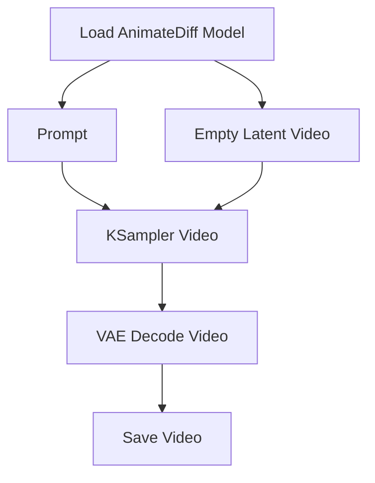

**关键参数:**
- **frame_count**: 帧数 (16, 24, 32)
- **fps**: 帧率 (8, 12, 16)
- **motion_scale**: 运动幅度

---

## 第六阶段: 实战项目 (持续学习)

### 6.1 商业应用场景

#### 电商产品图生成
**需求分析:**
- 批量生成多角度产品图
- 统一风格和背景
- 快速迭代修改

**工作流设计:**
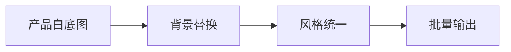

#### 社交媒体内容创作
**应用类型:**
- 头像生成
- 封面设计
- 表情包制作
- 九宫格图集

### 6.2 创意设计项目

#### 概念艺术设计
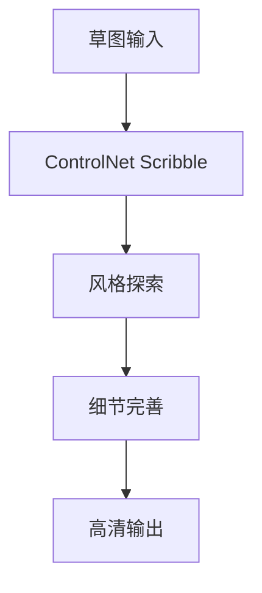

#### 角色设计流程
1. **概念阶段**: 文字描述 → 初步生成
2. **迭代阶段**: 图生图 → 细节调整
3. **定稿阶段**: 局部重绘 → 高清放大
4. **应用阶段**: 多角度 → 表情变化

### 6.3 自动化工作流

#### API 集成
```java
// ComfyUI API 调用示例
import requests
import json

def generate_image(prompt, negative_prompt):
    workflow = {
        "prompt": prompt,
        "negative_prompt": negative_prompt,
        "steps": 30,
        "cfg": 7.5
    }

    response = requests.post(
        "http://localhost:8188/api/generate",
        json={"workflow": workflow}
    )

    return response.json()
```

#### 批量任务调度
- 使用队列系统管理大量任务
- 自动监控生成进度
- 失败任务自动重试

---

## 📖 学习资源推荐

### 官方资源
- **GitHub**: https://github.com/comfyanonymous/ComfyUI
- **Wiki**: https://github.com/comfyanonymous/ComfyUI/wiki
- **Discord**: ComfyUI 官方社区

### 中文教程
- **B站**: 搜索 "ComfyUI 教程"
- **知乎**: ComfyUI 专栏
- **Reddit**: r/comfyui

### 工作流分享平台
- **OpenArt**: https://openart.ai/workflows
- **CivitAI**: https://civitai.com/

### 模型下载站
- **CivitAI**: https://civitai.com/
- **HuggingFace**: https://huggingface.co/
- **LiblibAI**: https://www.liblib.art/

---

## 🎓 学习建议

### 学习方法
1. **实践优先**: 每学一个概念立即动手尝试
2. **循序渐进**: 从简单工作流开始,逐步增加复杂度
3. **拆解学习**: 下载别人的工作流,研究每个节点的作用
4. **记录总结**: 建立自己的工作流模板库
5. **社区交流**: 加入社区,分享经验,解决问题

### 常见问题解决

#### 显存不足 (CUDA out of memory)
**解决方案:**
- 降低图片分辨率
- 减少批量处理数量
- 启用 `--lowvram` 启动参数
- 使用 fp16 或 fp8 量化模型

#### 生成速度慢
**优化方法:**
- 使用更快的采样器 (euler, dpmpp_2m)
- 减少采样步数 (20-25 步)
- 升级 CUDA 和 PyTorch 版本
- 检查 xformers 是否正确安装

#### 图片质量不理想
**改进思路:**
- 优化提示词描述
- 调整 CFG 值 (7-11)
- 更换更高质量的模型
- 使用高清修复工作流

---

## 🚀 进阶方向

### 专业化方向

#### 人物肖像专精
- 研究各类人物 LoRA
- 掌握面部特征控制
- 学习表情和姿态生成

#### 场景设计专精
- 学习建筑和环境设计
- 掌握光照和氛围营造
- 研究概念艺术风格

#### 视频生成专精
- 深入学习 AnimateDiff
- 研究运动控制技术
- 探索视频后处理

### 技术深化方向

#### 算法研究
- 研究不同采样算法原理
- 理解 ControlNet 技术细节
- 学习扩散模型数学基础

#### 工具开发
- 开发自定义节点
- 创建插件和扩展
- 构建自动化工具链

---

## 📝 总结

ComfyUI 的学习是一个循序渐进的过程,从基础操作到高级应用,需要持续的实践和探索。关键是:

1. **打好基础**: 理解节点和工作流的核心概念
2. **多做实践**: 每天尝试构建新的工作流
3. **学习借鉴**: 研究优秀的工作流案例
4. **持续更新**: 关注新功能和新模型
5. **社区交流**: 分享经验,共同进步

通过系统的学习和不断的实践,你将能够熟练掌握 ComfyUI,创作出令人惊艳的 AI 艺术作品!

---

> **下一步**: 开始 [ComfyUI 基础入门实战](./02-ComfyUI基础入门实战.md)
