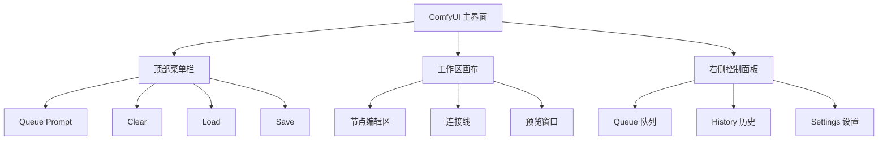
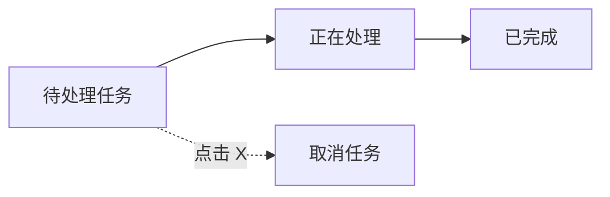
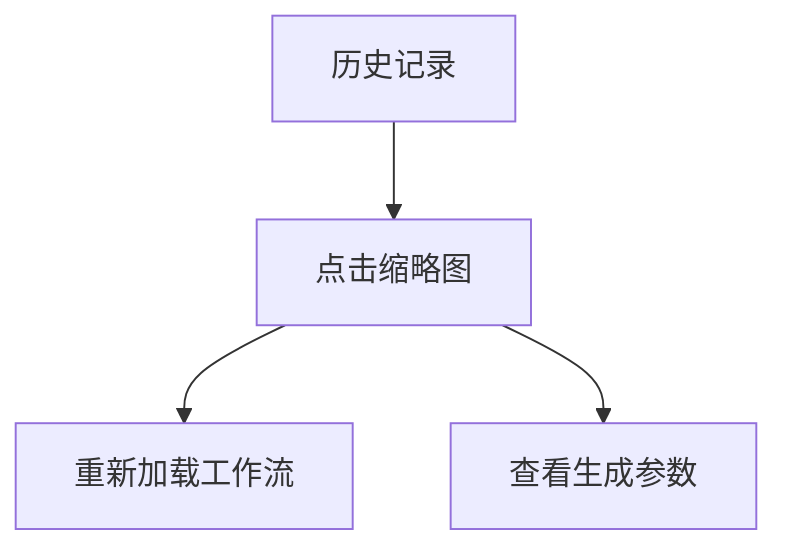
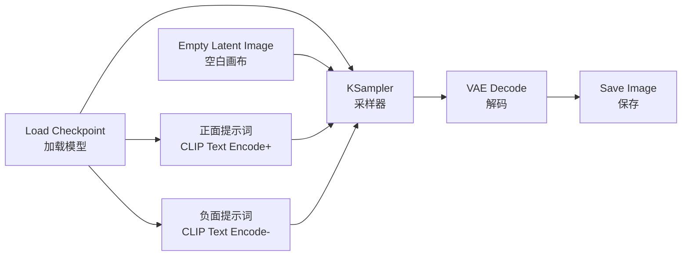
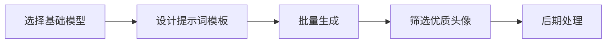

# ComfyUI 基础入门实战

## 🎯 本章目标

通过本章学习,你将:
- ✅ 完成 ComfyUI 的安装和配置
- ✅ 理解节点式工作流的基本概念
- ✅ 掌握基础节点的使用方法
- ✅ 独立搭建第一个文生图工作流
- ✅ 能够调整参数生成满意的图片

---

## 第一部分: 环境搭建详解

### 1.1 系统要求检查

#### Windows 系统
```bash
# 检查 Python 版本 (需要 3.10 或 3.11)
python --version

# 检查 NVIDIA 显卡
nvidia-smi

# 检查 CUDA 版本
nvcc --version
```

#### macOS 系统
```bash
# 检查 Python 版本
python3 --version

# 检查是否为 Apple Silicon (M1/M2/M3)
uname -m
# 输出 arm64 表示是 Apple Silicon
```

#### 显卡要求
- **NVIDIA**: GTX 1060 6GB 以上(推荐 RTX 3060 12GB+)
- **AMD**: 部分支持,性能较弱
- **Apple Silicon**: M1/M2/M3 可用,但速度较慢

### 1.2 详细安装步骤

#### 方法一: 手动安装(推荐学习)

**步骤 1: 安装 Python**
```bash
# Windows: 从 python.org 下载 Python 3.10.x
# macOS: 使用 Homebrew
brew install python@3.10
```

**步骤 2: 克隆 ComfyUI 仓库**
```bash
# 创建工作目录
mkdir ~/ComfyUI-Projects
cd ~/ComfyUI-Projects

# 克隆仓库
git clone https://github.com/comfyanonymous/ComfyUI.git
cd ComfyUI
```

**步骤 3: 创建虚拟环境**
```bash
# 创建虚拟环境
python -m venv venv

# 激活虚拟环境
# Windows:
venv\Scripts\activate
# macOS/Linux:
source venv/bin/activate
```

**步骤 4: 安装依赖**
```bash
# 安装 PyTorch (NVIDIA GPU)
pip install torch torchvision torchaudio --index-url https://download.pytorch.org/whl/cu121

# 安装 ComfyUI 依赖
pip install -r requirements.txt

# 安装 xformers (可选,但强烈推荐)
pip install xformers
```

**步骤 5: 验证安装**
```bash
# 启动 ComfyUI
python main.py

# 看到以下信息表示成功:
# To see the GUI go to: http://127.0.0.1:8188
```

#### 方法二: 便携版安装(适合新手)

**Windows 便携版**
1. 下载 ComfyUI_windows_portable.zip
2. 解压到任意目录
3. 运行 `run_nvidia_gpu.bat`(N卡) 或 `run_cpu.bat`(无独显)

**优点**: 无需配置 Python 环境
**缺点**: 体积较大,更新不便

### 1.3 下载必需模型

#### 模型存放目录
```
ComfyUI/
└── models/
    ├── checkpoints/      # 主模型
    ├── vae/              # VAE 模型
    ├── loras/            # LoRA 模型
    ├── embeddings/       # Embedding 模型
    └── controlnet/       # ControlNet 模型
```

#### 推荐的入门模型

**主模型 (Checkpoint)**
1. **Stable Diffusion 1.5**
   - 文件: `v1-5-pruned-emaonly.safetensors`
   - 大小: 4GB
   - 下载: HuggingFace 或 CivitAI
   - 用途: 通用基础模型

2. **Realistic Vision V5.1**(写实风格)
   - 文件: `realisticVisionV51_v51VAE.safetensors`
   - 大小: 5GB
   - 下载: https://civitai.com/models/4201
   - 用途: 写实人像、场景

3. **Anything V5**(动漫风格)
   - 文件: `anythingV5_v5PrtRE.safetensors`
   - 大小: 4GB
   - 下载: https://civitai.com/models/9409
   - 用途: 动漫角色、插画

**VAE 模型(可选)**
- 文件: `vae-ft-mse-840000-ema-pruned.safetensors`
- 大小: 319MB
- 作用: 改善图片色彩和细节

#### 模型下载技巧
```bash
# 使用 wget 下载(Linux/macOS)
wget -O models/checkpoints/model.safetensors "模型下载链接"

# 使用迅雷或 IDM 下载(Windows)
# 推荐使用迅雷,速度更快
```

---

## 第二部分: 界面功能详解

### 2.1 主界面布局



### 2.2 顶部菜单功能

#### Queue Prompt (执行工作流)
- **功能**: 将当前工作流加入执行队列
- **快捷键**: `Ctrl + Enter` (Windows) / `Cmd + Enter` (macOS)
- **状态显示**:
  - 🟢 绿色: 可以执行
  - 🔴 红色: 有错误,无法执行

#### Clear (清空队列)
- **功能**: 清除所有待执行的任务
- **使用场景**: 取消排队中的任务

#### Load (加载工作流)
- **功能**: 从本地加载 JSON 格式的工作流
- **支持格式**: `.json`, `.png`(嵌入工作流的图片)

#### Save (保存工作流)
- **功能**: 导出当前工作流为 JSON 文件
- **保存方式**:
  - Save: 保存工作流
  - Save (API Format): 保存为 API 格式

### 2.3 工作区操作技巧

#### 视图控制
```java
// 鼠标操作
中键拖动 → 移动画布
滚轮 → 缩放视图
右键点击空白 → 打开节点菜单

// 快捷键
Ctrl + 0 → 重置视图
Ctrl + A → 全选节点
Ctrl + C / V → 复制粘贴节点
Delete → 删除选中节点
```

#### 节点操作
```java
// 添加节点
右键 → Add Node → 选择类型

// 连接节点
拖动输出端口 → 拖到输入端口

// 断开连接
拖动连接线到空白处

// 移动节点
左键拖动节点

// 批量选择
按住 Shift + 拖动选框
```

### 2.4 节点面板详解

#### 节点结构
```
┌─────────────────────────┐
│   节点标题 (可折叠)      │
├─────────────────────────┤
│ 输入端口 ◄──           │
│   - 参数 1              │
│   - 参数 2              │
│                         │
│ 输出端口 ──►           │
│   - 输出 1              │
└─────────────────────────┘
```

#### 端口颜色含义
- **🟣 紫色**: MODEL (模型)
- **🟡 黄色**: CLIP (文本编码器)
- **🔴 红色**: VAE (图像编解码器)
- **🟢 绿色**: CONDITIONING (条件)
- **🔵 蓝色**: LATENT (潜空间)
- **⚪ 白色**: IMAGE (图像)

### 2.5 队列和历史面板

#### Queue (队列面板)


**功能:**
- 查看排队中的任务
- 显示当前执行进度
- 取消指定任务

#### History (历史面板)


**功能:**
- 查看所有历史生成
- 重新加载之前的工作流
- 下载历史生成的图片

---

## 第三部分: 第一个工作流实战

### 3.1 最简单的文生图工作流

#### 工作流结构


#### 搭建步骤

**步骤 1: 添加 Load Checkpoint 节点**
```java
右键 → Add Node → loaders → Load Checkpoint

// 配置参数
ckpt_name: 选择下载的模型文件
// 例如: realisticVisionV51_v51VAE.safetensors
```

**步骤 2: 添加提示词编码节点**
```java
右键 → Add Node → conditioning → CLIP Text Encode (Prompt)

// 添加两个,分别用于正面和负面提示词
// 正面提示词示例:
"a beautiful girl, long hair, smile,
looking at viewer, sunlight,
masterpiece, best quality, 8k"

// 负面提示词示例:
"ugly, bad anatomy, bad hands,
low quality, worst quality,
blurry, watermark"
```

**步骤 3: 添加空白画布节点**
```java
右键 → Add Node → latent → Empty Latent Image

// 配置参数
width: 512    // 宽度
height: 768   // 高度
batch_size: 1 // 一次生成数量
```

**步骤 4: 添加采样器节点**
```java
右键 → Add Node → sampling → KSampler

// 配置参数
seed: -1 (随机) 或固定数值
steps: 25           // 采样步数
cfg: 7.5            // 提示词相关性
sampler_name: dpm++_2m  // 采样算法
scheduler: karras   // 调度器
denoise: 1.0        // 去噪强度
```

**步骤 5: 添加 VAE 解码节点**
```java
右键 → Add Node → latent → VAE Decode

// 无需配置,直接连接即可
```

**步骤 6: 添加保存图片节点**
```java
右键 → Add Node → image → Save Image

// 配置参数
filename_prefix: "ComfyUI"  // 文件名前缀
```

**步骤 7: 连接所有节点**
```java
// 连接顺序
Load Checkpoint → CLIP → CLIP Text Encode (正面)
Load Checkpoint → CLIP → CLIP Text Encode (负面)
Load Checkpoint → MODEL → KSampler
Load Checkpoint → VAE → VAE Decode

CLIP Text Encode (正面) → CONDITIONING → KSampler (positive)
CLIP Text Encode (负面) → CONDITIONING → KSampler (negative)
Empty Latent Image → LATENT → KSampler (latent_image)

KSampler → LATENT → VAE Decode
VAE Decode → IMAGE → Save Image
```

#### 执行工作流
```bash
1. 检查所有连接是否正确
2. 点击 "Queue Prompt" 或按 Ctrl+Enter
3. 等待生成完成
4. 在 output 目录查看生成的图片
```

### 3.2 参数调优指南

#### Seed (随机种子)
```java
-1          // 每次随机,不同结果
固定值      // 固定种子,可复现结果

// 使用技巧:
// 1. 探索阶段使用 -1
// 2. 找到满意的图后记录 seed
// 3. 微调参数时使用固定 seed
```

#### Steps (采样步数)
```java
15-20 步    // 快速预览,质量一般
25-30 步    // 平衡质量和速度,推荐
40-50 步    // 高质量,速度较慢
50+ 步      // 边际收益递减,不推荐

// 建议:
// 预览: 20 步
// 正式: 28-30 步
```

#### CFG Scale (提示词相关性)
```java
1-5         // 弱相关,创意性强,可能偏离
7-9         // 推荐范围,平衡质量
10-15       // 强相关,严格遵循提示词
15+         // 过度拟合,可能出现异常

// 建议:
// 写实风格: 7-8
// 艺术风格: 5-7
// 精确控制: 9-11
```

#### Sampler (采样器)
```java
// 速度优先
euler         // 最快,质量尚可
euler_a       // 略慢,增加随机性

// 质量优先
dpm++_2m      // 推荐,质量高
dpm++_sde     // 细节丰富,速度慢
ddim          // 稳定,适合图生图

// 建议:
// 日常使用: dpm++_2m + karras
// 快速测试: euler + normal
```

#### Scheduler (调度器)
```java
normal        // 标准线性调度
karras        // 更平滑,推荐
exponential   // 指数曲线
```

### 3.3 提示词编写技巧

#### 提示词结构
```
[主体描述], [细节修饰], [环境描述],
[艺术风格], [质量标签]
```

#### 写实人像示例
```
正面提示词:
(masterpiece:1.2), (best quality:1.2), (ultra detailed:1.2),
(realistic:1.3), (photorealistic:1.3),
1girl, beautiful face, detailed eyes, long brown hair,
smile, looking at viewer,
white dress, outdoor, garden,
natural lighting, bokeh background,
8k uhd, dslr, soft lighting, high quality

负面提示词:
(worst quality:1.4), (low quality:1.4),
ugly, bad anatomy, bad hands, missing fingers,
extra digits, fewer digits, cropped,
watermark, signature, username,
blurry, jpeg artifacts
```

#### 动漫风格示例
```
正面提示词:
(masterpiece:1.2), (best quality:1.2),
1girl, anime style, cute face,
blue eyes, blonde hair, twin tails,
school uniform, smile,
cherry blossoms, spring,
soft colors, detailed,
high resolution

负面提示词:
lowres, bad anatomy, bad hands,
text, error, missing fingers,
extra digit, fewer digits,
cropped, worst quality, low quality,
normal quality, jpeg artifacts,
signature, watermark
```

#### 提示词权重语法
```java
(keyword)         // 权重 1.1
((keyword))       // 权重 1.21
(keyword:1.5)     // 指定权重 1.5
(keyword:0.8)     // 降低权重到 0.8

// 示例:
(beautiful face:1.3), detailed eyes, (smile:1.2)
// beautiful face 权重 1.3
// detailed eyes 权重 1.0
// smile 权重 1.2
```

---

## 第四部分: 常见问题排查

### 4.1 安装问题

#### 问题 1: 缺少 CUDA
```bash
# 错误信息:
RuntimeError: Couldn't load custom C++ ops

# 解决方案:
# 1. 安装对应版本的 CUDA Toolkit
# 2. 重新安装 PyTorch
pip install torch torchvision torchaudio --index-url https://download.pytorch.org/whl/cu121
```

#### 问题 2: 显存不足
```bash
# 错误信息:
CUDA out of memory

# 解决方案 1: 降低分辨率
512×512 → 更小尺寸

# 解决方案 2: 启动时添加参数
python main.py --lowvram

# 解决方案 3: 使用 fp16 模型
# 下载 fp16 版本的模型
```

### 4.2 运行问题

#### 问题 3: 节点连接错误
```bash
# 错误信息:
Node X output Y is not compatible with Node Z input W

# 解决方案:
# 检查端口颜色是否匹配
# MODEL → MODEL (紫色)
# CLIP → CLIP (黄色)
# VAE → VAE (红色)
# 等等
```

#### 问题 4: 模型加载失败
```bash
# 错误信息:
Error loading model

# 解决方案:
# 1. 检查模型文件是否完整
# 2. 确认模型格式 (.safetensors 或 .ckpt)
# 3. 重新下载模型
# 4. 检查文件路径是否正确
```

### 4.3 生成质量问题

#### 问题 5: 图片模糊不清
```java
// 原因分析:
// 1. 采样步数太少
// 2. 模型质量不佳
// 3. VAE 未正确加载

// 解决方案:
// 1. 增加 steps 到 25-30
// 2. 更换高质量模型
// 3. 单独加载 VAE
// 4. 提示词添加质量标签:
//    "masterpiece, best quality, highly detailed"
```

#### 问题 6: 生成内容不符合提示词
```java
// 原因分析:
// 1. CFG 值太低
// 2. 提示词描述不准确
// 3. 负面提示词太强

// 解决方案:
// 1. 提高 CFG 到 8-10
// 2. 优化提示词描述,增加细节
// 3. 调整负面提示词权重
// 4. 使用括号强调重点:
//    "(red dress:1.3), detailed"
```

---

## 第五部分: 进阶练习

### 5.1 练习任务

#### 任务 1: 生成写实人像
```
要求:
- 使用 Realistic Vision 模型
- 生成一位微笑的女性肖像
- 背景虚化效果
- 尺寸: 512×768
- 质量: 高清细节

提示:
- CFG: 7.5
- Steps: 28
- 使用 bokeh 关键词实现背景虚化
```

#### 任务 2: 生成动漫角色
```
要求:
- 使用 Anything V5 模型
- 生成一位可爱的动漫女孩
- 校园场景
- 尺寸: 512×768
- 风格: 明亮色彩

提示:
- 添加 "anime style, colorful" 关键词
- CFG: 7
- Sampler: euler_a (增加随机性)
```

#### 任务 3: 批量生成
```
要求:
- 使用同一提示词
- 生成 5 张不同的图片
- 找出最满意的一张

方法:
- 保持 seed 为 -1
- 修改 batch_size 为 5
- 或者多次点击 Queue Prompt
```

### 5.2 实战项目

#### 项目 1: 制作头像生成器


**实现步骤:**
1. 准备 3-5 个不同风格的提示词
2. 每个提示词生成 10 张图
3. 筛选最佳结果
4. 使用图像编辑工具裁剪为正方形

#### 项目 2: 探索不同艺术风格
```java
// 油画风格
"oil painting, brush strokes, classic art style"

// 水彩风格
"watercolor painting, soft colors, dreamy"

// 赛博朋克风格
"cyberpunk, neon lights, futuristic, sci-fi"

// 吉卜力风格
"studio ghibli style, anime, hand drawn"
```

---

## 📖 学习资源

### 提示词参考
- **Prompt Database**: https://promptbase.com/
- **Lexica**: https://lexica.art/
- **OpenArt**: https://openart.ai/

### 模型推荐站
- **CivitAI**: https://civitai.com/
- **HuggingFace**: https://huggingface.co/models

### 社区交流
- **Discord**: ComfyUI 官方服务器
- **Reddit**: r/StableDiffusion, r/comfyui
- **B站**: 搜索 "ComfyUI 教程"

---

## 🎯 下一步学习

完成本章学习后,你应该:
- ✅ 能够独立搭建基础工作流
- ✅ 理解各个节点的作用
- ✅ 会调整参数优化图片质量
- ✅ 能够编写有效的提示词

**继续学习:**
- [ComfyUI 进阶技巧](./03-ComfyUI进阶技巧.md)
- [图生图与 ControlNet](./04-图生图与ControlNet.md)
- [LoRA 使用指南](./05-LoRA使用指南.md)

---

> **提示**: 多动手实践是最好的学习方法!每天花 30 分钟搭建工作流,一周后你就能熟练掌握基础操作。
