# ComfyUI 进阶技巧与优化

## 🎯 本章目标

通过本章学习,你将掌握:
- ✅ 图生图工作流的搭建和参数调优
- ✅ ControlNet 的使用方法和应用场景
- ✅ LoRA 模型的加载和组合技巧
- ✅ 高清修复(Hires.fix)工作流
- ✅ 局部重绘(Inpainting)技术
- ✅ 工作流性能优化方法

---

## 第一部分: 图生图工作流

### 1.1 图生图基础概念

#### 什么是图生图?
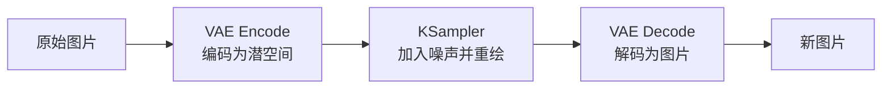

**核心原理:**
1. 将输入图片编码到潜空间
2. 根据 denoise 参数添加噪声
3. 使用提示词引导重新生成
4. 解码回图片空间

#### 图生图 vs 文生图

| 特性 | 文生图 | 图生图 |
|------|--------|--------|
| 输入 | 空白潜空间 | 图片编码 |
| 可控性 | 低 | 高 |
| 速度 | 快 | 略慢 |
| 应用 | 创意生成 | 精准修改 |

### 1.2 搭建图生图工作流

#### 基础图生图工作流
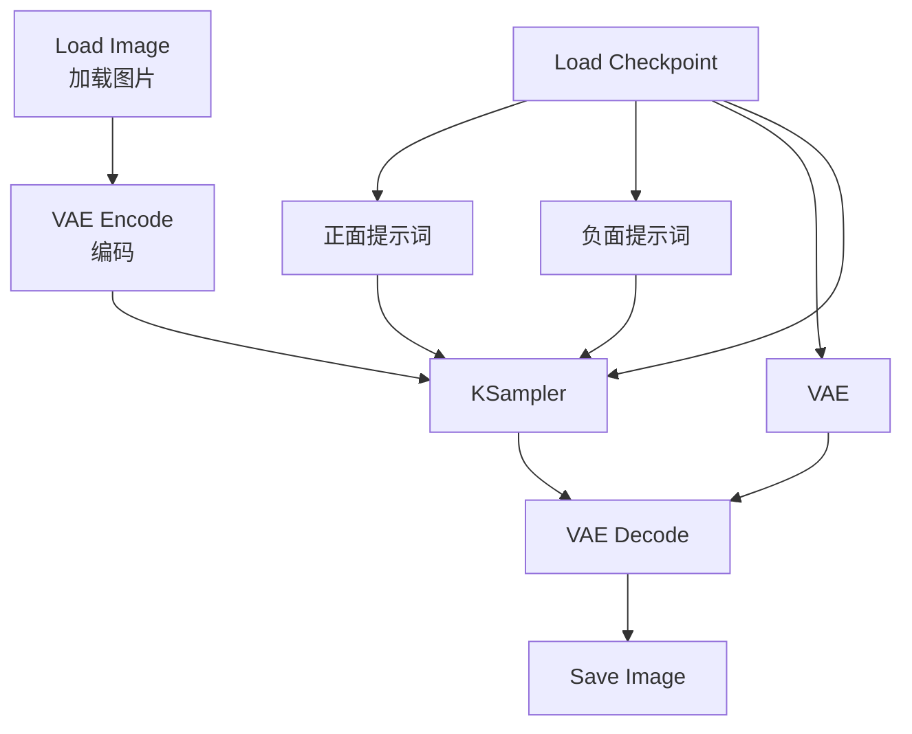

**节点配置:**

**Load Image 节点**
```java
// 功能: 从 input 目录加载图片
// 支持格式: PNG, JPG, WebP, BMP
// 注意: 图片会自动缩放到合适尺寸
```

**VAE Encode 节点**
```java
// 功能: 将图片编码为潜空间表示
// 输入: IMAGE (来自 Load Image)
// 输入: VAE (来自 Load Checkpoint)
// 输出: LATENT (潜空间数据)
```

**KSampler 配置要点**
```java
seed: -1              // 随机或固定
steps: 20-30          // 图生图通常比文生图少
cfg: 7-9              // 略低于文生图
sampler_name: ddim    // 推荐 ddim 或 dpm++_2m
denoise: 0.3-0.8      // 关键参数!控制重绘强度
```

### 1.3 Denoise 参数深度解析

#### Denoise 的作用
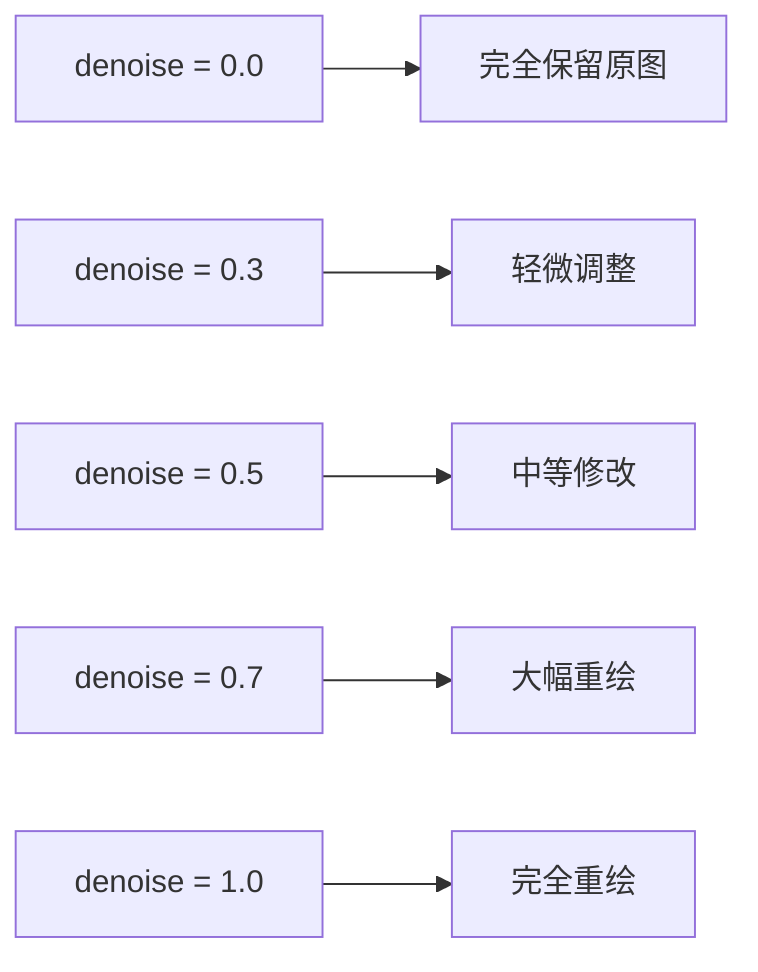

#### Denoise 使用指南

**0.1 - 0.3: 微调模式**
```java
// 应用场景:
// - 调整光照和色彩
// - 修复小瑕疵
// - 轻微风格化

// 示例:
// 原图: 白天场景
// 提示词: "sunset, golden hour"
// denoise: 0.25
// 结果: 变成日落场景,构图不变
```

**0.4 - 0.6: 平衡模式**(推荐)
```java
// 应用场景:
// - 改变人物表情
// - 调整姿态
// - 更换服装
// - 风格迁移

// 示例:
// 原图: 女孩正面照
// 提示词: "smile, happy expression"
// denoise: 0.5
// 结果: 表情变为微笑,脸型基本保留
```

**0.7 - 0.9: 重绘模式**
```java
// 应用场景:
// - 大幅改变构图
// - 更换主体
// - 艺术风格转换

// 示例:
// 原图: 照片
// 提示词: "oil painting, impressionism"
// denoise: 0.75
// 结果: 转换为油画风格,细节大改
```

**1.0: 完全重绘**
```java
// 应用场景:
// - 仅使用图片尺寸
// - 等同于文生图
// - 参考构图但完全重新生成
```

### 1.4 图生图实战案例

#### 案例 1: 照片修复
```java
// 目标: 修复模糊、曝光不足的照片
// 工作流:
Load Image (模糊照片)
  ↓
VAE Encode
  ↓
提示词: "high quality, sharp, detailed, professional photography"
denoise: 0.4
steps: 30
cfg: 7
  ↓
VAE Decode → Save Image
```

#### 案例 2: 风格迁移
```java
// 目标: 将照片转换为动漫风格
// 工作流:
Load Image (真人照片)
  ↓
Load Checkpoint (使用动漫模型)
  ↓
提示词: "anime style, colorful, cel shading"
denoise: 0.65
cfg: 8
  ↓
结果: 动漫风格的图片
```

#### 案例 3: 服装替换
```java
// 目标: 更换人物服装
// 工作流:
Load Image (原图)
  ↓
提示词: "wearing red dress, elegant"
负面: "old clothes, [原服装描述]"
denoise: 0.55
steps: 25
  ↓
结果: 服装替换,保留人物特征
```

---

## 第二部分: ControlNet 精准控制

### 2.1 ControlNet 原理

#### 什么是 ControlNet?
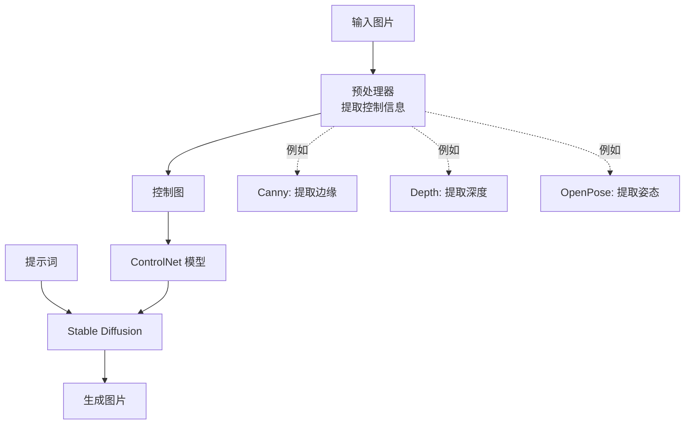

**核心优势:**
- 🎯 **精准控制**: 保持构图、姿态、深度等
- 🔄 **灵活组合**: 可同时使用多个 ControlNet
- 🎨 **风格自由**: 控制结构,自由改变风格

### 2.2 常用 ControlNet 类型

#### Canny (边缘控制)

**特点:**
- 提取图片边缘线条
- 保持物体轮廓和结构
- 最常用的 ControlNet

**应用场景:**
- 保持建筑物结构
- 保留人物轮廓
- 线稿上色

**工作流:**
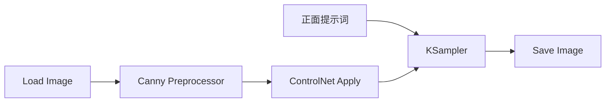

**参数配置:**
```java
// Canny Preprocessor
low_threshold: 100    // 低阈值,数值越小检测越多边缘
high_threshold: 200   // 高阈值

// ControlNet Apply
strength: 0.8-1.0     // ControlNet 强度
```

#### Depth (深度控制)

**特点:**
- 提取场景深度信息
- 保持空间关系和透视
- 适合场景和室内设计

**应用场景:**
- 室内设计方案
- 建筑效果图
- 场景重绘

**深度模型:**
```java
// MiDaS: 通用深度估计,效果好
// LeReS: 更精细的深度
// Zoe: 新一代深度模型,推荐
```

#### OpenPose (姿态控制)

**特点:**
- 检测人体骨架和关键点
- 精确控制人物姿态
- 支持手部和面部检测

**应用场景:**
- 人物姿态生成
- 舞蹈动作
- 体育运动

**关键点:**
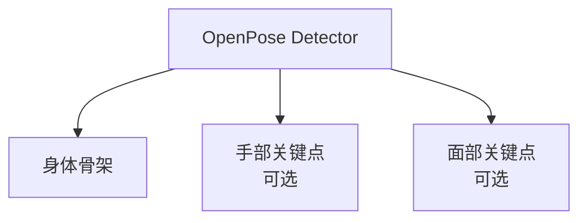

**配置:**
```java
detect_hand: true     // 检测手部
detect_body: true     // 检测身体
detect_face: true     // 检测面部
```

#### Lineart (线稿控制)

**特点:**
- 生成干净的线稿
- 适合插画和漫画
- 比 Canny 更艺术化

**预处理器选择:**
```java
lineart_anime        // 动漫风格线稿
lineart_coarse       // 粗糙线稿
lineart_realistic    // 写实线稿
```

#### Scribble (涂鸦控制)

**特点:**
- 识别简单涂鸦
- 快速草图转精细图
- 创意自由度高

**使用流程:**
```java
1. 用画图工具画简单草图
2. 使用 Scribble ControlNet
3. 添加详细提示词
4. 生成精细图片
```

### 2.3 ControlNet 工作流搭建

#### 单个 ControlNet 工作流
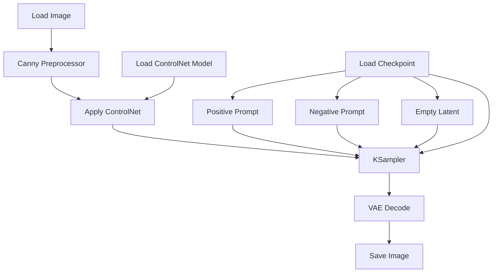

**节点详解:**

**Load ControlNet Model**
```java
// 功能: 加载 ControlNet 模型
// 路径: models/controlnet/
// 模型命名示例:
// - control_v11p_sd15_canny.pth
// - control_v11f1p_sd15_depth.pth
// - control_v11p_sd15_openpose.pth
```

**Apply ControlNet**
```java
strength: 0.5-1.0     // ControlNet 影响强度
start_percent: 0.0    // 开始影响的采样百分比
end_percent: 1.0      // 结束影响的采样百分比

// 例如:
// start_percent: 0.0, end_percent: 0.5
// 表示仅在前 50% 的采样步骤中应用 ControlNet
```

#### 多个 ControlNet 组合

**Canny + Depth 组合**
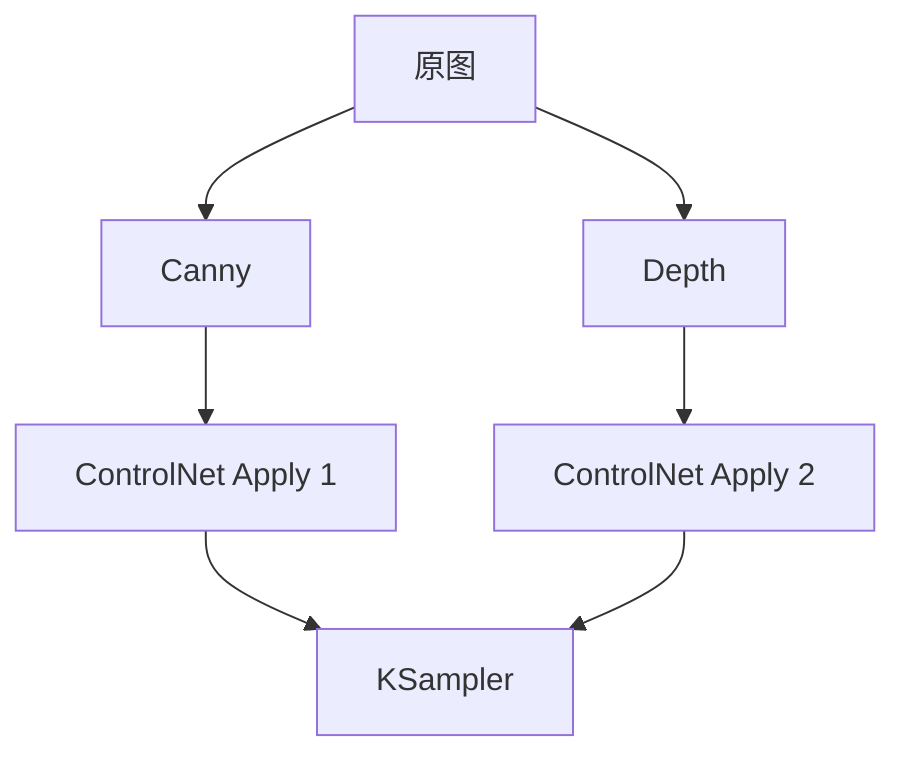

**应用场景:**
- Canny 保持边缘,Depth 保持空间
- 更精准的结构控制
- 适合建筑和室内设计

**参数建议:**
```java
// Canny
strength: 0.6

// Depth
strength: 0.4

// 总强度不超过 1.2,避免过度约束
```

### 2.4 ControlNet 实战案例

#### 案例 1: 线稿上色
```java
// 步骤:
1. 准备黑白线稿图片
2. 使用 Lineart ControlNet
3. 提示词描述颜色和风格
4. 生成彩色图片

// 配置:
ControlNet: lineart_anime
strength: 1.0
提示词: "colorful, vibrant colors, anime style"
steps: 28
cfg: 7
```

#### 案例 2: 姿态迁移
```java
// 目标: 将 A 图的姿态应用到 B 角色上
// 步骤:
1. 使用 OpenPose 提取 A 图姿态
2. 保存姿态图
3. 加载姿态图到 ControlNet
4. 提示词描述 B 角色特征
5. 生成具有 A 姿态的 B 角色

// 配置:
ControlNet: openpose
strength: 0.9
提示词: "[B角色描述], [A姿态动作]"
```

#### 案例 3: 建筑重设计
```java
// 目标: 保持建筑结构,改变风格
// 步骤:
1. Canny 提取建筑边缘
2. Depth 提取空间深度
3. 提示词描述新风格
4. 生成新风格建筑

// 配置:
ControlNet 1: canny (strength 0.6)
ControlNet 2: depth (strength 0.4)
提示词: "modern architecture, glass facade, futuristic"
denoise: 0.7
```

---

## 第三部分: LoRA 模型使用

### 3.1 LoRA 基础知识

#### 什么是 LoRA?

**定义:**
- LoRA = Low-Rank Adaptation (低秩适应)
- 轻量级的模型微调方法
- 文件小 (10MB-200MB)
- 可叠加使用

**LoRA vs Checkpoint**

| 特性 | Checkpoint | LoRA |
|------|-----------|------|
| 文件大小 | 2-7 GB | 10-200 MB |
| 训练成本 | 高 | 低 |
| 使用方式 | 独立使用 | 叠加到 Checkpoint |
| 灵活性 | 低 | 高(可组合) |

#### LoRA 分类

**风格 LoRA**
```java
// 特定艺术风格
- 油画风格
- 水彩风格
- 赛博朋克
- 吉卜力风格

// 使用强度: 0.6-1.0
```

**人物 LoRA**
```java
// 特定角色或人物
- 明星面容
- 动漫角色
- 虚拟偶像

// 使用强度: 0.5-0.8
```

**概念 LoRA**
```java
// 特定概念或场景
- 特殊光照效果
- 特定服装
- 场景元素

// 使用强度: 0.4-0.7
```

### 3.2 LoRA 加载和使用

#### 基础工作流
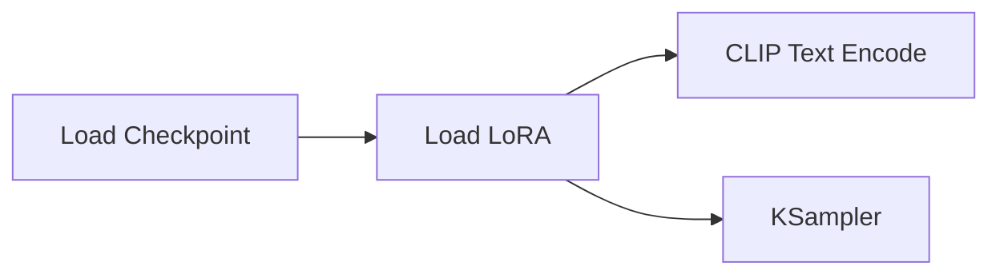

**Load LoRA 节点**
```java
// 输入:
model: 来自 Load Checkpoint 或上一个 Load LoRA
clip: 来自 Load Checkpoint 或上一个 Load LoRA

// 参数:
lora_name: LoRA 文件名
strength_model: 模型强度 (0.0-2.0)
strength_clip: CLIP 强度 (0.0-2.0)

// 输出:
MODEL: 应用 LoRA 后的模型
CLIP: 应用 LoRA 后的 CLIP
```

#### 参数调优

**strength_model (模型强度)**
```java
0.0         // 不应用 LoRA
0.3-0.5     // 轻微影响
0.6-0.8     // 推荐范围
0.9-1.2     // 强烈影响
1.5+        // 可能过度,出现异常
```

**strength_clip (CLIP 强度)**
```java
// 通常与 strength_model 保持一致
// 某些情况下可以独立调整:

strength_model: 0.8
strength_clip: 0.6
// 保留 LoRA 的视觉特征,减少对提示词理解的影响
```

### 3.3 多 LoRA 叠加技巧

#### 叠加原理
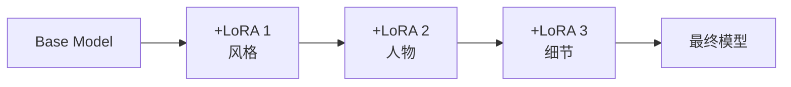

#### 叠加策略

**策略 1: 递减强度**
```java
// 从重要到次要,强度递减
Load Checkpoint
  ↓
Load LoRA 1 (主要风格, strength: 0.8)
  ↓
Load LoRA 2 (人物特征, strength: 0.6)
  ↓
Load LoRA 3 (细节调整, strength: 0.4)
```

**策略 2: 分层控制**
```java
// 风格层
LoRA 1: 艺术风格 (strength: 0.7)

// 内容层
LoRA 2: 人物特征 (strength: 0.8)

// 效果层
LoRA 3: 光影效果 (strength: 0.5)
```

**策略 3: 互补组合**
```java
// 示例: 生成赛博朋克风格的吉卜力角色
LoRA 1: cyberpunk_style (0.6)
LoRA 2: ghibli_character (0.7)

// 结果: 融合两种风格的独特图像
```

#### 注意事项

```java
// ❌ 避免:
// 1. 叠加超过 4 个 LoRA
// 2. 总强度超过 2.5
// 3. 相互冲突的 LoRA

// ✅ 推荐:
// 1. 最多 3 个 LoRA
// 2. 总强度 1.5-2.0
// 3. 互补或协同的 LoRA
```

### 3.4 LoRA 实战案例

#### 案例 1: 特定角色生成
```java
// 目标: 生成特定动漫角色
// 配置:
Base Model: Anything V5
LoRA 1: character_sakura (strength: 0.8)
LoRA 2: anime_detail (strength: 0.5)

// 提示词:
"1girl, [角色特征], smile, outdoor"

// 结果: 高度还原的角色图像
```

#### 案例 2: 复古电影风格
```java
// 目标: 生成 80 年代电影海报风格
// 配置:
Base Model: Realistic Vision
LoRA 1: 80s_movie_poster (strength: 0.9)
LoRA 2: film_grain (strength: 0.6)

// 提示词:
"movie poster, retro, 1980s style, dramatic lighting"

// 结果: 复古电影海报效果
```

---

## 第四部分: 高清修复工作流

### 4.1 Hires.fix 原理

#### 为什么需要高清修复?

**问题:**
```java
// 直接生成高分辨率 (如 2048×2048)
问题 1: 显存消耗巨大
问题 2: 可能出现重复元素
问题 3: 细节异常和畸形
```

**解决方案: 两阶段生成**
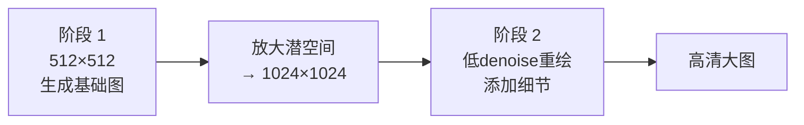

### 4.2 Hires.fix 工作流搭建

#### 标准工作流
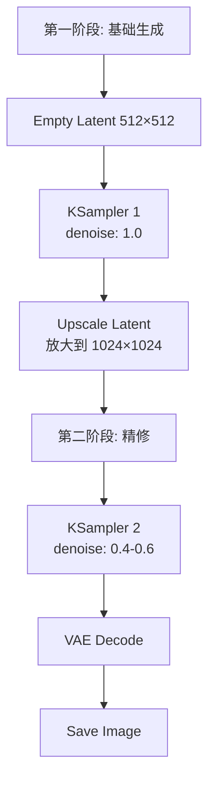

**关键节点配置:**

**Upscale Latent by**
```java
upscale_method: "nearest-exact"  // 推荐
                "bilinear"       // 更平滑
                "bislerp"        // 高质量

scale_by: 2.0  // 放大倍数,常用 1.5-2.0
```

**KSampler 2 (精修阶段)**
```java
seed: 与第一阶段相同  // 保持一致性
steps: 15-25          // 少于第一阶段
cfg: 7-9
sampler_name: dpm++_2m
denoise: 0.4-0.6      // 关键!控制精修程度
```

### 4.3 Denoise 精修强度

```java
denoise: 0.3-0.4  // 保守,仅增强细节
denoise: 0.4-0.5  // 平衡,推荐
denoise: 0.5-0.6  // 激进,可能改变构图
denoise: 0.7+     // 过度,不推荐
```

### 4.4 高级技巧

#### 多阶段放大
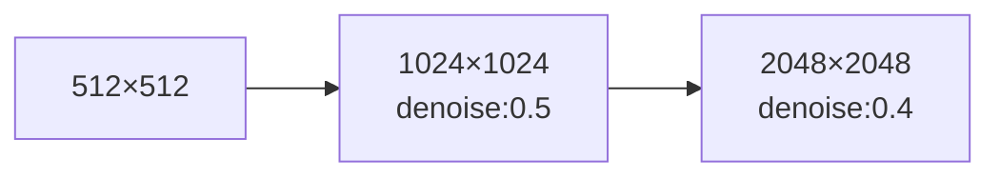

**优势:**
- 更渐进,更稳定
- 每阶段都能优化细节
- 适合超高分辨率

#### 面部修复集成
```java
// 在 Hires.fix 之后添加
KSampler 2 → VAE Decode
  ↓
Face Restore (CodeFormer)
  ↓
Save Image
```

---

## 第五部分: 局部重绘 (Inpainting)

### 5.1 Inpainting 原理

#### 什么是局部重绘?
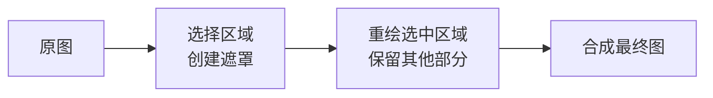

**应用场景:**
- 替换图片中的物体
- 修复瑕疵和污渍
- 添加新元素
- 扩展图片边界 (Outpainting)

### 5.2 Inpainting 工作流

#### 基础工作流
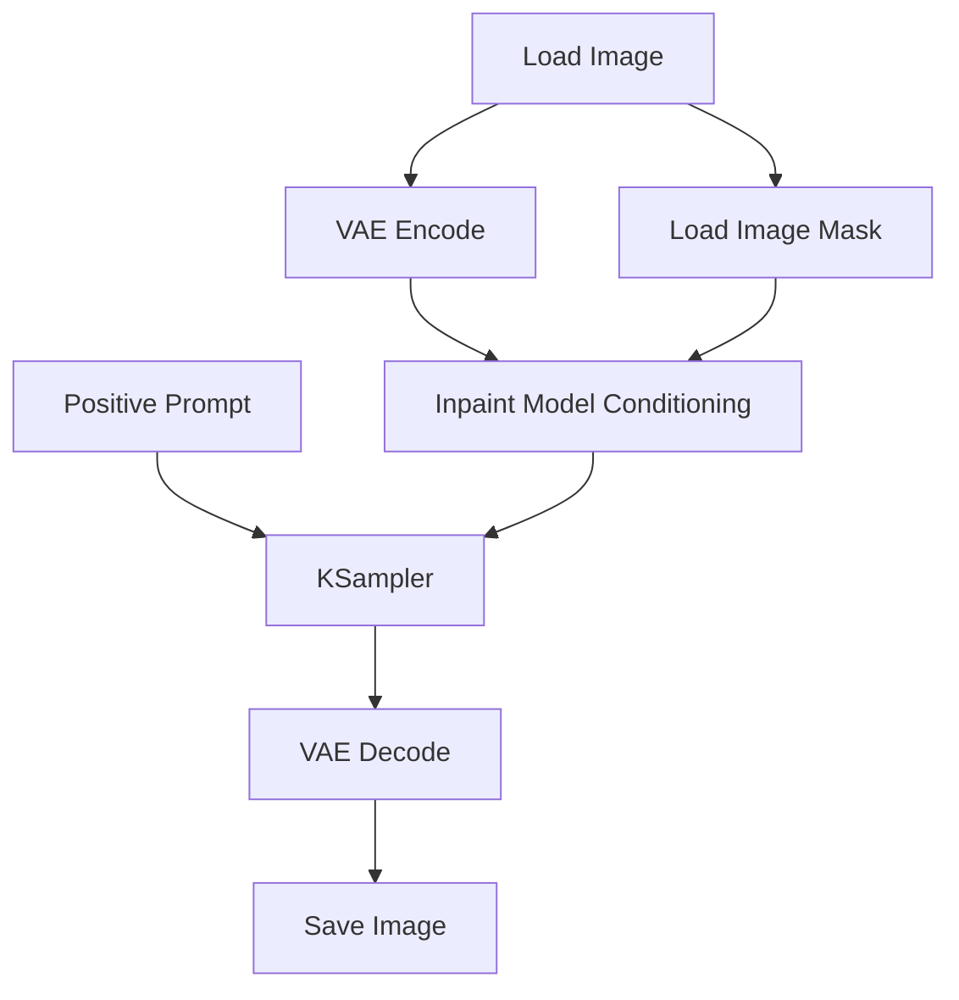

**关键节点:**

**Load Image (Mask)**
```java
// 方法 1: 在图像编辑软件中创建遮罩
// - 黑色区域: 保留
// - 白色区域: 重绘

// 方法 2: 使用 ComfyUI 内置遮罩工具
// - 直接在预览图上绘制遮罩
```

**VAE Encode (for Inpainting)**
```java
// 功能: 编码图片和遮罩
// 输入: IMAGE, MASK
// 输出: LATENT (包含遮罩信息)
```

**KSampler 配置**
```java
denoise: 0.9-1.0  // Inpaint 通常使用高 denoise
steps: 30-40      // 比普通生成多一些
cfg: 7-9
```

### 5.3 Inpainting 实战技巧

#### 技巧 1: 遮罩边缘羽化
```java
// 问题: 遮罩边缘生硬,产生明显接缝
// 解决: 使用羽化(feather)节点

Load Image Mask
  ↓
Feather Mask (左右上下各羽化 20 像素)
  ↓
VAE Encode for Inpainting
```

#### 技巧 2: 扩大重绘区域
```java
// 让 AI 更好地理解上下文
// 遮罩范围应该比目标物体稍大

// 例如: 替换人物衣服
// 不仅遮住衣服,还包括部分皮肤和背景边缘
```

#### 技巧 3: 迭代优化
```java
// 第一次重绘可能不完美
// 可以多次局部重绘,逐步完善

第一次: 重绘主要区域
  ↓
第二次: 修复细节瑕疵
  ↓
第三次: 边缘融合
```

### 5.4 Outpainting (边界扩展)

#### 工作流
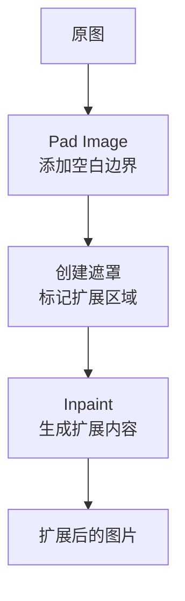

**步骤:**
1. 使用 Pad Image 节点扩展画布
2. 创建遮罩,标记新增区域
3. 提示词描述希望生成的内容
4. Inpaint 生成扩展部分

---

## 第六部分: 工作流优化

### 6.1 性能优化

#### 显存优化
```java
// 1. 启动参数
python main.py --lowvram        // 低显存模式
python main.py --normalvram     // 普通显存模式
python main.py --highvram       // 高显存模式(最快)

// 2. 模型精度
使用 fp16 模型代替 fp32  // 节省 50% 显存

// 3. 分辨率控制
512×512   → 4GB 显存
768×768   → 6GB 显存
1024×1024 → 8GB+ 显存
```

#### 速度优化
```java
// 1. 选择快速采样器
euler         // 最快
dpm++_2m      // 平衡
ddim          // 稳定但慢

// 2. 减少采样步数
预览: 15-20 步
正式: 25-30 步
精修: 35-40 步

// 3. 安装 xformers
pip install xformers
// 可提速 20-30%
```

### 6.2 工作流组织

#### 模块化设计
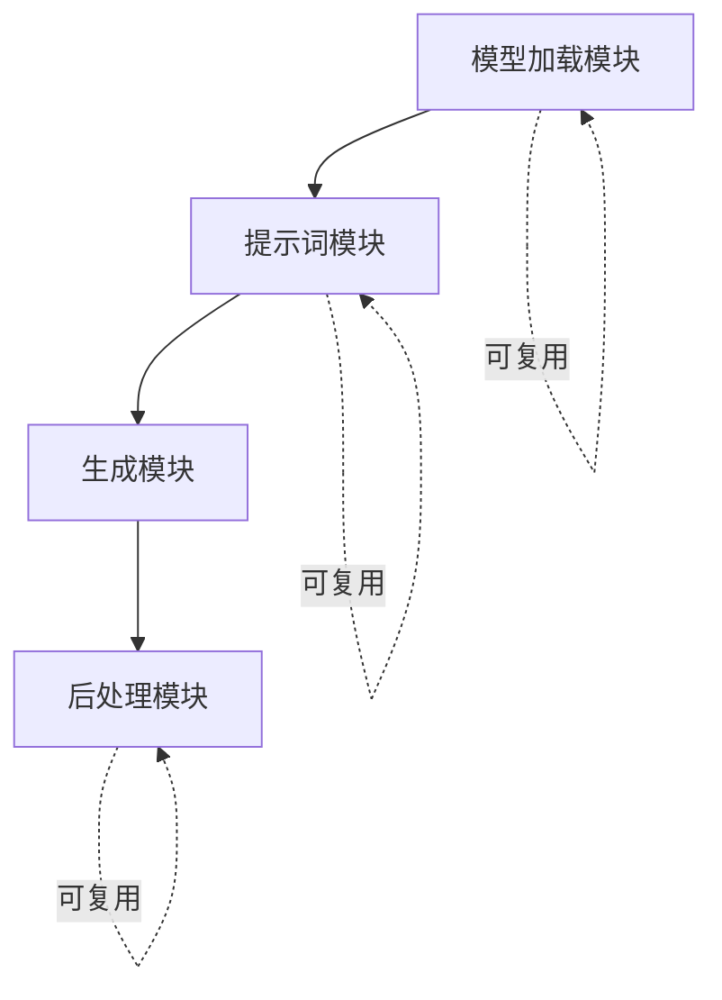

**优势:**
- 提高复用性
- 便于调试
- 易于分享

#### 工作流模板库

**建议创建的模板:**
```java
1. 文生图标准模板
2. 图生图标准模板
3. ControlNet 基础模板
4. Hires.fix 模板
5. Inpaint 模板
6. 批量处理模板
```

### 6.3 常用节点组合

#### 组合 1: 质量提升包
```java
KSampler
  ↓
Face Restore (修复面部)
  ↓
Upscale Image (放大)
  ↓
Sharpen (锐化)
  ↓
Save Image
```

#### 组合 2: 风格探索包
```java
同一 Seed
  ↓
不同 CFG 值 (5, 7, 9, 11, 13)
  ↓
批量生成
  ↓
对比选择最佳
```

---

## 📖 总结

通过本章学习,你已经掌握:

1. **图生图技术**: 精准控制生成结果
2. **ControlNet**: 结构化控制图像生成
3. **LoRA 使用**: 灵活叠加模型特征
4. **高清修复**: 高效生成高分辨率图片
5. **局部重绘**: 精细修改图片局部
6. **性能优化**: 提升工作流效率

**下一步学习:**
- [ComfyUI 常用工作流案例](./04-ComfyUI常用工作流案例.md)
- [ComfyUI 插件和自定义节点](./05-ComfyUI插件生态.md)

---

> **实践建议**: 每天尝试一个新技巧,通过实际项目巩固所学知识。记录成功的参数配置,建立自己的经验库。
