# ComfyUI 常用工作流案例大全

## 🎯 本章目标

本章提供实用的工作流案例,涵盖:
- ✅ 人物肖像生成工作流
- ✅ 产品设计工作流
- ✅ 场景概念设计工作流
- ✅ 批量处理工作流
- ✅ 视频生成工作流
- ✅ 商业应用工作流

每个案例都包含完整的工作流结构、参数配置和实战技巧。

---

## 第一部分: 人物肖像工作流

### 1.1 写实人像生成

#### 工作流结构
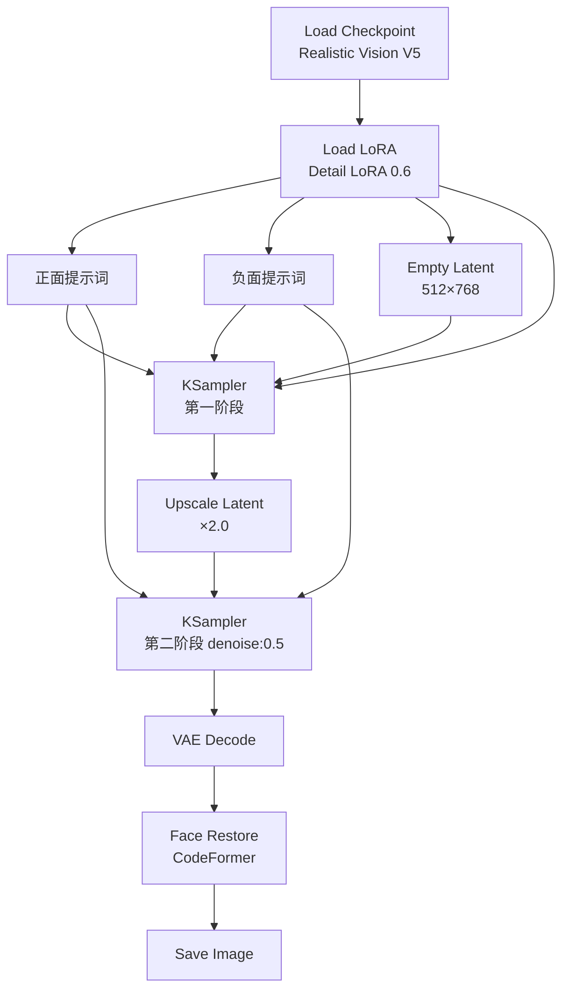

#### 参数配置

**模型选择**
```java
Checkpoint: realisticVisionV51_v51VAE.safetensors
LoRA: add_detail (strength: 0.6)
```

**第一阶段 (基础生成)**
```java
Empty Latent:
  width: 512
  height: 768

KSampler:
  seed: -1
  steps: 28
  cfg: 7.5
  sampler_name: dpm++_2m
  scheduler: karras
  denoise: 1.0
```

**第二阶段 (高清精修)**
```java
Upscale Latent:
  scale_by: 2.0
  method: nearest-exact

KSampler:
  steps: 20
  cfg: 7.5
  denoise: 0.5
```

**面部修复**
```java
Face Restore:
  model: codeformer
  weight: 0.7  // 0.5-0.8,数值越高修复越强
```

#### 提示词模板

**正面提示词**
```
(masterpiece:1.2), (best quality:1.2), (ultra detailed:1.2),
(realistic:1.3), (photorealistic:1.3),

# 人物主体
1girl, 25 years old, beautiful face,
detailed eyes, detailed pupils, long eyelashes,
natural skin texture, subtle freckles,

# 发型
long brown hair, wavy hair, hair blowing in wind,

# 表情和姿态
gentle smile, looking at viewer,
natural pose, relaxed posture,

# 服装
white cotton dress, casual style,

# 环境
outdoor, garden, soft sunlight,
bokeh background, depth of field,

# 质量标签
professional photography, 8k uhd, dslr,
soft lighting, high quality, film grain
```

**负面提示词**
```
(worst quality:1.4), (low quality:1.4),
ugly, deformed, disfigured,
bad anatomy, bad proportions,
bad hands, missing fingers, extra fingers,
fused fingers, too many fingers,
long neck, cross-eyed,
blurry, out of focus, jpeg artifacts,
watermark, signature, username,
oversaturated, overexposed, underexposed
```

#### 实战技巧

**技巧 1: 肤质细节控制**
```java
// 添加细节
提示词: "natural skin texture, pores, subtle imperfections"
LoRA: add_detail (0.6)

// 平滑皮肤
提示词: "smooth skin, flawless"
降低 add_detail LoRA 强度到 0.3
```

**技巧 2: 光影控制**
```java
// 自然光
"natural lighting, soft sunlight, golden hour"

// 摄影棚光
"studio lighting, professional lighting, rim light, key light"

// 戏剧化光影
"dramatic lighting, chiaroscuro, side lighting"
```

**技巧 3: 背景虚化**
```java
提示词: "bokeh background, shallow depth of field, f/1.8"
CFG: 8-9  // 稍高的 CFG 有助于实现虚化
```

### 1.2 动漫人物生成

#### 工作流结构
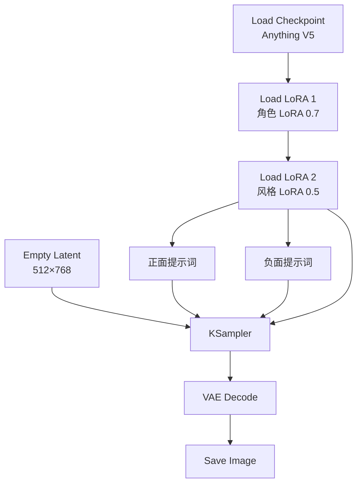

#### 提示词模板

**正面提示词**
```
(masterpiece:1.2), (best quality:1.2),
(ultra detailed:1.2), (illustration:1.2),

# 人物主体
1girl, anime style, cute face,
big eyes, sparkling eyes, detailed eyes,
long hair, twin tails, hair ornament,

# 服装
school uniform, white shirt, red ribbon,
plaid skirt, thigh highs,

# 表情和动作
smile, happy, cheerful,
peace sign, dynamic pose,

# 场景
cherry blossoms, spring, petals flying,
blue sky, white clouds,

# 质量和风格
vibrant colors, cel shading,
anime coloring, clean lines,
high resolution, detailed background
```

**负面提示词**
```
(worst quality:1.4), (low quality:1.4),
lowres, bad anatomy, bad hands,
text, error, missing fingers, extra digit,
cropped, normal quality, jpeg artifacts,
signature, watermark, username,
blurry, artist name, realistic, 3d
```

---

## 第二部分: 产品设计工作流

### 2.1 产品渲染工作流

#### 应用场景
- 电商产品图
- 产品概念设计
- 包装设计展示
- 工业设计效果图

#### 工作流结构
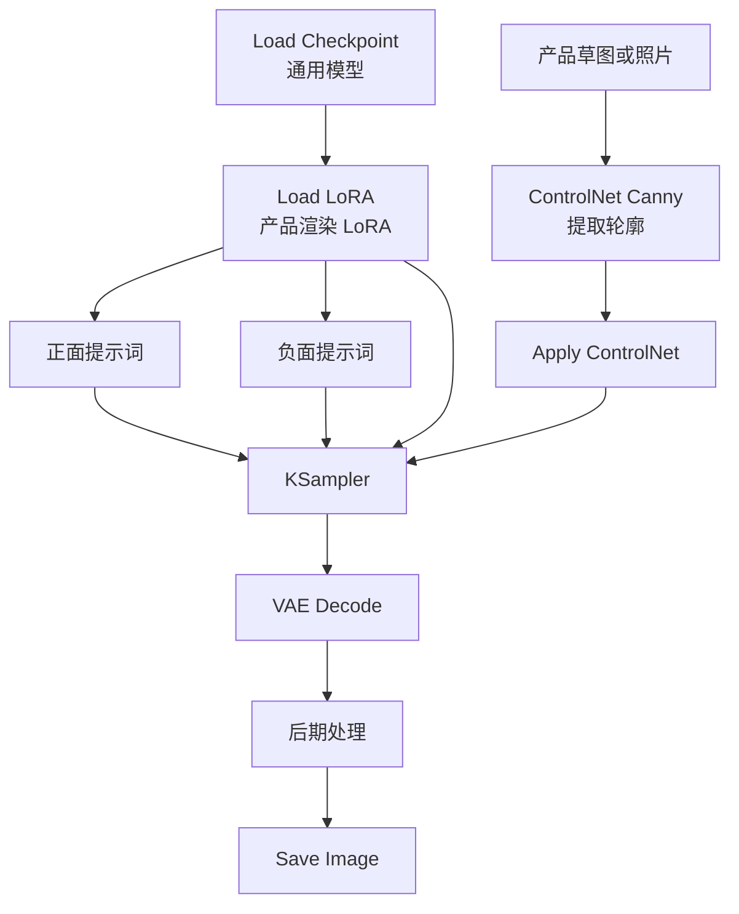

#### 提示词模板

**智能手机渲染**
```
正面提示词:
product photography, professional,
smartphone, sleek design, modern,
metallic finish, glass surface,
studio lighting, white background,
highly detailed, 8k, commercial photography,
reflections, premium quality

负面提示词:
low quality, blurry, distorted,
scratches, fingerprints, dust,
bad proportions, amateur
```

**化妆品渲染**
```
正面提示词:
luxury cosmetics, perfume bottle,
elegant design, crystal clear glass,
golden accents, minimalist,
soft lighting, gradient background,
product photography, commercial,
high-end, detailed reflections

负面提示词:
cheap, plastic, low quality,
messy, cluttered, bad lighting
```

#### 实战技巧

**技巧 1: 背景替换**
```java
// 工作流:
原产品图 (白底) → ControlNet Canny
  ↓
提示词: "产品描述 + 新背景描述"
  ↓
denoise: 0.6-0.7
  ↓
生成新背景的产品图
```

**技巧 2: 材质变化**
```java
// 示例: 将塑料瓶改为玻璃瓶
原图 → ControlNet Depth (保持形状)
  ↓
提示词: "glass bottle, transparent, reflections"
  ↓
denoise: 0.6
```

### 2.2 批量产品图生成

#### 工作流结构
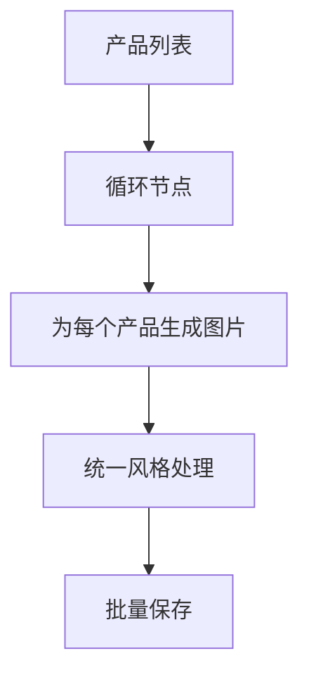

#### 实现方法

**方法 1: 使用 Batch 节点**
```java
// 一次加载多张产品图
Load Image Batch
  ↓
Apply ControlNet
  ↓
KSampler (batch_size: N)
  ↓
批量输出
```

**方法 2: 循环工作流**
```java
// 需要自定义节点支持
// 推荐使用 ComfyUI Manager 安装循环节点
```

---

## 第三部分: 场景概念设计

### 3.1 建筑外观设计

#### 工作流结构
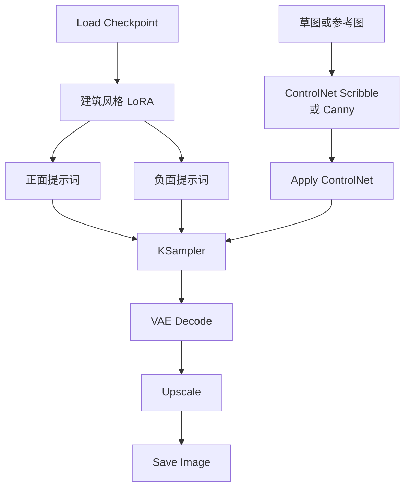

#### 提示词模板

**现代建筑**
```
正面提示词:
modern architecture, contemporary design,
glass facade, steel structure,
minimalist, clean lines,
geometric shapes, futuristic,
blue sky, daytime, professional photography,
architectural visualization, 8k, highly detailed

负面提示词:
old, rusty, damaged, low quality,
blurry, distorted perspective
```

**古典建筑**
```
正面提示词:
classical architecture, baroque style,
ornate details, columns, arches,
stone facade, grand entrance,
historical, elegant, symmetrical,
golden hour lighting, dramatic sky,
architectural photography, masterpiece

负面提示词:
modern, minimalist, glass, steel,
low quality, simple, plain
```

#### 实战技巧

**技巧 1: 多角度生成**
```java
// 使用相同的 seed,不同的视角提示词
seed: 固定值

提示词变化:
"front view, entrance" → 正面图
"aerial view, top down" → 鸟瞰图
"side view, profile" → 侧面图
"interior view, lobby" → 室内图
```

**技巧 2: 时间变化**
```java
// 展示不同时段的效果
相同建筑 + 不同光照:
"sunrise, golden hour, warm tones"
"midday, bright sunlight, clear sky"
"sunset, orange sky, dramatic"
"night, illuminated, city lights"
```

### 3.2 室内设计工作流

#### 工作流结构
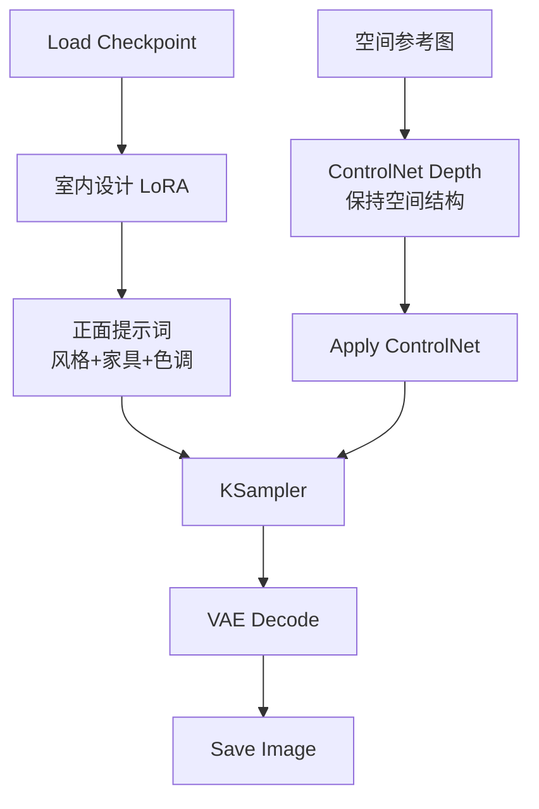

#### 提示词模板

**现代简约客厅**
```
正面提示词:
modern living room, minimalist interior design,
white walls, wooden floor, large windows,
gray sofa, coffee table, indoor plants,
natural lighting, bright and airy,
Scandinavian style, cozy atmosphere,
interior photography, 8k, highly detailed

负面提示词:
cluttered, messy, dark, cramped,
low quality, blurry, distorted perspective
```

**豪华卧室**
```
正面提示词:
luxury bedroom, elegant interior,
king size bed, velvet headboard,
marble floor, crystal chandelier,
soft lighting, warm tones,
classic furniture, sophisticated,
interior design photography, high-end

负面提示词:
cheap, simple, small, crowded,
poor lighting, low quality
```

---

## 第四部分: 批量处理工作流

### 4.1 参数扫描工作流

#### 应用场景
- 测试不同 CFG 值的效果
- 对比不同采样器
- 探索最佳参数组合

#### 工作流结构
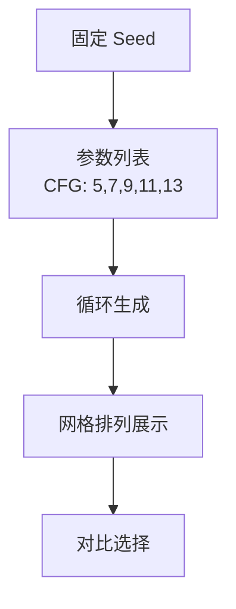

#### 实现方法

**方法 1: 手动调整**
```java
// 保持 seed 不变
seed: 12345

// 依次测试:
CFG: 5.0 → Queue → 保存
CFG: 7.0 → Queue → 保存
CFG: 9.0 → Queue → 保存
CFG: 11.0 → Queue → 保存
CFG: 13.0 → Queue → 保存
```

**方法 2: 使用 XY Plot 节点**
```java
// 需要安装 Efficiency Nodes
XY Plot:
  X轴: CFG (5, 7, 9, 11, 13)
  Y轴: Steps (20, 25, 30)

// 自动生成 15 张图片的对比网格
```

### 4.2 风格探索工作流

#### 工作流结构
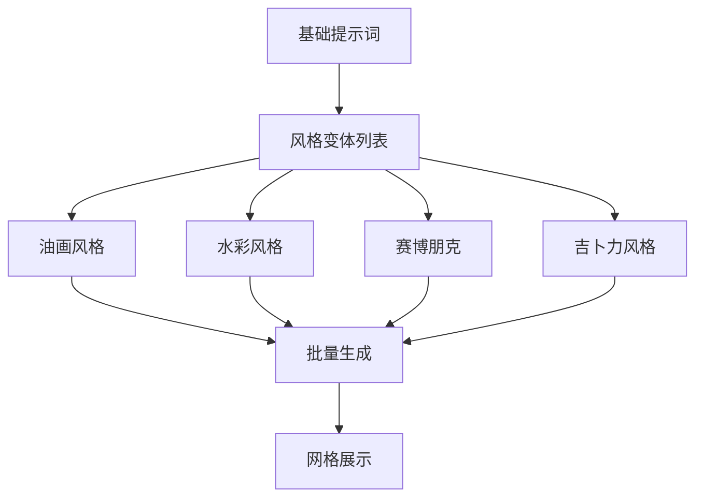

#### 提示词变体

```java
// 基础描述
base_prompt = "a beautiful landscape, mountains, lake"

// 风格变体
variants = [
    base_prompt + ", oil painting, brush strokes, classic art",
    base_prompt + ", watercolor, soft colors, dreamy",
    base_prompt + ", cyberpunk, neon lights, futuristic",
    base_prompt + ", studio ghibli style, anime, hand drawn",
    base_prompt + ", photorealistic, 8k, professional photography"
]

// 依次生成每个风格
```

---

## 第五部分: 视频生成工作流

### 5.1 AnimateDiff 基础工作流

#### 工作流结构
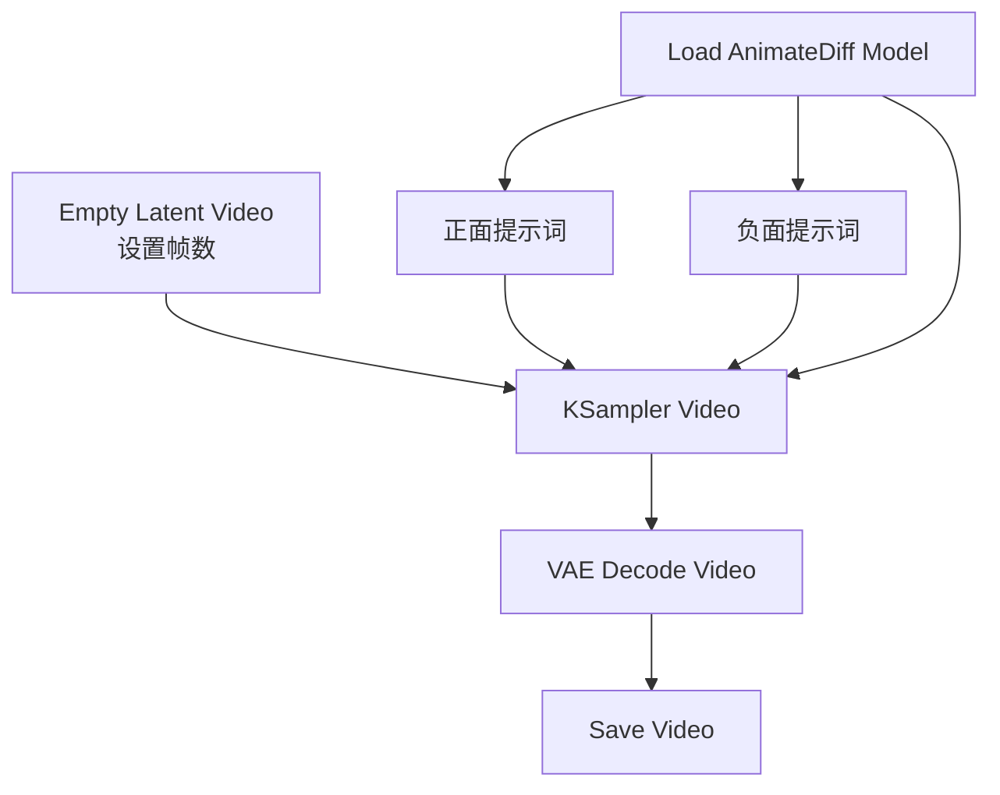

#### 参数配置

**Empty Latent Video**
```java
width: 512
height: 512
batch_size: 16     // 帧数,推荐 16/24/32
```

**KSampler 配置**
```java
steps: 25-30       // 视频生成需要更多步数
cfg: 7-9
sampler_name: euler_a  // 推荐用于视频
motion_scale: 1.0  // 运动幅度 (0.5-1.5)
```

**AnimateDiff Model**
```java
// 常用模型:
mm_sd_v15.ckpt           // 基础运动模型
mm_sd_v15_v2.ckpt        // 改进版
temporalDiff-v1-animatediff.ckpt  // 时序优化
```

#### 提示词技巧

**静态场景微动**
```
正面提示词:
a girl standing in garden,
gentle breeze, hair flowing,
subtle movement, peaceful,
masterpiece, high quality

# 关键: 描述轻微动作
# 避免: 剧烈运动描述
```

**动态场景**
```
正面提示词:
a girl walking in the street,
dynamic movement, flowing dress,
camera following, cinematic,
smooth motion, high quality

# 关键: 明确描述动作
# 运动方向和幅度
```

### 5.2 图片转视频工作流

#### 工作流结构
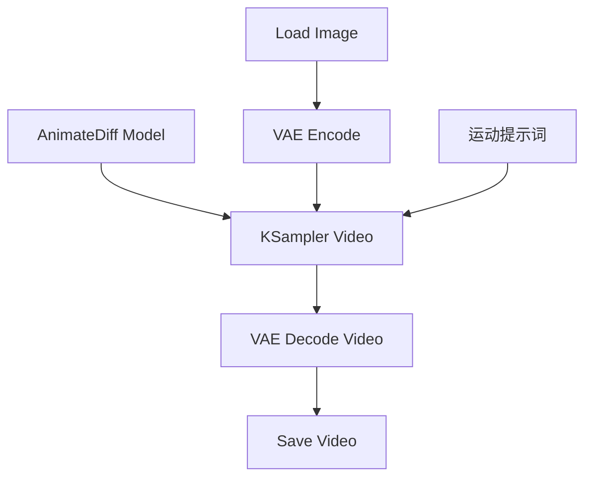

#### 参数配置

**关键参数**
```java
denoise: 0.7-0.9   // 控制运动幅度
                   // 0.7: 轻微运动
                   // 0.9: 明显运动

motion_scale: 0.5-1.5  // 运动强度
batch_size: 16-24      // 视频长度(帧数)
```

#### 实战案例

**案例 1: 人物微笑动画**
```java
输入图片: 女孩中性表情
提示词: "gentle smile, subtle expression change"
denoise: 0.75
帧数: 16
结果: 从中性到微笑的平滑过渡
```

**案例 2: 风景动态化**
```java
输入图片: 静态风景照
提示词: "clouds moving, water flowing, gentle breeze"
denoise: 0.7
帧数: 24
结果: 云朵飘动、水面波动的动态场景
```

---

## 第六部分: 商业应用工作流

### 6.1 社交媒体内容生成

#### 九宫格图集工作流

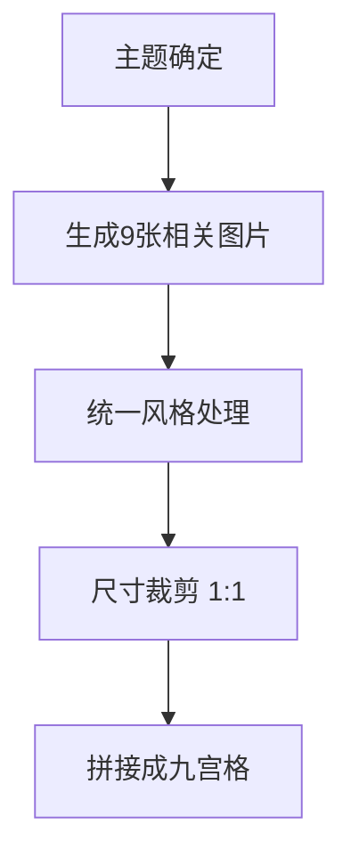

**实现步骤:**

**步骤 1: 设计主题**
```java
主题: "春日穿搭"
子主题列表:
1. 碎花连衣裙
2. 白色T恤+牛仔裤
3. 针织开衫
4. 运动休闲风
5. 配饰特写(帽子)
6. 配饰特写(包包)
7. 鞋子特写
8. 整体搭配1
9. 整体搭配2
```

**步骤 2: 批量生成**
```java
// 保持统一风格
Checkpoint: 同一模型
LoRA: 同一风格 LoRA
Seed: 相近的 seed (如 1000, 1001, 1002...)

尺寸: 1024×1024 (正方形)
```

**步骤 3: 后期拼接**
```java
// 使用图片编辑软件
// 或 ComfyUI 的网格节点
Grid Image:
  rows: 3
  columns: 3
  spacing: 10px
```

### 6.2 品牌视觉设计

#### Logo 设计辅助工作流

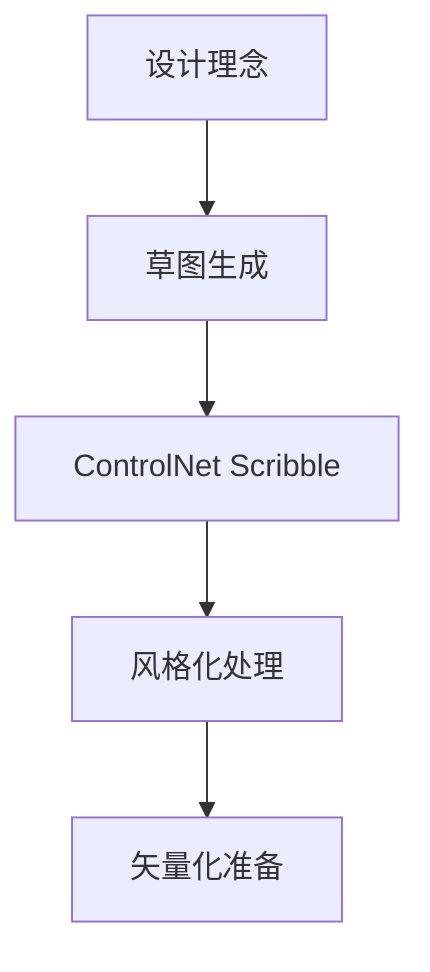

**提示词模板**
```
正面提示词:
logo design, minimalist, modern,
simple shapes, clean lines,
geometric, professional,
vector style, flat design,
white background, high contrast,
corporate identity

负面提示词:
complex, detailed, realistic,
3d, shading, gradient,
photographic, cluttered
```

### 6.3 电商主图生成

#### 工作流结构
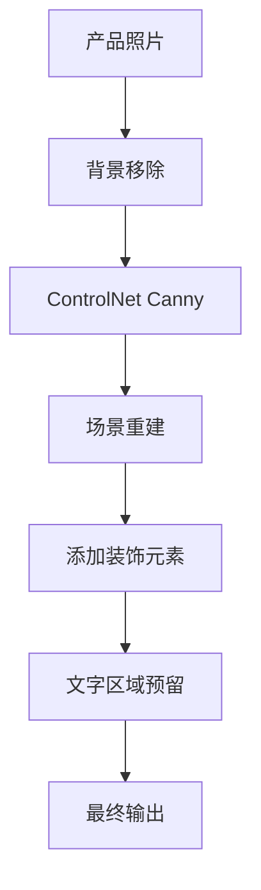

#### 实战技巧

**技巧 1: 白底转场景**
```java
// 输入: 产品白底图
// 目标: 生活场景图

ControlNet Canny (strength: 0.8)
  ↓
提示词: "产品 + 生活场景描述"
例如: "coffee cup on wooden table, morning light, cozy cafe"
  ↓
denoise: 0.6
```

**技巧 2: 季节主题**
```java
// 同一产品,不同季节氛围
春季: "cherry blossoms, spring, pastel colors"
夏季: "beach, summer, bright sunlight"
秋季: "autumn leaves, warm tones, cozy"
冬季: "snow, winter, cold tones, warm lighting"
```

---

## 第七部分: 工作流优化技巧

### 7.1 工作流模板管理

#### 推荐的文件夹结构
```
ComfyUI_Workflows/
├── 00_基础模板/
│   ├── 文生图标准.json
│   ├── 图生图标准.json
│   └── ControlNet标准.json
├── 01_人物生成/
│   ├── 写实肖像.json
│   ├── 动漫角色.json
│   └── 全身照.json
├── 02_场景设计/
│   ├── 建筑外观.json
│   ├── 室内设计.json
│   └── 自然风景.json
├── 03_产品设计/
│   ├── 产品渲染.json
│   └── 包装设计.json
└── 04_特殊效果/
    ├── 高清修复.json
    ├── 局部重绘.json
    └── 视频生成.json
```

### 7.2 参数预设管理

#### 创建参数预设文件
```java
// presets.json
{
  "portrait_realistic": {
    "steps": 28,
    "cfg": 7.5,
    "sampler": "dpm++_2m",
    "scheduler": "karras",
    "resolution": "512x768"
  },
  "landscape": {
    "steps": 25,
    "cfg": 7.0,
    "sampler": "euler",
    "scheduler": "normal",
    "resolution": "768x512"
  },
  "product": {
    "steps": 30,
    "cfg": 8.0,
    "sampler": "dpm++_2m",
    "scheduler": "karras",
    "resolution": "1024x1024"
  }
}
```

### 7.3 提示词库管理

#### 分类整理提示词

**quality_positive.txt**
```
masterpiece, best quality, ultra detailed, 8k uhd,
high resolution, professional, extremely detailed
```

**quality_negative.txt**
```
worst quality, low quality, normal quality,
lowres, blurry, jpeg artifacts, ugly,
bad anatomy, bad proportions
```

**style_photography.txt**
```
professional photography, dslr, bokeh,
shallow depth of field, natural lighting,
golden hour, soft focus
```

**style_anime.txt**
```
anime style, manga, cel shading,
vibrant colors, clean lines,
detailed eyes, colorful
```

---

## 📖 实战项目建议

### 初级项目 (1-2周)
1. **个人头像生成器**: 生成10个不同风格的头像
2. **风景壁纸集**: 制作一套主题壁纸
3. **产品mockup**: 为虚拟产品制作展示图

### 中级项目 (2-4周)
1. **角色设计集**: 设计一个完整的角色(多角度、多表情)
2. **室内设计方案**: 为一个空间设计3种风格方案
3. **品牌视觉系统**: 为虚拟品牌设计视觉素材

### 高级项目 (1-2个月)
1. **短视频制作**: 使用 AnimateDiff 制作15秒短视频
2. **自动化工作流**: 开发批量处理工作流
3. **插件开发**: 创建自定义节点

---

## 📚 总结

通过本章的学习,你已经掌握:

1. **人物生成**: 写实和动漫风格的人物创作
2. **产品设计**: 商业级产品图生成
3. **场景设计**: 建筑和室内设计应用
4. **批量处理**: 高效的批量生成方法
5. **视频生成**: AnimateDiff 视频制作
6. **商业应用**: 实际项目中的应用技巧

**下一步学习:**
- [ComfyUI 插件生态](./05-ComfyUI插件生态.md)
- [ComfyUI 自定义节点开发](./06-ComfyUI自定义节点开发.md)

---

> **实践建议**: 选择一个你感兴趣的方向,深入实践。建立自己的工作流模板库和提示词库,不断优化和积累经验。
