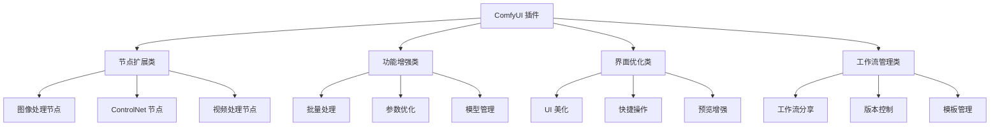
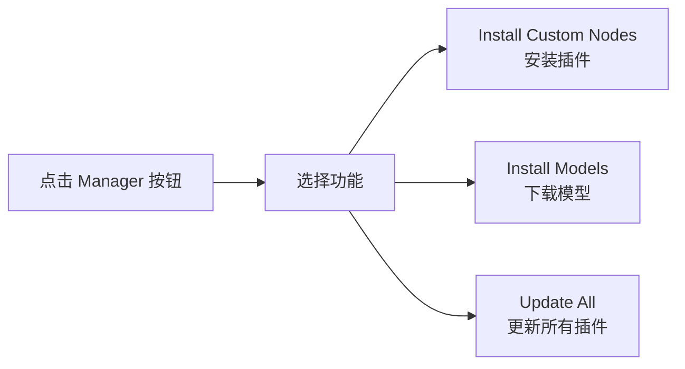
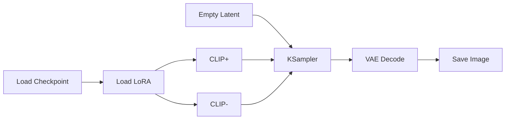
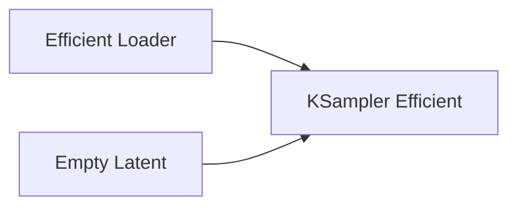
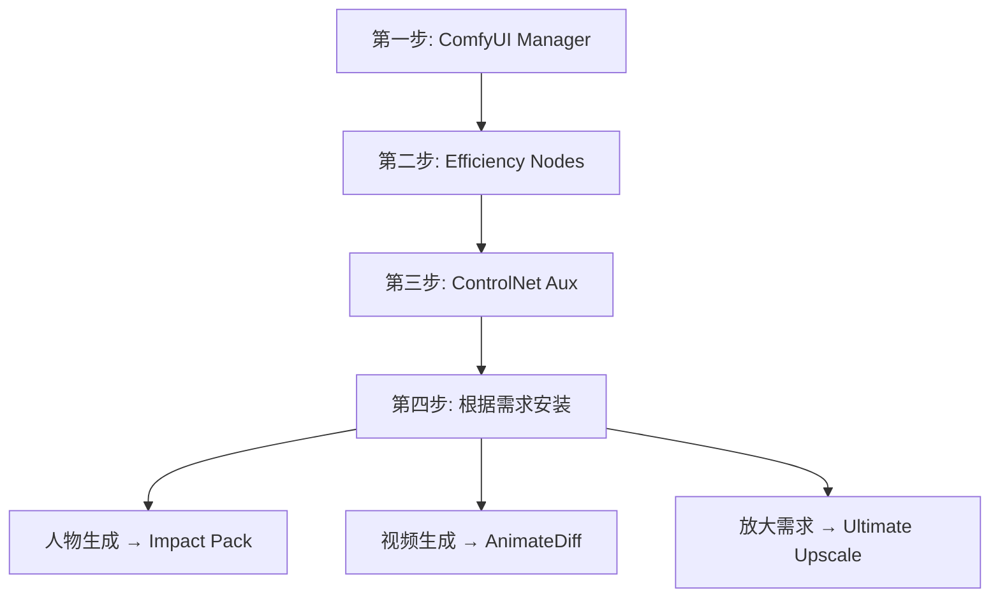
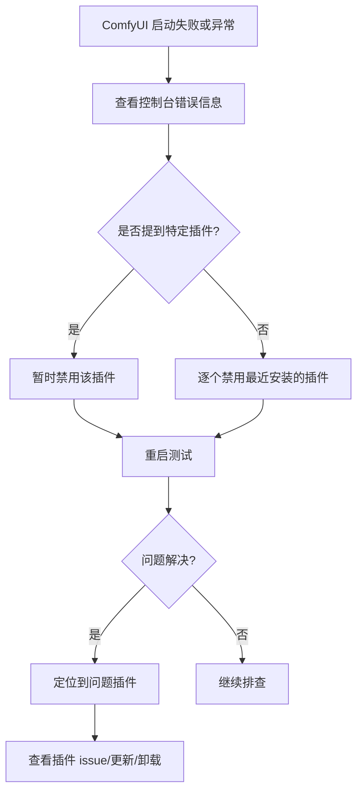

# ComfyUI 插件生态与扩展

## 🎯 本章目标

通过本章学习,你将了解:
- ✅ ComfyUI 插件生态系统
- ✅ 必装插件推荐和使用
- ✅ 插件安装和管理方法
- ✅ 自定义节点开发入门
- ✅ 常见问题和解决方案

---

## 第一部分: 插件生态概览

### 1.1 什么是 ComfyUI 插件?

#### 插件类型分类



#### 插件安装方式

**方式 1: 手动安装**
```bash
# 进入 custom_nodes 目录
cd ComfyUI/custom_nodes/

# 克隆插件仓库
git clone https://github.com/[作者]/[插件名].git

# 安装依赖
cd [插件名]
pip install -r requirements.txt

# 重启 ComfyUI
```

**方式 2: ComfyUI Manager (推荐)**
```bash
# 安装 ComfyUI Manager
cd ComfyUI/custom_nodes/
git clone https://github.com/ltdrdata/ComfyUI-Manager.git

# 重启后,在界面中点击 Manager 按钮
# 搜索并一键安装其他插件
```

### 1.2 插件生态系统

#### 官方资源
- **GitHub**: https://github.com/comfyanonymous/ComfyUI
- **Custom Nodes List**: 社区维护的节点列表
- **Discord**: 官方社区,获取最新信息

#### 第三方资源
- **CivitAI**: 工作流和插件分享
- **Reddit r/comfyui**: 社区讨论
- **B站**: 中文教程和插件介绍

---

## 第二部分: 必装插件推荐

### 2.1 ComfyUI Manager ⭐⭐⭐⭐⭐

#### 功能介绍
```
ComfyUI Manager 是最重要的插件,用于管理其他插件。

核心功能:
✅ 一键安装/卸载插件
✅ 更新插件
✅ 管理缺失的节点
✅ 模型下载
✅ 工作流分享
```

#### 安装方法
```bash
cd ComfyUI/custom_nodes/
git clone https://github.com/ltdrdata/ComfyUI-Manager.git
# 重启 ComfyUI
```

#### 使用方法


**常用功能:**

**1. 安装自定义节点**
```java
Manager → Install Custom Nodes
  ↓
搜索插件名称
  ↓
点击 Install
  ↓
重启 ComfyUI
```

**2. 解决缺失节点**
```java
// 当加载工作流提示缺失节点时
Manager → Install Missing Custom Nodes
  ↓
自动识别并安装缺失的节点
```

**3. 更新插件**
```java
Manager → Update All
  ↓
一键更新所有已安装插件
```

### 2.2 Efficiency Nodes ⭐⭐⭐⭐⭐

#### 功能介绍
```
Efficiency Nodes 提供了一系列优化的高效节点,
可以大幅简化工作流,减少节点数量。

核心优势:
✅ 集成常用节点功能
✅ 减少工作流复杂度
✅ 提高执行效率
✅ 支持参数预设
```

#### 核心节点

**Efficient Loader**
```java
// 功能: 集成模型加载 + LoRA + 提示词编码
// 相当于替代:
// - Load Checkpoint
// - Load LoRA
// - CLIP Text Encode (×2)

参数:
  ckpt_name: 模型文件
  lora_name: LoRA 文件 (可选)
  lora_strength: LoRA 强度
  positive: 正面提示词
  negative: 负面提示词
```

**KSampler (Efficient)**
```java
// 功能: 增强版采样器
// 额外功能:
// - 预览开关
// - VAE 自动解码
// - 图像自动保存

优势:
  一个节点完成采样+解码+保存
```

**XY Plot**
```java
// 功能: 参数扫描和对比
// 应用: 测试不同参数组合

示例:
  X轴: CFG (5, 7, 9, 11)
  Y轴: Steps (20, 25, 30)
  结果: 4×3=12 张对比图
```

#### 工作流对比

**传统工作流 (10+ 节点)**


**使用 Efficiency Nodes (3 节点)**


### 2.3 Impact Pack ⭐⭐⭐⭐

#### 功能介绍
```
Impact Pack 专注于图像后处理和面部优化。

核心功能:
✅ 面部检测和修复
✅ 细节增强
✅ 局部重绘优化
✅ 批量处理工具
```

#### 核心节点

**FaceDetailer**
```java
// 功能: 自动检测并修复面部
// 工作流程:
输入图片
  ↓
检测所有人脸
  ↓
对每个脸单独高清重绘
  ↓
合成回原图

参数:
  guide_size: 引导尺寸 (512/768)
  max_size: 最大尺寸
  denoise: 重绘强度 (0.4-0.6)
```

**DetailerForEach**
```java
// 功能: 批量处理多个区域
// 应用: 同时优化多张脸、多个物体

特点:
  自动检测
  并行处理
  智能合成
```

#### 实战案例

**案例 1: 集体照面部修复**
```java
// 问题: 集体照中人脸较小,细节模糊
// 解决方案:
Load Image (集体照)
  ↓
FaceDetailer
  检测所有人脸
  每个脸放大到 512×512
  高清重绘
  denoise: 0.5
  ↓
合成最终图片
  所有人脸都清晰细致
```

### 2.4 AnimateDiff Evolved ⭐⭐⭐⭐

#### 功能介绍
```
AnimateDiff 的增强版本,用于视频生成。

核心功能:
✅ 图片转视频
✅ 文字生成视频
✅ 运动控制
✅ 帧插值
```

#### 核心节点

**AnimateDiff Loader**
```java
// 功能: 加载运动模型
// 模型类型:
mm_sd_v15.ckpt          // 基础
mm_sd_v15_v2.ckpt       // 改进
temporalDiff-v1.ckpt    // 时序优化
```

**AnimateDiff Sampler**
```java
// 功能: 视频采样器
// 参数:
frame_number: 16/24/32  // 帧数
motion_scale: 0.5-1.5   // 运动幅度
```

### 2.5 ControlNet Aux ⭐⭐⭐⭐⭐

#### 功能介绍
```
ControlNet 辅助节点包,提供各种预处理器。

包含预处理器:
✅ Canny Edge
✅ Depth (MiDaS, Zoe)
✅ OpenPose
✅ Lineart
✅ Scribble
✅ 以及更多...
```

#### 核心节点

**所有预处理器节点**
```java
// Canny Edge
Canny_Edge_Preprocessor
  low_threshold: 100
  high_threshold: 200

// Depth 估计
Midas_Depth_Map_Preprocessor  // 通用深度
Zoe_Depth_Map_Preprocessor    // 新一代

// OpenPose 检测
Openpose_Preprocessor
  detect_hand: true
  detect_body: true
  detect_face: true

// Lineart 线稿
Lineart_Preprocessor
  Anime_Lineart  // 动漫线稿
  Realistic_Lineart  // 写实线稿
```

### 2.6 WAS Node Suite ⭐⭐⭐⭐

#### 功能介绍
```
综合性节点包,包含大量实用工具。

功能分类:
✅ 图像处理
✅ 文本处理
✅ 数学运算
✅ 逻辑控制
✅ 文件操作
```

#### 实用节点

**图像处理**
```java
Image_Resize          // 智能缩放
Image_Blend           // 图像混合
Image_Crop            // 裁剪
Color_Correct         // 色彩校正
```

**文本处理**
```java
Text_Concatenate      // 文本拼接
Text_Random_Line      // 随机选择一行
Text_File_Load        // 从文件加载提示词
```

**逻辑控制**
```java
Number_Counter        // 计数器
Logic_Boolean         // 布尔运算
Conditional_Image     // 条件图像输出
```

### 2.7 Ultimate SD Upscale ⭐⭐⭐⭐

#### 功能介绍
```
高质量图像放大节点。

核心优势:
✅ 分块放大(tile)
✅ 避免显存溢出
✅ 保持细节
✅ 支持超大图
```

#### 使用方法

**Ultimate SD Upscale 节点**
```java
参数:
  upscale_by: 2.0-4.0     // 放大倍数
  tile_width: 512         // 分块宽度
  tile_height: 512        // 分块高度
  denoise: 0.3-0.5        // 重绘强度
  steps: 20               // 采样步数

工作原理:
  将大图分成多个 512×512 小块
  每块单独放大和优化
  无缝拼接回完整图片
```

#### 实战案例

```java
// 将 1024×1024 放大到 4096×4096
Load Image (1024×1024)
  ↓
Ultimate SD Upscale
  upscale_by: 4.0
  tile_width: 512
  tile_height: 512
  denoise: 0.4
  ↓
Save Image (4096×4096)

// 优势: 显存占用仍然只需要 512×512 的量
```

---

## 第三部分: 插件管理最佳实践

### 3.1 插件安装策略

#### 按需安装原则
```java
// ❌ 避免:
安装所有看起来有用的插件

// ✅ 推荐:
明确需求 → 选择对应插件 → 测试后保留

// 原因:
1. 过多插件影响启动速度
2. 可能产生冲突
3. 增加学习成本
```

#### 推荐的安装顺序


### 3.2 插件更新管理

#### 更新策略

**稳定优先**
```java
// 工作流稳定运行时
不要频繁更新插件

// 仅在以下情况更新:
1. 修复已知 Bug
2. 需要新功能
3. 安全更新
```

**更新前备份**
```bash
# 备份 custom_nodes 目录
cp -r ComfyUI/custom_nodes ComfyUI/custom_nodes_backup

# 或使用 git
cd ComfyUI/custom_nodes/[插件名]
git stash  # 保存本地修改
git pull   # 更新
```

**回退方法**
```bash
# 如果更新后出现问题
cd ComfyUI/custom_nodes/[插件名]
git log  # 查看提交历史
git reset --hard [之前的commit]  # 回退
```

### 3.3 插件冲突解决

#### 常见冲突类型

**1. 节点名称冲突**
```java
// 问题: 两个插件定义了同名节点
// 现象: 节点功能异常或无法加载

// 解决:
1. 保留更常用的插件
2. 或修改其中一个插件的节点名称
```

**2. 依赖冲突**
```bash
# 问题: 不同插件需要不同版本的依赖库
# 现象: 启动报错或运行异常

# 解决:
pip install [库名]==[版本号]
# 选择兼容性最好的版本
```

**3. Python 路径冲突**
```bash
# 问题: 多个插件修改 Python 路径
# 解决: 检查 __init__.py 文件,移除冲突代码
```

#### 故障排查流程



**禁用插件方法**
```bash
# 方法 1: 重命名目录
cd ComfyUI/custom_nodes/
mv [插件目录] [插件目录].disabled

# 方法 2: 创建禁用标记
touch [插件目录]/.disabled
```

---

## 第四部分: 自定义节点开发入门

### 4.1 节点开发基础

#### Python 环境要求
```python
# 基础要求
Python 3.10+
基本的 Python 编程知识
了解 PyTorch 更佳
```

#### 节点结构模板

```python
class MyCustomNode:
    """
    自定义节点示例
    """

    @classmethod
    def INPUT_TYPES(cls):
        """
        定义节点的输入类型
        """
        return {
            "required": {
                # 必需参数
                "image": ("IMAGE",),
                "strength": ("FLOAT", {
                    "default": 1.0,
                    "min": 0.0,
                    "max": 2.0,
                    "step": 0.1,
                    "display": "slider"
                }),
                "mode": (["option1", "option2", "option3"],),
            },
            "optional": {
                # 可选参数
                "mask": ("MASK",),
            }
        }

    RETURN_TYPES = ("IMAGE",)
    RETURN_NAMES = ("output_image",)
    FUNCTION = "process"
    CATEGORY = "image/processing"

    def process(self, image, strength, mode, mask=None):
        """
        节点的主要处理逻辑
        """
        # 在这里实现你的功能
        processed_image = self.custom_processing(image, strength, mode, mask)

        return (processed_image,)

    def custom_processing(self, image, strength, mode, mask):
        """
        自定义处理函数
        """
        # 实现具体的图像处理逻辑
        # image 是 PyTorch tensor, shape: [B, H, W, C]

        # 示例: 简单的亮度调整
        result = image * strength

        return result


# 节点映射
NODE_CLASS_MAPPINGS = {
    "MyCustomNode": MyCustomNode
}

# 节点显示名称
NODE_DISPLAY_NAME_MAPPINGS = {
    "MyCustomNode": "My Custom Node"
}
```

### 4.2 输入类型详解

#### 基础数据类型
```python
INPUT_TYPES = {
    "required": {
        # 整数
        "count": ("INT", {
            "default": 10,
            "min": 1,
            "max": 100,
            "step": 1
        }),

        # 浮点数
        "value": ("FLOAT", {
            "default": 1.0,
            "min": 0.0,
            "max": 10.0,
            "step": 0.1
        }),

        # 字符串
        "text": ("STRING", {
            "default": "默认文本",
            "multiline": False  # 是否多行
        }),

        # 布尔值
        "enabled": ("BOOLEAN", {
            "default": True
        }),

        # 下拉选择
        "mode": (["fast", "balanced", "quality"],),
    }
}
```

#### ComfyUI 特殊类型
```python
INPUT_TYPES = {
    "required": {
        "image": ("IMAGE",),      # 图像
        "mask": ("MASK",),        # 遮罩
        "model": ("MODEL",),      # 模型
        "clip": ("CLIP",),        # CLIP
        "vae": ("VAE",),          # VAE
        "latent": ("LATENT",),    # 潜空间
        "conditioning": ("CONDITIONING",),  # 条件
    }
}
```

### 4.3 实战案例: 简单滤镜节点

#### 亮度调整节点

```python
import torch

class BrightnessAdjustNode:
    """
    图像亮度调整节点
    """

    @classmethod
    def INPUT_TYPES(cls):
        return {
            "required": {
                "image": ("IMAGE",),
                "brightness": ("FLOAT", {
                    "default": 1.0,
                    "min": 0.0,
                    "max": 3.0,
                    "step": 0.05,
                    "display": "slider"
                }),
            }
        }

    RETURN_TYPES = ("IMAGE",)
    FUNCTION = "adjust_brightness"
    CATEGORY = "image/filters"

    def adjust_brightness(self, image, brightness):
        """
        调整图像亮度
        """
        # image shape: [batch, height, width, channels]
        # 值范围: 0.0 - 1.0

        # 简单的乘法调整
        adjusted = torch.clamp(image * brightness, 0.0, 1.0)

        return (adjusted,)


NODE_CLASS_MAPPINGS = {
    "BrightnessAdjustNode": BrightnessAdjustNode
}

NODE_DISPLAY_NAME_MAPPINGS = {
    "BrightnessAdjustNode": "Brightness Adjust"
}
```

#### 图像混合节点

```python
class ImageBlendNode:
    """
    混合两张图像
    """

    @classmethod
    def INPUT_TYPES(cls):
        return {
            "required": {
                "image1": ("IMAGE",),
                "image2": ("IMAGE",),
                "blend_factor": ("FLOAT", {
                    "default": 0.5,
                    "min": 0.0,
                    "max": 1.0,
                    "step": 0.01
                }),
                "blend_mode": (["linear", "multiply", "screen"],),
            }
        }

    RETURN_TYPES = ("IMAGE",)
    FUNCTION = "blend_images"
    CATEGORY = "image/composite"

    def blend_images(self, image1, image2, blend_factor, blend_mode):
        """
        混合图像
        """
        if blend_mode == "linear":
            result = image1 * (1 - blend_factor) + image2 * blend_factor

        elif blend_mode == "multiply":
            result = image1 * image2

        elif blend_mode == "screen":
            result = 1 - (1 - image1) * (1 - image2)

        result = torch.clamp(result, 0.0, 1.0)

        return (result,)
```

### 4.4 节点打包和分享

#### 创建插件包结构

```
my_custom_nodes/
├── __init__.py          # 插件入口
├── nodes.py             # 节点定义
├── requirements.txt     # 依赖列表
├── README.md            # 说明文档
└── examples/            # 示例工作流
    └── example.json
```

**__init__.py 示例**
```python
from .nodes import NODE_CLASS_MAPPINGS, NODE_DISPLAY_NAME_MAPPINGS

__all__ = ['NODE_CLASS_MAPPINGS', 'NODE_DISPLAY_NAME_MAPPINGS']
```

**requirements.txt 示例**
```
# 列出所有依赖
numpy>=1.24.0
opencv-python>=4.8.0
```

**README.md 模板**
```markdown
# My Custom Nodes

## 功能介绍
简要描述插件功能

## 安装方法
\`\`\`bash
cd ComfyUI/custom_nodes/
git clone https://github.com/[你的用户名]/my_custom_nodes.git
pip install -r my_custom_nodes/requirements.txt
\`\`\`

## 使用方法
提供使用说明和示例

## 节点列表
- **Brightness Adjust**: 调整图像亮度
- **Image Blend**: 混合两张图像

## 许可证
MIT
```

#### 发布到 GitHub

```bash
# 初始化 git 仓库
cd my_custom_nodes
git init

# 添加文件
git add .
git commit -m "Initial commit"

# 关联远程仓库
git remote add origin https://github.com/[你的用户名]/my_custom_nodes.git

# 推送
git push -u origin main
```

---

## 第五部分: 高级插件推荐

### 5.1 ComfyUI-Advanced-ControlNet

**功能**: 高级 ControlNet 控制
```java
✅ 多 ControlNet 管理
✅ 时序控制
✅ 权重调度
✅ 区域控制
```

### 5.2 ComfyUI-VideoHelperSuite

**功能**: 视频处理工具套件
```java
✅ 视频加载和保存
✅ 帧提取
✅ 视频拼接
✅ 帧插值
```

### 5.3 ComfyUI-Custom-Scripts

**功能**: 实用脚本集合
```java
✅ 自动队列
✅ 工作流版本控制
✅ 自动备份
✅ 性能监控
```

### 5.4 ComfyUI-Inspire-Pack

**功能**: 创意辅助工具
```java
✅ 提示词生成器
✅ 风格混合
✅ 参数随机化
✅ 灵感库
```

---

## 📖 总结

通过本章学习,你已经了解:

1. **插件生态**: ComfyUI 丰富的扩展系统
2. **必装插件**: Manager、Efficiency Nodes 等核心插件
3. **插件管理**: 安装、更新、故障排查
4. **开发入门**: 自定义节点的基本开发方法

**下一步学习:**
- [ComfyUI 自定义节点开发进阶](./06-ComfyUI自定义节点开发.md)
- [ComfyUI API 集成](./07-ComfyUI-API集成.md)

---

> **建议**: 从必装插件开始,逐步探索其他插件。掌握基础后,尝试开发自己的节点,为社区贡献力量!
