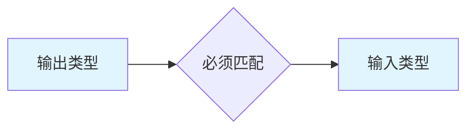

# ComfyUI 常见问题与最佳实践

## 🎯 本章内容

本章提供:
- ✅ 常见问题解决方案
- ✅ 性能优化技巧
- ✅ 工作流最佳实践
- ✅ 提示词编写指南
- ✅ 资源管理建议

---

## 第一部分: 安装和启动问题

### Q1: CUDA out of memory (显存不足)

#### 问题现象
```bash
RuntimeError: CUDA out of memory.
Tried to allocate XX.XX MiB
(GPU 0; XX.XX GiB total capacity)
```

#### 解决方案

**方案 1: 使用低显存模式**
```bash
# 启动时添加参数
python main.py --lowvram

# 或者更激进的
python main.py --novram  # 使用CPU运算VAE
```

**方案 2: 降低生成分辨率**
```java
// 从高分辨率
1024×1024

// 降低到
512×512 或 512×768

// 使用 Hires.fix 后期放大
```

**方案 3: 减少 batch_size**
```java
// 从
batch_size: 4

// 改为
batch_size: 1
```

**方案 4: 使用量化模型**
```java
// 下载 fp16 版本模型
// 文件名通常包含 "fp16" 或 "half"
// 显存占用减少约 50%
```

**方案 5: 清理显存**
```python
# 在 Python 控制台执行
import gc
import torch
gc.collect()
torch.cuda.empty_cache()
```

### Q2: 模型加载失败

#### 问题现象
```bash
Error loading model: [模型路径]
```

#### 解决方案

**检查清单:**
```java
1. ✅ 模型文件是否完整下载
   // 查看文件大小是否正确
   // 重新下载可能损坏的文件

2. ✅ 文件格式是否正确
   // .safetensors (推荐)
   // .ckpt (旧格式)
   // .pt / .pth (PyTorch 格式)

3. ✅ 路径是否正确
   // 主模型: models/checkpoints/
   // LoRA: models/loras/
   // VAE: models/vae/
   // ControlNet: models/controlnet/

4. ✅ 文件名是否包含特殊字符
   // 避免中文
   // 避免空格和特殊符号
```

**验证文件完整性:**
```bash
# 使用 sha256 校验(如果提供)
sha256sum [模型文件]

# 对比官方提供的 hash 值
```

### Q3: 节点连接错误

#### 问题现象
```
Cannot connect output type X to input type Y
```

#### 解决方案

**类型匹配规则:**


**常见类型对应:**
```java
MODEL → MODEL (紫色)
CLIP → CLIP (黄色)
VAE → VAE (红色)
CONDITIONING → CONDITIONING (绿色)
LATENT → LATENT (蓝色)
IMAGE → IMAGE (白色)
MASK → MASK (灰色)

// 错误示例:
MODEL → CLIP ❌
IMAGE → LATENT ❌

// 正确做法:
需要使用转换节点
IMAGE → VAE Encode → LATENT ✅
```

### Q4: Python 依赖问题

#### 问题现象
```bash
ModuleNotFoundError: No module named 'xxx'
```

#### 解决方案

**安装缺失依赖:**
```bash
# 进入 ComfyUI 目录
cd ComfyUI

# 激活虚拟环境(如果使用)
source venv/bin/activate  # Linux/macOS
venv\Scripts\activate     # Windows

# 安装依赖
pip install [缺失的模块名]

# 或重新安装所有依赖
pip install -r requirements.txt
```

**常见依赖问题:**
```bash
# xformers 安装失败
pip install xformers --index-url https://download.pytorch.org/whl/cu121

# opencv 问题
pip install opencv-python

# PIL/Pillow 问题
pip install Pillow

# transformers 问题
pip install transformers
```

---

## 第二部分: 生成质量问题

### Q5: 生成的图片模糊不清

#### 原因分析
```java
1. 采样步数太少
2. VAE 质量问题
3. 模型质量不佳
4. 提示词缺少质量标签
5. CFG 值设置不当
```

#### 解决方案

**优化参数:**
```java
// 增加采样步数
steps: 20 → 28-30

// 调整 CFG
cfg: 5 → 7.5-9

// 使用更好的采样器
sampler: euler → dpm++_2m
scheduler: normal → karras
```

**加载独立 VAE:**
```java
// 下载高质量 VAE
vae-ft-mse-840000-ema-pruned.safetensors

// 在工作流中使用
Load VAE 节点
  ↓
VAE Decode 时使用
```

**添加质量提示词:**
```
正面:
masterpiece, best quality, ultra detailed,
high resolution, 8k uhd, sharp focus,
professional, highly detailed

负面:
low quality, worst quality, blurry,
jpeg artifacts, low resolution
```

### Q6: 生成内容不符合提示词

#### 原因分析
```java
1. CFG 值太低
2. 提示词权重不当
3. 模型不适合该风格
4. 负面提示词太强
```

#### 解决方案

**提高 CFG:**
```java
cfg: 5-6 (弱相关)
  ↓
cfg: 7.5-9 (平衡)
  ↓
cfg: 10-12 (强相关)

// 注意: CFG > 15 可能产生异常
```

**调整提示词权重:**
```java
// 强调重要内容
(重点内容:1.2-1.3)

// 示例:
(red dress:1.3), beautiful girl, smile

// 降低次要内容权重
(background:0.8), details
```

**更换合适的模型:**
```java
// 写实风格 → Realistic Vision
// 动漫风格 → Anything V5
// 艺术风格 → DreamShaper
// 特定领域 → 寻找专用模型
```

### Q7: 人物面部畸形

#### 常见问题
```java
多个头
多余的眼睛
扭曲的五官
模糊的面部
```

#### 解决方案

**方案 1: 使用面部修复**
```java
生成的图片
  ↓
Face Restore (CodeFormer)
  weight: 0.6-0.8
  ↓
修复后的图片
```

**方案 2: 使用 FaceDetailer**
```java
// 需要 Impact Pack 插件
生成的图片
  ↓
FaceDetailer
  guide_size: 512
  denoise: 0.5
  ↓
高清面部
```

**方案 3: 优化提示词**
```java
正面添加:
detailed face, beautiful eyes,
symmetrical face, perfect anatomy

负面添加:
bad anatomy, bad face, deformed face,
extra eyes, extra heads, disfigured
```

**方案 4: 局部重绘**
```java
// 生成后发现面部问题
Load Image
  ↓
创建面部遮罩
  ↓
Inpaint
  提示词: "beautiful face, detailed"
  denoise: 0.7-0.9
  ↓
重绘面部
```

### Q8: 手部畸形

#### 问题现象
```java
多余的手指
缺少手指
扭曲的手
融合的手指
```

#### 解决方案

**方案 1: 避免直接生成手**
```java
// 构图时避开手部
提示词: "portrait, upper body, arms not visible"

// 或裁剪掉手部
Save Image → Crop
```

**方案 2: 使用 OpenPose**
```java
// 提供正确的手部骨架
准备手势参考图
  ↓
OpenPose Preprocessor
  detect_hand: true
  ↓
ControlNet 生成
  ↓
手部正确的图片
```

**方案 3: 局部重绘手部**
```java
Load Image
  ↓
创建手部遮罩
  ↓
Inpaint
  提示词: "detailed hands, perfect anatomy, 5 fingers"
  negative: "extra fingers, missing fingers"
  denoise: 0.8-0.95
  steps: 35-40
```

**方案 4: 使用专门的 LoRA**
```java
// 下载手部专用 LoRA
// 例如: "hand_v3" LoRA
Load LoRA
  strength: 0.6-0.8
  ↓
提示词: "perfect hands, detailed fingers"
```

---

## 第三部分: 性能优化

### Q9: 生成速度太慢

#### 优化策略

**硬件层面:**
```java
1. ✅ 使用 NVIDIA 显卡
   // AMD 显卡支持有限
   // 性能差距明显

2. ✅ 安装 xformers
   pip install xformers
   // 可提速 20-30%

3. ✅ 更新 CUDA 和驱动
   // 最新版本通常性能更好

4. ✅ 使用 SSD 存储模型
   // 减少加载时间
```

**参数层面:**
```java
1. ✅ 选择快速采样器
   euler        // 最快
   dpm++_2m     // 平衡

2. ✅ 减少采样步数
   预览: 15-20 步
   正式: 25-28 步

3. ✅ 降低初始分辨率
   先生成 512×512
   再使用 Hires.fix 放大

4. ✅ 使用 fp16 模型
   // 速度提升 10-20%
```

**工作流层面:**
```java
1. ✅ 减少不必要的节点
   // 移除调试节点
   // 合并可合并的操作

2. ✅ 使用 Efficient Nodes
   // 替代多个基础节点
   // 减少数据传输

3. ✅ 缓存常用模型
   // 避免重复加载
   // 保持模型在显存中
```

### Q10: 启动时间太长

#### 优化方法

**减少插件数量:**
```bash
# 禁用不常用的插件
cd ComfyUI/custom_nodes/
mv [不常用插件] ../custom_nodes_disabled/

# 保留必需插件:
# - ComfyUI-Manager
# - Efficiency-Nodes-ComfyUI
# - 你常用的 1-2 个插件
```

**优化模型加载:**
```java
// 不要在 models 目录放太多模型
// 建议:
checkpoints: 3-5 个常用模型
loras: 10-20 个常用 LoRA
vae: 1-2 个
```

**使用便携版:**
```java
// 如果经常切换配置
// 可以准备多个独立的 ComfyUI 目录
// 每个用于不同用途
ComfyUI_Portrait/   // 人物生成专用
ComfyUI_Landscape/  // 风景生成专用
ComfyUI_Product/    // 产品设计专用
```

---

## 第四部分: 提示词最佳实践

### 提示词编写原则

#### 1. 结构化组织

```
# 推荐的提示词结构
(质量标签:1.1), (风格标签:1.0),
主体描述, 详细特征,
环境背景, 光照描述,
额外细节

# 示例:
(masterpiece:1.2), (best quality:1.2),
(photorealistic:1.3),
1girl, beautiful face, long hair,
detailed eyes, gentle smile,
white dress, elegant,
garden, natural lighting, bokeh background,
professional photography, 8k
```

#### 2. 权重使用规范

```java
// 不要过度使用高权重
❌ (girl:2.0), (beautiful:2.5), (detailed:3.0)

// 合理的权重范围
✅ (girl:1.2), (beautiful:1.1), (detailed:1.3)

// 权重建议:
1.0      // 标准权重
1.1-1.3  // 强调
0.8-0.9  // 弱化
1.4+     // 谨慎使用,可能过度
```

#### 3. 负面提示词策略

```
# 通用负面提示词基础包
(worst quality:1.4), (low quality:1.4),
lowres, bad anatomy, bad hands,
text, error, missing fingers, extra digit,
fewer digits, cropped, jpeg artifacts,
signature, watermark, username, blurry

# 针对性添加
# 人物:
ugly, deformed, disfigured, mutation

# 写实:
cartoon, anime, 3d render, painting

# 动漫:
realistic, photorealistic, 3d
```

#### 4. 语言选择

```java
// 优先使用英文
✅ "a beautiful girl, long hair, smile"

// 避免中文
❌ "一个美丽的女孩,长发,微笑"

// 原因:
// 1. 模型主要用英文训练
// 2. 英文效果更好更稳定
// 3. 社区资源多为英文
```

### 提示词模板库

#### 人物肖像模板

**写实女性**
```
(masterpiece:1.2), (best quality:1.2), (ultra detailed:1.2),
(realistic:1.3), (photorealistic:1.3),
1girl, [年龄] years old, beautiful face,
detailed eyes, detailed pupils, natural skin texture,
[发型描述], [发色],
[表情], looking at viewer,
[服装描述],
[环境], [光照],
professional photography, 8k uhd, dslr, bokeh
```

**动漫角色**
```
(masterpiece:1.2), (best quality:1.2),
(illustration:1.2), anime style,
1girl, cute face, big eyes, sparkling eyes,
[发型], [发色], [发饰],
[表情], [动作],
[服装],
[场景],
vibrant colors, detailed, high resolution
```

#### 场景模板

**自然风景**
```
(masterpiece:1.3), (best quality:1.2),
landscape, natural scenery,
[主要元素: mountain/lake/forest],
[天气: sunny/cloudy/sunset],
[季节: spring/summer/autumn/winter],
volumetric lighting, atmospheric,
highly detailed, 8k wallpaper,
professional photography
```

**建筑设计**
```
architectural visualization,
[建筑类型: modern/classical/futuristic],
[材质: glass/concrete/wood/stone],
[风格: minimalist/ornate/industrial],
[视角: front view/aerial view],
[光照: daylight/golden hour/night],
highly detailed, professional,
8k, photorealistic
```

---

## 第五部分: 资源管理最佳实践

### 模型管理

#### 目录组织建议

```
models/
├── checkpoints/
│   ├── realistic/          # 写实模型
│   │   ├── realisticVision.safetensors
│   │   └── deliberate.safetensors
│   ├── anime/              # 动漫模型
│   │   ├── anythingV5.safetensors
│   │   └── counterfeit.safetensors
│   └── artistic/           # 艺术风格
│       └── dreamshaper.safetensors
├── loras/
│   ├── style/              # 风格 LoRA
│   ├── character/          # 角色 LoRA
│   └── detail/             # 细节 LoRA
└── controlnet/
    ├── canny/
    ├── depth/
    └── openpose/
```

#### 模型命名规范

```
# 推荐格式:
[模型名称]_[版本]_[精度].safetensors

# 示例:
realisticVision_v5.1_fp16.safetensors
anythingV5_v5.0_fp32.safetensors
dreamShaper_v8_inpaint_fp16.safetensors

# 避免:
模型1.ckpt
new model final.safetensors
测试版本.ckpt
```

### 工作流管理

#### 版本控制

```bash
# 使用 git 管理工作流
cd ComfyUI/workflows/
git init

# 提交工作流
git add portrait_workflow_v1.json
git commit -m "Add portrait workflow v1"

# 创建分支用于实验
git checkout -b experimental
```

#### 工作流文档化

```json
// 在工作流文件中添加注释
{
  "workflow_name": "Portrait Generation v2",
  "description": "写实人像生成工作流,包含 Hires.fix 和面部修复",
  "author": "Your Name",
  "date": "2025-12-03",
  "recommended_models": [
    "Realistic Vision V5.1",
    "add_detail LoRA"
  ],
  "parameters": {
    "resolution": "512x768",
    "steps": 28,
    "cfg": 7.5
  },
  "nodes": { ... }
}
```

### 备份策略

#### 重要数据备份

```bash
# 定期备份清单
□ models/ (可选,模型可重新下载)
□ custom_nodes/ (重要,包含配置)
□ workflows/ (重要,你的工作成果)
□ output/ (重要,生成的图片)

# 备份脚本示例 (Linux/macOS)
#!/bin/bash
BACKUP_DIR=~/ComfyUI_Backups/$(date +%Y%m%d)
mkdir -p $BACKUP_DIR

cp -r ComfyUI/custom_nodes $BACKUP_DIR/
cp -r ComfyUI/workflows $BACKUP_DIR/
cp -r ComfyUI/output $BACKUP_DIR/

echo "Backup completed: $BACKUP_DIR"
```

---

## 第六部分: 社区资源

### 学习资源

#### 官方文档
- **GitHub Wiki**: https://github.com/comfyanonymous/ComfyUI/wiki
- **Examples**: https://github.com/comfyanonymous/ComfyUI_examples

#### 视频教程
- **YouTube**: "ComfyUI Tutorial" 搜索
- **B站**: 搜索 "ComfyUI 教程"

#### 社区论坛
- **Discord**: ComfyUI 官方服务器
- **Reddit**: r/comfyui, r/StableDiffusion
- **知乎**: ComfyUI 话题

### 工作流分享平台

#### OpenArt
```
https://openart.ai/workflows

✅ 大量工作流案例
✅ 可直接导入
✅ 参数详细说明
```

#### CivitAI
```
https://civitai.com/

✅ 模型下载
✅ 工作流分享
✅ 社区交流
```

### 提示词资源

#### Lexica
```
https://lexica.art/

✅ 海量提示词示例
✅ 图片对应提示词
✅ 风格参考
```

#### PromptHero
```
https://prompthero.com/

✅ 专业提示词库
✅ 分类详细
✅ 质量较高
```

---

## 第七部分: 疑难杂症

### 特殊问题处理

#### 工作流加载失败

```java
// 问题: 无法加载下载的工作流
// 可能原因:
1. 工作流版本不兼容
2. 缺少必需节点
3. JSON 格式错误

// 解决步骤:
1. 检查是否安装 ComfyUI Manager
2. 使用 Manager 安装缺失节点
3. 检查 ComfyUI 版本是否太旧
4. 验证 JSON 文件格式
```

#### 图片保存位置找不到

```java
// 默认保存位置
ComfyUI/output/

// 如果找不到:
1. 检查 Save Image 节点的 filename_prefix
2. 查看 ComfyUI/output/ 子目录
3. 检查是否有多个 ComfyUI 安装

// 查找最近生成的图片:
# Linux/macOS
find ComfyUI/output/ -type f -name "*.png" -mtime -1

# Windows
dir ComfyUI\output\*.png /s /o-d
```

#### Embedding 不生效

```java
// 问题: 使用 Embedding 但没效果
// 正确用法:

1. 下载 .pt 或 .safetensors 文件
2. 放到 models/embeddings/ 目录
3. 在提示词中使用 embedding 文件名
   例如: "a photo of embedding:badhand"

// 注意:
- 文件名不要有空格
- 使用时不带扩展名
- 某些 embedding 需要特定触发词
```

---

## 📖 总结

通过本章学习,你已经掌握:

1. **问题诊断**: 快速定位和解决常见问题
2. **性能优化**: 提升生成速度和质量
3. **提示词技巧**: 编写高质量提示词
4. **资源管理**: 有效组织模型和工作流
5. **社区资源**: 知道去哪里寻求帮助

**学习建议:**
- 遇到问题先查看本文档
- 善用社区资源和搜索引擎
- 建立自己的问题解决笔记
- 积极参与社区交流分享

---

## 🔗 快速导航

- [返回学习路线图](./01-ComfyUI学习路线图.md)
- [基础入门](./02-ComfyUI基础入门实战.md)
- [进阶技巧](./03-ComfyUI进阶技巧.md)
- [工作流案例](./04-ComfyUI常用工作流案例.md)
- [插件生态](./05-ComfyUI插件生态.md)

---

> **提示**: 收藏本文档作为日常参考,遇到问题时快速查找解决方案。祝你在 ComfyUI 的学习之旅中一切顺利!
