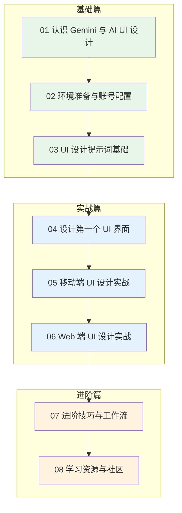
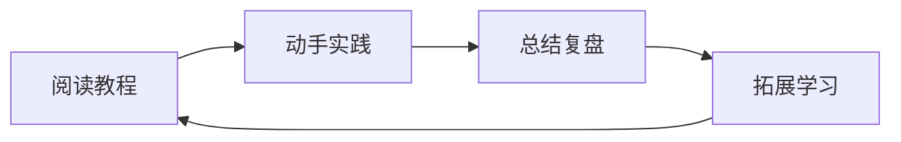
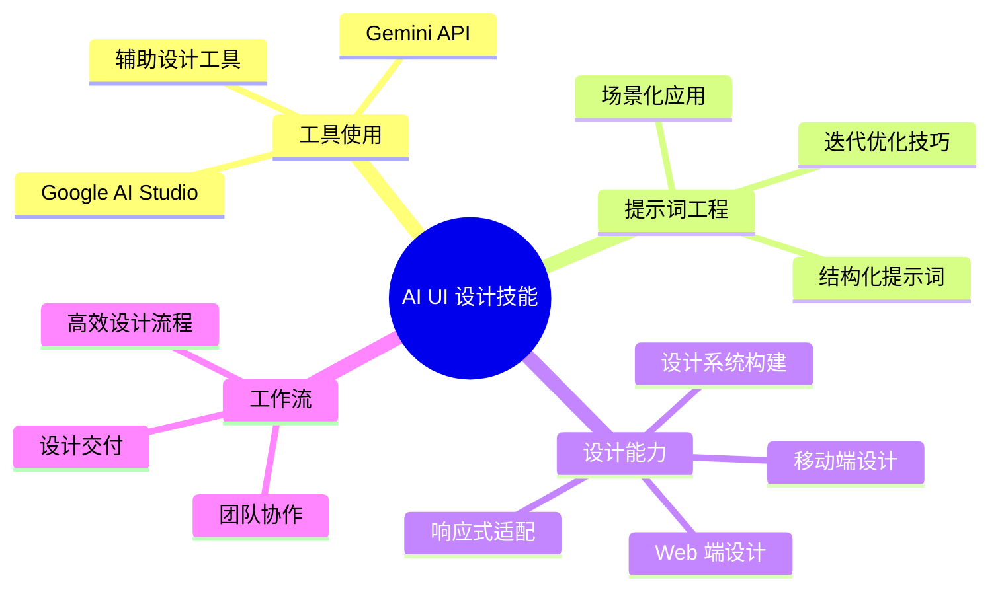

# Gemini AI UI 设计学习路线图

## 课程概述

本教程旨在帮助新手从零开始，系统学习如何使用 Google Gemini 进行 UI 设计。通过 8 个章节的学习，你将掌握 AI 辅助设计的核心技能。

## 学习路线全览

## 课程目录

### 📗 基础篇

| 章节 | 标题 | 主要内容 | 预计时长 |
|------|------|----------|----------|
| 01 | [认识 Gemini 与 AI UI 设计](./课程/01-认识Gemini与AI-UI设计.md) | Gemini 介绍、AI 设计概念、应用场景 | 30 分钟 |
| 02 | [环境准备与账号配置](./课程/02-环境准备与账号配置.md) | 账号注册、环境配置、工具准备 | 45 分钟 |
| 03 | [UI 设计提示词基础](./课程/03-UI设计提示词基础.md) | 提示词结构、编写技巧、优化方法 | 60 分钟 |

### 📘 实战篇

| 章节 | 标题 | 主要内容 | 预计时长 |
|------|------|----------|----------|
| 04 | [设计第一个 UI 界面](./课程/04-设计第一个UI界面.md) | Todo App 设计、迭代优化、获取规范 | 90 分钟 |
| 05 | [移动端 UI 设计实战](./课程/05-移动端UI设计实战.md) | 电商、社交、音乐 App 设计 | 120 分钟 |
| 06 | [Web 端 UI 设计实战](./课程/06-Web端UI设计实战.md) | 官网、后台、博客页面设计 | 120 分钟 |

### 📙 进阶篇

| 章节 | 标题 | 主要内容 | 预计时长 |
|------|------|----------|----------|
| 07 | [进阶技巧与工作流](./课程/07-进阶技巧与工作流.md) | 高级提示词、设计系统、效率技巧 | 90 分钟 |
| 08 | [学习资源与社区](./课程/08-学习资源与社区.md) | 学习资源、设计社区、职业发展 | 45 分钟 |

## 学习建议

### 适合人群

- 🎯 对 UI 设计感兴趣的新手
- 🎯 希望提升设计效率的设计师
- 🎯 想要了解 AI 设计的开发者
- 🎯 产品经理、创业者等需要快速出图的人群

### 前置要求

- ✅ 基本的电脑操作能力
- ✅ 能够访问 Google 服务
- ✅ 对设计有基本的审美认知
- ✅ 愿意动手实践

### 学习方式

1. **阅读教程**：仔细阅读每个章节内容
2. **动手实践**：跟着教程完成练习项目
3. **总结复盘**：记录学习心得和问题
4. **拓展学习**：尝试更多设计项目

### 学习时间规划

| 学习节奏 | 建议安排 | 预计完成时间 |
|----------|----------|--------------|
| 密集学习 | 每天 2-3 小时 | 1 周 |
| 常规学习 | 每天 1 小时 | 2 周 |
| 业余学习 | 每周 3-5 小时 | 1 个月 |

## 核心技能树

完成本教程后，你将掌握以下技能：

## 快速开始

如果你已经迫不及待想要开始学习，点击下面的链接进入第一章：

👉 [01 - 认识 Gemini 与 AI UI 设计](./课程/01-认识Gemini与AI-UI设计.md)

---

## 常见问题

### Q: 需要设计基础吗？

A: 不需要专业的设计基础，但建议对美感有基本认知。教程会从最基础开始讲解。

### Q: 需要付费吗？

A: Gemini 提供免费额度，足够完成本教程的所有练习。如需更多使用量可以考虑付费。

### Q: 学完能达到什么水平？

A: 能够独立使用 AI 完成移动端和 Web 端的 UI 设计，产出专业级别的设计稿。

### Q: 如何获取帮助？

A: 可以在社区提问，或参考第 8 章的学习资源获取更多帮助。

---

> 🚀 **立即开始你的 AI 设计之旅吧！**
