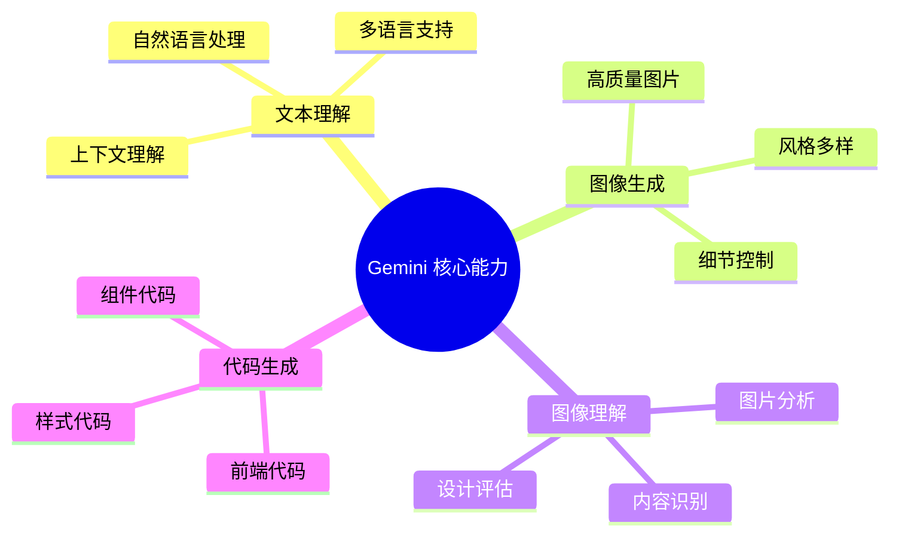
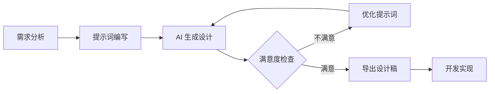
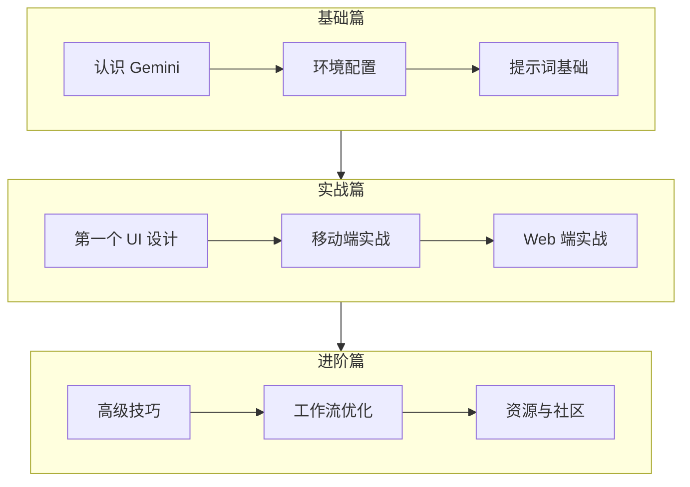

# 认识 Gemini 与 AI UI 设计

## 前言

在人工智能快速发展的今天，AI 已经能够帮助我们完成许多创意工作，其中 UI（用户界面）设计就是一个重要的应用场景。本教程将带你从零开始，学习如何使用 Google Gemini 来辅助 UI 设计工作。

## 什么是 Gemini？

Gemini 是 Google 推出的最新一代多模态大语言模型，它具备以下核心能力：



### Gemini 的版本

| 版本 | 特点 | 适用场景 |
|------|------|----------|
| Gemini Pro | 通用版本，平衡性能与速度 | 日常 UI 设计辅助 |
| Gemini Ultra | 最强性能，复杂任务处理 | 复杂设计项目 |
| Gemini Nano | 轻量版，设备端运行 | 移动端应用 |

## 为什么选择 Gemini 进行 UI 设计？

### 1. 多模态能力

Gemini 可以同时理解文字描述和图片输入，这意味着你可以：
- 用文字描述你想要的 UI 风格
- 上传参考图片让 AI 理解设计方向
- 结合文字和图片进行更精准的设计沟通

### 2. 图像生成能力

Gemini 2.0 及以后的版本具备强大的图像生成能力：
- 生成高质量的 UI 设计稿
- 支持多种设计风格
- 可以根据反馈迭代优化

### 3. 设计理解与分析

Gemini 能够：
- 分析现有 UI 设计的优缺点
- 提供改进建议
- 解释设计原理

## AI UI 设计的工作流程



### 流程详解

1. **需求分析**：明确设计目标、用户群体、功能需求
2. **提示词编写**：将需求转化为 AI 能理解的描述
3. **AI 生成设计**：Gemini 根据提示生成 UI 设计
4. **迭代优化**：根据生成结果调整提示词
5. **导出应用**：将最终设计用于开发

## Gemini 在 UI 设计中的应用场景

### 场景一：快速原型设计

当你有一个新产品想法时，可以快速生成 UI 原型：

```
示例提示词：
"设计一个简洁的待办事项 App 首页，
风格：极简主义，
配色：白色背景配蓝色强调色，
包含：任务列表、添加按钮、日期选择器"
```

### 场景二：设计灵感获取

当设计遇到瓶颈时，AI 可以提供多种设计方案：

```
示例提示词：
"为电商 App 的商品详情页提供 3 种不同风格的设计方案：
1. 现代简约风格
2. 活力年轻风格
3. 高端奢华风格"
```

### 场景三：设计规范生成

快速生成设计系统的基础组件：

```
示例提示词：
"生成一套移动端 UI 组件库的设计规范，包括：
- 按钮（主要、次要、禁用状态）
- 输入框（默认、聚焦、错误状态）
- 卡片组件
- 导航栏"
```

### 场景四：设计评审辅助

上传现有设计，获取改进建议：

```
示例提示词：
"分析这个登录页面的设计，从以下角度给出改进建议：
- 视觉层次
- 用户体验
- 可访问性
- 移动端适配"
```

## AI UI 设计的优势与局限

### 优势

| 优势 | 说明 |
|------|------|
| ⚡ 效率提升 | 几分钟内生成多个设计方案 |
| 💡 创意激发 | 突破思维定式，获取新灵感 |
| 🔄 快速迭代 | 轻松修改和优化设计 |
| 📚 学习辅助 | 了解设计原理和最佳实践 |
| 💰 成本降低 | 减少设计初期的时间投入 |

### 局限性

| 局限 | 应对策略 |
|------|----------|
| 细节控制有限 | 分步骤生成，逐步细化 |
| 风格一致性 | 使用参考图片和详细描述 |
| 创意边界 | 结合人工创意进行优化 |
| 品牌特色 | 提供品牌规范作为参考 |

## 学习路线预览

本教程将按照以下路线带你掌握 Gemini UI 设计：



## 本章小结

- Gemini 是 Google 的多模态 AI 模型，具备强大的图像生成和理解能力
- AI UI 设计可以大幅提升设计效率，但需要人工把控质量
- 掌握提示词编写是 AI 设计的核心技能
- 本教程将带你系统学习 Gemini UI 设计的完整流程

## 下一步

在下一章节，我们将学习如何配置 Gemini 使用环境，注册账号并开始你的第一次 AI 设计之旅。

---

> 💡 **学习建议**：在学习过程中，建议边学边练，每个章节都尝试动手实践。
