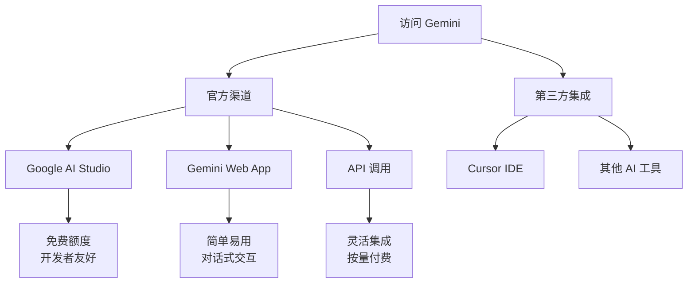
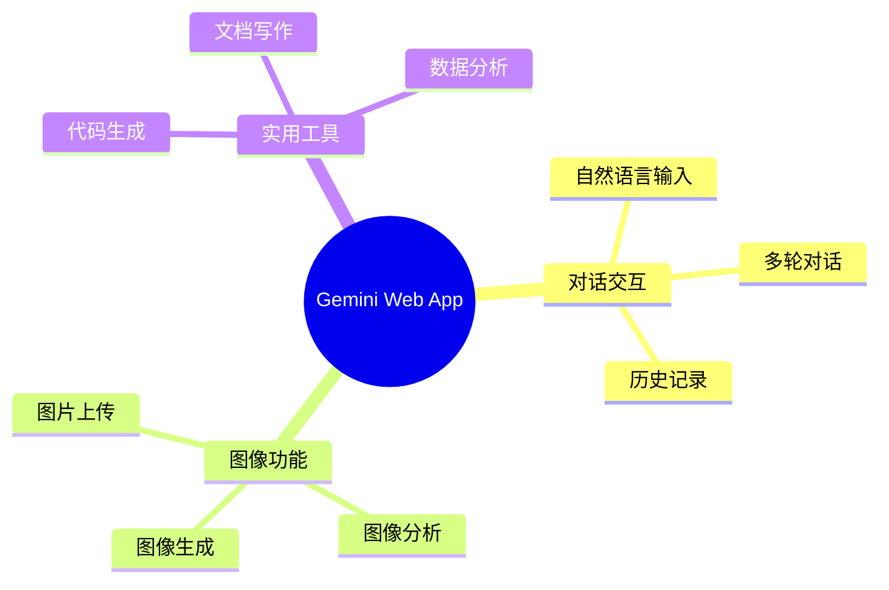
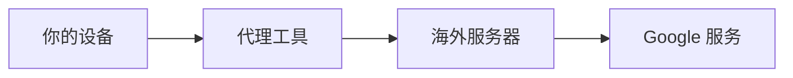

# 环境准备与账号配置

## 前言

在开始使用 Gemini 进行 UI 设计之前，我们需要完成环境准备和账号配置。本章将详细介绍各种访问 Gemini 的方式，帮助你选择最适合的方案。

## 访问 Gemini 的方式



## 方式一：Google AI Studio（推荐新手）

Google AI Studio 是最适合新手的入门方式，提供免费额度和友好的界面。

### 注册步骤

#### 第一步：访问 Google AI Studio

1. 打开浏览器，访问 [https://aistudio.google.com](https://aistudio.google.com)
2. 如果提示地区限制，需要使用科学上网工具

#### 第二步：登录 Google 账号

1. 点击「Sign in」按钮
2. 使用你的 Google 账号登录
3. 如果没有 Google 账号，点击「Create account」创建

#### 第三步：同意服务条款

1. 阅读并同意 Google 的服务条款
2. 确认你的使用目的（选择个人使用或商业使用）

#### 第四步：进入工作台

登录成功后，你将看到 AI Studio 的主界面：

```
┌─────────────────────────────────────────────────────────────┐
│  Google AI Studio                                           │
├─────────────────────────────────────────────────────────────┤
│                                                             │
│  ┌─────────────┐  ┌─────────────┐  ┌─────────────┐         │
│  │  New Chat   │  │  New Prompt │  │   Library   │         │
│  │             │  │             │  │             │         │
│  │  开始对话   │  │  创建提示词 │  │   历史记录  │         │
│  └─────────────┘  └─────────────┘  └─────────────┘         │
│                                                             │
│  Model: Gemini 1.5 Pro  ▼                                   │
│                                                             │
│  ┌─────────────────────────────────────────────────────┐   │
│  │  在这里输入你的提示词...                             │   │
│  │                                                     │   │
│  │                                              [发送] │   │
│  └─────────────────────────────────────────────────────┘   │
│                                                             │
└─────────────────────────────────────────────────────────────┘
```

### AI Studio 功能介绍

| 功能 | 说明 | 使用场景 |
|------|------|----------|
| Chat | 对话模式 | 快速测试和探索 |
| Freeform | 自由格式 | 复杂提示词设计 |
| Structured | 结构化 | 批量处理任务 |

### 免费额度说明

Google AI Studio 提供免费使用额度：

| 模型 | 免费额度 | 限制 |
|------|----------|------|
| Gemini 1.5 Flash | 60 RPM | 每分钟请求数 |
| Gemini 1.5 Pro | 2 RPM | 每分钟请求数 |
| Gemini 2.0 | 限时体验 | 以官网为准 |

> 💡 **提示**：免费额度对于学习和个人项目完全够用

## 方式二：Gemini Web App

如果你只需要简单的对话式设计，可以使用 Gemini Web App。

### 访问地址

- 官方地址：[https://gemini.google.com](https://gemini.google.com)

### 功能特点



### 使用步骤

1. **登录账号**：使用 Google 账号登录
2. **选择模型**：点击左上角选择 Gemini 版本
3. **开始对话**：在输入框中描述你的设计需求
4. **上传图片**：点击图片图标上传参考设计

### Gemini Advanced（付费版）

如需更强大的功能，可以订阅 Gemini Advanced：

| 特性 | 免费版 | Advanced |
|------|--------|----------|
| 模型 | Gemini Pro | Gemini Ultra |
| 上下文长度 | 标准 | 更长 |
| 图像生成 | 基础 | 高级 |
| 优先访问 | 否 | 是 |
| 价格 | 免费 | $19.99/月 |

## 方式三：API 调用（开发者）

如果你是开发者，可以通过 API 将 Gemini 集成到你的工作流中。

### 获取 API Key

#### 第一步：进入 API 密钥管理

1. 在 AI Studio 左侧菜单点击「Get API Key」
2. 或访问 [https://aistudio.google.com/app/apikey](https://aistudio.google.com/app/apikey)

#### 第二步：创建 API Key

1. 点击「Create API Key」
2. 选择关联的 Google Cloud 项目（或创建新项目）
3. 复制生成的 API Key

#### 第三步：安全存储

```bash
# 推荐：使用环境变量存储 API Key
export GEMINI_API_KEY="your-api-key-here"

# 或者在项目中使用 .env 文件
echo "GEMINI_API_KEY=your-api-key-here" >> .env
```

> ⚠️ **安全提示**：
> - 永远不要在代码中硬编码 API Key
> - 不要将 API Key 提交到版本控制系统
> - 定期轮换 API Key

### API 调用示例

```python
# Python 示例
import google.generativeai as genai
import os

# 配置 API Key
genai.configure(api_key=os.environ["GEMINI_API_KEY"])

# 创建模型实例
model = genai.GenerativeModel('gemini-1.5-pro')

# 生成 UI 设计描述
prompt = """
请设计一个现代风格的登录页面，要求：
1. 简洁的表单设计
2. 支持社交媒体登录
3. 响应式布局
4. 蓝色主题色
"""

response = model.generate_content(prompt)
print(response.text)
```

```javascript
// Node.js 示例
const { GoogleGenerativeAI } = require("@google/generative-ai");

const genAI = new GoogleGenerativeAI(process.env.GEMINI_API_KEY);

async function generateUIDesign() {
  const model = genAI.getGenerativeModel({ model: "gemini-1.5-pro" });

  const prompt = `
    设计一个电商 App 的商品卡片组件，包含：
    - 商品图片
    - 标题和价格
    - 购买按钮
    - 收藏图标
  `;

  const result = await model.generateContent(prompt);
  console.log(result.response.text());
}

generateUIDesign();
```

### API 定价

| 模型 | 输入价格 | 输出价格 |
|------|----------|----------|
| Gemini 1.5 Flash | $0.075/百万token | $0.30/百万token |
| Gemini 1.5 Pro | $1.25/百万token | $5.00/百万token |

> 💡 **提示**：先使用免费额度学习，熟练后再考虑付费使用

## 推荐的辅助工具

为了更好地进行 UI 设计，建议准备以下工具：

### 设计参考工具

| 工具 | 用途 | 链接 |
|------|------|------|
| Dribbble | 设计灵感 | dribbble.com |
| Behance | 案例参考 | behance.net |
| Mobbin | 移动端参考 | mobbin.com |
| Screenlane | UI 截图 | screenlane.com |

### 颜色工具

| 工具 | 用途 |
|------|------|
| Coolors | 配色方案生成 |
| ColorHunt | 热门配色参考 |
| Adobe Color | 专业调色板 |

### 图标和素材

| 资源 | 类型 |
|------|------|
| Iconify | 开源图标库 |
| Unsplash | 免费图片 |
| Figma Community | 设计模板 |

## 网络环境配置

由于 Gemini 服务目前在部分地区不可用，你可能需要配置网络环境：

### 检查可用性

1. 直接访问 [gemini.google.com](https://gemini.google.com)
2. 如果无法访问，需要使用代理工具

### 代理配置建议



常用代理工具：
- Clash
- V2Ray
- Shadowsocks

> ⚠️ **注意**：请确保遵守当地法律法规使用网络工具

## 环境验证

完成配置后，进行以下验证：

### 验证清单

- [ ] 可以正常访问 Google AI Studio
- [ ] 已登录 Google 账号
- [ ] 可以在 AI Studio 中发送消息
- [ ] （可选）已获取 API Key

### 快速测试

在 AI Studio 中输入以下提示词进行测试：

```
你好，请用中文回复。
简单描述一下你能如何帮助我进行 UI 设计？
```

如果能收到正常回复，说明环境配置成功！

## 常见问题

### Q1: 提示"服务在你的地区不可用"

**解决方案**：
1. 检查网络代理是否正确配置
2. 清除浏览器缓存后重试
3. 尝试使用隐私模式访问

### Q2: API 调用返回 403 错误

**解决方案**：
1. 检查 API Key 是否正确
2. 确认 API Key 没有过期
3. 检查是否超出配额限制

### Q3: 图像生成功能不可用

**解决方案**：
1. 确认使用的是支持图像生成的模型版本
2. 检查账号是否有图像生成权限
3. 尝试使用 AI Studio 而非 API

## 本章小结

- Google AI Studio 是最适合新手的入门方式
- Gemini Web App 适合简单的对话式设计
- API 调用适合开发者进行深度集成
- 建议准备设计参考工具和颜色工具
- 可能需要配置网络环境才能访问服务

## 下一步

环境配置完成后，我们将在下一章学习提示词的编写技巧，这是使用 AI 进行 UI 设计的核心技能。

---

> 💡 **学习建议**：完成环境配置后，花 10-15 分钟熟悉 AI Studio 的界面，尝试发送几条简单的消息。
