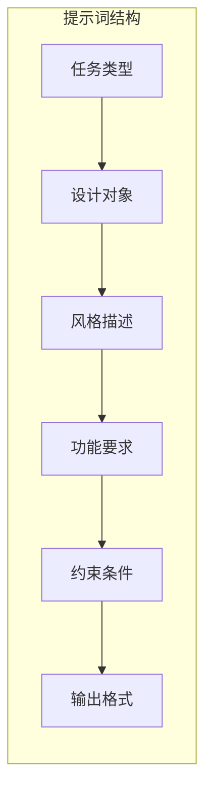
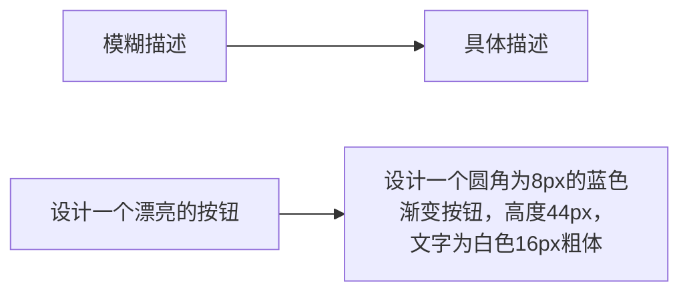
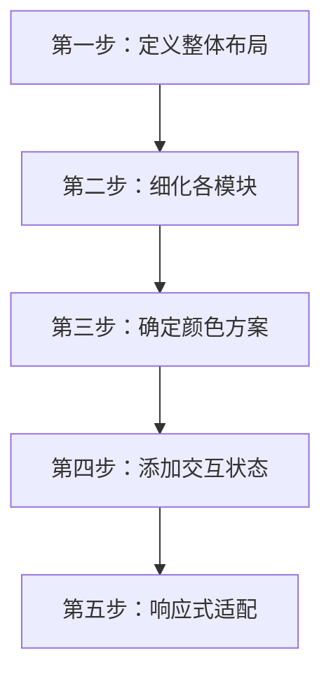
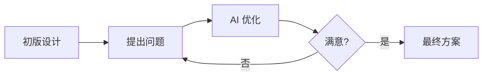

# UI 设计提示词基础

## 前言

提示词（Prompt）是与 AI 沟通的语言，好的提示词能让 AI 准确理解你的设计意图。本章将系统讲解 UI 设计提示词的编写技巧，帮助你获得更满意的设计结果。

## 提示词的基本结构

一个完整的 UI 设计提示词通常包含以下要素：



### 结构详解

| 要素 | 说明 | 示例 |
|------|------|------|
| 任务类型 | 你希望 AI 做什么 | 设计、生成、优化、分析 |
| 设计对象 | 要设计什么 | 登录页面、首页、组件 |
| 风格描述 | 视觉风格定义 | 简约、科技感、温馨 |
| 功能要求 | 需要包含的元素 | 按钮、表单、导航 |
| 约束条件 | 限制和规范 | 配色、尺寸、品牌 |
| 输出格式 | 期望的输出形式 | 图片、代码、描述 |

## 提示词模板

### 基础模板

```
请为 [目标用户] 设计一个 [设计对象]，要求：

【风格】
- 整体风格：[风格描述]
- 配色方案：[颜色要求]
- 字体风格：[字体要求]

【功能】
- [功能点1]
- [功能点2]
- [功能点3]

【约束】
- 设备类型：[移动端/桌面端/响应式]
- 尺寸规格：[具体尺寸]
- 其他要求：[特殊要求]

【输出】
请生成 [输出类型]。
```

### 实际应用示例

**示例 1：登录页面设计**

```
请为年轻用户（18-30岁）设计一个社交 App 的登录页面，要求：

【风格】
- 整体风格：现代简约，有活力
- 配色方案：渐变紫色（#667eea → #764ba2）作为主色
- 字体风格：无衬线字体，现代感

【功能】
- 手机号/邮箱登录表单
- 密码输入框（带显示/隐藏功能图标）
- 「忘记密码」链接
- 微信、QQ、Apple 社交登录按钮
- 「注册新账号」入口

【约束】
- 设备类型：iOS 移动端
- 尺寸规格：375×812px（iPhone X）
- 其他要求：需要暗色模式适配方案

【输出】
请生成 UI 设计稿的详细描述，包括布局、间距、颜色值。
```

**示例 2：电商商品卡片**

```
请设计一个电商平台的商品卡片组件，要求：

【风格】
- 整体风格：干净清爽，突出商品
- 配色方案：白色背景，橙色强调色（#FF6B35）
- 阴影效果：轻微阴影增加层次

【功能】
- 商品主图（支持多图轮播指示器）
- 商品标题（最多两行，超出省略）
- 原价和促销价显示
- 销量和评分信息
- 「加入购物车」按钮
- 收藏/取消收藏图标

【约束】
- 卡片宽度：172px
- 卡片圆角：12px
- 需要考虑点击态效果

【输出】
生成完整的卡片设计，并提供 CSS 样式代码。
```

## 提示词优化技巧

### 技巧一：具体化描述



**❌ 模糊的描述：**
```
设计一个好看的首页
```

**✅ 具体的描述：**
```
设计一个新闻资讯 App 的首页，包含：
- 顶部搜索栏（白色背景，圆角搜索框）
- 分类标签栏（横向滚动，当前选中项有下划线）
- 新闻列表（左图右文布局，图片尺寸 120×90px）
- 底部导航栏（5个图标：首页、视频、发布、消息、我的）
```

### 技巧二：使用参考词汇

设计风格词汇库：

| 类型 | 关键词 |
|------|--------|
| 简约风 | minimal, clean, simple, whitespace |
| 科技感 | tech, futuristic, digital, gradient |
| 温馨风 | warm, cozy, friendly, soft |
| 商务风 | professional, corporate, formal |
| 年轻化 | youthful, vibrant, playful, energetic |
| 奢华风 | luxury, premium, elegant, sophisticated |
| 复古风 | retro, vintage, classic, nostalgic |

**使用示例：**
```
设计风格：科技感与简约结合，使用蓝紫色渐变，
配合大量留白和几何图形装饰
```

### 技巧三：分步骤引导

对于复杂设计，分步骤与 AI 沟通：



**分步提示词示例：**

```
【第一步】
首先，请为这个电商 App 首页确定整体布局结构，
分为哪几个主要区域，每个区域的大致比例是多少？

【等待 AI 回复后】

【第二步】
很好，现在请详细设计「商品推荐」区域，
这个区域应该展示6个商品，使用2列布局...

【以此类推】
```

### 技巧四：提供参考示例

```
请参考 Apple 官网的设计风格，设计一个产品展示页面：
- 大图背景
- 简洁的产品描述
- 突出的 CTA 按钮
- 大量留白
```

或者使用对比说明：
```
风格要求：
- 类似：小红书的清新感、Pinterest 的瀑布流布局
- 避免：过于花哨的装饰、太多颜色、复杂的阴影
```

### 技巧五：明确输出要求

| 输出类型 | 适用场景 | 提示词示例 |
|----------|----------|------------|
| 详细描述 | 初期概念阶段 | "请详细描述设计方案的布局、颜色、字体" |
| 图像生成 | 视觉呈现 | "请生成这个设计的 UI 图片" |
| 代码实现 | 开发阶段 | "请提供 HTML/CSS 或 React 组件代码" |
| 设计规范 | 团队协作 | "请输出完整的设计规范文档" |

## UI 设计常用提示词词汇表

### 布局相关

```
Layout 布局词汇：
- Grid layout 网格布局
- Flexbox 弹性布局
- Card-based 卡片式
- Full-screen 全屏
- Split-screen 分屏
- Sidebar 侧边栏
- Header/Footer 页眉/页脚
- Sticky 固定/吸顶
- Floating 浮动
```

### 颜色相关

```
Color 颜色词汇：
- Primary color 主色
- Secondary color 辅助色
- Accent color 强调色
- Background color 背景色
- Text color 文字颜色
- Gradient 渐变
- Opacity 透明度
- Contrast 对比度
- Dark mode 深色模式
- Light mode 浅色模式
```

### 组件相关

```
Component 组件词汇：
- Button 按钮
- Input field 输入框
- Dropdown 下拉菜单
- Modal 模态框
- Toast 提示消息
- Card 卡片
- List 列表
- Tab 标签页
- Carousel 轮播
- Avatar 头像
- Badge 徽章
- Progress bar 进度条
- Skeleton 骨架屏
```

### 状态相关

```
State 状态词汇：
- Default 默认
- Hover 悬停
- Active 激活
- Focused 聚焦
- Disabled 禁用
- Loading 加载中
- Error 错误
- Success 成功
- Empty state 空状态
```

## 进阶提示词模式

### 角色设定法

让 AI 扮演专业角色：

```
你是一位拥有10年经验的高级 UI 设计师，
擅长移动端 App 设计，对用户体验有深入理解。

现在请你设计一个健身 App 的首页，
目标用户是25-40岁的健身爱好者...
```

### 问答引导法

通过提问引导 AI 思考：

```
在设计这个电商首页之前，请先回答以下问题：
1. 用户打开首页最想看到什么？
2. 如何在3秒内抓住用户注意力？
3. 哪些信息应该放在首屏？
4. 如何引导用户下单？

基于以上思考，请设计首页布局。
```

### 迭代优化法



**迭代示例：**

```
【初版】
请设计一个音乐播放器的播放页面

【第一次迭代】
设计不错，但请优化以下方面：
1. 专辑封面太小，请放大到屏幕宽度的 70%
2. 播放控制按钮需要更突出
3. 添加歌词滚动显示区域

【第二次迭代】
很好，现在请为这个页面添加：
1. 深色模式版本
2. 横屏播放模式
```

## 常见错误与修正

### 错误一：描述过于简单

**❌ 错误示例：**
```
设计一个 App
```

**✅ 修正后：**
```
设计一个外卖订餐 App 的首页，目标用户是上班族，
需要突出"快速下单"功能，整体风格简洁高效，
主色调使用橙色（#FF6600）
```

### 错误二：要求相互矛盾

**❌ 错误示例：**
```
设计一个极简风格的页面，要求信息丰富，
使用多种颜色，并保持大量留白
```

**✅ 修正后：**
```
设计一个信息展示页面，使用清晰的信息层级，
主次分明，重要信息突出显示，
配色控制在3种以内，适当留白提升可读性
```

### 错误三：缺少上下文

**❌ 错误示例：**
```
设计一个按钮
```

**✅ 修正后：**
```
为电商 App 的商品详情页设计「立即购买」按钮：
- 位置：页面底部固定
- 尺寸：宽度占屏幕 60%，高度 48px
- 颜色：橙红色渐变（#FF4D4F → #FF7A45）
- 文字：白色，16px，粗体
- 状态：需要设计正常态、按压态、禁用态
```

## 实战练习

### 练习 1：设计一个天气 App 首页

尝试使用今天学到的技巧，编写一个完整的提示词：

```
练习目标：
- 使用基础模板结构
- 加入具体的设计要求
- 明确输出格式

参考要素：
- 目标用户：日常通勤的上班族
- 核心功能：当前天气、未来天气预报、穿衣建议
- 风格偏好：清新、直观、易读
```

### 练习 2：优化现有提示词

将以下简单提示词优化为完整版本：

**原始提示词：**
```
设计一个设置页面
```

**你的优化版本：**
```
请在此编写你的优化版本...
```

## 总结

- 好的提示词包含：任务类型、设计对象、风格描述、功能要求、约束条件、输出格式
- 使用具体化描述替代模糊表达
- 善用参考词汇和设计术语
- 复杂设计采用分步骤引导
- 通过迭代不断优化设计结果

**建议**：建立自己的提示词模板库，收集好用的提示词模式，在实践中不断优化。
