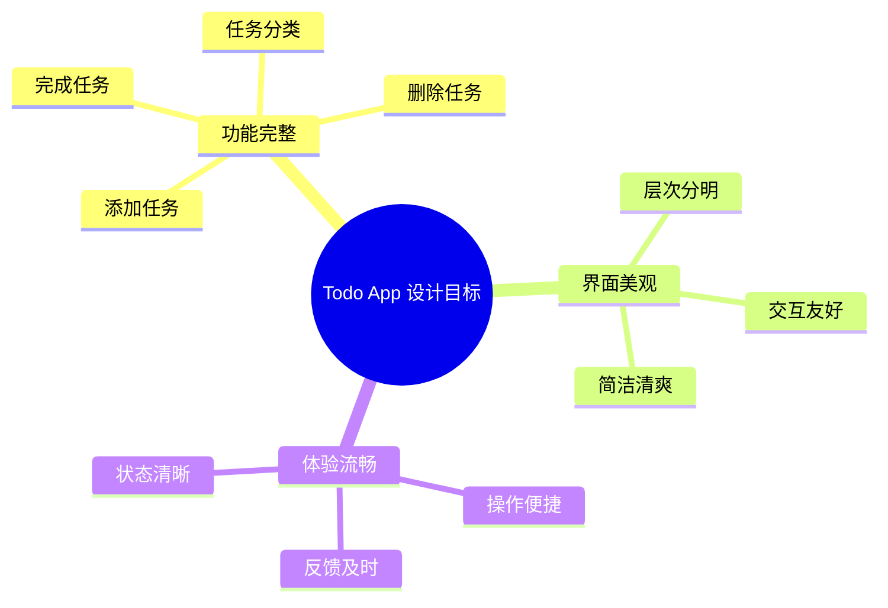

# 设计第一个 UI 界面

## 前言

经过前面的学习，你已经掌握了 Gemini 的基础知识和提示词技巧。现在，让我们动手实践，使用 Gemini 设计你的第一个 UI 界面——一个待办事项（Todo）App 的主界面。

## 项目介绍

### 为什么选择 Todo App？

- **功能简洁**：核心功能明确，适合入门练习
- **元素丰富**：包含列表、按钮、输入框等常用组件
- **扩展性强**：后续可以添加更多功能进行练习

### 设计目标



## 第一步：确定设计需求

在开始设计之前，我们先明确需求：

### 目标用户

- 年龄：20-40岁的职场人士
- 场景：日常工作任务管理
- 设备：iPhone 手机

### 核心功能

| 功能 | 优先级 | 说明 |
|------|--------|------|
| 查看任务列表 | P0 | 主界面核心功能 |
| 添加新任务 | P0 | 必备功能 |
| 标记完成 | P0 | 必备功能 |
| 任务分类 | P1 | 提升效率 |
| 删除任务 | P1 | 基础操作 |
| 设置提醒 | P2 | 增值功能 |

### 设计风格

- **风格定位**：简约现代
- **主色调**：蓝色系（专业、可靠）
- **整体感觉**：干净、高效、专注

## 第二步：使用 Gemini 设计主界面

### 编写设计提示词

打开 Google AI Studio，输入以下提示词：

```
你是一位专业的 UI 设计师。请为一款面向职场人士的待办事项 App 设计主界面。

【基本信息】
- 设备：iPhone 14 Pro（390×844px）
- 状态栏：包含时间、信号、电池图标

【整体风格】
- 设计风格：现代简约，清新专业
- 主色调：蓝色 #4A90E2
- 辅助色：灰色 #8E8E93（次要文字）
- 背景色：纯白 #FFFFFF
- 成功色：绿色 #34C759（已完成任务）
- 字体：系统字体 SF Pro

【页面结构】
从上到下包含以下区域：

1. 顶部区域
   - 左侧：日期显示（如"11月27日 周三"）
   - 右侧：用户头像（圆形，32px）

2. 欢迎语区域
   - 大标题："今日任务"
   - 副标题：显示任务统计（如"共 8 项，已完成 3 项"）

3. 任务分类标签
   - 横向排列的标签按钮
   - 包含：全部、工作、学习、生活
   - 当前选中项有蓝色背景

4. 任务列表区域
   - 每个任务卡片包含：
     * 左侧圆形勾选框
     * 任务标题
     * 任务描述（可选，灰色小字）
     * 右侧时间或标签
   - 已完成任务：文字划线，颜色变淡
   - 卡片之间有适当间距

5. 底部添加按钮
   - 蓝色圆形浮动按钮
   - 白色加号图标
   - 位置：右下角，距边缘 24px
   - 尺寸：56×56px
   - 带轻微阴影

【示例任务数据】
- ✅ 完成项目周报 · 工作 · 已完成
- ⬜ 准备明天的会议材料 · 工作 · 下午 3:00
- ⬜ 学习 Figma 教程 · 学习
- ⬜ 购买生日礼物 · 生活
- ⬜ 健身房锻炼 · 生活 · 晚上 7:00

【输出要求】
请详细描述这个界面的：
1. 完整的视觉布局
2. 每个元素的具体尺寸和位置
3. 颜色值和字体大小
4. 间距和边距规范

然后，请生成这个设计的图片。
```

### 分析 AI 返回结果

Gemini 会返回详细的设计描述和（可能的）设计图。让我们分析关键要素：

#### 布局结构分析

```
┌─────────────────────────────────┐
│  ← 状态栏 (44px)                │
├─────────────────────────────────┤
│  11月27日 周三            👤    │ ← 顶部区域 (56px)
├─────────────────────────────────┤
│                                 │
│  今日任务                       │ ← 标题区域
│  共 8 项，已完成 3 项           │
│                                 │
├─────────────────────────────────┤
│  [全部] [工作] [学习] [生活]    │ ← 分类标签 (44px)
├─────────────────────────────────┤
│                                 │
│  ┌─────────────────────────┐   │
│  │ ✓  完成项目周报         │   │
│  │    工作 · 已完成        │   │
│  └─────────────────────────┘   │
│                                 │
│  ┌─────────────────────────┐   │
│  │ ○  准备明天的会议材料    │   │
│  │    工作 · 下午 3:00     │   │
│  └─────────────────────────┘   │
│                                 │
│  ┌─────────────────────────┐   │ ← 任务列表
│  │ ○  学习 Figma 教程      │   │
│  │    学习                 │   │
│  └─────────────────────────┘   │
│                                 │
│  ┌─────────────────────────┐   │
│  │ ○  购买生日礼物         │   │
│  │    生活                 │   │
│  └─────────────────────────┘   │
│                                 │
│                          ┌───┐ │
│                          │ + │ │ ← 添加按钮
│                          └───┘ │
└─────────────────────────────────┘
```

## 第三步：迭代优化设计

初版设计完成后，我们可以通过迭代来优化细节。

### 优化提示词示例

**优化 1：增强视觉层次**

```
基于刚才的设计，请进行以下优化：

1. 任务卡片添加轻微的阴影效果，增强层次感
   - 阴影参数：0 2px 8px rgba(0,0,0,0.08)

2. 已完成任务的视觉区分更明显
   - 背景色改为 #F5F5F5
   - 文字颜色改为 #BDBDBD
   - 添加删除线效果

3. 分类标签的选中状态更突出
   - 选中：蓝色背景 #4A90E2，白色文字
   - 未选中：透明背景，灰色文字 #666666
```

**优化 2：添加空状态设计**

```
请为这个 Todo App 设计「空状态」界面，
当用户没有任何任务时显示：

要求：
- 居中显示一个简洁的插图（可以是抽象图形）
- 主标题："暂无任务"
- 副标题："点击下方按钮添加你的第一个任务"
- 保持与主界面相同的设计风格
```

**优化 3：添加深色模式**

```
请为这个 Todo App 设计深色模式版本：

配色要求：
- 背景色：#1C1C1E
- 卡片背景：#2C2C2E
- 主色调：#5AC8FA（亮蓝色，提高对比度）
- 主要文字：#FFFFFF
- 次要文字：#8E8E93
- 已完成任务背景：#3A3A3C

其他要求：
- 保持与亮色模式相同的布局
- 阴影效果适当减弱
- 确保文字可读性
```

## 第四步：获取设计规范

设计确定后，让 AI 输出完整的设计规范：

```
请为这个 Todo App 主界面输出完整的设计规范文档，包含：

1. 颜色规范
   - 所有使用的颜色值（HEX 格式）
   - 颜色的使用场景说明

2. 字体规范
   - 标题、正文、辅助文字的字号
   - 字重（Regular、Medium、Bold）
   - 行高设置

3. 间距规范
   - 页面边距
   - 元素间距
   - 卡片内边距

4. 组件规范
   - 按钮尺寸和状态
   - 卡片样式
   - 图标尺寸

请以表格形式输出。
```

### 设计规范示例

**颜色规范：**

| 颜色名称 | HEX 值 | 使用场景 |
|----------|--------|----------|
| Primary | #4A90E2 | 主按钮、选中状态、强调元素 |
| Secondary | #8E8E93 | 次要文字、图标 |
| Background | #FFFFFF | 页面背景 |
| Card | #FFFFFF | 卡片背景 |
| Success | #34C759 | 完成状态 |
| Text Primary | #1C1C1E | 主要文字 |
| Text Secondary | #8E8E93 | 次要文字 |
| Border | #E5E5EA | 分割线、边框 |

**字体规范：**

| 元素 | 字号 | 字重 | 行高 |
|------|------|------|------|
| 大标题 | 28px | Bold | 34px |
| 小标题 | 17px | Semibold | 22px |
| 正文 | 15px | Regular | 20px |
| 辅助文字 | 13px | Regular | 18px |
| 按钮文字 | 15px | Medium | 20px |

**间距规范：**

| 元素 | 数值 |
|------|------|
| 页面左右边距 | 16px |
| 区域间距 | 24px |
| 卡片间距 | 12px |
| 卡片内边距 | 16px |
| 元素最小间距 | 8px |

## 第五步：获取代码实现

如果你需要将设计转化为代码，可以让 Gemini 生成：

### React Native 组件

```
请将这个 Todo App 主界面转换为 React Native 代码：

要求：
1. 使用函数式组件和 Hooks
2. 使用 StyleSheet 定义样式
3. 包含示例数据
4. 代码结构清晰，有适当注释
```

### Flutter 组件

```
请将这个 Todo App 主界面转换为 Flutter 代码：

要求：
1. 使用 StatefulWidget
2. 遵循 Material Design 规范
3. 包含示例数据
4. 代码结构清晰
```

### HTML/CSS 实现

```
请将这个 Todo App 主界面转换为响应式网页：

要求：
1. 使用语义化 HTML5 标签
2. CSS 使用 Flexbox 布局
3. 移动端优先（Mobile First）
4. 包含交互效果（hover 状态等）
```

**示例代码输出（React Native）：**

```jsx
import React, { useState } from 'react';
import {
  View,
  Text,
  StyleSheet,
  FlatList,
  TouchableOpacity,
  SafeAreaView,
} from 'react-native';

// 颜色常量
const Colors = {
  primary: '#4A90E2',
  secondary: '#8E8E93',
  background: '#FFFFFF',
  success: '#34C759',
  textPrimary: '#1C1C1E',
  textSecondary: '#8E8E93',
  border: '#E5E5EA',
};

// 示例数据
const initialTasks = [
  { id: 1, title: '完成项目周报', category: '工作', completed: true },
  { id: 2, title: '准备明天的会议材料', category: '工作', time: '下午 3:00', completed: false },
  { id: 3, title: '学习 Figma 教程', category: '学习', completed: false },
  { id: 4, title: '购买生日礼物', category: '生活', completed: false },
  { id: 5, title: '健身房锻炼', category: '生活', time: '晚上 7:00', completed: false },
];

const TodoApp = () => {
  const [tasks, setTasks] = useState(initialTasks);
  const [selectedCategory, setSelectedCategory] = useState('全部');

  const categories = ['全部', '工作', '学习', '生活'];

  const toggleTask = (id) => {
    setTasks(tasks.map(task =>
      task.id === id ? { ...task, completed: !task.completed } : task
    ));
  };

  const filteredTasks = selectedCategory === '全部'
    ? tasks
    : tasks.filter(task => task.category === selectedCategory);

  const completedCount = tasks.filter(t => t.completed).length;

  return (
    <SafeAreaView style={styles.container}>
      {/* 顶部区域 */}
      <View style={styles.header}>
        <Text style={styles.date}>11月27日 周三</Text>
        <View style={styles.avatar} />
      </View>

      {/* 标题区域 */}
      <View style={styles.titleSection}>
        <Text style={styles.title}>今日任务</Text>
        <Text style={styles.subtitle}>
          共 {tasks.length} 项，已完成 {completedCount} 项
        </Text>
      </View>

      {/* 分类标签 */}
      <View style={styles.categories}>
        {categories.map(cat => (
          <TouchableOpacity
            key={cat}
            style={[
              styles.categoryBtn,
              selectedCategory === cat && styles.categoryBtnActive
            ]}
            onPress={() => setSelectedCategory(cat)}
          >
            <Text style={[
              styles.categoryText,
              selectedCategory === cat && styles.categoryTextActive
            ]}>
              {cat}
            </Text>
          </TouchableOpacity>
        ))}
      </View>

      {/* 任务列表 */}
      <FlatList
        data={filteredTasks}
        keyExtractor={item => item.id.toString()}
        renderItem={({ item }) => (
          <TouchableOpacity
            style={[styles.taskCard, item.completed && styles.taskCardCompleted]}
            onPress={() => toggleTask(item.id)}
          >
            <View style={[
              styles.checkbox,
              item.completed && styles.checkboxCompleted
            ]}>
              {item.completed && <Text style={styles.checkmark}>✓</Text>}
            </View>
            <View style={styles.taskContent}>
              <Text style={[
                styles.taskTitle,
                item.completed && styles.taskTitleCompleted
              ]}>
                {item.title}
              </Text>
              <Text style={styles.taskMeta}>
                {item.category}
                {item.time && ` · ${item.time}`}
              </Text>
            </View>
          </TouchableOpacity>
        )}
        contentContainerStyle={styles.taskList}
      />

      {/* 添加按钮 */}
      <TouchableOpacity style={styles.addButton}>
        <Text style={styles.addButtonText}>+</Text>
      </TouchableOpacity>
    </SafeAreaView>
  );
};

const styles = StyleSheet.create({
  container: {
    flex: 1,
    backgroundColor: Colors.background,
  },
  header: {
    flexDirection: 'row',
    justifyContent: 'space-between',
    alignItems: 'center',
    paddingHorizontal: 16,
    paddingVertical: 12,
  },
  date: {
    fontSize: 15,
    color: Colors.textSecondary,
  },
  avatar: {
    width: 32,
    height: 32,
    borderRadius: 16,
    backgroundColor: Colors.border,
  },
  titleSection: {
    paddingHorizontal: 16,
    paddingVertical: 8,
  },
  title: {
    fontSize: 28,
    fontWeight: 'bold',
    color: Colors.textPrimary,
  },
  subtitle: {
    fontSize: 15,
    color: Colors.textSecondary,
    marginTop: 4,
  },
  categories: {
    flexDirection: 'row',
    paddingHorizontal: 16,
    paddingVertical: 12,
    gap: 12,
  },
  categoryBtn: {
    paddingHorizontal: 16,
    paddingVertical: 8,
    borderRadius: 20,
  },
  categoryBtnActive: {
    backgroundColor: Colors.primary,
  },
  categoryText: {
    fontSize: 15,
    color: Colors.textSecondary,
  },
  categoryTextActive: {
    color: '#FFFFFF',
  },
  taskList: {
    paddingHorizontal: 16,
  },
  taskCard: {
    flexDirection: 'row',
    alignItems: 'center',
    backgroundColor: Colors.background,
    borderRadius: 12,
    padding: 16,
    marginBottom: 12,
    shadowColor: '#000',
    shadowOffset: { width: 0, height: 2 },
    shadowOpacity: 0.08,
    shadowRadius: 8,
    elevation: 2,
  },
  taskCardCompleted: {
    backgroundColor: '#F5F5F5',
  },
  checkbox: {
    width: 24,
    height: 24,
    borderRadius: 12,
    borderWidth: 2,
    borderColor: Colors.border,
    justifyContent: 'center',
    alignItems: 'center',
    marginRight: 12,
  },
  checkboxCompleted: {
    backgroundColor: Colors.success,
    borderColor: Colors.success,
  },
  checkmark: {
    color: '#FFFFFF',
    fontSize: 14,
    fontWeight: 'bold',
  },
  taskContent: {
    flex: 1,
  },
  taskTitle: {
    fontSize: 15,
    color: Colors.textPrimary,
  },
  taskTitleCompleted: {
    color: '#BDBDBD',
    textDecorationLine: 'line-through',
  },
  taskMeta: {
    fontSize: 13,
    color: Colors.textSecondary,
    marginTop: 4,
  },
  addButton: {
    position: 'absolute',
    right: 24,
    bottom: 24,
    width: 56,
    height: 56,
    borderRadius: 28,
    backgroundColor: Colors.primary,
    justifyContent: 'center',
    alignItems: 'center',
    shadowColor: Colors.primary,
    shadowOffset: { width: 0, height: 4 },
    shadowOpacity: 0.3,
    shadowRadius: 8,
    elevation: 4,
  },
  addButtonText: {
    color: '#FFFFFF',
    fontSize: 28,
    fontWeight: '300',
  },
});

export default TodoApp;
```

## 设计检查清单

完成设计后，使用以下清单进行检查：

### 视觉检查

- [ ] 整体风格统一
- [ ] 颜色使用一致
- [ ] 字体层次清晰
- [ ] 间距规范合理
- [ ] 对齐方式正确

### 功能检查

- [ ] 所有核心功能都有对应界面
- [ ] 交互状态完整（默认、激活、禁用）
- [ ] 空状态有设计
- [ ] 加载状态有考虑

### 可用性检查

- [ ] 点击区域足够大（至少 44×44px）
- [ ] 文字可读性好
- [ ] 颜色对比度符合标准
- [ ] 操作路径清晰

## 本章小结

通过本章的实践，你学会了：

1. **需求分析**：在设计前明确用户和功能需求
2. **提示词编写**：使用结构化提示词描述设计需求
3. **迭代优化**：通过多轮对话完善设计细节
4. **获取规范**：让 AI 输出可落地的设计规范
5. **代码转换**：将设计转换为实际代码

## 课后作业

尝试独立完成以下设计任务：

1. **添加任务页面**：设计添加新任务的界面
2. **任务详情页**：设计点击任务后的详情页
3. **设置页面**：设计 App 的设置界面

## 下一步

下一章我们将进入移动端 UI 设计实战，学习更复杂的界面设计技巧。

---

> 💡 **学习建议**：完成本章后，尝试用相同的方法设计其他类型的 App，如天气、音乐、新闻等，巩固所学知识。
