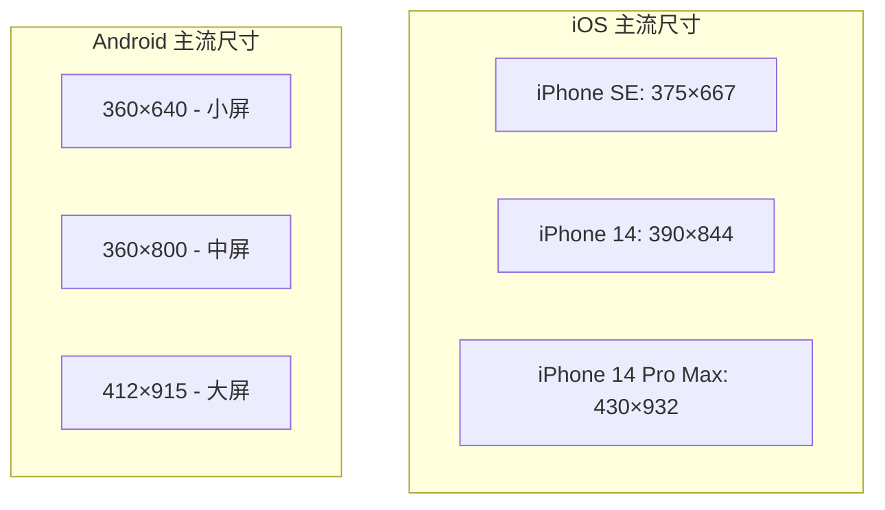
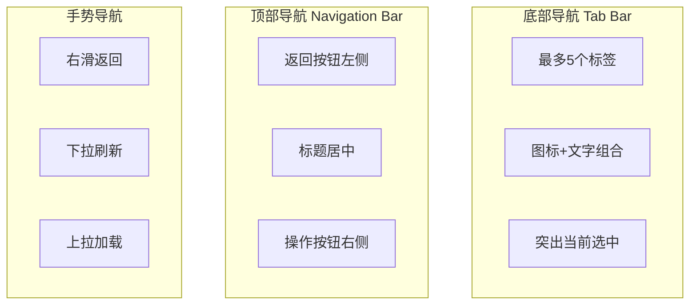

# 移动端 UI 设计实战

## 前言

移动端是目前最主流的应用平台，掌握移动端 UI 设计是每个设计师的必备技能。本章将通过多个实战案例，教你如何使用 Gemini 设计专业的移动端界面。

## 移动端设计基础

### 设计尺寸规范



**推荐设计基准：**

| 平台 | 推荐尺寸 | 说明 |
|------|----------|------|
| iOS | 390×844 | iPhone 14 标准尺寸 |
| Android | 360×800 | 最通用的 Android 尺寸 |
| 通用 | 375×812 | 兼顾双平台的折中方案 |

### 安全区域

```
┌─────────────────────────────┐
│      状态栏 (44-47px)       │ ← 避免放置交互元素
├─────────────────────────────┤
│                             │
│                             │
│        安全内容区域          │
│                             │
│                             │
├─────────────────────────────┤
│    底部安全区 (34px)         │ ← iPhone 底部手势区域
└─────────────────────────────┘
```

### 触摸目标尺寸

| 元素 | 最小尺寸 | 推荐尺寸 |
|------|----------|----------|
| 按钮 | 44×44px | 48×48px |
| 图标按钮 | 44×44px | 48×48px |
| 列表项 | 高度 44px | 高度 56px |
| 文字链接 | 44×44px 热区 | 带足够内边距 |

## 实战项目一：电商首页设计

### 项目背景

设计一个时尚电商 App 的首页，目标用户是18-35岁的年轻女性。

### 设计提示词

```
请为一款面向年轻女性的时尚电商 App 设计首页。

【设备规格】
- 设备：iPhone 14（390×844px）
- 设计风格：时尚、精致、女性化

【配色方案】
- 主色：玫瑰金 #B76E79
- 辅助色：米白 #FAF9F6
- 强调色：深灰 #2C2C2C
- 背景色：纯白 #FFFFFF

【页面结构】

1. 顶部导航栏（固定）
   - 左侧：分类图标
   - 中间：搜索框（圆角，带搜索图标）
   - 右侧：消息图标 + 购物车图标（带数量角标）

2. 轮播横幅
   - 高度：180px
   - 圆角：12px
   - 分页指示器在底部居中
   - 内容：新品上市、限时折扣等促销信息

3. 快捷入口（图标导航）
   - 单行 5 个图标
   - 图标尺寸：48×48px
   - 包含：新品、直播、品牌、秒杀、全部分类

4. 限时秒杀模块
   - 标题栏：左侧「限时秒杀」+ 倒计时 + 右侧「查看更多」
   - 商品横向滚动列表
   - 每个商品卡片宽度 120px
   - 显示：商品图、价格、原价（划线）

5. 精选推荐（瀑布流）
   - 两列瀑布流布局
   - 商品卡片包含：
     * 商品图片（宽度 50% 屏幕 - 间距）
     * 商品标题（两行）
     * 价格
     * 销量标签
     * 喜欢图标

6. 底部导航栏（固定）
   - 5 个标签：首页、分类、发布、购物车、我的
   - 当前选中项为主色
   - 高度：83px（包含安全区域）

【特殊效果】
- 轮播图有自动播放
- 下拉刷新功能
- 滚动时顶部导航栏背景变为纯白

【输出】
1. 详细的布局描述
2. 完整的设计规范
3. 生成设计图片
```

### 关键设计要点

**瀑布流商品卡片结构：**

```
┌──────────────┐
│              │
│   商品图片    │  ← 图片高度根据内容自适应
│   (圆角8px)   │
│              │
├──────────────┤
│ 春季新款连衣裙 │  ← 标题：14px，最多2行
│ 显瘦气质款...  │
├──────────────┤
│ ¥299    ¥599 │  ← 价格：16px粗体 + 12px划线
├──────────────┤
│ 已售 2.3万   ♡│  ← 销量 + 收藏按钮
└──────────────┘
```

## 实战项目二：社交聊天界面

### 项目背景

设计一个现代社交 App 的聊天界面。

### 设计提示词

```
请设计一个社交 App 的一对一聊天界面。

【设备规格】
- 设备：iPhone 14（390×844px）
- 风格：简洁现代，对话清晰

【配色方案】
- 主色/发送气泡：#007AFF（iOS 蓝）
- 接收气泡：#E9E9EB
- 背景色：#FFFFFF
- 文字：#000000（发送）、#000000（接收）

【页面结构】

1. 导航栏
   - 左侧：返回箭头
   - 中间：对方头像（小圆形） + 昵称 + 在线状态
   - 右侧：更多操作图标（三个点）

2. 聊天区域
   - 消息按时间顺序排列
   - 时间分隔显示（如「下午 3:30」）

   消息类型：
   a) 文字消息
      - 发送：蓝色气泡，白色文字，右对齐
      - 接收：灰色气泡，黑色文字，左对齐，带头像
      - 气泡圆角：18px
      - 最大宽度：70% 屏幕宽度

   b) 图片消息
      - 圆角：12px
      - 最大宽度：200px
      - 点击可查看大图

   c) 语音消息
      - 显示语音波形图标
      - 显示时长「0:15」
      - 宽度根据时长变化（60-200px）

   d) 消息状态
      - 发送中：灰色圆圈
      - 已发送：单勾
      - 已读：双勾/蓝色双勾

3. 输入区域
   - 左侧：语音按钮、添加按钮
   - 中间：输入框（圆角，placeholder「输入消息...」）
   - 右侧：表情按钮、发送按钮（有内容时显示）
   - 整体高度：56px
   - 安全区域内边距

【示例对话内容】
对方（小美）：你好呀，最近忙什么呢？
我：在学习用 AI 做 UI 设计，超有意思的！
对方：听起来很棒诶，学会了教教我呗
我：[图片：一张 UI 设计截图]
我：没问题，这是我今天做的练习
对方：[语音消息：10秒]
我：好的，周末见！

【交互状态】
- 长按消息：显示操作菜单（复制、转发、删除、撤回）
- 输入框聚焦：键盘弹起，聊天区域上推
- 新消息：自动滚动到底部

【输出】
请提供详细的设计描述和图片。
```

### 消息气泡设计细节

```
/* 发送消息（右侧） */
┌────────────────────────────────────────┐
│                           ┌──────────┐ │
│                           │ 你好呀！  │ │
│                           │ 最近怎么样│ │
│                           └──────────┘ │
│                              14:30 ✓✓  │
└────────────────────────────────────────┘

/* 接收消息（左侧） */
┌────────────────────────────────────────┐
│ ┌──┐ ┌────────────────────┐           │
│ │头│ │ 我很好，谢谢关心！   │           │
│ │像│ │ 周末有空一起吃饭吗？ │           │
│ └──┘ └────────────────────┘           │
│       14:31                            │
└────────────────────────────────────────┘
```

## 实战项目三：音乐播放器

### 设计提示词

```
请设计一个音乐 App 的「正在播放」界面。

【设备规格】
- 设备：iPhone 14（390×844px）
- 风格：沉浸式、情感化

【配色方案】
- 背景：深色渐变（从专辑封面提取主色）
- 文字：白色
- 进度条：白色/半透明白
- 按钮：白色图标

【页面结构】

1. 顶部区域
   - 左上：下拉收起按钮（向下箭头）
   - 中间：「正在播放」文字
   - 右上：更多选项按钮

2. 专辑封面区域
   - 居中显示
   - 尺寸：300×300px
   - 圆角：8px
   - 阴影效果：0 20px 50px rgba(0,0,0,0.5)
   - 播放时有轻微的呼吸动画效果

3. 歌曲信息
   - 歌曲名：24px 粗体，白色
   - 歌手名：16px 常规，白色 70% 透明度
   - 喜欢按钮（心形图标）
   - 居中显示

4. 进度条
   - 当前播放时间（左）：「2:35」
   - 进度条（中）：可拖动
   - 总时长（右）：「4:12」
   - 进度条高度：4px，圆角

5. 播放控制
   - 横向排列，居中
   - 从左到右：随机播放、上一首、播放/暂停、下一首、循环播放
   - 播放/暂停按钮最大（64px）
   - 其他按钮（32px）

6. 底部功能
   - 音质标签：「HQ 高品质」
   - 歌词按钮
   - 播放列表按钮
   - 分享按钮
   - AirPlay 按钮

【视觉效果】
- 背景使用专辑封面的高斯模糊（blur: 50px）
- 叠加深色渐变遮罩提高文字可读性
- 所有图标使用 SF Symbols 风格

【示例歌曲】
- 歌曲名：Shape of You
- 歌手：Ed Sheeran
- 专辑：÷ (Divide)

【输出】
详细设计描述和高质量设计图。
```

### 播放控制布局

```
         ┌─────────────────────────────────────┐
         │                                     │
         │         ┌───────────────┐           │
         │         │               │           │
         │         │   专辑封面     │           │
         │         │   300×300     │           │
         │         │               │           │
         │         └───────────────┘           │
         │                                     │
         │         Shape of You               │
         │         Ed Sheeran    ♡            │
         │                                     │
         │   2:35  ━━━━━━━●━━━━━━  4:12        │
         │                                     │
         │      🔀   ⏮️   ▶️   ⏭️   🔁         │
         │                                     │
         │   HQ   📝   📋   📤   📺           │
         │                                     │
         └─────────────────────────────────────┘
```

## 实战项目四：个人中心页面

### 设计提示词

```
请设计一个 App 的「我的」个人中心页面。

【设备规格】
- 设备：iPhone 14（390×844px）
- 风格：简洁高效，信息层次清晰

【配色方案】
- 主色：#FF6B6B（珊瑚红）
- 背景：#F5F5F5
- 卡片背景：#FFFFFF
- 文字主色：#1A1A1A
- 文字辅助色：#999999

【页面结构】

1. 用户信息卡片
   - 背景：白色卡片，圆角 16px
   - 头像：80×80px，圆形，右侧有编辑图标
   - 昵称：18px 粗体
   - 会员标识：「VIP会员」金色标签
   - 用户描述/签名：14px 灰色，单行
   - 右侧：进入箭头

2. 数据统计栏
   - 横向四等分
   - 数据项：关注、粉丝、获赞、收藏
   - 数字：18px 粗体
   - 标签：12px 灰色
   - 有分隔线

3. 订单卡片
   - 标题栏：「我的订单」+ 「查看全部 >」
   - 图标导航（横向5个）：
     * 待付款
     * 待发货
     * 待收货
     * 待评价
     * 售后/退款
   - 每个图标有红点提示角标

4. 服务卡片
   - 标题：「我的服务」
   - 网格布局（2×3）
   - 包含：我的收藏、浏览历史、地址管理、优惠券、客服中心、设置

5. 功能列表
   - 列表项设计：
     * 左侧图标（24×24px）
     * 标题文字
     * 右侧附加信息（可选）
     * 进入箭头
   - 包含：
     * 会员中心 - 「10 天后到期」
     * 邀请好友 - 「赚 ¥20」
     * 意见反馈
     * 关于我们

【特殊设计】
- 页面可滚动
- 下拉时头部区域有轻微视差效果
- 会员卡片可以有渐变背景

【输出】
完整的页面设计描述和设计图。
```

## 移动端设计最佳实践

### 导航设计原则



### 列表设计模式

| 模式 | 适用场景 | 特点 |
|------|----------|------|
| 简单列表 | 设置、菜单 | 单行文字，右侧箭头 |
| 缩略图列表 | 聊天、联系人 | 左侧图片，右侧文字 |
| 卡片列表 | 商品、文章 | 独立卡片，丰富信息 |
| 瀑布流 | 图片展示 | 不规则高度，双列 |
| 时间线 | 动态、订单 | 时间节点连接 |

### 表单设计要点

```
/* 良好的表单设计 */
┌─────────────────────────────────────┐
│ 手机号                              │  ← 标签：14px，灰色
├─────────────────────────────────────┤
│ +86 ▼  │ 请输入手机号              │  ← 输入框：高度 48px
├─────────────────────────────────────┤
│ 密码                                │
├─────────────────────────────────────┤
│ ●●●●●●●●             👁              │  ← 密码可见切换
├─────────────────────────────────────┤
│                                     │
│  ┌─────────────────────────────┐   │
│  │          立即登录            │   │  ← 按钮：高度 48px，圆角 24px
│  └─────────────────────────────┘   │
│                                     │
│         忘记密码？ | 新用户注册      │  ← 辅助链接
└─────────────────────────────────────┘
```

### 反馈与状态设计

| 状态 | 设计方式 |
|------|----------|
| 加载中 | 骨架屏 / 加载动画 |
| 空状态 | 插图 + 文案 + 操作按钮 |
| 错误状态 | 错误图标 + 错误信息 + 重试按钮 |
| 成功状态 | 成功图标 + 提示文案 |
| 网络异常 | 断网图标 + 重新加载按钮 |

## 本章小结

通过本章的学习，你掌握了：

1. **移动端设计规范**：尺寸、安全区域、触摸目标
2. **电商首页设计**：轮播、导航、商品展示
3. **聊天界面设计**：消息气泡、输入区域
4. **音乐播放器设计**：沉浸式体验、播放控制
5. **个人中心设计**：信息层次、功能组织
6. **最佳实践**：导航、列表、表单、状态反馈

## 课后作业

选择以下任一项目进行练习：

1. **外卖 App 首页**：设计一个外卖平台的首页
2. **阅读 App 详情页**：设计电子书的阅读详情页
3. **健身 App 训练页**：设计运动训练的界面

## 下一步

下一章我们将学习 Web 端 UI 设计，了解响应式设计和桌面端界面设计的技巧。

---

> 💡 **学习建议**：在实践时，可以参考 Dribbble、Mobbin 等平台上的优秀案例，分析它们的设计亮点。
