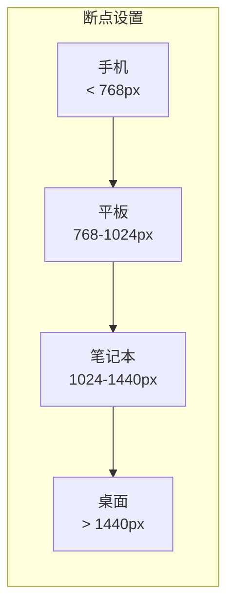
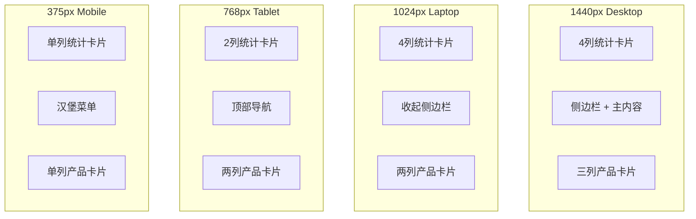

# Web 端 UI 设计实战

## 前言

Web 端设计与移动端有很大不同，需要考虑更大的屏幕空间、响应式布局以及鼠标交互等因素。本章将通过实战案例，教你如何使用 Gemini 设计专业的 Web 界面。

## Web 设计基础

### 常见屏幕尺寸



**设计尺寸推荐：**

| 场景 | 设计宽度 | 说明 |
|------|----------|------|
| 主流桌面 | 1440px | 最常用的设计基准 |
| 大屏桌面 | 1920px | 高分辨率显示器 |
| 内容区域 | 1200px | 居中内容的最大宽度 |
| 窄屏适配 | 1024px | 平板/小笔记本 |

### 栅格系统

```
1440px 设计稿标准栅格：

┌─────────────────────────────────────────────────────────────────┐
│  ← 120px →  ←─────────── 1200px 内容区域 ──────────→  ← 120px → │
│             ┌───┬───┬───┬───┬───┬───┬───┬───┬───┬───┬───┬───┐  │
│             │ 1 │ 2 │ 3 │ 4 │ 5 │ 6 │ 7 │ 8 │ 9 │10 │11 │12 │  │
│             └───┴───┴───┴───┴───┴───┴───┴───┴───┴───┴───┴───┘  │
│             每列 82px，间距 24px                                 │
└─────────────────────────────────────────────────────────────────┘
```

### Web 与移动端设计差异

| 方面 | 移动端 | Web 端 |
|------|--------|--------|
| 交互方式 | 触摸、手势 | 鼠标、键盘 |
| 点击目标 | 44px+ | 可以更小，但需 hover 状态 |
| 信息密度 | 较低 | 可以更高 |
| 布局 | 单列为主 | 多列、复杂布局 |
| 导航 | 底部 Tab | 顶部导航栏 |
| 内容宽度 | 全屏 | 居中限宽 |

## 实战项目一：SaaS 产品官网

### 项目背景

设计一个 AI 写作工具的产品官网首页。

### 设计提示词

```
请为一款 AI 写作助手工具设计产品官网首页。

【设计规格】
- 设计宽度：1440px
- 内容区域：1200px，居中显示
- 风格：现代科技感，专业可信

【配色方案】
- 主色：渐变紫蓝（#6366F1 → #8B5CF6）
- 背景色：白色 #FFFFFF
- 深色区域：#0F172A
- 文字主色：#1E293B
- 文字辅助色：#64748B

【页面结构】

1. 顶部导航栏（固定）
   - 高度：72px
   - 左侧：Logo（图标+文字「AI Writer」）
   - 中间：导航链接（产品功能、定价、案例、资源、关于我们）
   - 右侧：登录按钮（文字链接）+ 免费试用按钮（主色填充）
   - 滚动后背景变为半透明白色+毛玻璃效果

2. Hero 区域
   - 高度：约 600px
   - 布局：左文右图
   - 左侧内容：
     * 标签：「AI 驱动」小标签
     * 主标题：「让 AI 成为你的写作助手」（48px 粗体）
     * 副标题：产品价值描述（18px）
     * CTA 按钮组：「免费开始」主按钮 + 「观看演示」次要按钮
     * 信任背书：「已有 10,000+ 用户使用」
   - 右侧：产品界面展示图（带阴影和渐变光效背景）

3. Logo 墙（客户/媒体背书）
   - 灰色背景带
   - 显示 5-6 个知名公司 Logo
   - 标题：「被领先企业信赖」

4. 功能介绍区域
   - 标题：「强大的 AI 写作功能」
   - 副标题：功能概述
   - 三列卡片布局：
     * 卡片 1：智能续写（图标 + 标题 + 描述）
     * 卡片 2：内容改写（图标 + 标题 + 描述）
     * 卡片 3：多语言翻译（图标 + 标题 + 描述）
   - 每个卡片有悬停效果（上移 + 阴影增强）

5. 产品展示区域
   - 深色背景（#0F172A）
   - 左图右文或右图左文交替布局
   - 展示 2-3 个核心功能场景
   - 产品截图带设备框架

6. 数据统计区域
   - 四列数据展示
   - 数据项：
     * 10,000+ 活跃用户
     * 1,000,000+ 生成内容
     * 99.9% 可用率
     * 4.9 用户评分

7. 用户评价区域
   - 标题：「用户怎么说」
   - 三列评价卡片
   - 每个卡片：用户头像 + 姓名 + 职位 + 评价内容 + 星级

8. 定价区域
   - 标题：「选择适合你的方案」
   - 三列定价卡片：
     * 免费版：基础功能
     * 专业版：高级功能（推荐标签）
     * 企业版：定制方案
   - 每个卡片：方案名 + 价格 + 功能列表 + CTA 按钮

9. CTA 区域
   - 渐变背景
   - 居中大标题：「准备好提升你的写作效率了吗？」
   - 大按钮：「免费开始使用」

10. 页脚
    - 深色背景
    - 四列链接：产品、资源、公司、法律
    - 底部：版权信息 + 社交媒体图标

【交互效果】
- 导航栏滚动时有背景变化
- 卡片 hover 有动画效果
- 按钮 hover 有颜色变化
- 数据区域有数字滚动动画

【输出】
1. 完整的页面设计描述
2. 每个区域的详细规范
3. 生成设计图片
```

### Hero 区域布局详解

```
┌─────────────────────────────────────────────────────────────────┐
│                         导航栏 (72px)                           │
├───────────────────────────────┬─────────────────────────────────┤
│                               │                                 │
│    ┌───────────────────┐     │     ┌─────────────────────┐     │
│    │  🔮 AI 驱动        │     │     │                     │     │
│    ├───────────────────┤     │     │                     │     │
│    │                    │     │     │    产品界面展示      │     │
│    │  让 AI 成为你的    │     │     │                     │     │
│    │  写作助手          │     │     │    （带阴影效果）    │     │
│    │                    │     │     │                     │     │
│    ├───────────────────┤     │     │                     │     │
│    │  利用先进的 AI 技术 │     │     └─────────────────────┘     │
│    │  提升你的写作效率   │     │                                 │
│    ├───────────────────┤     │                                 │
│    │ [免费开始] [观看演示]│    │                                 │
│    ├───────────────────┤     │                                 │
│    │ ✓ 已有 10,000+ 用户 │    │                                 │
│    └───────────────────┘     │                                 │
│                               │                                 │
└───────────────────────────────┴─────────────────────────────────┘
```

## 实战项目二：后台管理系统

### 项目背景

设计一个数据分析后台的 Dashboard 页面。

### 设计提示词

```
请设计一个数据分析平台的后台 Dashboard 页面。

【设计规格】
- 设计宽度：1440px（左侧导航固定 240px，右侧内容区 1200px）
- 风格：专业简洁，数据可视化清晰

【配色方案】
- 主色：#3B82F6（蓝色）
- 成功色：#10B981（绿色）
- 警告色：#F59E0B（橙色）
- 错误色：#EF4444（红色）
- 侧边栏背景：#1E293B（深色）
- 内容区背景：#F8FAFC（浅灰）
- 卡片背景：#FFFFFF

【页面结构】

1. 左侧导航栏（固定，240px宽）
   - 顶部：Logo + 平台名称
   - 用户信息：头像 + 姓名 + 角色
   - 导航菜单（带图标）：
     * 仪表盘（当前选中）
     * 数据分析
     * 用户管理
     * 订单管理
     * 内容管理
     * 系统设置
   - 菜单项可展开子级
   - 底部：收起/展开按钮

2. 顶部栏（固定）
   - 高度：64px
   - 左侧：面包屑导航（首页 / 仪表盘）
   - 右侧：搜索框 + 通知图标（带角标）+ 用户头像下拉

3. 主内容区域

   3.1 数据概览卡片（四列）
   - 总用户数：123,456（+12.5%↑）
   - 今日活跃：8,234（+5.2%↑）
   - 总收入：¥1,234,567（+8.3%↑）
   - 转化率：3.2%（-0.5%↓）
   - 每个卡片有小图表或趋势线

   3.2 主图表区域（左大右小）
   - 左侧（8列宽）：折线图
     * 标题：「用户增长趋势」
     * 时间筛选：日/周/月/年
     * 显示近 7 天数据
   - 右侧（4列宽）：环形图
     * 标题：「用户来源分布」
     * 图例在下方

   3.3 数据表格区域
   - 标题栏：「最近订单」+ 筛选按钮 + 导出按钮
   - 表格列：订单号、用户、金额、状态、时间、操作
   - 支持排序、筛选
   - 分页器

   3.4 次要信息区域（两列）
   - 左侧：待办事项列表
   - 右侧：系统通知/动态

【组件规范】
- 卡片：圆角 8px，阴影 0 1px 3px rgba(0,0,0,0.1)
- 按钮：高度 36px（小）/ 40px（中）/ 48px（大）
- 输入框：高度 40px，圆角 6px
- 表格：行高 52px，hover 背景色

【交互状态】
- 侧边栏菜单 hover/active 状态
- 卡片 hover 轻微上移
- 表格行 hover 高亮
- 图表 hover 显示数据点

【输出】
完整的 Dashboard 设计描述和设计图。
```

### Dashboard 布局结构

```
┌────────────────┬───────────────────────────────────────────────────┐
│                │                  顶部栏 (64px)                     │
│                ├───────────────────────────────────────────────────┤
│                │                                                   │
│                │  ┌─────┐ ┌─────┐ ┌─────┐ ┌─────┐                 │
│   侧边导航      │  │用户数│ │活跃数│ │ 收入 │ │转化率│  ← 数据卡片    │
│   (240px)      │  └─────┘ └─────┘ └─────┘ └─────┘                 │
│                │                                                   │
│  ┌──────────┐  │  ┌─────────────────────┐ ┌───────────┐           │
│  │ 🏠 仪表盘 │  │  │                     │ │           │           │
│  │ 📊 数据   │  │  │     折线图          │ │  环形图   │           │
│  │ 👥 用户   │  │  │   （用户增长趋势）   │ │（来源分布）│          │
│  │ 📦 订单   │  │  │                     │ │           │           │
│  │ 📝 内容   │  │  └─────────────────────┘ └───────────┘           │
│  │ ⚙️ 设置   │  │                                                   │
│  └──────────┘  │  ┌─────────────────────────────────────┐         │
│                │  │              数据表格                │         │
│                │  │  订单号 │ 用户 │ 金额 │ 状态 │ 操作  │         │
│                │  │  ────────────────────────────────── │         │
│                │  │  #001  │ 张三 │ ¥299 │ 完成 │ 查看  │         │
│                │  │  #002  │ 李四 │ ¥199 │ 待付 │ 查看  │         │
│                │  └─────────────────────────────────────┘         │
│                │                                                   │
└────────────────┴───────────────────────────────────────────────────┘
```

## 实战项目三：博客文章页

### 设计提示词

```
请设计一个技术博客的文章阅读页面。

【设计规格】
- 设计宽度：1440px
- 文章内容区：720px（居中）
- 风格：清爽舒适，阅读体验优先

【配色方案】
- 背景色：#FAFAFA
- 内容区背景：#FFFFFF
- 主色：#2563EB（蓝色，用于链接）
- 文字主色：#1F2937
- 文字辅助色：#6B7280
- 代码块背景：#1E293B

【页面结构】

1. 顶部导航
   - 简洁导航栏
   - Logo + 搜索 + 主题切换 + 登录

2. 文章头部
   - 分类标签（如「前端开发」）
   - 文章标题（32px 粗体）
   - 元信息：作者头像 + 作者名 + 发布时间 + 阅读时长 + 阅读数
   - 特色图片（宽度 100%，高度 400px，圆角）

3. 文章内容区域
   - 正文宽度：720px
   - 排版规范：
     * 段落：16px，行高 1.8，段间距 24px
     * 标题 H2：24px 粗体
     * 标题 H3：20px 粗体
     * 引用块：左侧边框 + 灰色背景
     * 代码块：深色背景 + 语法高亮 + 复制按钮
     * 图片：居中，带描述文字
     * 列表：有序/无序，适当缩进

4. 侧边目录（固定定位）
   - 右侧距离内容区 60px
   - 显示文章目录
   - 当前阅读位置高亮
   - 点击跳转

5. 文章底部
   - 标签列表
   - 点赞/收藏/分享按钮
   - 作者信息卡片
   - 上一篇/下一篇导航
   - 相关文章推荐（3篇）

6. 评论区域
   - 评论输入框
   - 评论列表（支持回复）
   - 评论者头像 + 姓名 + 时间 + 内容 + 点赞

【阅读体验优化】
- 阅读进度条（顶部）
- 返回顶部按钮（滚动后显示）
- 图片点击放大
- 代码块一键复制

【深色模式】
- 提供深色主题切换
- 背景：#0F172A
- 文字：#E2E8F0
- 代码块背景：#1E293B

【输出】
详细的页面设计和设计图。
```

### 文章排版规范

```css
/* 文章排版 CSS 规范 */

/* 正文 */
.article-content {
  font-size: 16px;
  line-height: 1.8;
  color: #1F2937;
}

.article-content p {
  margin-bottom: 24px;
}

/* 标题 */
.article-content h2 {
  font-size: 24px;
  font-weight: 700;
  margin-top: 48px;
  margin-bottom: 16px;
}

.article-content h3 {
  font-size: 20px;
  font-weight: 600;
  margin-top: 32px;
  margin-bottom: 12px;
}

/* 引用块 */
.article-content blockquote {
  border-left: 4px solid #3B82F6;
  background: #F1F5F9;
  padding: 16px 20px;
  margin: 24px 0;
  font-style: italic;
}

/* 代码块 */
.article-content pre {
  background: #1E293B;
  color: #E2E8F0;
  padding: 20px;
  border-radius: 8px;
  overflow-x: auto;
  margin: 24px 0;
}

/* 行内代码 */
.article-content code {
  background: #F1F5F9;
  padding: 2px 6px;
  border-radius: 4px;
  font-size: 14px;
}

/* 链接 */
.article-content a {
  color: #2563EB;
  text-decoration: underline;
}
```

## 响应式设计策略

### 断点设计方案



### 响应式提示词示例

```
请为以下页面设计响应式适配方案：

原始设计：1440px 桌面端

需要适配的断点：
1. 1024px（小笔记本）
2. 768px（平板）
3. 375px（手机）

每个断点请说明：
- 布局变化（列数、间距）
- 导航变化（收起/展开）
- 字号调整
- 隐藏/显示的元素
- 交互方式变化

请分别描述每个断点的设计方案。
```

### 响应式设计要点

| 元素 | 桌面端 | 平板 | 手机 |
|------|--------|------|------|
| 导航 | 水平展开 | 水平/汉堡 | 汉堡菜单 |
| 栅格 | 12列 | 8列 | 4列 |
| 侧边栏 | 固定显示 | 可收起 | 隐藏 |
| 卡片列数 | 3-4列 | 2列 | 1列 |
| 字号 | 标准 | 略小 | 移动端优化 |
| 间距 | 标准 | 适当减少 | 压缩 |

## Web 设计组件库

### 按钮系统

```
/* 按钮尺寸 */
┌─────────────────────────────────────────────────────────────┐
│                                                             │
│  [Small]      [Medium]        [Large]          [XLarge]    │
│   32px         40px            48px              56px       │
│                                                             │
└─────────────────────────────────────────────────────────────┘

/* 按钮类型 */
┌─────────────────────────────────────────────────────────────┐
│                                                             │
│  [Primary]  [Secondary]  [Outline]  [Ghost]  [Danger]      │
│   主要       次要         描边       幽灵      危险         │
│                                                             │
└─────────────────────────────────────────────────────────────┘
```

### 表单组件

```
/* 输入框 */
┌─────────────────────────────────────────────────────────────┐
│ 标签文字                                                    │
│ ┌─────────────────────────────────────────────────────┐    │
│ │ 请输入内容...                                   🔍  │    │
│ └─────────────────────────────────────────────────────┘    │
│ 帮助文字或错误提示                                          │
└─────────────────────────────────────────────────────────────┘

/* 状态变化 */
- Default: 灰色边框
- Focused: 蓝色边框 + 阴影
- Error: 红色边框 + 错误提示
- Disabled: 灰色背景 + 禁用光标
```

### 卡片组件

```
/* 标准卡片 */
┌─────────────────────────────────┐
│ ┌─────────────────────────────┐ │
│ │                             │ │
│ │          图片区域            │ │
│ │                             │ │
│ └─────────────────────────────┘ │
│                                 │
│ 标题文字                        │
│ 描述文字描述文字描述文字...     │
│                                 │
│ 标签  标签                      │
│                                 │
│ [主要按钮]      [次要按钮]      │
│                                 │
└─────────────────────────────────┘

圆角: 8-12px
阴影: 0 1px 3px rgba(0,0,0,0.1)
Hover: 阴影增强 + 轻微上移
```

## 本章小结

通过本章学习，你掌握了：

1. **Web 设计基础**：屏幕尺寸、栅格系统、与移动端差异
2. **SaaS 官网设计**：Hero 区域、功能展示、定价表
3. **后台 Dashboard**：数据卡片、图表、表格设计
4. **博客文章页**：阅读体验、排版规范
5. **响应式设计**：断点策略、适配方案
6. **组件系统**：按钮、表单、卡片规范

## 课后作业

选择以下项目进行练习：

1. **作品集网站**：设计个人作品展示页面
2. **电商后台**：设计商品管理的列表页和详情页
3. **在线文档**：设计类似 Notion 的文档编辑页面

## 下一步

下一章我们将学习高级技巧和工作流优化，让你的 AI 设计效率更上一层楼。

---

> 💡 **学习建议**：在设计 Web 页面时，建议同时考虑响应式适配方案，这是专业设计师的必备思维。
