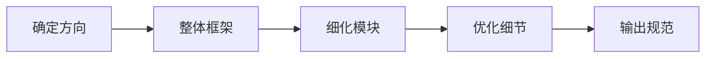
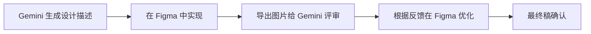

# 进阶技巧与工作流

## 前言

经过前面的学习，你已经掌握了 Gemini UI 设计的基础技能。本章将分享一些进阶技巧和高效的工作流程，帮助你成为 AI 设计的高手。

## 进阶提示词技巧

### 技巧一：多轮对话设计

利用 Gemini 的上下文记忆能力，进行渐进式设计：



**实践示例：设计一个完整的 App**

```
【第一轮：确定方向】
我想设计一个专注于健康饮食的 App，目标用户是想要减肥的年轻女性。
请帮我分析：
1. 这类 App 通常有哪些核心功能？
2. 用户最关心的功能是什么？
3. 设计上应该注意什么？

【第二轮：确定功能结构】
基于你的分析，我决定包含以下功能：
- 食物热量记录
- 每日饮食计划
- 健康食谱推荐
- 体重变化追踪

请帮我规划这个 App 的页面结构（Information Architecture）。

【第三轮：设计首页】
现在请设计这个 App 的首页，要求：
[详细的设计需求...]

【第四轮：设计其他页面】
首页设计很棒，请继续设计「食物记录」页面，
保持与首页相同的设计风格...

【第五轮：输出设计系统】
现在请整理整个 App 的设计系统，包括：
- 颜色规范
- 字体规范
- 组件库
- 间距系统
```

### 技巧二：参考图片辅助设计

上传参考图片，让 AI 理解你的设计方向：

```
【使用参考图片的提示词】

我上传了一张 Dribbble 上的设计作品作为参考（图片 A）。

请分析这个设计的特点：
1. 整体风格是什么？
2. 使用了哪些颜色？
3. 布局有什么特点？
4. 有哪些值得借鉴的细节？

然后，请设计一个类似风格的 [你的项目]，
但要有自己的特色，不要完全复制。
```

### 技巧三：设计对比与选择

让 AI 生成多个方案供选择：

```
请为这个音乐 App 的首页提供 3 个不同风格的设计方案：

【方案 A】极简风格
- 大量留白
- 单色调
- 简单的几何图形

【方案 B】活力年轻
- 渐变色彩
- 动感的曲线
- 醒目的对比

【方案 C】暗黑科技
- 深色背景
- 霓虹色点缀
- 科技感元素

请分别描述每个方案的设计细节，并说明各自的优缺点。
```

### 技巧四：设计约束法

通过设置约束激发创意：

```
请在以下约束条件下设计一个登录页面：

【约束条件】
- 只能使用黑白灰三种颜色
- 最多使用 3 种不同字号
- 不使用任何图标
- 页面元素不超过 10 个
- 留白面积至少占 60%

在这些限制下，如何设计出既简洁又有吸引力的界面？
```

### 技巧五：角色扮演法

让 AI 从不同角色角度思考设计：

```
请从以下三个角度评估这个电商首页设计：

【用户视角】
作为一个想要快速找到商品的用户，你会如何使用这个页面？
有哪些地方让你感到困惑或不便？

【设计师视角】
从专业设计的角度，这个设计有哪些亮点和不足？
如何提升视觉层次和美感？

【产品经理视角】
这个设计是否有效地引导用户完成购买？
哪些元素对转化率有正面/负面影响？

基于以上分析，请提出改进方案。
```

## 高效工作流程

### 设计流程模板

```mermaid
flowchart TB
    subgraph 1. 需求阶段
        A1[明确目标用户]
        A2[定义核心功能]
        A3[确定设计风格]
    end

    subgraph 2. 探索阶段
        B1[收集参考资料]
        B2[生成多个方案]
        B3[方案对比选择]
    end

    subgraph 3. 设计阶段
        C1[主页面设计]
        C2[次级页面设计]
        C3[组件设计]
    end

    subgraph 4. 优化阶段
        D1[细节打磨]
        D2[响应式适配]
        D3[深色模式]
    end

    subgraph 5. 交付阶段
        E1[设计规范输出]
        E2[切图/标注]
        E3[代码生成]
    end

    1. 需求阶段 --> 2. 探索阶段
    2. 探索阶段 --> 3. 设计阶段
    3. 设计阶段 --> 4. 优化阶段
    4. 优化阶段 --> 5. 交付阶段
```

### 快速原型工作流

适合快速验证想法：

```
【30 分钟完成原型】

Step 1（5分钟）：描述产品概念
"我想做一个 [产品类型]，解决 [用户问题]"

Step 2（10分钟）：生成主要页面
使用模板提示词快速生成 3-5 个核心页面

Step 3（10分钟）：迭代优化
针对关键页面进行 1-2 轮优化

Step 4（5分钟）：整理输出
获取设计描述或图片用于演示
```

### 完整项目工作流

适合正式项目：

```
【完整设计项目流程】

Day 1：需求分析 & 竞品研究
- 明确项目目标和用户画像
- 分析 3-5 个竞品设计
- 确定设计方向和风格

Day 2-3：设计探索
- 生成多个设计方案
- 内部评审选择方向
- 确定设计系统框架

Day 4-7：主要页面设计
- 按优先级设计核心页面
- 每个页面进行 2-3 轮迭代
- 建立组件复用

Day 8-9：完善 & 适配
- 完善所有页面
- 设计响应式方案
- 深色模式适配

Day 10：交付
- 整理设计规范
- 导出设计文件
- 生成开发资源
```

## 设计系统构建

### 使用 Gemini 构建设计系统

```
请帮我构建一个完整的设计系统，用于 [项目名称]。

【1. 基础变量】

颜色系统：
- 品牌色：[主色] [辅助色]
- 功能色：成功/警告/错误/信息
- 中性色：从白到黑的灰度色阶（50-900）
- 背景色、边框色、文字色

字体系统：
- 字体家族（中英文）
- 字号规范（H1-H6、正文、辅助）
- 字重（Light/Regular/Medium/Bold）
- 行高规范

间距系统：
- 基础单位：4px 或 8px
- 间距变量：xs/sm/md/lg/xl/2xl
- 具体数值

圆角系统：
- 小圆角（按钮、输入框）
- 中圆角（卡片）
- 大圆角（弹窗）
- 全圆角（头像、标签）

阴影系统：
- 小阴影（卡片默认）
- 中阴影（卡片悬停、下拉菜单）
- 大阴影（弹窗、模态框）

【2. 组件规范】

请为以下组件定义规范：
- 按钮（类型、尺寸、状态）
- 输入框（类型、状态）
- 选择器（单选、多选、下拉）
- 卡片（基础、带图、交互式）
- 导航（顶部、底部、侧边）
- 弹窗（确认框、提示框、抽屉）
- 表格（基础、可操作）
- 列表（简单、复杂）

【3. 输出格式】

请以 Markdown 表格形式输出：
- 变量名称
- 具体数值
- 使用场景
- 示例
```

### 设计系统输出示例

**颜色规范：**

| 变量名 | 色值 | 使用场景 |
|--------|------|----------|
| --primary-50 | #EEF2FF | 浅色背景 |
| --primary-100 | #E0E7FF | 悬停背景 |
| --primary-500 | #6366F1 | 主按钮、链接 |
| --primary-600 | #4F46E5 | 按钮悬停 |
| --primary-700 | #4338CA | 按钮按下 |
| --gray-50 | #F9FAFB | 页面背景 |
| --gray-100 | #F3F4F6 | 卡片背景 |
| --gray-500 | #6B7280 | 辅助文字 |
| --gray-900 | #111827 | 主要文字 |

**间距规范：**

| 变量名 | 数值 | 使用场景 |
|--------|------|----------|
| --space-1 | 4px | 元素内微间距 |
| --space-2 | 8px | 相关元素间距 |
| --space-3 | 12px | 小组件间距 |
| --space-4 | 16px | 卡片内边距 |
| --space-6 | 24px | 区域间距 |
| --space-8 | 32px | 大区域间距 |
| --space-12 | 48px | 页面区块间距 |

## AI 设计效率技巧

### 批量生成技巧

```
请一次性生成以下 5 个图标的设计描述：
1. 首页图标
2. 搜索图标
3. 通知图标
4. 个人中心图标
5. 设置图标

要求：
- 风格统一：线性图标，圆角
- 尺寸：24×24px
- 线条粗细：1.5px
- 描述每个图标的具体形状
```

### 状态变体生成

```
请为这个按钮组件生成所有状态变体：

基础按钮：
- 蓝色背景 #3B82F6
- 白色文字
- 高度 40px
- 圆角 8px

请生成以下状态：
1. Default（默认）
2. Hover（悬停）
3. Active（按下）
4. Focus（聚焦，键盘操作）
5. Disabled（禁用）
6. Loading（加载中）

每个状态请说明颜色、阴影等变化。
```

### 设计检查清单

```
请检查这个设计是否符合以下标准：

【可用性检查】
□ 点击目标足够大（≥44px）
□ 颜色对比度符合 WCAG 标准
□ 有明确的视觉焦点引导
□ 错误状态有清晰提示
□ 加载状态有反馈

【一致性检查】
□ 颜色使用一致
□ 字体规范统一
□ 间距遵循系统
□ 组件风格统一
□ 图标风格一致

【完整性检查】
□ 所有状态已设计（空、加载、错误）
□ 边界情况已考虑（长文本、无数据）
□ 响应式方案已规划
□ 深色模式已设计

请针对每一项给出评估结果和改进建议。
```

## 与其他工具配合

### AI 设计 + Figma 工作流



**配合使用技巧：**

1. **概念阶段**：用 Gemini 快速探索多个方向
2. **实现阶段**：在 Figma 中精确还原和调整
3. **评审阶段**：截图给 Gemini 获取改进建议
4. **交付阶段**：用 Gemini 生成设计规范文档

### AI 设计 + 代码实现

```
【从设计到代码的提示词】

这是我在 Figma 中完成的设计稿（上传截图）。

请帮我将这个设计转换为 [React/Vue/Flutter] 代码：

要求：
1. 尽可能还原设计稿的样式
2. 代码结构清晰，可维护
3. 使用 [Tailwind CSS/CSS Modules/styled-components]
4. 包含响应式适配
5. 添加基本的交互效果

请逐个组件输出代码。
```

## 常见问题解决

### 问题一：AI 生成的设计不够精准

**解决方案：**
- 提供更多细节描述
- 使用具体的数值（颜色、尺寸）
- 上传参考图片
- 分步骤逐渐细化

### 问题二：设计风格不一致

**解决方案：**
- 在对话开始时建立设计系统
- 每次设计都引用设计系统
- 使用同一个对话完成所有页面

```
【保持一致性的提示词】

请严格按照我们之前确定的设计系统进行设计：
- 主色：#3B82F6
- 字体：SF Pro
- 圆角：8px（卡片）、4px（按钮）
- 间距：基于 8px 网格

现在请设计 [新页面]...
```

### 问题三：无法获得高质量图片

**解决方案：**
- 使用更详细的描述
- 指定图片风格（如"扁平插画风格"）
- 分解复杂设计，逐部分生成
- 尝试不同的措辞方式

## 本章小结

通过本章学习，你掌握了：

1. **进阶提示词技巧**：多轮对话、参考图片、设计约束
2. **高效工作流**：快速原型和完整项目流程
3. **设计系统构建**：系统化的设计规范
4. **效率技巧**：批量生成、状态变体
5. **工具配合**：与 Figma、代码的协作
6. **问题解决**：常见问题的解决方案

## 下一步

最后一章，我们将分享学习资源和社区，帮助你持续提升 AI 设计能力。

---

> 💡 **学习建议**：建立自己的提示词库，把有效的提示词保存下来，形成个人的设计工具箱。
