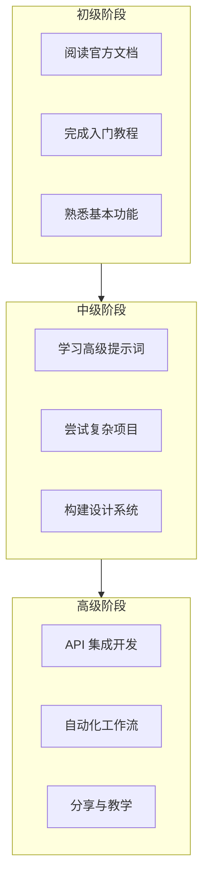
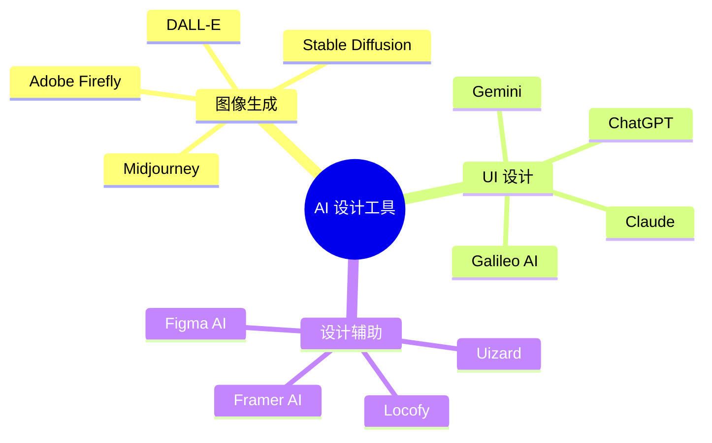
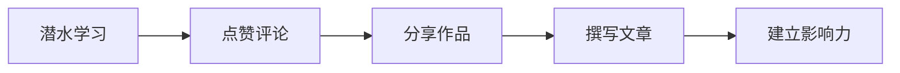
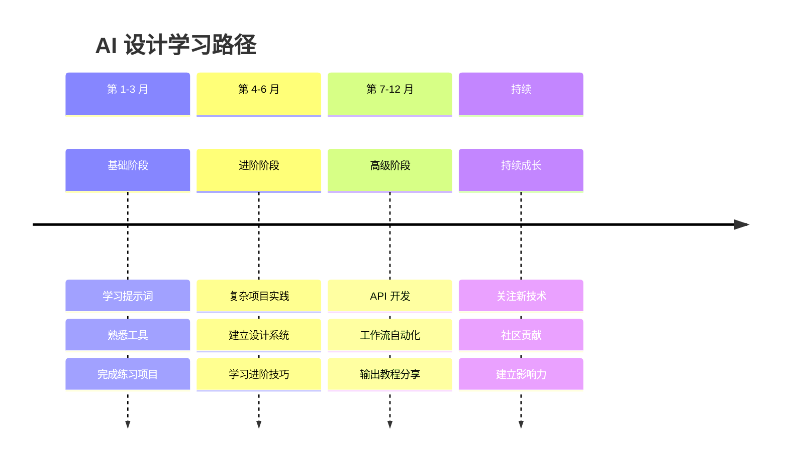
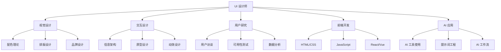

# 学习资源与社区

## 前言

恭喜你完成了 Gemini UI 设计的系统学习！但学习不应止步于此。本章将为你推荐优质的学习资源和设计社区，帮助你持续提升技能，与同行交流成长。

## 官方资源

### Google AI 官方

| 资源 | 链接 | 说明 |
|------|------|------|
| Google AI Studio | aistudio.google.com | 官方 AI 工作台 |
| Gemini API 文档 | ai.google.dev | 开发者文档 |
| Google AI Blog | blog.google/technology/ai | 最新技术动态 |
| Gemini 示例库 | github.com/google-gemini | 官方代码示例 |

### 学习路径



## 设计灵感平台

### 国际平台

| 平台 | 特点 | 推荐指数 |
|------|------|----------|
| **Dribbble** | 设计师作品展示，高质量 UI 设计 | ⭐⭐⭐⭐⭐ |
| **Behance** | 完整项目案例，流程展示 | ⭐⭐⭐⭐⭐ |
| **Pinterest** | 海量灵感图片，便于收藏 | ⭐⭐⭐⭐ |
| **Awwwards** | 获奖网站设计，高端案例 | ⭐⭐⭐⭐ |
| **Mobbin** | 移动端 UI 截图库 | ⭐⭐⭐⭐⭐ |
| **Screenlane** | App 界面截图收集 | ⭐⭐⭐⭐ |
| **UI8** | 设计资源购买平台 | ⭐⭐⭐⭐ |

### 国内平台

| 平台 | 特点 | 推荐指数 |
|------|------|----------|
| **站酷 (zcool.com.cn)** | 国内最大设计社区 | ⭐⭐⭐⭐⭐ |
| **UI中国** | UI 设计专业平台 | ⭐⭐⭐⭐ |
| **花瓣网** | 设计灵感收集 | ⭐⭐⭐⭐ |
| **优设** | 设计教程和资讯 | ⭐⭐⭐⭐ |

### 如何有效使用灵感平台

```
【收集灵感的方法】

1. 建立分类收藏夹
   - 按类型：App 首页、登录页、个人中心等
   - 按风格：极简、科技、可爱等
   - 按行业：电商、金融、社交等

2. 分析优秀设计
   - 布局结构是怎样的？
   - 使用了哪些颜色？
   - 有什么创新的交互？
   - 细节处理有什么特点？

3. 提取设计模式
   - 记录常见的设计模式
   - 总结可复用的组件设计
   - 建立个人设计参考库
```

## 设计工具推荐

### UI 设计工具

| 工具 | 类型 | 适用场景 |
|------|------|----------|
| **Figma** | 云端协作 | 团队协作首选 |
| **Sketch** | Mac 原生 | 个人/小团队 |
| **Adobe XD** | Adobe 生态 | Adobe 用户 |
| **Framer** | 交互原型 | 高保真原型 |
| **Principle** | 动效设计 | 交互动画 |

### 辅助工具

| 工具 | 用途 | 推荐度 |
|------|------|--------|
| **Coolors** | 配色方案生成 | ⭐⭐⭐⭐⭐ |
| **ColorHunt** | 配色灵感 | ⭐⭐⭐⭐ |
| **Contrast** | 对比度检查 | ⭐⭐⭐⭐ |
| **Iconify** | 图标搜索 | ⭐⭐⭐⭐⭐ |
| **Unsplash** | 免费图片 | ⭐⭐⭐⭐⭐ |
| **Remove.bg** | 背景去除 | ⭐⭐⭐⭐ |
| **TinyPNG** | 图片压缩 | ⭐⭐⭐⭐ |

### AI 设计工具生态



## 学习资源推荐

### 在线课程

| 平台 | 推荐课程 | 说明 |
|------|----------|------|
| **Coursera** | Google UX Design | Google 官方认证 |
| **Udemy** | UI Design Bootcamp | 实战课程丰富 |
| **Skillshare** | UI/UX 系列 | 短视频为主 |
| **慕课网** | UI 设计系列 | 中文课程 |
| **网易云课堂** | 交互设计课程 | 国内平台 |

### 书籍推荐

**入门必读：**

| 书名 | 作者 | 主题 |
|------|------|------|
| 《设计心理学》 | Don Norman | 用户体验基础 |
| 《点石成金》 | Steve Krug | Web 可用性 |
| 《设计中的设计》 | 原研哉 | 设计思维 |

**进阶阅读：**

| 书名 | 作者 | 主题 |
|------|------|------|
| 《界面设计模式》 | Jenifer Tidwell | UI 设计模式 |
| 《移动应用 UI 设计模式》 | Theresa Neil | 移动端设计 |
| 《交互设计精髓》 | Alan Cooper | 交互设计理论 |

### 博客与公众号

**英文博客：**
- Nielsen Norman Group (nngroup.com)
- Smashing Magazine
- UX Collective (Medium)
- A List Apart

**中文公众号：**
- 体验进阶
- 设计思考
- 腾讯 ISUX
- 阿里巴巴 UED

## 社区与交流

### 设计社区

| 社区 | 特点 | 链接 |
|------|------|------|
| **Designer Hangout** | Slack 社区 | 国际设计师交流 |
| **Spectrum** | 开放社区 | 产品设计讨论 |
| **站酷** | 国内社区 | 作品展示、招聘 |
| **即刻** | 话题社区 | 设计圈子活跃 |

### 如何参与社区



**社区参与建议：**

1. **多看少说**：先观察社区氛围，了解讨论风格
2. **真诚互动**：给出有价值的评论和反馈
3. **持续分享**：定期分享学习心得和作品
4. **乐于助人**：帮助解答他人的问题
5. **保持谦虚**：虚心接受批评，持续改进

### 线下活动

- **设计周/设计节**：如北京设计周、上海设计周
- **设计 Meetup**：本地设计师聚会
- **行业大会**：IXDC、UXPA 等
- **公司开放日**：大厂设计团队分享

## AI 设计最新动态

### 关注的技术趋势

| 趋势 | 说明 | 影响 |
|------|------|------|
| 多模态 AI | 文字、图片、视频联合理解 | 更丰富的设计输入 |
| 实时协作 | AI 参与实时设计协作 | 提升团队效率 |
| 个性化 | AI 学习个人设计风格 | 更贴合个人习惯 |
| 代码生成 | 设计到代码自动转换 | 缩短开发周期 |

### 持续学习路径



## 实践项目建议

### 初级项目

1. **个人名片页**：设计自己的在线名片
2. **天气 App**：简单的天气展示应用
3. **计算器**：iOS 风格计算器

### 中级项目

1. **电商 App**：完整的购物流程设计
2. **社交应用**：聊天、动态、个人主页
3. **后台系统**：数据管理 Dashboard

### 高级项目

1. **设计系统**：构建完整的组件库
2. **跨平台设计**：Web + App 响应式方案
3. **创新交互**：探索新的交互模式

## 职业发展建议

### 技能树



### 作品集建议

**作品集必备内容：**

1. **个人介绍**：简洁有力的自我定位
2. **精选项目**：3-5 个高质量项目
3. **过程展示**：不只是结果，展示思考过程
4. **问题解决**：突出解决了什么问题
5. **数据成果**：如果有，展示设计带来的业务价值

**AI 设计作品展示技巧：**

```
【展示 AI 设计项目的框架】

1. 项目背景
   - 为什么选择用 AI 辅助设计？
   - 项目的目标和约束是什么？

2. AI 协作过程
   - 使用了哪些 AI 工具？
   - 提示词是如何迭代优化的？
   - AI 和人工各贡献了什么？

3. 设计成果
   - 最终设计展示
   - 设计规范文档
   - （如有）代码实现

4. 反思与学习
   - AI 帮助提升了什么？
   - 遇到了什么挑战？
   - 下次会如何改进？
```

## 本章小结

通过本章，你了解了：

1. **官方资源**：Google AI 官方学习资源
2. **灵感平台**：Dribbble、Behance 等优质平台
3. **设计工具**：UI 设计和辅助工具推荐
4. **学习资源**：课程、书籍、博客推荐
5. **社区交流**：如何参与设计社区
6. **职业发展**：技能树和作品集建议

## 结语

恭喜你完成了整个 Gemini UI 设计教程的学习！

从认识 Gemini 到环境配置，从提示词基础到进阶技巧，从移动端到 Web 端实战，你已经掌握了使用 AI 进行 UI 设计的核心技能。

但这只是开始。AI 技术在快速发展，设计领域也在不断变化。保持学习的热情，持续实践和探索，你一定能在 AI 时代成为更出色的设计师。

**最后的建议：**

1. **多练习**：理论学习需要实践来巩固
2. **多思考**：不要只是使用 AI，要理解设计原理
3. **多分享**：教是最好的学，分享你的经验
4. **多关注**：关注 AI 和设计的最新动态
5. **保持好奇**：对新技术、新工具保持开放心态

祝你在 AI 设计的道路上越走越远！🚀

---

> 💡 **最后一条建议**：立即开始一个小项目，把学到的知识用起来吧！
