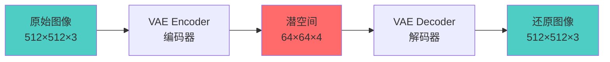
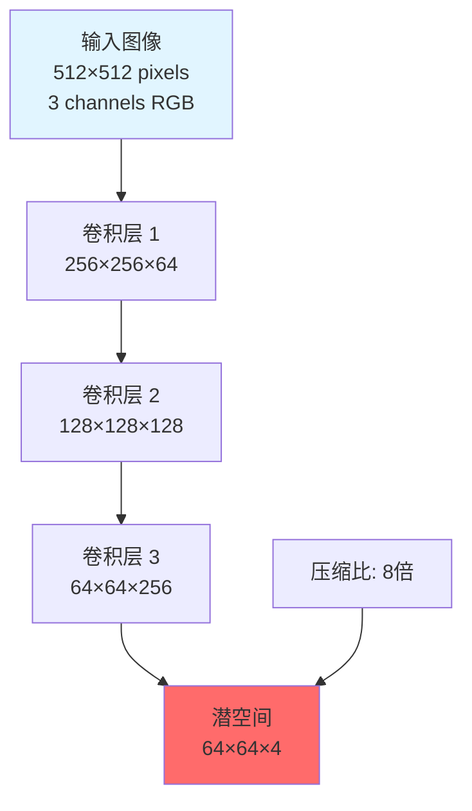
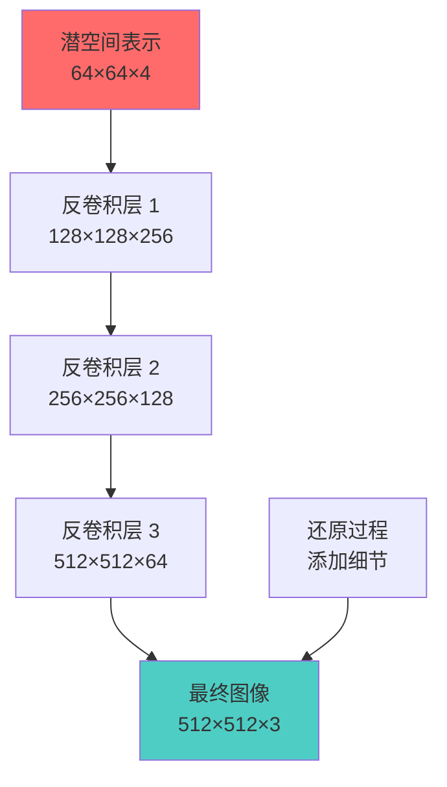
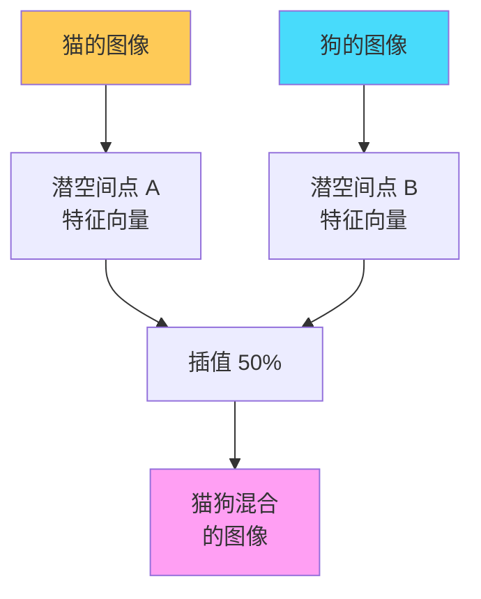
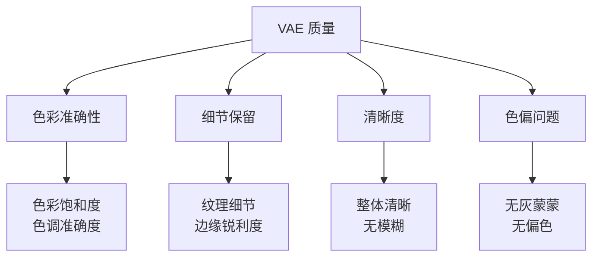
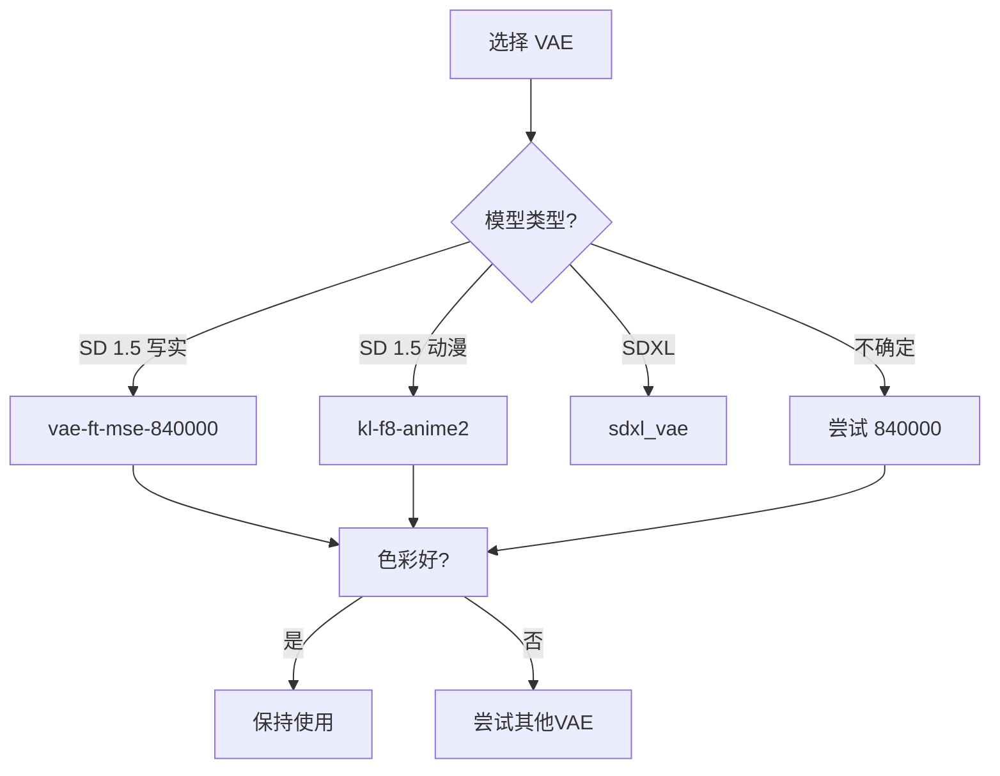
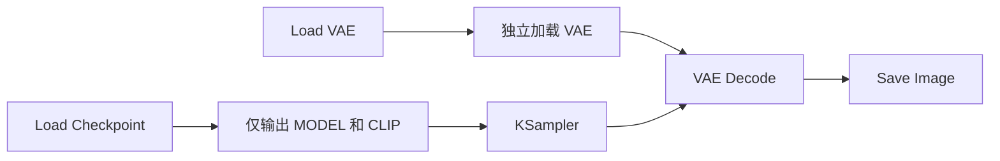
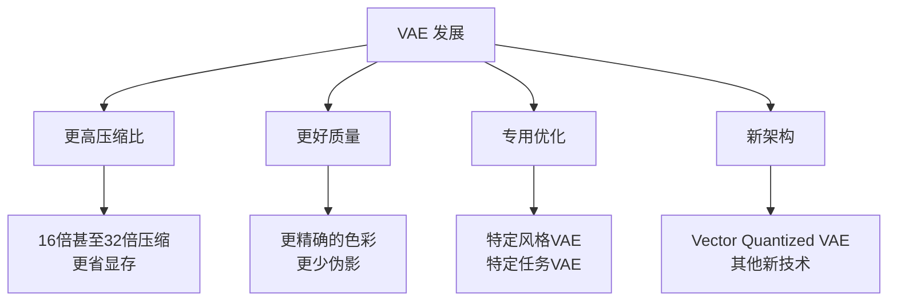

# VAE 详解 - 图像质量的关键

## 🎯 什么是 VAE?

VAE (Variational Autoencoder,变分自编码器) 是 Stable Diffusion 中负责图像压缩和还原的核心组件,直接影响最终图像的色彩、细节和整体质量。

### 核心定义



**简单理解:**
- VAE = 图像的压缩器和解压器 
- Encoder: 把大图压成小数据
- Decoder: 把小数据还原成大图
- 质量好坏直接影响最终画面

---

## 📐 VAE 的工作原理

### 编码过程 (Encoding)



**编码详解:**
```java
输入数据:
  图像尺寸: 512×512
  通道数: 3 (RGB)
  数据量: 512 × 512 × 3 = 786,432 个数值

↓ VAE Encoder 处理

输出潜空间:
  尺寸: 64×64
  通道数: 4 (潜空间特征)
  数据量: 64 × 64 × 4 = 16,384 个数值

压缩比:
  786,432 / 16,384 = 48 倍数据压缩
  空间维度: 8 倍压缩 (512÷64)
```

**为什么要压缩?**
```java
优势:
  ✅ 显存占用大幅降低
     512² 处理 vs 64² 处理
     显存需求降低 ~60倍

  ✅ 计算速度显著提升
     UNet 在小尺寸空间操作
     生成速度提升 ~10倍

  ✅ 训练成本降低
     更小的数据量 = 更快训练
     使消费级 GPU 训练成为可能

  ✅ 保留核心特征
     压缩过程提取关键信息
     去除冗余细节
```

### 解码过程 (Decoding)



**解码详解:**
```java
输入潜空间:
  尺寸: 64×64
  通道数: 4
  包含: 压缩的图像特征

↓ VAE Decoder 处理
  上采样: 逐步放大尺寸
  反卷积: 还原图像细节
  激活函数: 生成像素值

输出图像:
  尺寸: 512×512
  通道数: 3 (RGB)
  像素值: [0, 255]

关键点:
  • 不是简单的放大
  • 重建纹理和细节
  • 恢复色彩信息
  • 填补压缩时丢失的信息
```

### 潜空间的意义

**什么是潜空间 (Latent Space)?**
```java
定义:
  一个低维的、连续的特征空间
  包含图像的抽象表示
  不是像素,而是"概念"

特点:
  ✅ 维度降低
     原始: 786k 维
     潜空间: 16k 维

  ✅ 语义化
     相似的图像在潜空间中距离近
     不同的图像距离远

  ✅ 可插值
     两个图像的潜空间表示可以平滑过渡
     实现图像之间的渐变

  ✅ 可操作
     在潜空间中修改 = 控制图像特征
     UNet 在潜空间中工作更高效
```

**潜空间可视化:**


---

## 🔍 VAE 对图像质量的影响

### 影响的关键方面



### 1. 色彩准确性

**好的 VAE:**
```java
特征:
  ✅ 色彩鲜艳自然
  ✅ 色调准确
  ✅ 对比度适中
  ✅ 无明显色偏

表现:
  天空: 纯净的蓝色
  皮肤: 自然的肤色
  植物: 生机勃勃的绿色
```

**差的 VAE (如某些 Checkpoint 自带的):**
```java
问题:
  ❌ 色彩发灰、发暗
  ❌ 饱和度不足
  ❌ 整体偏灰蒙蒙
  ❌ 可能有色偏

表现:
  天空: 灰蒙蒙的蓝色
  皮肤: 苍白或偏黄
  植物: 暗淡的绿色
```

**对比示例:**
```java
场景: 生成日落场景

使用默认 VAE:
  "天空颜色偏灰,金色不够鲜艳"

使用 MSE840000 VAE:
  "天空呈现漂亮的橙红色,色彩饱满"

差异:
  同样的 Checkpoint 和提示词
  仅仅是 VAE 不同
  画面质量天差地别
```

### 2. 细节保留

**高质量 VAE:**
```java
能够保留:
  ✅ 头发丝的纹理
  ✅ 皮肤的毛孔
  ✅ 布料的织纹
  ✅ 远景的细节
  ✅ 边缘的清晰度

解码精度高:
  潜空间 → 图像
  细节损失少
  纹理还原好
```

**低质量 VAE:**
```java
常见问题:
  ❌ 细节模糊
  ❌ 纹理丢失
  ❌ 边缘发虚
  ❌ 远景糊成一团
  ❌ 整体不够锐利

原因:
  解码能力不足
  信息还原不完整
  细节重建能力弱
```

### 3. 伪影和噪点

**VAE 导致的常见问题:**
```java
1. 色块和色带
   表现: 颜色过渡不平滑,出现明显分界
   原因: VAE 量化精度不足

2. 棋盘格纹理
   表现: 规律的棋盘状图案
   原因: 解码器上采样问题

3. 噪点
   表现: 画面有颗粒感
   原因: VAE 解码误差

4. 模糊
   表现: 整体不够清晰
   原因: VAE 还原能力不足
```

---

## 📦 常见的 VAE 模型

### 官方和主流 VAE

**1. vae-ft-mse-840000-ema-pruned (推荐)**
```java
基本信息:
  全名: VAE Fine-Tuned MSE 840000 steps
  文件名: vae-ft-mse-840000-ema-pruned.safetensors
  大小: 319 MB
  训练步数: 840,000 步

特点:
  ✅ 最流行的独立 VAE
  ✅ 色彩表现优秀
  ✅ 细节保留好
  ✅ 兼容性极佳
  ✅ 适配 SD 1.x 全系列

适用模型:
  • SD 1.4 / 1.5
  • 所有 SD 1.5 微调模型
  • 大部分社区模型

使用场景:
  写实人像、风景、产品图
  任何需要色彩准确的场景
```

**2. vae-ft-ema-560000-ema-pruned**
```java
基本信息:
  训练步数: 560,000 步
  大小: 319 MB
  训练早于 840000 版本

特点:
  ✅ 风格略有不同
  ✅ 某些场景表现更好
  ❌ 总体不如 840000

使用建议:
  如果 840000 效果不理想可尝试
  某些老模型可能更适配
```

**3. kl-f8-anime (动漫专用)**
```java
基本信息:
  专为动漫风格优化
  大小: ~300 MB

特点:
  ✅ 动漫色彩更鲜艳
  ✅ 线条更清晰
  ✅ 二次元质感好
  ❌ 不适合写实风格

适用模型:
  • Anything 系列
  • Counterfeit
  • Pastel Mix
  • 其他动漫模型
```

**4. kl-f8-anime2 (改进版)**
```java
基本信息:
  动漫 VAE 第二代
  进一步优化

特点:
  ✅ 在 kl-f8-anime 基础上改进
  ✅ 色彩更准确
  ✅ 细节更丰富

使用场景:
  追求高质量动漫图
  对色彩要求高的动漫创作
```

**5. SDXL VAE (SDXL 专用)**
```java
基本信息:
  文件名: sdxl_vae.safetensors
  大小: ~300 MB
  仅适配 SDXL

特点:
  ✅ SDXL 原生 VAE
  ✅ 1024×1024 优化
  ✅ 质量极高
  ❌ 不兼容 SD 1.x

使用:
  通常 SDXL 模型已内置
  如遇色彩问题可单独加载
```

### VAE 选择指南



**选择策略:**
```java
步骤 1: 确定基础模型版本
  SD 1.x → 通用 VAE
  SDXL → SDXL VAE

步骤 2: 确定风格类型
  写实 → vae-ft-mse-840000
  动漫 → kl-f8-anime2
  艺术 → 尝试不同 VAE

步骤 3: 测试对比
  生成同一场景
  对比色彩和细节
  选择效果最好的

步骤 4: 特殊情况
  某些模型自带优秀 VAE → 使用自带
  某些模型自带差 VAE → 替换独立VAE
  某些模型明确指定 VAE → 按推荐使用
```

---

## 🔧 VAE 的使用方法

### WebUI 中使用 VAE

**方法 1: 全局设置**
```java
位置:
  Settings → Stable Diffusion → SD VAE

操作:
  1. 下拉菜单选择 VAE
  2. 选择: vae-ft-mse-840000-ema-pruned.safetensors
  3. Apply Settings
  4. Reload UI

效果:
  所有生成都使用该 VAE
  除非单独指定
```

**方法 2: 单次指定**
```java
位置:
  生成界面 → Settings 下方 → VAE 选项

操作:
  每次生成前选择 VAE

优点:
  灵活切换不同 VAE
  测试对比效果

缺点:
  每次都要手动选择
```

**方法 3: 模型内置 VAE**
```java
某些 Checkpoint 已内置 VAE:
  realisticVisionV51_v51VAE.safetensors
  // 文件名包含 VAE 说明已内置

使用:
  选择 "Automatic" 或 "None"
  自动使用模型内置 VAE

判断是否需要替换:
  生成图片色彩正常 → 保持
  生成图片偏灰偏暗 → 替换独立VAE
```

### ComfyUI 中使用 VAE

**完整工作流示例:**


**节点配置:**
```java
// Load VAE 节点
节点: Load VAE
参数: vae_name
选择: vae-ft-mse-840000-ema-pruned.safetensors

连接:
  Load VAE → VAE → VAE Decode

// VAE Decode 节点
输入:
  samples: 来自 KSampler
  vae: 来自 Load VAE

输出:
  IMAGE → Save Image
```

**使用 Checkpoint 内置 VAE:**
```java
// 直接从 Checkpoint 获取 VAE
Load Checkpoint
  ↓ VAE 输出
VAE Decode

// 无需额外 Load VAE 节点
```

### VAE 文件存放位置

**标准目录:**
```
Stable Diffusion WebUI/
└── models/
    └── VAE/
        ├── vae-ft-mse-840000-ema-pruned.safetensors
        ├── kl-f8-anime.safetensors
        └── kl-f8-anime2.ckpt

ComfyUI/
└── models/
    └── vae/
        ├── vae-ft-mse-840000-ema-pruned.safetensors
        └── kl-f8-anime2.ckpt
```

---

## 🎨 VAE 对比实战

### 测试场景设置

**标准测试流程:**
```java
步骤 1: 准备测试提示词
  "a beautiful girl, detailed face, long hair,
   natural lighting, high quality"

步骤 2: 固定其他参数
  Checkpoint: Realistic Vision V5.1
  Seed: 12345 (固定)
  Steps: 28
  CFG: 7.5
  Sampler: DPM++ 2M Karras
  Resolution: 512×768

步骤 3: 仅改变 VAE
  第一次: Automatic (模型内置)
  第二次: vae-ft-mse-840000
  第三次: kl-f8-anime2

步骤 4: 对比结果
  观察色彩、细节、清晰度
```

### 典型对比案例

**案例 1: 人像摄影**
```java
场景: 自然光人像

使用默认 VAE:
  色彩: 偏灰,不够鲜艳
  皮肤: 略显苍白
  背景: 虚化不够自然
  整体: 缺乏生气

使用 840000 VAE:
  色彩: 鲜艳自然
  皮肤: 健康红润
  背景: 虚化柔和
  整体: 照片级质感

差异:
  色彩饱和度提升明显
  细节纹理更清晰
  整体质感大幅提升
```

**案例 2: 风景照片**
```java
场景: 日落海滩

使用默认 VAE:
  天空: 橙色不够鲜艳
  海水: 偏灰蓝色
  沙滩: 色彩暗淡
  日落: 金色不够明显

使用 840000 VAE:
  天空: 鲜艳的橙红色
  海水: 清澈的蓝色
  沙滩: 温暖的金黄色
  日落: 璀璨的金色光芒

差异:
  色彩对比度大幅提升
  整体氛围更震撼
  细节保留更完整
```

**案例 3: 动漫角色**
```java
场景: 可爱动漫女孩

使用通用 840000 VAE:
  色彩: 相对柔和
  线条: 清晰但不够锐利
  整体: 偏真实感

使用 kl-f8-anime2 VAE:
  色彩: 鲜艳明亮
  线条: 锐利清晰
  整体: 典型二次元质感

差异:
  动漫 VAE 更符合二次元风格
  色彩饱和度更高
  更接近手绘感觉
```

---

## ⚠️ VAE 使用注意事项

### 常见问题

**问题 1: VAE 不生效**
```java
症状:
  切换 VAE 后画面无变化

可能原因:
  1. 未重载界面
     解决: WebUI 点击 Reload UI

  2. 缓存未清除
     解决: 清除浏览器缓存,重启

  3. VAE 文件损坏
     解决: 重新下载 VAE

  4. 路径错误
     解决: 确认 VAE 在正确目录
```

**问题 2: 使用 VAE 后图像异常**
```java
症状:
  图像出现奇怪色彩或伪影

可能原因:
  1. VAE 不兼容当前模型
     解决: 尝试其他 VAE

  2. VAE 文件损坏
     解决: 重新下载

  3. 模型和 VAE 版本不匹配
     解决: SD1.x 用 SD1.x VAE
          SDXL 用 SDXL VAE
```

**问题 3: VAE 加载慢**
```java
症状:
  切换 VAE 后等待时间长

原因:
  VAE 需要加载到显存

优化方法:
  1. 使用 SSD 存储 VAE
  2. 保持常用 VAE 在显存
  3. 避免频繁切换 VAE
```

### 最佳实践

**实践 1: 建立 VAE 测试流程**
```java
新模型首次使用:
  1. 使用默认 VAE 生成测试图
  2. 切换到 840000 VAE 对比
  3. 如果是动漫模型,测试动漫 VAE
  4. 选择效果最好的 VAE
  5. 记录在模型笔记中

好处:
  建立模型与 VAE 的最佳配对
  避免每次都重复测试
```

**实践 2: 分类管理 VAE**
```java
建议分类:
  通用 VAE/
    ├── vae-ft-mse-840000-ema-pruned.safetensors
    └── vae-ft-ema-560000-ema-pruned.safetensors

  动漫 VAE/
    ├── kl-f8-anime.safetensors
    └── kl-f8-anime2.ckpt

  SDXL VAE/
    └── sdxl_vae.safetensors

好处:
  便于查找和选择
  避免混淆
```

**实践 3: 记录最佳配对**
```java
创建配置文件:
  model_vae_config.txt

内容示例:
  realisticVisionV51.safetensors → 内置VAE
  anythingV5_v5.safetensors → kl-f8-anime2
  dreamshaper_8.safetensors → vae-ft-mse-840000
  sdxlBase_v10.safetensors → sdxl_vae

好处:
  快速找到最佳配置
  避免重复测试
  分享给他人参考
```

---

## 🔬 VAE 的技术细节

### 变分自编码器原理

**数学基础:**
```java
VAE 的训练目标:
  最小化重建损失 + KL 散度

重建损失 (Reconstruction Loss):
  衡量: 原图 vs 重建图的差异
  目标: 尽可能准确还原

KL 散度 (KL Divergence):
  衡量: 潜空间分布 vs 标准正态分布的差异
  目标: 潜空间服从正态分布
  作用: 保证潜空间的平滑性和连续性

公式:
  Loss = MSE(原图, 重建图) + β × KL(编码分布, N(0,1))

β 的作用:
  平衡重建质量和潜空间规整性
  β 太大: 潜空间规整但重建质量下降
  β 太小: 重建质量好但潜空间混乱
```

### 不同 VAE 的区别

**MSE vs KL**
```java
MSE VAE (均方误差):
  损失函数: Mean Squared Error
  特点: 重建更准确
  色彩: 更接近原图
  代表: vae-ft-mse-840000

KL VAE (KL 散度优化):
  损失函数: 强调 KL 散度
  特点: 潜空间更规整
  生成: 更平滑的插值
  代表: 早期 VAE 版本

实际使用:
  MSE VAE 通常效果更好
  色彩还原更准确
  细节保留更完整
```

---

## 📈 VAE 的发展趋势

### 未来方向



**当前研究热点:**
```java
1. 更高效的压缩
   • 保持质量的前提下
   • 提高压缩比
   • 降低计算需求

2. 专用 VAE
   • 人像专用 VAE
   • 场景专用 VAE
   • 动漫专用 VAE

3. 自适应 VAE
   • 根据内容自动调整
   • 重要区域高质量
   • 次要区域高压缩

4. 联合训练
   • VAE 与 UNet 联合优化
   • 端到端训练
   • 整体性能提升
```

---

## 🎓 总结

### VAE 核心要点

```java
1. VAE 的作用
   ✅ 图像压缩: 512×512 → 64×64
   ✅ 图像还原: 64×64 → 512×512
   ✅ 影响色彩、细节、整体质量

2. 推荐使用
   写实风格: vae-ft-mse-840000-ema-pruned
   动漫风格: kl-f8-anime2
   SDXL: sdxl_vae

3. 使用建议
   ✅ 新模型必测 VAE
   ✅ 记录最佳配对
   ✅ 遇到色彩问题优先检查 VAE
   ✅ 不要频繁切换 VAE

4. 重要性
   VAE 虽小(300MB)
   但对画质影响巨大
   必须重视
```

### 快速检查清单

```java
□ 已下载推荐 VAE
  □ vae-ft-mse-840000-ema-pruned.safetensors
  □ kl-f8-anime2.ckpt (如需动漫)

□ VAE 放置正确位置
  □ WebUI: models/VAE/
  □ ComfyUI: models/vae/

□ 测试过 VAE 效果
  □ 对比默认 vs 独立 VAE
  □ 选择效果最好的

□ 记录最佳配置
  □ 哪个模型配哪个 VAE
  □ 建立配置笔记
```

---

