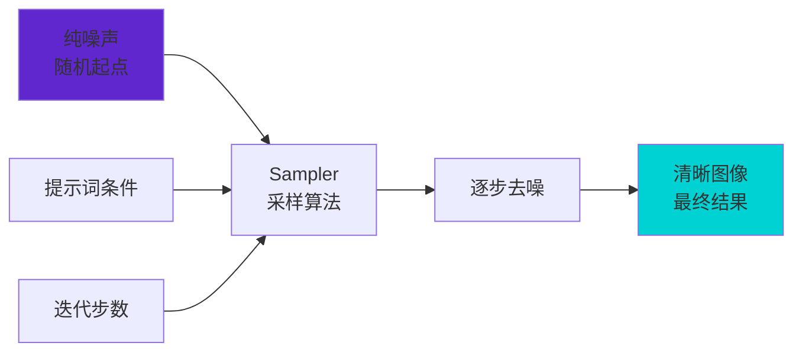
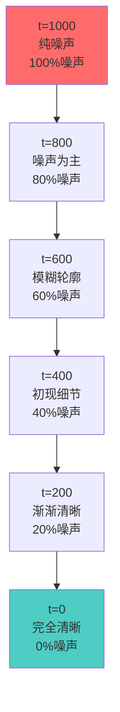
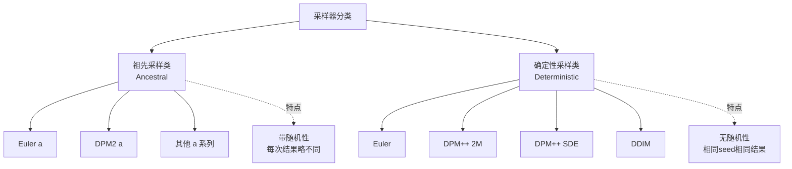
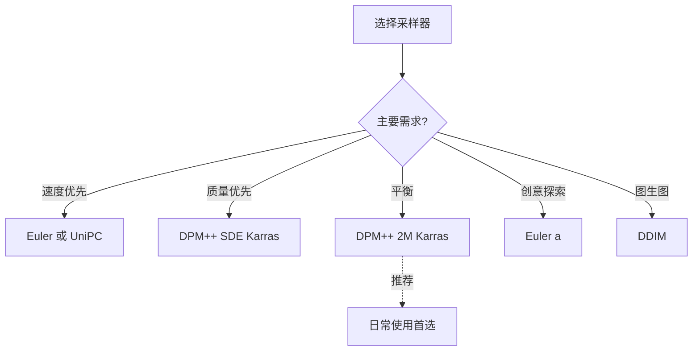
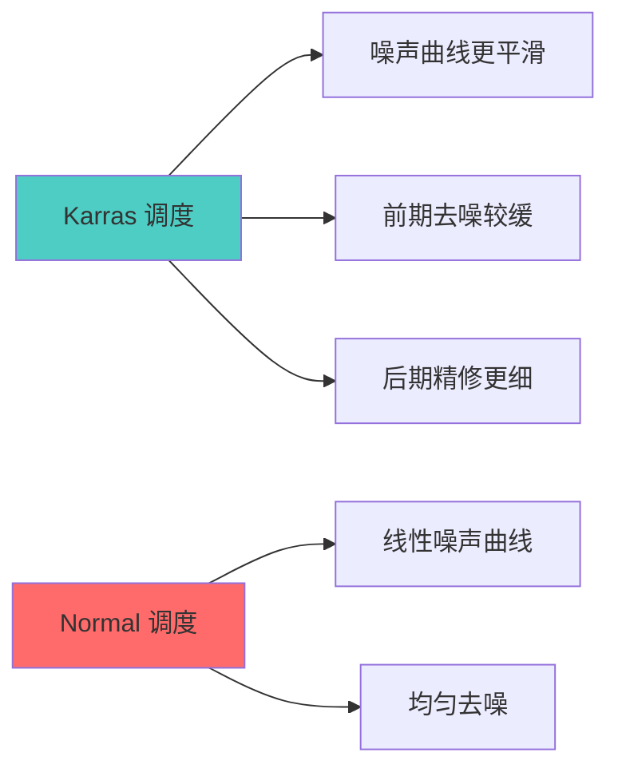
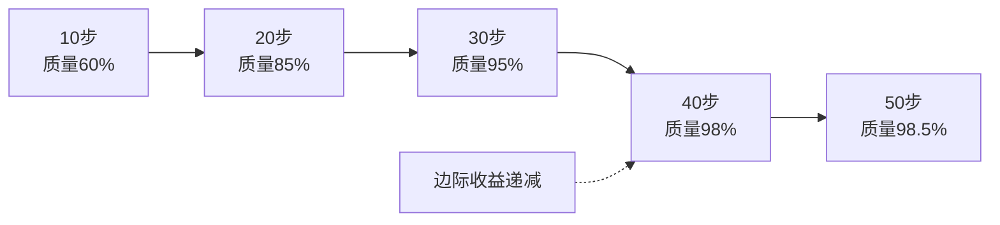

# 采样方法详解 - Sampler 的选择与优化

## 🎯 什么是采样器 (Sampler)?

采样器 (Sampler) 是 Stable Diffusion 中控制"如何从噪声生成图像"的算法,不同的采样器会影响生成速度、图像质量和风格呈现。

### 核心概念



**简单理解:**
- Sampler = 从噪声到图像的"路径规划" 🗺️
- 不同路径,速度和景色不同
- 但目的地(图像)基本相似

---

## 🔄 扩散模型的采样原理

### 去噪过程可视化



### 采样器的核心任务

**每一步都在解决:**
```java
当前状态:
  带噪声的图像 x_t
  当前时间步 t

采样器的任务:
  1. 预测噪声方向
     noise = UNet(x_t, t, prompt)

  2. 计算去噪步长
     step_size = scheduler(t)

  3. 更新图像状态
     x_{t-1} = x_t - step_size * noise

  4. 重复直到 t = 0

关键问题:
  • 如何选择去噪步长?
  • 如何保证收敛稳定?
  • 如何平衡速度和质量?
```

---

## 📊 主流采样器详解

### 采样器分类



### 1. Euler (欧拉方法)

**基本信息:**
```java
类型: 确定性采样器
速度: ⭐⭐⭐⭐⭐ (最快)
质量: ⭐⭐⭐ (中等)
稳定性: ⭐⭐⭐⭐

推荐步数: 20-30 步
```

**特点:**
```java
优点:
  ✅ 速度最快
  ✅ 实现简单
  ✅ 显存占用低
  ✅ 适合快速预览

缺点:
  ❌ 质量一般
  ❌ 细节相对较少
  ❌ 高步数改进有限
```

**使用场景:**
```java
适合:
  • 快速草图生成
  • 参数测试
  • 批量生成
  • 显存受限

不适合:
  • 高质量最终作品
  • 细节要求高的场景
```

### 2. Euler a (祖先欧拉)

**基本信息:**
```java
类型: 祖先采样器 (带随机性)
速度: ⭐⭐⭐⭐⭐
质量: ⭐⭐⭐⭐
稳定性: ⭐⭐⭐

推荐步数: 20-40 步
```

**特点:**
```java
优点:
  ✅ 速度快
  ✅ 创意性强
  ✅ 细节丰富
  ✅ 适合艺术创作

缺点:
  ❌ 每次结果略有不同
  ❌ 不适合需要精确复现
  ❌ 高步数可能过度生成
```

**与 Euler 的区别:**
```java
Euler:
  固定seed → 完全相同结果
  适合: 需要复现的场景

Euler a:
  固定seed → 相似但不完全相同
  每次有微小随机变化
  适合: 探索不同可能性
```

### 3. DPM++ 2M Karras (推荐)

**基本信息:**
```java
类型: 确定性采样器
速度: ⭐⭐⭐⭐
质量: ⭐⭐⭐⭐⭐ (最佳)
稳定性: ⭐⭐⭐⭐⭐

推荐步数: 25-35 步
```

**特点:**
```java
优点:
  ✅ 质量最高
  ✅ 细节丰富
  ✅ 稳定可靠
  ✅ 色彩准确
  ✅ 平衡速度和质量

缺点:
  ❌ 速度比 Euler 略慢
  ❌ 显存占用略高
```

**为什么推荐?**
```java
综合表现最佳:
  • 质量接近最优
  • 速度仍然很快
  • 步数要求适中
  • 几乎适用所有场景

Karras 噪声调度:
  • 改进的噪声曲线
  • 更平滑的去噪过程
  • 更好的细节保留
```

### 4. DPM++ SDE Karras

**基本信息:**
```java
类型: 随机微分方程采样器
速度: ⭐⭐⭐
质量: ⭐⭐⭐⭐⭐
稳定性: ⭐⭐⭐⭐

推荐步数: 25-40 步
```

**特点:**
```java
优点:
  ✅ 极高质量
  ✅ 细节极其丰富
  ✅ 纹理表现出色
  ✅ 适合高质量作品

缺点:
  ❌ 速度较慢
  ❌ 显存占用高
  ❌ 需要较多步数
```

**使用场景:**
```java
最适合:
  • 最终作品渲染
  • 高质量要求
  • 纹理细节重要
  • 时间不敏感

不适合:
  • 快速预览
  • 批量生成
  • 硬件受限
```

### 5. DDIM (去噪扩散隐式模型)

**基本信息:**
```java
类型: 确定性采样器
速度: ⭐⭐⭐⭐
质量: ⭐⭐⭐⭐
稳定性: ⭐⭐⭐⭐⭐

推荐步数: 20-50 步
```

**特点:**
```java
优点:
  ✅ 非常稳定
  ✅ 适合图生图
  ✅ 低步数也可用
  ✅ 内存效率高

缺点:
  ❌ 质量略逊DPM++
  ❌ 细节不如SDE

特殊用途:
  • 图生图工作流
  • 需要稳定性
  • 低步数生成
```

### 6. UniPC (统一预测校正)

**基本信息:**
```java
类型: 确定性采样器
速度: ⭐⭐⭐⭐⭐
质量: ⭐⭐⭐⭐
稳定性: ⭐⭐⭐⭐

推荐步数: 15-25 步
```

**特点:**
```java
优点:
  ✅ 低步数高质量
  ✅ 速度极快
  ✅ 新一代算法
  ✅ 效率出色

缺点:
  ❌ 部分情况不稳定
  ❌ 兼容性一般
```

---

## ⚖️ 采样器对比与选择

### 速度 vs 质量对比

| 采样器 | 速度 | 质量 | 推荐步数 | 最佳用途 |
|--------|------|------|----------|----------|
| **Euler** | 最快 | 中等 | 20-30 | 快速预览 |
| **Euler a** | 很快 | 较好 | 25-35 | 艺术探索 |
| **DPM++ 2M Karras** | 快 | 最佳 | 25-35 | **通用推荐** |
| **DPM++ SDE Karras** | 中等 | 极佳 | 30-40 | 最终作品 |
| **DDIM** | 快 | 较好 | 30-50 | 图生图 |
| **UniPC** | 最快 | 较好 | 15-25 | 快速高质量 |

### 选择流程图



### 实际场景推荐

**场景 1: 日常创作**
```java
推荐: DPM++ 2M Karras
步数: 28-30
原因:
  • 质量和速度平衡最好
  • 适合大多数情况
  • 稳定可靠
```

**场景 2: 快速测试**
```java
推荐: Euler 或 UniPC
步数: 15-20
原因:
  • 最快看到效果
  • 适合参数调试
  • 批量生成效率高
```

**场景 3: 最终作品**
```java
推荐: DPM++ SDE Karras
步数: 35-40
原因:
  • 质量最高
  • 细节最丰富
  • 适合高要求
```

**场景 4: 图生图**
```java
推荐: DDIM
步数: 30-40
原因:
  • 稳定性最好
  • 不容易偏离原图
  • 可控性强
```

---

## 🎨 调度器 (Scheduler) 详解

### 什么是调度器?

```java
调度器的作用:
  控制每一步去噪的"力度"
  决定噪声衰减的曲线

常见调度器:
  • Karras (推荐)
  • Normal / Uniform
  • Exponential
  • Simple
```

### Karras vs Normal



**Karras 的优势:**
```java
特点:
  ✅ 更智能的噪声调度
  ✅ 前期保持整体结构
  ✅ 后期注重细节
  ✅ 整体质量更高

效果对比:
  Normal: 每步相等力度去噪
  Karras: 前缓后急,更符合人眼感知

推荐:
  绝大多数情况使用 Karras
  除非特殊需求
```

---

## 🔬 采样器的高级特性

### CFG Scale 与采样器的交互

**不同采样器对 CFG 的敏感度:**
```java
Euler / Euler a:
  CFG 敏感度: 中等
  推荐范围: 7-12

DPM++ 2M Karras:
  CFG 敏感度: 较低
  推荐范围: 6-10
  // 过高CFG收益不明显

DPM++ SDE Karras:
  CFG 敏感度: 较高
  推荐范围: 7-12
  // CFG对质量影响大

DDIM:
  CFG 敏感度: 中等
  推荐范围: 7-11
```

### 步数与采样器的关系

**最低步数要求:**
```java
Euler:
  最低: 15 步
  推荐: 20-25 步
  上限: 30 步 (再高无益)

DPM++ 2M Karras:
  最低: 20 步
  推荐: 25-30 步
  上限: 35 步

DPM++ SDE Karras:
  最低: 25 步
  推荐: 30-40 步
  上限: 50 步

UniPC:
  最低: 10 步
  推荐: 15-20 步
  上限: 25 步
```

**步数收益曲线:**


---

## 💡 实战技巧

### 采样器组合策略

**两阶段策略:**
```java
阶段 1: 快速生成
  采样器: Euler
  步数: 15-20
  目的: 快速测试构图和提示词

阶段 2: 精细化
  采样器: DPM++ SDE Karras
  步数: 35-40
  目的: 最终高质量输出

优点:
  • 节省时间
  • 先快速迭代
  • 最后精修
```

### 不同风格的采样器选择

**写实人像:**
```java
首选: DPM++ 2M Karras
备选: DPM++ SDE Karras
步数: 28-35
CFG: 7-9

原因:
  • 需要准确的细节
  • 皮肤纹理重要
  • 稳定性要求高
```

**动漫插画:**
```java
首选: Euler a
备选: DPM++ 2M Karras
步数: 25-30
CFG: 7-11

原因:
  • 创意性更重要
  • 线条要清晰
  • 色彩要鲜艳
```

**概念艺术:**
```java
首选: Euler a
备选: DPM++ SDE Karras
步数: 30-40
CFG: 6-9

原因:
  • 需要艺术感
  • 随机性增加创意
  • 质感要丰富
```

**产品渲染:**
```java
首选: DPM++ 2M Karras
备选: DDIM
步数: 30-35
CFG: 7-9

原因:
  • 细节准确性重要
  • 不能有随机变化
  • 需要可复现
```

---

## 📊 性能优化

### 显存优化

**显存占用对比:**
```java
Euler:
  显存: 最低
  适合: 4GB 显存

DPM++ 2M:
  显存: 中等
  适合: 6GB+ 显存

DPM++ SDE:
  显存: 较高
  适合: 8GB+ 显存

优化建议:
  显存不足 → 选择 Euler
  同时降低分辨率
  减少 batch size
```

### 速度优化

**生成时间对比 (512×512, 28步):**
```java
RTX 3060 12GB:
  Euler: ~8 秒
  DPM++ 2M Karras: ~12 秒
  DPM++ SDE Karras: ~18 秒

RTX 4090:
  Euler: ~3 秒
  DPM++ 2M Karras: ~4 秒
  DPM++ SDE Karras: ~6 秒

加速技巧:
  1. 使用xformers
  2. 启用TensorRT
  3. 使用较少步数
  4. 选择快速采样器
```

---

## 🎓 总结

### 核心要点

```java
1. 通用推荐
   首选: DPM++ 2M Karras
   步数: 28-30
   调度器: Karras
   适用: 90% 的场景

2. 快速预览
   首选: Euler 或 UniPC
   步数: 15-20

3. 最终作品
   首选: DPM++ SDE Karras
   步数: 35-40

4. 图生图
   首选: DDIM
   步数: 30-40
```

### 快速决策表

```java
if (需要速度):
    采样器 = Euler
    步数 = 20

elif (需要质量):
    采样器 = DPM++ SDE Karras
    步数 = 35

elif (平衡使用):
    采样器 = DPM++ 2M Karras
    步数 = 28

elif (图生图):
    采样器 = DDIM
    步数 = 30

调度器 = Karras  // 始终推荐
```

---

> **系列文章导航**:
> - [Checkpoint 详解](./01-Checkpoint详解-SD的核心模型.md)
> - [VAE 详解](./02-VAE详解-图像质量的关键.md)
> - [CLIP 详解](./03-CLIP详解-文本理解的核心.md)
> - [迭代步数详解](./05-迭代步数详解-Steps的作用与优化.md)
