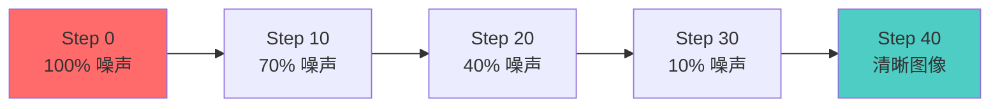
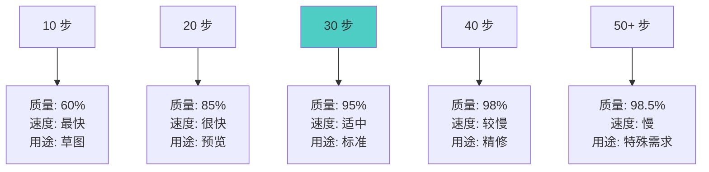

# 迭代步数详解 - Steps 的作用与优化

## 🎯 什么是迭代步数 (Steps)?

迭代步数 (Steps) 是指 Stable Diffusion 从噪声生成清晰图像所经历的去噪迭代次数,步数越多,去噪过程越细致,但也需要更多时间。

### 核心概念



**简单理解:**
- Steps = 雕刻的次数 🔨
- 步数少 = 粗雕,速度快但粗糙
- 步数多 = 精雕,时间长但细腻
- 过多步数 = 过度雕琢,收益递减

---

## 📊 步数的作用机制

### 去噪过程详解

**每一步的任务:**
```java
第 1-10 步 (早期):
  任务: 建立基本构图
  内容:
    • 确定主体位置
    • 建立大致轮廓
    • 形成基础色调
  重要性: ⭐⭐⭐⭐⭐ (最关键)

第 11-20 步 (中期):
  任务: 完善结构细节
  内容:
    • 细化形状
    • 丰富色彩
    • 添加中等细节
  重要性: ⭐⭐⭐⭐

第 21-30 步 (后期):
  任务: 精修细节
  内容:
    • 纹理细节
    • 光影处理
    • 微调色彩
  重要性: ⭐⭐⭐

第 31+ 步 (额外):
  任务: 细微优化
  内容:
    • 极细微的调整
    • 边际改进
  重要性: ⭐⭐ (收益递减)
```

### 步数与质量的关系



**质量提升曲线:**
```java
步数增加 vs 质量提升:

  5 → 10 步: 质量提升 40%  ⬆️⬆️⬆️
 10 → 20 步: 质量提升 25%  ⬆️⬆️
 20 → 30 步: 质量提升 10%  ⬆️
 30 → 40 步: 质量提升 3%   ⬆️
 40 → 50 步: 质量提升 0.5% ➡️

结论:
  边际收益递减
  20-30 步通常是甜点区
  超过 40 步意义不大
```

---

## 🎨 不同场景的步数选择

### 快速预览 (10-15 步)

**适用场景:**
```java
目的:
  • 快速测试提示词
  • 验证构图想法
  • 批量生成筛选
  • 参数调试

配置建议:
  Steps: 10-15
  Sampler: Euler 或 UniPC
  CFG: 7

优点:
  ✅ 速度极快 (3-5秒)
  ✅ 快速迭代
  ✅ 节省时间

缺点:
  ❌ 质量一般
  ❌ 细节不足
  ❌ 可能有瑕疵
```

**实战案例:**
```java
场景: 测试 5 个不同的提示词变体

使用 10 步预览:
  每张 ~4 秒
  总计: 20 秒
  快速找出最佳提示词

使用 30 步生成:
  每张 ~12 秒
  总计: 60 秒
  浪费时间在不好的提示词上

结论:
  预览阶段必须使用低步数
  只对最佳结果使用高步数
```

### 标准质量 (20-30 步)

**适用场景:**
```java
目的:
  • 日常创作
  • 平衡质量和速度
  • 大多数场景

配置建议:
  Steps: 25-28
  Sampler: DPM++ 2M Karras
  CFG: 7-8

优点:
  ✅ 质量优秀 (95% 效果)
  ✅ 速度可接受 (8-12秒)
  ✅ 性价比最高

推荐步数:
  20 步: 快速但质量尚可
  25 步: 平衡推荐
  28 步: 标准高质量
  30 步: 稳妥的高质量
```

**推荐理由:**
```java
为什么 25-28 步最常用?

1. 质量足够好
   • 95% 的最终质量
   • 细节基本完整
   • 瑕疵极少

2. 时间可接受
   • 不会过长等待
   • 适合创作流程
   • 效率和质量兼顾

3. 适配大多数采样器
   • Euler: 20-25 步
   • DPM++ 2M: 25-30 步
   • 都在甜点区
```

### 高质量输出 (30-40 步)

**适用场景:**
```java
目的:
  • 最终作品渲染
  • 商业用途
  • 打印输出
  • 高要求展示

配置建议:
  Steps: 35-40
  Sampler: DPM++ SDE Karras
  CFG: 7-9

优点:
  ✅ 质量接近最优 (98%)
  ✅ 细节极其丰富
  ✅ 纹理清晰

缺点:
  ❌ 时间较长 (15-25秒)
  ❌ 显存占用高
  ❌ 性价比降低
```

**适用作品类型:**
```java
必须使用高步数:
  • 专业摄影作品
  • 商业插画
  • 高精度产品图
  • 打印用途 (300dpi+)

可以使用标准步数:
  • 社交媒体分享
  • 网页展示
  • 个人创作
  • 概念草图
```

### 极限质量 (40+ 步)

**适用场景:**
```java
目的:
  • 极端质量要求
  • 特殊艺术效果
  • 研究测试

配置建议:
  Steps: 50-100
  Sampler: DPM++ SDE Karras
  CFG: 7-10

现实情况:
  ❌ 很少实际需要
  ❌ 时间成本极高
  ❌ 质量提升微小 (0.5-1%)
  ❌ 不推荐日常使用

特殊用途:
  • 学术研究
  • 极限测试
  • 特殊艺术探索
```

---

## ⚖️ 步数与其他参数的关系

### 步数 × 采样器

**不同采样器的步数需求:**
```java
Euler:
  最低: 15 步
  推荐: 20-25 步
  最高: 30 步
  说明: 简单采样器,高步数收益低

DPM++ 2M Karras:
  最低: 20 步
  推荐: 25-30 步
  最高: 35 步
  说明: 平衡型,标准步数即可

DPM++ SDE Karras:
  最低: 25 步
  推荐: 30-40 步
  最高: 50 步
  说明: 高质量采样器,需要更多步数

DDIM:
  最低: 20 步
  推荐: 30-50 步
  最高: 100 步
  说明: 可用于超多步数
```

**最佳搭配:**
```java
快速预览:
  Euler + 15 步 = 最快

标准质量:
  DPM++ 2M Karras + 28 步 = 平衡

高质量:
  DPM++ SDE Karras + 35 步 = 最优
```

### 步数 × CFG Scale

**CFG 对步数的影响:**
```java
低 CFG (5-7):
  需要较多步数
  推荐: 30-35 步
  原因: 提示词引导弱,需要更多步数收敛

中 CFG (7-10):
  标准步数即可
  推荐: 25-30 步
  原因: 平衡状态,步数适中

高 CFG (10-15):
  可以少步数
  推荐: 20-28 步
  原因: 强引导,快速收敛
  注意: 过高 CFG 可能失真

超高 CFG (15+):
  ❌ 不推荐
  问题: 过拟合,再多步数也无益
```

### 步数 × 分辨率

**不同分辨率的步数需求:**
```java
512×512 (标准):
  推荐: 25-28 步
  原因: 标准分辨率,标准步数

768×768:
  推荐: 28-32 步
  原因: 更多像素,需要略多步数

1024×1024 (SDXL):
  推荐: 30-35 步
  原因: 大分辨率,细节更多

512×768 (人像):
  推荐: 25-30 步
  原因: 与正方形类似

更高分辨率:
  推荐: 适当增加 5-10 步
  注意: 收益递减依然存在
```

---

## 🔬 步数的高级优化

### 多阶段步数策略

**Hires.fix 两阶段:**
```java
第一阶段 (低分辨率):
  分辨率: 512×512
  步数: 25-28
  目的: 建立基础构图

第二阶段 (高分辨率):
  分辨率: 1024×1024
  步数: 15-20 (低 denoise)
  目的: 添加细节

总步数: 40-48 步
实际时间: 比直接生成 1024×1024 快
质量: 更好

优势:
  ✅ 避免大分辨率构图问题
  ✅ 显存占用合理
  ✅ 质量更优
```

**图生图渐进式:**
```java
第一次: 原图
  Steps: 0 (输入图)

第二次: 轻微调整
  Denoise: 0.3
  Steps: 20
  目的: 小幅修改

第三次: 中度调整
  Denoise: 0.5
  Steps: 25
  目的: 明显改变

第四次: 重度重绘
  Denoise: 0.8
  Steps: 30-35
  目的: 大幅修改

策略:
  Denoise 越高,需要越多步数
  低 denoise 可以少步数
```

### 动态步数调整

**根据内容复杂度:**
```java
简单场景:
  • 纯色背景
  • 单一物体
  • 简单构图
  推荐: 20-25 步

复杂场景:
  • 多个主体
  • 丰富细节
  • 复杂背景
  推荐: 28-35 步

极复杂场景:
  • 大量元素
  • 精细纹理
  • 建筑细节
  推荐: 35-40 步
```

**根据风格类型:**
```java
抽象艺术:
  步数: 20-25
  原因: 不需要精确细节

写实摄影:
  步数: 28-35
  原因: 细节和纹理重要

动漫插画:
  步数: 25-30
  原因: 线条和色彩重要

概念设计:
  步数: 30-35
  原因: 质感和氛围重要
```

---

## ⚡ 性能优化技巧

### 时间成本计算

**生成时间估算 (RTX 3060 12GB):**
```java
512×512 分辨率:
  10 步: ~4 秒
  20 步: ~8 秒
  30 步: ~12 秒
  40 步: ~16 秒
  50 步: ~20 秒

768×768 分辨率:
  10 步: ~8 秒
  20 步: ~16 秒
  30 步: ~24 秒
  40 步: ~32 秒

1024×1024 分辨率:
  10 步: ~15 秒
  20 步: ~30 秒
  30 步: ~45 秒
  40 步: ~60 秒

batch_size × steps = 总时间
  batch 4 × 30 步 ≈ 单张的 4 倍时间
```

### 批量生成优化

**策略 1: 先少后多**
```java
第一轮: 低步数筛选
  Steps: 15
  数量: 10 张
  时间: ~40 秒
  目的: 快速找出好的

第二轮: 高步数精修
  Steps: 35
  数量: 2-3 张 (筛选后的)
  时间: ~45 秒
  目的: 最终成品

总时间: ~85 秒
效率: 远高于全部用 35 步
```

**策略 2: 分阶段生成**
```java
探索阶段:
  Steps: 15-20
  目的: 测试不同提示词、参数

确认阶段:
  Steps: 25-28
  目的: 确认最终效果

输出阶段:
  Steps: 30-35
  目的: 生成最终作品
```

### 显存优化

**步数对显存的影响:**
```java
显存占用因素:
  • 分辨率 (主要)
  • 批次大小 (主要)
  • 步数 (次要,每步需要临时显存)

步数影响:
  10 步 vs 50 步
  显存差异: ~10-20%
  不是主要因素

优化建议:
  显存不足时:
    1. 降低分辨率 (优先)
    2. 减少 batch size (优先)
    3. 降低步数 (次要)
    4. 使用 --lowvram 参数
```

---

## 📊 实战对比案例

### 案例 1: 人物肖像

**测试设置:**
```java
Checkpoint: Realistic Vision V5
提示词: "a beautiful girl, detailed face,
          natural lighting, masterpiece"
分辨率: 512×768
采样器: DPM++ 2M Karras
CFG: 7.5
Seed: 固定 (12345)
```

**不同步数效果:**
```java
10 步:
  效果: 轮廓可见,细节模糊
  质量: 60%
  时间: 5秒
  评价: ❌ 不够清晰

20 步:
  效果: 基本清晰,少量瑕疵
  质量: 85%
  时间: 10秒
  评价: ⚠️ 可用但不够好

28 步:
  效果: 清晰细腻,细节丰富
  质量: 95%
  时间: 14秒
  评价: ✅ 推荐,性价比高

35 步:
  效果: 极度清晰,纹理完美
  质量: 98%
  时间: 18秒
  评价: ✅ 高质量,适合最终作品

50 步:
  效果: 与 35 步几乎相同
  质量: 98.5%
  时间: 25秒
  评价: ❌ 不值得,收益微小
```

### 案例 2: 风景照片

**测试设置:**
```java
Checkpoint: Realistic Vision V5
提示词: "landscape, mountains, lake, sunset,
          dramatic sky, professional photography"
分辨率: 768×512
采样器: DPM++ 2M Karras
CFG: 7
```

**结论:**
```java
风景照比人像更容忍低步数:
  20 步: 已经相当不错
  25 步: 完全够用
  30 步: 追求极致
  35+ 步: 没必要

原因:
  • 风景细节分散
  • 不像人像对细节敏感
  • 氛围比精确更重要
```

### 案例 3: 动漫角色

**测试设置:**
```java
Checkpoint: Anything V5
提示词: "1girl, anime style, colorful,
          detailed eyes, masterpiece"
采样器: Euler a
```

**结论:**
```java
动漫风格最佳步数: 25-30

原因:
  • 线条为主,不需要太多步数
  • 过多步数可能过度细化
  • Euler a 在 25-30 步最佳
  • 超过 35 步收益很小
```

---

## 💡 最佳实践建议

### 日常工作流程

**推荐流程:**
```java
步骤 1: 快速探索 (15 步)
  • 测试 3-5 个提示词变体
  • 快速找出最好的方向
  • 时间: 每张 ~5 秒

步骤 2: 参数优化 (25 步)
  • 基于最佳提示词
  • 调整 CFG, Sampler 等
  • 时间: 每张 ~12 秒

步骤 3: 最终输出 (30-35 步)
  • 确定所有参数
  • 生成最终作品
  • 时间: 每张 ~15-18 秒

总时间: 比全程用高步数节省 60%
质量: 不妥协
```

### 不同需求的步数策略

**社交媒体分享:**
```java
推荐步数: 25-28
原因:
  • 屏幕浏览,不需要极致细节
  • 加载速度更重要
  • 性价比最高
```

**打印输出:**
```java
推荐步数: 30-35
原因:
  • 打印会放大瑕疵
  • 需要更好的细节
  • 纸张纹理需要配合
```

**商业用途:**
```java
推荐步数: 35-40
原因:
  • 专业标准
  • 客户期望高
  • 不能有明显瑕疵
```

**个人创作:**
```java
推荐步数: 25-30
原因:
  • 满足个人需求即可
  • 效率和质量平衡
  • 可以多创作几张
```

---

## 🎓 总结

### 核心要点

```java
1. 步数的黄金区间
   快速: 15-20 步
   标准: 25-28 步 ⭐ 推荐
   高质: 30-35 步
   极限: 40+ 步 (不推荐)

2. 边际收益递减
   20 → 30 步: 提升明显 ✅
   30 → 40 步: 提升微小 ⚠️
   40 → 50 步: 几乎无提升 ❌

3. 配合其他参数
   好采样器 + 适中步数 > 差采样器 + 高步数
   DPM++ 2M + 28步 > Euler + 50步

4. 实用建议
   日常创作: 25-28 步
   快速预览: 15-20 步
   最终作品: 30-35 步
   不要超过: 40 步
```

### 快速决策表

```java
场景 → 推荐步数:

测试提示词 → 15 步
批量生成 → 20 步
日常创作 → 28 步
精品输出 → 35 步
商业作品 → 35 步
打印用途 → 35 步
社交分享 → 25 步
```

### 错误认知纠正

```java
❌ 错误: "步数越多越好"
✅ 正确: 30 步以上收益递减明显

❌ 错误: "必须用 50 步才够好"
✅ 正确: 28 步已经很好,50 步浪费时间

❌ 错误: "低步数都是垃圾"
✅ 正确: 15-20 步可用于预览和测试

❌ 错误: "所有场景都用同样步数"
✅ 正确: 根据用途和质量要求调整
```

---

> **系列文章导航**:
> - [Checkpoint 详解](./01-Checkpoint详解-SD的核心模型.md)
> - [VAE 详解](./02-VAE详解-图像质量的关键.md)
> - [CLIP 详解](./03-CLIP详解-文本理解的核心.md)
> - [采样方法详解](./04-采样方法详解-Sampler的选择与优化.md)
> - [CFG 详解](./06-CFG详解-提示词引导强度.md)
> - [Seed 详解](./07-Seed详解-随机种子的奥秘.md)
