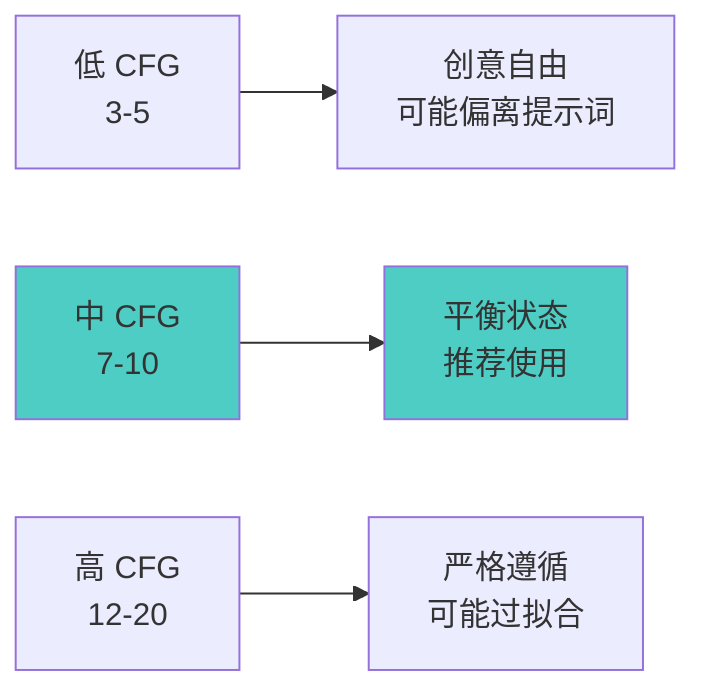
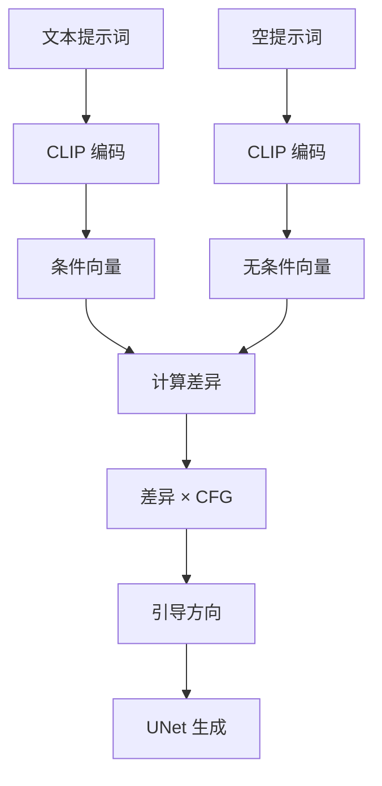

# CFG 详解 - 提示词引导强度控制

## 🎯 什么是 CFG?

CFG (Classifier-Free Guidance,无分类器引导) 是控制 AI 生成图像时"多大程度遵循提示词"的参数,CFG 值越高,生成结果越严格符合提示词,但可能失去创意性。

### 核心概念



**简单理解:**
- CFG = AI 对提示词的"听话程度" 👂
- 低 CFG = 随意发挥,有创意但可能跑题
- 高 CFG = 严格照做,符合要求但可能僵硬
- 适中 CFG = 既听话又灵活

---

## 🔍 CFG 的工作原理

### 引导机制详解



**数学原理:**
```java
无 CFG 的生成 (CFG = 0):
  生成 = UNet(噪声, 空提示)
  结果: 完全随机,无提示词影响

有 CFG 的生成 (CFG > 0):
  条件生成 = UNet(噪声, 提示词)
  无条件生成 = UNet(噪声, "")

  差异 = 条件生成 - 无条件生成
  最终生成 = 无条件生成 + CFG × 差异

CFG 的作用:
  CFG = 1: 轻微引导
  CFG = 7: 标准引导
  CFG = 15: 强力引导
  CFG > 20: 过度引导
```

### CFG 对生成的影响

**不同 CFG 值的效果:**
```java
CFG = 1-3 (极低):
  效果:
    • 提示词影响很弱
    • 生成结果随机性强
    • 可能完全不符合提示词
  适用: 极少使用

CFG = 4-6 (低):
  效果:
    • 提示词影响较弱
    • 保留较多创意空间
    • 可能有意外惊喜
  适用: 艺术探索,抽象创作

CFG = 7-10 (标准):
  效果:
    • 提示词影响适中
    • 平衡创意和准确性
    • 最常用的范围
  适用: 90% 的场景

CFG = 11-15 (高):
  效果:
    • 严格遵循提示词
    • 细节更符合描述
    • 可能过度拟合
  适用: 精确控制需求

CFG = 16+ (极高):
  效果:
    • 过度强调提示词
    • 可能出现伪影
    • 色彩过饱和
    • 失真和不自然
  适用: 基本不推荐
```

---

## 📊 CFG 值选择指南

### 不同风格的 CFG 推荐

**写实摄影风格:**
```java
推荐 CFG: 7-9

原因:
  • 需要准确的细节
  • 不能有太多随机变化
  • 光影要自然
  • 色彩要准确

示例配置:
  提示词: "professional portrait photography,
           natural lighting, bokeh"
  CFG: 7.5-8
  效果: 符合摄影标准,不失真

过高 CFG 问题:
  • 皮肤过于光滑(塑料感)
  • 色彩过饱和
  • 细节过度锐化
```

**动漫插画风格:**
```java
推荐 CFG: 7-11

原因:
  • 线条需要清晰
  • 色彩可以鲜艳
  • 允许适度夸张
  • 风格化更明显

示例配置:
  提示词: "anime style, 1girl, colorful,
           detailed eyes"
  CFG: 8-10
  效果: 色彩鲜艳,线条清晰

高 CFG 优势:
  • 线条更锐利
  • 色彩更饱满
  • 风格更统一
```

**概念艺术:**
```java
推荐 CFG: 5-8

原因:
  • 需要创意空间
  • 氛围比精确重要
  • 允许意外效果
  • 艺术表现力优先

示例配置:
  提示词: "fantasy landscape, concept art,
           dramatic lighting"
  CFG: 6-7
  效果: 创意丰富,氛围浓厚

低 CFG 优势:
  • 更多意外惊喜
  • 艺术感更强
  • 不拘泥于细节
```

**产品渲染:**
```java
推荐 CFG: 8-11

原因:
  • 需要准确还原
  • 细节很重要
  • 不能有偏差
  • 专业标准

示例配置:
  提示词: "product photography, smartphone,
           white background, studio lighting"
  CFG: 9-10
  效果: 精准还原,专业质感
```

### 不同场景的 CFG 调整

**人物肖像:**
```java
面部特写: CFG 7-8
  • 细节重要但不能失真
  • 皮肤纹理要自然

全身照: CFG 7-9
  • 构图比细节重要
  • 可以略高保证姿态

多人合照: CFG 8-10
  • 需要明确区分每个人
  • 避免人物混淆
```

**风景照片:**
```java
自然风光: CFG 6-8
  • 氛围比精确重要
  • 允许艺术化表现

城市建筑: CFG 8-10
  • 线条要准确
  • 透视要正确

日落日出: CFG 6-7
  • 色彩氛围优先
  • 不需要过度精确
```

**抽象艺术:**
```java
推荐: CFG 4-7

原因:
  • 创意最重要
  • 精确性次要
  • 鼓励意外效果

低 CFG 的价值:
  • 更多随机性
  • 意外的美感
  • 独特性强
```

---

## ⚖️ CFG 与其他参数的关系

### CFG × Steps

**CFG 对步数需求的影响:**
```java
低 CFG (5-7) + 步数:
  需要: 30-40 步
  原因: 弱引导需要更多步数收敛

中 CFG (7-10) + 步数:
  需要: 25-30 步
  原因: 平衡状态,标准步数

高 CFG (10-15) + 步数:
  需要: 20-28 步
  原因: 强引导,快速收敛

优化策略:
  预览: CFG 8 + 20 步 (快速)
  正式: CFG 7.5 + 28 步 (平衡)
  精修: CFG 7 + 35 步 (质量)
```

### CFG × Sampler

**不同采样器的 CFG 敏感度:**
```java
Euler / Euler a:
  CFG 敏感度: 中等
  推荐范围: 7-12
  特点: 对 CFG 变化反应正常

DPM++ 2M Karras:
  CFG 敏感度: 较低
  推荐范围: 6-10
  特点: 高 CFG 收益不明显

DPM++ SDE Karras:
  CFG 敏感度: 较高
  推荐范围: 7-12
  特点: CFG 对质量影响大

DDIM:
  CFG 敏感度: 中等
  推荐范围: 7-11
  特点: 稳定性好
```

### CFG × 提示词复杂度

**简单提示词:**
```java
提示词: "a cat"
推荐 CFG: 7-9

原因:
  • 概念简单
  • 标准 CFG 即可
  • 过高过低都无益
```

**复杂提示词:**
```java
提示词: "a girl wearing red dress,
          standing in garden,
          sunset, golden hour lighting,
          bokeh background"
推荐 CFG: 8-11

原因:
  • 多个元素需要协调
  • 需要较高 CFG 确保都体现
  • 细节要求高
```

**带权重的提示词:**
```java
提示词: "(red dress:1.3), girl, (garden:0.8)"
推荐 CFG: 7-9

原因:
  • 已经用权重控制了
  • 不需要过高 CFG
  • 避免过度拟合
```

---

## 🎨 CFG 实战案例

### 案例 1: 写实人像对比

**测试配置:**
```java
Checkpoint: Realistic Vision V5
提示词: "a beautiful girl, detailed face,
          natural lighting, professional photography"
分辨率: 512×768
Sampler: DPM++ 2M Karras
Steps: 28
Seed: 固定 (12345)
```

**不同 CFG 效果:**
```java
CFG = 3:
  效果: 构图随意,不像人像摄影
  面部: 模糊,特征不明显
  光影: 不符合提示词
  评价: ❌ 不可用

CFG = 5:
  效果: 有人像感,但不够专业
  面部: 基本清晰,细节不足
  光影: 偏随机
  评价: ⚠️ 勉强可用

CFG = 7.5:
  效果: 专业人像,符合提示词
  面部: 清晰细腻,自然
  光影: 符合自然光描述
  评价: ✅ 推荐,效果最佳

CFG = 12:
  效果: 过度精细,不自然
  面部: 皮肤过于光滑(塑料感)
  光影: 过于明显,不自然
  评价: ⚠️ 可用但不自然

CFG = 20:
  效果: 严重失真
  面部: 细节过度,伪影明显
  光影: 过曝和色彩异常
  评价: ❌ 不可用
```

### 案例 2: 动漫角色对比

**测试配置:**
```java
Checkpoint: Anything V5
提示词: "1girl, anime style, blue eyes,
          long hair, school uniform"
Sampler: Euler a
Steps: 28
```

**不同 CFG 效果:**
```java
CFG = 5:
  效果: 风格不够动漫化
  线条: 较软,不够清晰
  色彩: 偏灰,不够鲜艳
  评价: ⚠️ 不符合动漫风格

CFG = 8:
  效果: 标准动漫风格
  线条: 清晰,符合预期
  色彩: 鲜艳适中
  评价: ✅ 良好

CFG = 11:
  效果: 强烈动漫风格
  线条: 非常锐利
  色彩: 饱和度高
  评价: ✅ 适合追求强烈风格

CFG = 15:
  效果: 过度风格化
  线条: 过于生硬
  色彩: 过饱和
  评价: ⚠️ 可能过度
```

### 案例 3: 风景照片对比

**测试配置:**
```java
提示词: "mountain landscape, lake, sunset,
          dramatic sky, professional photography"
CFG 变化: 5 → 15
```

**观察结论:**
```java
CFG = 6:
  氛围: 梦幻,艺术感强
  色彩: 柔和自然
  细节: 适中
  最佳: 艺术摄影

CFG = 8:
  氛围: 专业,平衡
  色彩: 真实自然
  细节: 丰富
  最佳: 商业摄影

CFG = 12:
  氛围: 强烈,戏剧化
  色彩: 饱和度高
  细节: 过度锐化
  最佳: 特殊需求
```

---

## 🔬 CFG 的高级技巧

### 动态 CFG 调整

**渐进式 CFG:**
```java
概念: 不同阶段使用不同 CFG

早期阶段 (Step 1-10):
  CFG: 较高 (9-11)
  目的: 快速建立符合提示词的构图

中期阶段 (Step 11-20):
  CFG: 中等 (7-9)
  目的: 平衡细节和整体

后期阶段 (Step 21-30):
  CFG: 较低 (5-7)
  目的: 增加细节的自然性

注意:
  需要高级工具支持
  WebUI/ComfyUI 标准版不支持
  需要自定义脚本或插件
```

### CFG 组合策略

**文生图 + 图生图组合:**
```java
第一步: 文生图
  CFG: 8-10 (较高)
  目的: 精确生成基础图

第二步: 图生图精修
  CFG: 6-7 (较低)
  Denoise: 0.3-0.5
  目的: 保留构图,增加自然细节

优势:
  • 先保证准确性
  • 再增加艺术性
  • 结果更优
```

### 负面提示词 × CFG

**CFG 对负面提示词的影响:**
```java
低 CFG (5-7):
  负面提示词影响: 较弱
  需要: 更强的负面权重
  例如: "(bad hands:1.4)"

高 CFG (10-15):
  负面提示词影响: 较强
  需要: 标准负面权重
  例如: "bad hands"

建议:
  CFG 低 → 增强负面权重
  CFG 高 → 标准负面即可
```

---

## ⚠️ CFG 常见问题

### 问题 1: 过高 CFG 的副作用

**症状:**
```java
CFG > 15 时常见问题:

1. 色彩过饱和
   • 颜色过于鲜艳
   • 不自然的色彩
   • 偏色问题

2. 细节过度
   • 过度锐化
   • 纹理不自然
   • "塑料感"

3. 伪影出现
   • 奇怪的图案
   • 色块
   • 噪点

4. 构图僵硬
   • 失去自然感
   • 过于规整
   • 缺乏生动性
```

**解决方案:**
```java
降低 CFG 到 7-12 范围
使用更精确的提示词
调整采样器
增加步数补偿
```

### 问题 2: 过低 CFG 的问题

**症状:**
```java
CFG < 5 时常见问题:

1. 不符合提示词
   • 生成内容偏离
   • 关键元素缺失
   • 随机性过强

2. 细节模糊
   • 整体不够清晰
   • 缺少重点
   • 主体不明确

3. 风格混乱
   • 多种风格混杂
   • 不统一
```

**解决方案:**
```java
提高 CFG 到 7-10
优化提示词描述
使用更明确的关键词
考虑更换模型
```

### 问题 3: CFG 不生效

**可能原因:**
```java
1. 提示词问题
   • 提示词过于模糊
   • 冲突的描述
   • 无效的关键词

2. 模型问题
   • 模型不适合该风格
   • 模型训练问题

3. 参数冲突
   • Denoise 过低(图生图)
   • 其他参数覆盖

4. 软件bug
   • 版本问题
   • 缓存问题
```

---

## 💡 最佳实践

### 通用推荐设置

**新手入门:**
```java
推荐 CFG: 7.5
原因:
  • 最安全的选择
  • 适用大多数场景
  • 不容易出错
  • 效果稳定
```

**进阶创作:**
```java
根据需求调整:
  写实风格: 7-9
  动漫风格: 8-11
  艺术风格: 6-8
  产品图: 9-11
```

**专业工作流:**
```java
测试阶段: CFG 8 (快速验证)
  ↓
调优阶段: CFG 6-10 (找最佳值)
  ↓
最终输出: 最佳 CFG (质量保证)
```

### CFG 调试流程

**寻找最佳 CFG:**
```java
步骤 1: 固定其他参数
  Seed: 固定
  Steps: 28
  Sampler: DPM++ 2M Karras
  其他参数不变

步骤 2: 测试不同 CFG
  生成: CFG 5, 7, 9, 11, 13
  对比效果

步骤 3: 微调
  在最佳值附近细调
  例如: 7.5, 8, 8.5

步骤 4: 记录最佳值
  不同风格记录不同值
  建立个人参数库
```

---

## 🎓 总结

### 核心要点

```java
1. CFG 的黄金区间
   通用: 7-10 ⭐ 推荐
   写实: 7-9
   动漫: 8-11
   艺术: 6-8
   危险: <5 或 >15

2. CFG 的作用
   控制提示词引导强度
   影响生成的准确性
   影响创意空间
   影响最终质量

3. 调整原则
   从 7.5 开始尝试
   根据效果微调
   不要过度追求高值
   注意副作用

4. 常见错误
   ❌ 盲目使用高 CFG
   ❌ 忽视提示词质量
   ❌ 不测试不同值
   ❌ 与其他参数不匹配
```

### 快速决策表

```java
场景 → 推荐 CFG:

不确定 → 7.5
写实人像 → 7-8
动漫角色 → 8-10
风景照片 → 6-8
产品图 → 9-10
艺术创作 → 6-7
快速测试 → 8
最终作品 → 根据测试结果
```

### 记住这些数字

```java
CFG = 7.5
  最安全的通用选择 ⭐⭐⭐⭐⭐

CFG = 5
  最低实用值

CFG = 12
  最高推荐值

CFG > 15
  不推荐区域 ⚠️
```

---

> **系列文章导航**:
> - [Checkpoint 详解](./01-Checkpoint详解-SD的核心模型.md)
> - [VAE 详解](./02-VAE详解-图像质量的关键.md)
> - [CLIP 详解](./03-CLIP详解-文本理解的核心.md)
> - [采样方法详解](./04-采样方法详解-Sampler的选择与优化.md)
> - [迭代步数详解](./05-迭代步数详解-Steps的作用与优化.md)
> - [Seed 详解](./07-Seed详解-随机种子的奥秘.md)
