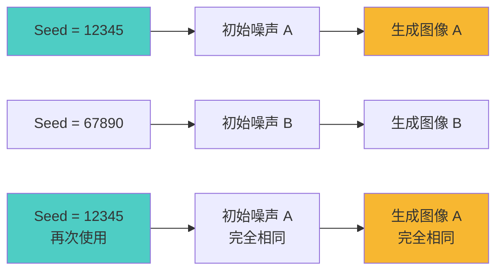
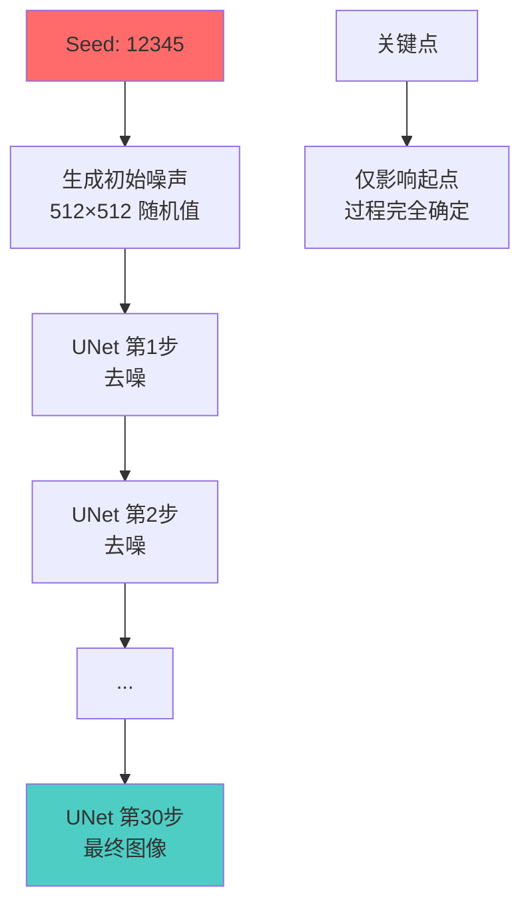

# Seed 详解 - 随机种子的奥秘与应用

## 🎯 什么是 Seed (随机种子)?

Seed (随机种子) 是决定 AI 生成图像"初始随机噪声"的数字,相同的 Seed 配合相同参数会产生相同的图像,是实现结果可复现的关键。

### 核心概念



**简单理解:**
- Seed = 起点坐标 📍
- 不同 Seed = 不同起点 = 不同结果
- 相同 Seed = 相同起点 = 相同结果
- 随机 Seed = 每次换起点 = 每次不同

---

## 🔢 Seed 的工作原理

### 随机数生成机制

**伪随机数生成器 (PRNG):**
```java
什么是伪随机?
  计算机无法产生真正的随机数
  但可以产生"看起来随机"的数列
  这个数列由 Seed 决定

工作流程:
  Seed: 12345
    ↓
  PRNG 算法
    ↓
  确定的随机数列: [0.234, 0.876, 0.123, ...]
    ↓
  生成初始噪声图

关键特性:
  ✅ 相同 Seed → 相同随机数列
  ✅ 不同 Seed → 不同随机数列
  ✅ 完全可复现
  ✅ 看起来随机
```

### Seed 对生成过程的影响



**影响范围:**
```java
Seed 直接影响:
  ✅ 初始噪声模式
  ✅ 随机采样器的随机性 (Euler a 等)

Seed 不影响:
  ❌ 模型本身
  ❌ 提示词理解
  ❌ CFG 作用
  ❌ 去噪算法

结论:
  Seed 只是起点
  其他参数决定路径
  两者共同决定终点
```

---

## 🎲 Seed 的使用方法

### 随机 Seed (-1)

**默认行为:**
```java
设置 Seed = -1 (或留空)

效果:
  每次生成使用不同的随机 Seed
  通常基于系统时间戳

实际值示例:
  第1次: Seed = 1701234567
  第2次: Seed = 1701234589
  第3次: Seed = 1701234612

适用场景:
  • 探索不同可能性
  • 寻找最佳结果
  • 批量生成多样化
  • 创意发散阶段
```

**使用建议:**
```java
什么时候用随机 Seed?

✅ 初次尝试新提示词
   看看能生成什么

✅ 批量生成筛选
   生成 10-20 张,选最好的

✅ 寻找灵感
   随机性带来意外惊喜

✅ 测试参数影响
   排除 Seed 干扰
```

### 固定 Seed

**使用方法:**
```java
设置 Seed = 具体数字
  例如: 12345, 987654321, 42

效果:
  每次生成完全相同的结果
  (前提: 其他参数也相同)

获取 Seed:
  1. 生成一张随机图
  2. 查看生成信息中的 Seed 值
  3. 复制该 Seed
  4. 用于后续生成
```

**适用场景:**
```java
必须使用固定 Seed:

✅ 参数对比测试
   只改 CFG,其他不变
   对比效果差异

✅ 微调优化
   基于满意的结果
   调整细节参数

✅ 批量生成同类
   保持主体一致
   改变服装/背景等

✅ 团队协作
   分享可复现的结果
   确保一致性

✅ 教程演示
   展示参数效果
   可复现的案例
```

### Seed 变体 (Variation)

**什么是 Variation?**
```java
概念:
  在原 Seed 基础上产生微小变化
  保持整体相似,局部不同

实现方式:
  Original Seed: 12345
  Variation Strength: 0.2
  生成: 类似但略有不同的图

WebUI 参数:
  Variation seed: 指定变体基准
  Variation strength: 变化强度 (0.0-1.0)

效果:
  0.0: 完全相同
  0.2: 微小差异
  0.5: 中等差异
  0.8: 较大差异
  1.0: 接近完全不同
```

**应用场景:**
```java
生成系列相似图:
  Base Seed: 12345
  生成 10 个变体
  结果: 10 张相似但有差异的图

示例:
  人物肖像
    Base: 正面微笑
    Variation 1: 略微歪头
    Variation 2: 不同表情
    Variation 3: 略微换角度

  保持:
    • 整体构图
    • 主体特征
    • 基本风格

  变化:
    • 细节差异
    • 微小变化
    • 局部调整
```

---

## 🔄 Seed 的高级应用

### Seed 搜索技巧

**批量生成筛选法:**
```java
目标: 找到最佳 Seed

步骤 1: 大批量随机生成
  Seed: -1 (随机)
  数量: 20-50 张
  步数: 15-20 (快速)

步骤 2: 筛选优质结果
  选出 3-5 张最好的
  记录它们的 Seed

步骤 3: 高质量重生成
  使用筛选出的 Seed
  步数: 28-35
  生成最终版本

优势:
  ✅ 效率高
  ✅ 质量好
  ✅ 不遗漏优秀 Seed
```

**系统化搜索法:**
```java
方法: 使用连续的 Seed 值

Seed 范围:
  1000, 1001, 1002, ..., 1020

优点:
  • 有序测试
  • 覆盖不同随机模式
  • 易于记录和对比

应用:
  测试不同 Seed 对特定提示词的影响
  找出最适合该提示词的 Seed 范围
```

### Seed 与其他参数的交互

**Seed × 提示词:**
```java
实验:
  提示词 A + Seed 12345 = 图片 A1
  提示词 B + Seed 12345 = 图片 B1

观察:
  构图可能相似
  但内容完全不同

原因:
  Seed 决定噪声模式
  提示词引导去噪方向
  两者共同作用

应用:
  用同一 Seed 测试不同提示词
  对比提示词的影响
```

**Seed × 采样器:**
```java
确定性采样器 (Euler, DPM++):
  相同 Seed + 相同参数 = 完全相同结果

祖先采样器 (Euler a, DPM2 a):
  相同 Seed + 相同参数 = 相似但不完全相同
  内部有额外随机性

注意:
  使用 Euler a 等采样器
  即使 Seed 相同
  也会有微小差异
```

**Seed × Hires.fix:**
```java
两阶段使用:
  第一阶段: Seed A
  第二阶段: 可以指定不同 Seed B

策略 1: 两阶段同 Seed
  结果: 最一致

策略 2: 第二阶段不同 Seed
  结果: 细节有变化
  应用: 增加细节多样性
```

### Seed 混合技术

**Seed 插值:**
```java
概念:
  在两个 Seed 之间平滑过渡

实现 (需要自定义脚本):
  Seed A: 1000
  Seed B: 2000

  生成:
    Frame 1: Seed 1000 (100% A)
    Frame 2: Seed 1200 (80% A, 20% B)
    Frame 3: Seed 1400 (60% A, 40% B)
    Frame 4: Seed 1600 (40% A, 60% B)
    Frame 5: Seed 1800 (20% A, 80% B)
    Frame 6: Seed 2000 (100% B)

应用:
  视频生成
  变形动画
  平滑过渡效果
```

---

## 📊 Seed 实战案例

### 案例 1: 参数对比测试

**目标: 测试不同 CFG 的效果**
```java
固定配置:
  Seed: 12345 (固定!)
  提示词: "a beautiful girl, portrait"
  分辨率: 512×768
  采样器: DPM++ 2M Karras
  步数: 28

变化配置:
  测试 1: CFG = 5
  测试 2: CFG = 7
  测试 3: CFG = 9
  测试 4: CFG = 11
  测试 5: CFG = 13

结果:
  由于 Seed 固定
  构图、姿态基本一致
  仅 CFG 引起的差异可见

结论:
  准确评估 CFG 对质量的影响
  排除 Seed 随机性干扰
```

### 案例 2: 提示词优化

**目标: 优化提示词表达**
```java
固定配置:
  Seed: 67890 (固定!)
  其他参数不变

测试提示词:
  版本 1: "a cat"
  版本 2: "a cute cat"
  版本 3: "a fluffy orange cat"
  版本 4: "a fluffy orange cat, detailed fur"

对比:
  相同 Seed 确保噪声起点相同
  仅提示词差异影响结果
  清晰看出提示词优化效果

价值:
  快速迭代提示词
  精准评估每个词汇的影响
```

### 案例 3: 系列作品生成

**目标: 生成一组相似风格的图**
```java
方法 1: Seed Variation
  Base Seed: 12345
  Variation Strength: 0.3
  生成 10 个变体

  结果:
    风格统一
    构图相似
    细节有差异

  应用:
    插画系列
    角色设计稿
    产品多角度

方法 2: 连续 Seed
  Seed: 10000, 10001, 10002, ..., 10009

  结果:
    风格较为接近
    有一定关联性

  应用:
    探索同一主题
    保持整体协调
```

### 案例 4: 复现他人作品

**目标: 根据参数复现图片**
```java
他人分享的参数:
  Seed: 987654321
  提示词: "详细的提示词..."
  CFG: 7.5
  Steps: 28
  Sampler: DPM++ 2M Karras
  Model: Realistic Vision V5.1

操作:
  1. 下载相同模型
  2. 输入完全相同的参数
  3. 使用相同的 Seed

结果:
  ✅ 应该生成完全相同的图片
  (如果软件版本和模型完全一致)

注意:
  ❌ 模型版本不同 → 结果不同
  ❌ VAE 不同 → 色彩可能不同
  ❌ 软件版本差异 → 可能有细微差别
```

---

## 🎨 Seed 的创意应用

### 探索 "Lucky Seed"

**什么是 Lucky Seed?**
```java
概念:
  某些 Seed 特别容易生成优质图片
  对特定模型或提示词特别友好

现象:
  Seed A: 10 次生成,8 次很好
  Seed B: 10 次生成,2 次很好

原因:
  随机噪声的初始模式
  可能更符合模型训练数据分布
  更容易收敛到好的结果

应用:
  找到 Lucky Seed 后
  用于重要作品
  提高成功率
```

**发现 Lucky Seed:**
```java
方法:
  1. 大量随机生成 (100+ 张)
  2. 记录特别好的图片的 Seed
  3. 重复使用这些 Seed
  4. 建立个人 Lucky Seed 库

个人 Lucky Seed 库示例:
  写实人像: 1234567, 9876543, 5555555
  动漫角色: 1111111, 3333333, 7777777
  风景照片: 2468024, 1357913, 9753108
```

### Seed 艺术创作

**Seed 作为创作元素:**
```java
概念:
  将 Seed 本身作为艺术元素

示例 1: Seed 系列作品
  主题: "数字之美"
  Seed: 111111, 222222, 333333, ...
  固定提示词,仅改 Seed
  展示随机性的美学

示例 2: 幸运数字系列
  Seed: 生日, 纪念日等有意义的数字
  赋予作品特殊意义

示例 3: 渐进 Seed 动画
  Seed: 1000 → 2000 (渐变)
  生成连续帧
  制作渐变动画
```

---

## ⚠️ Seed 常见误区

### 误区 1: "Seed 决定一切"

```java
❌ 错误认知:
  "只要 Seed 一样,什么都一样"

✅ 正确理解:
  Seed 相同 + 所有参数相同 + 模型相同
  → 才能保证结果相同

必须相同的要素:
  • Seed
  • 模型 Checkpoint
  • VAE
  • 提示词
  • CFG
  • Steps
  • Sampler
  • 分辨率
  • 软件版本

任何一项不同 → 结果就会不同
```

### 误区 2: "某些 Seed 更好"

```java
❌ 错误认知:
  "Seed 12345 总是最好的"
  "偶数 Seed 比奇数 Seed 好"

✅ 正确理解:
  Seed 本身没有优劣
  只是不同的随机起点
  好坏取决于与其他参数的配合

Lucky Seed 的真相:
  只是对特定场景表现好
  换个提示词可能就不好了
  不具有普遍性
```

### 误区 3: "随机 Seed 不可控"

```java
❌ 错误认知:
  "用随机 Seed 就是碰运气"

✅ 正确理解:
  随机 Seed 是探索工具
  配合筛选是高效策略

正确做法:
  1. 随机生成多张
  2. 筛选优质结果
  3. 记录好的 Seed
  4. 固定 Seed 精修
  5. 建立 Seed 库

效率:
  比盲目尝试固定 Seed 高得多
```

### 误区 4: "必须用复杂的 Seed"

```java
❌ 错误认知:
  "Seed 越大越复杂越好"
  "必须用 10 位数的 Seed"

✅ 正确理解:
  Seed 可以是任意整数
  大小不影响质量

有效的 Seed:
  1 ✅
  42 ✅
  12345 ✅
  987654321 ✅
  1234567890123 ✅

  简单数字反而好记
  重要的是记录和管理
```

---

## 🔧 Seed 管理最佳实践

### Seed 记录系统

**建立 Seed 笔记:**
```java
格式建议:

项目: 人物肖像系列
日期: 2025-12-04

Seed: 1234567
提示词: "a beautiful girl, detailed face..."
CFG: 7.5
Steps: 28
Sampler: DPM++ 2M Karras
Model: Realistic Vision V5.1
VAE: vae-ft-mse-840000
评价: ⭐⭐⭐⭐⭐ 非常满意
备注: 适合正面肖像,光影自然

Seed: 9876543
提示词: "fantasy landscape..."
...

价值:
  • 快速复现优秀结果
  • 建立个人参数库
  • 经验积累
```

### Seed 分类管理

**按用途分类:**
```java
写实人像 Seed 库:
  正面肖像: 1234567, 2345678
  侧面肖像: 3456789, 4567890
  全身照: 5678901, 6789012

动漫角色 Seed 库:
  可爱风格: 1111111, 2222222
  帅气风格: 3333333, 4444444

风景照片 Seed 库:
  日落: 5555555, 6666666
  森林: 7777777, 8888888
```

### 团队协作 Seed 分享

**分享规范:**
```java
完整分享清单:
  ✅ Seed 值
  ✅ 完整提示词 (正面+负面)
  ✅ 所有参数 (CFG, Steps, Sampler 等)
  ✅ 模型信息 (名称, 版本, Hash)
  ✅ VAE 信息
  ✅ 软件版本
  ✅ 分辨率
  ✅ 可选: 生成的图片

导出方式:
  WebUI: PNG Info (自动嵌入)
  ComfyUI: Save Workflow
  手动: 参数文本文件
```

---

## 🎓 总结

### 核心要点

```java
1. Seed 的本质
   ✅ 决定随机噪声起点
   ✅ 确保结果可复现
   ✅ 不决定图片好坏
   ✅ 需配合其他参数

2. Seed 的使用
   探索阶段: -1 (随机)
   优化阶段: 固定优质 Seed
   最终作品: 精选 Seed
   参数测试: 必须固定

3. Seed 的管理
   ✅ 记录优质 Seed
   ✅ 分类管理
   ✅ 定期整理
   ✅ 团队分享

4. 重要提醒
   ❌ Seed 不是万能的
   ❌ 不要迷信特定 Seed
   ✅ 配合好的参数最重要
   ✅ 系统性探索胜过碰运气
```

### 实用工作流

```java
标准创作流程:

步骤 1: 探索 (随机 Seed)
  生成 10-20 张
  Seed: -1
  Steps: 15-20 (快速)

步骤 2: 筛选
  选出 2-3 张最好的
  记录 Seed

步骤 3: 优化 (固定 Seed)
  使用筛选的 Seed
  调整其他参数
  Steps: 28-35

步骤 4: 最终输出
  确定所有参数
  高质量生成
  保存配置
```

### 记住这些

```java
Seed = -1
  随机模式,每次不同 ⭐

Seed = 固定值
  可复现模式,结果一致 ⭐⭐⭐

重要性排序:
  提示词 > 模型 > 参数 > Seed

Seed 的价值:
  不在于数字本身
  在于可复现性和可控性
```

---

> **系列文章完结**:
> - [Checkpoint 详解](./01-Checkpoint详解-SD的核心模型.md)
> - [VAE 详解](./02-VAE详解-图像质量的关键.md)
> - [CLIP 详解](./03-CLIP详解-文本理解的核心.md)
> - [采样方法详解](./04-采样方法详解-Sampler的选择与优化.md)
> - [迭代步数详解](./05-迭代步数详解-Steps的作用与优化.md)
> - [CFG 详解](./06-CFG详解-提示词引导强度.md)

---

> **恭喜!** 你已经完成了 Stable Diffusion 核心参数的系统学习!现在你已经掌握了从模型选择到参数调优的完整知识体系,可以开始你的 AI 艺术创作之旅了! 🎨✨
