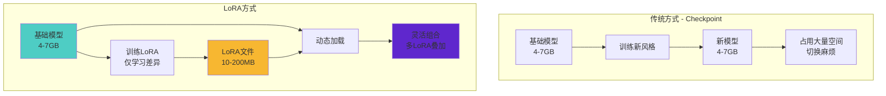
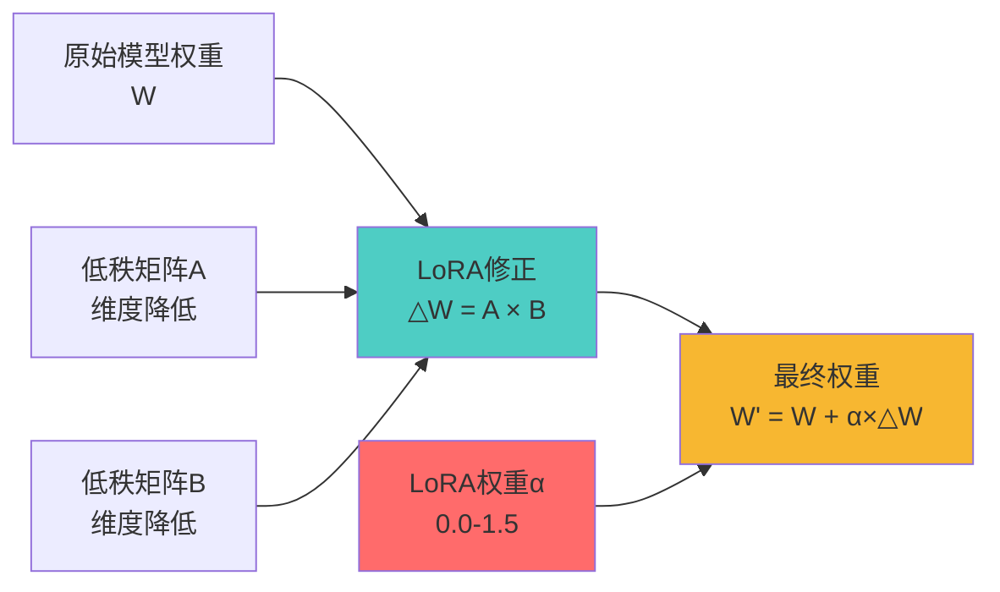
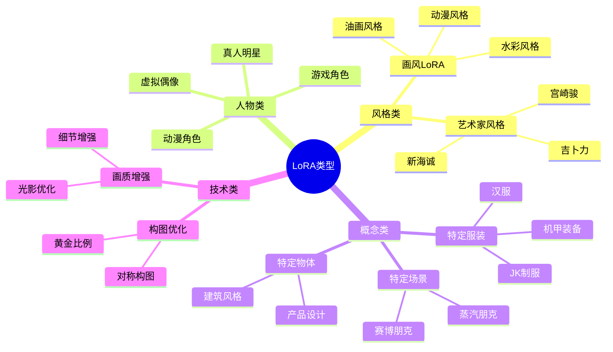
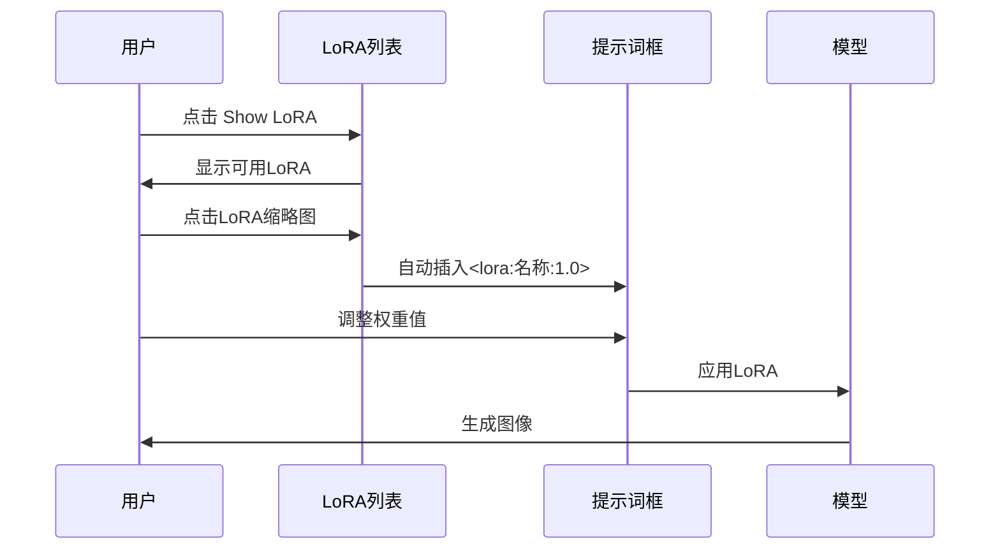
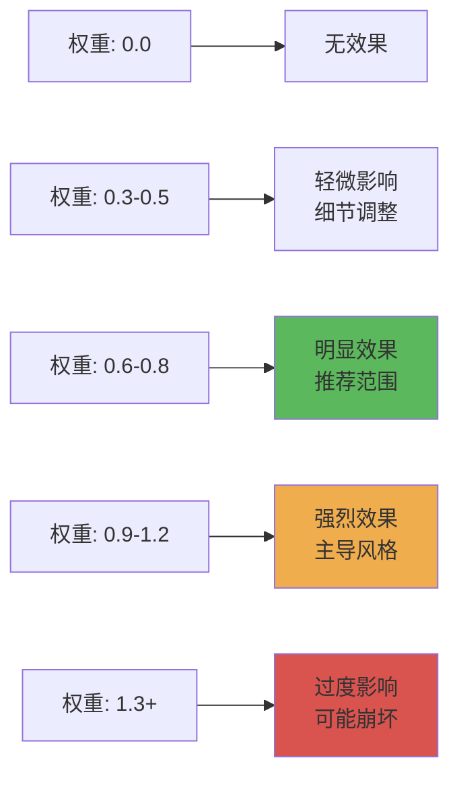
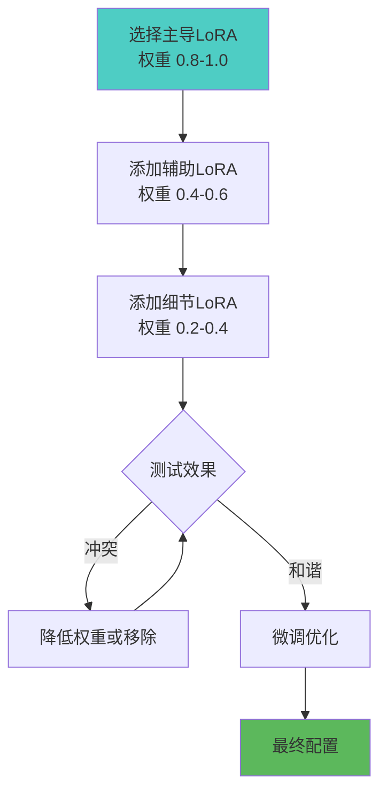
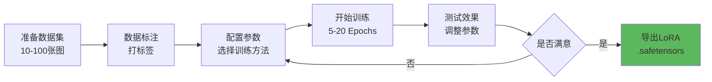

# LoRA 详解 - 风格迁移的利器

## 🎯 什么是 LoRA？

**LoRA (Low-Rank Adaptation)** 是一种轻量级的模型微调技术，通过小文件（几MB到几百MB）为 Stable Diffusion 添加特定风格、人物、概念或画风，而无需替换整个 Checkpoint 模型。

### 核心概念对比



**简单理解：**
- Checkpoint = 完整的画家 👨‍🎨
- LoRA = 画家的特殊技能包 🎨
- 一个画家 + 多个技能包 = 无限可能 ✨

---

## 🔬 LoRA 的工作原理

### 技术原理



**数学表达：**

```java
// 原始Transformer层权重
W_original = [2048 × 2048] 矩阵  // 约 8MB

// LoRA分解（秩 r=4）
A = [2048 × 4] 矩阵   // 仅 32KB
B = [4 × 2048] 矩阵   // 仅 32KB

// 运行时合成
W_final = W_original + (A × B) × α
// α 是LoRA权重，控制影响强度
```

**优势分析：**
- 🎯 **参数效率**：只训练 0.1% 的参数
- 💾 **存储节省**：100MB vs 4GB (40倍压缩)
- ⚡ **快速切换**：无需重载整个模型
- 🔄 **灵活组合**：可同时使用多个 LoRA

---

## 📂 LoRA 的类型分类

### 按功能分类



### 按训练方法分类

| 类型 | 特点 | 文件大小 | 适用场景 | 质量 |
|------|------|----------|----------|------|
| **Standard LoRA** | 标准训练 | 50-150MB | 通用场景 | ⭐⭐⭐⭐ |
| **LoCon** | 卷积层增强 | 100-300MB | 画质细节 | ⭐⭐⭐⭐⭐ |
| **LoHa** | Hadamard 积 | 80-200MB | 风格迁移 | ⭐⭐⭐⭐ |
| **Lycoris** | 多种算法集合 | 可变 | 高级需求 | ⭐⭐⭐⭐⭐ |

---

## 🎨 LoRA 的使用方法

### WebUI 中使用

**方法1：点击选择**

```java
// 1. 放置文件
路径: stable-diffusion-webui/models/Lora/
文件: chinese_style.safetensors (125MB)

// 2. 在提示词中激活
提示词格式:
<lora:文件名:权重>

示例:
a beautiful girl, <lora:chinese_style:0.8>
```

**方法2：拖拽加载**



### 实战案例

**案例1：水彩风格人像**

```java
// 提示词配置
Prompt:
masterpiece, best quality, 1girl, beautiful face,
flowing hair, gentle smile, soft lighting,
<lora:watercolor_style:0.7>, <lora:detail_enhancer:0.5>

Negative Prompt:
ugly, blurry, low quality

// 参数设置
Checkpoint: RealisticVision 5.1
Sampler: DPM++ 2M Karras
Steps: 28
CFG: 7
Size: 512x768

// LoRA权重说明
watercolor_style: 0.7    // 水彩风格，适中强度
detail_enhancer: 0.5     // 细节增强，避免过度
```

**案例2：多LoRA叠加（赛博朋克少女）**

```java
// 提示词配置
Prompt:
cyberpunk girl, neon lights, futuristic city,
mechanical parts, glowing eyes,
<lora:cyberpunk_style:0.9>,        // 主风格
<lora:neon_lighting:0.6>,          // 霓虹光效
<lora:mecha_details:0.4>,          // 机械细节
<lora:face_detail:0.3>             // 面部优化

// 多LoRA权重策略
主要风格LoRA: 0.7-1.0      // 高权重
辅助效果LoRA: 0.3-0.6      // 中权重
细节优化LoRA: 0.2-0.4      // 低权重
```

---

## ⚖️ LoRA 权重调整技巧

### 权重范围指南



### 权重调试流程

```java
// 标准调试步骤
1. 从 0.8 开始测试（默认推荐）
2. 效果太弱 → 增加到 1.0
3. 效果太强 → 降低到 0.5-0.6
4. 出现崩坏 → 检查是否与其他LoRA冲突

// 特殊场景权重
人物相似度控制:
  - 轻度相似: 0.4-0.6
  - 中度相似: 0.7-0.9
  - 高度相似: 1.0-1.2

画风迁移:
  - 画风融合: 0.5-0.7
  - 完全迁移: 0.8-1.1
```

### 负权重技巧（高级）

```java
// 负权重用法：去除不想要的特征
Prompt:
beautiful landscape, mountains, lake,
<lora:anime_style:0.8>,           // 添加动漫风格
<lora:realistic_details:-0.3>     // 减少真实感（负权重）

// 负权重应用场景
<lora:style_A:0.9>, <lora:style_B:-0.3>  // 增强A风格同时减弱B风格
```

---

## 🔄 多 LoRA 叠加策略

### 叠加原则



### 常见叠加组合

**组合1：人物肖像**

```java
Prompt:
portrait of a girl, studio lighting,
<lora:character_sakura:0.9>,      // 角色特征（主）
<lora:realistic_skin:0.4>,        // 皮肤质感（辅助）
<lora:eye_detail:0.3>,            // 眼睛细节（细节）
<lora:hair_flow:0.3>              // 头发飘逸（细节）

// 权重分配逻辑
主角色: 0.9     // 确保角色准确性
材质类: 0.3-0.5 // 增强质感
细节类: 0.2-0.4 // 锦上添花
```

**组合2：场景艺术**

```java
Prompt:
cyberpunk city at night, rain, neon signs,
<lora:cyberpunk_city:0.85>,       // 场景风格（主）
<lora:rain_effect:0.5>,           // 雨水效果（辅助）
<lora:neon_glow:0.6>,             // 霓虹光效（辅助）
<lora:film_grain:0.25>            // 胶片质感（细节）

// 叠加上限建议
同时使用: 2-4个LoRA（推荐）
最多不超过: 5个LoRA（性能考虑）
```

### 冲突解决

```java
// 常见冲突类型及解决方案

1. 风格冲突
   问题: 写实LoRA + 动漫LoRA = 混乱画面
   解决: 只选一种主风格，或降低其中一个权重到 0.3

2. 人物特征冲突
   问题: 两个人物LoRA叠加导致面部混乱
   解决: 只用一个人物LoRA，或分别生成后PS合成

3. 技术类LoRA冲突
   问题: 多个细节增强LoRA导致过度锐化
   解决: 降低所有细节类LoRA权重 (<0.4)
```

---

## 🛠️ LoRA 训练基础

### 训练流程概览



### 训练参数配置

```java
// Kohya_ss 训练参数示例

// 基础设置
model_name: "sd_v1-5"                // 基础模型
resolution: 512                       // 训练分辨率
batch_size: 2                         // 批次大小
epochs: 10                            // 训练轮数

// LoRA参数
network_dim: 32                       // 网络维度 (rank)
network_alpha: 16                     // Alpha值（通常为dim的一半）
learning_rate: 1e-4                   // 学习率

// 优化器设置
optimizer: "AdamW8bit"                // 优化器类型
lr_scheduler: "cosine_with_restarts"  // 学习率调度

// 数据增强
flip_aug: true                        // 水平翻转
color_aug: false                      // 色彩增强（慎用）
```

### 数据集要求

```java
// 人物LoRA数据集
数量: 15-30张（推荐20张）
质量: 高清、无水印、构图清晰
多样性:
  - 不同角度（正面、侧面、3/4）
  - 不同表情（微笑、严肃、惊讶）
  - 不同服装（至少3套）
  - 不同背景（避免单一）

// 画风LoRA数据集
数量: 30-100张
质量: 风格统一、高质量作品
覆盖:
  - 人物、场景、静物
  - 不同构图和色彩
  - 保持画风一致性
```

---

## 📁 LoRA 管理最佳实践

### 文件组织

```java
// 推荐目录结构
models/Lora/
├── character/              // 人物类
│   ├── anime/
│   │   ├── sakura_v2.safetensors
│   │   └── naruto_hokage.safetensors
│   └── realistic/
│       └── celebrity_001.safetensors
├── style/                  // 风格类
│   ├── watercolor/
│   ├── cyberpunk/
│   └── ghibli_style.safetensors
├── concept/                // 概念类
│   ├── clothing/
│   ├── architecture/
│   └── mecha_parts.safetensors
└── technical/              // 技术增强
    ├── detail_enhancer.safetensors
    └── lighting_fix.safetensors
```

### 命名规范

```java
// 建议命名格式
[类型]_[名称]_[版本]_[特性].safetensors

// 示例
char_sakura_v2_highdetail.safetensors    // 人物
style_watercolor_v1_soft.safetensors     // 风格
tech_detail_v3_enhancer.safetensors      // 技术

// 避免
sakura.safetensors              // 不明确
新LoRA_最终版_真的最终.safetensors  // 混乱
```

---

## ⚠️ 常见问题与解决

### 问题诊断表

| 问题 | 可能原因 | 解决方案 |
|------|----------|----------|
| LoRA无效果 | 权重太低/文件损坏 | 增加权重到0.8+/重新下载 |
| 画面崩坏 | 权重过高/模型不兼容 | 降低权重到0.5/更换底模 |
| 风格不准确 | LoRA质量差 | 更换高质量LoRA |
| 多LoRA冲突 | 风格相互抵消 | 减少LoRA数量/调整权重 |
| 加载失败 | 路径错误/格式不对 | 检查文件位置/转换格式 |

### 技巧汇总

```java
// 1. LoRA与Checkpoint的匹配
SD 1.5 系列Checkpoint → SD 1.5训练的LoRA ✅
SDXL Checkpoint → SDXL训练的LoRA ✅
SD 1.5 Checkpoint → SDXL LoRA ❌ 不兼容

// 2. 权重调试技巧
初次使用: 0.8
效果不明显: 逐步增加 0.1
效果过强: 逐步减少 0.1
崩坏临界点: 回退 0.2

// 3. 提示词配合
强LoRA (0.9+): 简化提示词，让LoRA主导
弱LoRA (0.3-0.5): 详细提示词，LoRA辅助
```

---

## 🎓 进阶技巧

### 区块权重控制（Block Weight）

```java
// 高级用法：分层控制LoRA影响范围
<lora:style_A:1:0,0,0,0,1,1,1,1,1,1,1,1,0,0,0,0,0>

// 参数说明
1: 基础权重
后面的数字: 每层的权重系数（17个数字对应17层）

// 实战应用
<lora:face:1:1,1,1,1,0,0,0,0,0,0,0,0,0,0,0,0,0>  // 仅影响浅层（构图）
<lora:style:1:0,0,0,0,0,0,0,0,1,1,1,1,1,1,1,1,1>  // 仅影响深层（细节）
```

### LoRA融合（Merge）

```java
// 使用工具将多个LoRA合并为一个
优点:
  - 减少加载数量
  - 固定最佳配比
  - 提升生成速度

工具推荐:
  - SuperMerger 插件
  - LoRA Weight Merger

融合公式:
LoRA_merged = LoRA_A × 0.6 + LoRA_B × 0.4
```

---

## 📚 资源推荐

### LoRA 下载站

```java
1. Civitai (https://civitai.com)
   - 最大的LoRA分享社区
   - 有预览图和参数推荐
   - 支持评分和评论

2. Hugging Face (https://huggingface.co)
   - 官方模型库
   - 稳定可靠

3. LiblibAI (https://www.liblib.art)
   - 中文社区
   - 国内访问友好
```

### 训练工具

- **Kohya_ss**: 最流行的LoRA训练工具
- **LoRA Easy Training Scripts**: 简化版训练脚本
- **DreamBooth**: Google官方方法（需要更多资源）

---

## 🎯 总结与建议

### 核心要点

1. **LoRA是什么**: 轻量级模型插件，灵活添加风格/概念
2. **如何使用**: `<lora:名称:权重>` 语法，权重通常 0.5-1.0
3. **叠加策略**: 主导风格高权重，辅助效果中低权重
4. **避免冲突**: 同类LoRA不要叠加，总数控制在5个内

### 最佳实践

```java
// 新手建议
1. 从单个LoRA开始熟悉
2. 权重从0.8开始调试
3. 使用知名作者的高质量LoRA
4. 注意Checkpoint版本兼容性

// 进阶建议
1. 学习多LoRA组合技巧
2. 尝试负权重控制
3. 探索区块权重调整
4. 自己训练个性化LoRA
```

### 相关文章

- [Checkpoint详解 - SD的核心模型](./01-Checkpoint详解-SD的核心模型.md)
- [Prompt 详解 - 提示词工程](./11-Prompt详解-提示词工程.md)
- [ControlNet 详解 - 精准控制](./11-ControlNet详解-精准控制.md)

---

**LoRA让AI绘画的可能性扩展了100倍！** 🚀

掌握LoRA的使用和叠加技巧，你就能创造出独一无二的艺术作品！
