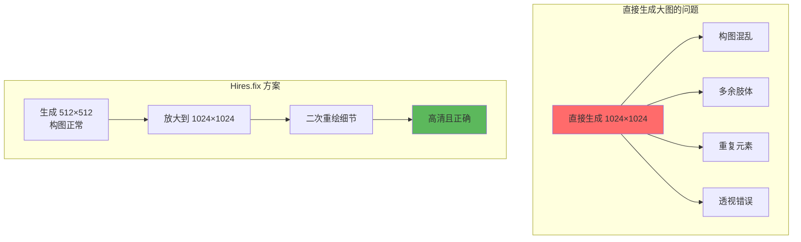
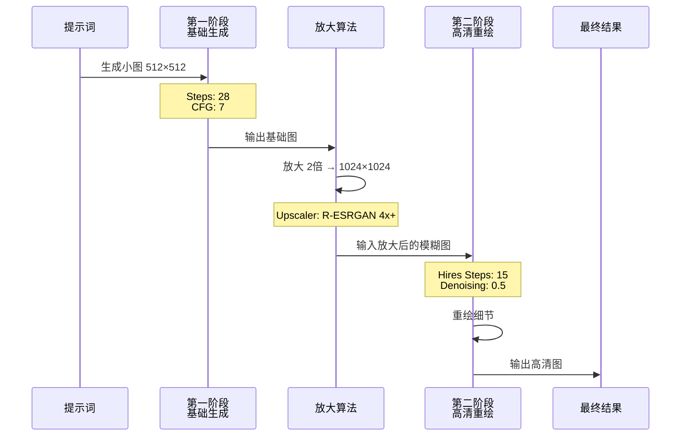
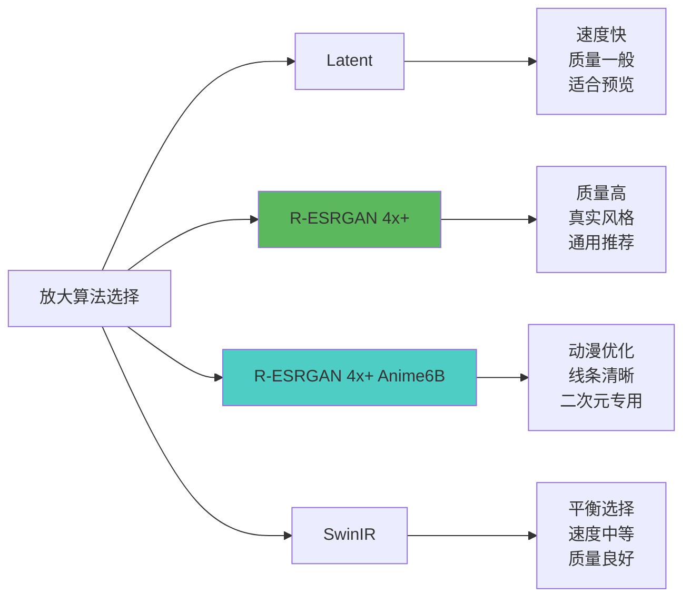
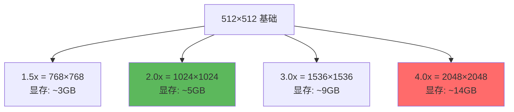
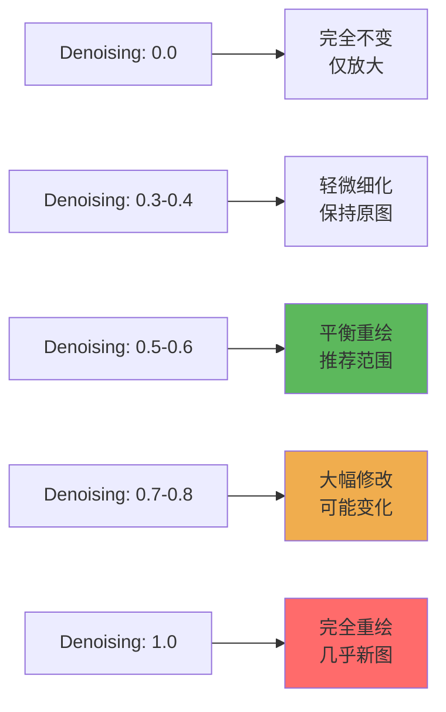
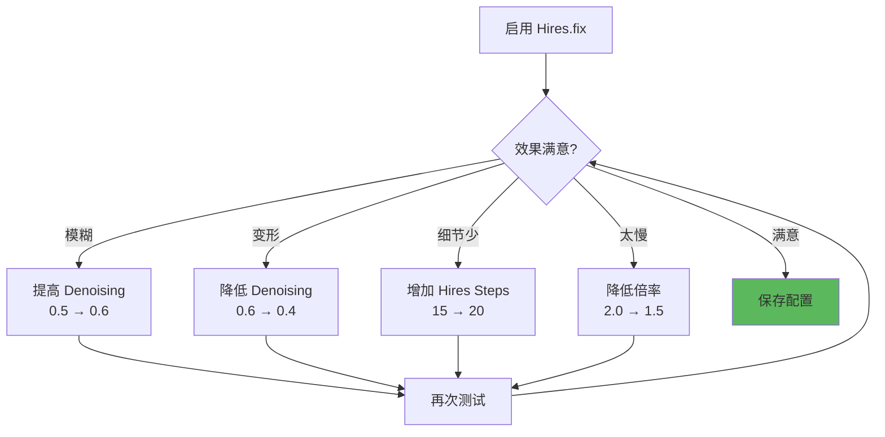

# Hires.fix 详解 - 高清放大的艺术

## 🎯 什么是 Hires.fix？

**Hires.fix (High Resolution Fix)** 是 Stable Diffusion 的高清修复功能，通过二次生成技术将小尺寸图像放大到高分辨率，同时保持细节清晰、避免画面崩坏。

### 为什么需要 Hires.fix？



**核心问题：**
- SD 1.5 训练分辨率：512×512 📏
- 直接生成大图：超出训练分布 → 崩坏 ❌
- Hires.fix 策略：小图构图 + 大图细化 ✅

---

## 🔬 Hires.fix 工作原理

### 两阶段生成流程



### 技术细节

```java
// 第一阶段：基础生成
阶段1参数:
  - 分辨率: 512×512 (或 512×768)
  - Sampler: DPM++ 2M Karras
  - Steps: 25-30
  - CFG Scale: 7
  目标: 确保构图正确、主体清晰

// 放大处理
Upscaler算法:
  - Latent: 在潜空间放大（快速但质量一般）
  - R-ESRGAN 4x+: 真实增强（推荐）
  - R-ESRGAN 4x+ Anime6B: 动漫专用
  - SwinIR: 平衡速度和质量
放大倍率:
  - 常用: 1.5x - 2.5x
  - 最大: 4x (性能允许)

// 第二阶段：高清重绘
阶段2参数:
  - Hires Steps: 10-20 (通常为原步数的50-70%)
  - Denoising Strength: 0.4-0.7
    - 0.3-0.4: 保持原图，轻微细化
    - 0.5-0.6: 平衡修复（推荐）
    - 0.7-0.8: 大幅重绘，可能改变构图
  目标: 添加高分辨率细节，修复瑕疵
```

---

## ⚙️ 核心参数详解

### 1. Upscaler (放大算法)



**算法对比表：**

| 算法 | 速度 | 质量 | 适用风格 | 推荐场景 |
|------|------|------|----------|----------|
| **Latent** | ⚡⚡⚡⚡⚡ | ⭐⭐ | 通用 | 快速测试、预览 |
| **R-ESRGAN 4x+** | ⚡⚡⚡ | ⭐⭐⭐⭐⭐ | 真实、写实 | 照片、产品、风景 |
| **R-ESRGAN 4x+ Anime6B** | ⚡⚡⚡ | ⭐⭐⭐⭐⭐ | 动漫、插画 | 二次元、漫画 |
| **SwinIR 4x** | ⚡⚡⚡⚡ | ⭐⭐⭐⭐ | 通用 | 日常创作 |
| **LDSR** | ⚡ | ⭐⭐⭐⭐⭐ | 真实 | 极致质量（慢） |

**实战选择：**

```java
// 写实摄影
Upscaler: R-ESRGAN 4x+
理由: 真实细节增强，皮肤、材质表现好

// 动漫插画
Upscaler: R-ESRGAN 4x+ Anime6B
理由: 线条锐化，色彩鲜艳，不会糊

// 概念艺术
Upscaler: SwinIR 4x
理由: 保持艺术感，不过度真实化

// 快速测试
Upscaler: Latent
理由: 最快，用于确认构图
```

---

### 2. Upscale by (放大倍率)

```java
// 放大倍率建议
512×512 → 768×768   (1.5x)  // 轻度放大，速度快
512×512 → 1024×1024 (2.0x)  // 常用选择（推荐）
512×768 → 1024×1536 (2.0x)  // 竖图常用
512×512 → 2048×2048 (4.0x)  // 极限高清，显存需求大

// 倍率选择原则
日常创作: 1.5x - 2.0x
社交媒体: 2.0x (1024 px 足够)
打印输出: 2.5x - 4.0x
壁纸海报: 3.0x - 4.0x
```

**显存消耗对比：**



---

### 3. Hires Steps (高清步数)

```java
// 步数配置策略
原始Steps = 28

Hires Steps 建议:
  - 快速模式: 10-12 steps (原步数的 40%)
  - 标准模式: 15-18 steps (原步数的 60%) ✅ 推荐
  - 高质量: 20-25 steps (原步数的 80%)
  - 极致细节: = 原始Steps

// 实战案例
第一阶段 Steps: 30
Hires Steps: 18        // 60% 规则
总步数: 30 + 18 = 48

// 步数与质量关系
Hires Steps < 10: 细节增强不足
Hires Steps 15-20: 性价比最高 ⭐
Hires Steps > 25: 收益递减，耗时长
```

---

### 4. Denoising Strength (重绘幅度)

**最关键的参数！** 决定高清阶段修改原图的程度。



**数值指南：**

```java
// Denoising 0.3-0.4：保守修复
适用场景:
  - 原图已经很完美
  - 只需要增加分辨率
  - 不想改变构图
效果: 轻微锐化、细节补充

// Denoising 0.5-0.6：平衡重绘（推荐）
适用场景:
  - 日常创作
  - 需要优化细节
  - 允许轻微变化
效果: 添加细节、修正瑕疵、保持主体

// Denoising 0.7-0.8：大幅重绘
适用场景:
  - 原图质量一般
  - 需要大幅改善
  - 可接受构图变化
效果: 重新生成细节、可能改变姿势/表情

// Denoising 0.9-1.0：重新创作
适用场景:
  - 仅作为构图参考
  - 完全重绘
效果: 基本是新图，仅保留大致构图
```

**调试技巧：**

```java
// 问题诊断
问题: 放大后模糊不清
解决: 提高 Denoising (0.5 → 0.6)

问题: 人物面部变形
解决: 降低 Denoising (0.6 → 0.4)

问题: 放大后完全变样
解决: 大幅降低 Denoising (0.7 → 0.3-0.4)

问题: 细节不够丰富
解决: 增加 Hires Steps (15 → 20) + 微调 Denoising
```

---

## 🎨 实战配置方案

### 方案1：人物肖像（写实）

```java
// 第一阶段
Resolution: 512×768
Sampler: DPM++ 2M Karras
Steps: 28
CFG Scale: 7

// Hires.fix 设置
☑ Enable Hires.fix
Upscaler: R-ESRGAN 4x+
Upscale by: 2.0 (输出 1024×1536)
Hires Steps: 18
Denoising Strength: 0.45

// 提示词
Prompt: portrait of a beautiful woman, professional photography,
        studio lighting, detailed face, sharp eyes, <lora:detail_skin:0.4>

// 预期效果
- 面部细腻、皮肤质感真实
- 眼睛、头发细节丰富
- 无多余肢体、构图稳定
```

---

### 方案2：动漫角色

```java
// 第一阶段
Resolution: 512×768
Sampler: Euler a
Steps: 25
CFG Scale: 8

// Hires.fix 设置
☑ Enable Hires.fix
Upscaler: R-ESRGAN 4x+ Anime6B
Upscale by: 2.0
Hires Steps: 15
Denoising Strength: 0.5

// 提示词
Prompt: 1girl, anime style, colorful hair, cute face,
        school uniform, outdoor, cherry blossoms,
        <lora:ghibli_style:0.7>

// 预期效果
- 线条清晰锐利
- 色彩鲜艳不失真
- 细节丰富（眼睛、头发）
```

---

### 方案3：风景场景

```java
// 第一阶段
Resolution: 768×512 (横图)
Sampler: DPM++ SDE Karras
Steps: 30
CFG Scale: 6

// Hires.fix 设置
☑ Enable Hires.fix
Upscaler: SwinIR 4x
Upscale by: 2.5 (输出 1920×1280)
Hires Steps: 20
Denoising Strength: 0.55

// 提示词
Prompt: mountain landscape, sunrise, mist, lake reflection,
        photorealistic, 8k, highly detailed

// 预期效果
- 远景清晰、层次分明
- 水面、云层细节丰富
- 整体氛围协调
```

---

### 方案4：产品设计（高精度）

```java
// 第一阶段
Resolution: 512×512
Sampler: DPM++ 2M Karras
Steps: 35
CFG Scale: 9

// Hires.fix 设置
☑ Enable Hires.fix
Upscaler: R-ESRGAN 4x+
Upscale by: 3.0 (输出 1536×1536)
Hires Steps: 25
Denoising Strength: 0.4

// 提示词
Prompt: product photography, luxury watch, studio lighting,
        white background, reflective surface, commercial photography,
        ultra detailed, 8k

// 预期效果
- 产品细节极致清晰
- 材质质感真实
- 适合电商、广告使用
```

---

## 🚀 进阶技巧

### 1. 分段放大策略

```java
// 超大图生成（4K+）建议分两次放大
方案: 512 → 1024 → 2048

第一次放大:
  512×512 → 1024×1024
  Denoising: 0.5
  Hires Steps: 18

第二次放大:
  1024×1024 → 2048×2048
  Denoising: 0.3 (降低，避免过度修改)
  Hires Steps: 15

优势: 避免一次放大4倍导致细节失真
```

---

### 2. 不同区域不同策略

```java
// 使用 ADetailer 配合 Hires.fix
流程:
  1. Hires.fix 放大整体
  2. ADetailer 检测面部
  3. 单独优化面部细节

配置:
  Hires.fix Denoising: 0.5 (整体)
  ADetailer Denoising: 0.35 (面部，更保守)

效果: 背景和人物都完美
```

---

### 3. Latent 模式优化

```java
// Latent Upscaler 特殊用法
优势:
  - 速度极快（2-3倍）
  - 显存占用低
  - 可用于快速迭代

劣势:
  - 质量略低
  - 细节较少

弥补方案:
  Upscaler: Latent
  Denoising: 0.65-0.7 (提高重绘幅度补偿质量)
  Hires Steps: 20-25 (增加步数)

适用: 构图测试、快速出图
```

---

### 4. 固定Seed配合

```java
// 保持一致性的技巧
第一次生成:
  Resolution: 512×768
  Seed: 123456789 (记录)
  不启用 Hires.fix
  → 得到满意构图

第二次放大:
  Resolution: 512×768
  Seed: 123456789 (相同)
  ☑ Enable Hires.fix
  Denoising: 0.45
  → 高清版本

优势: 可对比不同 Denoising 效果
```

---

## ⚠️ 常见问题排查

### 问题对照表

| 问题现象 | 可能原因 | 解决方案 |
|----------|----------|----------|
| **放大后模糊** | Denoising 太低 | 提高到 0.5-0.6 |
| **人物变形/崩坏** | Denoising 太高 | 降低到 0.3-0.45 |
| **细节不足** | Hires Steps 太少 | 增加到 18-20 |
| **生成太慢** | 倍率/步数太高 | 降低倍率或减少步数 |
| **显存不足** | 放大倍率太大 | 降低到 1.5x 或 2.0x |
| **颜色失真** | Upscaler 不匹配 | 更换算法（动漫用 Anime6B） |
| **噪点/颗粒感** | Denoising 太高 + Steps 不足 | 降低 Denoising 或增加 Steps |

---

### 调试流程



---

## 💡 最佳实践总结

### 新手推荐配置

```java
// 适合大多数场景的万用配置
Upscaler: R-ESRGAN 4x+ (写实) 或 Anime6B (动漫)
Upscale by: 2.0
Hires Steps: 原始Steps × 0.6
Denoising Strength: 0.5

// 示例
基础 Steps: 28
Hires Steps: 17
Denoising: 0.5
```

---

### 质量优先配置

```java
// 追求极致质量
Upscaler: R-ESRGAN 4x+ 或 LDSR
Upscale by: 2.5-3.0
Hires Steps: 原始Steps × 0.8
Denoising Strength: 0.45-0.55
基础 Steps: 35+
```

---

### 速度优先配置

```java
// 快速出图
Upscaler: Latent
Upscale by: 1.5
Hires Steps: 10-12
Denoising Strength: 0.65
基础 Steps: 20
```

---

## 🔄 与其他功能配合

### Hires.fix + LoRA

```java
// 推荐做法
1. 基础生成阶段应用 LoRA
   Prompt: beautiful girl, <lora:style_A:0.8>

2. Hires.fix 阶段自动继承 LoRA
   无需额外设置

3. 调整 Denoising
   LoRA 效果强: Denoising 0.4 (保持风格)
   LoRA 效果弱: Denoising 0.6 (增强风格)
```

---

### Hires.fix + ControlNet

```java
// 组合策略
1. ControlNet 在第一阶段生效
   - 确保构图、姿势正确

2. Hires.fix 在第二阶段细化
   - Denoising 建议: 0.4-0.5
   - 避免破坏 ControlNet 引导的结构

注意: Denoising 过高会削弱 ControlNet 效果
```

---

## 📊 性能优化建议

### 显存节省技巧

```java
// 8GB 显存优化
1. 启用 xformers 或 sdp
2. 使用 --medvram 启动参数
3. 放大倍率限制在 2.0x
4. Batch Size = 1

// 6GB 显存优化
1. 使用 --lowvram
2. 倍率 1.5x
3. Upscaler 选择 Latent
4. 必要时分段放大
```

---

### 速度优化

```java
// 提速策略（保持质量）
1. Upscaler: SwinIR (速度与质量平衡)
2. Hires Steps: 原Steps × 0.5
3. Denoising: 0.55-0.6 (略提高补偿步数减少)
4. 使用 Euler a 采样器（第一阶段）

预计提速: 30-40%
质量损失: < 5%
```

---

## 🎓 进阶阅读

### 相关文章推荐

- [采样方法详解](./04-采样方法详解-Sampler的选择与优化.md) - 了解不同采样器
- [Denoising Strength 详解](./10-DenoisingStrength详解-重绘幅度控制.md) - 深入理解重绘参数
- [LoRA 详解](./08-LoRA详解-风格迁移的利器.md) - LoRA 与 Hires.fix 配合

---

## 🎯 核心要点回顾

1. **Hires.fix 本质**: 小图构图 + 大图细化的二阶段策略
2. **关键参数**: Denoising (0.4-0.6)、Hires Steps (原步数的60%)
3. **算法选择**: 写实用 R-ESRGAN 4x+，动漫用 Anime6B
4. **放大倍率**: 日常 2.0x，打印 2.5-3.0x
5. **调试原则**: 模糊提高 Denoising，变形降低 Denoising

---

**Hires.fix 让你的作品从"能看"变成"惊艳"！** ✨

掌握这个功能，你就能生成真正的高清大图，无论是打印、壁纸还是商业用途都游刃有余！
