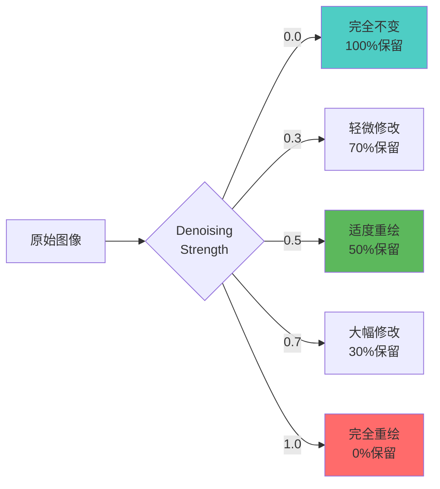
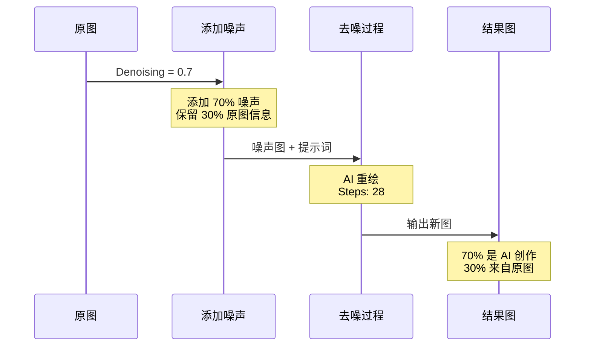
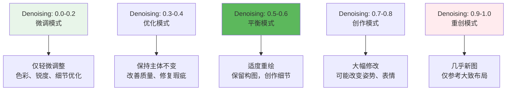
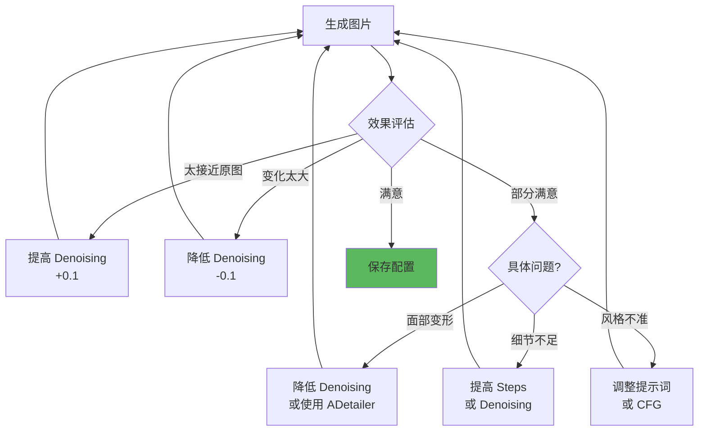

# Denoising Strength 详解 - 重绘幅度控制

## 🎯 什么是 Denoising Strength？

**Denoising Strength (去噪强度/重绘幅度)** 是图生图 (img2img) 和 Hires.fix 中最关键的参数，控制 AI 对原图的修改程度。数值越高，修改越大；数值越低，越接近原图。

### 核心概念



**简单理解：**
- Denoising = 0.0：原图照搬，AI 不动 🔒
- Denoising = 0.5：一半保留，一半创作 ⚖️
- Denoising = 1.0：完全重画，仅参考构图 🎨

---

## 🔬 工作原理

### 扩散模型的去噪过程



### 技术细节

```java
// 噪声添加公式
噪声图 = 原图 × (1 - Denoising) + 随机噪声 × Denoising

// 示例计算
Denoising = 0.5:
  噪声图 = 原图 × 0.5 + 噪声 × 0.5  // 一半一半

Denoising = 0.8:
  噪声图 = 原图 × 0.2 + 噪声 × 0.8  // 大部分重绘

Denoising = 0.2:
  噪声图 = 原图 × 0.8 + 噪声 × 0.2  // 大部分保留
```

**时间步控制：**

```java
// 基于 Steps = 28 的示例
Denoising = 1.0: 执行全部 28 steps (100%)
Denoising = 0.7: 执行 28 × 0.7 = 20 steps (70%)
Denoising = 0.5: 执行 28 × 0.5 = 14 steps (50%)
Denoising = 0.3: 执行 28 × 0.3 = 8 steps (30%)

实际去噪从中间步开始，保留原图的低频信息（构图、色调）
```

---

## 📊 Denoising 数值指南

### 完整范围效果图



### 分档详解

#### 🟢 **0.0 - 0.2：微调档（Fine-tuning）**

```java
适用场景:
  ✓ 原图质量已经很高
  ✓ 只需调整色彩、锐度
  ✓ 修复轻微瑕疵
  ✓ 增强细节纹理

典型应用:
  - 照片后期处理
  - 轻微风格迁移
  - 去噪、去模糊

效果特点:
  保留度: 95-100%
  创作度: 0-5%

示例:
  原图: 人物肖像，轻微模糊
  Denoising: 0.15
  效果: 锐化面部，保持一切不变
```

---

#### 🟡 **0.3 - 0.4：优化档（Enhancement）**

```java
适用场景:
  ✓ 提升图片质量
  ✓ 修复明显瑕疵
  ✓ 统一画风
  ✓ Hires.fix 推荐值

典型应用:
  - 图片高清化
  - 面部修复
  - 画质增强
  - 局部重绘（小范围）

效果特点:
  保留度: 70-85%
  创作度: 15-30%

示例:
  原图: 动漫角色，面部崩坏
  Denoising: 0.35
  效果: 修正面部，保持服装、姿势
```

**推荐配置：**

```java
// Hires.fix 典型配置
Upscaler: R-ESRGAN 4x+
Denoising Strength: 0.4
Hires Steps: 18

// ADetailer 面部修复
ADetailer Model: face_yolov8n
Denoising Strength: 0.35
Inpaint Padding: 32
```

---

#### 🟠 **0.5 - 0.6：平衡档（Balanced）** ⭐ 推荐

```java
适用场景:
  ✓ 日常图生图创作
  ✓ 风格迁移
  ✓ 构图保留 + 内容创作
  ✓ 参考图二次创作

典型应用:
  - 线稿上色
  - 草图精化
  - 换装换背景
  - 角色重绘

效果特点:
  保留度: 50-65%
  创作度: 35-50%

示例:
  原图: 简单线稿
  Denoising: 0.55
  效果: 保持线稿构图，添加色彩、光影、细节
```

**实战案例：**

```java
// 案例1：线稿转彩图
原图: 黑白线稿
Denoising: 0.6
Prompt: anime girl, colorful, vibrant colors, detailed shading
效果: 线条保留，添加色彩和渲染

// 案例2：照片转动漫
原图: 真人照片
Denoising: 0.55
Prompt: anime style, 1girl, <lora:anime_style:0.8>
效果: 保持姿势和构图，转为动漫风格
```

---

#### 🔴 **0.7 - 0.8：创作档（Creative）**

```java
适用场景:
  ✓ 大幅风格转换
  ✓ 原图质量差，需重绘
  ✓ 仅保留大致构图
  ✓ 创意再创作

典型应用:
  - 写实转动漫
  - 低质图重制
  - 创意变体
  - 姿势微调

效果特点:
  保留度: 30-45%
  创作度: 55-70%

风险:
  ⚠️ 可能改变人物表情
  ⚠️ 姿势可能变化
  ⚠️ 细节完全重绘

示例:
  原图: 模糊的风景照
  Denoising: 0.75
  Prompt: oil painting, impressionist style, vivid colors
  效果: 保留山水布局，完全重绘为油画风格
```

---

#### 🔴 **0.9 - 1.0：重创档（Reconstruction）**

```java
适用场景:
  ✓ 仅作为构图参考
  ✓ 完全重新创作
  ✓ 极低质图片
  ✓ ControlNet 配合使用

典型应用:
  - ControlNet + 参考图
  - 完全重绘
  - 仅保留布局

效果特点:
  保留度: 0-20%
  创作度: 80-100%

注意:
  ⚠️ 基本是新图
  ⚠️ 仅保留色块分布
  ⚠️ 细节完全不同

示例:
  原图: 随手涂鸦
  Denoising: 1.0
  效果: 完全新图，仅大致参考涂鸦的色块位置
```

---

## 🎨 实战应用场景

### 场景1：照片转插画

```java
// 目标: 真人照片 → 动漫风格
原图类型: 清晰人物照片
推荐配置:

Denoising Strength: 0.6
Sampler: DPM++ 2M Karras
Steps: 28
CFG Scale: 7

Prompt:
  anime style, 1girl, detailed face, colorful,
  <lora:anime_lineart:0.7>

Negative Prompt:
  realistic, photo, 3d

逻辑:
  - 0.6 保留人物姿势和构图
  - LoRA 引导动漫风格
  - 面部和细节完全重绘
```

---

### 场景2：草图精化

```java
// 目标: 粗糙草图 → 精细作品
原图类型: 铅笔草图、简笔画

阶段1 - 初步上色:
  Denoising: 0.7
  Prompt: detailed, colorful, high quality
  效果: 添加基础色彩和光影

阶段2 - 细节精化:
  使用阶段1输出作为输入
  Denoising: 0.4
  Prompt: ultra detailed, masterpiece
  效果: 优化细节，保持前一阶段成果

多阶段策略优势:
  - 避免一次性大幅修改导致失控
  - 逐步优化，可控性强
```

---

### 场景3：局部重绘（Inpaint）

```java
// 目标: 修改图片局部区域
工具: Inpaint (局部重绘)

配置策略:
  小范围修改 (脸部、手部):
    Denoising: 0.3-0.5
    Inpaint Area: Only masked
    Masked Content: Original

  大范围修改 (换背景、换服装):
    Denoising: 0.6-0.8
    Inpaint Area: Whole picture
    Masked Content: Latent noise

示例 - 修复手部:
  Denoising: 0.4
  Prompt: detailed hand, five fingers, anatomically correct
  Mask Blur: 8
  效果: 仅重绘手部，与身体自然衔接
```

**Inpaint 关键设置：**

```java
// Masked Content 选项
Original:
  - 保留蒙版内原图信息
  - 适合小修改（Denoising 0.3-0.5）

Latent Noise:
  - 蒙版内填充噪声
  - 适合大改/新增内容（Denoising 0.6+）

Latent Nothing:
  - 平滑过渡
  - 适合去除物体

// Inpaint Area 选项
Only Masked:
  - 仅处理蒙版区域（快）
  - 适合局部细节修改

Whole Picture:
  - 处理整图（慢但融合更好）
  - 适合大范围修改
```

---

### 场景4：Hires.fix 高清化

```java
// 目标: 小图放大到高清
Hires.fix 配置:

第一阶段 (生成基础图):
  Resolution: 512×768
  Steps: 28

第二阶段 (高清化):
  Upscaler: R-ESRGAN 4x+
  Upscale by: 2.0
  Denoising Strength: 0.45  // 关键!
  Hires Steps: 18

Denoising 调整策略:
  原图完美: 0.3-0.4  // 仅细化
  原图一般: 0.5-0.6  // 修复+细化
  原图较差: 0.6-0.7  // 大幅重绘

常见问题:
  人脸变形 → 降低 Denoising (0.45 → 0.35)
  细节模糊 → 提高 Denoising (0.45 → 0.55)
```

---

## 🔧 调试技巧

### 问题诊断流程



---

### 常见问题对照表

| 问题现象 | 可能原因 | 解决方案 |
|----------|----------|----------|
| **完全没变化** | Denoising 太低 (0.1-) | 提高到 0.3+ |
| **面目全非** | Denoising 太高 (0.8+) | 降低到 0.5-0.6 |
| **细节模糊** | Denoising 不足 + Steps 少 | Denoising +0.1 或 Steps +5 |
| **人脸崩坏** | Denoising 过高 | 降到 0.4 或启用 ADetailer |
| **局部重绘不融合** | Masked Content 设置错误 | 改用 Original 模式 |
| **放大后变形** | Hires Denoising 过高 | 降到 0.3-0.45 |
| **风格转换不彻底** | Denoising 太保守 | 提高到 0.65-0.75 |

---

### 迭代优化策略

```java
// 推荐工作流程
第1次测试:
  Denoising: 0.5 (中间值)
  评估结果

第2次调整:
  太保守 → 0.6
  太激进 → 0.4

第3次微调:
  以 0.05 为步长精确调整
  例: 0.55, 0.65

最终确定:
  找到最佳值后记录
  建立个人配置库
```

---

## 🎯 进阶技巧

### 1. 动态 Denoising（批量生成）

```java
// 使用 X/Y/Z Plot 探索最佳值
工具: Scripts → X/Y/Z Plot

配置:
  X axis: Denoising Strength
  X values: 0.3, 0.4, 0.5, 0.6, 0.7

  Y axis: CFG Scale
  Y values: 6, 7, 8

输出:
  3×5 = 15 张图片
  快速找到最佳组合
```

---

### 2. 区域差异化 Denoising

```java
// 方法: 多次 Inpaint 不同区域
示例 - 人物+背景:

步骤1 - 优化人物:
  Mask: 人物区域
  Denoising: 0.4
  Prompt: detailed character, high quality

步骤2 - 重绘背景:
  Mask: 背景区域
  Denoising: 0.7
  Prompt: beautiful scenery, detailed background

优势: 不同区域独立控制
```

---

### 3. Denoising 与 ControlNet 配合

```java
// ControlNet 会降低 Denoising 的实际效果
配置建议:

无 ControlNet:
  标准 Denoising: 0.5

有 ControlNet (如 Canny):
  提高 Denoising: 0.6-0.7
  ControlNet Weight: 0.8-1.0

原因:
  ControlNet 会强制保留结构
  需更高 Denoising 才能有足够创作空间
```

---

### 4. 多模型切换技巧

```java
// 方法: 不同阶段使用不同 Checkpoint
阶段1 - 生成基础:
  Checkpoint: 通用模型 (SD 1.5)
  Denoising: -

阶段2 - 风格精化:
  Checkpoint: 风格专用模型 (Anime)
  Denoising: 0.5
  Prompt: 强调风格关键词

效果: 结合不同模型优势
```

---

## 📚 与其他参数的关系

### Denoising vs Steps

```java
// 两者相互影响
Steps = 28, Denoising = 0.5
  → 实际执行 14 steps

Steps = 40, Denoising = 0.5
  → 实际执行 20 steps

建议:
  Denoising 高 (0.7+): Steps 需相应增加 (30+)
  Denoising 低 (0.3-): Steps 可减少 (20)
```

---

### Denoising vs CFG Scale

```java
// CFG 影响提示词强度
CFG 高 + Denoising 高:
  - 强烈修改 + 严格遵循提示词
  - 风险: 过度拟合，画面僵硬

CFG 低 + Denoising 低:
  - 轻微修改 + 自由发挥
  - 风险: 效果不明显

推荐组合:
  Denoising 0.5 + CFG 7 (平衡)
  Denoising 0.7 + CFG 6 (大改但自然)
  Denoising 0.4 + CFG 8 (保守但精确)
```

---

### Denoising vs LoRA

```java
// LoRA 权重会影响 Denoising 效果
强 LoRA (0.9+) + 低 Denoising (0.3):
  - LoRA 风格显著
  - 保留原图构图
  - 适合: 风格迁移

弱 LoRA (0.5) + 高 Denoising (0.7):
  - 大幅重绘
  - LoRA 轻微引导
  - 适合: 创意变体
```

---

## 🎓 最佳实践总结

### 新手推荐配置

```java
// 万用起点配置
图生图:
  Denoising Strength: 0.5
  Sampler: DPM++ 2M Karras
  Steps: 28
  CFG: 7

Hires.fix:
  Denoising Strength: 0.45
  Hires Steps: 18

Inpaint (小范围):
  Denoising Strength: 0.4
  Masked Content: Original

然后根据效果上下调整 ±0.1
```

---

### 场景速查表

| 场景 | 推荐 Denoising | 说明 |
|------|----------------|------|
| 照片轻微优化 | 0.15-0.25 | 去噪、锐化 |
| 面部修复 | 0.30-0.40 | 修正崩坏 |
| Hires.fix | 0.40-0.50 | 高清化 |
| 线稿上色 | 0.55-0.65 | 保留线条 |
| 风格迁移 | 0.60-0.75 | 大幅转换 |
| Inpaint 小范围 | 0.35-0.50 | 局部修改 |
| Inpaint 大范围 | 0.65-0.80 | 重绘背景 |
| 完全重创 | 0.90-1.00 | 仅参考布局 |

---

### 调试口诀

```java
想要保留原图 → Denoising 往下调
想要大幅修改 → Denoising 往上加
面部出问题了 → Denoising 降下来
细节不够清晰 → Denoising 加上去

一般从 0.5 起步
0.1 为单位调整
0.05 精细微调
找到最佳值记录
```

---

## 🔗 相关文章

- [Hires.fix 详解](./09-HiresFix详解-高清放大的艺术.md) - Denoising 在高清化中的应用
- [采样方法详解](./04-采样方法详解-Sampler的选择与优化.md) - 采样器与 Denoising 配合
- [CFG 详解](./06-CFG详解-提示词引导强度.md) - CFG 与 Denoising 协同

---

## 🎯 核心要点

1. **Denoising 本质**: 控制 AI 修改原图的程度（0=不改，1=全改）
2. **通用建议**: 0.5 起步，根据效果 ±0.1 调整
3. **Hires.fix**: 0.4-0.5（避免变形）
4. **Inpaint**: 小范围 0.3-0.5，大范围 0.6-0.8
5. **风格转换**: 0.6-0.75（保留构图，重绘细节）

---

**Denoising Strength 是图生图的灵魂参数！** 🎨

掌握这个参数，你就能精确控制 AI 的"创作自由度"，在保留原图和创新之间找到完美平衡！
