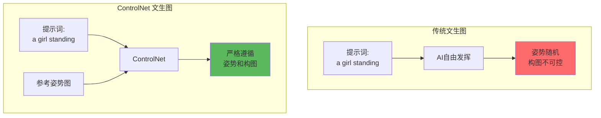
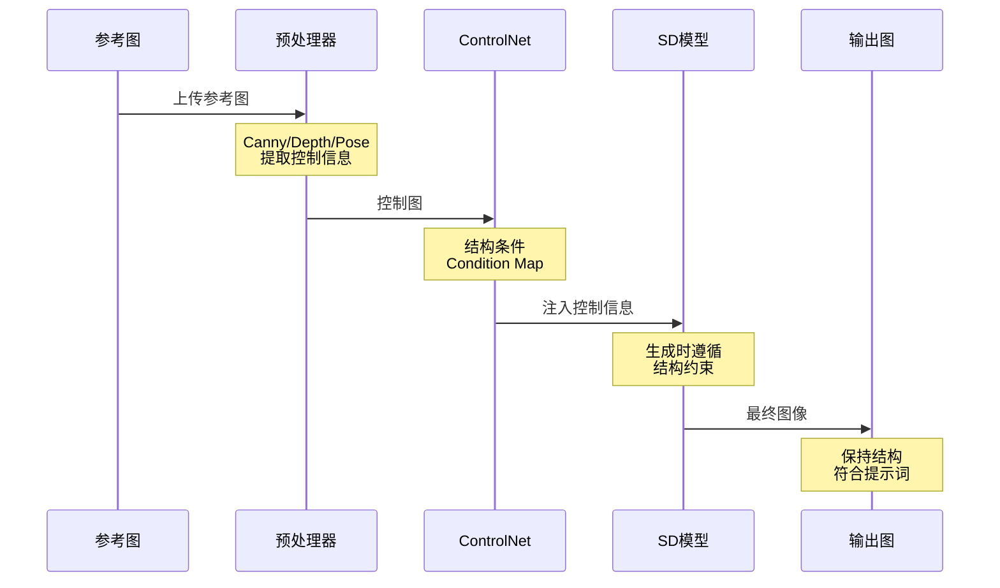
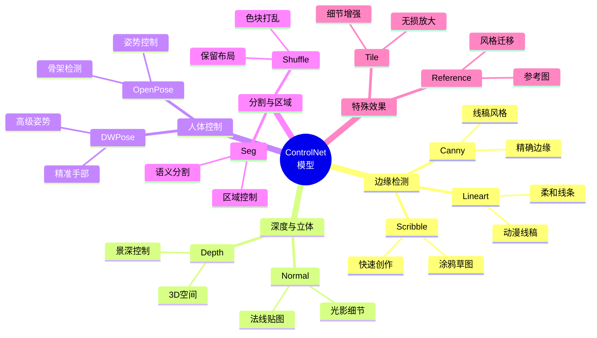
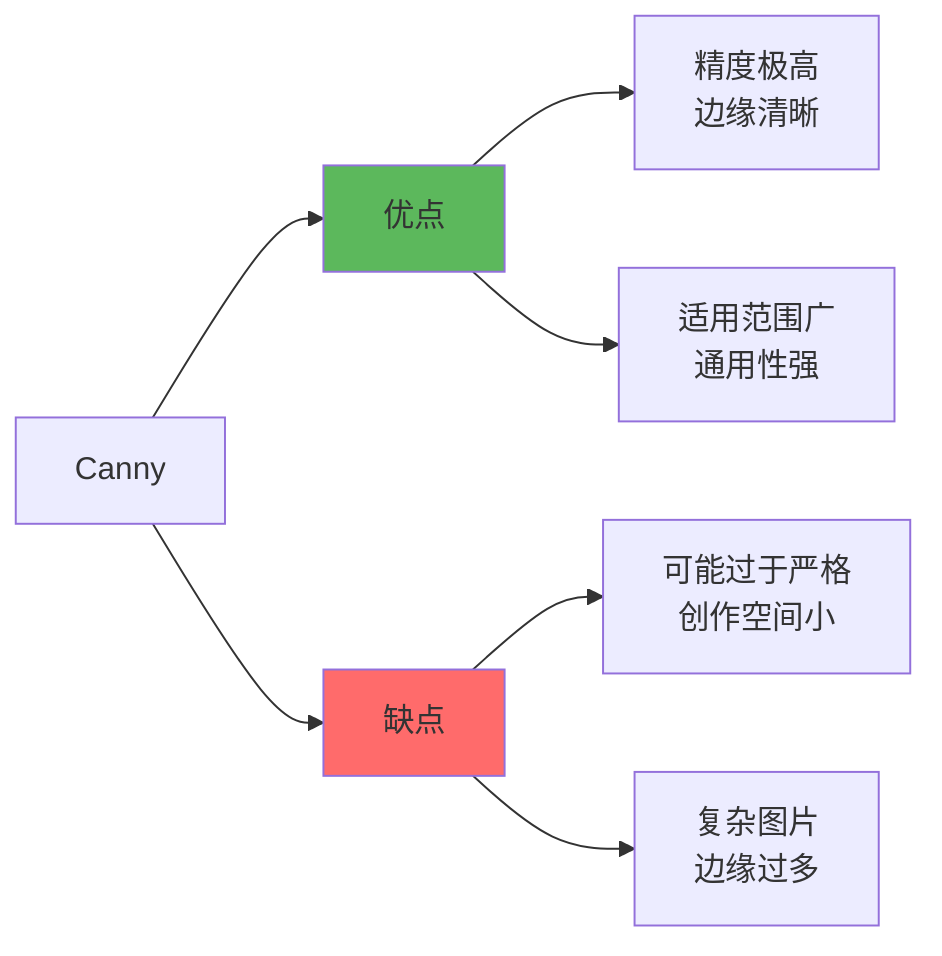
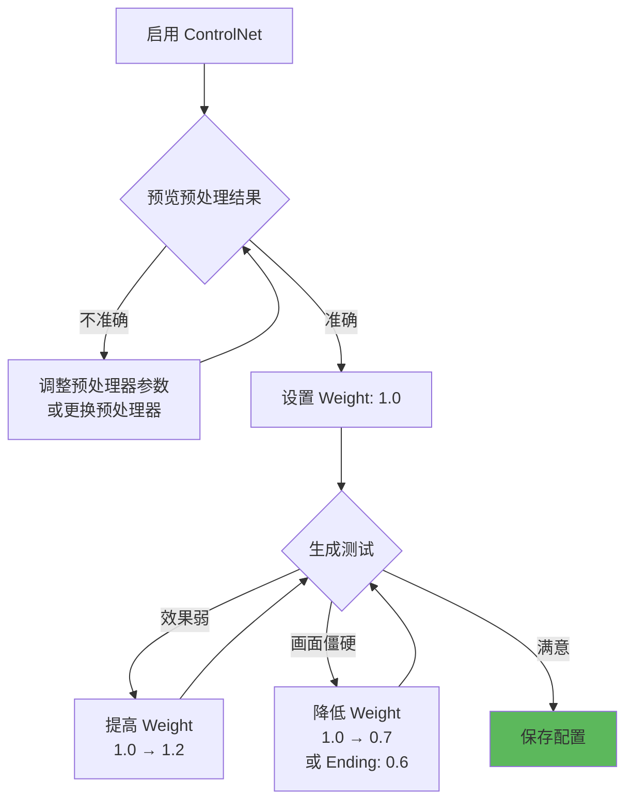

# ControlNet 详解 - 精准控制的艺术

## 🎯 什么是 ControlNet？

**ControlNet** 是 Stable Diffusion 最强大的控制插件，通过预处理参考图像提取结构信息（如边缘、深度、姿势等），精准控制 AI 生成图像的构图、姿态和布局，解决了 AI 绘画"难以精确控制"的核心痛点。

### 革命性突破



**核心优势：**
- 🎯 **姿势控制**：让角色做指定动作
- 📐 **构图控制**：精确复刻照片构图
- 🏗️ **结构控制**：保持建筑、场景布局
- 🎨 **创作自由**：控制结构 + 自由风格

---

## 🔬 工作原理

### 技术架构



### 核心概念

```java
// ControlNet 工作流程
步骤1: 预处理器 (Preprocessor)
  输入: 参考图 (如真人照片)
  处理: 提取特定信息 (如人体姿势)
  输出: 控制图 (骨架、边缘、深度等)

步骤2: ControlNet 模型
  接收: 控制图 + 原始提示词
  作用: 将控制信息注入 SD 生成过程
  效果: 引导 AI 按控制图生成

步骤3: Stable Diffusion
  基于: 提示词 + ControlNet 约束
  生成: 符合结构的创意内容
```

---

## 📊 ControlNet 模型类型

### 核心模型分类



---

## 🎨 核心模型详解

### 1. Canny（边缘检测）⭐ 最常用

```java
// 功能: 提取图像边缘轮廓
适用场景:
  ✓ 精确复刻构图
  ✓ 建筑、产品设计
  ✓ 线稿转精细图
  ✓ 保持物体轮廓

预处理器: canny
模型: control_v11p_sd15_canny

参数配置:
  Canny Low Threshold: 50-100
  Canny High Threshold: 100-200
  // 阈值越低，提取边缘越多

实战案例:
  参考图: 建筑照片
  提示词: cyberpunk city, neon lights, futuristic
  效果: 保持建筑结构，转为赛博朋克风格
```

**优缺点：**



---

### 2. Depth（深度图）⭐ 推荐

```java
// 功能: 提取图像深度信息
适用场景:
  ✓ 保持空间关系
  ✓ 风景、场景生成
  ✓ 保留前后景层次
  ✓ 3D 感强烈

预处理器: depth_midas / depth_leres++
模型: control_v11f1p_sd15_depth

特点:
  - 不关注具体物体形状
  - 关注远近层次
  - 适合景深控制

实战案例:
  参考图: 风景照片
  提示词: fantasy landscape, magical forest, glowing plants
  效果: 保持山川层次，变为奇幻场景
```

**Depth 预处理器对比：**

| 预处理器 | 速度 | 质量 | 适用场景 |
|----------|------|------|----------|
| **depth_midas** | ⚡⚡⚡⚡ | ⭐⭐⭐ | 日常使用 |
| **depth_leres** | ⚡⚡ | ⭐⭐⭐⭐ | 高质量 |
| **depth_leres++** | ⚡ | ⭐⭐⭐⭐⭐ | 极致质量 |
| **depth_zoe** | ⚡⚡⚡ | ⭐⭐⭐⭐ | 平衡选择 |

---

### 3. OpenPose / DWPose（人体姿势）⭐ 人物必备

```java
// 功能: 检测人体骨架和姿势
适用场景:
  ✓ 控制角色姿势
  ✓ 动作复刻
  ✓ 多人场景
  ✓ 手势控制（DWPose更好）

预处理器:
  - openpose_full: 身体+手+脸
  - openpose_faceonly: 仅面部
  - dw_openpose_full: DWPose版本（推荐）

模型: control_v11p_sd15_openpose

参数:
  Body: ✓  // 身体骨架
  Hand: ✓  // 手部细节
  Face: ✓  // 面部关键点

实战案例:
  参考图: 舞蹈动作照片
  提示词: anime girl, magical girl outfit, dynamic pose
  效果: 保持舞蹈姿势，绘制动漫风格
```

**OpenPose vs DWPose：**

```java
// OpenPose (传统)
优点: 稳定、兼容性好
缺点: 手部检测较弱

// DWPose (新一代)
优点: 手部精准、整体检测更好
缺点: 部分预处理器可能较慢

推荐: DWPose (dw_openpose_full) ✅
```

---

### 4. Lineart（线稿）

```java
// 功能: 提取干净线稿
适用场景:
  ✓ 黑白线稿上色
  ✓ 动漫风格转换
  ✓ 草图精化

预处理器:
  - lineart_standard: 标准线稿
  - lineart_coarse: 粗糙线稿（更宽容）
  - lineart_anime: 动漫专用
  - lineart_realistic: 写实线稿

模型: control_v11p_sd15_lineart

实战案例:
  参考图: 铅笔草图
  提示词: anime girl, colorful, detailed, vibrant colors
  效果: 保留线稿，添加色彩和细节
```

---

### 5. Scribble（涂鸦）

```java
// 功能: 识别简单涂鸦/草图
适用场景:
  ✓ 快速构图
  ✓ 手绘草图转图
  ✓ 低保真原型
  ✓ 创意速写

预处理器:
  - scribble_xdog: 提取草图边缘
  - scribble_pidinet: 更精确的边缘
  - 或直接手绘（黑底白线 / 白底黑线）

模型: control_v11p_sd15_scribble

特点:
  - 容错率高
  - 线条可以很潦草
  - 适合快速创作

实战案例:
  参考图: iPad 随手涂鸦
  提示词: beautiful landscape, mountains, lake, sunset
  效果: 将涂鸦变为精美风景画
```

---

### 6. Tile（细节增强/放大）⭐ 高清必备

```java
// 功能: 保留细节的高清放大
适用场景:
  ✓ 图片无损放大
  ✓ 细节增强
  ✓ 修复模糊图
  ✓ 配合 Hires.fix

预处理器: tile_resample / tile_colorfix
模型: control_v11f1e_sd15_tile

优势:
  - 比传统放大算法更智能
  - 添加合理细节而非简单插值
  - 保持整体风格统一

配置建议:
  ControlNet Weight: 0.6-0.8
  Denoising: 0.4-0.5
  配合 Hires.fix 效果更佳

实战案例:
  参考图: 512×512 模糊图
  提示词: ultra detailed, 8k, masterpiece
  效果: 放大到 2048×2048 清晰图
```

---

### 7. Seg（语义分割）

```java
// 功能: 按物体类别分割图像
适用场景:
  ✓ 精确控制不同区域
  ✓ 保持物体位置
  ✓ 换背景/换服装
  ✓ 复杂场景重绘

预处理器:
  - seg_ofcoco: COCO 数据集分类
  - seg_ofade20k: ADE20K 数据集
  - seg_ufade20k: 高精度版本

模型: control_v11p_sd15_seg

色块含义:
  - 天空: 蓝色
  - 地面: 绿色/棕色
  - 建筑: 灰色
  - 人物: 红色
  (具体颜色根据数据集)

实战案例:
  参考图: 人物+背景照片
  提示词: same person, fantasy background, magic castle
  效果: 保持人物位置，更换背景为魔法城堡
```

---

### 8. Reference（参考图）⭐ 风格迁移

```java
// 功能: 基于参考图生成相似风格
适用场景:
  ✓ 风格迁移
  ✓ 保持角色一致性
  ✓ 仿特定画风
  ✓ IP 角色生成

预处理器: reference_only / reference_adain
模型: (使用 SD 自身的注意力机制)

模式:
  1. Style: 仅迁移风格
  2. Balanced: 平衡风格和内容
  3. Structure: 更关注结构

Control Weight 建议: 0.5-0.8

实战案例:
  参考图: 某动漫角色
  提示词: 1girl, different pose, outdoor
  效果: 保持角色特征，生成新姿势
```

---

## 🔧 核心参数详解

### 1. Control Weight（控制权重）

```java
// 控制 ControlNet 影响强度
范围: 0.0 - 2.0

权重指南:
  0.0 - 0.3: 轻微引导，仅参考
  0.4 - 0.7: 中等控制（推荐范围） ✅
  0.8 - 1.0: 强控制，严格遵循
  1.1 - 1.5: 非常严格
  1.6+: 过度控制，可能僵硬

默认值: 1.0

调试策略:
  结构偏离 → 提高权重 (1.0 → 1.2)
  画面僵硬 → 降低权重 (1.0 → 0.7)
  需要创作空间 → 使用 0.5-0.7
```

---

### 2. Starting/Ending Control Step

```java
// 控制 ControlNet 在哪些采样步骤生效
范围: 0.0 - 1.0 (百分比)

典型配置:
  Starting: 0.0  // 从第一步开始
  Ending: 1.0    // 直到最后一步

进阶用法:
  // 早期控制构图，后期自由发挥
  Starting: 0.0
  Ending: 0.6    // 仅在前 60% 步骤控制

  // 延迟控制，先自由生成后约束
  Starting: 0.3  // 从 30% 步骤开始
  Ending: 1.0

实战示例:
  Steps = 28, Ending = 0.6
  → 前 17 steps 受控，后 11 steps 自由
  → 保留大致结构，细节更自然
```

---

### 3. Control Mode（控制模式）

```java
// 控制优先级
选项:
  1. Balanced: 平衡提示词和 ControlNet
  2. My prompt is more important: 提示词优先
  3. ControlNet is more important: 控制图优先

使用建议:
  日常创作: Balanced（默认）
  严格复刻姿势: ControlNet 优先
  创意变体: Prompt 优先

示例场景:
  提示词: beautiful sunset
  ControlNet: 阴天照片深度图

  Balanced: 保持构图，添加夕阳元素
  Prompt 优先: 可能改变构图以匹配夕阳
  ControlNet 优先: 严格保持构图，轻微添加暖色
```

---

### 4. Resize Mode（缩放模式）

```java
// 参考图与生成图尺寸不一致时的处理
选项:
  1. Just Resize: 直接缩放
     - 可能变形
     - 速度最快

  2. Crop and Resize: 裁剪后缩放
     - 保持比例
     - 可能丢失部分内容

  3. Resize and Fill: 缩放后填充
     - 保持完整内容
     - 可能有边缘填充

推荐: Crop and Resize（保持比例）
```

---

## 🎨 实战应用场景

### 场景1：姿势控制（OpenPose）

```java
// 目标: 让动漫角色做真人照片的动作
参考图: 舞蹈动作照片 (真人)

配置:
  Preprocessor: dw_openpose_full
  Model: control_v11p_sd15_openpose
  Control Weight: 1.0
  Control Mode: Balanced

提示词:
  anime girl, magical girl, colorful outfit,
  dynamic pose, detailed, high quality,
  <lora:anime_style:0.8>

Negative:
  realistic, 3d, photo

生成参数:
  Steps: 28
  CFG: 8
  Sampler: DPM++ 2M Karras

效果:
  完全复刻舞蹈动作，动漫风格呈现
```

---

### 场景2：构图复刻（Canny + Depth）

```java
// 目标: 将风景照转为奇幻场景
参考图: 山川湖泊照片

ControlNet 1 - Depth:
  Preprocessor: depth_leres++
  Weight: 0.8
  作用: 保持远近景层次

ControlNet 2 - Canny:
  Preprocessor: canny
  Weight: 0.6
  作用: 保持山峰轮廓

提示词:
  fantasy landscape, magical forest, glowing trees,
  floating islands, aurora sky, dreamy atmosphere

效果:
  精确保持构图，转为奇幻风格

注意: 多 ControlNet 叠加时总权重不要超过 2.0
```

---

### 场景3：线稿上色（Lineart）

```java
// 目标: 黑白线稿转彩色插画
参考图: 干净的动漫线稿

配置:
  Preprocessor: lineart_anime
  Model: control_v11p_sd15_lineart
  Control Weight: 1.2  // 严格保留线条
  Control Mode: ControlNet is more important

提示词:
  1girl, colorful hair, detailed eyes, vibrant colors,
  anime style, cel shading, official art

生成参数:
  CFG: 9  // 提高以强化提示词
  Denoising: 0.7 (如果是 img2img)

技巧:
  - Weight 设高 (1.0-1.3) 保证线稿完整
  - 使用 Lineart 专用预处理器
  - 提示词详细描述颜色
```

---

### 场景4：草图转精图（Scribble）

```java
// 目标: iPad 快速涂鸦 → 完整作品
参考图: 随手画的简笔画（黑白）

配置:
  Preprocessor: None  // 直接使用手绘图
  Model: control_v11p_sd15_scribble
  Control Weight: 0.7  // 不要太严格
  Control Mode: Balanced

输入图要求:
  - 白底黑线 或 黑底白线
  - 线条可以很潦草
  - 标注大致位置即可

提示词:
  detailed illustration, professional artwork,
  vibrant colors, high quality

效果:
  将涂鸦转为精美插画
  保留大致构图但细节全新
```

---

### 场景5：无损放大（Tile）

```java
// 目标: 512×512 放大到 2048×2048
原图: 小尺寸但质量不错的图

阶段1 - Hires.fix:
  Upscaler: R-ESRGAN 4x+
  Upscale by: 2.0 (512 → 1024)
  Hires Steps: 18
  Denoising: 0.45

阶段2 - ControlNet Tile:
  ControlNet:
    Preprocessor: tile_resample
    Model: control_v11f1e_sd15_tile
    Control Weight: 0.7
    Starting: 0.0
    Ending: 1.0

  Upscale by: 2.0 (1024 → 2048)
  Denoising: 0.4

效果:
  逐步放大，保持细节清晰
  比一次性放大 4 倍质量更好
```

---

### 场景6：角色一致性（Reference）

```java
// 目标: 生成同一角色的不同姿势
参考图: 角色设定图

配置:
  ControlNet: reference_only
  Control Weight: 0.6
  Style Fidelity: 0.5
  Reference Mode: Style

提示词:
  1girl, different pose, outdoor background,
  [描述角色特征]

额外技巧:
  - 如需更强一致性，使用 Ref + OpenPose 双重控制
  - Reference 提供角色特征
  - OpenPose 提供新姿势
```

---

## 🚀 进阶技巧

### 1. 多 ControlNet 叠加

```java
// 最多可同时使用 3-4 个 ControlNet
推荐组合:

组合1: Pose + Depth
  OpenPose: 控制姿势 (Weight 1.0)
  Depth: 控制空间 (Weight 0.6)
  适合: 人物+场景精准控制

组合2: Canny + Reference
  Canny: 控制轮廓 (Weight 0.7)
  Reference: 统一风格 (Weight 0.5)
  适合: 风格迁移 + 构图保留

组合3: Tile + Depth + Canny
  Tile: 细节增强 (Weight 0.6)
  Depth: 空间层次 (Weight 0.5)
  Canny: 边缘引导 (Weight 0.4)
  适合: 高清放大 + 结构优化

注意事项:
  ⚠️ 总权重建议 < 2.5
  ⚠️ 过多ControlNet会冲突
  ⚠️ 按主次分配权重
```

---

### 2. 预处理器参数调优

```java
// Canny 阈值调整
Low Threshold: 50 (降低检测更多边缘)
High Threshold: 200 (提高减少边缘)

调试:
  - 边缘太少 → 降低阈值
  - 边缘太多 → 提高阈值
  - 预览预处理结果后调整

// Depth 预处理器选择
快速测试: depth_midas
最终出图: depth_leres++
平衡选择: depth_zoe
```

---

### 3. Ending Step 创意用法

```java
// 技巧: 早期控制，后期自由
配置:
  Control Weight: 1.0
  Starting: 0.0
  Ending: 0.5  // 仅前一半步骤

效果:
  - 前半段: 严格遵循控制图
  - 后半段: 自由优化细节
  - 结果: 保持结构但更自然

适用:
  - 避免画面过于僵硬
  - 保留创作空间
  - 细节更生动
```

---

### 4. ControlNet + LoRA 组合

```java
// 黄金组合: 结构控制 + 风格迁移
ControlNet: OpenPose (控制姿势)
LoRA: <lora:ghibli_style:0.8> (吉卜力风格)

提示词:
  anime girl, ghibli style, soft lighting,
  <lora:ghibli_style:0.8>

ControlNet 配置:
  Weight: 1.0 (姿势严格)
  Ending: 0.7 (后期放松控制)

效果:
  姿势精准 + 风格统一
```

---

### 5. IP-Adapter 配合

```java
// IP-Adapter: 另一种参考图方法
区别:
  Reference ControlNet:
    - 基于注意力机制
    - 偏向整体风格

  IP-Adapter:
    - 基于 CLIP 图像编码
    - 更强的语义理解

组合使用:
  IP-Adapter: 提供角色特征 (Weight 0.6)
  OpenPose: 控制姿势 (Weight 1.0)

效果: 最强角色一致性控制
```

---

## ⚠️ 常见问题

### 问题诊断表

| 问题 | 可能原因 | 解决方案 |
|------|----------|----------|
| **完全不起作用** | 模型未下载/路径错误 | 检查 models/ControlNet/ 目录 |
| **效果很弱** | Weight 太低 | 提高到 0.8-1.0 |
| **画面僵硬** | Weight 太高 | 降低到 0.6-0.7 或调整 Ending |
| **姿势错误** | 预处理器检测失败 | 更换预处理器或手动修正控制图 |
| **手部崩坏** | OpenPose 检测不准 | 使用 DWPose 或手动编辑骨架 |
| **多ControlNet冲突** | 权重分配不合理 | 降低次要ControlNet权重 |
| **显存不足** | 多ControlNet+高分辨率 | 减少ControlNet数量或降低分辨率 |

---

### 调试流程



---

## 📚 资源与工具

### ControlNet 模型下载

```java
// 官方模型
来源: Hugging Face (lllyasviel/ControlNet)
版本: v1.1 (推荐)
格式: .pth / .safetensors

常用模型列表:
  - control_v11p_sd15_canny
  - control_v11f1p_sd15_depth
  - control_v11p_sd15_openpose
  - control_v11p_sd15_lineart
  - control_v11p_sd15_scribble
  - control_v11f1e_sd15_tile
  - control_v11p_sd15_seg

下载后放置:
  stable-diffusion-webui/models/ControlNet/
```

---

### 辅助工具

```java
// 1. OpenPose Editor (WebUI 插件)
功能: 手动编辑骨架
用途: 修正检测错误，创建自定义姿势

// 2. ControlNet Annotator
功能: 独立预处理工具
用途: 批量生成控制图

// 3. Blender + OpenPose
功能: 3D 模型导出姿势
用途: 创建复杂动作参考
```

---

## 🎯 最佳实践

### 新手推荐流程

```java
// 第1步: 选择合适的 ControlNet 类型
人物姿势 → OpenPose / DWPose
建筑/产品 → Canny
风景 → Depth
线稿 → Lineart
草图 → Scribble

// 第2步: 标准配置
Control Weight: 1.0 (起点)
Control Mode: Balanced
Starting: 0.0
Ending: 1.0

// 第3步: 预览预处理
点击 "Preview" 查看控制图
确认提取的信息正确

// 第4步: 低分辨率测试
先用 512×512 快速测试
确认效果后再高分辨率生成

// 第5步: 微调
根据效果调整 Weight 和 Ending
```

---

### 性能优化

```java
// 显存优化
1. 单次只用 1-2 个 ControlNet
2. 降低预处理分辨率（Preprocessor Resolution: 512）
3. 使用 --lowvram 或 --medvram 启动参数

// 速度优化
1. 选择快速预处理器
   - depth_midas (快) vs depth_leres++ (慢)
2. 降低分辨率测试
3. 减少采样步数 (20-25 steps)
```

---

## 🔗 相关文章

- [Denoising Strength 详解](./10-DenoisingStrength详解-重绘幅度控制.md) - 图生图核心参数
- [LoRA 详解](./08-LoRA详解-风格迁移的利器.md) - ControlNet + LoRA 组合
- [Hires.fix 详解](./09-HiresFix详解-高清放大的艺术.md) - Tile ControlNet 应用

---

## 🎓 总结

**ControlNet 核心价值：**

1. **精准控制**: 告别随机，想画啥就画啥
2. **多样组合**: 姿势+风格+细节全方位控制
3. **创作提效**: 参考图直接转创意，省时省力

**使用口诀：**
```
选对类型是基础
权重适中最重要
预览控制图必做
单个测试再叠加
```

---

**ControlNet 是 SD 从"随机艺术"到"精准创作"的革命！** 🚀

掌握 ControlNet，你就能精确控制 AI 的每一笔，真正实现"所想即所得"！
