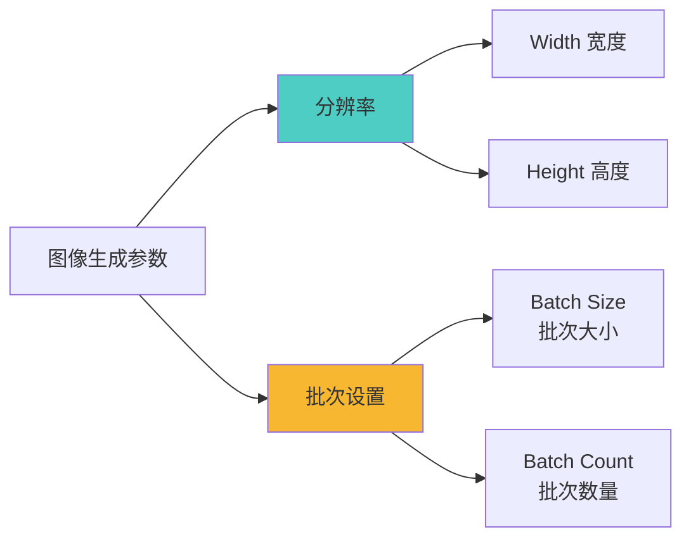
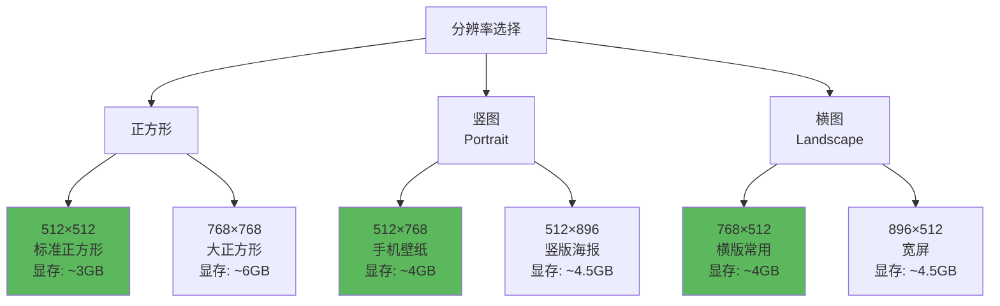
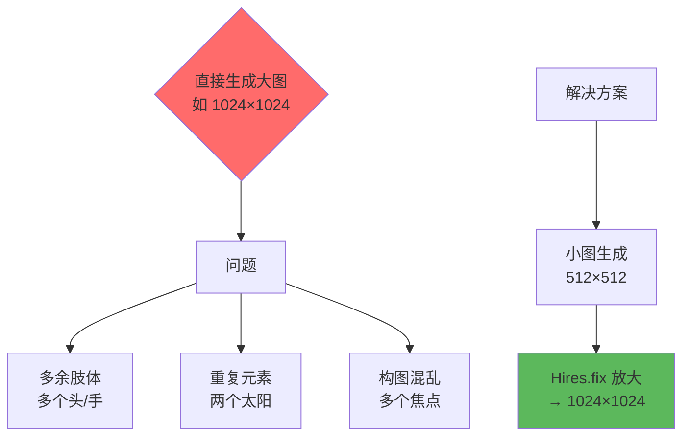
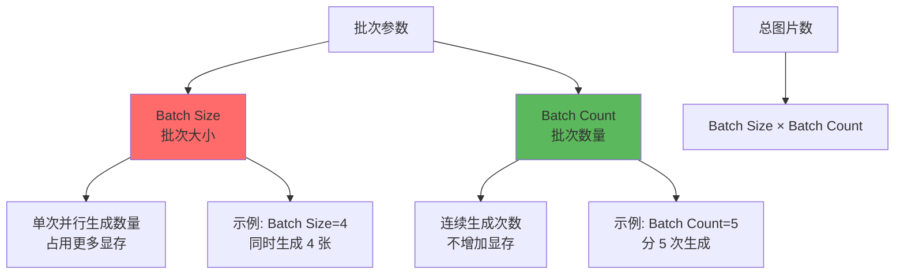
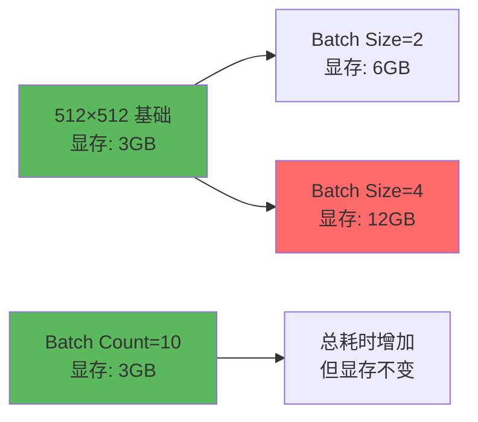
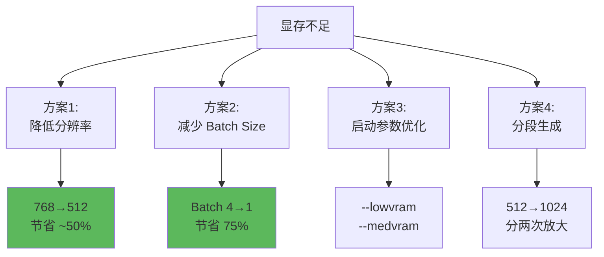
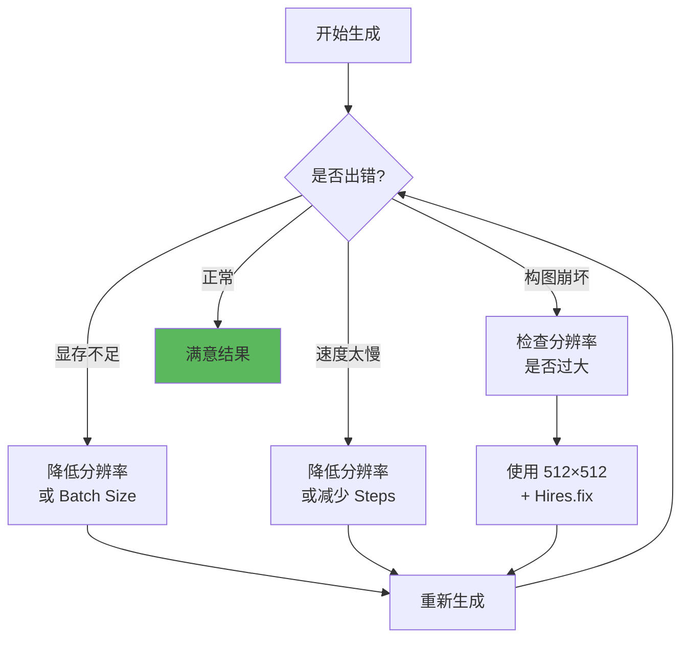

# 分辨率与批次设置 - 基础参数优化

## 🎯 核心概念

分辨率 (Width × Height) 和批次设置 (Batch Size/Count) 是 Stable Diffusion 最基础但极其重要的参数，直接影响图像质量、生成速度和显存占用。

### 参数概览



---

## 📐 分辨率详解 (Width × Height)

### SD 1.5 训练分辨率

```java
// Stable Diffusion 1.5 核心信息
训练分辨率: 512×512 像素
最佳生成范围: 512×512 到 768×768

总像素数建议: 不超过 512×768 = 393,216 像素

为什么是 512×512?
  - SD 1.5 在此分辨率训练
  - 超出此范围容易出现构图问题
  - 直接生成大图会导致：
    ❌ 多余肢体
    ❌ 重复元素
    ❌ 构图混乱
    ❌ 透视错误
```

### 常用分辨率表



### 标准分辨率推荐

| 用途 | 推荐尺寸 | 比例 | 显存需求 | 说明 |
|------|----------|------|----------|------|
| **日常创作** | 512×512 | 1:1 | ~3GB | 最稳定 ✅ |
| **人物肖像** | 512×768 | 2:3 | ~4GB | 竖图常用 ✅ |
| **风景图** | 768×512 | 3:2 | ~4GB | 横图常用 ✅ |
| **手机壁纸** | 512×896 | 9:16 | ~4.5GB | 现代手机 |
| **电脑壁纸** | 896×512 | 16:9 | ~4.5GB | 宽屏 |
| **Instagram** | 512×640 | 4:5 | ~3.5GB | 社交媒体 |
| **测试用** | 512×512 | 1:1 | ~3GB | 快速测试 |

---

### 分辨率计算规则

```java
// 黄金法则：保持总像素在安全范围
安全范围 = 512×512 到 512×768
总像素数 = Width × Height

计算示例:
  512×512 = 262,144 像素 ✅ 最安全
  512×768 = 393,216 像素 ✅ 推荐上限
  640×640 = 409,600 像素 ⚠️ 可能不稳定
  768×768 = 589,824 像素 ❌ 容易崩坏（无 Hires.fix）

// 64 的倍数规则
Width 和 Height 必须是 64 的倍数
  ✅ 512, 576, 640, 704, 768, 832, 896, 960
  ❌ 500, 550, 600（会自动调整）

原因: VAE 压缩比为 8，64 = 8×8
```

### 常见问题与解决



**问题示例：**

```java
// 错误做法
Resolution: 1024×1024  // 直接生成
结果: 一个人有多个头，或背景中出现重复物体

// 正确做法
Resolution: 512×512    // 基础生成
☑ Enable Hires.fix
Upscale by: 2.0        // 放大到 1024×1024
结果: 构图正常，高清图像 ✅
```

---

## 🎨 不同场景的分辨率选择

### 场景1：人物肖像

```java
// 标准人物肖像
推荐: 512×768 (2:3)

原因:
  - 人物通常占画面中央
  - 竖图更符合人体比例
  - 适合展示全身或半身

配合参数:
  CFG: 7-8
  Steps: 28
  Sampler: DPM++ 2M Karras

提示词关键:
  portrait, upper body, solo, detailed face
```

---

### 场景2：风景场景

```java
// 风景摄影
推荐: 768×512 (3:2) 或 896×512 (16:9)

原因:
  - 横向延展更自然
  - 符合视野习惯
  - 适合展现广阔场景

配合参数:
  CFG: 6-7
  Steps: 30
  Sampler: DPM++ SDE Karras

提示词关键:
  landscape, wide shot, panorama, scenic view
```

---

### 场景3：产品设计

```java
// 产品展示
推荐: 512×512 (1:1) 或 768×768

原因:
  - 正方形构图稳定
  - 产品居中对称
  - 适合电商展示

配合参数:
  CFG: 8-10  // 提高精确度
  Steps: 35
  Sampler: DPM++ 2M Karras

提示词关键:
  product photography, white background,
  studio lighting, centered
```

---

### 场景4：概念艺术

```java
// 概念设计图
推荐: 768×512 或 1024×576 (需 Hires.fix)

原因:
  - 宽幅展现宏大场景
  - 适合多元素构图
  - 电影感强烈

配合参数:
  CFG: 6-8
  Steps: 35-40
  Sampler: DDIM 或 DPM++ SDE

提示词关键:
  concept art, cinematic, epic scene,
  detailed environment
```

---

## 🔄 批次设置详解

### Batch Size vs Batch Count



### 参数对比

```java
// Batch Size（批次大小）
定义: 单次生成时并行处理的图像数量
范围: 1-8 (取决于显存)

特点:
  ✅ 速度快（并行处理）
  ❌ 显存占用成倍增加
  ✅ 所有图像使用相同 Seed 变体

示例:
  Batch Size = 4
  → 一次性生成 4 张（Seed: 123, 124, 125, 126）
  → 显存需求: 基础需求 × 4

// Batch Count（批次数量）
定义: 连续生成的批次数
范围: 1-∞

特点:
  ✅ 显存占用不变
  ❌ 速度较慢（串行处理）
  ✅ 可以生成大量图片

示例:
  Batch Count = 5
  → 分 5 次生成（每次独立）
  → 显存需求: 不变
```

### 显存占用对比



**实际测试数据：**

| 配置 | 512×512 显存 | 768×768 显存 | 生成时间 |
|------|--------------|--------------|----------|
| Batch Size=1 | ~3GB | ~6GB | 基准 |
| Batch Size=2 | ~6GB | ~12GB | +30% |
| Batch Size=4 | ~12GB | ~24GB | +50% |
| Batch Count=10 | ~3GB | ~6GB | ×10 |

---

## 💡 批次使用策略

### 策略1：快速测试（Batch Size）

```java
// 场景: 测试不同 Seed 效果
目标: 快速生成多个变体选择最佳

配置:
  Batch Size: 4-8
  Batch Count: 1
  Resolution: 512×512 (降低显存需求)
  Steps: 20 (加快速度)

优势:
  - 一次性看到多个结果
  - 相同参数不同 Seed
  - 快速筛选

显存要求:
  8GB 以上显卡推荐
```

---

### 策略2：大量生产（Batch Count）

```java
// 场景: 生成素材库、训练数据集
目标: 生成大量图片（100+张）

配置:
  Batch Size: 1
  Batch Count: 100
  Resolution: 512×512

优势:
  - 显存友好
  - 可长时间运行
  - 无人值守

配合:
  - 随机 Seed (-1)
  - X/Y/Z Plot 探索参数
```

---

### 策略3：平衡方案

```java
// 场景: 日常创作
目标: 平衡速度和显存

配置:
  Batch Size: 2  // 小幅并行
  Batch Count: 5 // 分几批生成
  总数: 2×5 = 10 张

优势:
  - 显存需求适中（~6GB）
  - 速度比纯 Batch Count 快
  - 生成数量足够选择

适用:
  6-8GB 显卡用户
```

---

## 🎯 实战配置方案

### 方案1：新手推荐配置

```java
// 目标: 稳定出图，不出错
Resolution: 512×512
Batch Size: 1
Batch Count: 4

Sampling:
  Steps: 28
  CFG: 7
  Sampler: DPM++ 2M Karras

显存需求: 4GB
适合: 大部分场景
```

---

### 方案2：快速迭代配置

```java
// 目标: 快速测试提示词效果
Resolution: 512×512
Batch Size: 4      // 一次看 4 个结果
Batch Count: 1
Steps: 20          // 降低步数加速

适合:
  - 提示词调试
  - 参数探索
  - Seed 筛选

注意:
  需要 8GB+ 显存
```

---

### 方案3：高质量输出配置

```java
// 目标: 最终作品，追求质量
Resolution: 512×768
Batch Size: 1
Batch Count: 1

Sampling:
  Steps: 35-40
  CFG: 7
  Sampler: DPM++ SDE Karras

Hires.fix:
  ☑ Enable
  Upscale by: 2.0
  Denoising: 0.45
  Hires Steps: 20

输出: 1024×1536 高清图
时间: 较长，但质量最佳
```

---

### 方案4：大批量生成配置

```java
// 目标: 生成素材库
Resolution: 512×512
Batch Size: 1
Batch Count: 50-100
Seed: -1 (随机)

Scripts:
  可选用 X/Y/Z Plot 探索参数空间

  X axis: Seed
  Y axis: CFG Scale (6, 7, 8)
  Z axis: Sampler (3种)

  自动生成: 10×3×3 = 90 张图片

适合:
  - 训练数据集
  - 素材库建立
  - LoRA 训练准备
```

---

## 📊 显存优化技巧

### 显存不足的解决方案



### 具体优化措施

```java
// 1. 降低分辨率
768×768 → 512×768 (节省 ~35% 显存)
512×768 → 512×512 (节省 ~30% 显存)

// 2. 调整 Batch Size
Batch Size: 4 → 1 (节省 75% 显存)

// 3. 启动参数（WebUI）
--medvram   // 中等显存优化（8GB 显卡）
--lowvram   // 低显存优化（6GB 显卡）
--xformers  // 使用 xformers 加速（推荐）

// 4. VAE 设置
Settings → Stable Diffusion
VAE: Auto (或选择 tiled VAE 插件)

// 5. 分段生成
先生成 512×512
再用 Hires.fix 放大到 1024×1024
总显存需求低于直接生成 1024×1024
```

---

## 🚀 进阶技巧

### 1. 黄金比例分辨率

```java
// 基于黄金比例（1:1.618）的艺术构图
512×832  (约 1:1.62)  // 竖图
832×512  (约 1.62:1)  // 横图

优势:
  - 构图更和谐
  - 视觉更舒适
  - 适合艺术创作

注意:
  832 不是 64 的倍数，会自动调整为 832
```

---

### 2. X/Y/Z Plot 探索分辨率

```java
// 工具: Scripts → X/Y/Z Plot
X axis: Width
X values: 512, 576, 640

Y axis: Height
Y values: 512, 576, 640

输出: 3×3 = 9 种分辨率组合
用途: 找到最佳画面比例
```

---

### 3. 动态分辨率调整

```java
// 根据主体调整分辨率
全身人像: 512×768 (更竖)
半身肖像: 512×640 (稍竖)
头像特写: 512×512 (正方)

宽广风景: 896×512 (很横)
常规风景: 768×512 (稍横)

产品居中: 512×512 (正方)
```

---

### 4. SDXL 分辨率（进阶）

```java
// SDXL 模型的分辨率
训练分辨率: 1024×1024

推荐范围:
  1024×1024  // 标准正方形
  896×1152   // 竖图
  1152×896   // 横图

特点:
  - 原生高分辨率
  - 无需 Hires.fix
  - 显存需求: 10GB+

注意:
  本文主要讨论 SD 1.5
  SDXL 是另一套体系
```

---

## ⚠️ 常见错误与避免

### 错误对照表

| 错误做法 | 问题 | 正确做法 |
|----------|------|----------|
| 直接生成 1024×1024 | 多余肢体、重复元素 | 512×512 + Hires.fix |
| Width/Height 不是64倍数 | 自动调整，可能不准 | 使用标准值 |
| 8GB 显卡 Batch Size=8 | 显存不足崩溃 | Batch Size=1-2 |
| 过高分辨率 (1536+) | 生成极慢、崩坏 | 分段放大 |
| 奇怪比例 (如 1000×300) | 构图怪异 | 使用标准比例 |

---

### 调试流程



---

## 📚 最佳实践总结

### 新手黄金配置

```java
// 适合 95% 的场景
Resolution: 512×512 或 512×768
Batch Size: 1
Batch Count: 4
Steps: 28
CFG: 7
Sampler: DPM++ 2M Karras

显存需求: 4GB
生成速度: 中等
质量: 稳定可靠 ✅
```

---

### 分辨率选择口诀

```
人物竖图 512×768
风景横图 768×512
测试正方 512×512
高清必用 Hires.fix

超过 512×768
构图容易出问题
想要大图别着急
小图放大才是道
```

---

### Batch 使用建议

```java
// 显存充足（12GB+）
Batch Size: 4-8 快速测试
Batch Count: 按需设置

// 显存适中（8GB）
Batch Size: 2
Batch Count: 按需设置

// 显存紧张（6GB）
Batch Size: 1
Batch Count: 多批次生成

// 终极省显存
Resolution: 512×512
Batch Size: 1
--lowvram 启动
```

---

## 🔗 相关文章

- [Hires.fix 详解](./09-HiresFix详解-高清放大的艺术.md) - 如何从小图放大到高清
- [Checkpoint 详解](./01-Checkpoint详解-SD的核心模型.md) - 不同模型的分辨率要求
- [Sampler 详解](./04-采样方法详解-Sampler的选择与优化.md) - 采样器对分辨率的影响

---

## 🎯 核心要点

1. **SD 1.5 安全区**: 512×512 到 512×768
2. **直接大图**: 容易崩坏，不推荐
3. **正确姿势**: 小图 + Hires.fix
4. **64 倍数**: Width 和 Height 必须是 64 的倍数
5. **Batch Size**: 并行但吃显存
6. **Batch Count**: 串行但显存友好

---

**分辨率和批次是基础，但基础打好才能飞！** 🚀

掌握这些参数，你就能避开 90% 的新手坑，稳定输出高质量作品！
