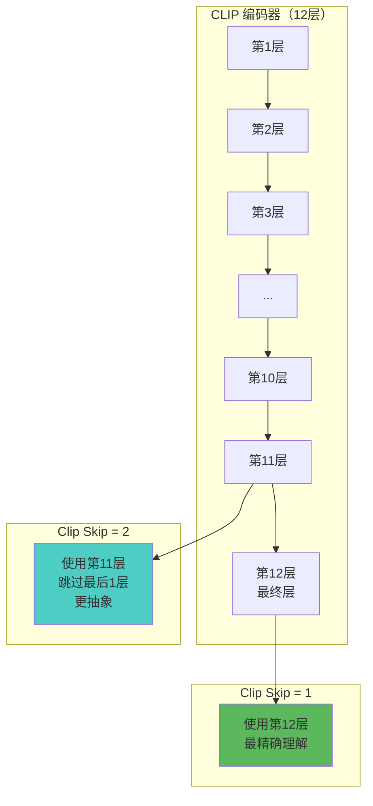
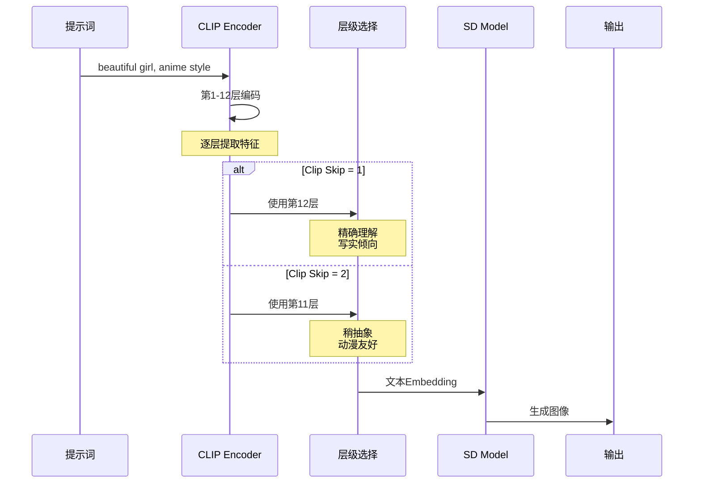
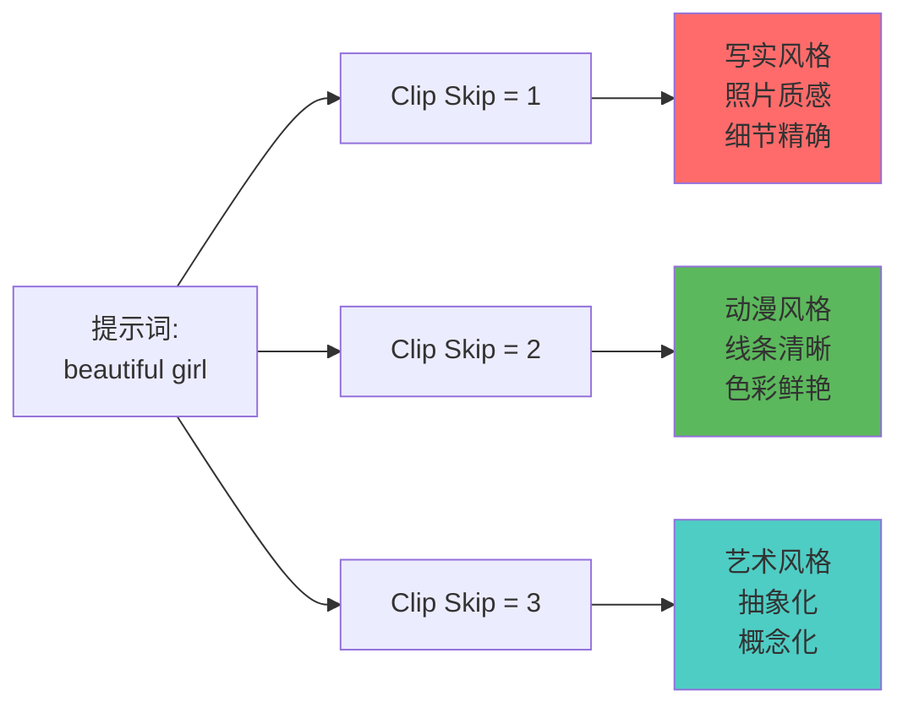
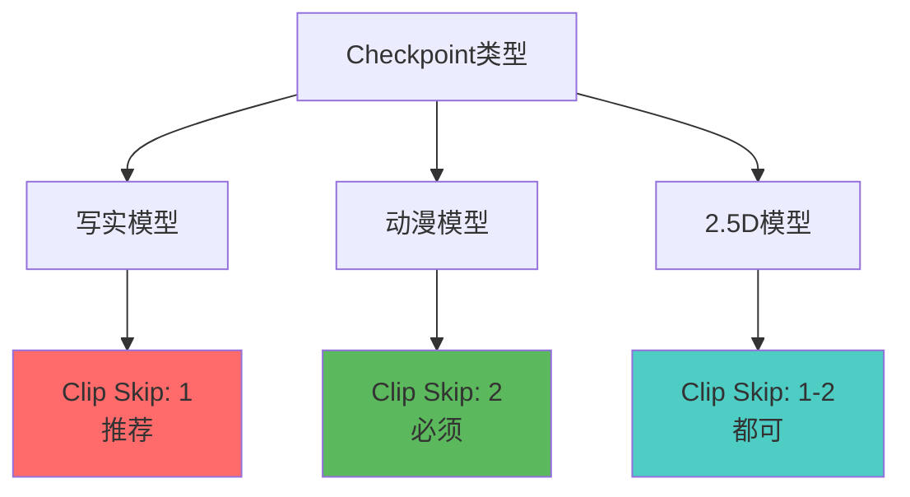
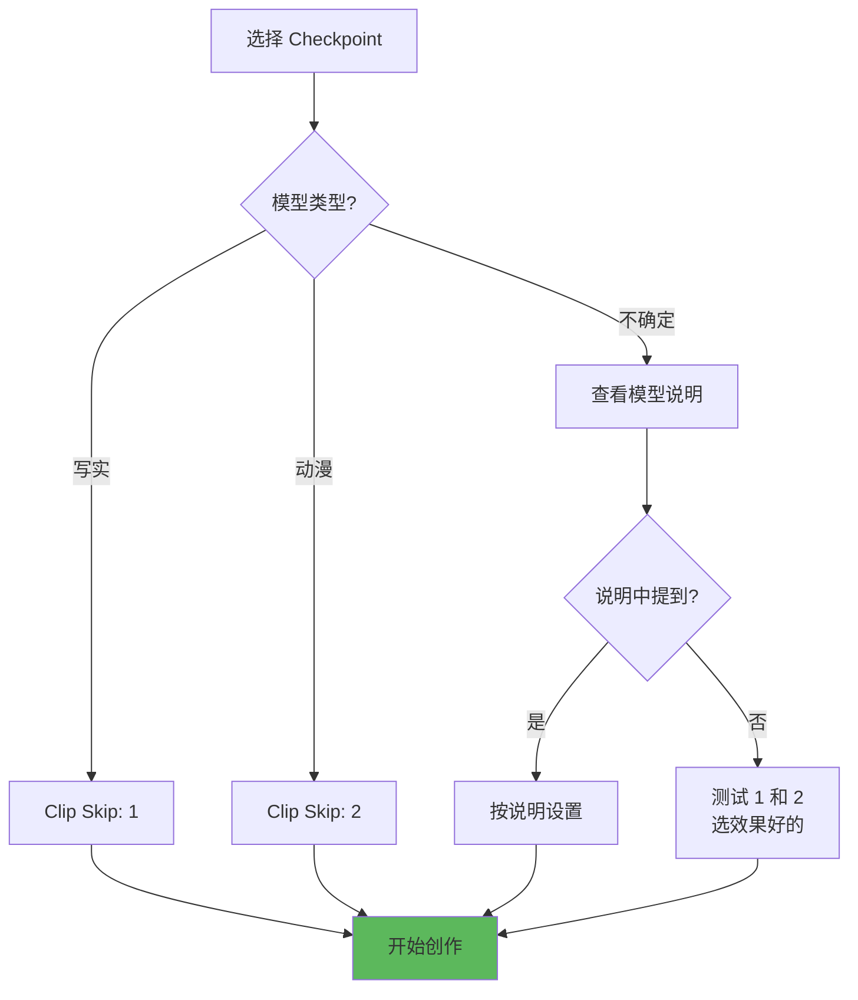
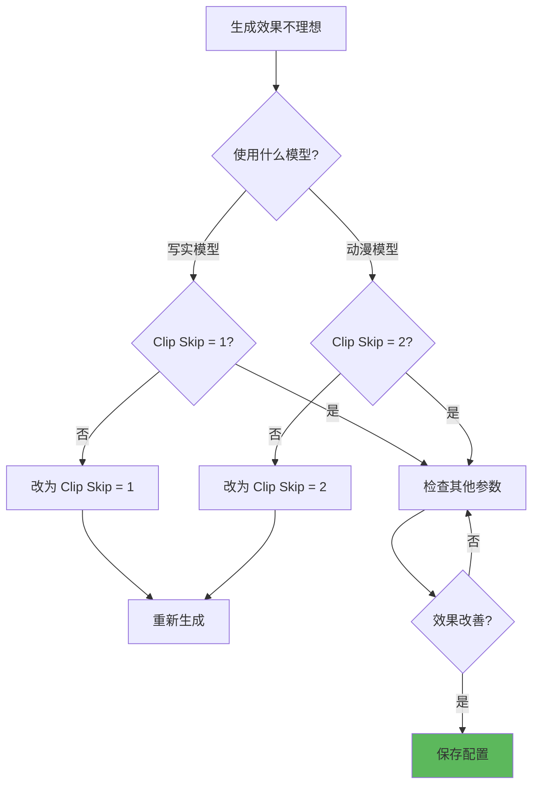

# Clip Skip 详解 - 风格调节的秘密

## 🎯 什么是 Clip Skip？

**Clip Skip** 是一个隐藏但强大的参数，控制 CLIP 文本编码器使用哪一层的输出。通过"跳过"最后几层，可以改变 AI 对提示词的理解方式，从而影响生成图像的风格倾向。

### 核心概念



**简单理解：**
- Clip Skip = 1：使用最终层，理解最"精确" 📐
- Clip Skip = 2：跳过最后1层，理解更"抽象" 🎨
- 数值越大，跳过层数越多，风格越偏"艺术化"

---

## 🔬 工作原理

### CLIP 层级结构

```java
// CLIP Text Encoder 结构
总层数: 12 层 Transformer

每一层的作用:
  浅层 (1-4层): 识别基础词汇、语法
  中层 (5-8层): 理解语义关系、概念组合
  深层 (9-12层): 精确匹配、细节理解

// Clip Skip 的实际效果
Clip Skip = 1:
  使用: 第 12 层（最深层）
  特点: 最精确理解提示词，倾向写实

Clip Skip = 2:
  使用: 第 11 层
  特点: 略微抽象，动漫/插画友好

Clip Skip = 3:
  使用: 第 10 层
  特点: 更加抽象，艺术风格强烈

Clip Skip = 4+:
  使用: 更浅层
  特点: 过于抽象，通常不推荐
```

---

### 技术细节



---

## 📊 不同数值的效果

### Clip Skip 对比表

| Clip Skip | 使用层级 | 风格倾向 | 适用场景 | 推荐度 |
|-----------|----------|----------|----------|--------|
| **1** | 第12层 | 写实、精确 | 真人照片、产品 | ⭐⭐⭐⭐⭐ 写实 |
| **2** | 第11层 | 插画、动漫 | 动漫、二次元 | ⭐⭐⭐⭐⭐ 动漫 |
| **3** | 第10层 | 艺术、抽象 | 概念艺术 | ⭐⭐⭐ |
| **4+** | 更浅层 | 过度抽象 | 不推荐 | ⭐ |

### 效果对比



---

## 🎨 不同场景的设置

### 场景1：写实摄影（Clip Skip = 1）

```java
// 目标: 真人照片、产品摄影、写实风景
Clip Skip: 1

Checkpoint 推荐:
  - Realistic Vision
  - ChilloutMix
  - Deliberate

提示词示例:
  portrait photography, beautiful woman,
  professional lighting, detailed skin,
  realistic, photorealistic, 8k

参数配置:
  CFG: 7-9
  Steps: 28-35
  Sampler: DPM++ 2M Karras

效果特点:
  ✅ 细节精确
  ✅ 质感真实
  ✅ 严格遵循提示词
  ⚠️ 可能过于"写实"，缺少艺术感
```

---

### 场景2：动漫插画（Clip Skip = 2）⭐ 推荐

```java
// 目标: 动漫角色、二次元、卡通风格
Clip Skip: 2

Checkpoint 推荐:
  - Anything V5
  - AbyssOrangeMix
  - Counterfeit
  - 各类动漫模型

提示词示例:
  anime style, 1girl, cute face,
  colorful hair, detailed eyes,
  cel shading, official art

参数配置:
  CFG: 7-10
  Steps: 25-30
  Sampler: Euler a / DPM++ 2M Karras

效果特点:
  ✅ 动漫风格准确
  ✅ 线条清晰锐利
  ✅ 色彩鲜艳饱满
  ✅ 最适合二次元创作

注意:
  🔥 大多数动漫模型设计时默认 Clip Skip = 2
  🔥 使用动漫模型必须设置 Clip Skip = 2
```

---

### 场景3：概念艺术（Clip Skip = 2-3）

```java
// 目标: 概念设计、艺术创作、风格化
Clip Skip: 2-3

Checkpoint 推荐:
  - DreamShaper
  - Deliberate
  - 艺术风格模型

提示词示例:
  concept art, fantasy landscape,
  dramatic lighting, painterly,
  artistic, trending on artstation

参数配置:
  CFG: 6-8
  Steps: 30-40
  Sampler: DPM++ SDE Karras

效果特点:
  ✅ 艺术感强
  ✅ 风格化明显
  ✅ 创意表现力强
  ⚠️ 细节可能不够精确
```

---

## 🔄 Clip Skip 与 Checkpoint 的关系

### 模型与 Clip Skip 匹配表



### 实战配置

```java
// 写实系模型（必须 Clip Skip = 1）
Realistic Vision 5.1
ChilloutMix
MajicMix Realistic
→ Clip Skip: 1

// 动漫系模型（必须 Clip Skip = 2）
Anything V5
AbyssOrangeMix
Counterfeit V3
Pastel Mix
→ Clip Skip: 2

// 2.5D 模型（灵活）
DreamShaper
Deliberate
RevAnimated
→ Clip Skip: 1 或 2（测试选择）

// SDXL 模型（无 Clip Skip）
SDXL 系列模型不使用 Clip Skip
Clip Skip 仅适用于 SD 1.5 系列
```

---

## ⚙️ 设置方法

### WebUI 设置位置

```java
// 方法1: 全局设置
Settings → Stable Diffusion
找到: Clip skip
设置: 1 或 2
点击: Apply settings
重启: Reload UI

// 方法2: 单次设置（推荐）
生成界面
展开: Advanced options (高级选项)
找到: Clip skip
设置: 1 或 2
仅本次生成有效

// 方法3: 模型配置文件
文件: models/Stable-diffusion/模型名.yaml
添加:
  clip_skip: 2

优先级: 模型配置 > 单次设置 > 全局设置
```

---

### 推荐配置流程



---

## 💡 实战技巧

### 技巧1：模型切换时检查 Clip Skip

```java
// 常见错误
使用动漫模型 + Clip Skip = 1
  → 效果差、风格不对

使用写实模型 + Clip Skip = 2
  → 过于艺术化、不够真实

// 正确做法
切换模型时同时调整 Clip Skip

写实模型 → Clip Skip = 1
动漫模型 → Clip Skip = 2
```

---

### 技巧2：提示词配合

```java
// Clip Skip = 1（写实）
提示词强调:
  realistic, photorealistic, detailed,
  8k, uhd, professional photography

避免使用:
  anime, cartoon, illustration

// Clip Skip = 2（动漫）
提示词强调:
  anime style, illustration, cel shading,
  official art, high quality anime

避免使用:
  realistic, photo, 3d render
```

---

### 技巧3：固定 Seed 对比测试

```java
// 测试 Clip Skip 效果
步骤:
  1. 固定 Seed: 12345678
  2. 固定其他参数
  3. 仅改变 Clip Skip

  测试1: Clip Skip = 1
  测试2: Clip Skip = 2

  对比效果，选择最佳

优势:
  - 对比清晰
  - 排除其他变量
  - 快速确定最佳设置
```

---

### 技巧4：LoRA 配合

```java
// LoRA 通常也有 Clip Skip 要求
查看 LoRA 描述:
  - 训练时使用的 Clip Skip
  - 推荐使用的 Clip Skip

示例:
  LoRA: Ghibli_Style (吉卜力风格)
  训练: Clip Skip = 2
  使用: 必须 Clip Skip = 2

不匹配后果:
  - LoRA 效果减弱
  - 风格不准确
```

---

## 🚀 进阶应用

### 1. Clip Skip 与 CFG 的交互

```java
// 组合效果
Clip Skip = 1 + CFG 高 (8-10):
  - 极度精确
  - 严格遵循提示词
  - 可能僵硬

Clip Skip = 2 + CFG 中 (7):
  - 平衡创作
  - 动漫风格自然

Clip Skip = 2 + CFG 低 (5-6):
  - 更自由
  - 艺术感强
  - 可能偏离提示词

建议配置:
  写实: Clip Skip 1 + CFG 7-8
  动漫: Clip Skip 2 + CFG 7-9
  艺术: Clip Skip 2 + CFG 5-7
```

---

### 2. Clip Skip 与 Sampler 配合

```java
// 不同组合的效果
Clip Skip = 1 + DPM++ 2M Karras:
  - 写实风格标准配置
  - 细节丰富、质量稳定

Clip Skip = 2 + Euler a:
  - 动漫风格经典组合
  - 线条清晰、色彩鲜艳

Clip Skip = 2 + DPM++ SDE:
  - 艺术风格推荐
  - 创意表现力强
```

---

### 3. 多模型工作流

```java
// 阶段性使用不同 Clip Skip
阶段1 - 生成基础构图:
  Checkpoint: 写实模型
  Clip Skip: 1
  目标: 获得准确构图

阶段2 - 风格转换:
  使用 img2img
  Checkpoint: 动漫模型
  Clip Skip: 2
  Denoising: 0.6
  目标: 转为动漫风格

效果: 结合两者优势
```

---

## ⚠️ 常见问题

### 问题诊断表

| 问题 | 可能原因 | 解决方案 |
|------|----------|----------|
| **动漫模型效果差** | Clip Skip = 1 | 改为 Clip Skip = 2 |
| **写实模型太艺术化** | Clip Skip = 2 | 改为 Clip Skip = 1 |
| **LoRA 不起作用** | Clip Skip 不匹配 | 查看 LoRA 说明 |
| **画风不稳定** | Clip Skip 设置冲突 | 统一模型和 Clip Skip |
| **细节模糊** | Clip Skip 过高 (3+) | 降低到 1-2 |

---

### 调试流程



---

## 🎓 最佳实践

### 新手推荐配置

```java
// 写实创作
Checkpoint: Realistic Vision 5.1
Clip Skip: 1
CFG: 7
Steps: 28
Sampler: DPM++ 2M Karras

// 动漫创作
Checkpoint: Anything V5
Clip Skip: 2
CFG: 8
Steps: 25
Sampler: Euler a
```

---

### Clip Skip 选择口诀

```
写实模型 Clip Skip 1
动漫模型 Clip Skip 2
不知道就看说明
没说明就都试试

模型换了记得调
否则效果会变糟
固定种子来对比
哪个好用选哪个
```

---

### 配置检查清单

```java
✅ 检查项:
  1. [ ] 确认模型类型（写实/动漫）
  2. [ ] 设置对应 Clip Skip (1/2)
  3. [ ] 查看 LoRA 的 Clip Skip 要求
  4. [ ] 提示词风格与 Clip Skip 匹配
  5. [ ] 保存配置避免忘记

❌ 避免:
  1. 动漫模型 + Clip Skip 1
  2. 写实模型 + Clip Skip 2
  3. 盲目设置 Clip Skip 3+
  4. 忘记切换模型时调整
```

---

## 📚 技术背景

### 为什么会有 Clip Skip？

```java
// 历史原因
SD 1.5 原始训练:
  - 使用 CLIP 最终层（第12层）
  - 倾向写实风格

动漫模型开发者发现:
  - 使用第11层（Skip 1层）
  - 更适合动漫风格
  - 线条更清晰、色彩更鲜艳

因此:
  - 写实模型: Clip Skip = 1 (默认)
  - 动漫模型: Clip Skip = 2 (优化)

SDXL:
  - 架构不同
  - 不需要 Clip Skip
  - 内置更好的风格控制
```

---

## 🔗 相关文章

- [CLIP 详解](./03-CLIP详解-文本理解的核心.md) - 深入理解 CLIP 工作原理
- [Checkpoint 详解](./01-Checkpoint详解-SD的核心模型.md) - 不同模型的特性
- [CFG 详解](./06-CFG详解-提示词引导强度.md) - CFG 与 Clip Skip 配合

---

## 🎯 总结

**Clip Skip 核心要点：**

1. **本质**: 选择 CLIP 哪一层的输出
2. **写实**: Clip Skip = 1（默认）
3. **动漫**: Clip Skip = 2（必须）
4. **切换模型**: 记得调整 Clip Skip
5. **不要盲目**: 3+ 通常没有必要

**实用建议：**
```java
if (模型类型 == "写实") {
    ClipSkip = 1;
} else if (模型类型 == "动漫") {
    ClipSkip = 2;
} else {
    // 查看模型说明或测试对比
    测试(ClipSkip = 1);
    测试(ClipSkip = 2);
    选择效果更好的;
}
```

---

**Clip Skip 虽小，影响却大！** ⚙️

看似简单的一个数字，却能让动漫模型焕发真正的实力，掌握它，你的作品质量将上一个台阶！
