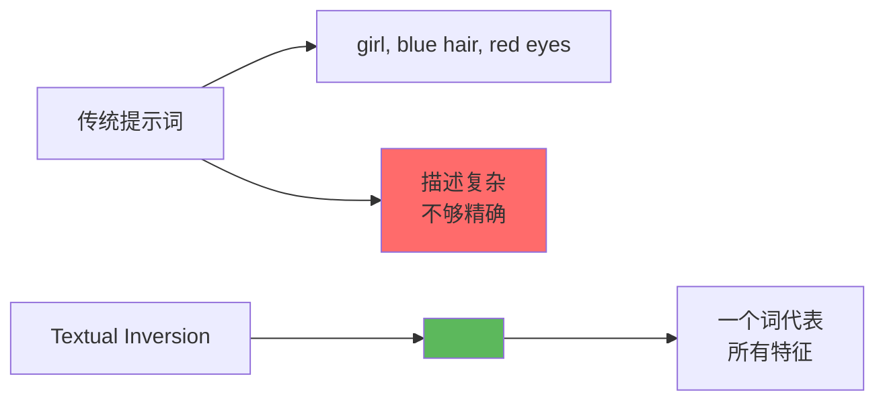
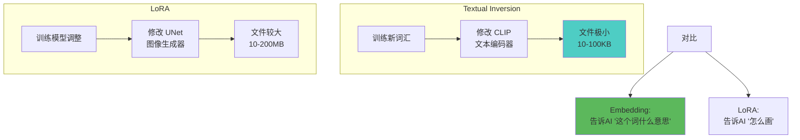
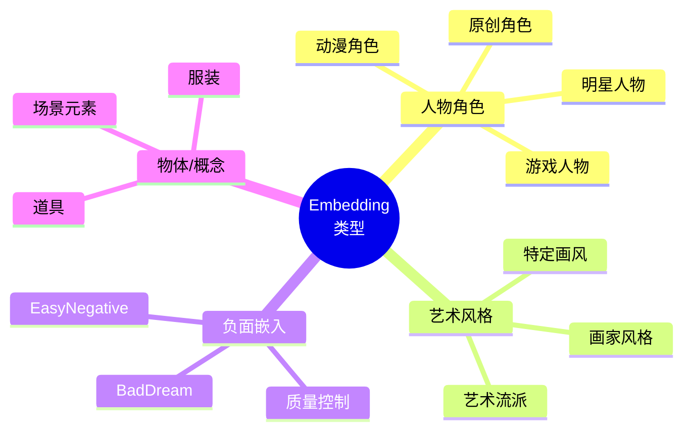
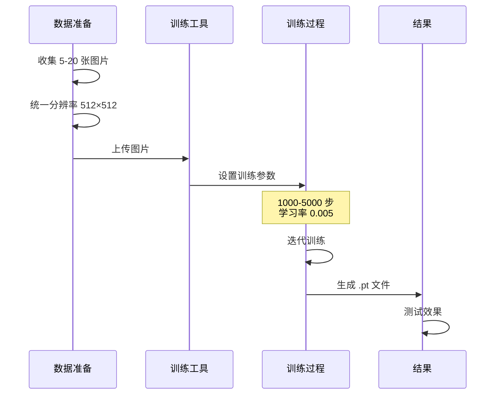
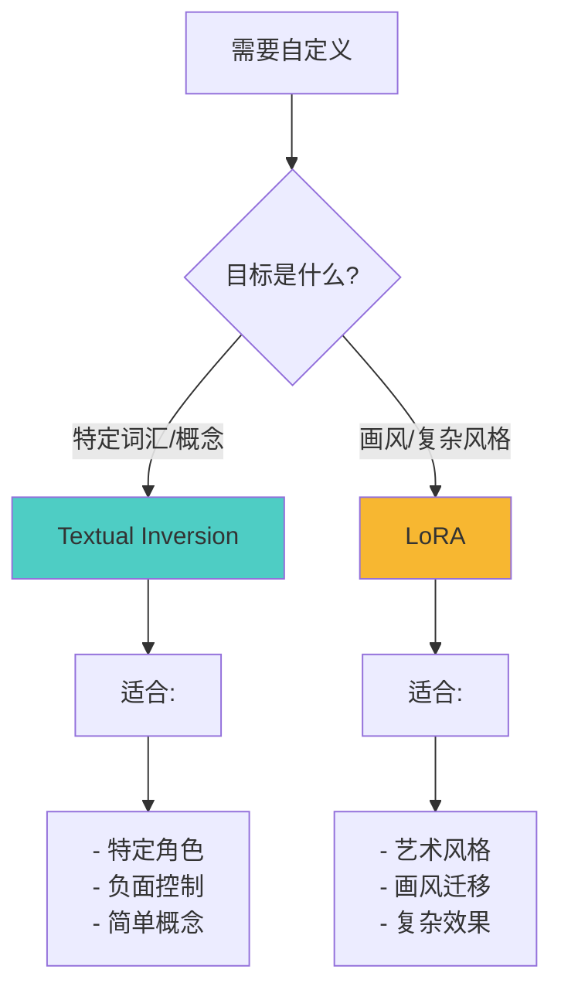
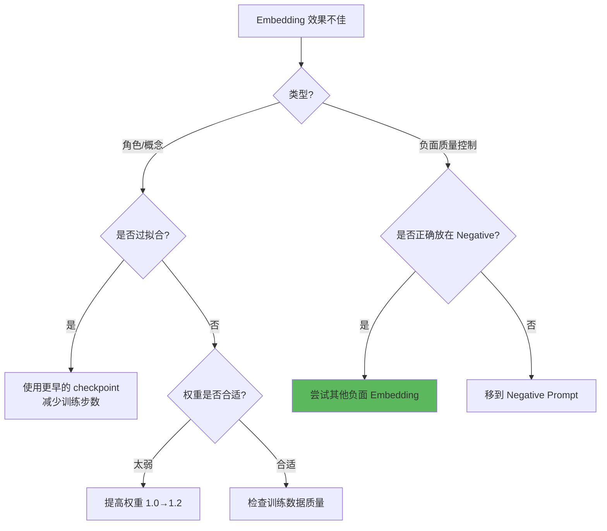

# Textual Inversion 详解 - 自定义概念嵌入

## 🎯 什么是 Textual Inversion？

**Textual Inversion (文本反演)**，也称为 **Embedding (嵌入)**，是一种轻量级的模型定制技术。通过训练一个特殊的"词"来代表特定概念（如某个角色、画风、物体），让 AI 学会你自定义的概念。

### 核心概念



**简单理解：**
- 普通提示词：用多个词描述 → `girl, long white hair, red eyes, maid outfit` 📝
- Embedding：训练一个特殊词 → `<sakura>` 就代表所有特征 ✨
- 使用时：直接输入 `<sakura>` 即可召唤完整概念 🎯

---

## 🔬 工作原理

### Textual Inversion vs LoRA



### 技术细节

```java
// Textual Inversion 原理
目标: 为新概念创建 Token Embedding

训练过程:
  1. 准备 3-20 张图片（特定概念）
  2. 初始化一个新 Token（如 <my-char>）
  3. 训练这个 Token 的 Embedding 向量
  4. 让它能表示图片中的共同特征

使用时:
  输入: <my-char>, anime style, outdoor
  CLIP: 识别 <my-char> → 加载训练的 Embedding
  SD: 生成符合 Embedding 的图像

文件格式:
  .pt (PyTorch) 或 .safetensors
  大小: 通常 5-20KB
  位置: stable-diffusion-webui/embeddings/
```

---

## 📊 Embedding 的类型

### 按用途分类



### 常用 Embedding 推荐

```java
// 1. 负面 Embedding（质量控制）⭐ 推荐
EasyNegative:
  用途: 减少常见缺陷
  用法: 放在 Negative Prompt
  效果: 减少多余手指、畸形等

BadDream / UnrealisticDream:
  用途: 改善写实度
  用法: Negative Prompt
  效果: 减少不真实元素

badhandv4:
  用途: 修复手部问题
  用法: Negative Prompt
  效果: 减少手部畸形

// 2. 风格 Embedding
各种艺术家风格:
  <greg-rutkowski>
  <studio-ghibli-style>
  <makoto-shinkai>

// 3. 角色 Embedding
自训练或社区分享的角色
用法: 直接在 Positive Prompt 使用
```

---

## 🎨 使用方法

### 基础使用

```java
// 步骤1: 下载或训练 Embedding
下载: Civitai、Hugging Face
保存到: stable-diffusion-webui/embeddings/
格式: .pt 或 .safetensors

// 步骤2: 在提示词中使用
Positive Prompt:
  <character-name>, anime style, outdoor, smiling

Negative Prompt:
  <EasyNegative>, <badhandv4>, low quality

// 步骤3: 调整权重（可选）
<character-name:1.2>  // 增强效果
<character-name:0.8>  // 减弱效果
```

---

### 实战案例

**案例1：角色一致性生成**

```java
// 目标: 生成同一角色的不同姿势和场景
Embedding: <sakura-girl> (自训练)

提示词1 - 室内场景:
  <sakura-girl>, sitting at desk, reading book,
  cozy room, warm lighting, anime style

提示词2 - 室外场景:
  <sakura-girl>, standing in park, cherry blossoms,
  spring, sunny day, anime style

提示词3 - 不同动作:
  <sakura-girl>, running, dynamic pose,
  sports outfit, outdoor track

Negative:
  <EasyNegative>, <badhandv4>

优势:
  ✅ 角色特征一致（发色、眼睛、脸型）
  ✅ 仅一个词即可召唤
  ✅ 灵活搭配其他提示词
```

---

**案例2：负面 Embedding 质量控制**

```java
// 不使用负面 Embedding
Negative Prompt:
  low quality, worst quality, bad anatomy,
  bad hands, missing fingers, extra digit,
  fewer digits, cropped, jpeg artifacts

问题: 提示词过长，效果一般

// 使用负面 Embedding
Negative Prompt:
  <EasyNegative>, <badhandv4>

优势:
  ✅ 提示词简洁
  ✅ 效果经过优化
  ✅ 包含大量质量控制规则
  ✅ 社区验证有效
```

---

**案例3：艺术风格应用**

```java
// 使用画家风格 Embedding
Prompt:
  beautiful landscape, mountains and lake,
  <greg-rutkowski>, <studio-ghibli-style>,
  detailed, high quality

参数:
  CFG: 7
  Steps: 30

效果:
  - 结合两种艺术风格
  - 比纯提示词更准确
  - 风格特征更明显
```

---

## 🛠️ 训练自己的 Embedding

### 训练流程



### 数据准备

```java
// 图片要求
数量: 5-20 张（推荐 10-15 张）
质量: 高清、无水印
内容:
  ✅ 包含目标概念的不同角度
  ✅ 不同表情/姿势（角色）
  ✅ 不同场景下的该概念
  ❌ 避免背景过于复杂
  ❌ 避免多个主体混淆

分辨率: 统一为 512×512
  (可用裁剪工具批量处理)

示例 - 训练角色:
  - 正面照片 ×3
  - 侧面照片 ×2
  - 3/4 角度 ×3
  - 不同表情 ×3
  - 全身/半身混合
```

---

### 训练参数配置

```java
// WebUI 训练 Embedding
导航: Train → Create Embedding

参数设置:
  Name: my-character  // Embedding 名称
  Initialization text: girl  // 初始化词（相关词）
  Number of vectors: 4-8  // 向量数（复杂度）
    - 简单概念: 4
    - 复杂角色: 8-16

Training Settings:
  Learning rate: 0.005  // 学习率（关键）
    - 太高: 0.01+ 过拟合
    - 太低: 0.001 训练慢
    - 推荐: 0.005

  Batch size: 1  // 批次大小
  Steps: 3000-5000  // 训练步数
    - 5张图: 3000 步
    - 10张图: 4000 步
    - 20张图: 5000 步

  Gradient clipping: 1.0  // 梯度裁剪
  Save embedding every N steps: 500  // 保存频率
```

---

### 训练技巧

```java
// 1. 监控训练进度
每 500 步测试一次:
  - 使用固定 Seed
  - 相同提示词
  - 观察变化

过拟合迹象:
  ❌ 只能生成训练图
  ❌ 缺少创作空间
  ❌ 无法搭配其他提示词

解决: 减少训练步数

// 2. 最佳停止点
测试不同步数的保存点:
  - embedding-1000.pt
  - embedding-2000.pt
  - embedding-3000.pt

选择效果最好的版本

// 3. 多概念训练
可同时训练多个 Embedding:
  <char1> - 角色1
  <char2> - 角色2
  <style1> - 风格1

独立训练，独立使用
```

---

## 🎯 Embedding vs LoRA 选择

### 对比分析

| 特性 | Embedding | LoRA |
|------|-----------|------|
| **文件大小** | 5-100KB | 10-200MB |
| **训练数据** | 5-20 张 | 20-100+ 张 |
| **训练时间** | 30分钟-2小时 | 2-8 小时 |
| **控制范围** | 文本理解 | 图像生成 |
| **适用场景** | 特定词汇/概念 | 画风/复杂风格 |
| **权重控制** | 0.8-1.2 | 0.3-1.5 |
| **兼容性** | 极好 | 好 |
| **显存需求** | 极低 | 低 |

---

### 选择建议



---

### 实战选择

```java
// 使用 Embedding 的场景
✅ 创建简单角色代表词
✅ 定义负面质量控制
✅ 少量图片（<20张）
✅ 训练时间有限
✅ 文件大小敏感

示例:
  训练自己的 OC 角色
  训练特定服装概念
  训练负面质量控制词

// 使用 LoRA 的场景
✅ 复杂画风迁移
✅ 艺术家风格学习
✅ 大量训练数据（50+张）
✅ 需要更强控制力

示例:
  吉卜力风格 LoRA
  特定画师风格 LoRA
  复杂机甲设计 LoRA

// 组合使用
Prompt:
  <my-character>, <lora:ghibli-style:0.8>,
  outdoor, forest, soft lighting

效果: Embedding 定义角色 + LoRA 提供风格
```

---

## 💡 高级技巧

### 1. 多 Embedding 叠加

```java
// 组合使用多个 Embedding
Positive:
  <character-A>, <artist-style-1>,
  <concept-B>, detailed, high quality

Negative:
  <EasyNegative>, <badhandv4>, <badquality>

注意:
  - 正面不超过 3-4 个
  - 负面可以多个叠加
  - 观察是否冲突
```

---

### 2. Embedding 权重调节

```java
// 语法: <name:weight>
<character:1.2>    // 增强 20%
<character:0.8>    // 减弱 20%
<character:1.5>    // 增强 50%（可能过度）

实战:
  <sakura:1.1>, <style:0.9>
  → 角色特征更明显，风格稍减弱

调试建议:
  从 1.0 开始
  以 0.1 为步长调整
  找到最佳权重
```

---

### 3. 渐进训练

```java
// 策略: 分阶段训练
阶段1 - 粗训练:
  Steps: 2000
  Learning rate: 0.005
  目标: 学习基本特征

阶段2 - 细调:
  继续训练相同 Embedding
  Steps: +1000
  Learning rate: 0.002 (降低)
  目标: 优化细节

优势:
  - 避免一次性过拟合
  - 可随时停止
  - 更灵活控制
```

---

### 4. 负面 Embedding 组合策略

```java
// 通用质量控制（推荐组合）
Negative Prompt:
  <EasyNegative>, <badhandv4>,
  low quality, worst quality

// 写实摄影专用
Negative Prompt:
  <EasyNegative>, <badhandv4>,
  <UnrealisticDream>, <BadDream>,
  illustration, 3d render

// 动漫插画专用
Negative Prompt:
  <EasyNegative>, <badhandv4>,
  realistic, photo, 3d

效果: 根据场景优化组合
```

---

## ⚠️ 常见问题

### 问题诊断表

| 问题 | 可能原因 | 解决方案 |
|------|----------|----------|
| **Embedding 不起作用** | 未加载或路径错误 | 检查 embeddings 目录 |
| **效果太弱** | 权重太低 | 提高权重 `<name:1.2>` |
| **完全复制训练图** | 过拟合 | 减少训练步数 |
| **无法搭配其他词** | 训练数据单一 | 增加多样性图片 |
| **文件损坏** | 训练中断 | 使用中间保存点 |
| **冲突** | 多 Embedding 冲突 | 减少数量或调整权重 |

---

### 调试流程



---

## 📚 资源与工具

### Embedding 下载站

```java
// 1. Civitai (https://civitai.com)
分类: Textual Inversion
包含: 角色、风格、负面等
评分: 用户评分参考

// 2. Hugging Face
官方 Textual Inversion 库
稳定可靠

// 3. LiblibAI (国内)
中文社区
访问友好
```

---

### 训练工具

```java
// WebUI 内置
Train → Create Embedding
Train → Train
简单直观，适合新手

// Standalone 工具
Textual Inversion Training Script (官方)
更多自定义选项

// 辅助工具
图片预处理: Birme (批量裁剪调整)
标签生成: BLIP、DeepDanbooru (自动标注)
```

---

## 🎯 最佳实践

### 新手推荐流程

```java
// 第1步: 使用现成的负面 Embedding
下载: EasyNegative, badhandv4
放置: embeddings/
使用: Negative Prompt 中直接添加

// 第2步: 尝试社区 Embedding
浏览 Civitai 下载感兴趣的 Embedding
测试效果

// 第3步: 训练自己的 Embedding（可选）
准备: 10 张左右图片
训练: 3000-4000 步
测试: 不同权重和组合

// 第4步: 建立个人 Embedding 库
整理分类常用 Embedding
记录权重配置
```

---

### Embedding 使用口诀

```
负面 Embedding 必须用
放在 Negative 很重要
角色 Embedding 一个词
风格叠加看效果

权重调节从 1.0 起
效果不够往上提
过拟合了往下降
找到平衡最重要
```

---

## 🔗 相关文章

- [CLIP 详解](./03-CLIP详解-文本理解的核心.md) - Embedding 修改的就是 CLIP
- [LoRA 详解](./08-LoRA详解-风格迁移的利器.md) - Embedding vs LoRA
- [Checkpoint 详解](./01-Checkpoint详解-SD的核心模型.md) - 模型架构理解

---

## 🎓 总结

**Textual Inversion 核心价值：**

1. **轻量灵活**: 文件极小（KB级），易于分享
2. **概念定义**: 用一个词代表复杂概念
3. **质量控制**: 负面 Embedding 是质量保证
4. **简单易用**: 直接在提示词中使用
5. **互补 LoRA**: 组合使用威力更大

**实用建议：**
```java
// 基础配置
Negative Prompt: <EasyNegative>, <badhandv4>
// 这是最基础但最有效的质量提升

// 进阶创作
自己训练角色 Embedding
+ LoRA 提供风格
= 完全自定义的创作体系
```

---

**Embedding 虽小，作用巨大！** ✨

一个小小的文件，让你的提示词更简洁、质量更稳定、创作更高效！特别是负面 Embedding，堪称"新手友好神器"！
