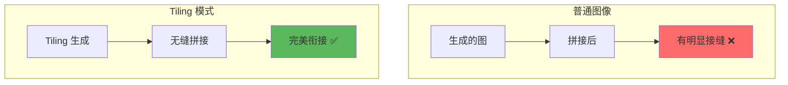
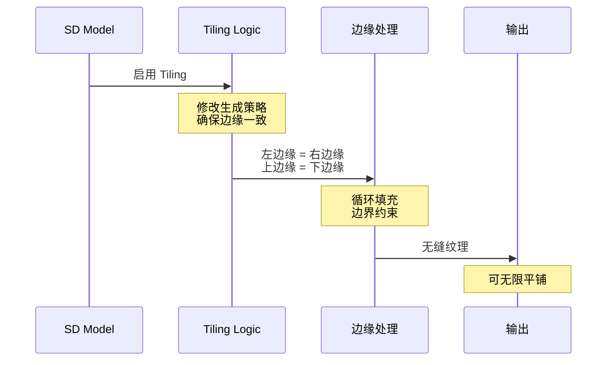
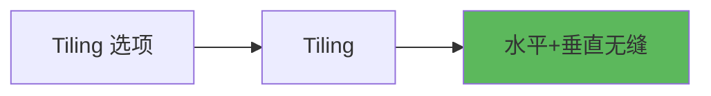
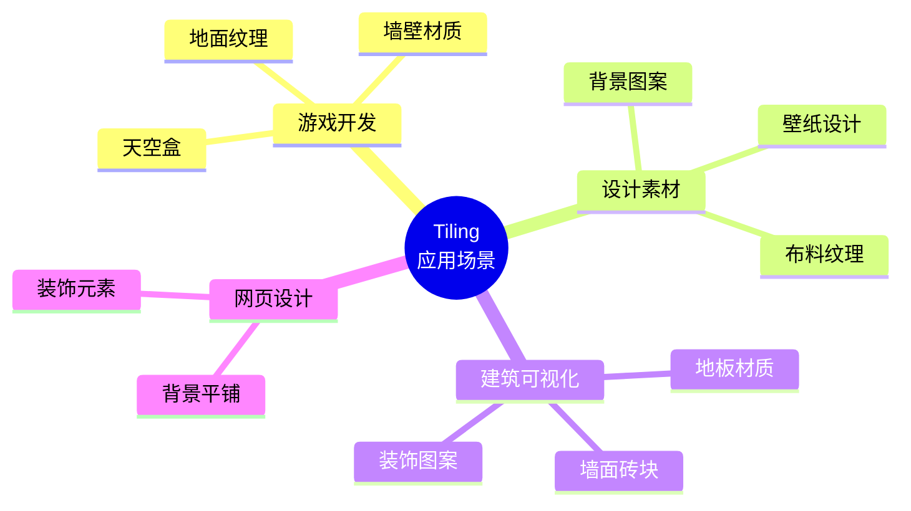
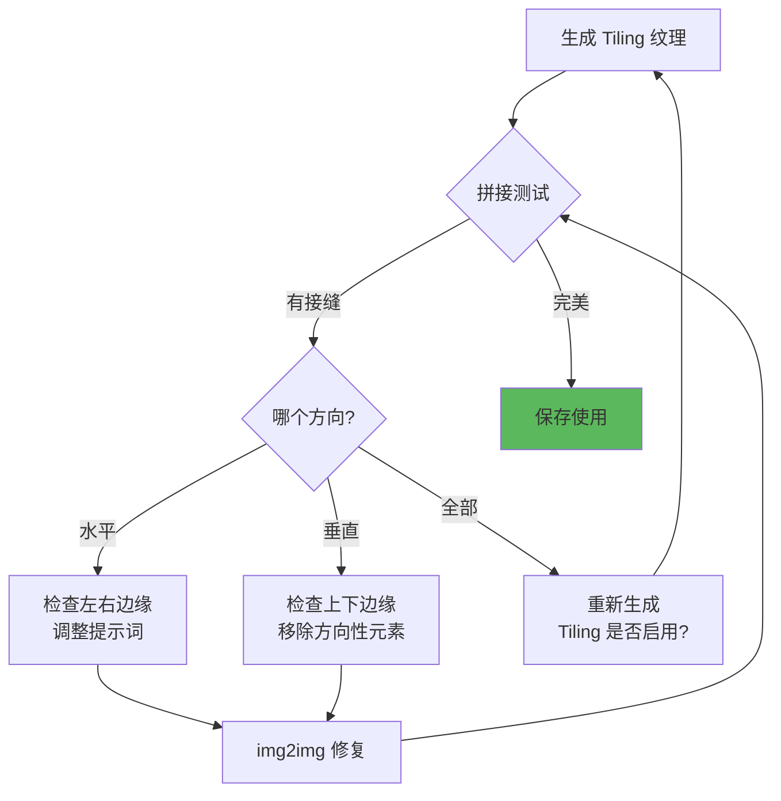

# Tiling 详解 - 无缝纹理生成

## 🎯 什么是 Tiling？

**Tiling (平铺模式)** 是 Stable Diffusion 的一个特殊功能，能生成可以无缝拼接的纹理图案。启用后，生成的图像在水平和垂直方向都能完美衔接，没有明显接缝。

### 核心概念



**简单理解：**
- 普通生成：拼接时有接缝 🧩❌
- Tiling 模式：可以无限平铺 🔲✅
- 用途：游戏纹理、背景图案、墙纸设计 🎨

---

## 🔬 工作原理

### 技术实现



### 数学原理

```java
// Tiling 的实现逻辑
普通生成:
  图像 [0, W] × [0, H]
  边界: 独立随机

Tiling 生成:
  图像 [0, W] × [0, H]
  约束条件:
    Image[0, y] = Image[W, y]  // 左 = 右
    Image[x, 0] = Image[x, H]  // 上 = 下

  实现方式:
    - 将图像视为环面 (Torus)
    - 边界条件周期性
    - 卷积操作循环填充
```

---

## 📊 Tiling 模式类型

### WebUI 中的 Tiling 选项



**注意：** SD WebUI 通常只有一个简单的 **Tiling** 复选框，同时启用水平和垂直平铺。

---

## 🎨 适用场景

### 场景分类



---

### 实战应用

**场景1：游戏地面纹理**

```java
// 目标: 创建草地纹理
Tiling: ☑ 启用

Prompt:
  grass texture, top-down view, seamless,
  green, natural, detailed, tileable,
  game texture, 4k

Negative:
  人物, 天空, 房屋, 树木, shadows, lighting

参数:
  Resolution: 512×512 (正方形)
  CFG: 7
  Steps: 30
  Sampler: DPM++ 2M Karras

技巧:
  ✅ 使用 "seamless", "tileable" 提示词
  ✅ 避免方向性强的元素（如影子）
  ✅ top-down view 俯视角度
  ✅ 测试拼接效果
```

---

**场景2：墙纸设计**

```java
// 目标: 装饰性墙纸图案
Tiling: ☑ 启用

Prompt:
  floral pattern, seamless wallpaper design,
  pastel colors, elegant, vintage style,
  tileable, decorative, high quality

Negative:
  realistic, photo, 3d, shadows

参数:
  Resolution: 512×512
  CFG: 8
  Steps: 35

输出用途:
  - 打印墙纸
  - 数字背景
  - 包装纸设计
```

---

**场景3：游戏天空盒**

```java
// 目标: 可平铺的天空纹理
Tiling: ☑ 启用

Prompt:
  sky texture, clouds, seamless,
  blue sky, daytime, tileable,
  game skybox, 360 degree

Negative:
  ground, horizon, sun, moon, birds

参数:
  Resolution: 1024×512 (横向)
  CFG: 6
  Steps: 30

注意:
  - 避免有明确方向的元素
  - 云朵分布要均匀
  - 测试水平拼接
```

---

**场景4：布料纹理**

```java
// 目标: 织物材质
Tiling: ☑ 启用

Prompt:
  fabric texture, cotton, seamless,
  detailed weave pattern, close-up,
  high resolution, tileable, material

Negative:
  不相关物体

参数:
  Resolution: 512×512
  Hires.fix: ☑
  Upscale by: 2.0

用途:
  - 3D建模贴图
  - 产品渲染
  - 材质库
```

---

## 🔧 使用技巧

### 技巧1：提示词优化

```java
// 必加关键词
seamless         // 无缝
tileable         // 可平铺
pattern          // 图案
texture          // 纹理
repeating        // 重复

// 视角关键词
top-down view    // 俯视（地面）
close-up         // 特写（材质）
flat texture     // 平面纹理

// 避免的元素
❌ shadows (阴影 - 有方向性)
❌ lighting gradient (光照渐变)
❌ perspective (透视)
❌ centered object (居中物体)
❌ horizon (地平线)
```

---

### 技巧2：分辨率选择

```java
// 正方形纹理（最推荐）
512×512   // 标准，兼容性好
1024×1024 // 高清，需要 Hires.fix
256×256   // 小纹理，快速测试

优势:
  - 四个方向都可平铺
  - 旋转后仍可用
  - 最大灵活性

// 长方形纹理
512×256   // 横向平铺
256×512   // 纵向平铺

适用:
  - 特定平铺方向
  - 边界装饰
```

---

### 技巧3：测试拼接效果

```java
// 方法1: Photoshop/GIMP
1. 打开生成的图像
2. 复制图层
3. 水平/垂直平移 50%
4. 观察接缝是否明显

// 方法2: 在线工具
网站: Seamless Texture Checker
上传图片即可预览平铺效果

// 方法3: WebUI 内测试
使用 img2img
  - 上传 Tiling 图像
  - 启用 Tiling
  - Denoising: 0.3
  - 修复接缝处细节
```

---

### 技巧4：后期微调

```java
// 如果接缝仍不完美
工具: Clone Stamp (仿制图章)
操作:
  1. 在接缝处手动修复
  2. 复制无缝区域
  3. 覆盖有问题的边缘

// 使用 Inpaint
区域: 边缘 5-10% 范围
Tiling: ☑ 保持启用
Denoising: 0.4-0.5
目标: 优化接缝过渡
```

---

## 🚀 进阶应用

### 1. Tiling + ControlNet

```java
// 基于参考纹理生成无缝版本
ControlNet: Tile
Preprocessor: tile_resample
Tiling: ☑ 启用

流程:
  1. 上传有接缝的纹理
  2. 启用 ControlNet Tile
  3. 启用 Tiling 模式
  4. 生成无缝版本

效果:
  - 保留原纹理风格
  - 转换为无缝平铺
  - 质量提升
```

---

### 2. 多层纹理生成

```java
// 阶段1: 生成基础纹理
Tiling: ☑
Prompt: base stone texture, seamless
→ base-texture.png

// 阶段2: 添加细节层
使用 img2img
输入: base-texture.png
Tiling: ☑ 必须保持
Denoising: 0.3
Prompt: add moss details, weathering
→ detailed-texture.png

优势:
  - 层次丰富
  - 可控性强
  - 保持无缝
```

---

### 3. 颜色变体生成

```java
// 基于一个纹理生成多个配色
基础纹理:
  Tiling: ☑
  Prompt: brick wall, seamless, red bricks
  Seed: 12345678 (固定)

变体1 - 灰色砖:
  Seed: 12345678 (相同)
  Prompt: brick wall, seamless, gray bricks

变体2 - 白色砖:
  Seed: 12345678
  Prompt: brick wall, seamless, white bricks

效果: 保持纹理结构，仅改变颜色
```

---

### 4. 高分辨率纹理工作流

```java
// 目标: 4K 无缝纹理
阶段1 - 基础生成:
  Resolution: 512×512
  Tiling: ☑
  生成基础纹理

阶段2 - 高清放大:
  Hires.fix: ☑
  Upscaler: R-ESRGAN 4x+
  Upscale by: 4.0
  Tiling: ☑ 保持启用
  Denoising: 0.4
  → 2048×2048

阶段3 - 进一步放大 (可选):
  ControlNet Tile: ☑
  Tiling: ☑
  → 4096×4096

关键: 每个阶段都保持 Tiling 启用
```

---

## ⚠️ 常见问题

### 问题诊断表

| 问题 | 可能原因 | 解决方案 |
|------|----------|----------|
| **仍有接缝** | Tiling 未正确启用 | 检查复选框状态 |
| **图案不均匀** | 提示词包含方向性元素 | 避免 shadows, lighting |
| **边缘模糊** | Denoising 太高 | 降低到 0.3-0.5 |
| **中心有明显物体** | 提示词导致 | 避免 centered, main subject |
| **颜色渐变** | 光照效果 | 使用 flat lighting |
| **旋转后有接缝** | 非正方形纹理 | 使用 512×512 |

---

### 调试流程



---

## 💡 创作建议

### 新手推荐配置

```java
// 第一次尝试 Tiling
Prompt:
  simple grass texture, seamless, tileable,
  top-down view, green, natural

Negative:
  shadows, lighting, 3d, realistic

Settings:
  Resolution: 512×512
  Tiling: ☑
  CFG: 7
  Steps: 25
  Sampler: DPM++ 2M Karras

测试: Photoshop 平移 50% 检查接缝
```

---

### 提示词模板

```java
// 地面纹理模板
[材质类型] texture, seamless, tileable,
top-down view, [颜色], [风格],
high quality, detailed, game texture

示例:
  sand texture, seamless, tileable,
  top-down view, beige, natural,
  high quality, detailed, game texture

// 墙面纹理模板
[墙面材质] wall, seamless pattern,
tileable, [风格], flat texture,
no shadows, uniform lighting

示例:
  brick wall, seamless pattern,
  tileable, rustic, flat texture,
  no shadows, uniform lighting

// 装饰图案模板
[图案类型] pattern, seamless, tileable,
[风格] style, [颜色 scheme],
repeating, decorative, wallpaper design

示例:
  floral pattern, seamless, tileable,
  victorian style, pastel colors,
  repeating, decorative, wallpaper design
```

---

## 📚 应用案例

### 案例1：游戏资源包

```java
// 目标: 创建地牢游戏纹理集
纹理1 - 石头地面:
  Tiling: ☑
  Prompt: stone floor texture, seamless, medieval,
          gray stones, top-down, game texture

纹理2 - 砖墙:
  Tiling: ☑
  Prompt: brick wall texture, seamless, castle,
          old bricks, flat texture

纹理3 - 木板:
  Tiling: ☑
  Prompt: wooden planks texture, seamless,
          aged wood, tileable, game texture

输出: 统一风格的纹理资源包
```

---

### 案例2：室内设计可视化

```java
// 目标: 地板材质库
大理石地板:
  Tiling: ☑
  Prompt: marble floor texture, seamless, white,
          luxury, high resolution, tileable

木地板:
  Tiling: ☑
  Prompt: hardwood floor texture, seamless, oak,
          natural wood grain, tileable

瓷砖:
  Tiling: ☑
  Prompt: ceramic tile texture, seamless, white,
          bathroom tiles, clean, tileable

用途: 3D 渲染、效果图制作
```

---

## 🔗 相关文章

- [ControlNet 详解](./11-ControlNet详解-精准控制的艺术.md) - Tile ControlNet 应用
- [Hires.fix 详解](./09-HiresFix详解-高清放大的艺术.md) - 高清纹理生成
- [分辨率设置](./12-分辨率与批次设置-基础参数优化.md) - 纹理分辨率选择

---

## 🎯 总结

**Tiling 核心要点：**

1. **用途明确**: 游戏纹理、背景图案、材质库
2. **正方形优先**: 512×512 兼容性最好
3. **提示词关键**: seamless, tileable 必加
4. **避免方向性**: 无阴影、无透视、无渐变
5. **测试很重要**: 生成后必须拼接测试

**实用口诀：**
```
Tiling 模式要勾选
提示词里加 seamless
正方形纹理最稳妥
避免阴影和透视

生成完了要测试
水平垂直都平移
接缝明显重新来
完美无缝才满意
```

---

**Tiling 让 AI 绘画走向实用！** 🎨

不只是艺术创作，更是游戏开发、设计制作的得力工具。掌握无缝纹理生成，你的作品就能应用到实际项目中！
