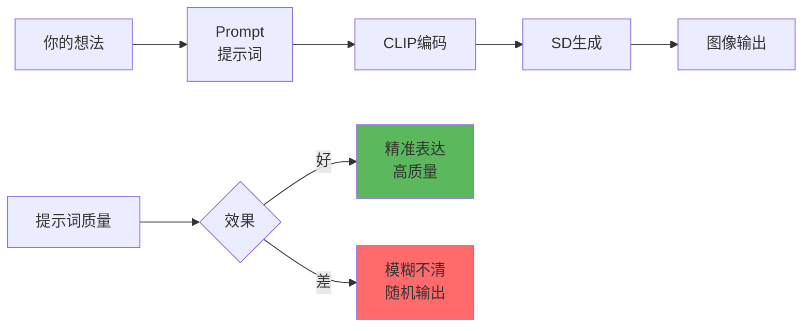
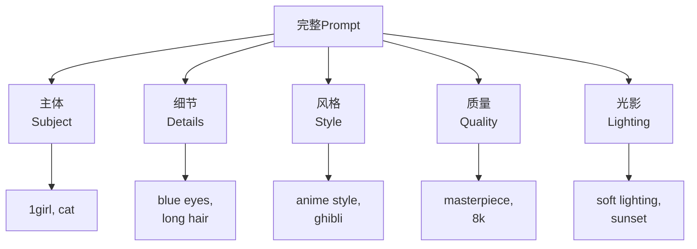

# Prompt 详解 - 提示词工程的艺术

## 🎯 什么是 Prompt？

**Prompt (提示词)** 是你告诉 AI "我想要什么"的文本描述。好的提示词是 AI 绘画成功的基石——它决定了画面的内容、风格、质量和氛围。

### 核心概念



**提示词的作用：**
- 🎨 **内容控制**：画什么（人物、场景、物体）
- 🖼️ **风格定义**：怎么画（写实、动漫、油画）
- ✨ **质量控制**：画得多好（细节、分辨率、光影）
- ❌ **负面排除**：不要什么（缺陷、不想要的元素）

---

## 📐 提示词结构

### 标准格式

```java
// Positive Prompt（正面提示词）
[主体] + [细节] + [质量词] + [风格] + [光影/氛围]

// Negative Prompt（负面提示词）
[常见缺陷] + [不想要的风格] + [质量限制]
```

### 提示词模板



---

## 🎨 提示词组成要素

### 1. 主体（Subject）- 核心元素

```java
// 人物类
1girl           // 一个女孩
1boy            // 一个男孩
2girls          // 两个女孩
solo            // 单人
multiple girls  // 多个女孩

// 场景类
landscape       // 风景
cityscape       // 城市景观
interior        // 室内
outdoor         // 室外

// 物体类
cat             // 猫
flower          // 花
building        // 建筑
```

---

### 2. 细节（Details）- 描述特征

```java
// 人物细节
long hair       // 长发
blue eyes       // 蓝眼睛
white dress     // 白色连衣裙
smiling         // 微笑
standing        // 站立
looking at viewer // 看向观众

// 场景细节
cherry blossoms  // 樱花
mountains       // 山脉
sunset          // 日落
cloudy sky      // 多云天空

// 构图细节
full body       // 全身
upper body      // 上半身
close-up        // 特写
portrait        // 肖像
```

---

### 3. 风格（Style）- 艺术表现

```java
// 艺术风格
anime style     // 动漫风格
oil painting    // 油画
watercolor      // 水彩
photorealistic  // 照片级写实
concept art     // 概念艺术
studio ghibli   // 吉卜力风格

// 艺术家风格
by greg rutkowski    // 格雷格·鲁特科夫斯基风格
by makoto shinkai    // 新海诚风格
trending on artstation // Artstation热门

// 渲染风格
cel shading     // 赛璐珞阴影
volumetric lighting // 体积光
cinematic       // 电影感
```

---

### 4. 质量词（Quality）- 提升品质

```java
// 通用质量词⭐ 必加
masterpiece          // 杰作
best quality         // 最佳质量
high quality         // 高质量
highly detailed      // 高度细节
ultra detailed       // 超高细节

// 分辨率相关
8k                   // 8K 分辨率
4k uhd               // 4K 超高清
high resolution      // 高分辨率

// 专业级别
professional         // 专业级
official art         // 官方艺术
```

---

### 5. 光影/氛围（Lighting/Atmosphere）

```java
// 光照类型
soft lighting        // 柔和光照
dramatic lighting    // 戏剧性光照
studio lighting      // 摄影棚光照
natural lighting     // 自然光
backlight           // 背光
rim lighting        // 轮廓光

// 时间/天气
golden hour         // 黄金时刻
sunset              // 日落
sunrise             // 日出
night               // 夜晚
rainy               // 雨天

// 氛围
warm colors         // 暖色调
cold colors         // 冷色调
vibrant colors      // 鲜艳色彩
moody atmosphere    // 阴郁氛围
```

---

## 🔧 提示词语法技巧

### 1. 权重控制

```java
// 语法: (word:weight)
权重范围: 0.5 - 1.5

// 增强词权重
(blue eyes:1.3)      // 强调蓝眼睛
(detailed:1.2)       // 强调细节

// 减弱词权重
(background:0.8)     // 弱化背景
(simple:0.7)         // 降低简单性

// 实战示例
(1girl:1.1), (beautiful face:1.2), long hair,
(anime style:1.3), (background:0.7)

效果: 强调女孩和动漫风格，弱化背景
```

---

### 2. 括号叠加

```java
// 多层括号 = 权重叠加
(word)      // weight = 1.1
((word))    // weight = 1.21  (1.1×1.1)
(((word)))  // weight = 1.331 (1.1×1.1×1.1)

[word]      // weight = 0.9 (减弱)

// 示例
((masterpiece))      // 强调杰作 1.21倍
[background]         // 弱化背景 0.9倍

注意: 不建议超过3层，过度强调会导致画面扭曲
```

---

### 3. 提示词混合（AND）

```java
// 语法: prompt1 AND prompt2
用途: 组合多个概念

示例:
1girl wearing red dress AND blue sky with clouds AND
golden hour lighting

效果: 三个概念同时存在
```

---

### 4. 提示词交替（|）

```java
// 语法: [word1|word2|word3]
效果: 每步采样在选项间切换

示例:
1girl, [blue|red|green] hair

效果:
  - 头发颜色在蓝、红、绿间变化
  - 产生渐变或混合效果

用途: 创造独特的混合风格
```

---

### 5. 阶段性提示词（FROM-TO）

```java
// 语法: [word1:word2:step]
从第 X 步开始，word1 变为 word2

示例:
[cat:dog:0.5]

效果:
  - 前 50% 步数: 生成猫
  - 后 50% 步数: 转变为狗
  - 结果: 猫+狗混合特征

用途: 创意变体生成
```

---

## 📝 实战提示词模板

### 模板1：人物肖像（动漫）

```java
Positive:
  masterpiece, best quality, highly detailed,
  1girl, beautiful face, detailed eyes, long flowing hair,
  (anime style:1.3), cel shading,
  smiling, looking at viewer,
  upper body, portrait,
  soft lighting, warm colors,
  outdoor, cherry blossoms background

Negative:
  (worst quality:1.4), (low quality:1.4),
  ugly, blurry, bad anatomy, bad hands,
  extra fingers, fewer digits,
  text, watermark
```

---

### 模板2：风景场景（写实）

```java
Positive:
  masterpiece, best quality, 8k uhd, photorealistic,
  beautiful landscape, mountains and lake,
  dramatic lighting, golden hour,
  volumetric lighting, god rays,
  detailed clouds, vibrant colors,
  wide shot, cinematic composition,
  (by greg rutkowski:1.2), trending on artstation

Negative:
  ugly, blurry, low quality, jpeg artifacts,
  cartoon, anime, illustration,
  people, animals,
  text, signature
```

---

### 模板3：产品设计

```java
Positive:
  product photography, professional lighting,
  [产品名称], white background,
  studio lighting, centered,
  highly detailed, 8k, commercial photography,
  sharp focus, clean,
  photorealistic, ultra realistic

Negative:
  blurry, low quality, cluttered background,
  shadows, people, text,
  illustration, artistic,
  poor lighting
```

---

### 模板4：概念艺术

```java
Positive:
  concept art, highly detailed, epic scene,
  [主题描述],
  dramatic composition, cinematic lighting,
  vibrant colors, detailed environment,
  matte painting, fantasy art,
  (by greg rutkowski:1.2), artstation quality,
  8k resolution

Negative:
  low quality, blurry, simple,
  minimalist, flat,
  photorealistic, realistic,
  text, watermark
```

---

## 🎯 不同场景的提示词策略

### 场景1：角色设计（保持一致性）

```java
// 挑战: 生成同一角色的多个姿势
策略: 详细描述固定特征

基础 Prompt:
  1girl, [角色名] <可选 Embedding>,
  (blue eyes:1.2), (long white hair:1.2),
  (red ribbon in hair:1.1),
  (school uniform:1.1), white shirt, red skirt

变体1 - 站立:
  基础 Prompt + standing, full body, outdoor

变体2 - 坐姿:
  基础 Prompt + sitting at desk, indoor, classroom

变体3 - 动作:
  基础 Prompt + running, dynamic pose, outdoors

技巧:
  ✅ 固定特征用高权重 (1.2)
  ✅ 使用相同 Seed 增加一致性
  ✅ 配合 LoRA 或 Embedding
```

---

### 场景2：风格迁移

```java
// 目标: 将照片转为动漫风格
img2img 模式:
  Denoising: 0.6

Prompt:
  anime style, (ghibli style:1.2),
  vibrant colors, cel shading,
  soft lines, beautiful,
  high quality, detailed

Negative:
  realistic, photo, 3d render,
  blurry, low quality

配合:
  - ControlNet (保持构图)
  - LoRA (强化风格)
  - Clip Skip = 2
```

---

### 场景3：氛围营造

```java
// 目标: 特定情绪/氛围
温馨氛围:
  warm lighting, cozy, comfortable,
  soft colors, pastel colors,
  peaceful, calm, serene

恐怖氛围:
  dark, ominous, creepy,
  horror atmosphere, fog,
  dramatic shadows, cold colors,
  abandoned, eerie

科幻氛围:
  cyberpunk, neon lights, futuristic,
  high-tech, holographic,
  sci-fi, technology,
  glowing elements

奇幻氛围:
  magical, fantasy, mystical,
  glowing particles, ethereal,
  enchanted, fairy tale,
  soft magical lighting
```

---

## 💡 高级技巧

### 1. Token 限制与优化

```java
// CLIP Token 限制: 77 tokens
查看 Token 数: Settings → Show token count

优化策略:
  ❌ extremely beautiful gorgeous amazing girl
  ✅ beautiful girl (4个词 → 2个词)

  ❌ highly detailed, ultra detailed, extremely detailed
  ✅ highly detailed (去重)

  使用逗号分隔 = 1 token
  过长提示词会被截断 ⚠️
```

---

### 2. 提示词顺序影响

```java
// CLIP 更重视前面的词
重要的词放前面:

❌ 低效排序:
  detailed, high quality, beautiful, 1girl, anime style

✅ 高效排序:
  1girl, anime style, beautiful,
  detailed, high quality

规则:
  1. 主体（1girl, landscape）
  2. 核心风格（anime style）
  3. 重要特征（blue eyes）
  4. 质量词（detailed）
```

---

### 3. 负面提示词策略

```java
// 通用负面词（写实）
(worst quality:1.4), (low quality:1.4),
ugly, blurry, bad anatomy,
bad hands, extra fingers, fewer digits,
jpeg artifacts, signature, watermark,
username, text

// 通用负面词（动漫）
(worst quality:1.4), (low quality:1.4),
ugly, blurry, bad anatomy,
(bad hands:1.2), (badhandv4:1.1),
extra fingers, missing fingers,
poorly drawn, mutation

// 使用 Embedding（推荐）⭐
<EasyNegative>, <badhandv4>,
(low quality:1.2)

优势: 更简洁、效果更好
```

---

### 4. 动态提示词（X/Y/Z Plot）

```java
// 工具: Scripts → X/Y/Z Plot
用途: 批量测试提示词变体

配置示例:
  X axis: Prompt S/R (提示词替换)
  X values:
    blue hair, red hair, green hair

  Y axis: CFG Scale
  Y values: 6, 7, 8, 9

  生成: 3×4 = 12 张图
  快速对比不同头发颜色在不同 CFG 下的效果
```

---

### 5. 分层描述法

```java
// 策略: 从大到小描述
层次1 - 整体:
  landscape, mountains and lake, sunset

层次2 - 中景:
  cherry trees on the shore, small boats

层次3 - 细节:
  detailed clouds, water reflections,
  warm golden lighting

完整 Prompt:
  landscape, mountains and lake, sunset,
  cherry trees on the shore, small boats,
  detailed clouds, water reflections,
  warm golden lighting,
  highly detailed, 8k, cinematic

效果: 构图清晰、层次分明
```

---

## ⚠️ 常见错误

### 错误对照表

| 错误 | 问题 | 正确做法 |
|------|------|----------|
| **过度堆砌质量词** | detailed, extremely detailed, ultra detailed, highly detailed | 选1-2个即可 |
| **矛盾提示词** | realistic AND anime style | 明确选择一种风格 |
| **过长提示词** | 超过77 tokens | 精简或分段 |
| **忽略负面词** | 不写 Negative | 至少加基础负面词 |
| **无主体** | beautiful, detailed, high quality | 先写主体（1girl, landscape） |
| **权重滥用** | (word:2.5) | 权重不超过 1.5 |

---

## 📚 提示词资源

### 在线工具

```java
// 1. Prompt生成器
Promptomania: 可视化提示词构建
Lexica Art: 提示词搜索引擎（查看他人作品的提示词）
PromptHero: 社区提示词分享

// 2. 提示词美化
ChatGPT/Claude: 优化你的描述为 SD 提示词
Prompt Generator: 自动生成提示词

// 3. Tag 数据库
Danbooru Tags: 动漫角色、服装标签
E621 Tags: 详细特征标签
```

---

### 学习资源

```java
// 社区平台
Civitai: 查看图片的提示词
Artstation: 艺术家风格参考
Pixiv: 动漫风格参考

// 学习方法
1. 找喜欢的图片
2. 查看其提示词
3. 分析结构和关键词
4. 修改测试自己的版本
```

---

## 🎯 最佳实践

### 新手推荐流程

```java
// 第1步: 使用模板
从本文档的模板开始
根据需求微调

// 第2步: 逐步添加
先写主体 → 测试
加细节 → 测试
加质量词 → 测试
加风格 → 最终

// 第3步: 建立个人库
保存成功的提示词组合
分类整理（人物、风景、产品等）

// 第4步: 持续学习
浏览 Civitai 学习他人提示词
实验新组合
记录效果好的搭配
```

---

### 提示词检查清单

```java
✅ 写完提示词后检查:
  1. [ ] 是否有明确主体？
  2. [ ] 风格是否清晰？
  3. [ ] 是否包含质量词？
  4. [ ] Token 是否超限（<77）？
  5. [ ] 是否有矛盾词？
  6. [ ] Negative 是否完整？
  7. [ ] 重要词是否加权重？
  8. [ ] 是否使用 Embedding？
```

---

## 🎓 进阶：提示词心法

### 描述性 vs 指令性

```java
// 描述性（推荐）✅
a beautiful girl standing in the forest,
sunlight filtering through trees,
peaceful atmosphere

// 指令性（不推荐）❌
make a girl beautiful,
put her in forest,
add sunlight

SD 更擅长理解描述性语言
```

---

### 具体 vs 抽象

```java
// 具体（更可控）
long white hair, blue eyes, red dress,
standing, smiling

// 抽象（更随机）
beautiful girl, nice outfit,
good pose

具体描述 → 可控性强
抽象描述 → 创意空间大

根据需求选择平衡点
```

---

## 🔗 相关文章

- [CLIP 详解](./03-CLIP详解-文本理解的核心.md) - 提示词如何被理解
- [CFG 详解](./06-CFG详解-提示词引导强度.md) - 提示词影响强度
- [Textual Inversion](./14-TextualInversion详解-自定义概念嵌入.md) - 自定义提示词

---

## 🎯 总结

**Prompt 核心要点：**

1. **结构清晰**: 主体 → 细节 → 风格 → 质量
2. **精简有力**: 去除冗余，保留关键
3. **权重适度**: 1.0-1.3 为主，不超 1.5
4. **负面重要**: 至少使用 Embedding
5. **不断测试**: 实践出真知

**万用公式：**
```java
Positive:
  [主体], [关键特征], [风格],
  [质量词], [光影]

Negative:
  <EasyNegative>, <badhandv4>,
  (low quality:1.2), [不要的风格]
```

---

**提示词是AI绘画的语言！** 🎨

掌握提示词工程，你就能精准表达创意，让 AI 成为你的画笔，创造出理想中的作品！
