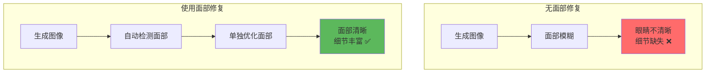
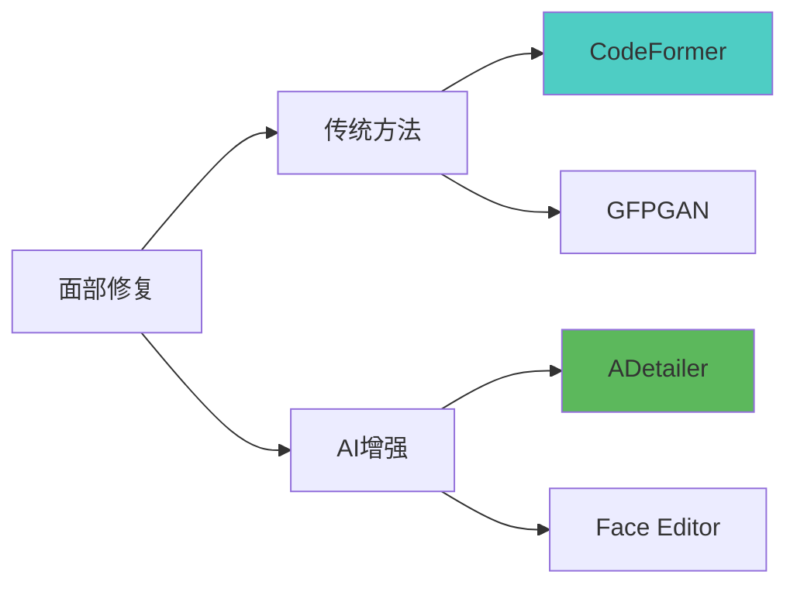
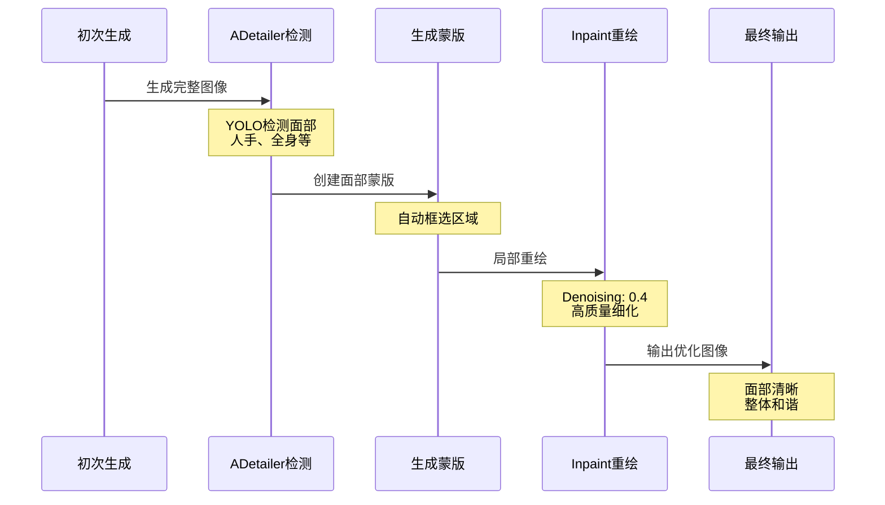
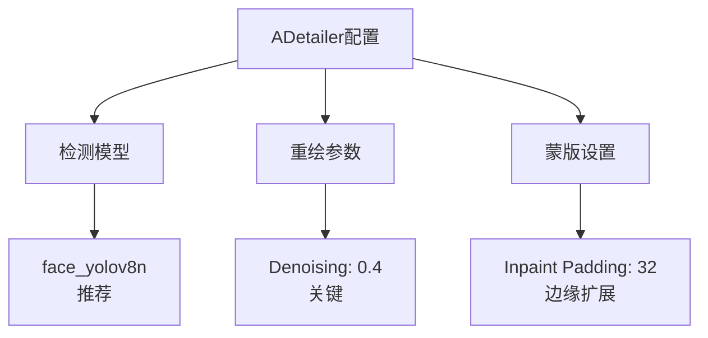
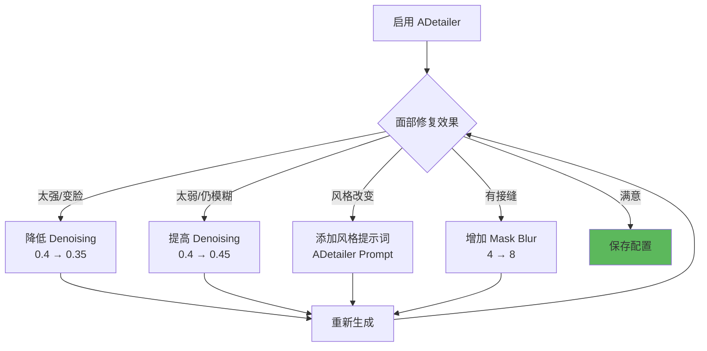

# 面部修复详解 - ADetailer 与 Face Restore

## 🎯 为什么需要面部修复？

Stable Diffusion 生成人物时，常见问题是**面部细节不够清晰**，尤其在：
- 人物较小/远景时
- 多人场景
- 高分辨率下
- 侧脸或特殊角度

**面部修复技术**通过自动检测面部区域，单独进行高质量重绘，显著提升人脸细节。

### 问题对比



---

## 🔬 面部修复技术分类

### 主流方案对比



| 方法 | 类型 | 效果 | 灵活性 | 推荐度 |
|------|------|------|--------|--------|
| **ADetailer** | AI检测+重绘 | ⭐⭐⭐⭐⭐ | ⭐⭐⭐⭐⭐ | ⭐⭐⭐⭐⭐ |
| **CodeFormer** | 传统修复 | ⭐⭐⭐⭐ | ⭐⭐ | ⭐⭐⭐⭐ |
| **GFPGAN** | 传统修复 | ⭐⭐⭐ | ⭐⭐ | ⭐⭐⭐ |
| **Face Editor** | 手动编辑 | ⭐⭐⭐⭐ | ⭐⭐⭐⭐⭐ | ⭐⭐⭐ |

---

## 🎨 ADetailer 详解（推荐方案）

### 什么是 ADetailer？

**ADetailer (After Detailer)** 是最强大的面部修复插件，通过 YOLO 模型自动检测面部，然后使用 Inpaint 技术单独重绘面部区域。

### 工作流程



---

### 安装 ADetailer

```java
// WebUI 插件安装
1. Extensions → Available → 搜索 "adetailer"
2. 安装 "adetailer" 插件
3. Installed → Apply and restart UI
4. 重启后生成界面出现 ADetailer 面板

// 手动安装
git clone https://github.com/Bing-su/adetailer.git
到 extensions/ 目录
重启 WebUI
```

---

## ⚙️ ADetailer 核心参数

### 基础设置



---

### 1. ADetailer Model（检测模型）

```java
// 常用模型
face_yolov8n.pt          // 面部检测（推荐）⭐
face_yolov8s.pt          // 面部检测（更精确，稍慢）
hand_yolov8n.pt          // 手部检测
person_yolov8n-seg.pt    // 全身检测

// 选择建议
人物肖像: face_yolov8n
全身人像: person_yolov8n-seg
手部特写: hand_yolov8n
多人场景: face_yolov8n (可检测多张脸)
```

---

### 2. Mask Padding（蒙版边缘扩展）

```java
// 参数: Inpaint Padding
范围: 0-256 像素
推荐: 32

作用: 扩大修复区域

示例:
  Padding = 0:  仅修复面部框内
  Padding = 32: 面部框 + 周围32像素
  Padding = 64: 更大范围（包含头发边缘）

调试:
  面部修复不够 → 增加 Padding
  影响周围区域 → 减少 Padding
```

---

### 3. Denoising Strength（重绘强度）

```java
// 最关键参数！
范围: 0.0 - 1.0
推荐: 0.35 - 0.45

效果:
  0.2-0.3: 轻微优化，保留原样
  0.35-0.4: 平衡修复（推荐）✅
  0.45-0.5: 明显改善
  0.55+:   过度修改，可能变脸

实战配置:
  原图质量好: 0.35
  原图质量一般: 0.4
  原图面部崩坏: 0.45-0.5
```

---

### 4. Inpaint Width/Height（重绘分辨率）

```java
// 面部重绘的分辨率
推荐: 512×512

原理:
  检测到的面部区域 → 缩放到指定分辨率 → 重绘 → 缩回原尺寸

配置建议:
  标准: 512×512
  高质量: 768×768 (耗时增加)
  快速: 384×384

注意: 不是最终图分辨率，是面部区域的重绘分辨率
```

---

### 5. Mask Blur（蒙版模糊）

```java
// 蒙版边缘的模糊程度
范围: 0-64
推荐: 4-8

作用: 让面部修复与周围自然过渡

示例:
  Blur = 0:  硬边缘，可能看出接缝
  Blur = 4:  柔和过渡（推荐）
  Blur = 16: 过渡范围大

调试:
  有明显接缝 → 增加 Blur
  修复范围太大 → 减少 Blur
```

---

## 🎨 实战配置方案

### 方案1：人物肖像标准配置

```java
// 目标: 面部清晰的肖像照
ADetailer:
  ☑ Enable ADetailer
  Model: face_yolov8n
  Prompt: detailed face, beautiful eyes
  Negative: blurry face, bad eyes

  Denoising Strength: 0.4
  Inpaint Padding: 32
  Mask Blur: 4

  Inpaint Width: 512
  Inpaint Height: 512

主图参数:
  Resolution: 512×768
  CFG: 7
  Steps: 28

效果:
  - 面部细节清晰
  - 眼睛炯炯有神
  - 与整体风格统一
```

---

### 方案2：多人场景配置

```java
// 目标: 修复画面中所有人脸
ADetailer:
  ☑ Enable ADetailer
  Model: face_yolov8n
  Max models: 10  // 最多检测10张脸

  Denoising Strength: 0.35  // 降低，避免过度修改
  Inpaint Padding: 24       // 稍小，避免重叠

提示词:
  主图: group of people, outdoor, talking
  ADetailer: detailed face, realistic

注意:
  - Denoising 稍低（0.35）
  - 避免单独提示词过强
  - 每张脸会独立修复
```

---

### 方案3：配合 Hires.fix 高清人像

```java
// 目标: 高清大图 + 完美面部
工作流程:

第一阶段 - 基础生成:
  Resolution: 512×768
  Steps: 28
  ADetailer: ☑ 启用

第二阶段 - Hires.fix:
  ☑ Enable Hires.fix
  Upscale by: 2.0
  Denoising: 0.45
  Hires Steps: 18

ADetailer 配置:
  ☑ Enable ADetailer after hires.fix
  Denoising: 0.35  // 第二次修复用更低值

流程:
  生成 → ADetailer修复面部 → Hires.fix放大 →
  ADetailer再次修复（可选）

效果: 1024×1536 高清图 + 完美面部
```

---

### 方案4：手部修复配合

```java
// 目标: 同时修复面部和手部
ADetailer 1:
  Model: face_yolov8n
  Prompt: detailed face, beautiful
  Denoising: 0.4

ADetailer 2:
  Model: hand_yolov8n
  Prompt: detailed hand, five fingers, anatomically correct
  Denoising: 0.45  // 手部通常需要更高

注意:
  - 可同时启用多个 ADetailer
  - 每个独立配置
  - 按顺序执行
```

---

## 🔧 进阶技巧

### 1. 自定义 ADetailer 提示词

```java
// ADetailer 可以使用独立提示词
主图 Prompt:
  1girl, full body, standing in garden

ADetailer Prompt:
  detailed face, beautiful eyes, perfect skin,
  high quality, sharp focus

ADetailer Negative:
  blurry face, bad eyes, distorted

优势:
  - 主图控制整体
  - ADetailer 专注面部细节
  - 更精确控制
```

---

### 2. ControlNet + ADetailer

```java
// 组合使用获得最佳效果
ControlNet:
  Model: OpenPose
  控制: 整体姿势

ADetailer:
  修复: 面部细节

流程:
  ControlNet 确保姿势正确 →
  生成图像 →
  ADetailer 优化面部

配置:
  ControlNet Weight: 1.0
  ADetailer Denoising: 0.4
```

---

### 3. 分步修复策略

```java
// 对于复杂场景
步骤1 - 生成基础图:
  不启用 ADetailer
  快速生成构图

步骤2 - 使用 img2img + ADetailer:
  输入: 步骤1的图
  Denoising: 0.5
  ADetailer: ☑
  ADetailer Denoising: 0.4

优势:
  - 先确认构图满意
  - 再精修面部
  - 可控性更强
```

---

### 4. 风格一致性技巧

```java
// 避免 ADetailer 改变风格
问题: 动漫图修复后变写实

解决:
  ADetailer Prompt: anime style, cel shading
  ADetailer Negative: realistic, photo, 3d

  Clip Skip: 2 (如果使用动漫模型)

  使用动漫专用 LoRA:
    <lora:anime_face:0.6>

技巧: ADetailer 提示词要强调主图风格
```

---

## 🆚 CodeFormer 与 GFPGAN

### 传统面部修复方法

```java
// WebUI 内置面部修复
位置: Settings → Face restoration

选项:
  - CodeFormer (推荐)
  - GFPGAN

使用方法:
  生成界面 → Face restoration → 选择算法
  生成图片时自动应用

// CodeFormer 参数
Codeformer weight: 0.5-0.8
  0.5: 保留更多原图特征
  0.8: 修复强度更大
```

---

### CodeFormer vs ADetailer

| 特性 | CodeFormer | ADetailer |
|------|------------|-----------|
| **原理** | 后处理算法 | Inpaint 重绘 |
| **灵活性** | ⭐⭐ | ⭐⭐⭐⭐⭐ |
| **风格保持** | ⭐⭐⭐ | ⭐⭐⭐⭐⭐ |
| **细节质量** | ⭐⭐⭐⭐ | ⭐⭐⭐⭐⭐ |
| **速度** | ⚡⚡⚡⚡⚡ | ⚡⚡⚡ |
| **提示词控制** | ❌ | ✅ |

**推荐策略：**
```java
快速修复: CodeFormer
精细控制: ADetailer
风格转换: ADetailer
批量处理: CodeFormer

最佳组合: 两者都不启用，仅用 ADetailer
```

---

## ⚠️ 常见问题

### 问题诊断表

| 问题 | 可能原因 | 解决方案 |
|------|----------|----------|
| **面部变化太大** | Denoising 太高 | 降低到 0.35-0.4 |
| **面部仍模糊** | Denoising 太低 | 提高到 0.45 |
| **风格不一致** | 缺少风格提示词 | ADetailer Prompt 加风格词 |
| **有明显接缝** | Mask Blur 太小 | 增加 Blur 到 8 |
| **检测失败** | 角度过于侧面 | 更换模型或手动 Inpaint |
| **影响周围区域** | Padding 太大 | 减少到 16-24 |
| **多张脸只修复一张** | 模型限制 | 增加 Max models 数量 |

---

### 调试流程



---

## 💡 最佳实践

### 新手推荐配置

```java
// 通用万能配置
ADetailer:
  ☑ Enable ADetailer
  Model: face_yolov8n

  Denoising Strength: 0.4
  Inpaint Padding: 32
  Mask Blur: 4

  Inpaint Width: 512
  Inpaint Height: 512

  Prompt: detailed face
  Negative: blurry face

适用: 90% 的人物生成场景
```

---

### 配置保存与复用

```java
// 保存常用配置
1. 调试好参数
2. WebUI Settings → ADetailer
3. 设置默认值
4. Apply settings

// 或使用 Styles
将 ADetailer 提示词保存为 Style
快速加载预设
```

---

### 优化建议

```java
// 性能优化
1. 单人图: Max models = 1
2. 快速测试: Inpaint 512×512
3. 最终出图: Inpaint 768×768

// 质量优化
1. 始终加 ADetailer Negative
2. 风格词要匹配主图
3. Denoising 从 0.4 开始调
4. 配合 Hires.fix 效果更佳

// 风格保持
动漫: Prompt加 "anime style, cel shading"
写实: Prompt加 "realistic, detailed"
配合对应 LoRA
```

---

## 📚 扩展应用

### 场景1：批量面部优化

```java
// 已有大量图片需要修复
工具: img2img + ADetailer

配置:
  Resize mode: Just resize
  Denoising: 0.3  // 整体轻微优化
  ADetailer: ☑
  ADetailer Denoising: 0.4  // 面部重点修复

批处理:
  Script: X/Y/Z Plot 或 Batch
  逐个优化面部
```

---

### 场景2：修复老照片

```java
// 目标: 优化低质量照片中的人脸
流程:
  1. img2img 上传老照片
  2. Denoising: 0.5
  3. Prompt: high quality, detailed, restored
  4. ADetailer: ☑
  5. ADetailer Denoising: 0.4
  6. ADetailer Prompt: detailed face, clear skin

效果: 整体修复 + 面部特别优化
```

---

### 场景3：角色一致性

```java
// 目标: 同一角色多张图，面部保持一致
方法1: 使用 Embedding
  训练角色 Embedding
  ADetailer Prompt 中使用 <character>

方法2: 使用 LoRA
  训练角色 LoRA
  主图和 ADetailer 都加 LoRA

方法3: Reference + ADetailer
  ControlNet Reference 提供角色特征
  ADetailer 优化面部细节
```

---

## 🔗 相关文章

- [Denoising Strength 详解](./10-DenoisingStrength详解-重绘幅度控制.md) - ADetailer 的核心参数
- [Hires.fix 详解](./09-HiresFix详解-高清放大的艺术.md) - 配合高清化
- [ControlNet 详解](./11-ControlNet详解-精准控制的艺术.md) - 组合使用技巧

---

## 🎯 总结

**面部修复核心要点：**

1. **首选 ADetailer**: 最灵活强大的方案
2. **Denoising 0.4**: 黄金起点，按需调整
3. **独立提示词**: ADetailer 可以有自己的 Prompt
4. **风格匹配**: 面部风格要与整体一致
5. **配合使用**: Hires.fix + ADetailer 效果最佳

**实用口诀：**
```
面部模糊用 ADetailer
检测模型选 yolov8n
Denoising 从 0.4 起
风格提示词要加上

Padding 一般用 32
Mask Blur 设置 4
面部清晰又自然
保存配置下次用
```

**黄金配置：**
```java
// 复制即用
ADetailer: ☑
Model: face_yolov8n
Denoising: 0.4
Padding: 32
Blur: 4
Size: 512×512
Prompt: detailed face, <与主图风格一致>
Negative: blurry face, bad eyes
```

---

**面部修复让人物作品更专业！** ✨

从此告别模糊的面孔，每张脸都清晰细腻、炯炯有神。ADetailer 是人物创作者的必备神器！
