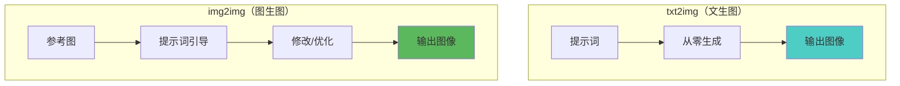
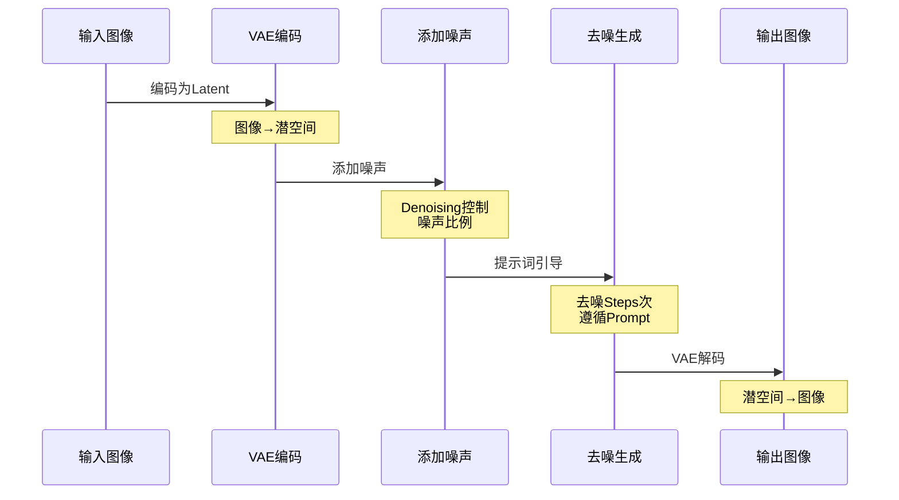
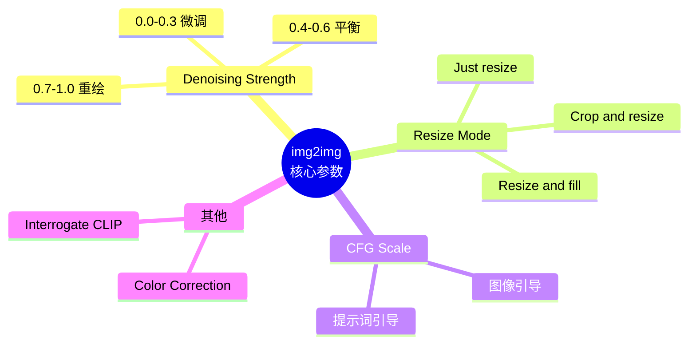
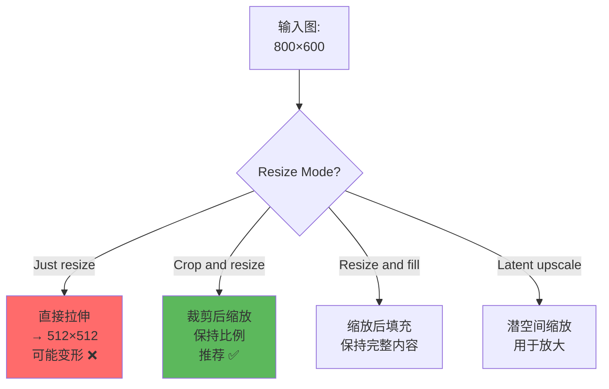
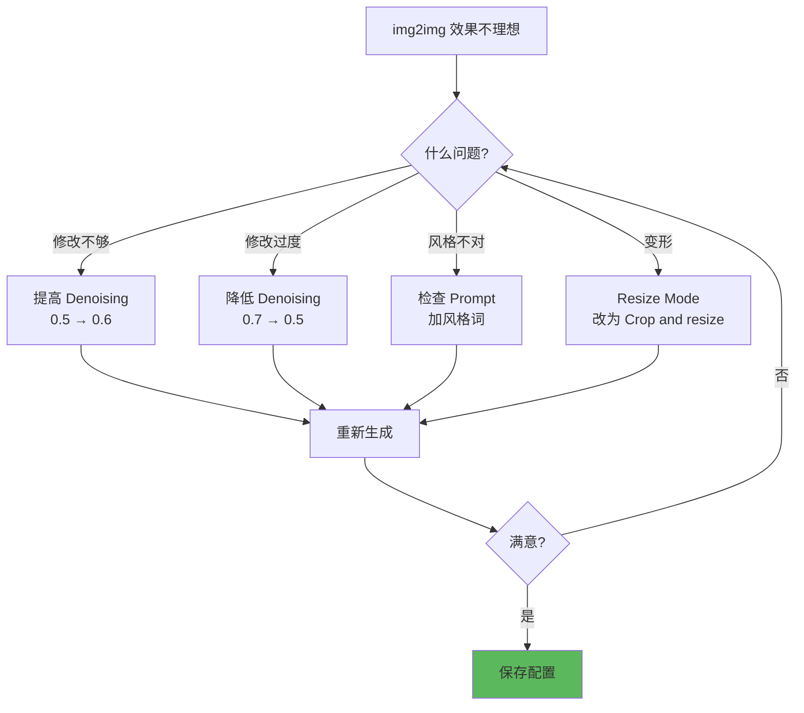

# img2img 详解 - 图生图完全指南

## 🎯 什么是 img2img？

**img2img (Image to Image)** 是 Stable Diffusion 的核心功能之一，可以基于现有图像生成新图像。与 txt2img（纯文本生成）不同，img2img 以参考图为起点，根据提示词进行修改和优化。

### 核心概念对比



**img2img 的应用场景：**
- 🎨 **风格转换**：照片转动漫、素描转彩图
- ✨ **图像优化**：提升质量、增加细节
- 🔄 **局部修改**：保持构图，改变内容
- 🖼️ **创意变体**：基于原图生成多个版本
- 📐 **草图精化**：涂鸦变精美作品

---

## 🔬 img2img 工作原理

### 技术流程



### 核心公式

```java
// img2img 的噪声控制
噪声图 = 原图Latent × (1 - Denoising) + 随机噪声 × Denoising

// Denoising Strength 决定修改程度
Denoising = 0.0: 完全不变（无意义）
Denoising = 0.3: 轻微优化
Denoising = 0.5: 适度修改
Denoising = 0.7: 大幅重绘
Denoising = 1.0: 几乎重新生成

// 实际采样步数
实际Steps = 设定Steps × Denoising
例: Steps=28, Denoising=0.5 → 实际执行14步
```

---

## 📊 img2img 核心参数

### 参数总览



---

## ⚙️ 参数详解

### 1. Denoising Strength（重绘强度）⭐ 最关键

```java
// 详见《10-DenoisingStrength详解》
// 这里补充 img2img 专属技巧

// 不同场景推荐值
照片优化: 0.15-0.25
  - 去噪、锐化、轻微调色

线稿上色: 0.55-0.65
  - 保留线条，添加色彩

风格转换: 0.6-0.75
  - 照片→动漫，素描→油画

草图精化: 0.7-0.85
  - 涂鸦变精美作品

创意变体: 0.5-0.6
  - 保持构图，改变细节
```

**实战示例：**

```java
// 案例1：照片转动漫
输入: 真人照片
Denoising: 0.65
Prompt: anime style, 1girl, colorful, cel shading
Negative: realistic, photo, 3d
Clip Skip: 2
效果: 保持人物姿势，转为动漫风格

// 案例2：低质图修复
输入: 模糊老照片
Denoising: 0.45
Prompt: high quality, detailed, sharp, restored
Negative: blurry, low quality
效果: 清晰化，保留原貌
```

---

### 2. Resize Mode（缩放模式）⭐ 重要

当输入图分辨率与设定分辨率不一致时的处理方式。



#### 模式对比

**Just resize（直接缩放）**
```java
优点: 最快
缺点: 比例不对会变形

适用: 输入图比例已匹配目标分辨率

示例:
  输入: 1024×1024
  目标: 512×512
  → 直接等比缩放，无问题 ✅

  输入: 1600×900 (16:9)
  目标: 512×512 (1:1)
  → 会被拉伸变形 ❌
```

**Crop and resize（裁剪后缩放）⭐ 推荐**
```java
优点: 保持比例，不变形
缺点: 可能裁掉边缘内容

工作方式:
  1. 计算目标比例
  2. 裁剪输入图到该比例
  3. 缩放到目标尺寸

示例:
  输入: 1600×900 (16:9)
  目标: 512×768 (2:3)
  → 裁剪为 600×900，再缩放到 512×768

适用: 大多数场景（默认选择）
```

**Resize and fill（缩放后填充）**
```java
优点: 保留完整内容
缺点: 会有填充区域（需要AI生成）

工作方式:
  1. 将输入图等比缩放到能放入目标尺寸
  2. 空白区域由AI填充

示例:
  输入: 1600×900 (16:9)
  目标: 512×768 (2:3)
  → 图像缩为 512×288，上下填充空白

适用: 需要完整保留原图内容
```

**Just resize (latent upscale)（潜空间放大）**
```java
特点: 在潜空间进行缩放
优点: 速度快，适合放大
缺点: 细节一般

适用: 快速放大预览
不推荐: 最终输出（用 Hires.fix 更好）
```

---

### 3. CFG Scale（提示词引导强度）

```java
// img2img 中 CFG 的特殊性
CFG 影响提示词 vs 原图的权重

CFG 低 (4-6):
  - 更尊重原图
  - 修改较少
  - 适合: 轻微优化场景

CFG 中 (7-9):
  - 平衡原图和提示词
  - 推荐范围 ✅

CFG 高 (10-15):
  - 强烈遵循提示词
  - 可能偏离原图
  - 适合: 风格转换、大幅修改

// 与 Denoising 的配合
Denoising 低 + CFG 高:
  → 轻微修改但严格遵循提示词

Denoising 高 + CFG 低:
  → 大幅修改但保留原图特征
```

---

### 4. Interrogate CLIP（反向提示词）

```java
// 功能: 从图像生成提示词
操作: 点击 "Interrogate CLIP" 按钮

工作原理:
  1. CLIP 分析输入图像
  2. 生成最匹配的提示词描述
  3. 自动填入 Prompt 框

使用场景:
  ✅ 不知道如何描述图像
  ✅ 想生成相似风格的图
  ✅ 学习提示词写法

示例:
  输入: 动漫女孩照片
  点击 Interrogate
  生成: 1girl, anime, blue hair, smiling,
        outdoor, cherry blossoms

// 另一个选项: Interrogate DeepBooru
更适合动漫图像
生成 Danbooru 风格标签
```

---

### 5. Color Correction（色彩校正）

```java
// 功能: 保持原图色调
勾选: ☑ Apply color correction to img2img results

作用:
  生成后的图像色调会匹配原图

适用场景:
  ✅ 图像修复（避免色偏）
  ✅ 系列图统一色调
  ✅ 保持原始氛围

不适用:
  ❌ 风格转换（色调需要改变）
  ❌ 创意变体（希望色彩多样）

示例:
  输入: 暖色调日落照片
  不勾选: 可能生成冷色调
  勾选: 保持暖色日落氛围
```

---

## 🎨 实战应用场景

### 场景1：照片转动漫风格

```java
// 目标: 真人照片 → 动漫插画
输入图: 人物照片（清晰、正面）

参数配置:
  Resize Mode: Crop and resize
  Denoising: 0.65
  CFG: 8
  Steps: 28
  Clip Skip: 2

Prompt:
  anime style, 1girl, beautiful face,
  colorful, cel shading, detailed,
  (ghibli style:1.1), high quality

Negative:
  realistic, photo, 3d render,
  blurry, low quality

LoRA: <lora:anime_lineart:0.7>

技巧:
  - 可配合 ControlNet Lineart 保留轮廓
  - Denoising 不要太高，保留面部特征
  - 使用动漫风格 LoRA 增强效果
```

---

### 场景2：线稿上色

```java
// 目标: 黑白线稿 → 彩色插画
输入图: 干净的线稿（PNG透明背景更佳）

参数配置:
  Resize Mode: Crop and resize
  Denoising: 0.6
  CFG: 9
  Steps: 30

Prompt:
  colorful, vibrant colors, detailed shading,
  anime style, cel shading, official art,
  [描述具体颜色: blue dress, blonde hair]

Negative:
  monochrome, grayscale, sketch,
  blurry, low quality

配合技术:
  - ControlNet Lineart: 严格保留线条
  - 提示词详细描述颜色方案
  - 可多次生成选择最佳配色

示例Prompt:
  1girl, colorful, blue eyes, blonde long hair,
  red dress, white stockings, black shoes,
  detailed shading, anime style, vibrant colors
```

---

### 场景3：图像质量提升

```java
// 目标: 低质量图 → 高质量图
输入图: 模糊、噪点、低分辨率图片

参数配置:
  Resize Mode: Crop and resize
  Denoising: 0.35-0.45
  CFG: 7
  Steps: 35

Prompt:
  high quality, ultra detailed, sharp focus,
  8k, professional, masterpiece,
  [原图内容描述]

Negative:
  blurry, low quality, worst quality,
  jpeg artifacts, noise, pixelated

配合技术:
  - Hires.fix: 同时放大
  - ControlNet Tile: 保留结构
  - ADetailer: 优化面部（人物图）

工作流:
  1. img2img 提升质量（Denoising 0.4）
  2. Hires.fix 放大到 2x
  3. ADetailer 修复面部
```

---

### 场景4：草图转精图

```java
// 目标: 简单涂鸦 → 精美作品
输入图: iPad/手绘草图（可以很潦草）

参数配置:
  Resize Mode: Crop and resize
  Denoising: 0.75
  CFG: 7
  Steps: 30

Prompt:
  detailed illustration, professional artwork,
  vibrant colors, high quality,
  [描述想要的主题和风格]

Negative:
  sketch, rough, unfinished,
  low quality, simple

配合技术:
  - ControlNet Scribble: 保留大致构图
  - 可以分阶段精化（多次 img2img）

两阶段法:
  阶段1: Denoising 0.7 生成基础
  阶段2: Denoising 0.4 精化细节
```

---

### 场景5：创意变体生成

```java
// 目标: 基于一张图生成多个创意版本
输入图: 满意的作品

参数配置:
  Resize Mode: Crop and resize
  Denoising: 0.5
  CFG: 6-7
  Seed: -1 (随机)

Prompt:
  [保留核心描述], different style,
  creative, unique, [新元素]

Negative: [基础负面词]

Batch Count: 4-8

技巧:
  - 固定核心描述，变化风格词
  - 适中的 Denoising 保留构图
  - 较低的 CFG 给予创作空间
  - 批量生成选择最佳

变体示例:
  原图: 动漫女孩，森林背景
  变体1: same character, beach background
  变体2: same character, city night scene
  变体3: same character, winter snow
```

---

## 🚀 进阶技巧

### 1. 多阶段 img2img

```java
// 策略: 逐步精化，每次改进一点
阶段1 - 构图调整:
  Denoising: 0.6
  Prompt: 调整构图、布局

阶段2 - 风格统一:
  Denoising: 0.4
  Prompt: 强化风格

阶段3 - 细节优化:
  Denoising: 0.3
  Prompt: 增加细节

优势:
  - 可控性强
  - 每步验证效果
  - 避免一次性大改失控
```

---

### 2. img2img + ControlNet

```java
// 黄金组合: 精准控制 + 灵活修改
ControlNet: 保持结构
img2img: 修改内容

示例 - 换装不换姿势:
  输入: 人物照片
  ControlNet: OpenPose (提取姿势)
  img2img:
    Denoising: 0.7
    Prompt: same person, different outfit,
            red dress, elegant

效果: 姿势不变，服装改变

其他组合:
  - Canny + img2img: 保留轮廓，改变细节
  - Depth + img2img: 保留空间，改变风格
```

---

### 3. 局部遮罩技巧

```java
// 在 img2img 中使用 Sketch 功能
操作:
  1. 上传图像
  2. 切换到 "Sketch" 标签
  3. 用笔刷标记要修改的区域
  4. 设置 Denoising
  5. 生成

应用:
  - 局部换色
  - 添加/删除小物体
  - 修复特定区域

注意:
  这是简化版 Inpaint
  完整 Inpaint 功能更强大
```

---

### 4. 批量处理工作流

```java
// 批量转换一组图片
Script: Process images in directory

配置:
  Input directory: 原图文件夹
  Output directory: 输出文件夹

  Denoising: 0.5
  Prompt: high quality, detailed
  Negative: low quality

  Append interrogated prompt: ☑
  (自动识别每张图内容)

用途:
  - 批量风格转换
  - 批量质量提升
  - 批量上色
```

---

### 5. 固定 Seed 精确复现

```java
// 技巧: 相同 Seed + 相同参数 = 相同结果
流程:
  1. img2img 生成满意作品
  2. 记录 Seed 和所有参数
  3. 使用相同 Seed 可精确复现

应用:
  - 制作系列作品（统一风格）
  - 微调参数对比效果
  - 团队协作复现结果

示例:
  生成1: Seed 123456, Denoising 0.5
  → 满意作品

  生成2: 同样输入图, Seed 123456, Denoising 0.6
  → 在作品1基础上增强修改
```

---

## ⚠️ 常见问题

### 问题诊断表

| 问题 | 可能原因 | 解决方案 |
|------|----------|----------|
| **输出图变形** | Resize Mode 不对 | 改用 Crop and resize |
| **完全没变化** | Denoising 太低 | 提高到 0.4+ |
| **面目全非** | Denoising 太高 | 降低到 0.5-0.6 |
| **色调改变** | 未启用色彩校正 | 勾选 Color Correction |
| **风格不对** | Prompt 不匹配 | 加风格关键词 |
| **边缘有问题** | 裁剪导致 | 使用 Resize and fill |
| **不遵循提示词** | CFG 太低 | 提高 CFG 到 8-10 |

---

### 调试流程



---

## 💡 最佳实践

### 新手推荐配置

```java
// 通用万能配置
img2img 基础设置:
  Resize Mode: Crop and resize
  Denoising: 0.5  (起点)
  CFG: 7
  Steps: 28
  Sampler: DPM++ 2M Karras

根据需求调整:
  轻微优化: Denoising 0.3
  适度修改: Denoising 0.5
  大幅重绘: Denoising 0.7

适用: 80% 的 img2img 场景
```

---

### 场景速查表

| 场景 | Denoising | CFG | 特殊设置 |
|------|-----------|-----|----------|
| **照片优化** | 0.2-0.3 | 7 | Color Correction ☑ |
| **风格转换** | 0.6-0.7 | 8 | Clip Skip=2 (动漫) |
| **线稿上色** | 0.6 | 9 | ControlNet Lineart |
| **草图精化** | 0.75 | 7 | ControlNet Scribble |
| **质量提升** | 0.4 | 7 | Hires.fix ☑ |
| **创意变体** | 0.5 | 6 | Seed=-1, Batch=4 |
| **局部修改** | 0.3-0.5 | 8 | 用 Inpaint 更好 |

---

### img2img 工作流模板

```java
// 标准工作流
1. 准备输入图
   - 检查分辨率
   - 裁剪到合适比例

2. 设置参数
   - Resize Mode: Crop and resize
   - Denoising: 从 0.5 开始

3. 编写 Prompt
   - 描述原图内容
   - 添加想要的修改
   - 强调风格

4. 测试生成
   - Batch Size=4 快速预览
   - 选择最佳结果

5. 微调参数
   - 调整 Denoising ±0.1
   - 优化 Prompt

6. 高质量输出
   - 固定 Seed
   - 配合 Hires.fix
   - ADetailer 优化（人物）
```

---

## 🎯 与其他功能的配合

### img2img + Hires.fix

```java
// 组合: 风格转换 + 高清放大
流程:
  1. img2img 转换风格
     Resolution: 512×768
     Denoising: 0.65

  2. Hires.fix 放大
     Upscale by: 2.0
     Denoising: 0.4

效果: 高清风格转换图（1024×1536）
```

---

### img2img + ADetailer

```java
// 组合: 图像优化 + 面部修复
流程:
  1. img2img 整体优化
     Denoising: 0.4

  2. ADetailer 自动修复面部
     Denoising: 0.35

效果: 整体提升 + 面部完美
```

---

### img2img + LoRA

```java
// 组合: 风格转换 + LoRA 增强
Prompt:
  <lora:ghibli_style:0.8>,
  anime style, beautiful scenery

img2img:
  Denoising: 0.65

效果: 强烈的吉卜力风格转换
```

---

## 🔗 相关文章

- [Denoising Strength 详解](./10-DenoisingStrength详解-重绘幅度控制.md) - img2img 核心参数
- [ControlNet 详解](./11-ControlNet详解-精准控制的艺术.md) - 精准控制组合
- [Hires.fix 详解](./09-HiresFix详解-高清放大的艺术.md) - 配合高清化
- [Inpaint 详解](./19-Inpaint详解-局部重绘完全指南.md) - 局部修改升级版

---

## 🎓 总结

**img2img 核心要点：**

1. **Denoising 是灵魂**: 0.5 起步，按需调整
2. **Resize Mode 选对**: 优先 Crop and resize
3. **提示词要详细**: 描述原图 + 想要的修改
4. **CFG 适中**: 7-8 平衡原图和提示词
5. **配合使用威力大**: ControlNet, Hires.fix, LoRA

**黄金配置：**
```java
Resize Mode: Crop and resize
Denoising: 0.5
CFG: 7
Steps: 28
Sampler: DPM++ 2M Karras

Prompt: [详细描述] + [风格] + [质量词]
Negative: <EasyNegative>, low quality
```

**应用口诀：**
```
img2img 图生图
Denoising 定修改
轻改三四刚刚好
重绘六七八够了

Resize Mode 别选错
Crop and resize 最稳妥
提示词要写详细
原图特征带上说
```

---

**img2img 让 AI 绘画从"随机"变"可控"！** 🎨

有了参考图，你的创意有了起点，AI 的发挥有了方向。掌握 img2img，从此告别完全随机，精准实现你的创意！
