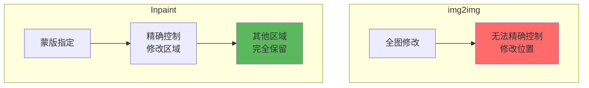
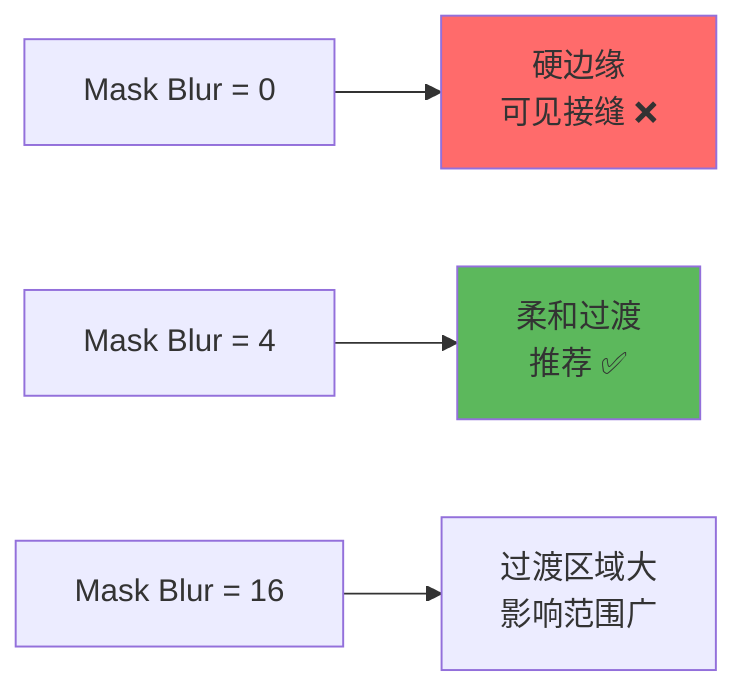
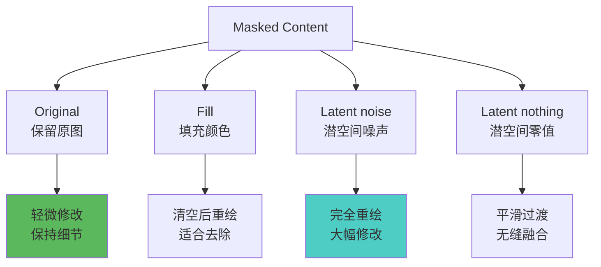
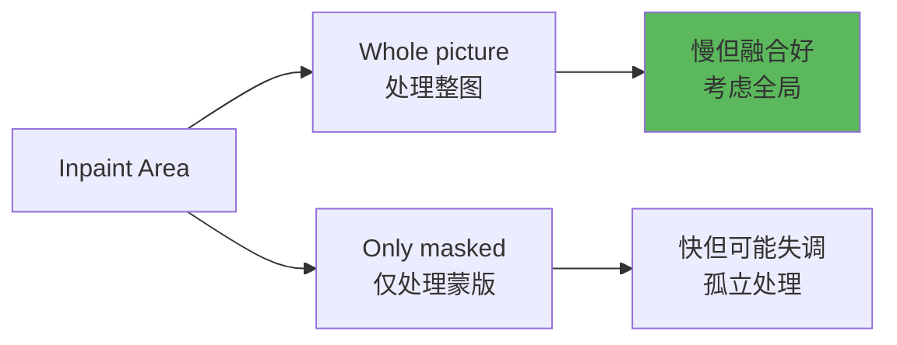
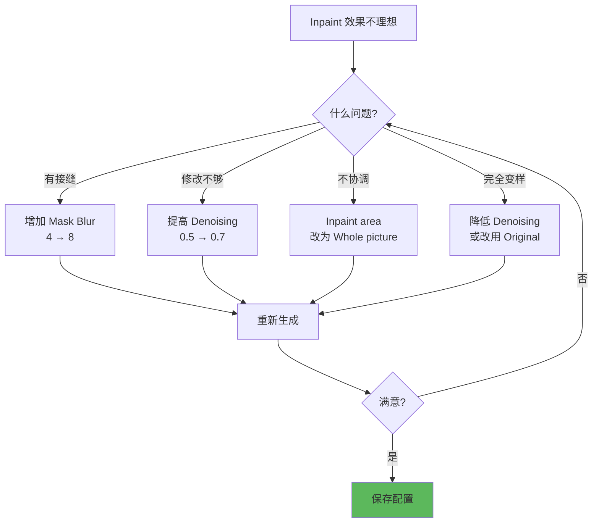

# Inpaint 详解 - 局部重绘完全指南

## 🎯 什么是 Inpaint？

**Inpaint (局部重绘)** 是 Stable Diffusion 最精准的图像编辑功能。通过绘制蒙版（Mask），你可以指定图像的某个区域进行重绘，而保持其他区域不变。

### 核心概念


**Inpaint 的应用场景：**
- 🖌️ **局部修改**：换脸、换服装、改发色
- ✨ **修复缺陷**：去除多余手指、修正面部
- 🎨 **添加元素**：加配饰、换背景物体
- 🗑️ **删除物体**：去水印、移除不要的元素
- 🔄 **风格融合**：局部改变风格

---

## 🔬 Inpaint vs img2img

### 技术对比



| 特性 | img2img | Inpaint |
|------|---------|---------|
| **修改范围** | 全图 | 局部（蒙版区域）|
| **精确度** | 低 | 极高 ⭐⭐⭐ |
| **保留原图** | 部分 | 蒙版外完全保留 |
| **难度** | 简单 | 中等 |
| **适用场景** | 整体修改 | 局部编辑 |

---

## 📐 Inpaint 界面介绍

### WebUI Inpaint 标签页

```java
// 主要区域
1. Image 输入区
   - 上传要修改的图像

2. Mask 绘制区
   - 白色画笔: 标记要重绘的区域
   - 黑色橡皮: 擦除蒙版
   - 笔刷大小调节

3. 参数设置区
   - Mask blur
   - Mask mode
   - Masked content
   - Inpaint area
   - Only masked padding

4. 其他常规参数
   - Denoising strength
   - Prompt / Negative
   - CFG, Steps, Sampler
```

---

## ⚙️ Inpaint 核心参数详解

### 1. Mask Blur（蒙版模糊）⭐ 重要

控制蒙版边缘的柔化程度，决定重绘区域与原图的过渡效果。



**参数指南：**

```java
// 范围: 0-64 像素
Mask Blur = 0:
  - 完全硬边
  - 适合: 规则形状（矩形选框）
  - 问题: 容易看出接缝

Mask Blur = 4:
  - 轻微柔化（推荐）✅
  - 适合: 大部分场景
  - 效果: 自然过渡

Mask Blur = 8-12:
  - 中度柔化
  - 适合: 需要更平滑过渡
  - 效果: 融合效果好

Mask Blur = 16+:
  - 强烈柔化
  - 适合: 大范围修改
  - 注意: 影响范围会扩大

// 实战建议
面部修复: 4-8
服装更换: 8-12
背景融合: 12-16
去除物体: 4-8
```

---

### 2. Mask Mode（蒙版模式）

定义你画的蒙版代表"要重绘"还是"不要重绘"。

```java
// 两种模式
Inpaint masked（重绘蒙版内）:
  - 白色区域 = 重绘 ✅
  - 黑色区域 = 保留
  - 默认模式，最常用

Inpaint not masked（重绘蒙版外）:
  - 白色区域 = 保留
  - 黑色区域 = 重绘
  - 适合: 保护特定区域

// 选择建议
日常使用: Inpaint masked（默认）
反向操作: Inpaint not masked
```

---

### 3. Masked Content（蒙版内容填充）⭐ 关键

决定重绘时蒙版区域的初始状态。



**模式详解：**

**Original（保留原图）⭐ 最常用**
```java
特点:
  - 蒙版区域保留原图信息
  - AI 在原图基础上修改

适用场景:
  ✅ 修复缺陷（多余手指、面部问题）
  ✅ 轻微修改（换发色、调整表情）
  ✅ 局部优化（提升细节质量）

Denoising 建议:
  0.3-0.5: 保留大部分原图，轻微调整
  0.6-0.7: 适度修改

示例:
  修复多余手指:
    Masked content: Original
    Denoising: 0.4
    Prompt: five fingers, anatomically correct
```

**Fill（填充颜色）**
```java
特点:
  - 蒙版区域填充单色
  - AI 从空白开始生成

适用场景:
  ✅ 去除物体（水印、人物、杂物）
  ✅ 清空区域后重绘

Fill color: 可选颜色（默认白色）

Denoising 建议:
  0.9-1.0: 完全重绘

示例:
  去除水印:
    Masked content: Fill
    Denoising: 1.0
    Prompt: clean background, seamless
```

**Latent noise（潜空间噪声）⭐ 大改推荐**
```java
特点:
  - 蒙版区域填充随机噪声
  - AI 完全重新生成

适用场景:
  ✅ 添加新元素（加配饰、加物体）
  ✅ 大幅修改（换服装、换背景）
  ✅ 创意生成

Denoising 建议:
  0.8-1.0: 完全重绘

示例:
  给人物添加帽子:
    Masked content: Latent noise
    Denoising: 0.95
    Prompt: red hat, detailed
```

**Latent nothing（潜空间零值）**
```java
特点:
  - 蒙版区域填充零值
  - 平滑过渡，无缝融合

适用场景:
  ✅ 去除物体后平滑背景
  ✅ 需要特别自然的过渡

Denoising 建议:
  0.9-1.0

技巧: 较少使用，实验性选项
```

---

### 4. Inpaint Area（重绘处理范围）

决定 AI 处理的画布大小。



**模式对比：**

```java
// Whole picture（处理整图）⭐ 推荐
工作方式:
  - AI 看到完整图像
  - 考虑全局上下文
  - 融合效果更好

优点:
  ✅ 重绘内容与整体协调
  ✅ 色调、光影匹配
  ✅ 适合复杂场景

缺点:
  ❌ 速度较慢
  ❌ 显存占用高

适用:
  - 人物修改（保持整体风格）
  - 场景编辑（光影一致）
  - 最终输出（质量优先）

// Only masked（仅处理蒙版区域）
工作方式:
  - 仅处理蒙版区域
  - 不考虑外部上下文
  - 速度快

优点:
  ✅ 速度快
  ✅ 显存占用低

缺点:
  ❌ 可能与周围不协调
  ❌ 孤立感

适用:
  - 快速测试
  - 简单修改
  - 小范围编辑
```

---

### 5. Only Masked Padding（蒙版扩展）

当选择 "Only masked" 时，向外扩展的像素数。

```java
// 参数范围: 0-256 像素
// 仅在 Inpaint area = Only masked 时生效

Padding = 0:
  - 严格限制在蒙版内
  - 可能过于孤立

Padding = 32（推荐）:
  - 适度扩展
  - 保证上下文信息

Padding = 64-128:
  - 大范围扩展
  - 更好融合

// 建议
快速测试: 32
最终输出: 使用 Whole picture 模式
```

---

### 6. Denoising Strength（重绘强度）

与 img2img 相同，但在 Inpaint 中更关键。

```java
// 配合 Masked Content 的推荐值
Masked Content: Original
  Denoising: 0.3-0.5（轻度修改）

Masked Content: Fill
  Denoising: 0.9-1.0（完全重绘）

Masked Content: Latent noise
  Denoising: 0.8-1.0（大幅重绘）

// 通用建议
修复缺陷: 0.4
轻微调整: 0.5
适度修改: 0.6-0.7
完全重绘: 0.9+
```

---

## 🎨 实战应用案例

### 案例1：修复多余手指

```java
// 问题: 生成的人物有6根手指
操作步骤:
  1. 上传图像到 Inpaint
  2. 用白色画笔涂抹多余手指区域
  3. 设置参数

参数配置:
  Mask blur: 8
  Mask mode: Inpaint masked
  Masked content: Original
  Inpaint area: Whole picture
  Denoising: 0.45

Prompt:
  detailed hand, five fingers,
  anatomically correct, natural pose

Negative:
  extra fingers, bad hands, mutation,
  <badhandv4>

技巧:
  - 蒙版要完全覆盖问题区域
  - 可配合 ADetailer 手部检测
  - 多次尝试找到最佳 Denoising
```

---

### 案例2：更换服装

```java
// 目标: 给人物换一套衣服
操作步骤:
  1. 精确涂抹服装区域
  2. 避开面部和手部

参数配置:
  Mask blur: 12
  Mask mode: Inpaint masked
  Masked content: Latent noise
  Inpaint area: Whole picture
  Denoising: 0.9

Prompt:
  red evening dress, elegant, silk fabric,
  detailed clothing, high quality

Negative:
  [原negative] + wrong clothing

技巧:
  - Latent noise 适合完全替换
  - Mask blur 高一点保证融合
  - Inpaint area 用 Whole picture 保持光影一致
```

---

### 案例3：去除水印

```java
// 目标: 删除图片右下角水印
操作步骤:
  1. 涂抹水印区域
  2. 稍微扩大蒙版范围

参数配置:
  Mask blur: 8
  Mask mode: Inpaint masked
  Masked content: Fill (或 Latent nothing)
  Inpaint area: Whole picture
  Denoising: 1.0

Prompt:
  clean background, seamless, natural,
  no text, no watermark

Negative:
  text, watermark, logo, signature

技巧:
  - Fill 或 Latent nothing 都可以
  - Denoising 要高 (0.95-1.0)
  - 确保提示词描述周围背景
```

---

### 案例4：修改面部表情

```java
// 目标: 把严肃表情改为微笑
操作步骤:
  1. 涂抹嘴部及周围区域
  2. 保留眼睛和其他面部特征

参数配置:
  Mask blur: 4
  Mask mode: Inpaint masked
  Masked content: Original
  Inpaint area: Whole picture
  Denoising: 0.5

Prompt:
  smiling, gentle smile, happy expression,
  natural face, detailed

Negative:
  serious, frowning, distorted face

技巧:
  - Original 保留面部结构
  - Denoising 适中避免变脸
  - 蒙版范围不要太大
```

---

### 案例5：添加配饰

```java
// 目标: 给人物添加眼镜
操作步骤:
  1. 涂抹眼睛及周围区域
  2. 蒙版略大于眼镜预期位置

参数配置:
  Mask blur: 8
  Mask mode: Inpaint masked
  Masked content: Latent noise
  Inpaint area: Whole picture
  Denoising: 0.85

Prompt:
  wearing glasses, black frame glasses,
  detailed, realistic, on face

Negative:
  no glasses, distorted

技巧:
  - Latent noise 适合添加新元素
  - 可能需要多次生成选择最佳
  - 提示词明确描述眼镜样式
```

---

### 案例6：背景替换

```java
// 目标: 保留人物，更换背景
操作步骤:
  1. 涂抹整个背景区域
  2. 精确避开人物轮廓

参数配置:
  Mask blur: 12
  Mask mode: Inpaint masked
  Masked content: Latent noise
  Inpaint area: Whole picture
  Denoising: 0.95

Prompt:
  [新背景描述], detailed background,
  [光照条件与人物匹配]

Negative:
  messy background, inconsistent lighting

技巧:
  - 配合 ControlNet Seg 更精确
  - 注意光照方向一致性
  - 背景描述要详细
```

---

## 🚀 高级技巧

### 1. 多次 Inpaint 精修

```java
// 策略: 分步修改，逐步完善
第一次 Inpaint:
  大范围修改
  Denoising: 0.7

第二次 Inpaint:
  细节优化
  Denoising: 0.4

第三次 Inpaint:
  最终润色
  Denoising: 0.3

优势:
  - 每步可控
  - 逐步接近完美
  - 避免一次性大改失控
```

---

### 2. Inpaint + ControlNet

```java
// 黄金组合: 精准控制结构
ControlNet: Canny/Depth
  - 提供结构约束

Inpaint:
  - 局部重绘内容

示例 - 换脸但保持姿势:
  1. ControlNet OpenPose: 保持姿势
  2. Inpaint 面部: 重绘脸部
  3. Masked content: Latent noise
  4. Denoising: 0.8

效果: 结构稳定 + 内容替换
```

---

### 3. 渐进式蒙版扩大

```java
// 技巧: 从小到大逐步扩展
第1次:
  小蒙版，核心区域
  Denoising: 0.7

第2次:
  扩大蒙版，包含过渡区
  Denoising: 0.5

第3次:
  最大蒙版，整体融合
  Denoising: 0.3

优势: 保证核心区域质量，逐步融合
```

---

### 4. 使用 Sketch 功能

```java
// Inpaint Sketch 标签
功能: 边画蒙版边画参考内容

操作:
  1. 选择 "Inpaint sketch" 标签
  2. 用彩色笔刷画出想要的大致样子
  3. AI 根据你的草图生成

适用:
  - 添加复杂元素
  - 精确控制形状和位置
  - 需要参考草图

示例:
  添加帽子: 画出帽子大致形状和位置
  AI 生成: 根据草图生成精细的帽子
```

---

### 5. 批量 Inpaint

```java
// 工具: Batch 功能 + 固定蒙版
适用场景:
  - 多张图相同位置修改
  - 批量去水印
  - 系列图统一编辑

操作:
  1. 准备所有需要修改的图
  2. 使用 Script: Batch from directory
  3. 设置统一参数
  4. 批量处理

注意: 蒙版位置要大致相同
```

---

## ⚠️ 常见问题

### 问题诊断表

| 问题 | 可能原因 | 解决方案 |
|------|----------|----------|
| **有明显接缝** | Mask Blur 太小 | 增加到 8-12 |
| **修改不够** | Denoising 太低 | 提高到 0.6+ |
| **完全变样** | Denoising 太高 | 降低到 0.4-0.5 |
| **与周围不协调** | Inpaint area: Only masked | 改用 Whole picture |
| **颜色不匹配** | 提示词缺少颜色描述 | 明确描述颜色 |
| **重绘失败** | 蒙版区域太小 | 扩大蒙版范围 |
| **边缘模糊** | Mask Blur 太大 | 降低到 4-8 |

---

### 调试流程



---

## 💡 最佳实践

### 蒙版绘制技巧

```java
// 蒙版绘制原则
1. 范围适中
   - 不要太小: 修改可能不完整
   - 不要太大: 影响不必要的区域
   - 恰到好处: 覆盖目标 + 一点周围

2. 边缘柔和
   - 使用 Mask Blur 8-12
   - 避免硬边缘

3. 精确绘制
   - 放大图像绘制
   - 使用合适笔刷大小
   - 细节处用小笔刷

4. 多次尝试
   - 可以重画蒙版
   - 对比不同蒙版范围效果
```

---

### 参数速查表

| 修改类型 | Masked Content | Denoising | Mask Blur | Area |
|----------|----------------|-----------|-----------|------|
| **修复缺陷** | Original | 0.4 | 8 | Whole |
| **轻微调整** | Original | 0.5 | 4 | Whole |
| **更换服装** | Latent noise | 0.9 | 12 | Whole |
| **添加物体** | Latent noise | 0.85 | 8 | Whole |
| **去除物体** | Fill | 1.0 | 8 | Whole |
| **换背景** | Latent noise | 0.95 | 12 | Whole |
| **修改表情** | Original | 0.5 | 4 | Whole |

---

### Inpaint 工作流

```java
// 标准流程
1. 分析目标
   - 确定要修改的区域
   - 确定修改类型

2. 绘制蒙版
   - 精确涂抹目标区域
   - 检查蒙版完整性

3. 选择参数
   - 根据修改类型选 Masked content
   - 设置合适的 Denoising
   - Mask Blur: 8（起点）

4. 编写提示词
   - 详细描述想要的结果
   - 包含颜色、材质、光照

5. 测试生成
   - Batch Size=4 快速对比
   - 选择最佳结果

6. 微调优化
   - 调整 Denoising ±0.1
   - 调整 Mask Blur
   - 优化提示词

7. 最终输出
   - 固定 Seed
   - Inpaint area: Whole picture
   - 生成高质量版本
```

---

## 🔗 相关文章

- [Denoising Strength 详解](./10-DenoisingStrength详解-重绘幅度控制.md) - Inpaint 核心参数
- [img2img 详解](./18-img2img详解-图生图完全指南.md) - 全局修改对比
- [ADetailer 详解](./17-面部修复详解-ADetailer与FaceRestore.md) - 自动局部修复
- [ControlNet 详解](./11-ControlNet详解-精准控制的艺术.md) - 配合使用

---

## 🎯 总结

**Inpaint 核心要点：**

1. **蒙版是关键**: 精确绘制决定80%效果
2. **Masked Content 要选对**: Original/Fill/Latent noise 各有用途
3. **Mask Blur 8**: 通用起点，保证融合
4. **Whole picture**: 优先选择，融合更好
5. **Denoising 配合**: 不同内容不同强度

**黄金配置：**
```java
// 通用配置
Mask blur: 8
Mask mode: Inpaint masked
Masked content: Original (修复) / Latent noise (大改)
Inpaint area: Whole picture
Denoising: 0.5 (起点)

Prompt: [详细描述目标]
Negative: [避免问题]
```

**操作口诀：**
```
Inpaint 局部改
蒙版画得要精准
Blur 八起步好融合
Content 要选对

轻改 Original
大改 Latent noise
去除用 Fill
Denoising 看情况

Whole picture 慢但好
多试几次找最佳
```

---

**Inpaint 是 PS 级别的 AI 编辑工具！** ✂️

掌握 Inpaint，你就拥有了像 Photoshop 一样的精准编辑能力，但速度更快、效果更智能！从此告别全图重绘的无奈，想改哪里改哪里！
