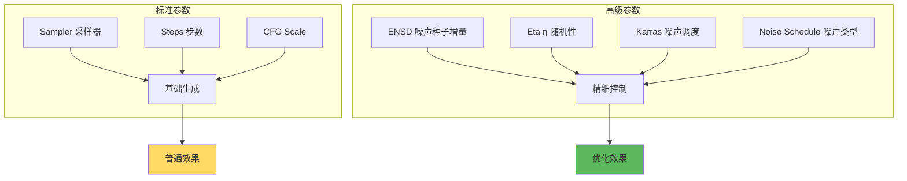
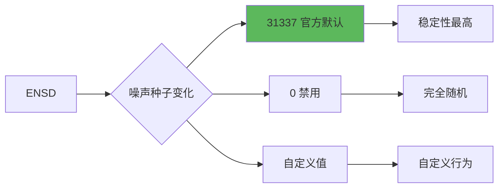
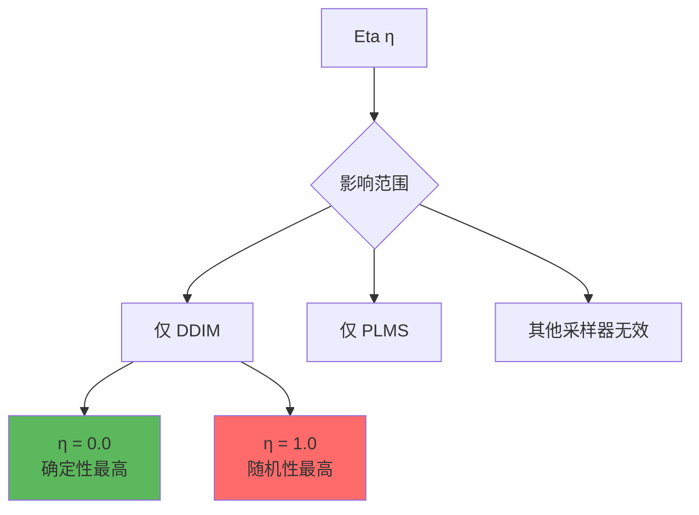
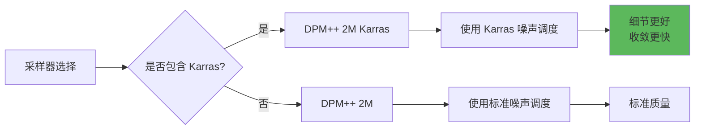
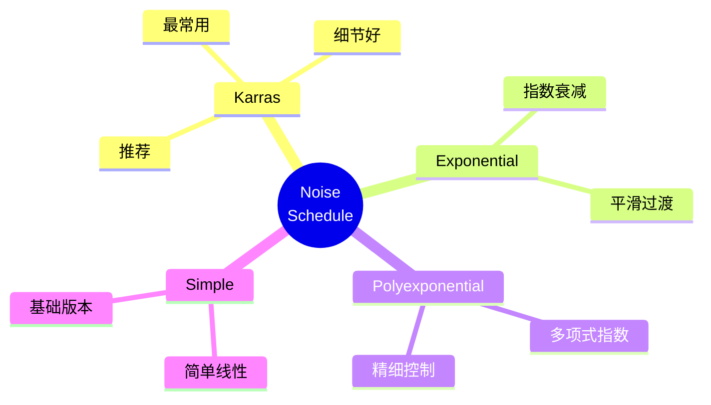
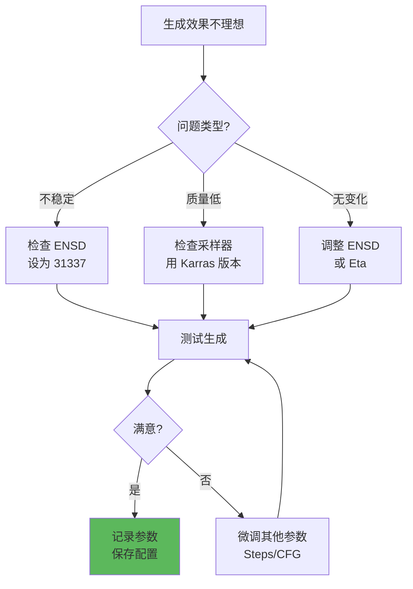

# 高级采样参数详解 - 精细控制生成质量

## 🎯 什么是高级采样参数？

**高级采样参数** 是 Stable Diffusion 中用于精细调控采样过程的专业设置。这些参数影响噪声调度、随机性控制和采样行为，对生成结果的稳定性、多样性和质量有显著影响。

### 核心概念



**简单理解：**
- 标准参数：控制 **做什么** 🎨
- 高级参数：控制 **怎么做** 🔧
- 影响范围：稳定性、多样性、细节质量 ✨

---

## 📊 核心高级参数

### 1. ENSD (Eta Noise Seed Delta)



#### 参数详解

```java
// ENSD 完整解释
参数名称: Eta Noise Seed Delta
默认值: 31337 (官方推荐)
可选范围: 0 到任意整数
位置: Settings → Sampler parameters → Eta noise seed delta

作用机制:
  - 在采样过程中为噪声添加额外的种子偏移
  - 影响不同采样器的随机性行为
  - 控制生成结果的可复现性

值的影响:
  ENSD = 31337  // 官方默认，稳定性最佳
    → 相同 Seed 生成高度一致的结果
    → 适合需要精确复现的场景
    → 推荐用于批量生成、调试

  ENSD = 0  // 禁用 ENSD
    → 每次生成有轻微随机变化
    → 即使 Seed 相同也有差异
    → 增加多样性，但降低可复现性

  ENSD = 其他值  // 自定义行为
    → 不同的随机性特征
    → 较少使用，实验性质
```

#### 实战应用

**场景1：精确复现（推荐 ENSD = 31337）**

```java
// 目标: 找到满意图片后批量生成相似作品
Settings → ENSD: 31337

生成流程:
  1. 生成100张，找到最满意的
  2. 记录该图的 Seed: 1234567890
  3. 使用相同 Seed + 所有参数重新生成
  4. 结果: 几乎完全一致 ✅

用途:
  - 商业项目（需要一致性）
  - 角色设计（保持形象统一）
  - 教程演示（可复现结果）
```

**场景2：增加变化（ENSD = 0）**

```java
// 目标: 基于一个 Seed 生成多个变体
Settings → ENSD: 0

生成流程:
  1. 固定 Seed: 1234567890
  2. 生成多次
  3. 结果: 每次略有不同 ✨

用途:
  - 创意探索
  - 找寻最佳版本
  - A/B 测试不同效果
```

---

### 2. Eta (η) 参数



#### 参数详解

```java
// Eta 完整解释
参数名称: Eta (η)
默认值: 0.0
可选范围: 0.0 ~ 1.0
生效条件: 仅对 DDIM 和 PLMS 采样器有效

作用机制:
  - 控制采样过程中的随机性程度
  - 平衡确定性采样和随机性采样
  - 影响生成结果的多样性和稳定性

值的影响:
  η = 0.0  // 完全确定性（默认推荐）
    → DDIM/PLMS 变成确定性算法
    → 相同 Seed 产生完全相同结果
    → 细节稳定、可复现
    → 适合: 需要一致性的场景

  η = 0.5  // 中等随机性
    → 平衡确定性和多样性
    → 保留部分随机变化
    → 结果既稳定又有变化

  η = 1.0  // 最大随机性
    → 接近完全随机采样
    → 每次生成差异较大
    → 多样性最高，稳定性最低
    → 适合: 创意探索

注意:
  ⚠️ 对其他采样器（如 Euler、DPM++）无效！
  这些采样器有自己的随机性机制
```

#### 实战对比

```java
// 实验: Eta 对 DDIM 的影响
采样器: DDIM
Steps: 25
CFG: 7
Seed: 固定 1234567890

测试1 - η = 0.0 (默认):
  生成10次 → 结果完全相同 ✅
  优势: 稳定、可复现
  用途: 商业作品、角色设计

测试2 - η = 0.5:
  生成10次 → 轻微差异 🔄
  优势: 保持风格，增加变化
  用途: 同一主题的多个版本

测试3 - η = 1.0:
  生成10次 → 明显差异 🎲
  优势: 最大多样性
  用途: 创意探索、灵感寻找

结论:
  大多数情况使用 η = 0.0
  只有明确需要随机性时才调高
```

---

### 3. Karras 噪声调度



#### 技术原理

```java
// Karras 噪声调度
概念:
  一种优化的噪声强度分布策略
  由 Karras 等人在论文中提出
  改进去噪过程的效率和质量

对比:
  标准噪声调度:
    - 线性或指数递减
    - 噪声强度: 均匀分布
    - 步骤利用率: 一般

  Karras 噪声调度:
    - 非线性优化曲线
    - 噪声强度: 智能分布
    - 在关键区域投入更多计算
    - 步骤利用率: 更高

优势:
  ✅ 更快收敛（同样步数质量更好）
  ✅ 细节更丰富
  ✅ 减少伪影
  ✅ 更稳定的生成

识别方法:
  采样器名称包含 "Karras" 即为启用
  如: DPM++ 2M Karras, DPM++ SDE Karras
```

#### 实战对比

```java
// 对比测试: Karras vs 标准
实验设置:
  Prompt: 相同
  Steps: 20
  其他参数: 相同

测试组1:
  Sampler: DPM++ 2M
  → 生成质量: 良好 ⭐⭐⭐⭐
  → 细节: 中等
  → 伪影: 偶尔出现

测试组2:
  Sampler: DPM++ 2M Karras
  → 生成质量: 优秀 ⭐⭐⭐⭐⭐
  → 细节: 丰富
  → 伪影: 极少

建议:
  ✅ 优先选择带 Karras 的采样器
  ✅ 特别是在较低步数时（20-25）
  ⚠️ 高步数时差异不明显（50+）
```

---

### 4. Noise Schedule (噪声调度类型)



#### 类型详解

```java
// Noise Schedule 类型
位置: Settings → Sampler parameters (高级设置)

类型1: Karras (推荐 ✅)
  特点:
    - 非线性优化曲线
    - 在重要区域分配更多计算
    - 业界最佳实践
  适用:
    - 所有场景
    - 特别是需要细节的图像
  默认: 大多数 Karras 采样器自动使用

类型2: Exponential
  特点:
    - 指数式噪声递减
    - 平滑的过渡
    - 较为柔和的生成过程
  适用:
    - 需要平滑效果的场景
    - 艺术性创作
  使用频率: 中等

类型3: Polyexponential
  特点:
    - 多项式指数混合
    - 更复杂的噪声分布
    - 实验性质
  适用:
    - 高级用户实验
    - 特殊需求
  使用频率: 较少

类型4: Simple
  特点:
    - 简单线性递减
    - 最基础的方式
    - 兼容性最好
  适用:
    - 老版本模型
    - 兼容性测试
  使用频率: 已较少使用

建议:
  新手: 保持默认（通常是 Karras）
  进阶: 可尝试 Exponential 比较效果
  专家: 根据具体需求选择
```

---

## 🎨 参数组合策略

### 推荐配置表

```java
// 场景1: 商业项目（稳定性优先）
ENSD: 31337
Eta: 0.0
Sampler: DPM++ 2M Karras
Steps: 28
Noise Schedule: Karras

特点:
  - 结果高度可复现
  - 质量稳定
  - 适合批量生成

// 场景2: 创意探索（多样性优先）
ENSD: 0
Eta: 0.5 (if using DDIM)
Sampler: DPM++ SDE Karras
Steps: 25
Noise Schedule: Karras

特点:
  - 每次有变化
  - 适合寻找灵感
  - 更多惊喜

// 场景3: 极致质量（质量优先）
ENSD: 31337
Eta: 0.0
Sampler: DPM++ 2M Karras
Steps: 35+
Hires.fix: 启用
Noise Schedule: Karras

特点:
  - 最高质量
  - 细节丰富
  - 耗时较长

// 场景4: 快速预览（速度优先）
ENSD: 任意
Eta: 0.0
Sampler: Euler a
Steps: 15-20
Noise Schedule: Simple

特点:
  - 生成速度快
  - 适合快速测试
  - 质量略低可接受
```

---

## 🔬 实战案例

### 案例1：批量生成一致角色

```java
// 目标: 为游戏生成同一角色的不同姿势
需求: 保持角色外观完全一致，只改变姿势

配置:
  ENSD: 31337 ✅ 关键！
  Sampler: DPM++ 2M Karras
  Steps: 28
  CFG: 7

基础 Prompt:
  1girl, blue hair, green eyes, school uniform,
  detailed face, anime style, high quality

姿势变体:
  Prompt 1: [基础] + standing, front view
  Prompt 2: [基础] + sitting, side view
  Prompt 3: [基础] + running, dynamic pose

Seed 策略:
  1. 第一次生成，找到满意的角色
     Seed: 1234567890
  2. 后续所有生成都使用这个 Seed
  3. 只修改姿势相关提示词

结果:
  ✅ 角色外观保持一致（发色、眼睛、服装）
  ✅ 姿势按需改变
  ✅ 风格统一
```

---

### 案例2：DDIM 精确控制

```java
// 目标: 使用 DDIM 进行精确的迭代优化
场景: 角色设计，需要微调细节

初始生成:
  Sampler: DDIM
  Eta: 0.0  // 完全确定性
  Steps: 30
  ENSD: 31337
  Seed: 5555555
  → 生成图A

微调1 - 调整提示词:
  相同 Seed + ENSD + Eta = 0.0
  Prompt: 增加 "(detailed eyes:1.2)"
  → 生成图B（眼睛更精致，其他几乎不变）

微调2 - 继续优化:
  相同 Seed + ENSD + Eta = 0.0
  Prompt: 增加 "soft lighting"
  → 生成图C（光照更柔和）

优势:
  - 每次改动都可预测
  - 只改变你想改的部分
  - 适合精细调整
```

---

### 案例3：探索式创作

```java
// 目标: 基于一个创意生成多个变体
场景: 风景创作，寻找最佳构图

配置:
  ENSD: 0  // 禁用，增加随机性
  Sampler: DPM++ SDE Karras
  Steps: 25
  CFG: 7

Prompt (固定):
  fantasy landscape, mountains, lake,
  sunset, magical atmosphere, detailed

Seed 策略:
  固定 Seed: 9876543210
  但由于 ENSD = 0，每次生成略有不同

操作:
  生成20张
  → 变体1: 山在左侧
  → 变体2: 湖更大
  → 变体3: 云层分布不同
  → 变体4: 色调偏暖
  ...

选择:
  从20张中选出最佳3张
  记录它们的生成参数（图片信息）
  可用于后续 img2img 精修
```

---

## 🔧 调试与优化

### 问题诊断表

| 问题 | 可能原因 | 解决方案 |
|------|----------|----------|
| **相同Seed结果不同** | ENSD = 0 | 设置 ENSD = 31337 |
| **生成质量不稳定** | Eta 过高 | 降低 Eta 到 0.0-0.3 |
| **细节不够丰富** | 未使用 Karras | 换用 Karras 采样器 |
| **收敛速度慢** | 噪声调度不佳 | 使用 Karras 调度 |
| **结果过于相似** | ENSD 固定 + Eta = 0 | 设 ENSD = 0 增加变化 |
| **DDIM 变化大** | Eta > 0 | 设置 Eta = 0.0 |

---

### 优化流程



---

## 💡 最佳实践

### 新手推荐

```java
// 保持简单，使用默认值
ENSD: 31337 (默认)
Eta: 0.0 (默认)
Sampler: DPM++ 2M Karras
Noise Schedule: Karras (自动)

为什么:
  - 无需调整就能获得好效果
  - 稳定性最佳
  - 业界标准配置
  - 出错概率最低
```

---

### 进阶用户

```java
// 根据场景灵活调整
需要稳定性:
  ENSD = 31337, Eta = 0.0

需要多样性:
  ENSD = 0, Eta = 0.3-0.5 (DDIM)

需要极致质量:
  使用 Karras 采样器 + 高步数

快速迭代:
  ENSD = 31337 (可复现)
  + 较低步数 (20-25)
```

---

### 专家技巧

```java
// 组合使用高级技巧
技巧1: 分阶段生成
  阶段1 - 探索:
    ENSD = 0, 低步数, 生成多张
  阶段2 - 精修:
    ENSD = 31337, 高步数, 固定 Seed

技巧2: A/B 测试
  版本A: ENSD = 31337
  版本B: ENSD = 0
  比较稳定性和多样性

技巧3: 采样器组合
  草稿: Euler a (快速)
  精修: DPM++ 2M Karras (质量)
  极致: DPM++ 2M Karras + 高步数

技巧4: Eta 实验 (仅 DDIM)
  对比 η = 0.0, 0.3, 0.5, 1.0
  找到最适合当前风格的值
```

---

## 📊 参数速查表

```java
// 快速参考
┌─────────────┬──────────────┬─────────────────────────┐
│ 参数        │ 推荐值       │ 适用场景                │
├─────────────┼──────────────┼─────────────────────────┤
│ ENSD        │ 31337        │ 需要稳定性、可复现      │
│             │ 0            │ 需要多样性、探索        │
├─────────────┼──────────────┼─────────────────────────┤
│ Eta (η)     │ 0.0          │ DDIM/PLMS 稳定生成      │
│             │ 0.3-0.5      │ DDIM/PLMS 适度随机      │
│             │ 1.0          │ DDIM/PLMS 最大随机      │
├─────────────┼──────────────┼─────────────────────────┤
│ Sampler     │ Karras 版本  │ 所有需要质量的场景      │
│             │ 非 Karras    │ 兼容性测试、特殊需求    │
├─────────────┼──────────────┼─────────────────────────┤
│ Noise Sched │ Karras       │ 默认推荐                │
│             │ Exponential  │ 实验、艺术创作          │
└─────────────┴──────────────┴─────────────────────────┘

常见组合:
  稳定组合: ENSD=31337 + Eta=0.0 + Karras
  多样组合: ENSD=0 + Eta=0.5 + SDE Karras
  质量组合: ENSD=31337 + Eta=0.0 + 高步数 + Karras
```

---

## ⚠️ 常见误区

### 误区1：过度调参

```java
❌ 错误做法:
  频繁修改 ENSD、Eta 等参数
  每次生成都改一遍
  期待神奇效果

✅ 正确做法:
  大多数时候保持默认
  只在明确需要时调整
  先调整主要参数（Prompt, CFG, Steps）
  再考虑高级参数
```

---

### 误区2：忽视采样器差异

```java
❌ 错误理解:
  "调整 Eta 能让所有采样器更稳定"

✅ 正确理解:
  Eta 仅对 DDIM 和 PLMS 有效
  其他采样器有自己的机制
  选对采样器比调 Eta 更重要
```

---

### 误区3：盲目追求 Karras

```java
❌ 极端做法:
  所有情况都必须用 Karras
  认为非 Karras 就是低质量

✅ 理性认识:
  Karras 确实普遍更好
  但某些特殊风格可能例外
  高步数时差异不明显
  根据实际效果选择
```

---

## 🔗 相关文章

- [采样器详解](./03-采样器详解-Sampler完全指南.md) - 采样器基础
- [采样步数详解](./04-采样步数详解-Steps优化指南.md) - Steps 参数
- [Seed详解](./10-Seed详解-随机种子的艺术.md) - Seed 与 ENSD 的关系

---

## 🎯 总结

**高级采样参数核心要点：**

1. **ENSD 最重要**: 控制可复现性的关键
   - 31337 = 稳定（推荐）
   - 0 = 多样（探索）

2. **Eta 有限制**: 仅对 DDIM/PLMS 有效
   - 默认 0.0 最稳定
   - 需要随机性才调高

3. **Karras 是优选**: 优先选择 Karras 采样器
   - 细节更好
   - 收敛更快
   - 业界标准

4. **保持默认**: 大多数情况不需要调整
   - 默认配置已经很好
   - 先优化主要参数
   - 遇到特定问题再调整

**实用口诀：**
```
ENSD 三万一，稳定又可靠
Eta 零点零，DDIM 不乱跑
Karras 是首选，细节质量好
默认配置优，调参需谨慎
```

---

**掌握高级采样参数，让你的生成更可控！** 🎨

这些参数虽然高级，但理解后能显著提升创作效率。记住：稳定性优先，根据需求选择，实际效果说话！
