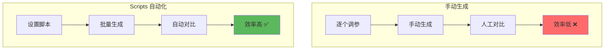
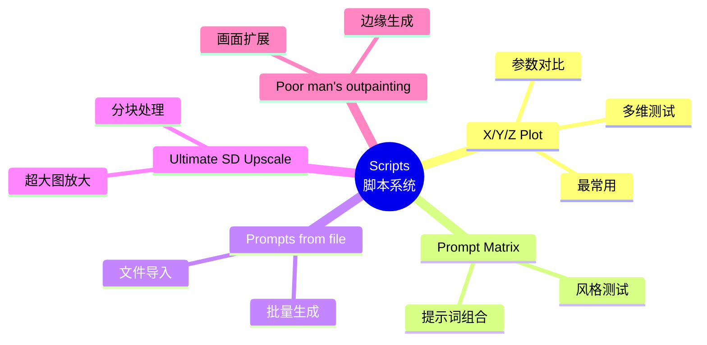
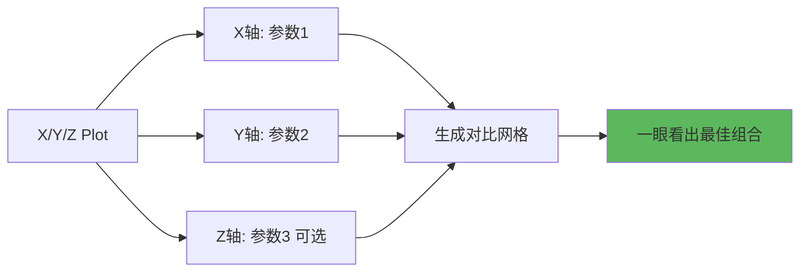
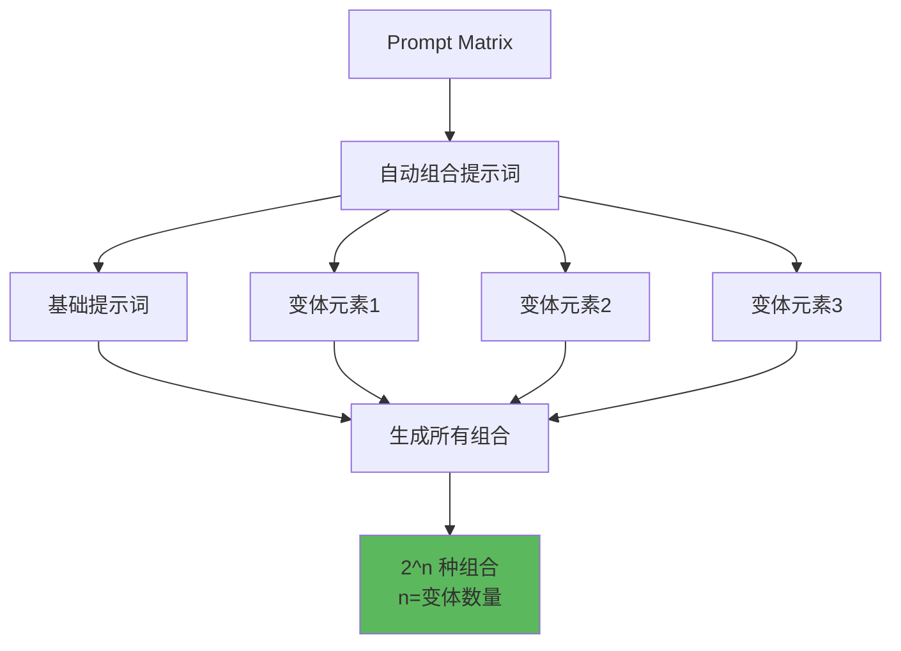
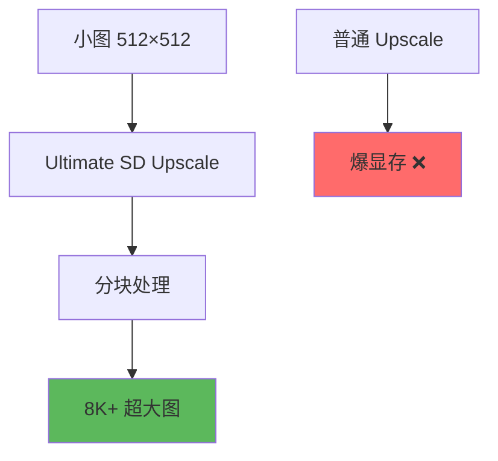

# Scripts 脚本系统详解 - 批量生成与对比分析

## 🎯 什么是 Scripts？

**Scripts (脚本)** 是 Stable Diffusion WebUI 的强大功能模块，提供自动化批量生成、参数对比、提示词组合等高级能力。通过脚本，你可以一次生成数百张图片，系统性地测试参数效果。

### 核心概念



**简单理解：**
- 手动方式：一次一张，逐个测试 🐌
- Scripts 方式：一次数百张，自动对比 🚀
- 用途：参数测试、风格对比、最优解搜索 🎯

---

## 📊 核心脚本类型

### 脚本总览



---

## 🔬 X/Y/Z Plot - 参数对比之王

### 功能概述



**X/Y/Z Plot 能做什么？**
- 在一张图中展示不同参数的效果对比
- 支持 2D (X/Y) 或 3D (X/Y/Z) 对比
- 自动生成网格布局，标注清晰
- 最高效的参数测试工具 🎯

---

### 使用流程

```java
// X/Y/Z Plot 完整流程
位置: WebUI 底部 → Script 下拉菜单 → X/Y/Z plot

步骤1: 选择 X 轴参数
  点击 X type 下拉菜单
  常用选项:
    - Seed         // 测试不同随机种子
    - Steps        // 测试不同步数
    - CFG Scale    // 测试引导系数
    - Sampler      // 测试不同采样器
    - Checkpoint   // 测试不同模型
    - Prompt S/R   // 提示词替换

步骤2: 输入 X 轴数值
  格式根据类型不同:
    Steps: 15, 20, 25, 30
    CFG Scale: 5, 7, 9, 11
    Sampler: Euler a, DPM++ 2M Karras, DDIM
    Prompt S/R: cat, dog, bird (替换关键词)

步骤3: 选择 Y 轴参数 (可选)
  与 X 轴相同的配置方式
  组合生成: X轴数量 × Y轴数量

步骤4: 选择 Z 轴参数 (可选)
  仅在需要三维对比时使用
  生成: X × Y × Z 张图片

步骤5: 点击 Generate
  → 自动生成对比网格图
  → 保存到 outputs/txt2img-grids/
```

---

### 实战案例

**案例1：找最佳步数与CFG组合**

```java
// 目标: 确定最优 Steps 和 CFG 组合
Script: X/Y/Z plot

X轴配置:
  X type: Steps
  X values: 20, 25, 30, 35, 40

Y轴配置:
  Y type: CFG Scale
  Y values: 5, 7, 9, 11, 13

基础设置:
  Prompt: 1girl, beautiful, anime style, detailed
  Negative: low quality, bad anatomy
  Sampler: DPM++ 2M Karras
  Resolution: 512×768

执行结果:
  生成 5×5 = 25张图的对比网格
  横向: 不同 Steps (20→40)
  纵向: 不同 CFG (5→13)

观察要点:
  ✅ 找出质量最好的格子
  ✅ 平衡质量与生成时间
  ✅ 避免过度生成（Steps太高）
  ✅ 避免过度引导（CFG太高）

典型发现:
  - Steps 25-30 通常足够
  - CFG 7-9 效果最自然
  - 超过这个范围收益递减
```

---

**案例2：采样器对比**

```java
// 目标: 比较不同采样器效果
Script: X/Y/Z plot

X轴配置:
  X type: Sampler
  X values: Euler a, Euler, DPM++ 2M, DPM++ 2M Karras,
            DPM++ SDE Karras, DDIM

Y轴配置:
  Y type: Steps
  Y values: 20, 30, 40

固定参数:
  Prompt: landscape, mountains, lake, sunset, detailed
  CFG: 7
  Seed: 固定 (如 123456)

执行结果:
  生成 6×3 = 18张对比图
  横向: 6种采样器
  纵向: 3种步数

观察要点:
  ✅ 低步数时哪个采样器质量好
  ✅ 高步数时是否有明显提升
  ✅ Karras 版本 vs 非 Karras
  ✅ 生成速度差异

典型发现:
  - DPM++ 2M Karras 综合最优
  - Euler a 低步数表现好
  - DDIM 稳定但需要更多步数
```

---

**案例3：模型对比**

```java
// 目标: 同一提示词在不同模型上的效果
Script: X/Y/Z plot

X轴配置:
  X type: Checkpoint name
  X values:
    model-A.safetensors,
    model-B.safetensors,
    model-C.safetensors

Y轴配置:
  Y type: CFG Scale
  Y values: 5, 7, 9, 11

固定参数:
  Prompt: 1girl, portrait, detailed face, anime style
  Steps: 28
  Sampler: DPM++ 2M Karras
  Seed: 固定

执行结果:
  生成 3×4 = 12张对比图
  横向: 3个模型
  纵向: 4个CFG值

观察要点:
  ✅ 哪个模型风格最符合需求
  ✅ 不同模型的最佳CFG
  ✅ 细节质量对比
  ✅ 色彩倾向差异

用途:
  - 选择最适合的模型
  - 确定每个模型的最佳CFG
  - 建立模型使用指南
```

---

**案例4：Prompt S/R - 提示词替换**

```java
// 目标: 测试不同元素对画面的影响
Script: X/Y/Z plot

X轴配置:
  X type: Prompt S/R
  X values: blue eyes, green eyes, red eyes, purple eyes

Y轴配置:
  Y type: Prompt S/R
  Y values: long hair, short hair, medium hair

基础 Prompt:
  1girl, [X], [Y], beautiful face, anime style, detailed
  // [X] 会被 X轴的值替换
  // [Y] 会被 Y轴的值替换

执行结果:
  生成 4×3 = 12张
  横向: 4种眼睛颜色
  纵向: 3种发型

实际生成的提示词:
  格子(1,1): 1girl, blue eyes, long hair, beautiful...
  格子(1,2): 1girl, blue eyes, short hair, beautiful...
  格子(2,1): 1girl, green eyes, long hair, beautiful...
  ...

用途:
  - 角色设计方案对比
  - 元素组合测试
  - 风格变体探索
```

---

### X/Y/Z 支持的参数类型

```java
// 常用参数类型完整列表
┌──────────────────┬────────────────────────────────┐
│ 参数类型         │ 说明                           │
├──────────────────┼────────────────────────────────┤
│ Seed             │ 测试不同随机种子               │
│ Var. seed        │ 变动种子（微调）               │
│ Steps            │ 采样步数对比                   │
│ CFG Scale        │ 引导系数对比                   │
│ Prompt S/R       │ 提示词替换                     │
│ Prompt order     │ 提示词顺序测试                 │
│ Sampler          │ 采样器对比                     │
│ Checkpoint       │ 模型对比                       │
│ Clip skip        │ Clip Skip 层数                 │
│ Denoising        │ 去噪强度（img2img）            │
│ Hires upscaler   │ 高清放大器对比                 │
│ VAE              │ VAE 模型对比                   │
│ Styles           │ 样式对比                       │
│ Sigma Churn      │ 高级采样参数                   │
│ Eta              │ Eta 随机性（DDIM）             │
│ ADetailer model  │ ADetailer 模型对比             │
│ ControlNet model │ ControlNet 模型对比            │
└──────────────────┴────────────────────────────────┘

输入格式:
  数值型: 用逗号分隔
    例: 5, 7, 9, 11, 13

  范围型: 使用 [start:end:step]
    例: [20:40:5]  → 20, 25, 30, 35, 40

  文本型: 用逗号分隔
    例: Euler a, DPM++ 2M Karras, DDIM

  文件型: 选择文件
    例: Checkpoint 需选择模型文件
```

---

## 🎨 Prompt Matrix - 提示词组合矩阵

### 功能概述



### 使用方法

```java
// Prompt Matrix 完整说明
位置: Script → Prompt matrix

语法:
  使用 | 符号分隔变体
  基础提示词 + 多个变体选项

示例1: 简单组合
  Prompt:
    a beautiful girl | wearing red dress | wearing blue dress | in garden | in city

  解析:
    基础: a beautiful girl
    变体1: wearing red dress
    变体2: wearing blue dress
    变体3: in garden
    变体4: in city

  生成组合 (2^4 = 16 种):
    1. a beautiful girl
    2. a beautiful girl, wearing red dress
    3. a beautiful girl, wearing blue dress
    4. a beautiful girl, in garden
    5. a beautiful girl, in city
    6. a beautiful girl, wearing red dress, in garden
    7. a beautiful girl, wearing red dress, in city
    8. a beautiful girl, wearing blue dress, in garden
    9. a beautiful girl, wearing blue dress, in city
    ... 等所有组合

选项:
  ☑ Put variable parts at start of prompt
    → 变体部分放在提示词开头
    建议: 保持默认（不勾选）

  ☑ Different seeds for every picture
    → 每张图使用不同种子
    建议: 测试风格时勾选
```

---

### 实战案例

**案例1：角色风格探索**

```java
// 目标: 测试角色的多种风格组合
Script: Prompt matrix

Prompt:
  1girl, beautiful face |
  anime style |
  realistic style |
  watercolor |
  detailed |
  soft colors |
  dramatic lighting

变体分析:
  基础: 1girl, beautiful face
  风格: anime/realistic/watercolor (3选项)
  效果: detailed/soft colors/dramatic lighting (3选项)

生成数量:
  2^6 = 64 种组合
  (但实际会去重和优化)

用途:
  - 快速探索不同风格
  - 找出最佳组合
  - 建立风格库

注意:
  ⚠️ 变体数量不要太多（建议 ≤ 5 个 |）
  ⚠️ 否则生成数量爆炸（2^n）
```

---

**案例2：场景元素组合**

```java
// 目标: 测试风景画中不同元素组合
Script: Prompt matrix

Prompt:
  landscape, beautiful scenery |
  mountains |
  lake |
  forest |
  sunset |
  clouds

变体:
  基础: landscape, beautiful scenery
  元素: mountains, lake, forest, sunset, clouds (5个)

生成:
  2^5 = 32 种组合
  包括:
    - 只有基础
    - 基础 + 任意单个元素
    - 基础 + 任意多个元素组合
    - 所有元素组合

观察:
  ✅ 哪些元素组合协调
  ✅ 哪些组合冲突
  ✅ 最佳视觉效果

结论:
  通常 2-3 个主要元素效果最好
  元素过多会导致画面混乱
```

---

## 📄 Prompts from file - 批量文本生成

### 功能概述


### 使用方法

```java
// Prompts from file 完整流程
位置: Script → Prompts from file or textbox

步骤1: 准备提示词文件
  创建 .txt 文件
  每行一个完整的提示词

  示例文件 (prompts.txt):
    1girl, red hair, blue eyes, anime style
    1boy, black hair, school uniform, detailed
    landscape, mountains, sunset, detailed
    cat, fluffy, cute, sitting, detailed
    ...

步骤2: 在 WebUI 中加载
  Script → Prompts from file or textbox
  点击 "从文件读取" 或直接粘贴文本

步骤3: 配置选项
  Iterations: 每个提示词生成几张
    例: 设为 3，每个提示词生成3张

  ☑ Same random seed for all lines
    所有提示词使用相同种子
    用途: 保持一致性

步骤4: 设置其他参数
  Steps, CFG, Sampler 等
  这些参数应用到所有提示词

步骤5: Generate
  自动逐个生成
```

---

### 实战案例

**案例1：角色系列生成**

```java
// 目标: 批量生成游戏角色立绘
文件: characters.txt

内容:
  warrior, male, heavy armor, sword, brave face, detailed, fantasy
  mage, female, blue robe, staff, elegant, detailed, fantasy
  archer, female, green outfit, bow, focused, detailed, fantasy
  priest, male, white robe, holy symbol, kind, detailed, fantasy
  rogue, female, dark leather, daggers, mysterious, detailed, fantasy

配置:
  Script: Prompts from file
  Iterations: 4 (每个角色生成4个版本)
  Same seed: ☐ 不勾选（每个角色独立）

  Steps: 30
  CFG: 7
  Sampler: DPM++ 2M Karras
  Resolution: 512×768

执行结果:
  5个角色 × 4个版本 = 20张图
  自动保存，按提示词命名

用途:
  - 批量生成游戏资源
  - 角色设计备选方案
  - 快速出稿
```

---

**案例2：商品图批量生成**

```java
// 目标: 为电商生成商品展示图
文件: products.txt

内容:
  red sneakers, product photography, white background, studio lighting
  blue backpack, product photography, white background, studio lighting
  black watch, product photography, white background, studio lighting
  green water bottle, product photography, white background, studio lighting
  ...

配置:
  Iterations: 5 (每个商品5个角度/版本)
  Same seed: ☑ 勾选（保持一致风格）

  Negative: shadow, reflection, text, watermark
  Steps: 25
  CFG: 6

输出:
  批量生成商品图
  统一风格和质量
  适合快速出图需求
```

---

## 🚀 Ultimate SD Upscale - 超大图放大

### 功能概述



### 使用方法

```java
// Ultimate SD Upscale 原理与使用
位置: Script → Ultimate SD upscale

原理:
  将大图切分成小块
  → 逐块进行高清化
  → 重新拼接成大图
  → 避免显存溢出

优势:
  ✅ 支持生成超大分辨率（8K, 16K+）
  ✅ 显存占用可控
  ✅ 质量优于简单放大

配置参数:
  Target size type:
    - From img2img settings: 使用 img2img 的分辨率设置
    - Scale from image size: 基于原图倍数放大

  Upscaler:
    推荐: R-ESRGAN 4x+, R-ESRGAN 4x+ Anime6B

  Tile width/height:
    分块大小，默认 512
    显存充足可调大（768, 1024）

  Mask blur:
    块边界羽化，默认 8

  Padding:
    块重叠区域，默认 32
    增加可改善接缝

使用场景:
  - 生成超高清壁纸（4K, 8K）
  - 印刷级别图片
  - 大幅海报设计
```

---

## 🎨 Poor man's outpainting - 画面扩展

### 功能概述


### 使用方法

```java
// Poor man's outpainting 使用
位置: Script → Poor man's outpainting

功能:
  将图像向外扩展，生成周围内容
  类似 Photoshop 的"内容识别填充"

参数:
  Pixels to expand:
    每个方向扩展的像素数
    例: 256 → 向四周各扩展256像素

  Outpainting direction:
    - left: 向左扩展
    - right: 向右扩展
    - up: 向上扩展
    - down: 向下扩展

  Mask blur:
    边缘羽化，默认 8

  Fall-off exponent:
    过渡强度，默认 1.0

使用技巧:
  ✅ 保持原图风格一致
  ✅ 使用较低 Denoising (0.5-0.7)
  ✅ 多次小幅扩展优于一次大幅
  ✅ 手动修正接缝处细节

应用:
  - 16:9 图转 21:9 超宽屏
  - 扩展构图
  - 修复裁切过的图片
```

---

## 💡 脚本使用技巧

### 技巧1：合理控制生成数量

```java
// 避免生成数量爆炸
❌ 危险设置:
  X/Y/Z Plot:
    X: 10个值
    Y: 10个值
    Z: 10个值
  → 生成 1000 张！⚠️

  Prompt Matrix:
    6个 | 分隔
  → 生成 2^6 = 64 张！

✅ 推荐设置:
  X/Y/Z Plot:
    2D 对比: X×Y ≤ 30
    3D 对比: X×Y×Z ≤ 50

  Prompt Matrix:
    变体数量 ≤ 5 个 |

  Prompts from file:
    提示词数量 ≤ 20
    Iterations ≤ 5

原因:
  - 生成时间长
  - 占用大量存储
  - 难以逐一检查
```

---

### 技巧2：先小范围测试

```java
// 分阶段测试策略
阶段1: 粗略测试
  X/Y/Z Plot:
    X: 3个值（大跨度）
    Y: 3个值（大跨度）
  → 9张快速预览

阶段2: 精细测试
  根据阶段1结果缩小范围
  X: 3-5个值（小跨度）
  Y: 3-5个值（小跨度）
  → 9-25张详细对比

阶段3: 最终确认
  固定最佳参数
  生成多个 Seed 验证

好处:
  ✅ 节省时间
  ✅ 更快找到最优解
  ✅ 避免无效生成
```

---

### 技巧3：善用固定种子

```java
// 参数测试时固定 Seed
目的: 排除随机性，纯粹比较参数影响

正确做法:
  X/Y/Z Plot 测试 CFG + Steps
  → Seed: 固定 (如 123456)
  → 其他参数: 固定
  → 只改变 CFG 和 Steps

错误做法:
  不固定 Seed
  → 每张图的随机性不同
  → 无法判断是参数还是运气

例外:
  测试 Seed 本身时，不固定
  测试风格多样性时，不固定
```

---

### 技巧4：网格图命名规范

```java
// 自动生成的网格图文件名很长
保存位置:
  outputs/txt2img-grids/
  outputs/img2img-grids/

文件名示例:
  grid-0001-123456-步数_20_25_30-CFG_7_9_11.png

整理建议:
  ✅ 创建专门的测试文件夹
  ✅ 手动重命名关键测试
  ✅ 记录测试结论（笔记或README）
  ✅ 定期清理无用测试图

文件夹结构示例:
  test-results/
    ├── sampler-comparison/
    ├── cfg-steps-optimization/
    ├── model-comparison/
    └── style-exploration/
```

---

## 📊 脚本组合策略

### 组合1：全面参数优化

```java
// 目标: 为特定风格找最优参数
第1轮: 粗略扫描
  Script: X/Y/Z Plot
  X: Steps [15:35:10]  → 15,25,35
  Y: CFG [5:13:4]      → 5,9,13
  → 9张快速预览

第2轮: 精细优化（基于第1轮结果）
  假设发现 Steps 25, CFG 9 最好
  X: Steps [20:30:2]   → 20,22,24,26,28,30
  Y: CFG [7:11:1]      → 7,8,9,10,11
  → 30张详细对比

第3轮: 采样器选择
  固定 Steps 25, CFG 9
  X: Sampler (6种)
  Y: Seed (3个)
  → 18张最终验证

结论: 记录最佳参数组合
```

---

### 组合2：角色设计工作流

```java
// 目标: 设计游戏角色
第1轮: 风格探索
  Script: Prompt Matrix
  Prompt: character, warrior |
          anime style |
          realistic |
          detailed |
          dramatic lighting
  → 找出最佳风格组合

第2轮: 细节优化
  Script: X/Y/Z Plot
  X: Prompt S/R (发色: red, blue, black, white)
  Y: Prompt S/R (服装: heavy armor, light armor, robe)
  → 确定配色方案

第3轮: 表情变体
  Script: Prompts from file
  文件包含不同表情:
    [基础] + smiling
    [基础] + serious
    [基础] + angry
    [基础] + surprised
  → 生成角色表情包

第4轮: 高清输出
  Script: Ultimate SD Upscale
  将满意的角色图放大到 4K
  → 最终交付
```

---

## ⚠️ 常见问题

### 问题诊断表

| 问题 | 可能原因 | 解决方案 |
|------|----------|----------|
| **生成数量过多** | X/Y/Z 参数太多 | 减少每个轴的值数量 |
| **显存溢出** | 分辨率过高 | 降低分辨率或用 Ultimate SD |
| **网格图看不清** | 格子太小 | 减少对比数量，增大基础分辨率 |
| **Prompt Matrix 没效果** | 语法错误 | 检查 \| 符号位置 |
| **文件加载失败** | 编码问题 | 使用 UTF-8 编码保存 txt |
| **部分格子空白** | 参数组合冲突 | 检查参数兼容性 |

---

### 调试技巧

```java
// 脚本生成失败排查
步骤1: 检查单张生成
  关闭所有脚本
  使用相同参数生成一张
  → 确认基础参数正确

步骤2: 简化脚本设置
  X/Y/Z Plot: 只用2×2测试
  Prompt Matrix: 只用1个 |
  → 确认脚本本身工作

步骤3: 逐步增加复杂度
  慢慢增加参数数量
  观察在哪一步失败
  → 定位问题参数

步骤4: 查看控制台日志
  WebUI 控制台有详细错误信息
  → 根据报错调整
```

---

## 🎯 总结

**Scripts 脚本系统核心要点：**

1. **X/Y/Z Plot**: 参数对比神器
   - 最常用、最高效
   - 2D 或 3D 网格对比
   - 一眼找出最佳组合

2. **Prompt Matrix**: 提示词组合
   - 自动生成所有变体
   - 注意 2^n 数量爆炸
   - 适合风格探索

3. **Prompts from file**: 批量生成
   - 逐行提示词列表
   - 适合大量相似任务
   - 商业出图利器

4. **Ultimate SD Upscale**: 超大图
   - 分块处理避免爆显存
   - 生成 8K+ 图片
   - 印刷级质量

**实用口诀：**
```
参数对比 X/Y/Z
提示组合 Matrix 见
批量生成文件读
超大图片 Ultimate

先小后大测试好
固定种子排干扰
网格清晰易查看
脚本助力效率高
```

---

**掌握 Scripts，告别手动调参！** 🚀

脚本系统是 SD 的效率倍增器。合理使用，可以在短时间内完成数百次测试，系统性地找到最优参数。记住：先想清楚要测什么，再选择合适的脚本！
