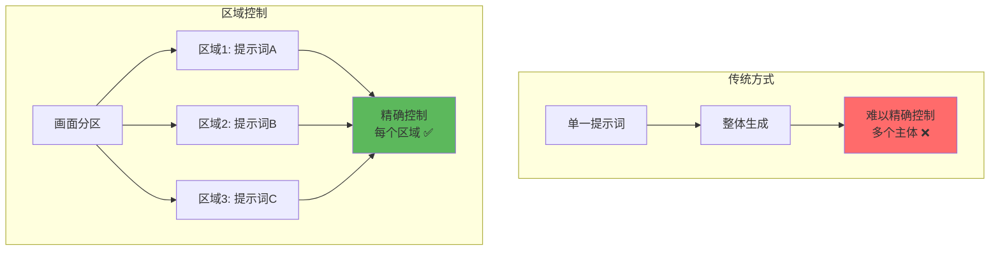
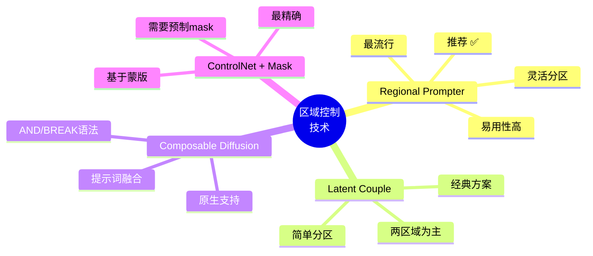
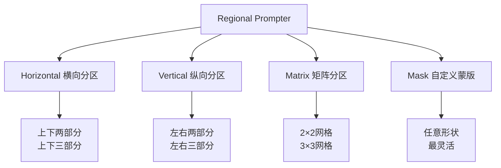
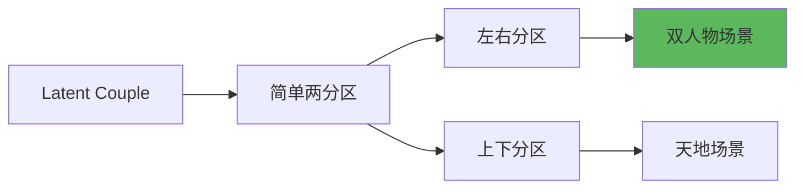

# 区域控制详解 - 精准控制画面布局

## 🎯 什么是区域控制？

**区域控制 (Regional Control)** 是一种高级技术，允许你为画面的不同区域指定不同的提示词。通过分割画面并独立控制每个区域，可以精确实现复杂的多主体构图。

### 核心概念



**简单理解：**
- 传统方式：一个提示词管全局 🌍
- 区域控制：每个区域独立提示词 🎯
- 典型应用：多人场景、复杂构图、左右对比 🖼️

---

## 📊 主要技术方案

### 技术对比



---

## 🎨 Regional Prompter - 最强区域控制

### 安装与启用

```java
// Regional Prompter 安装
位置: Extensions → Available → 搜索 "Regional Prompter"

安装步骤:
  1. Extensions → Available
  2. 搜索: Regional Prompter
  3. 点击 Install
  4. Settings → Apply and restart UI
  5. 重启后在 txt2img/img2img 底部看到 Regional Prompter 面板

检查版本:
  推荐使用最新版本
  支持更多分区模式和功能
```

---

### 分区模式



---

### 使用方法

**模式1：Horizontal (横向分区)**

```java
// 横向分区示例
启用: Regional Prompter
Mode: Horizontal

分区数量: 2 (上下两部分)

提示词格式:
  BREAK 关键词分隔不同区域

示例 - 天空与地面:
  Prompt:
    blue sky, white clouds, sunny day BREAK
    green grassland, flowers, meadow

  解释:
    BREAK 上方 → 蓝天白云
    BREAK 下方 → 绿色草地

  效果:
    上半部分: 严格遵循 "blue sky, white clouds"
    下半部分: 严格遵循 "green grassland, flowers"
    避免: 天空出现花朵、地面出现云

参数:
  Divide Ratio: 分区比例
    例: 1:1 → 上下各占50%
        1:2 → 上33% 下67%
        2:1 → 上67% 下33%

  Base Ratio: 基础提示词权重
    0.2 = 80%区域提示词 + 20%公共提示词
    0.5 = 50%区域提示词 + 50%公共提示词
```

---

**模式2：Vertical (纵向分区)**

```java
// 纵向分区示例
Mode: Vertical
分区数量: 2 (左右两部分)

示例 - 双人对比:
  Prompt:
    1girl, red hair, red dress, standing BREAK
    1boy, blue hair, blue suit, standing

  解释:
    左半部分: 红发女孩
    右半部分: 蓝发男孩

  效果:
    ✅ 两个人物独立生成
    ✅ 不会混淆特征
    ✅ 精确控制位置

示例 - 日夜对比:
  Prompt:
    daytime scene, bright sunlight, blue sky BREAK
    nighttime scene, moonlight, starry sky

  Divide Ratio: 1:1
  → 左边白天，右边黑夜
```

---

**模式3：Matrix (矩阵分区)**

```java
// 矩阵分区示例
Mode: Matrix
分区: 2×2 (四宫格)

提示词顺序:
  BREAK 分隔，按从左到右、从上到下顺序

示例 - 四季场景:
  Prompt:
    spring, cherry blossoms, pink flowers, bright BREAK
    summer, green trees, sunny, vibrant BREAK
    autumn, orange leaves, falling leaves, warm BREAK
    winter, snow, white, cold

  结果:
    ┌─────────┬─────────┐
    │ 春天    │ 夏天    │
    ├─────────┼─────────┤
    │ 秋天    │ 冬天    │
    └─────────┴─────────┘

矩阵配置:
  2×2: 四个区域
  3×3: 九个区域
  2×3: 六个区域
  自定义: 任意组合
```

---

**模式4：Mask (自定义蒙版)**

```java
// 使用蒙版精确控制
Mode: Mask

步骤:
  1. 准备黑白蒙版图
     白色区域: 应用提示词1
     黑色区域: 应用提示词2
     灰色区域: 混合

  2. 上传蒙版到 Mask 区域

  3. 提示词:
     mask1 prompt BREAK
     mask2 prompt BREAK
     ...

示例 - 人物+背景:
  蒙版: 人物轮廓为白色，背景为黑色

  Prompt:
    1girl, detailed face, beautiful, anime style BREAK
    fantasy landscape, castle, mountains, detailed

  效果:
    人物区域: 专注生成人物细节
    背景区域: 专注生成环境
    完美融合，互不干扰

优势:
  ✅ 最灵活的控制方式
  ✅ 任意形状区域
  ✅ 适合复杂构图
```

---

### 实战案例

**案例1：双人场景生成**

```java
// 目标: 生成两个特征不同的人物
问题: 传统提示词容易混淆特征
  Prompt: 1girl red hair, 1boy blue hair
  → 可能生成: 两人都是紫头发 ❌

解决方案: Regional Prompter
  Mode: Vertical
  Divide Ratio: 1:1

  Prompt:
    1girl, long red hair, red dress, blue eyes,
    smiling, detailed, anime style BREAK
    1boy, short blue hair, blue suit, brown eyes,
    serious, detailed, anime style

  Common Prompt (Base):
    high quality, detailed, studio lighting

  参数:
    Base Ratio: 0.2
    Steps: 30
    CFG: 7

  结果:
    ✅ 左边: 红发女孩，完整特征
    ✅ 右边: 蓝发男孩，完整特征
    ✅ 不混淆，完美分离
```

---

**案例2：复杂场景布局**

```java
// 目标: 前景人物 + 中景建筑 + 远景山脉
Mode: Horizontal
分区: 3 (上中下)
Divide Ratio: 1:2:1 (远景:中景:前景 = 25%:50%:25%)

Prompt:
  mountains, snow peaks, blue sky, distant BREAK
  medieval castle, stone walls, towers, detailed architecture BREAK
  1girl, warrior, armor, standing, detailed character

Common Prompt:
  fantasy scene, epic, highly detailed, 4k

参数:
  Base Ratio: 0.3 (让各区域有30%共享上下文)
  Steps: 35
  CFG: 7.5

效果:
  顶部25%: 专注生成山脉天空
  中间50%: 专注生成城堡细节
  底部25%: 专注生成人物

优势:
  ✅ 各区域细节都很丰富
  ✅ 不会出现"城堡里有人物"之类的错位
  ✅ 层次分明
```

---

**案例3：左右风格对比**

```java
// 目标: 同一场景的两种风格对比
Mode: Vertical
Divide Ratio: 1:1

Prompt:
  anime style, cel shading, vibrant colors,
  1girl, school uniform, cute BREAK
  realistic style, photorealistic, natural lighting,
  1girl, school uniform, detailed

Common Prompt:
  1girl, school uniform, standing, front view,
  detailed, high quality

参数:
  Base Ratio: 0.5 (保持主体一致)
  Seed: 固定
  Steps: 30

效果:
  左半: 动漫风格渲染
  右半: 写实风格渲染
  主体: 相同的人物和姿态

用途:
  - 风格对比展示
  - 客户方案选择
  - 测试不同风格效果
```

---

## 🎭 Latent Couple - 经典两区域方案

### 基本概念



### 使用方法

```java
// Latent Couple 使用
安装: Extensions → 搜索 "Latent Couple"

启用:
  txt2img/img2img 底部
  → Latent Couple 面板

配置:
  Division Mode:
    - Vertical: 左右分割
    - Horizontal: 上下分割

  Positions:
    分割位置，0.5 = 中间对半
    0.3 = 左/上 30%, 右/下 70%

  Weights:
    每个区域的提示词权重

提示词格式:
  区域1提示词 AND 区域2提示词

示例:
  Prompt:
    1girl, red hair AND 1boy, blue hair

  Division: Vertical
  Position: 0.5

  效果:
    左半: 红发女孩
    右半: 蓝发男孩
```

---

### 实战应用

```java
// Latent Couple 实例
场景: 对称双人肖像

Prompt:
  1girl, long hair, red dress, smiling, detailed AND
  1girl, short hair, blue dress, serious, detailed

Division Mode: Vertical
Position: 0.5
Weights: 1.0, 1.0

Common Settings:
  Resolution: 768×512 (横向)
  Steps: 28
  CFG: 7

效果:
  完美对称的两个人物
  左右特征不混淆

优势:
  ✅ 使用简单
  ✅ 对称场景效果好
  ✅ 计算开销小

局限:
  ⚠️ 只支持两个区域
  ⚠️ 分割线固定（直线）
  ⚠️ 功能不如 Regional Prompter 灵活
```

---

## 🔀 Composable Diffusion - 提示词融合

### AND 语法

```java
// Composable Diffusion 原理
特点: WebUI 原生支持，无需插件

AND 关键词:
  连接多个提示词，让它们并存于画面

基础语法:
  提示词A AND 提示词B

示例1: 双元素融合
  Prompt:
    a cat AND a dog

  效果:
    生成一个既有猫特征又有狗特征的生物
    （猫狗混合体）

示例2: 多主体场景
  Prompt:
    1girl, red hair, left side AND
    1boy, blue hair, right side

  效果:
    左边女孩，右边男孩
    （但分离不如 Regional Prompter 精确）

权重控制:
  (提示词A:1.2) AND (提示词B:0.8)
  → A 的影响更大

注意:
  ⚠️ AND 是"融合"而非"分区"
  ⚠️ 区域边界模糊
  ⚠️ 复杂场景效果不如专用插件
```

---

### BREAK 语法 (仅部分采样器)

```java
// BREAK 语法
功能: 分步生成，不同阶段用不同提示词

语法:
  阶段1提示词 BREAK 阶段2提示词

示例:
  Prompt:
    sketch, line art BREAK
    colored, detailed, shading

  过程:
    前期: 生成线稿
    后期: 上色和细节

注意:
  ⚠️ 不是所有采样器都支持
  ⚠️ 效果因采样器而异
  ⚠️ 主要用于 Karras 采样器

实用性:
  一般情况下，Regional Prompter 的 BREAK
  更强大、更可控
```

---

## 🎨 技术选择指南

### 场景与技术匹配

```java
// 根据需求选择技术
┌──────────────────────────┬─────────────────┐
│ 使用场景                 │ 推荐技术        │
├──────────────────────────┼─────────────────┤
│ 双人左右站立             │ Regional Prompter│
│                          │ (Vertical)      │
├──────────────────────────┼─────────────────┤
│ 天空+地面场景            │ Regional Prompter│
│                          │ (Horizontal)    │
├──────────────────────────┼─────────────────┤
│ 四宫格多场景             │ Regional Prompter│
│                          │ (Matrix 2×2)    │
├──────────────────────────┼─────────────────┤
│ 复杂形状区域控制         │ Regional Prompter│
│                          │ (Mask)          │
├──────────────────────────┼─────────────────┤
│ 简单左右对称             │ Latent Couple   │
├──────────────────────────┼─────────────────┤
│ 概念融合（猫+狗）        │ AND 语法        │
├──────────────────────────┼─────────────────┤
│ 精确像素级控制           │ ControlNet +    │
│                          │ Segmentation    │
└──────────────────────────┴─────────────────┘

综合推荐:
  🥇 Regional Prompter (最全能)
  🥈 Latent Couple (简单场景)
  🥉 AND 语法 (融合效果)
```

---

## 💡 高级技巧

### 技巧1：Common Prompt 的运用

```java
// Common Prompt = 所有区域共享的提示词
位置: Regional Prompter → Common Prompt 输入框

作用:
  为所有区域提供共同的上下文
  保持整体风格一致性

示例 - 双人肖像:
  Regional Prompts:
    1girl, red hair, red dress BREAK
    1boy, blue hair, blue suit

  Common Prompt:
    anime style, detailed face, studio lighting,
    high quality, 8k, professional

  Base Ratio: 0.3

效果:
  所有区域都会有 30% 的 Common Prompt 影响
  → 风格统一、质量一致
  → 但各区域主体仍然独立

何时提高 Base Ratio:
  需要更强的整体一致性时（0.4-0.5）

何时降低 Base Ratio:
  需要区域完全独立时（0.1-0.2）
```

---

### 技巧2：渐进式分区

```java
// 从粗到精的分区策略
阶段1: 整体生成
  不用区域控制
  生成基础构图
  → 确定整体布局

阶段2: 粗分区
  使用 2 分区（左右或上下）
  大致分离主体
  → 避免特征混淆

阶段3: 细分区
  根据需要使用 Matrix
  精细控制每个元素
  → 完美细节

阶段4: img2img 精修
  固定满意的构图
  局部 Inpaint 调整
  → 最终输出

好处:
  ✅ 避免一开始就过度复杂
  ✅ 更快找到满意构图
  ✅ 节省调试时间
```

---

### 技巧3：Mask 高级应用

```java
// 使用工具创建精确蒙版
推荐工具:
  - Photoshop/GIMP: 手绘蒙版
  - SAM (Segment Anything Model): 自动分割
  - ControlNet Segmentation: 语义分割

工作流:
  1. 生成初始图像
  2. 使用分割工具生成蒙版
  3. Regional Prompter + Mask 模式重新生成
  4. 精确控制每个分割区域

示例 - 多人群像:
  步骤1: 普通生成多人场景
  步骤2: SAM 分割出每个人
  步骤3: 为每个人物mask指定不同提示词
    人物1: warrior, heavy armor
    人物2: mage, blue robe
    人物3: archer, green outfit
  步骤4: 生成，每个人物特征明确

优势:
  ✅ 控制精度最高
  ✅ 适合复杂多主体场景
```

---

### 技巧4：Region + ControlNet 组合

```java
// 区域控制 + ControlNet 双重控制
场景: 既要控制布局，又要控制姿态

配置:
  1. Regional Prompter: 控制位置和特征
     Mode: Vertical
     Left: 1girl, red hair
     Right: 1boy, blue hair

  2. ControlNet: 控制姿态
     Type: OpenPose
     上传双人姿态参考图

效果:
  ✅ 位置由 Regional Prompter 控制
  ✅ 姿态由 ControlNet 控制
  ✅ 特征由各自的区域提示词控制
  ✅ 三重精确控制

应用:
  - 特定姿态的多人场景
  - 复杂动作组合
  - 精确还原参考构图
```

---

## ⚠️ 常见问题

### 问题诊断表

| 问题 | 可能原因 | 解决方案 |
|------|----------|----------|
| **区域边界明显** | Divide过于生硬 | 适当增加 Base Ratio (0.3-0.4) |
| **特征仍混淆** | Base Ratio 过高 | 降低到 0.1-0.2 |
| **区域提示词无效** | BREAK 语法错误 | 检查拼写，确保一个 BREAK |
| **整体不协调** | Common Prompt 不足 | 增加共同风格提示词 |
| **Matrix 顺序混乱** | 提示词顺序错误 | 左上→右上→左下→右下 |
| **Mask 无效** | 蒙版格式错误 | 使用黑白 PNG，正确尺寸 |

---

### 调试技巧

```java
// 区域控制调试流程
步骤1: 单区域测试
  关闭区域控制
  测试每个区域的提示词单独生成
  → 确认提示词本身有效

步骤2: 简单两分区
  使用 Vertical 或 Horizontal
  只分 2 个区域
  → 确认分区机制工作

步骤3: 调整 Base Ratio
  从 0.2 开始
  观察边界融合效果
  根据需要增减

步骤4: 增加分区复杂度
  逐步增加到 Matrix 或 Mask
  每增加一个分区就测试一次

步骤5: 组合其他工具
  加入 ControlNet、Hires.fix 等
  确保兼容性
```

---

## 🎯 总结

**区域控制核心要点：**

1. **Regional Prompter 最全能**
   - Vertical: 左右控制
   - Horizontal: 上下控制
   - Matrix: 多区域网格
   - Mask: 任意形状

2. **Common Prompt 很重要**
   - 保持整体风格统一
   - Base Ratio 控制影响程度
   - 0.2-0.3 通常最佳

3. **选择合适的技术**
   - 简单场景: Latent Couple
   - 复杂场景: Regional Prompter
   - 融合效果: AND 语法

4. **逐步细化策略**
   - 先整体后局部
   - 先粗分后细分
   - 多次迭代优化

**实用口诀：**
```
区域控制画面分
Regional 最全能
BREAK 隔开各区域
Common 保持统一性

双人场景 Vertical
天地场景 Horizontal
多格子用 Matrix
自由形状靠 Mask

Base Ratio 二三成
边界自然又协调
特征不混淆为上
布局精确质量高
```

---

**掌握区域控制，复杂构图随心所欲！** 🎨

区域控制是实现复杂多主体场景的关键技术。虽然需要一定学习成本，但一旦掌握，能大幅提升构图的精确性和可控性。记住：选对工具，从简单到复杂，逐步掌握！
