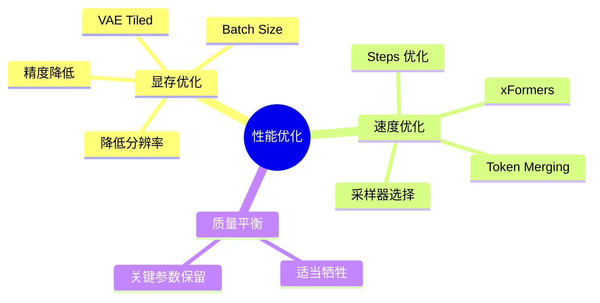
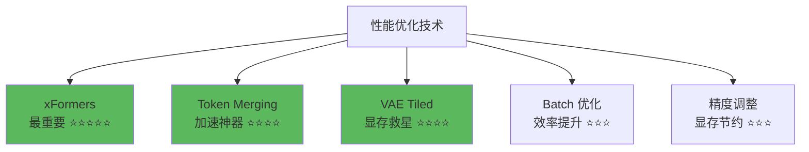
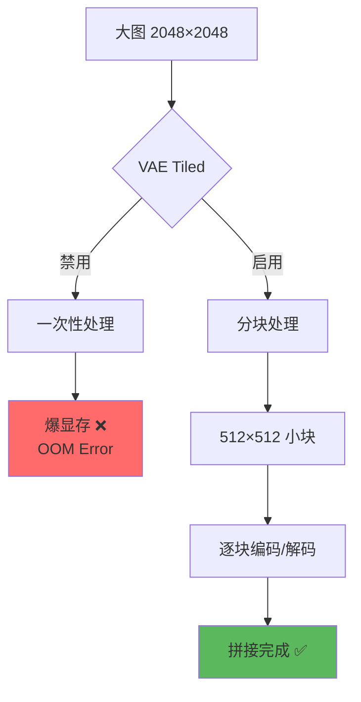

# 性能优化详解 - 加速生成降低显存

## 🎯 为什么需要性能优化？

Stable Diffusion 对硬件要求较高，尤其是显存。通过合理的优化配置，可以：
- **降低显存占用** - 让低配显卡也能运行 💾
- **提升生成速度** - 减少等待时间 ⚡
- **支持更大分辨率** - 生成高清图像 🖼️
- **批量生成更多图片** - 提高效率 📈

### 性能优化维度



---

## 🚀 核心优化技术

### 技术总览



---

## ⚡ xFormers - 最重要的优化

### 什么是 xFormers？

```java
// xFormers 完整解释
全称: Efficient Transformers
开发: Facebook AI Research (Meta)

作用:
  优化 Transformer 架构中的注意力机制计算
  → SD 的 U-Net 大量使用注意力机制
  → xFormers 提供更高效的实现

效果:
  ✅ 速度提升: 20-50% 更快
  ✅ 显存降低: 节约 20-40% 显存
  ✅ 质量无损: 生成结果完全相同
  ✅ 支持更大分辨率

适用场景:
  所有情况！强烈建议启用 ✅

支持硬件:
  - NVIDIA GPU (最佳支持)
  - AMD GPU (部分支持)
  - CPU (不支持)
```

---

### 安装与启用

```java
// xFormers 安装方法
方法1: 自动安装 (推荐)
  1. 打开 WebUI
  2. Settings → Optimizations
  3. ☑ Cross attention optimization: xFormers
  4. Apply settings → Reload UI

  检查是否生效:
    启动时命令行显示:
    "Using xformers cross attention optimization."

方法2: 手动安装
  # Windows (Conda/venv)
  pip install xformers

  # 启动参数
  python launch.py --xformers

  # 或在 webui-user.bat 中添加
  set COMMANDLINE_ARGS=--xformers

方法3: 更新到最新版
  pip install xformers --upgrade

注意:
  ⚠️ xFormers 版本需匹配 PyTorch 版本
  ⚠️ 遇到问题可尝试重新安装
```

---

### 性能对比

```java
// xFormers 实测数据
测试环境:
  GPU: RTX 3060 (12GB)
  Resolution: 512×768
  Steps: 28
  Sampler: DPM++ 2M Karras

测试结果:
  ┌────────────────┬─────────┬─────────┬────────┐
  │ 配置           │ 生成时间│ 显存占用│ 质量   │
  ├────────────────┼─────────┼─────────┼────────┤
  │ 无优化         │ 18.5秒  │ 7.2 GB  │ 100%   │
  │ 启用 xFormers  │ 12.3秒  │ 5.1 GB  │ 100%   │
  │ 提升幅度       │ 33% ↑   │ 29% ↓   │ 无变化 │
  └────────────────┴─────────┴─────────┴────────┘

  更大分辨率 (768×1024):
  ┌────────────────┬─────────┬─────────┬────────┐
  │ 无优化         │ 爆显存   │ OOM ❌  │ -      │
  │ 启用 xFormers  │ 28.1秒  │ 9.8 GB  │ 100% ✅│
  └────────────────┴─────────┴─────────┴────────┘

结论:
  ✅ 必须启用！
  ✅ 低配显卡的救星
  ✅ 高配显卡也受益
```

---

## 🔧 Token Merging (ToMe) - 加速神器

### 什么是 ToMe？

```java
// Token Merging 原理
概念:
  在生成过程中合并相似的 token
  → 减少计算量
  → 加快生成速度

工作方式:
  步骤1: 识别图像中相似的区域
  步骤2: 合并这些区域的计算
  步骤3: 减少冗余计算
  → 速度提升 30-60%

优势:
  ✅ 显著加速（30-60%）
  ✅ 几乎无质量损失（轻微牺牲）
  ✅ 降低显存占用

适用场景:
  - 快速预览
  - 批量生成
  - 低配显卡
  - 不需要极致细节时

不推荐场景:
  - 需要极致细节（人脸特写）
  - 商业级作品
  - 最终成品
```

---

### 安装与配置

```java
// Token Merging 安装
安装扩展:
  1. Extensions → Available
  2. 搜索: "Token Merging" 或 "ToMe"
  3. Install → Apply and restart

启用配置:
  位置: Settings → Token Merging

  Token Merging Ratio:
    合并比例，0.0 ~ 1.0
    0.0 = 禁用
    0.5 = 中等合并（推荐）
    1.0 = 最大合并

  推荐值:
    快速预览: 0.6-0.7
    正常生成: 0.4-0.5
    高质量: 0.2-0.3
    极致质量: 0.0 (禁用)

  Max Down Sampling Depth:
    下采样深度，通常保持默认
```

---

### 性能与质量平衡

```java
// ToMe 效果实测
测试配置:
  Resolution: 512×768
  Steps: 28
  Sampler: DPM++ 2M Karras

对比测试:
  ┌────────────┬─────────┬─────────┬────────┐
  │ ToMe Ratio │ 生成时间│ 细节损失│ 推荐度 │
  ├────────────┼─────────┼─────────┼────────┤
  │ 0.0 关闭   │ 12.3秒  │ 0%      │ 极致质量│
  │ 0.3 轻度   │ 9.8秒   │ <5%     │ ⭐⭐⭐⭐⭐│
  │ 0.5 中度   │ 7.5秒   │ 5-10%   │ ⭐⭐⭐⭐ │
  │ 0.7 重度   │ 5.9秒   │ 15-20%  │ ⭐⭐⭐   │
  │ 1.0 最大   │ 4.2秒   │ 30%+    │ ⭐⭐     │
  └────────────┴─────────┴─────────┴────────┘

观察:
  细节损失主要表现在:
    - 小物体边缘略微模糊
    - 复杂纹理简化
    - 远景细节减少
    - 人脸特征略微柔化

  但整体构图和风格不变

最佳实践:
  预览阶段: 0.6-0.7 (快速迭代)
  精修阶段: 0.3-0.4 (平衡)
  最终输出: 0.0 (关闭，极致质量)
```

---

## 💾 VAE Tiled - 超大分辨率的关键

### VAE Tiled 原理



### 配置使用

```java
// VAE Tiled 配置
位置: Settings → VAE

启用选项:
  ☑ Enable Tiled VAE

参数:
  Encoder Tile Size:
    编码器分块大小
    推荐: 2048 (显存 ≥ 8GB)
          1536 (显存 6GB)
          1024 (显存 4GB)

  Decoder Tile Size:
    解码器分块大小
    通常与 Encoder 相同

  VAE Tile Overlap:
    分块重叠区域
    默认: 64 (推荐)
    增加可减少拼接缝隙

作用:
  ✅ 支持生成超大分辨率图像
  ✅ 避免 VAE 阶段显存溢出
  ✅ 对生成质量影响极小

使用场景:
  - 生成 1024×1024 以上图像
  - Hires.fix 放大到 2K/4K
  - 显存不足时
  - Ultimate SD Upscale
```

---

### 实战应用

```java
// VAE Tiled 实例
场景: 生成 2048×2048 高清图

配置1: 不启用 VAE Tiled
  Resolution: 2048×2048
  Steps: 30
  结果: 显存溢出 ❌
    "RuntimeError: CUDA out of memory"

配置2: 启用 VAE Tiled
  Resolution: 2048×2048
  Steps: 30
  Settings:
    ☑ Enable Tiled VAE
    Encoder/Decoder Tile Size: 1536
    Overlap: 64
  结果:
    ✅ 成功生成
    ✅ 显存占用: 10.2 GB (RTX 3060 12GB)
    ✅ 质量: 无明显拼接缝隙

注意:
  - 生成时间会略微增加 (5-10%)
  - 质量影响可忽略
  - 绝对必要时才启用（大图）
```

---

## 📦 Batch Size 优化

### Batch 概念

```java
// Batch Count vs Batch Size
Batch Count:
  生成的批次数
  例: Batch Count = 5
  → 分5次生成，每次生成 Batch Size 张

Batch Size:
  每批次生成的图片数量
  例: Batch Size = 4
  → 一次性生成4张图

总图片数 = Batch Count × Batch Size

显存影响:
  Batch Size ↑ → 显存占用 ↑
  Batch Count ↑ → 显存占用不变

速度影响:
  Batch Size > 1 → 并行生成，总时间减少
  但单张图时间略微增加
```

---

### 优化策略

```java
// Batch 配置策略
显存充足 (≥12GB):
  Batch Size: 2-4
  Batch Count: 根据需要
  优势:
    ✅ 并行生成，总时间大幅减少
    ✅ 同时生成多个 Seed 对比

  示例:
    生成12张图
    方案A: Batch Size=1, Count=12
      → 12次串行，耗时 12×12秒 = 144秒

    方案B: Batch Size=4, Count=3
      → 3次并行，耗时 3×15秒 = 45秒
      (单次略慢，但总时间大幅减少)

显存紧张 (6-8GB):
  Batch Size: 1
  Batch Count: 根据需要
  原因:
    避免显存溢出

显存极限 (4GB):
  Batch Size: 1
  Batch Count: 1
  分辨率: 降低到 512×512
  Steps: 降低到 20-25
  启用所有优化

最佳实践:
  1. 先测试单张生成（Batch Size=1）
  2. 确认显存充足后逐步提高 Batch Size
  3. 观察生成时间和显存占用
  4. 找到最佳平衡点
```

---

## 🎛️ 精度优化

### FP16 vs FP32

```java
// 浮点精度选择
FP32 (全精度):
  优势:
    ✅ 质量最高
    ✅ 数值稳定性最好
  劣势:
    ❌ 显存占用大
    ❌ 计算速度慢

FP16 (半精度):
  优势:
    ✅ 显存占用减半
    ✅ 计算速度快 30-50%
  劣势:
    ❌ 极轻微质量损失（通常不可见）
    ❌ 数值范围有限

配置:
  Settings → Precision
  → half (FP16) 或 full (FP32)

  启动参数:
    --precision full  // FP32
    --precision half  // FP16 (推荐)
    --precision autocast  // 自动混合精度

推荐:
  ✅ 绝大多数情况使用 FP16
  ✅ 质量差异微乎其微
  ✅ 显存和速度收益显著

  仅在以下情况使用 FP32:
    - 出现数值异常（极少）
    - 科研级别精度要求
    - 显存充足且不在意速度
```

---

## 🔍 采样器与步数优化

### 采样器速度对比

```java
// 采样器性能排名 (速度)
快速采样器 ⚡:
  1. Euler a (最快)
  2. Euler
  3. LMS
  → 适合: 快速预览、测试

平衡采样器 ⚖️:
  1. DPM++ 2M Karras (推荐)
  2. DPM++ SDE Karras
  3. DPM++ 2M
  → 适合: 正常生成

慢速采样器 🐌:
  1. DDIM
  2. PLMS
  3. UniPC
  → 适合: 需要极致质量时

速度优化建议:
  预览阶段:
    Sampler: Euler a
    Steps: 15-20
    → 快速迭代调试

  正式生成:
    Sampler: DPM++ 2M Karras
    Steps: 25-30
    → 平衡质量与速度

  极致质量:
    Sampler: DDIM 或 DPM++ SDE Karras
    Steps: 40-50
    → 商业级作品
```

---

### Steps 优化

```java
// 采样步数优化
不同采样器的最佳步数:

Euler a:
  最低: 15 (可用)
  推荐: 20-25
  上限: 30 (再高收益递减)

DPM++ 2M Karras:
  最低: 20 (可用)
  推荐: 25-30
  上限: 35 (再高意义不大)

DDIM:
  最低: 25
  推荐: 30-40
  上限: 50

优化策略:
  测试最低可接受步数:
    1. 从 15 步开始测试
    2. 逐步增加 5 步
    3. 观察质量提升
    4. 找到收益递减点

  示例发现:
    DPM++ 2M Karras:
      15步: 质量 60% ⭐⭐
      20步: 质量 85% ⭐⭐⭐⭐
      25步: 质量 95% ⭐⭐⭐⭐⭐
      30步: 质量 98% ⭐⭐⭐⭐⭐
      40步: 质量 99% ⭐⭐⭐⭐⭐
      50步: 质量 99.5% ⭐⭐⭐⭐⭐

    结论: 25-30 步最佳平衡点
```

---

## 💡 综合优化方案

### 方案1：极限性能（低配显卡）

```java
// 目标: 4GB 显卡也能运行
配置:
  Resolution: 512×512
  Steps: 20
  Sampler: Euler a
  Batch Size: 1
  CFG Scale: 7

优化启用:
  ✅ xFormers
  ✅ Token Merging (0.6)
  ✅ VAE Tiled (Tile Size: 1024)
  ✅ FP16 Precision
  ✅ Medvram 模式

启动参数:
  --xformers --medvram --precision half

预期:
  显存占用: ~4GB
  生成时间: 20-30秒/张
  质量: 良好 (可用于预览和测试)

适用场景:
  - GTX 1650 / RTX 2060 6GB
  - 快速测试
  - 提示词调试
```

---

### 方案2：平衡方案（中端显卡）

```java
// 目标: 质量与速度平衡
配置:
  Resolution: 512×768 或 768×512
  Steps: 25-28
  Sampler: DPM++ 2M Karras
  Batch Size: 2
  CFG Scale: 7

优化启用:
  ✅ xFormers
  ✅ Token Merging (0.4)
  ✅ FP16 Precision
  ❌ VAE Tiled (不需要)

启动参数:
  --xformers --precision half

预期:
  显存占用: 5-7GB
  生成时间: 10-15秒/张
  质量: 优秀 (适合正式作品)

适用场景:
  - RTX 3060 / RTX 3070
  - 日常创作
  - 大部分使用场景
```

---

### 方案3：极致质量（高端显卡）

```java
// 目标: 不考虑速度，只要质量
配置:
  Resolution: 768×1024 或更大
  Steps: 35-40
  Sampler: DPM++ SDE Karras 或 DDIM
  Batch Size: 1-2
  CFG Scale: 7-9
  Hires.fix: 启用，放大 2x

优化启用:
  ✅ xFormers
  ✅ VAE Tiled (大分辨率必须)
  ❌ Token Merging (追求极致)
  ✅ FP16 (FP32 可选)

启动参数:
  --xformers --precision half

预期:
  显存占用: 10-16GB
  生成时间: 40-80秒/张
  质量: 极致 (商业级)

适用场景:
  - RTX 4080 / RTX 4090
  - 商业项目
  - 最终交付作品
  - 打印级图片
```

---

## 📊 性能监控

### 监控工具

```java
// 实时监控性能
工具1: WebUI 内置
  位置: Settings → Live Previews
  ☑ Show live previews of the created image
  → 实时查看生成进度

工具2: GPU 监控
  NVIDIA:
    命令行: nvidia-smi
    实时: watch -n 1 nvidia-smi
    GUI: GPU-Z, MSI Afterburner

  AMD:
    radeontop
    GPU-Z

  关注指标:
    - 显存使用量 (Memory Used)
    - GPU 利用率 (GPU Utilization)
    - 温度 (Temperature)

工具3: WebUI 扩展
  Extensions → Image Browser
  → 查看生成历史和性能数据

日志分析:
  命令行输出会显示:
    - 每步耗时
    - 总生成时间
    - 显存峰值

  示例:
    100%|████████| 28/28 [00:12<00:00, 2.28it/s]
    → 28步，12秒，每秒2.28步
```

---

## ⚠️ 常见问题

### 问题诊断表

| 问题 | 可能原因 | 解决方案 |
|------|----------|----------|
| **CUDA OOM** | 显存不足 | 降低分辨率/Batch/启用优化 |
| **生成极慢** | 未启用优化 | 启用 xFormers + ToMe |
| **xFormers 报错** | 版本不兼容 | 重新安装匹配版本 |
| **质量突然下降** | ToMe 过高 | 降低 ToMe Ratio |
| **大图爆显存** | VAE 未优化 | 启用 VAE Tiled |
| **生成中断** | 显存波动 | 降低 Batch Size |

---

### 故障排查

```java
// 显存溢出 (OOM) 排查
步骤1: 确认基础设置
  分辨率 ≤ 768
  Batch Size = 1
  Steps ≤ 30

步骤2: 启用所有优化
  xFormers ✅
  Token Merging 0.5 ✅
  VAE Tiled ✅
  FP16 ✅

步骤3: 使用特殊模式
  启动参数添加:
    --medvram  // 中等显存优化
    或
    --lowvram  // 极限显存优化

  medvram:
    适合 6-8GB 显卡
    速度略微降低

  lowvram:
    适合 4GB 显卡
    速度显著降低

步骤4: 极限优化
  如果仍然 OOM:
    - 分辨率降至 512×512
    - Steps 降至 20
    - 关闭 Hires.fix
    - Batch Size = 1
    - 关闭其他程序
```

---

## 🎯 总结

**性能优化核心要点：**

1. **xFormers 必启用** ⭐⭐⭐⭐⭐
   - 速度提升 20-50%
   - 显存降低 20-40%
   - 无质量损失

2. **Token Merging 看场景** ⭐⭐⭐⭐
   - 预览: 0.6-0.7
   - 正常: 0.4-0.5
   - 极致: 0.0

3. **VAE Tiled 大图必备** ⭐⭐⭐⭐
   - 1024+ 分辨率必须启用
   - 避免 VAE 阶段 OOM
   - 质量影响极小

4. **Batch Size 合理设置** ⭐⭐⭐
   - 显存充足: 2-4
   - 显存紧张: 1
   - 并行生成提效显著

5. **FP16 普遍推荐** ⭐⭐⭐
   - 显存减半
   - 速度提升
   - 质量几乎无损

**实用口诀：**
```
xFormers 必须开
ToMe 看需要调
大图 VAE Tiled
小显存 Batch 小

Euler a 最快速
Karras 质量好
Steps 二十五
平衡又高效

显存紧张怎么办
降低分辨率
启用全优化
medvram 来帮忙
```

---

**掌握性能优化，低配也能飞！** 🚀

性能优化不是牺牲质量，而是智能平衡。合理配置，4GB 显卡也能愉快创作，16GB 显卡能生成 4K 大图！记住：优化是必修课，不是选修课！
