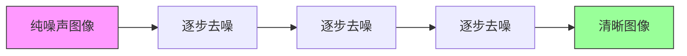
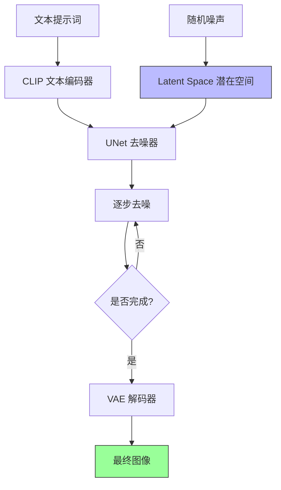
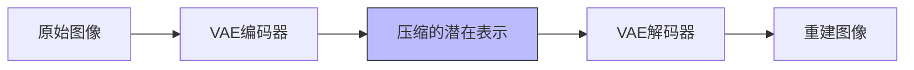
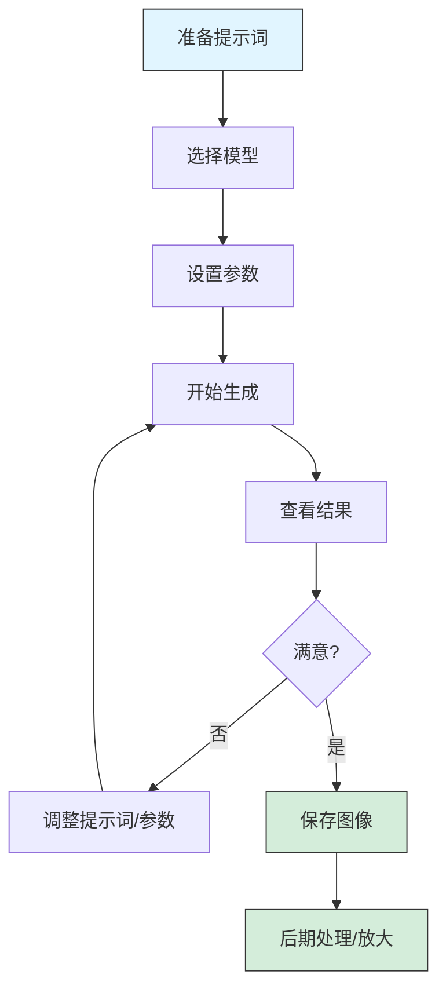
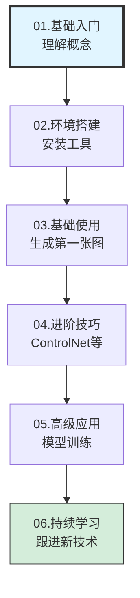

# Stable Diffusion 课程01 - 基础入门

> **学习时间**：1-2周
> **适合人群**：零基础学员，对 AI 绘画感兴趣的初学者

## 课程目标

通过本课程的学习，你将能够：

- ✅ 理解 Stable Diffusion 的基本概念和工作原理
- ✅ 了解 AI 绘画的应用场景和发展趋势
- ✅ 掌握 AI 绘画领域的核心术语和基础概念
- ✅ 建立对 Stable Diffusion 生态系统的整体认知

## 1. 什么是 Stable Diffusion

### 1.1 核心技术原理

Stable Diffusion 是一个基于深度学习的文本到图像生成模型，它利用了三个关键技术：

**1. Diffusion Model（扩散模型）**

扩散模型的工作原理类似于"去噪"过程：



- **正向过程**：向图像逐步添加噪声，直到变成完全的随机噪声
- **反向过程**：从随机噪声开始，逐步去除噪声，生成清晰图像

**2. Text-to-Image（文生图）**

根据文本描述生成对应的图像：
- 输入：文本提示词（Prompt）
- 输出：符合描述的图像
- 原理：将文本通过 CLIP 模型编码，指导图像生成过程

**3. Latent Diffusion（潜在扩散）**

Stable Diffusion 的核心创新：



**优势**：
- 不在像素空间直接操作，而是在压缩后的潜在空间中工作
- 大幅降低计算成本和内存需求
- 使得个人电脑也能运行高质量的 AI 绘画模型

### 1.2 为什么选择 Stable Diffusion

与其他 AI 绘画工具相比，Stable Diffusion 具有独特优势：

| 特性 | Stable Diffusion | Midjourney | DALL-E 3 | 国产工具 |
|------|-----------------|------------|----------|---------|
| **开源性** | ✅ 完全开源 | ❌ 闭源 | ❌ 闭源 | ❌ 多数闭源 |
| **部署方式** | ✅ 可本地部署 | ❌ 仅云端 | ❌ 仅云端 | ⚠️ 部分支持 |
| **可控性** | ⭐⭐⭐⭐⭐ 极高 | ⭐⭐⭐ 中等 | ⭐⭐ 较低 | ⭐⭐⭐ 中等 |
| **成本** | 免费（需硬件） | 💰 订阅制 | 💰 按量付费 | 💰 多数付费 |
| **扩展性** | ⭐⭐⭐⭐⭐ 丰富插件生态 | ⭐⭐ 有限 | ⭐⭐ 有限 | ⭐⭐⭐ 逐步完善 |
| **学习曲线** | ⚠️ 较陡峭 | ✅ 简单 | ✅ 非常简单 | ✅ 简单 |
| **社区支持** | ⭐⭐⭐⭐⭐ 非常活跃 | ⭐⭐⭐⭐ 活跃 | ⭐⭐⭐ 一般 | ⭐⭐⭐ 逐步增长 |

**适合使用 Stable Diffusion 的场景**：
- 🎨 需要精确控制生成结果
- 💻 有一定计算机基础，愿意学习
- 🔧 希望深度定制和扩展功能
- 💰 希望长期使用但控制成本
- 📚 希望学习 AI 技术原理

## 2. 核心概念详解

### 2.1 基础术语

#### Prompt（提示词）

**定义**：用于描述想要生成图像的文本输入

**示例**：
```
a beautiful girl, long hair, blue eyes, standing in a garden
一个美丽的女孩，长发，蓝色眼睛，站在花园里
```

**要点**：
- 使用英文效果更好（模型主要用英文训练）
- 描述越详细，结果越精确
- 需要遵循一定的格式和语法

#### Negative Prompt（负面提示词）

**定义**：描述不想在图像中出现的元素

**示例**：
```
low quality, blurry, bad anatomy, text, watermark
低质量、模糊、解剖错误、文字、水印
```

**作用**：
- 避免常见瑕疵（如手部畸形、模糊）
- 排除不想要的元素（如水印、文字）
- 提升整体图像质量

#### Checkpoint（检查点/大模型）

**定义**：完整训练好的 Stable Diffusion 模型文件

**特点**：
- 文件大小：通常 2-7 GB
- 扩展名：`.ckpt` 或 `.safetensors`
- 决定了生成图像的基本风格

**分类**：
- **写实模型**：生成真实照片风格
- **二次元模型**：生成动漫风格
- **通用模型**：平衡多种风格

#### VAE（变分自编码器）

**定义**：负责图像编码和解码的组件

**作用**：


- 将图像压缩到潜在空间
- 从潜在空间还原为图像
- 影响图像的色彩和细节表现

**常用 VAE**：
- `vae-ft-mse-840000`：SD 1.5 推荐
- `sdxl.vae`：SDXL 专用

#### LoRA（Low-Rank Adaptation）

**定义**：轻量级的模型微调文件

**特点**：
- 文件大小：通常 10-200 MB
- 可以快速添加特定风格或对象
- 可同时使用多个 LoRA

**使用方式**：
```
<lora:lora_name:0.8>
```

**分类**：
- 角色 LoRA：特定人物外观
- 风格 LoRA：特定艺术风格
- 概念 LoRA：特定元素或概念

#### Embeddings / Textual Inversion

**定义**：文本嵌入，用于表示特定风格或对象

**特点**：
- 文件大小：通常几 KB 到几 MB
- 通过训练学习特定概念
- 使用时像普通词汇一样添加到提示词中

### 2.2 工作流程概览



## 3. AI 绘画的应用场景

### 3.1 创作领域

**1. 概念设计**
- 角色设计稿
- 场景概念图
- 产品外观设计

**2. 插画创作**
- 小说配图
- 文章封面
- 社交媒体配图

**3. 游戏开发**
- 角色原画
- 场景设计
- UI 素材

### 3.2 商业应用

**1. 营销设计**
- 广告素材
- 产品宣传图
- 品牌视觉

**2. 内容创作**
- 自媒体配图
- 视频缩略图
- PPT 素材

**3. 电商设计**
- 商品展示图
- 场景化展示
- 创意海报

### 3.3 个人应用

- 头像制作
- 壁纸生成
- 艺术创作
- 学习 AI 技术

## 4. 学习路线预览



**时间规划**：
- 🕐 **阶段1**：1-2周（当前课程）
- 🕑 **阶段2**：3-7天
- 🕒 **阶段3**：2-4周
- 🕓 **阶段4**：4-8周
- 🕔 **阶段5-6**：持续学习

## 5. 学习资源推荐

### 5.1 官方资源

- 📦 [Stable Diffusion GitHub](https://github.com/Stability-AI/stablediffusion) - 官方代码仓库
- 🤗 [Hugging Face](https://huggingface.co/stabilityai) - 官方模型仓库
- 📖 [Stability AI 官网](https://stability.ai/) - 官方网站

### 5.2 社区资源

**中文社区**：
- 🎬 Bilibili：搜索"Stable Diffusion 入门教程"
- 💬 知乎：技术讨论和经验分享
- 🎨 吐司网：中文模型社区

**国际社区**：
- 💬 Reddit r/StableDiffusion
- 🎨 Civitai：最大的模型分享平台
- 💻 GitHub：开源项目和工具

### 5.3 学习建议

**1. 理论与实践结合**
- 理论学习：20%
- 动手实践：80%

**2. 循序渐进**
- 不要急于使用高级功能
- 先理解基础概念
- 打好基础再进阶

**3. 多看多练**
- 研究优秀作品
- 分析提示词结构
- 反复实践尝试

**4. 参与社区**
- 分享自己的作品
- 学习他人经验
- 及时提问交流

## 课后实践

### 任务清单

- [ ] 阅读 Stable Diffusion 官方文档，了解项目背景
- [ ] 浏览 Civitai 网站，查看不同风格的模型和作品
- [ ] 在 B 站或 YouTube 观看 2-3 个入门教程视频
- [ ] 整理本课程的核心概念，用自己的话总结每个术语
- [ ] 思考自己想用 Stable Diffusion 实现什么样的创作目标

### 自测题

1. **Stable Diffusion 的核心优势是什么？**
2. **什么是 Latent Diffusion？它解决了什么问题？**
3. **Checkpoint、LoRA 和 Embeddings 有什么区别？**
4. **Prompt 和 Negative Prompt 分别起什么作用？**
5. **列举 3 个 AI 绘画的实际应用场景**

### 扩展阅读

- 📄 [扩散模型的数学原理](https://lilianweng.github.io/posts/2021-07-11-diffusion-models/)
- 📄 [Stable Diffusion 论文解读](https://arxiv.org/abs/2112.10752)
- 🎥 [AI 绘画发展史](https://www.youtube.com/results?search_query=history+of+ai+art)

## 下节预告

**课程02：环境搭建**

下节课我们将学习：
- 🖥️ 如何根据硬件条件选择合适的部署方案
- 📥 安装 AUTOMATIC1111 WebUI
- 🎨 下载并配置第一个模型
- ✨ 生成你的第一张 AI 绘画作品

---

> 💡 **学习建议**：基础入门阶段最重要的是建立正确的认知框架，不要急于上手操作。理解了核心概念后，后续的学习会事半功倍。

> 📚 **推荐阅读时长**：30-40分钟
> 🎯 **重点掌握**：核心术语、工作原理、应用场景
