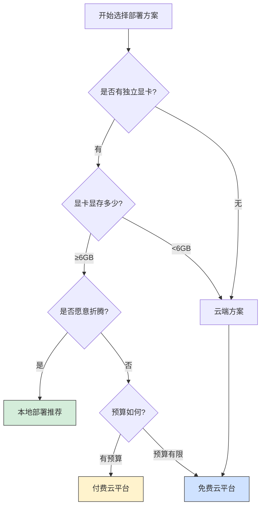
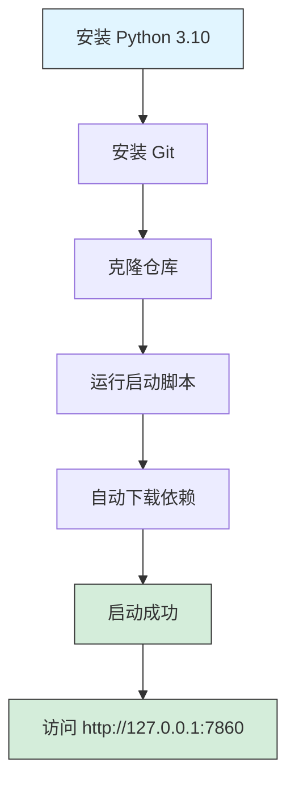
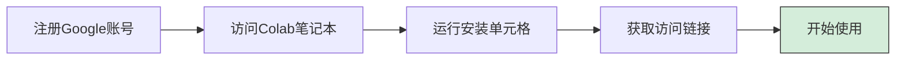
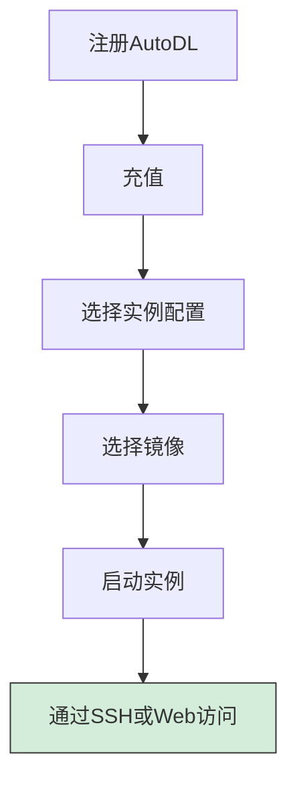
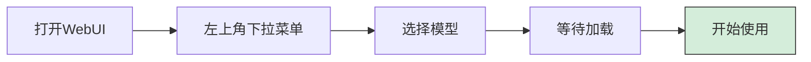
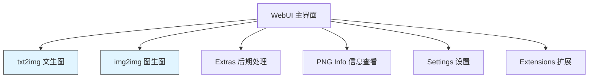

# Stable Diffusion 课程02 - 环境搭建

> **学习时间**：3-7天
> **难度级别**：⭐⭐⭐ 中等

## 课程目标

通过本课程的学习，你将能够：

- ✅ 根据自己的硬件条件选择合适的部署方案
- ✅ 成功安装并运行 Stable Diffusion WebUI
- ✅ 下载并配置模型文件
- ✅ 熟悉 WebUI 的基本界面和功能
- ✅ 生成第一张 AI 绘画作品

## 1. 选择部署方案

### 1.1 方案决策流程



### 1.2 本地部署 vs 云端使用

| 对比维度 | 本地部署 | 云端使用 |
|---------|---------|---------|
| **硬件要求** | ⚠️ NVIDIA 显卡 6GB+ | ✅ 无要求 |
| **初始成本** | 💰💰💰 硬件投资 | ✅ 免费或低成本起步 |
| **使用成本** | ✅ 一次投入，免费使用 | 💰 按时/按量计费 |
| **速度** | ⚡ 快（取决于硬件） | ⚠️ 受网络和排队影响 |
| **隐私性** | ⭐⭐⭐⭐⭐ 完全私密 | ⭐⭐ 数据上云 |
| **扩展性** | ⭐⭐⭐⭐⭐ 无限制 | ⭐⭐⭐ 平台限制 |
| **稳定性** | ⭐⭐⭐⭐ 自主控制 | ⭐⭐⭐ 依赖服务商 |
| **学习曲线** | ⚠️ 需要技术背景 | ✅ 简单易用 |

**推荐选择**：
- 🎯 **首选本地部署**：有合适显卡，希望长期使用
- 🎯 **首选云端**：无显卡、仅偶尔使用、快速体验

## 2. 本地部署方案

### 2.1 硬件要求

#### 最低配置

```
GPU: NVIDIA GTX 1060 6GB
CPU: i5 或同级别
RAM: 16GB
存储: 50GB 可用空间（SSD 推荐）
系统: Windows 10/11, Linux, macOS
```

**可运行但体验受限**：
- 图像分辨率：512x512
- 生成速度：较慢
- 可用功能：基础功能

#### 推荐配置

```
GPU: NVIDIA RTX 3060 12GB 或更高
CPU: i7 或同级别
RAM: 32GB
存储: 100GB SSD
系统: Windows 10/11, Linux
```

**流畅体验**：
- 图像分辨率：1024x1024
- 生成速度：快
- 可用功能：全部功能

#### 高端配置

```
GPU: NVIDIA RTX 4090 24GB
CPU: i9 或 AMD R9
RAM: 64GB+
存储: 500GB+ NVMe SSD
```

**极致体验**：
- 支持 SDXL 等大模型
- 可进行模型训练
- 多模型同时运行

### 2.2 WebUI 选择

#### AUTOMATIC1111 WebUI（强烈推荐）

**优点**：
- ✅ 功能最全面
- ✅ 插件生态最丰富
- ✅ 社区支持最好
- ✅ 文档最完善
- ✅ 更新最频繁

**缺点**：
- ⚠️ 界面较传统
- ⚠️ 启动速度一般

**安装流程**：



**详细步骤（Windows）**：

**Step 1：安装 Python**
```bash
# 下载 Python 3.10.6（推荐）
# 官网：https://www.python.org/downloads/

# 安装时务必勾选 "Add Python to PATH"
```

**Step 2：安装 Git**
```bash
# 下载 Git
# 官网：https://git-scm.com/download/win

# 默认安装即可
```

**Step 3：克隆仓库**
```bash
# 打开命令提示符（CMD）或 PowerShell
# 选择一个目录，例如 D:\AI\

git clone https://github.com/AUTOMATIC1111/stable-diffusion-webui.git
cd stable-diffusion-webui
```

**Step 4：运行启动脚本**
```bash
# Windows 用户
webui-user.bat

# 首次运行会自动下载依赖，需要等待 10-30 分钟
# 取决于网络速度
```

**Step 5：访问界面**
```
打开浏览器，访问：
http://127.0.0.1:7860
```

**详细步骤（Linux/Mac）**：

```bash
# 安装依赖
sudo apt-get install python3.10 python3.10-venv git

# 克隆仓库
git clone https://github.com/AUTOMATIC1111/stable-diffusion-webui.git
cd stable-diffusion-webui

# 运行
./webui.sh
```

#### ComfyUI（进阶选择）

**优点**：
- ✅ 节点式可视化工作流
- ✅ 性能优化更好
- ✅ 适合复杂流程

**缺点**：
- ⚠️ 学习曲线陡峭
- ⚠️ 初学者不友好

**建议**：等熟悉基础操作后再尝试

#### SD.Next（现代化选择）

**优点**：
- ✅ 界面更现代
- ✅ 性能优化
- ✅ 功能持续更新

**缺点**：
- ⚠️ 社区相对较小
- ⚠️ 插件较少

### 2.3 常见问题解决

#### Q1: 显存不足错误

**问题表现**：
```
RuntimeError: CUDA out of memory
```

**解决方案**：
```bash
# 编辑 webui-user.bat（Windows）
set COMMANDLINE_ARGS=--medvram

# 显存小于 6GB 使用
set COMMANDLINE_ARGS=--lowvram

# 或完全使用 CPU（非常慢）
set COMMANDLINE_ARGS=--use-cpu all
```

#### Q2: 下载依赖失败

**解决方案**：
```bash
# 使用国内镜像源
# 编辑 webui-user.bat，添加：
set PIP_INDEX_URL=https://pypi.tuna.tsinghua.edu.cn/simple
```

#### Q3: 启动后无法访问

**检查清单**：
- ✓ 防火墙是否拦截
- ✓ 端口 7860 是否被占用
- ✓ 是否有报错信息

**解决**：
```bash
# 更换端口
set COMMANDLINE_ARGS=--port 7861

# 允许远程访问
set COMMANDLINE_ARGS=--listen
```

## 3. 云端部署方案

### 3.1 免费/低成本选项

#### Google Colab

**特点**：
- ✅ 免费 GPU 额度（T4）
- ✅ 适合初学者体验
- ⚠️ 会话时长限制（12小时）
- ⚠️ 存储空间有限

**使用步骤**：


**推荐笔记本**：
- [AUTOMATIC1111 Colab](https://colab.research.google.com/) - 搜索 "stable diffusion webui colab"

#### Kaggle Notebooks

**特点**：
- ✅ 每周 30 小时免费 GPU
- ✅ 稳定性较好
- ✅ 存储空间较大

**使用步骤**：
1. 注册 Kaggle 账号
2. 创建新笔记本
3. 启用 GPU
4. 安装 Stable Diffusion

### 3.2 付费云平台

#### AutoDL（国内推荐）

**特点**：
- ⚡ 速度快（国内服务器）
- 💰 价格实惠（约 ¥2-5/小时）
- 🎯 专为 AI 优化
- 📦 预装环境可选

**使用流程**：


**推荐配置**：
- GPU: RTX 3080 或 RTX 4090
- 镜像: Stable Diffusion 专用镜像

#### Vast.ai（国际平台）

**特点**：
- 💰 价格灵活（竞价模式）
- 🌍 GPU 选择丰富
- ⚠️ 需要一定英文基础

**适合**：
- 预算有限的用户
- 需要临时大算力

## 4. 模型下载与配置

### 4.1 模型文件目录结构

```
stable-diffusion-webui/
├── models/
│   ├── Stable-diffusion/     # Checkpoint 模型
│   │   ├── model1.safetensors
│   │   └── model2.ckpt
│   ├── VAE/                   # VAE 文件
│   │   └── vae-ft-mse-840000.safetensors
│   ├── Lora/                  # LoRA 模型
│   │   ├── lora1.safetensors
│   │   └── lora2.safetensors
│   └── embeddings/            # Embeddings
│       └── embedding1.pt
```

### 4.2 主流模型下载平台

#### Civitai（推荐）

**网址**：https://civitai.com/

**特点**：
- 🎨 最大的模型分享平台
- 📊 有评分和评论系统
- 🖼️ 可预览生成效果
- 📝 提供提示词参考

**下载步骤**：


**推荐新手模型**：
- **Realistic Vision V5**（写实）
- **Anything V5**（二次元）
- **DreamShaper**（通用）
- **ChilloutMix**（写实人像）

#### Hugging Face（官方）

**网址**：https://huggingface.co/

**特点**：
- 📦 官方模型仓库
- ✅ 安全可靠
- 🔬 最新研究模型

**推荐模型**：
- `runwayml/stable-diffusion-v1-5`
- `stabilityai/stable-diffusion-xl-base-1.0`

#### 吐司网（国内）

**网址**：https://tusiart.com/

**特点**：
- 🇨🇳 中文界面
- ⚡ 国内访问快
- 🎯 中文模型较多

### 4.3 模型安装配置

**Step 1：下载 Checkpoint 模型**

```bash
# 从 Civitai 下载模型文件（.safetensors 或 .ckpt）
# 推荐 .safetensors 格式（更安全）

# 放入目录
stable-diffusion-webui/models/Stable-diffusion/
```

**Step 2：下载 VAE（可选但推荐）**

```bash
# 下载 VAE 文件
# 推荐：vae-ft-mse-840000-ema-pruned.safetensors

# 放入目录
stable-diffusion-webui/models/VAE/
```

**Step 3：在 WebUI 中选择模型**



### 4.4 推荐初始配置

**新手推荐组合**：

```
Checkpoint: DreamShaper 8
VAE: vae-ft-mse-840000
图像尺寸: 512x512
采样器: DPM++ 2M Karras
采样步数: 30
CFG Scale: 7
```

## 5. 界面功能介绍

### 5.1 主要标签页



**txt2img（文生图）**：
- 通过提示词生成图像
- 最常用的功能

**img2img（图生图）**：
- 基于参考图生成
- 局部重绘
- 图像风格转换

**Extras（后期处理）**：
- 图像放大
- 面部修复

**Extensions（扩展）**：
- 安装插件
- 管理扩展

### 5.2 txt2img 界面详解

**核心参数区域**：
1. **Prompt**：正面提示词输入框
2. **Negative Prompt**：负面提示词输入框
3. **Sampling Method**：采样方法选择
4. **Steps**：采样步数
5. **Width/Height**：图像尺寸
6. **CFG Scale**：提示词相关性
7. **Seed**：随机种子

## 6. 生成第一张图片

### 6.1 快速开始

**Step 1：输入提示词**
```
Prompt:
a beautiful landscape, mountains, lake, sunset,
colorful sky, peaceful, highly detailed, 8k

Negative Prompt:
low quality, blurry, text, watermark
```

**Step 2：设置基础参数**
```
Sampling Method: DPM++ 2M Karras
Steps: 30
Width: 512
Height: 512
CFG Scale: 7
Seed: -1
```

**Step 3：点击 Generate**

等待生成完成（通常 10-60 秒）

**Step 4：查看结果**

- 满意：保存图片
- 不满意：调整提示词或参数重新生成

### 6.2 参数实验

**实验1：改变采样步数**
```
固定其他参数，分别尝试：
Steps: 20, 30, 50
观察质量变化
```

**实验2：改变 CFG Scale**
```
固定其他参数，分别尝试：
CFG: 5, 7, 9, 12
观察与提示词的贴合度
```

**实验3：固定种子**
```
生成一张满意的图
记录 Seed 值
修改提示词，使用相同 Seed
观察变化
```

## 课后实践

### 任务清单

- [ ] 根据自己的硬件条件选择并完成环境搭建
- [ ] 成功安装并启动 WebUI
- [ ] 下载至少 2 个不同风格的模型（1个写实 + 1个二次元）
- [ ] 下载并配置 VAE
- [ ] 使用每个模型生成至少 5 张图片
- [ ] 尝试调整不同参数，记录效果差异
- [ ] 保存一组参数配置作为你的"基础模板"

### 故障排查

**问题收集表**：
| 问题 | 现象 | 尝试的解决方案 | 结果 |
|-----|------|--------------|-----|
|     |      |              |     |

### 推荐练习

**练习1：模型对比**
- 使用相同提示词
- 在不同模型上生成
- 对比风格差异

**练习2：参数探索**
- 固定提示词和模型
- 系统性地调整各个参数
- 记录最佳参数组合

**练习3：提示词迭代**
- 从简单提示词开始
- 逐步添加细节
- 观察图像变化

## 下节预告

**课程03：基础使用**

下节课我们将深入学习：
- 📝 提示词编写技巧和最佳实践
- ⚙️ 各项参数的详细作用和调优方法
- 🎨 如何选择合适的模型和 VAE
- 🔄 建立高效的创作工作流程

---

> 💡 **重要提示**：环境搭建可能会遇到各种问题，这很正常。善用搜索引擎和社区论坛，大部分问题都有现成的解决方案。

> ⏰ **时间建议**：不要在环境搭建上花费过多时间。如果本地安装困难，可以先用云平台体验，熟悉操作后再回来解决本地部署问题。

> 🎯 **学习重点**：成功运行 WebUI + 生成第一张图 = 本课程完成！
