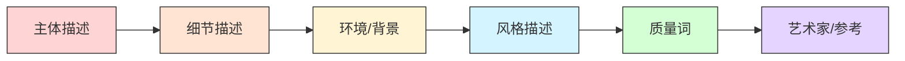
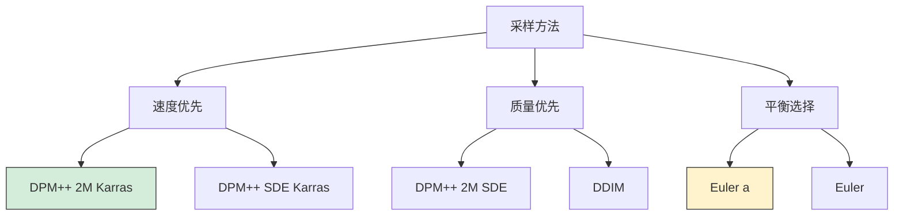
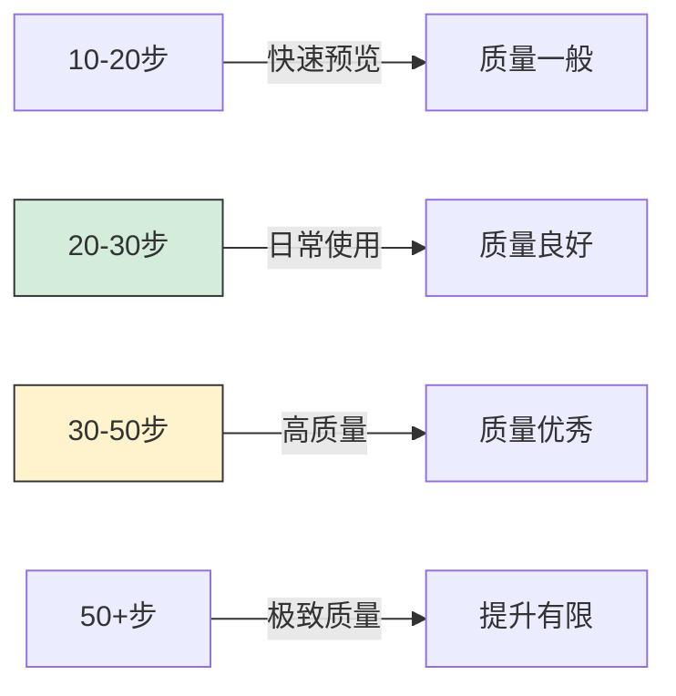
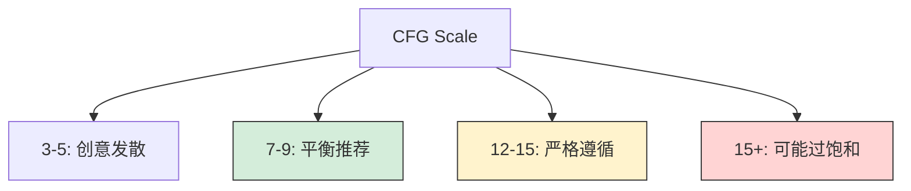
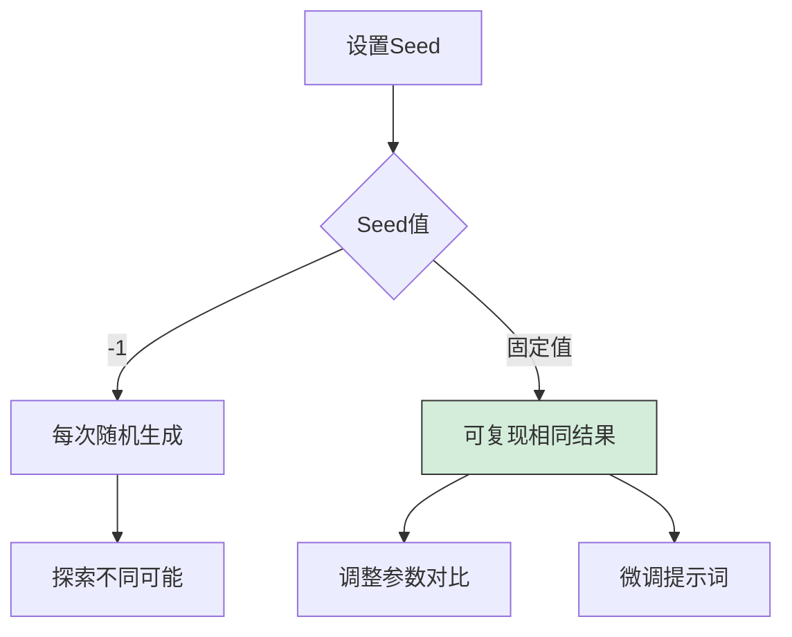
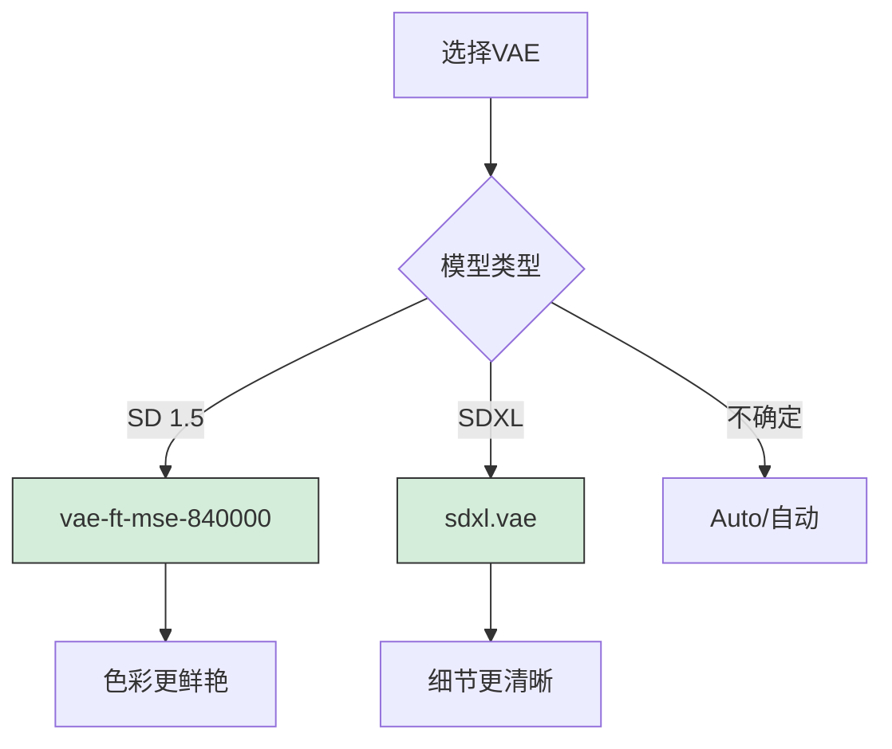
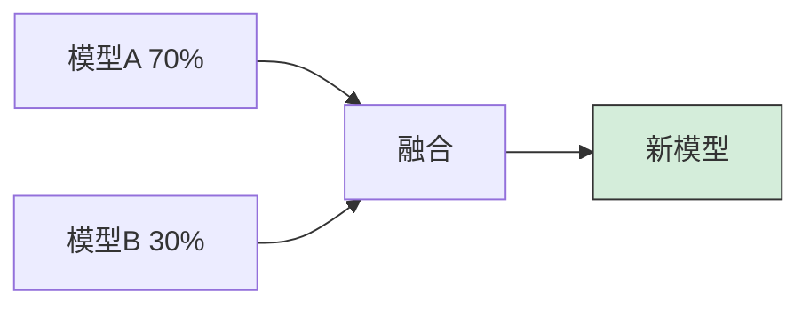
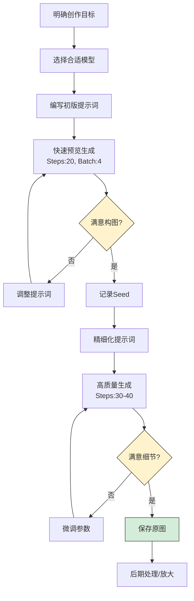

# Stable Diffusion 课程03 - 基础使用

> **学习时间**：2-4周
> **难度级别**：⭐⭐⭐⭐ 较高

## 课程目标

通过本课程的学习，你将能够：

- ✅ 掌握高质量提示词的编写技巧
- ✅ 理解各项生成参数的作用和调优方法
- ✅ 根据需求选择合适的模型和配置
- ✅ 建立稳定高效的创作工作流
- ✅ 能够持续优化生成结果直至满意

## 1. 提示词编写技巧

### 1.1 提示词基本结构



**标准格式**：
```
[主体], [细节], [环境], [风格], [质量词], [艺术家]
```

### 1.2 提示词案例分析

#### 案例1：基础风景

**简单版本**：
```
mountain, lake, sunset
```

**优化版本**：
```
majestic snow-capped mountains, crystal clear alpine lake,
golden sunset sky with orange and pink clouds,
peaceful atmosphere, nature photography,
highly detailed, 8k uhd, professional photograph
```

**改进要点**：
- ✅ 添加形容词（majestic, crystal clear）
- ✅ 具体化描述（snow-capped, alpine）
- ✅ 增加环境细节（golden sunset, orange clouds）
- ✅ 指定风格（nature photography）
- ✅ 添加质量词（highly detailed, 8k）

#### 案例2：人物肖像

**简单版本**：
```
a girl, long hair, smiling
```

**优化版本**：
```
1girl, solo, beautiful detailed face, long flowing silver hair,
sapphire blue eyes, gentle smile, elegant white dress,
soft natural lighting, bokeh background,
portrait photography, shallow depth of field,
high resolution, masterpiece, best quality,
by Annie Leibovitz
```

**改进要点**：
- ✅ 使用专业术语（1girl, solo）
- ✅ 详细的外观描述（sapphire blue eyes）
- ✅ 服装细节（elegant white dress）
- ✅ 光线效果（soft natural lighting）
- ✅ 摄影技术（shallow depth of field）
- ✅ 参考艺术家（Annie Leibovitz）

#### 案例3：二次元角色

**标准写法**：
```
1girl, solo, anime style,
beautiful detailed face, large expressive eyes, small nose,
long pink hair with twin tails, hair ornament,
cute smile, blush,
white school uniform, red ribbon,
standing pose, hand on hip,
cherry blossoms background, petals floating,
soft pastel colors, cel shading,
masterpiece, best quality, highly detailed,
official art
```

### 1.3 提示词权重控制

#### 语法规则

| 语法 | 权重倍数 | 示例 | 说明 |
|------|---------|------|-----|
| `(keyword)` | 1.1 | `(blue eyes)` | 增加一层括号 |
| `((keyword))` | 1.21 | `((detailed face))` | 增加两层括号 |
| `(keyword:1.5)` | 1.5 | `(red dress:1.3)` | 精确控制 |
| `[keyword]` | 0.9 | `[background]` | 降低权重 |
| `\(keyword\)` | 1.0 | `\(text\)` | 转义，显示括号 |

#### 权重实践技巧

**适度增强重要元素**：
```
a beautiful girl, (detailed face:1.2), (blue eyes:1.1),
long hair, white dress
```

**压制不重要元素**：
```
1girl, detailed portrait, [simple background],
[minimal accessories]
```

**组合使用**：
```
(masterpiece:1.4), (best quality:1.4),
1girl, ((extremely detailed face)),
(beautiful eyes:1.2), [plain background:0.8]
```

⚠️ **注意事项**：
- 不要过度使用高权重（>1.5）
- 权重过高可能导致画面失真
- 优先通过优化描述而非权重来改善效果

### 1.4 提示词进阶技巧

#### 技巧1：分步混合（Prompt Editing）

**语法**：`[keyword1:keyword2:step]`

**示例**：
```
a girl [standing:dancing:0.5]
```
**效果**：前50%步数生成"standing"，后50%生成"dancing"

#### 技巧2：提示词交替

**语法**：`[keyword1|keyword2]`

**示例**：
```
a [cat|dog] in the garden
```
**效果**：每步在 cat 和 dog 之间交替

#### 技巧3：负面提示词策略

**通用负面提示词模板**：

```
# 质量相关
low quality, worst quality, bad quality, lowres,
jpeg artifacts, blurry, out of focus

# 解剖错误
bad anatomy, bad proportions, bad hands, bad feet,
missing fingers, extra fingers, mutated hands,
poorly drawn hands, poorly drawn face

# 不想要的元素
text, watermark, signature, logo, artist name,
username, error, cropped

# 特定场景
(仅写实风格) unrealistic, anime, cartoon, painting,
illustration, drawing
```

**场景化负面提示词**：

人物肖像：
```
deformed, ugly, mutilated, disfigured,
poorly drawn eyes, asymmetric eyes,
long neck, cross-eyed
```

风景照片：
```
people, person, human, text, oversaturated,
artificial, fake looking
```

### 1.5 常用质量词库

#### 正面质量词

**通用**：
```
masterpiece, best quality, high quality, highres,
ultra detailed, highly detailed, extremely detailed,
professional, 8k uhd, 4k
```

**写实风格**：
```
photorealistic, realistic, photo-realistic,
detailed skin texture, detailed fabric texture,
sharp focus, ray tracing, professional photograph
```

**艺术风格**：
```
artistic, painterly, brushstrokes, oil painting,
watercolor, digital art, concept art,
artstation, trending on artstation
```

**光线效果**：
```
cinematic lighting, dramatic lighting, studio lighting,
soft lighting, natural lighting, volumetric lighting,
rim lighting, god rays
```

#### 负面质量词

```
low quality, worst quality, bad quality, normal quality,
lowres, low resolution, low details,
blurry, blur, out of focus, unfocused,
jpeg artifacts, compression artifacts,
noise, grainy, pixelated
```

## 2. 生成参数详解

### 2.1 采样方法（Sampling Method）



#### 主流采样器对比

| 采样器 | 速度 | 质量 | 稳定性 | 适用场景 | 推荐步数 |
|--------|-----|------|--------|---------|---------|
| **DPM++ 2M Karras** | ⚡⚡⚡ | ⭐⭐⭐⭐ | ⭐⭐⭐⭐ | 🎯 **通用推荐** | 20-30 |
| **DPM++ SDE Karras** | ⚡⚡ | ⭐⭐⭐⭐⭐ | ⭐⭐⭐ | 追求质量 | 25-35 |
| **Euler a** | ⚡⚡⚡ | ⭐⭐⭐ | ⭐⭐ | 创意探索 | 20-40 |
| **Euler** | ⚡⚡⚡ | ⭐⭐⭐ | ⭐⭐⭐⭐ | 稳定生成 | 20-30 |
| **DDIM** | ⚡⚡ | ⭐⭐⭐⭐ | ⭐⭐⭐⭐⭐ | 图生图/inpainting | 30-50 |
| **LMS** | ⚡ | ⭐⭐⭐⭐⭐ | ⭐⭐⭐⭐ | 极致质量 | 50-100 |

**推荐选择**：
- 🎯 **日常使用**：DPM++ 2M Karras（20-30步）
- 🎨 **创作探索**：Euler a（30-40步）
- 🔄 **图生图**：DDIM（30-50步）
- ⚡ **快速预览**：DPM++ 2M Karras（15-20步）

### 2.2 采样步数（Steps）



**步数选择指南**：

| 步数范围 | 生成时间 | 质量 | 适用场景 |
|---------|---------|-----|---------|
| 10-15步 | 5-10秒 | ⭐⭐ | 快速测试提示词 |
| 20-25步 | 10-15秒 | ⭐⭐⭐ | 快速预览 |
| 25-35步 | 15-25秒 | ⭐⭐⭐⭐ | **日常创作（推荐）** |
| 35-50步 | 25-40秒 | ⭐⭐⭐⭐⭐ | 高质量出图 |
| 50+步 | 40秒+ | ⭐⭐⭐⭐⭐ | 追求极致 |

💡 **优化建议**：
- 超过50步后提升有限
- 建议在30步左右找平衡
- 不同采样器最佳步数不同

### 2.3 CFG Scale（提示词相关性）



**CFG Scale 对比**：

| CFG值 | 效果 | 适用场景 | 风险 |
|------|-----|---------|-----|
| 3-5 | 🎨 创意发散，可能偏离提示词 | 探索新想法 | 可能不符合预期 |
| 5-7 | 📐 有一定自由度 | 风格化创作 | 结果不够精确 |
| 7-9 | ✅ **平衡（推荐）** | 日常使用 | - |
| 9-12 | 🎯 严格遵循提示词 | 精确控制 | - |
| 12-15 | ⚠️ 非常严格 | 特定需求 | 可能过饱和 |
| 15+ | ❌ 过度强化 | 不推荐 | 色彩失真 |

**实践建议**：
- 🎯 默认值：7-8
- 🎨 艺术创作：6-7
- 📸 写实照片：7-9
- 🎭 二次元：8-11

### 2.4 图像尺寸选择

#### SD 1.5 标准尺寸

| 比例 | 尺寸 | 用途 | 显存需求 |
|-----|------|------|---------|
| 1:1 | 512x512 | 头像、图标 | 🟢 低（2GB+） |
| 2:3 | 512x768 | 人物肖像 | 🟡 中（4GB+） |
| 3:2 | 768x512 | 风景横图 | 🟡 中（4GB+） |
| 9:16 | 512x896 | 手机壁纸 | 🟠 较高（6GB+） |
| 16:9 | 896x512 | 桌面壁纸 | 🟠 较高（6GB+） |

#### SDXL 标准尺寸

| 比例 | 尺寸 | 用途 | 显存需求 |
|-----|------|------|---------|
| 1:1 | 1024x1024 | 通用 | 🟠 较高（8GB+） |
| 2:3 | 832x1216 | 肖像 | 🟠 较高（8GB+） |
| 3:2 | 1216x832 | 风景 | 🟠 较高（8GB+） |
| 9:16 | 768x1344 | 竖版海报 | 🔴 高（10GB+） |
| 16:9 | 1344x768 | 横版海报 | 🔴 高（10GB+） |

⚠️ **重要提示**：
- 不要使用非标准尺寸（可能导致画面变形）
- 更大尺寸≠更好质量
- 显存不足时优先降低尺寸
- 可先生成小图，再用高清修复放大

### 2.5 随机种子（Seed）



**Seed 使用技巧**：

**场景1：探索阶段**
```
Seed: -1
目的：生成多样化结果，寻找满意构图
```

**场景2：优化阶段**
```
Seed: 12345678（固定）
目的：保持构图，调整提示词细节
```

**场景3：批量生成**
```
Seed: -1
Batch count: 4-8
目的：一次生成多张，选择最佳
```

**实用组合**：
```
1. 用 Seed: -1 生成多张
2. 选择满意的，记录其 Seed
3. 固定该 Seed，微调提示词
4. 达到理想效果
```

## 3. 模型选择与搭配

### 3.1 Checkpoint 模型分类

#### 写实模型推荐

| 模型名称 | 特点 | 适用场景 | 推荐指数 |
|---------|-----|---------|---------|
| **Realistic Vision V5** | 真实感强，人物自然 | 人物摄影 | ⭐⭐⭐⭐⭐ |
| **ChilloutMix** | 亚洲面孔，网红风格 | 时尚摄影 | ⭐⭐⭐⭐⭐ |
| **DreamShaper** | 通用性好，风格多样 | 通用场景 | ⭐⭐⭐⭐ |
| **Majicmix Realistic** | 高质量，细节丰富 | 商业摄影 | ⭐⭐⭐⭐ |

**推荐参数**：
```
Sampling: DPM++ 2M Karras
Steps: 25-30
CFG: 7-8
Size: 512x768
```

#### 二次元模型推荐

| 模型名称 | 特点 | 风格 | 推荐指数 |
|---------|-----|-----|---------|
| **Anything V5** | 通用性强，质量稳定 | 标准动漫 | ⭐⭐⭐⭐⭐ |
| **AbyssOrangeMix** | 色彩鲜艳，风格化 | 厚涂风格 | ⭐⭐⭐⭐ |
| **Counterfeit V3** | 清新风格，细节好 | 轻小说风 | ⭐⭐⭐⭐⭐ |
| **GhostMix** | 幽灵系，独特风格 | 暗黑风格 | ⭐⭐⭐⭐ |

**推荐参数**：
```
Sampling: Euler a 或 DPM++ 2M Karras
Steps: 25-35
CFG: 8-11
Size: 512x768
```

#### 2.5D / 半写实模型

| 模型名称 | 特点 | 适用场景 |
|---------|-----|---------|
| **Deliberate** | 介于写实和二次元之间 | 插画、概念图 |
| **RevAnimated** | 动画感+真实感 | 游戏角色 |
| **MeinaMix** | 精致，偏可爱风格 | 角色设计 |

### 3.2 VAE 配置



**VAE 作用对比**：

**不使用 VAE**：
- 色彩偏灰暗
- 细节可能模糊
- 眼睛不够明亮

**使用 VAE**：
- 色彩饱和度提升
- 细节更清晰
- 眼睛更有神

**配置方法**：
1. 下载 VAE 文件到 `models/VAE/` 目录
2. Settings → Stable Diffusion → SD VAE
3. 选择对应的 VAE
4. 重启 WebUI 或点击 Apply

### 3.3 模型混合技巧

**Checkpoint Merger（模型融合）**：



**使用场景**：
- 结合两个模型的优点
- 创造独特风格
- 微调风格倾向

**操作步骤**：
1. WebUI → Checkpoint Merger 标签页
2. 选择两个模型
3. 设置混合比例（如 0.7）
4. 选择插值方法（推荐 Weighted sum）
5. 点击 Merge 生成新模型

## 4. 工作流程最佳实践

### 4.1 标准创作流程



### 4.2 提示词迭代策略

**第1轮：基础构图**
```
Prompt: a girl, garden, flowers
Negative: low quality
Steps: 20
Batch: 4
```

**第2轮：添加细节**
```
Prompt: 1girl, beautiful face, long hair, white dress,
        standing in a garden, colorful flowers, sunlight
Negative: low quality, bad anatomy
Steps: 25
固定满意的 Seed
```

**第3轮：风格化**
```
Prompt: 1girl, beautiful detailed face, flowing long hair,
        elegant white dress, lace details,
        standing in a magical garden, roses and tulips,
        soft golden hour lighting, dreamy atmosphere,
        professional photography, bokeh
Negative: low quality, bad anatomy, bad hands, blurry
Steps: 30
微调 CFG Scale
```

**第4轮：质量提升**
```
Prompt: (masterpiece:1.2), (best quality:1.2),
        1girl, (extremely detailed face:1.1),
        beautiful blue eyes, soft smile,
        long flowing silver hair, hair flowing in wind,
        (elegant white dress:1.1), intricate lace,
        standing gracefully in an enchanted garden,
        blooming roses, tulips, petals flying,
        (soft golden hour lighting:1.1), warm colors,
        bokeh background, shallow depth of field,
        professional portrait photography, 8k uhd
Negative: (low quality:1.3), (worst quality:1.3),
          bad anatomy, bad hands, bad fingers,
          blurry, out of focus, text, watermark
Steps: 35-40
```

### 4.3 参数配置模板

#### 模板1：人物肖像（写实）

```
Model: Realistic Vision V5
VAE: vae-ft-mse-840000
Sampling: DPM++ 2M Karras
Steps: 28
CFG Scale: 7.5
Size: 512x768

Prompt Template:
(masterpiece:1.2), (best quality:1.2),
professional portrait photography,
[具体人物描述],
[光线和环境],
8k uhd, sharp focus, high detail

Negative Template:
(low quality:1.3), (worst quality:1.3),
bad anatomy, deformed, ugly,
blurry, watermark, text
```

#### 模板2：二次元角色

```
Model: Anything V5
VAE: vae-ft-mse-840000
Sampling: DPM++ 2M Karras
Steps: 30
CFG Scale: 9
Size: 512x768

Prompt Template:
masterpiece, best quality, highly detailed,
1girl, anime style,
[角色描述],
[服装描述],
[场景描述],
official art, illustration

Negative Template:
low quality, worst quality, bad quality,
bad anatomy, bad hands,
text, watermark, signature,
realistic, 3d
```

#### 模板3：场景风景

```
Model: DreamShaper
VAE: vae-ft-mse-840000
Sampling: DPM++ 2M Karras
Steps: 25
CFG Scale: 7
Size: 768x512

Prompt Template:
(masterpiece:1.2), beautiful landscape,
[主体景物],
[天气/时间],
[氛围描述],
nature photography, 8k uhd,
highly detailed, cinematic

Negative Template:
low quality, blurry, text,
people, person, human,
oversaturated, artificial
```

## 课后实践

### 实践任务

#### 任务1：提示词训练（必做）

**目标**：掌握提示词编写技巧

1. 选择一个主题（人物/风景/建筑）
2. 从简单提示词开始（5个词）
3. 每次添加 3-5 个描述词
4. 生成至少 5 个版本
5. 记录每次改进的效果

**记录表格**：
| 版本 | 提示词 | 效果评分 | 改进点 |
|-----|--------|---------|--------|
| V1  |        |         |        |
| V2  |        |         |        |

#### 任务2：参数实验（必做）

**实验A：采样器对比**
- 固定提示词和其他参数
- 尝试 5 种不同采样器
- 对比速度和质量

**实验B：步数测试**
- 使用 DPM++ 2M Karras
- 分别测试 15, 20, 25, 30, 40, 50 步
- 记录质量提升曲线

**实验C：CFG Scale 影响**
- 固定其他参数
- 测试 CFG: 5, 7, 9, 11, 13
- 观察对提示词的遵循程度

#### 任务3：模型探索（推荐）

1. 下载 3 个不同风格的模型
2. 使用相同提示词生成
3. 对比各模型的特点
4. 选择最适合自己的模型

### 挑战项目

**项目1：创建角色设定**
- 设计一个原创角色
- 编写详细的提示词
- 生成至少 10 张不同姿势/表情
- 保持角色一致性

**项目2：系列场景**
- 选择一个主题（如四季、一天的不同时刻）
- 创建 4-6 张系列图
- 保持风格统一

**项目3：提示词库建设**
- 收集 50+ 高质量提示词片段
- 分类整理（人物、背景、风格、质量词等）
- 建立个人提示词数据库

## 5. 常见问题解决

### 问题1：生成的手部畸形

**原因**：SD 对手部结构理解不足

**解决方案**：
1. 负面提示词加入 `bad hands, bad fingers`
2. 降低手部在画面中的比重
3. 使用特定 LoRA（如 GoodHands）
4. 生成后用 inpainting 修复
5. 使用 ControlNet OpenPose 控制

### 问题2：画面模糊不清

**检查清单**：
- [ ] 是否使用了 VAE？
- [ ] 采样步数是否足够（建议25+）？
- [ ] 负面提示词是否包含 `blurry`？
- [ ] 是否添加了清晰度质量词（sharp focus）？
- [ ] 模型本身质量如何？

### 问题3：颜色异常/偏色

**可能原因**：
- VAE 未正确加载
- 模型本身问题
- CFG Scale 过高

**解决方案**：
1. 检查 VAE 设置
2. 尝试其他 VAE
3. 降低 CFG Scale
4. 更换模型

### 问题4：生成结果与提示词不符

**优化方向**：
1. 增加关键词权重 `(keyword:1.2)`
2. 提高 CFG Scale（8-11）
3. 使用更精确的描述词
4. 检查负面提示词是否冲突
5. 尝试更换采样器

### 问题5：批量生成质量参差不齐

**解决方案**：
1. 使用固定 Seed 保证稳定性
2. 适当提高采样步数
3. 优化提示词的精确度
4. 提高 CFG Scale
5. 增加质量相关的提示词权重

## 下节预告

**课程04：进阶技巧**

下节课我们将学习：
- 🎮 ControlNet 的使用和应用
- 🎨 LoRA 模型的选择和组合
- 🖼️ 图生图工作流程
- ⬆️ 高清放大技巧
- 🔧 常用插件推荐和使用

---

> 💡 **学习建议**：基础使用是最重要的阶段，务必多实践。掌握好提示词编写和参数调优，后续的进阶学习会轻松很多。

> 📊 **预期成果**：完成本课程后，你应该能够稳定生成符合预期的高质量图像。

> ⏰ **投入时间**：建议每天至少生成 20-30 张图，持续练习 2-4 周。
