# Stable Diffusion 课程04 - 进阶技巧

> **学习时间**：4-8周
> **难度级别**：⭐⭐⭐⭐⭐ 高

## 课程目标

通过本课程的学习，你将能够：

- ✅ 熟练使用 ControlNet 进行精确控制
- ✅ 掌握 LoRA 模型的选择和组合技巧
- ✅ 建立完整的图生图工作流程
- ✅ 掌握高清放大和细节优化方法
- ✅ 熟练使用常用插件提升创作效率

## 1. ControlNet 入门与应用

### 1.1 什么是 ControlNet

**定义**：ControlNet 是一个能够通过提供参考图像来精确控制生成结果的扩展插件。

**核心优势**：
- 🎯 精确控制画面构图和姿势
- 🖼️ 保持参考图的结构特征
- 🎨 可与提示词完美结合
- 🔄 支持多个 ControlNet 同时使用

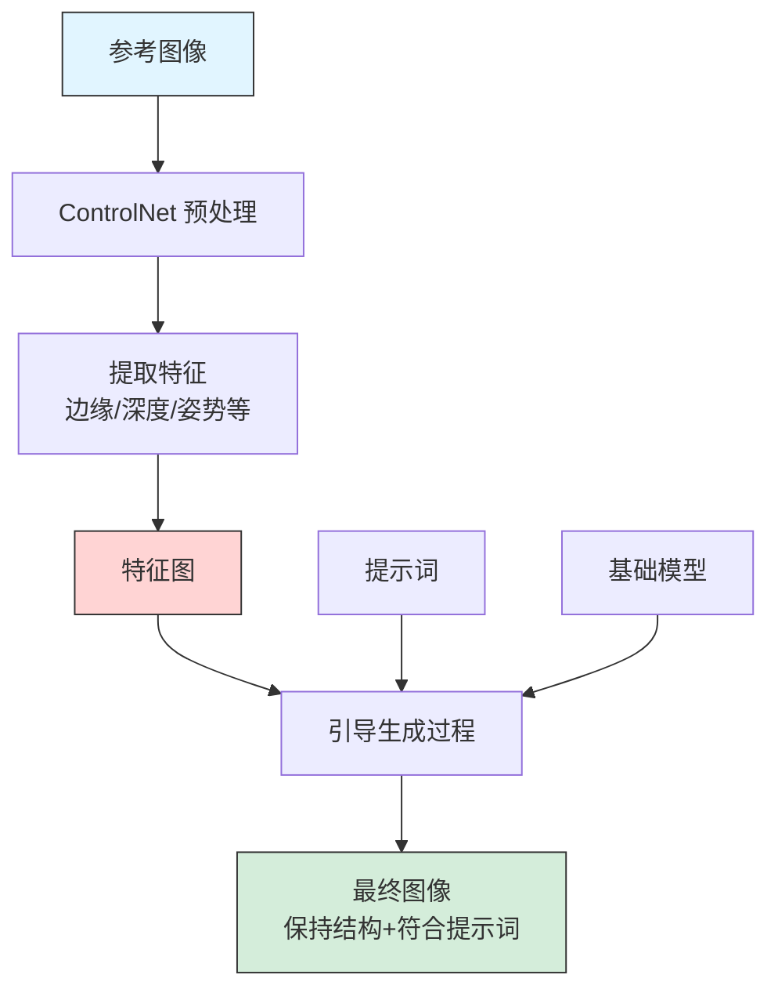

### 1.2 安装 ControlNet

**方法1：通过扩展管理器安装**

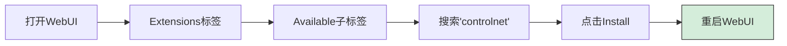

**方法2：手动安装**

```bash
cd stable-diffusion-webui/extensions
git clone https://github.com/Mikubill/sd-webui-controlnet.git
cd sd-webui-controlnet
pip install -r requirements.txt
```

**下载 ControlNet 模型**：

模型存放路径：
```
stable-diffusion-webui/extensions/sd-webui-controlnet/models/
```

推荐下载地址：
- [Hugging Face - lllyasviel/ControlNet](https://huggingface.co/lllyasviel/ControlNet/tree/main/models)
- [Hugging Face - lllyasviel/sd-controlnet-canny](https://huggingface.co/lllyasviel/sd-controlnet-canny)

### 1.3 常用 ControlNet 类型

#### 1. Canny（边缘检测）

**用途**：控制物体轮廓和线条

**适用场景**：
- 建筑设计保持轮廓
- 产品设计转换风格
- 线稿上色

**使用流程**：

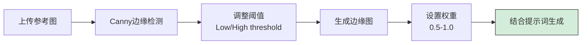

**参数设置**：
```
Preprocessor: canny
Model: control_v11p_sd15_canny
Weight: 0.8-1.0
Control Mode: Balanced
```

**示例提示词**：
```
Prompt:
modern architecture, glass building, futuristic design,
blue sky, professional photograph

Negative:
low quality, blurry

Settings:
- 上传建筑线稿图
- Canny 预处理
- Weight: 1.0
```

#### 2. Depth（深度图）

**用途**：控制画面的空间深度和层次

**适用场景**：
- 保持场景构图
- 改变风格但保持结构
- 3D到2D的转换

**使用流程**：

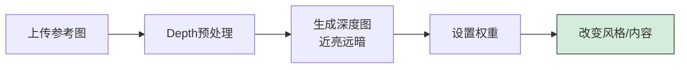

**参数设置**：
```
Preprocessor: depth_midas
Model: control_v11f1p_sd15_depth
Weight: 0.6-0.9
```

**实用案例**：
```
输入：室内照片
输出：相同构图的动漫风格室内

Prompt:
anime style, cozy bedroom, colorful, illustration

ControlNet:
- Preprocessor: depth_midas
- Weight: 0.8
```

#### 3. OpenPose（姿势检测）

**用途**：精确控制人物姿势和骨架

**适用场景**：
- 人物姿势参考
- 角色创作
- 动作设计

**使用流程**：

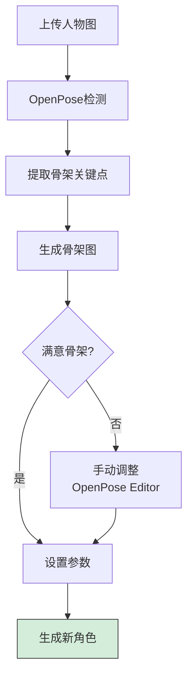

**参数设置**：
```
Preprocessor: openpose_full
Model: control_v11p_sd15_openpose
Weight: 0.7-1.0
```

**示例应用**：
```
场景：根据真人姿势生成动漫角色

步骤：
1. 上传真人摆姿势照片
2. OpenPose 检测骨架
3. 编写角色提示词
4. 生成

Prompt:
1girl, anime style, magical girl, pink hair,
colorful costume, dynamic pose, official art
```

#### 4. Lineart（线稿）

**用途**：线稿上色，保持线条结构

**适用场景**：
- 手绘线稿转完稿
- 漫画上色
- 插画创作

**预处理器选择**：
- `lineart`：通用线稿
- `lineart_anime`：动漫线稿（推荐）
- `lineart_realistic`：写实线稿

**参数设置**：
```
Preprocessor: lineart_anime
Model: control_v11p_sd15_lineart
Weight: 0.6-0.8
```

**示例工作流**：
```
1. 手绘角色线稿（黑白）
2. 扫描/拍照上传
3. 使用 lineart_anime 预处理
4. 编写上色提示词
5. 生成彩色完稿

Prompt:
1girl, anime coloring, vibrant colors,
cel shading, official anime art,
beautiful eyes, detailed hair
```

#### 5. Scribble（涂鸦）

**用途**：通过简单涂鸦控制构图

**适用场景**：
- 快速构图草图
- 创意探索
- 简单布局控制

**使用流程**：

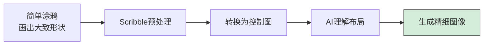

**参数设置**：
```
Preprocessor: scribble_pidinet
Model: control_v11p_sd15_scribble
Weight: 0.5-0.7
```

#### 6. Tile（瓦片/高清修复）

**用途**：图像超分辨率，细节增强

**适用场景**：
- 图像放大
- 细节修复
- 高清化处理

**使用方法**：
```
1. 上传要放大的图像
2. Tile ControlNet
3. 生成尺寸设为 2x 原图
4. 保持原始构图和风格
```

**参数设置**：
```
Preprocessor: tile_resample
Model: control_v11f1e_sd15_tile
Weight: 0.5-0.8
Resize Mode: Crop and Resize
```

### 1.4 多 ControlNet 组合使用

**常用组合**：

**组合1：OpenPose + Depth**
```
用途：精确控制人物姿势和场景深度

示例：
- Unit 0: OpenPose（控制姿势）weight: 1.0
- Unit 1: Depth（保持背景结构）weight: 0.6

效果：人物姿势精确，背景自然
```

**组合2：Canny + Tile**
```
用途：高质量放大并保持边缘

示例：
- Unit 0: Canny（保持轮廓）weight: 0.6
- Unit 1: Tile（细节增强）weight: 0.8

效果：清晰放大，边缘锐利
```

**组合3：Lineart + OpenPose**
```
用途：线稿上色 + 姿势控制

示例：
- Unit 0: Lineart（线稿结构）weight: 0.8
- Unit 1: OpenPose（姿势微调）weight: 0.5

效果：完美上色，姿势可控
```

### 1.5 ControlNet 实用技巧

**技巧1：权重调整策略**

```
0.3-0.5  微弱影响，仅作参考
0.5-0.7  中等强度，平衡创意
0.7-0.9  强控制，保持结构
0.9-1.0  严格控制，几乎复制
```

**技巧2：Control Mode 选择**

| 模式 | 说明 | 适用场景 |
|-----|------|---------|
| **Balanced** | 平衡 | 默认选择 |
| **My prompt is more important** | 提示词优先 | 想要更多创意 |
| **ControlNet is more important** | ControlNet 优先 | 严格控制结构 |

**技巧3：Preprocessor 参数调整**

以 Canny 为例：
```
Low Threshold: 100（检测弱边缘）
High Threshold: 200（检测强边缘）

低阈值 ↓ = 更多细节
高阈值 ↑ = 只保留主要轮廓
```

**技巧4：Reference-only模式**

```
不使用预处理器，直接参考图像：
- Preprocessor: none
- 直接上传参考图
- 风格和构图都会参考

适合：风格迁移、整体参考
```

## 2. LoRA 模型使用

### 2.1 LoRA 基础知识

**什么是 LoRA**：

LoRA (Low-Rank Adaptation) 是一种轻量级的模型微调文件，可以快速为基础模型添加特定的风格、角色或概念。

**LoRA vs Checkpoint**：

| 对比项 | LoRA | Checkpoint |
|--------|------|-----------|
| 文件大小 | 10-200 MB | 2-7 GB |
| 训练成本 | 低 | 高 |
| 灵活性 | 可组合使用 | 单独使用 |
| 效果强度 | 可调节 | 固定 |
| 训练难度 | 较容易 | 较难 |

### 2.2 LoRA 分类

#### 1. 角色 LoRA

**用途**：生成特定角色外观

**示例**：
```
<lora:specific_character:0.8>

1girl, [角色特征描述],
anime style, official art
```

**推荐权重**：0.6-1.0

#### 2. 风格 LoRA

**用途**：添加特定艺术风格

**示例**：
```
<lora:studio_ghibli_style:0.7>

landscape, nature, ghibli style,
soft colors, dreamy atmosphere
```

**推荐权重**：0.5-0.9

#### 3. 概念 LoRA

**用途**：添加特定概念或效果

**示例**：
```
<lora:blindbox_style:0.8>

cute character, chibi, toy style,
glossy finish, display box
```

#### 4. 服装/物品 LoRA

**用途**：特定服装或道具

**示例**：
```
<lora:hanfu_dress:0.7>

1girl, wearing traditional hanfu,
flowing sleeves, embroidered details
```

### 2.3 LoRA 使用方法

**基本语法**：
```
<lora:lora_name:weight>
```

**使用示例**：
```
Prompt:
<lora:add_detail:0.5> <lora:good_hands:0.7>
1girl, beautiful face, detailed eyes,
long hair, white dress,
masterpiece, best quality

说明：
- add_detail (0.5): 增强细节
- good_hands (0.7): 改善手部
```

**权重选择指南**：

```
0.3-0.5  微弱影响，轻微风格
0.5-0.7  中等强度，明显但不过分
0.7-1.0  强烈影响，风格显著
1.0-1.5  非常强烈，可能过度
```

### 2.4 推荐 LoRA 列表

#### 质量增强类

| LoRA 名称 | 作用 | 权重推荐 |
|----------|------|---------|
| **Add Detail** | 整体细节增强 | 0.3-0.6 |
| **Detail Tweaker** | 细节微调 | 0.5-0.8 |
| **More Details** | 更多细节 | 0.4-0.7 |

#### 修复类

| LoRA 名称 | 作用 | 权重推荐 |
|----------|------|---------|
| **GoodHands** | 改善手部生成 | 0.6-0.8 |
| **Bad Hands Fix** | 修复手部问题 | 0.5-0.7 |
| **Perfect Eyes** | 优化眼睛细节 | 0.4-0.6 |

#### 风格类

| LoRA 名称 | 作用 | 权重推荐 |
|----------|------|---------|
| **Blindbox** | 盲盒玩具风格 | 0.7-1.0 |
| **Studio Ghibli** | 吉卜力风格 | 0.6-0.9 |
| **Cyberpunk** | 赛博朋克风格 | 0.6-0.8 |
| **Oil Painting** | 油画风格 | 0.5-0.8 |

### 2.5 多 LoRA 组合

**组合策略**：

```
<lora:style_lora:0.8> <lora:character_lora:0.9> <lora:add_detail:0.5>

说明：
1. 风格 LoRA (0.8): 定义整体风格
2. 角色 LoRA (0.9): 确定角色特征
3. 细节 LoRA (0.5): 增强细节

权重总和建议不超过 2.5
```

**实用组合案例**：

**组合1：高质量人物**
```
<lora:add_detail:0.5> <lora:good_hands:0.7>
```

**组合2：特定风格角色**
```
<lora:ghibli_style:0.7> <lora:specific_character:0.8>
```

**组合3：赛博朋克场景**
```
<lora:cyberpunk:0.8> <lora:neon_lights:0.6> <lora:add_detail:0.4>
```

## 3. 图生图工作流

### 3.1 基础图生图（img2img）

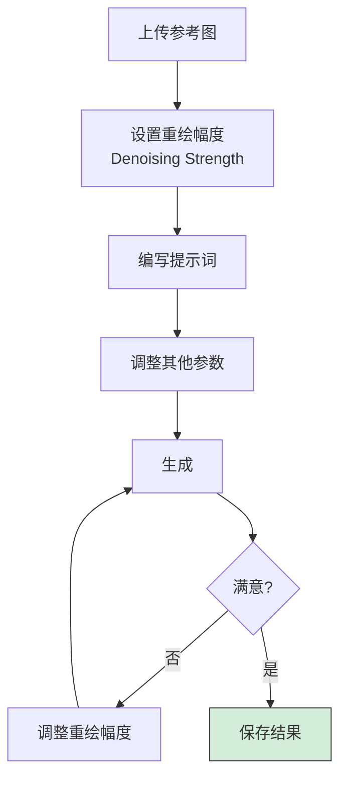

**重绘幅度（Denoising Strength）**：

| 数值 | 效果 | 适用场景 |
|------|------|---------|
| 0.1-0.3 | 微调，几乎不变 | 细微调整、修复小瑕疵 |
| 0.3-0.5 | 轻度改变，保持主体 | 换色、微调风格 |
| 0.5-0.7 | 中度改变，重构部分 | 改变风格、调整细节 |
| 0.7-0.9 | 大幅改变，保留轮廓 | 大改风格、重新创作 |
| 0.9-1.0 | 几乎重新生成 | 仅作构图参考 |

**实用案例**：

**案例1：照片转动漫**
```
输入：真人照片
Denoising: 0.7-0.8

Prompt:
anime style, cel shading, vibrant colors,
official anime art, detailed

Negative:
realistic, photograph, 3d
```

**案例2：草图转精细图**
```
输入：简单草图
Denoising: 0.8-0.9

Prompt:
highly detailed, professional illustration,
refined linework, full color, 8k
```

### 3.2 局部重绘（Inpainting）

**用途**：精确修改图像的特定区域

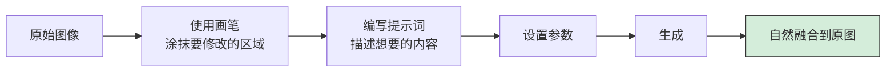

**关键参数**：

**Masked content（遮罩内容）**：
- `fill`：用纯色填充
- `original`：保留原始内容（推荐）
- `latent noise`：潜在噪声
- `latent nothing`：潜在空白

**Inpaint area（重绘区域）**：
- `Whole picture`：全图
- `Only masked`：仅遮罩区域（推荐，更快）

**Mask blur（遮罩羽化）**：
```
0-4   无羽化，边缘生硬
4-16  轻度羽化（推荐）
16+   重度羽化，边缘非常柔和
```

**实用案例**：

**案例1：修改服装**
```
1. 涂抹衣服区域
2. Prompt: red dress, elegant, detailed fabric
3. Denoising: 0.7
4. Mask blur: 8
```

**案例2：替换背景**
```
1. 涂抹背景区域
2. Prompt: beach, ocean, sunset, beautiful sky
3. Denoising: 0.8
4. Mask blur: 12
```

**案例3：修复手部**
```
1. 涂抹畸形的手部
2. Prompt: beautiful hand, detailed fingers, natural pose
3. Denoising: 0.6-0.7
4. Mask blur: 6
```

### 3.3 高清放大（Upscale）

#### 方法1：简单放大

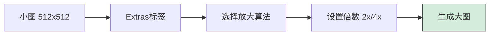

**放大算法选择**：

| 算法 | 特点 | 适用场景 |
|------|------|---------|
| **R-ESRGAN 4x+** | 真实感强 | 照片、写实图 |
| **R-ESRGAN 4x+ Anime6B** | 动漫优化 | 二次元图 |
| **SwinIR_4x** | 细节保留好 | 插画、CG |
| **Lanczos** | 快速但质量一般 | 快速预览 |

**使用步骤**：
```
1. 生成满意的小图（512x768）
2. Extras 标签页
3. 上传图片
4. 选择 R-ESRGAN 4x+ (或 Anime6B)
5. Scale by: 2
6. Generate
```

#### 方法2：SD Upscale

**优势**：重绘放大，细节更丰富

**流程**：

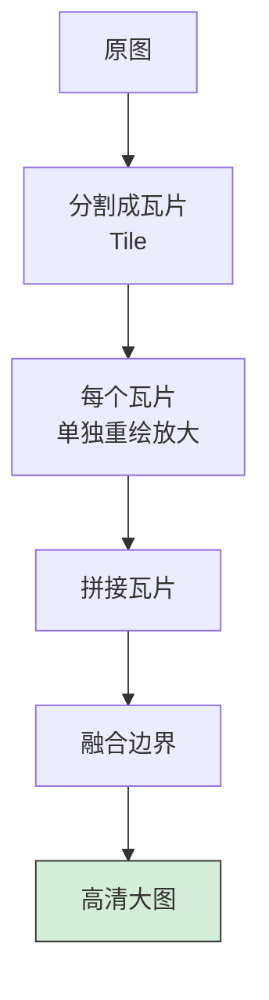

**参数设置**：
```
Script: SD upscale
Tile overlap: 64（边缘重叠，避免接缝）
Scale factor: 2
Upscaler: R-ESRGAN 4x+
Denoising: 0.2-0.4
```

**推荐流程**：
```
1. 生成 512x768 图像
2. img2img 标签
3. 上传图像
4. Script: SD upscale
5. Denoising: 0.3
6. 其他参数保持与原图一致
7. 生成 → 得到 1024x1536 高清图
```

#### 方法3：Ultimate SD Upscale（推荐）

**优势**：支持超大尺寸，质量最佳

**安装**：
```
Extensions → Available → 搜索 "ultimate sd upscale"
Install → Restart
```

**使用方法**：
```
1. img2img 标签
2. 上传图片
3. Script: Ultimate SD upscale
4. 设置：
   - Target size: 目标尺寸
   - Upscaler: R-ESRGAN 4x+
   - Type: Linear 或 Chess
   - Denoising: 0.2-0.35
5. 生成
```

### 3.4 组合工作流示例

**工作流1：草图到精细高清图**

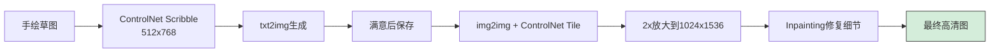

**工作流2：照片转二次元高清图**

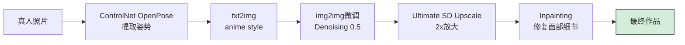

## 4. 常用插件推荐

### 4.1 必装插件

#### 1. ControlNet（必装）

**功能**：精确控制生成

**用途**：姿势控制、构图控制、线稿上色等

#### 2. ADetailer（必装）

**功能**：自动检测并修复人脸和手

**使用方法**：
```
Settings → ADetailer
- Enable ADetailer: ✓
- Detection model: face_yolov8n.pt
- Denoising strength: 0.3-0.4
```

**效果**：
- 自动高清化面部
- 修复面部细节
- 可选择性修复手部

#### 3. Dynamic Prompts

**功能**：提示词随机化和组合

**语法示例**：
```
{red|blue|green} dress
→ 随机选择一个颜色

{2$$cat|dog|bird}
→ 随机选择2个

{1-3$$cute|beautiful|elegant}
→ 随机选择1-3个形容词
```

**用途**：批量生成多样化作品

### 4.2 辅助插件

#### 4. Cutoff

**功能**：防止提示词污染

**问题场景**：
```
Prompt: red hair, blue eyes
可能结果：蓝色头发（颜色污染）
```

**解决**：
```
启用 Cutoff：
- red(hair)
- blue(eyes)
严格限定属性对应
```

#### 5. Regional Prompter

**功能**：区域化提示词控制

**用法**：
```
将画面分区，每个区域独立提示词

示例：
上半部分: blue sky, clouds
下半部分: green grass, flowers
左侧: girl, red dress
右侧: tree, birds
```

#### 6. Segment Anything

**功能**：智能抠图和分割

**用途**：
- 自动识别物体
- 精确抠图
- 区域化编辑

### 4.3 效率工具

#### 7. Image Browser

**功能**：浏览历史生成图像

**特点**：
- 查看生成参数
- 复用提示词
- 删除/收藏图片

#### 8. Prompt from Image

**功能**：从图片反推提示词

**用途**：学习他人提示词

#### 9. Aspect Ratio Helper

**功能**：快速设置常用比例

**用途**：一键切换尺寸比例

## 课后实践

### 实践任务

#### 任务1：ControlNet 综合练习

**练习A：姿势控制**
1. 找 3 张不同姿势的人物照片
2. 使用 OpenPose 提取姿势
3. 根据姿势生成二次元角色
4. 对比效果

**练习B：线稿上色**
1. 手绘或寻找线稿
2. 使用 Lineart ControlNet
3. 尝试 3 种不同配色方案
4. 选择最佳效果

**练习C：多ControlNet组合**
1. 使用 OpenPose + Depth
2. 生成复杂场景人物图
3. 记录参数和权重配置

#### 任务2：LoRA 应用

1. 下载 5 个不同类型的 LoRA
   - 1个风格 LoRA
   - 1个细节增强 LoRA
   - 1个修复类 LoRA
   - 2个创意 LoRA

2. 测试每个 LoRA 的效果：
   - 权重 0.3, 0.5, 0.7, 1.0
   - 记录最佳权重

3. 尝试 3 种不同的 LoRA 组合

#### 任务3：完整工作流

**项目：从草图到高清完稿**

```
第1步：准备草图（手绘或数字）
第2步：ControlNet Scribble 生成初稿（512x768）
第3步：满意构图后记录 Seed
第4步：精细化提示词，重新生成
第5步：Inpainting 修复细节
第6步：Ultimate SD Upscale 放大到 2048x3072
第7步：Inpainting 修复放大后的瑕疵
第8步：最终调色（可选）
```

**要求**：
- 完整记录每步参数
- 保存中间过程图
- 总结经验和问题

### 挑战项目

**项目1：角色设计集**
- 设计 1 个原创角色
- 使用 OpenPose 创建 10 个不同姿势
- 保持角色一致性
- 全部放大到高清

**项目2：风格迁移系列**
- 选择 1 张参考照片
- 使用 3 种不同风格 LoRA
- 配合 ControlNet Depth
- 创作 3 种风格变体

## 下节预告

**课程05：高级应用**

下节课我们将学习：
- 🎓 LoRA 模型训练技术
- 🔧 ComfyUI 工作流开发
- 💼 商业应用探索
- 🔌 API 使用和脚本开发

---

> 💡 **学习建议**：进阶技巧需要大量实践。每个功能都要亲自尝试多次，才能掌握最佳参数和使用场景。

> ⏰ **投入时间**：建议每天投入 2-3 小时，持续练习 4-8 周。重点是建立自己的工作流程和参数库。

> 🎯 **评估标准**：能够从草图开始，独立完成一张高质量、高清晰度的完整作品。
