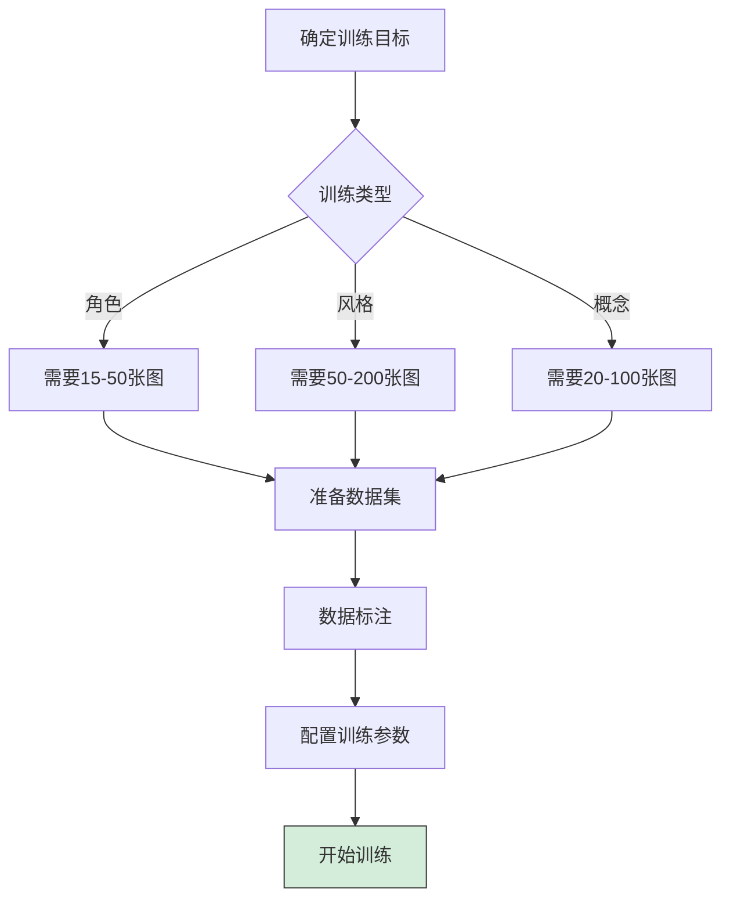
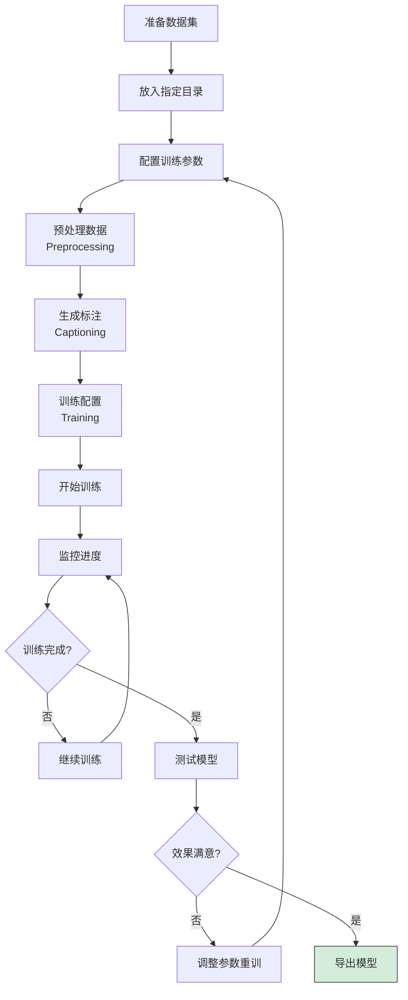
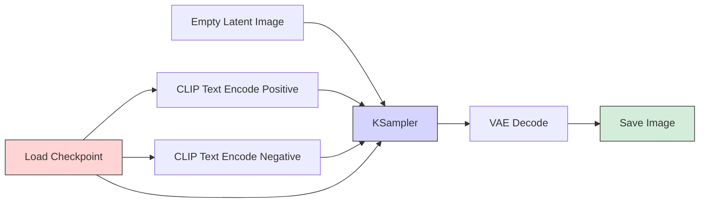
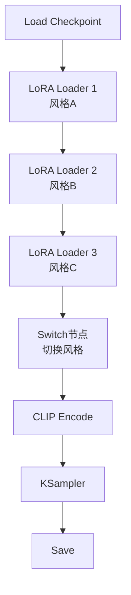
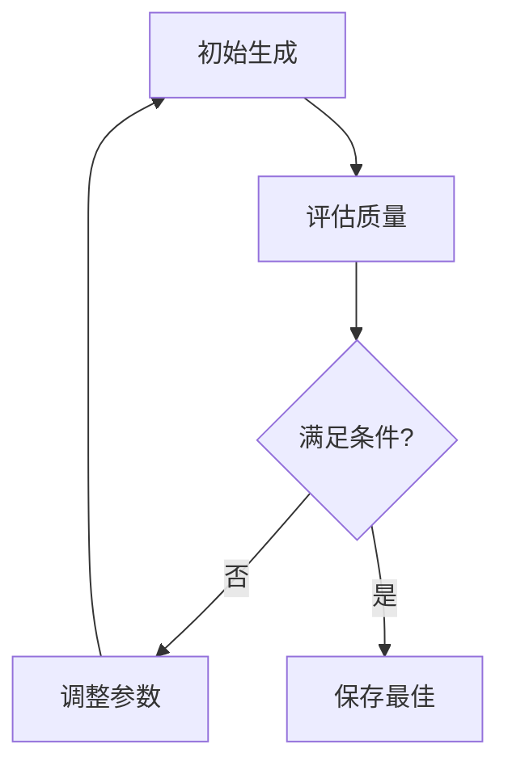
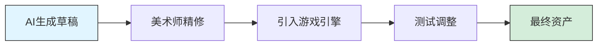

# Stable Diffusion 课程05 - 高级应用

> **学习时间**：持续学习
> **难度级别**：⭐⭐⭐⭐⭐ 非常高

## 课程目标

通过本课程的学习，你将能够：

- ✅ 掌握 LoRA 模型的训练方法
- ✅ 了解 ComfyUI 工作流开发
- ✅ 探索 AI 绘画的商业应用
- ✅ 学会使用 API 进行自动化
- ✅ 开发自定义脚本和工具

## 1. LoRA 模型训练

### 1.1 训练前准备

#### 训练需求评估



**硬件要求**：

| 配置 | 最低 | 推荐 | 理想 |
|-----|------|------|------|
| **GPU** | RTX 3060 8GB | RTX 3060 12GB | RTX 4090 24GB |
| **RAM** | 16GB | 32GB | 64GB |
| **存储** | 50GB | 100GB | 200GB+ |
| **训练时间** | 1-3小时 | 30分钟-1小时 | 10-30分钟 |

### 1.2 数据准备

#### 数据收集原则

**角色 LoRA**：
```
图片数量：15-50 张
图片要求：
- ✅ 高清（至少 512x512）
- ✅ 角色清晰可见
- ✅ 多种角度和表情
- ✅ 不同服装和场景
- ❌ 避免模糊、遮挡、像素化
```

**风格 LoRA**：
```
图片数量：50-200 张
图片要求：
- ✅ 风格统一
- ✅ 高质量作品
- ✅ 多样化主题
- ✅ 清晰的风格特征
```

#### 数据预处理

**1. 裁剪和缩放**
```
目标尺寸：512x512 或 768x768
长宽比：尽量接近 1:1
格式：PNG 或 JPG
```

**2. 数据清洗**
```
- 删除低质量图片
- 删除重复图片
- 删除不相关图片
- 统一尺寸和格式
```

### 1.3 使用 Kohya_ss 训练

#### 安装 Kohya_ss

**方法1：GUI 版本（推荐）**

```bash
# 下载
git clone https://github.com/bmaltais/kohya_ss.git
cd kohya_ss

# Windows 安装
setup.bat

# 启动
gui.bat

# 浏览器访问
http://127.0.0.1:7860
```

**方法2：独立版（适合高级用户）**
```bash
git clone https://github.com/kohya-ss/sd-scripts.git
cd sd-scripts
pip install -r requirements.txt
```

#### 训练流程



#### 关键参数详解

**基础参数**：

```
# 模型设置
pretrained_model: 基础模型路径
  推荐：stable-diffusion-v1-5 或 你的常用模型

# 网络设置
network_dim (Rank): 网络秩
  - 8-16: 小型LoRA,快速训练
  - 32-64: 标准LoRA,平衡
  - 128+: 大型LoRA,高质量但慢

network_alpha: 通常设为 network_dim 的一半
  如 dim=32, alpha=16
```

**训练参数**：

```
# 学习率 (Learning Rate)
learning_rate: 1e-4 到 5e-4
  - 角色: 5e-4
  - 风格: 1e-4 到 3e-4
  - 太高: 训练不稳定
  - 太低: 训练太慢

# 训练轮数 (Epochs)
max_train_epochs: 10-20
  - 15张图: 15-20 epochs
  - 30张图: 10-15 epochs
  - 50+张图: 8-12 epochs

# 批次大小 (Batch Size)
train_batch_size: 1-4
  - 显存8GB: batch_size=1
  - 显存12GB: batch_size=2
  - 显存24GB: batch_size=4
```

**优化器设置**：

```
optimizer_type: AdamW8bit (推荐)
  - AdamW8bit: 省显存
  - AdamW: 标准
  - Lion: 新优化器,可尝试

lr_scheduler: cosine (推荐)
  - cosine: 余弦退火
  - constant: 恒定学习率
  - linear: 线性衰减
```

#### 标注方法

**方法1：自动标注（BLIP）**
```
Kohya GUI → Utilities → Captioning
- Caption Extension: .txt
- Model: BLIP
- Generate captions
```

**方法2：手动标注（推荐）**
```
为每张图片创建同名txt文件：

图片: character_01.png
标注: character_01.txt
内容: 1girl, blue hair, red eyes, school uniform, smile
```

**标注技巧**：
```
优先级：高 → 低
[触发词], [核心特征], [服装], [动作], [背景], [风格词]

示例：
mycharacter, 1girl, long silver hair, blue eyes,
white dress, standing, garden background, anime style
```

#### 训练监控

**查看训练日志**：
```
kohya_ss/logs/

关注指标：
- Loss: 损失值,应该逐渐降低
  - 开始: 0.1-0.15
  - 中期: 0.08-0.10
  - 结束: 0.06-0.08
  - 如果<0.05: 可能过拟合
```

**中途测试**：
```
每 2-3 个 epoch 保存一次
测试生成效果
选择最佳 epoch 的模型
```

### 1.4 训练后优化

#### 模型测试

**测试提示词**：
```
<lora:your_lora_name:0.8>

# 角色 LoRA 测试
1girl, [触发词], [角色特征],
different expressions, various poses

# 风格 LoRA 测试
landscape, character, still life,
[风格触发词], detailed
```

**常见问题及解决**：

| 问题 | 可能原因 | 解决方案 |
|------|---------|---------|
| 效果不明显 | 权重太低 | 提高 LoRA 权重到 0.8-1.0 |
| 特征过度 | 训练过度/权重太高 | 降低权重或重新训练 |
| 风格不稳定 | 数据集不统一 | 清理数据集,保证一致性 |
| 无法触发 | 触发词不对 | 检查训练时的标注 |

## 2. ComfyUI 工作流

### 2.1 ComfyUI 简介

**ComfyUI vs AUTOMATIC1111**：

| 特性 | ComfyUI | AUTOMATIC1111 |
|------|---------|---------------|
| **界面** | 节点式可视化 | 传统表单 |
| **学习曲线** | 陡峭 | 平缓 |
| **灵活性** | 非常高 | 中等 |
| **性能** | 更优化 | 标准 |
| **工作流复用** | 容易 | 较难 |

**适用场景**：
- 🔄 复杂的多步骤工作流
- 🎨 需要精细控制每个环节
- 📦 工作流分享和复用
- ⚡ 追求性能优化

### 2.2 ComfyUI 基础节点



**核心节点说明**：

1. **Load Checkpoint**
   - 加载基础模型
   - 输出：MODEL, CLIP, VAE

2. **CLIP Text Encode**
   - 编码提示词
   - Positive: 正面提示词
   - Negative: 负面提示词

3. **Empty Latent Image**
   - 创建初始噪声图
   - 设置尺寸

4. **KSampler**
   - 核心采样器
   - 参数：steps, cfg, sampler等

5. **VAE Decode**
   - 将潜在空间解码为图像

6. **Save Image**
   - 保存生成的图片

### 2.3 实用工作流示例

#### 工作流1：批量生成不同风格



**用途**：一键生成多个风格版本

#### 工作流2：自动迭代优化



**用途**：自动找到最佳参数

### 2.4 ComfyUI 优势应用

**1. 批量处理**
- 批量应用不同 LoRA
- 批量测试参数组合
- 批量放大处理

**2. 工作流分享**
- 导出工作流 JSON
- 分享给他人使用
- 导入他人工作流

**3. 性能优化**
- 更高效的内存使用
- 支持更大的图像
- 更快的生成速度

## 3. 商业应用探索

### 3.1 应用领域

#### 1. 设计行业

**概念设计**：
```
应用：
- 角色概念设计
- 场景概念图
- 产品外观设计
- 建筑效果图

优势：
- 快速生成多个方案
- 降低初期成本
- 加速创意迭代
```

**UI/UX 设计**：
```
应用：
- 界面配图
- 图标设计
- 插画素材
- 背景图案

工作流：
SD生成 → 设计软件精修 → 应用到设计中
```

#### 2. 内容创作

**自媒体运营**：
```
- 公众号封面
- 视频缩略图
- 社交媒体配图
- 文章插图

效率：
传统: 1-2小时/张
AI辅助: 10-20分钟/张
```

**故事配图**：
```
- 小说插图
- 漫画分镜
- 绘本创作
- 剧本可视化
```

#### 3. 游戏开发

**美术资产**：
```
- 角色原画
- 场景设计
- 道具图标
- UI 素材
- 宣传素材
```

**工作流程**：


#### 4. 电商设计

**商品展示**：
```
- 场景化展示
- 氛围图
- 详情页配图
- Banner 设计
```

**示例工作流**：
```
1. 拍摄产品照片
2. 使用 ControlNet 保持产品轮廓
3. 改变背景和场景
4. 生成多个风格版本
5. 选择最佳用于推广
```

### 3.2 版权与合规

**重要提示**：

```
⚠️ 版权意识：
1. 了解使用模型的许可协议
2. 避免直接使用版权角色
3. 商业使用前检查授权
4. 生成内容的版权归属

⚠️ 合规使用：
1. 不生成侵权内容
2. 不冒用他人作品
3. 标注 AI 生成来源（某些平台要求）
4. 遵守平台规则
```

**许可协议类型**：

| 协议 | 商业使用 | 要求 |
|------|---------|-----|
| **CreativeML OpenRAIL-M** | ✅ 允许 | 遵守责任使用规则 |
| **CC BY-NC** | ❌ 禁止 | 仅非商业 |
| **CC BY** | ✅ 允许 | 需署名 |
| **自定义协议** | ⚠️ 视情况 | 详读协议 |

### 3.3 商业化路径

**路径1：接单服务**
```
服务类型：
- 定制 LoRA 训练
- 批量图片生成
- 风格转换服务
- AI 绘画教学

定价参考：
- LoRA 训练：¥200-1000/个
- 图片生成：¥50-200/张
- 教学课程：¥199-999
```

**路径2：作品销售**
```
平台：
- 站酷、涂鸦王国（国内）
- Pixiv、ArtStation（国际）
- 淘宝、咸鱼（素材包）

类型：
- 高清壁纸
- 设计素材包
- 头像定制
- NFT 作品
```

**路径3：工具开发**
```
方向：
- 垂直领域工具（如电商图片生成）
- 工作流模板售卖
- 插件开发
- SaaS 服务
```

## 4. API 使用与自动化

### 4.1 启用 API

**AUTOMATIC1111 API 启动**：

```bash
# 编辑 webui-user.bat
set COMMANDLINE_ARGS=--api

# 重启 WebUI
# API 地址：http://127.0.0.1:7860
```

**API 文档**：
```
访问：http://127.0.0.1:7860/docs
查看所有可用 API 端点
```

### 4.2 Python 调用示例

**基础文生图**：

```python
import requests
import base64
import json
from PIL import Image
from io import BytesIO

# API 地址
url = "http://127.0.0.1:7860/sdapi/v1/txt2img"

# 请求参数
payload = {
    "prompt": "a beautiful girl, long hair, blue eyes, masterpiece",
    "negative_prompt": "low quality, blurry, bad anatomy",
    "steps": 30,
    "width": 512,
    "height": 768,
    "cfg_scale": 7.5,
    "sampler_name": "DPM++ 2M Karras",
    "batch_size": 1,
}

# 发送请求
response = requests.post(url, json=payload)
result = response.json()

# 保存图片
for i, img_data in enumerate(result['images']):
    image = Image.open(BytesIO(base64.b64decode(img_data)))
    image.save(f'output_{i}.png')
    print(f'已保存: output_{i}.png')
```

**图生图示例**：

```python
import base64
import requests
from PIL import Image
from io import BytesIO

# 读取图片并转为 base64
def image_to_base64(image_path):
    with open(image_path, "rb") as f:
        return base64.b64encode(f.read()).decode()

url = "http://127.0.0.1:7860/sdapi/v1/img2img"

payload = {
    "init_images": [image_to_base64("input.png")],
    "prompt": "anime style, vibrant colors",
    "negative_prompt": "realistic, photograph",
    "steps": 30,
    "denoising_strength": 0.7,
    "width": 512,
    "height": 768,
}

response = requests.post(url, json=payload)
result = response.json()

# 保存结果
image = Image.open(BytesIO(base64.b64decode(result['images'][0])))
image.save('output_img2img.png')
```

### 4.3 批量处理脚本

**批量生成不同提示词**：

```python
import requests
import base64
from PIL import Image
from io import BytesIO
import time

url = "http://127.0.0.1:7860/sdapi/v1/txt2img"

# 提示词列表
prompts = [
    "a cat in the garden, sunny day",
    "a dog playing in the park, happy",
    "a bird flying in the sky, clouds",
]

# 基础参数
base_payload = {
    "steps": 25,
    "width": 512,
    "height": 512,
    "cfg_scale": 7,
    "sampler_name": "DPM++ 2M Karras",
    "negative_prompt": "low quality, blurry",
}

# 批量生成
for idx, prompt in enumerate(prompts):
    print(f"正在生成 {idx+1}/{len(prompts)}: {prompt}")

    payload = base_payload.copy()
    payload["prompt"] = prompt

    response = requests.post(url, json=payload)
    result = response.json()

    # 保存
    image = Image.open(BytesIO(base64.b64decode(result['images'][0])))
    image.save(f'batch_output_{idx+1}.png')

    print(f"已保存: batch_output_{idx+1}.png")
    time.sleep(2)  # 避免请求过快

print("全部完成!")
```

### 4.4 实用自动化工具

**工具1：自动测试参数组合**

```python
# 测试不同 CFG Scale 和 Steps 的组合
cfg_scales = [5, 7, 9, 11]
steps_list = [20, 25, 30, 40]

for cfg in cfg_scales:
    for steps in steps_list:
        # 生成图片
        # 文件名包含参数信息
        filename = f"test_cfg{cfg}_steps{steps}.png"
```

**工具2：图片质量自动评分**

结合图像质量评估库,自动筛选高质量图片

**工具3：定时批量生成**

```python
import schedule
import time

def generate_daily_art():
    # 每天自动生成一批图片
    pass

schedule.every().day.at("02:00").do(generate_daily_art)

while True:
    schedule.run_pending()
    time.sleep(60)
```

## 课后实践

### 实践项目

#### 项目1：训练个人风格 LoRA

**目标**：创建属于自己的风格 LoRA

**步骤**：
1. 收集 50 张你喜欢的风格图片
2. 预处理和标注
3. 使用 Kohya_ss 训练
4. 测试不同 epoch 的效果
5. 选择最佳模型

**评估标准**：
- 风格是否明显
- 适用性是否广泛
- 是否有过拟合

#### 项目2：ComfyUI 工作流开发

**目标**：创建一个实用的自动化工作流

**方向建议**：
- 一键生成多风格版本
- 自动高清放大流程
- 批量人物生成系统

#### 项目3：商业项目实践

**目标**：完成一个小型商业项目

**示例项目**：
- 为自媒体号生成 10 张封面图
- 为小说创作 5 张插图
- 为产品设计 3 种场景展示图

**要求**：
- 符合商业质量标准
- 记录完整工作流程
- 总结经验教训

## 下节预告

**课程06：持续学习**

下节课我们将探讨：
- 🌟 最新技术趋势和新模型
- 🤝 社区资源和学习渠道
- 📚 进阶学习路径
- 💡 持续提升建议

---

> 💡 **学习建议**：高级应用需要大量实践和试错。不要害怕失败,每次失败都是学习的机会。

> ⚠️ **重要提醒**：在商业应用前,务必了解相关法律法规和版权问题,合规使用 AI 技术。

> 🎯 **目标**：掌握一项高级技能（模型训练/API开发/商业应用),并能独立完成项目。
