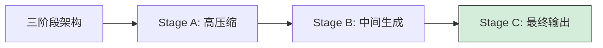
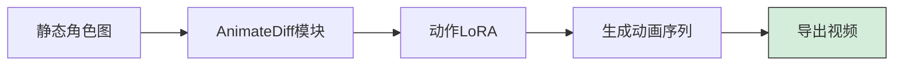
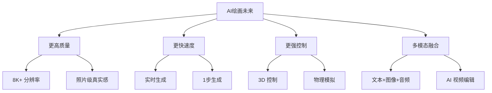
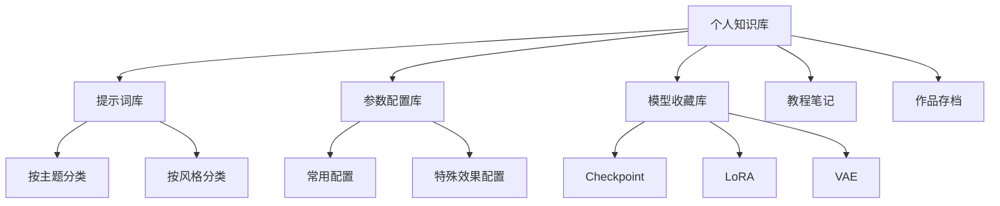
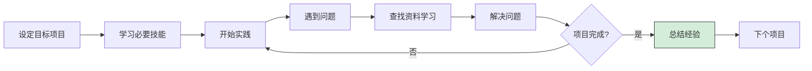
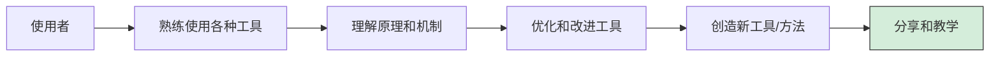
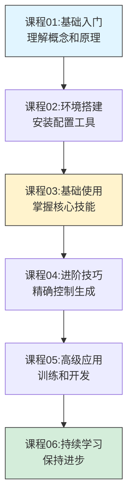

# Stable Diffusion 课程06 - 持续学习

> **学习时间**：持续终身
> **重要程度**：⭐⭐⭐⭐⭐

## 课程目标

通过本课程,你将了解：

- ✅ AI 绘画技术的最新发展趋势
- ✅ 优质的学习资源和社区
- ✅ 如何跟进新技术和新模型
- ✅ 持续提升的方法和路径
- ✅ 如何建立个人知识体系

## 1. 最新技术趋势

### 1.1 新一代模型

#### SDXL (Stable Diffusion XL)

**特点**：
```
- 更高的基础分辨率（1024x1024）
- 更好的细节表现
- 更准确的文本理解
- 更少的变形问题

但是：
- 需要更大显存（10GB+）
- 生成速度较慢
- 文件体积更大（6-7GB）
```

**使用建议**：
```
适合：
✅ 有高端显卡（RTX 3080+）
✅ 追求极致质量
✅ 制作大尺寸作品

不适合：
❌ 显存小于 10GB
❌ 快速迭代创作
❌ 批量生成
```

#### SDXL Turbo

**创新点**：实时生成

```
特性：
- 仅需 1-4 步即可生成
- 接近实时的速度
- 质量仍然不错

应用场景：
- 实时预览
- 快速原型设计
- 交互式创作
```

#### Stable Cascade

**架构创新**：



**优势**：
- 更高效的训练
- 更好的质量
- 更小的模型文件

### 1.2 新兴技术

#### AnimateDiff（图片转动画）

**功能**：将静态图片转换为动画

**示例工作流**：


**应用**：
- 角色动画
- 表情变化
- 简单动作

#### IP-Adapter（风格迁移）

**功能**：通过参考图控制风格

**与 ControlNet 的区别**：
```
ControlNet: 控制结构和构图
IP-Adapter: 控制风格和外观

组合使用：
ControlNet (姿势) + IP-Adapter (风格) = 精确控制
```

#### LCM LoRA（加速生成）

**功能**：大幅减少所需步数

```
传统：25-30 步
使用 LCM：4-8 步

速度提升：5-8 倍
质量损失：很小
```

**使用方法**：
```
<lora:lcm_lora:1.0>

Settings:
- Steps: 4-8
- CFG Scale: 1.5-2.0
- Sampler: LCM
```

#### Stable Video Diffusion

**功能**：视频生成

```
输入：单张图片或文本
输出：短视频（2-4秒）

应用：
- 产品展示视频
- 简单动画
- 视频原型
```

### 1.3 技术发展方向



## 2. 优质学习资源

### 2.1 中文社区

#### B站 UP 主推荐

| UP主 | 特色 | 适合人群 |
|------|------|---------|
| **秋葉aaaki** | 全面系统的教程 | 新手入门 |
| **琥珀青葉** | 技术深度解析 | 进阶学习 |
| **Nenly同学** | 实用技巧分享 | 提升效率 |
| **元素法典** | 提示词教学 | 提示词学习 |

#### 中文网站和论坛

**1. 吐司网（tusiart.com）**
```
内容：
- 模型下载
- 教程分享
- 社区交流

优势：
- 中文界面
- 国内访问快
- 中文模型多
```

**2. LiblibAI（liblib.ai）**
```
特点：
- 在线生成平台
- 模型分享
- 工作流市场

适合：
- 无硬件用户
- 快速体验
```

**3. AI 绘画交流群**
```
平台：
- QQ群
- 微信群
- Discord 中文频道

优势：
- 实时交流
- 快速解答
- 资源分享
```

### 2.2 国际社区

#### Reddit

**r/StableDiffusion**
```
地址：reddit.com/r/StableDiffusion

内容：
- 最新技术讨论
- 作品分享
- 问题解答
- 模型发布

特点：
- 信息最快
- 讨论深入
- 官方参与
```

#### Civitai

```
地址：civitai.com

功能：
- 最大的模型库
- 详细的使用说明
- 社区评分系统
- 提示词参考

使用技巧：
- 关注热门模型
- 查看评论了解问题
- 下载前看预览图
- 记录有用的提示词
```

#### GitHub

**重要仓库**：

```
1. AUTOMATIC1111/stable-diffusion-webui
   - WebUI 主仓库
   - 关注 Issues 了解问题和解决方案

2. lllyasviel/ControlNet
   - ControlNet 官方仓库
   - 最新模型和文档

3. kohya-ss/sd-scripts
   - 训练脚本
   - LoRA 训练教程

4. comfyanonymous/ComfyUI
   - ComfyUI 官方仓库
   - 工作流分享
```

### 2.3 学习网站和教程

#### 英文教程网站

**Stable Diffusion Art**
```
地址：stable-diffusion-art.com

内容：
- 详细的功能教程
- 参数详解
- 最佳实践
- 定期更新

特点：
- 图文并茂
- 系统全面
- 适合深入学习
```

**Hugging Face 博客**
```
地址：huggingface.co/blog

内容：
- 官方技术博客
- 最新研究介绍
- 模型使用指南

特点：
- 权威性强
- 技术前沿
```

#### YouTube 频道

| 频道 | 内容重点 | 更新频率 |
|------|---------|---------|
| **Olivio Sarikas** | 实用教程 | 频繁 |
| **Aitrepreneur** | 工具评测 | 周更 |
| **Sebastian Kamph** | 进阶技巧 | 周更 |
| **Nerdy Rodent** | ComfyUI | 频繁 |

### 2.4 工具和辅助网站

**提示词工具**：

```
1. Prompt Generator (promptomania.com)
   - 可视化提示词构建
   - 适合新手

2. Lexica (lexica.art)
   - 提示词搜索引擎
   - 参考优秀作品

3. PromptHero (prompthero.com)
   - 提示词数据库
   - 按风格分类
```

**参数查询工具**：

```
1. PNG Info 查看器
   - 查看图片元数据
   - 学习他人参数

2. Model Manager
   - 模型管理工具
   - 参数记录
```

## 3. 学习方法和建议

### 3.1 建立知识体系

#### 个人知识库



**提示词库结构**：

```
提示词库/
├── 人物/
│   ├── 面部描述.txt
│   ├── 发型.txt
│   ├── 服装.txt
│   └── 姿势.txt
├── 场景/
│   ├── 室内.txt
│   ├── 室外.txt
│   └── 幻想场景.txt
├── 风格/
│   ├── 写实.txt
│   ├── 动漫.txt
│   └── 艺术风格.txt
└── 质量词/
    ├── 正面.txt
    └── 负面.txt
```

**参数配置记录**：

```markdown
# 配置模板：高质量人物肖像

## 基础设置
- Model: Realistic Vision V5
- VAE: vae-ft-mse-840000
- Size: 512x768

## 生成参数
- Sampler: DPM++ 2M Karras
- Steps: 28
- CFG Scale: 7.5
- Seed: -1

## 提示词模板
Prompt:
(masterpiece:1.2), (best quality:1.2),
professional portrait photography,
[人物描述],
soft lighting, bokeh

Negative:
(low quality:1.3), (worst quality:1.3),
bad anatomy, blurry

## 使用场景
- 人物肖像
- 写实风格
- 高质量要求

## 备注
- CFG不要超过8,否则可能过饱和
- 可配合 ADetailer 使用
```

### 3.2 实践为主的学习

#### 每日练习计划

**新手阶段（1-3个月）**：
```
每天：
- 生成 20-30 张图
- 尝试 3 个新提示词组合
- 记录 1 个参数发现

每周：
- 完整学习 1 个新功能
- 整理本周生成的精品
- 总结经验教训
```

**进阶阶段（3-6个月）**：
```
每天：
- 完成 1 个小项目
- 测试 1 个新 LoRA 或插件
- 优化 1 个工作流程

每周：
- 深入研究 1 个高级技术
- 尝试 1 个商业项目
- 分享 1 篇心得
```

**高级阶段（6个月+）**：
```
定期：
- 训练个人 LoRA 模型
- 开发自动化脚本
- 参与社区贡献
- 探索新技术方向
```

#### 项目驱动学习



**项目示例**：
```
初级项目：
- 为自己做 10 个头像
- 生成一套壁纸系列
- 制作节日贺卡

中级项目：
- 为小说设计角色集
- 创建品牌VI视觉
- 训练个人风格 LoRA

高级项目：
- 开发专用生成工具
- 完成商业委托
- 教学课程制作
```

### 3.3 参与社区交流

#### 分享与成长

**分享内容**：
```
1. 作品展示
   - 附带提示词和参数
   - 说明创作思路
   - 分享踩坑经验

2. 教程制作
   - 文字教程
   - 视频教程
   - 配置分享

3. 问题讨论
   - 提出有价值的问题
   - 帮助他人解答
   - 参与技术讨论
```

**社区贡献**：
```
- 提交 Bug 报告
- 参与开源项目
- 翻译外文教程
- 整理资源合集
```

### 3.4 跟进技术发展

#### 信息获取策略

**每日关注**：
```
1. Reddit r/StableDiffusion
   - 浏览热门帖子
   - 关注技术讨论

2. Discord 社区
   - 实时聊天
   - 获取最新资讯

3. B站首页
   - 推荐教程视频
   - 技术更新
```

**每周关注**：
```
1. GitHub Trending
   - 新项目发现
   - 更新关注

2. Civitai 新模型
   - 热门模型试用
   - 用户评价

3. YouTube 订阅频道
   - 教程学习
   - 工具评测
```

**每月关注**：
```
1. 技术博客
   - 深度文章
   - 研究论文

2. 官方公告
   - Stability AI 官网
   - Hugging Face 博客

3. 社区活动
   - 比赛挑战
   - 主题创作
```

## 4. 常见问题和建议

### 4.1 学习中的常见困惑

**Q1: 学了很多,但感觉没有提升?**

```
原因分析：
❌ 只看不练
❌ 没有目标导向
❌ 缺少系统整理

改进方法：
✅ 80% 实践 + 20% 理论
✅ 设定具体项目目标
✅ 建立个人知识库
✅ 定期回顾总结
```

**Q2: 新技术太多,不知道学哪个?**

```
优先级策略：
1️⃣ 高：直接提升作品质量（如 ControlNet）
2️⃣ 中：提高效率（如 ADetailer）
3️⃣ 低：锦上添花（如特效插件）

原则：
- 先掌握核心功能
- 根据需求学习
- 不追求大而全
```

**Q3: 如何保持学习动力?**

```
方法：
1. 加入学习小组
   - 互相监督
   - 共同进步

2. 设定阶段目标
   - 短期可达成
   - 及时奖励

3. 参与创作活动
   - 社区挑战
   - 主题创作

4. 记录成长轨迹
   - 作品对比
   - 能力提升
```

### 4.2 进阶建议

**从使用者到创造者**：



**技能树扩展**：

```
核心技能（必备）：
✅ 提示词编写
✅ 参数调优
✅ 基础工作流

扩展技能（推荐）：
📌 模型训练
📌 脚本开发
📌 工作流设计

专业技能（选修）：
🔧 插件开发
🔧 模型研究
🔧 商业应用
```

### 4.3 职业发展方向

**1. 创作方向**
```
职位：
- AI 插画师
- 概念设计师
- 自由创作者

要求：
- 强大的艺术审美
- 熟练的工具使用
- 独特的风格

收入：
- 接单：¥500-5000/张
- 全职：¥8K-20K/月
```

**2. 技术方向**
```
职位：
- AI 绘画技术支持
- 工具开发者
- 模型训练师

要求：
- 深入的技术理解
- 编程能力
- 问题解决能力

收入：
- LoRA 训练：¥200-1000/个
- 技术支持：¥10K-25K/月
```

**3. 教育方向**
```
职位：
- 在线讲师
- 课程制作者
- 技术博主

要求：
- 系统的知识体系
- 表达能力
- 教学热情

收入：
- 课程：¥199-999/人
- 月入：¥5K-50K+
```

## 5. 结语

### 5.1 学习路线回顾



### 5.2 核心要点总结

**技术层面**：
```
1. 提示词 = 创作的语言
   - 准确描述想法
   - 持续积累优化

2. 参数 = 精细控制
   - 理解作用机制
   - 找到最佳组合

3. 工具 = 提升效率
   - 掌握核心工具
   - 选择适合的方案

4. 实践 = 唯一捷径
   - 多生成多尝试
   - 从错误中学习
```

**思维层面**：
```
1. 保持好奇心
   - 探索新技术
   - 尝试新方法

2. 系统化思维
   - 建立知识体系
   - 整理学习资源

3. 创造性应用
   - 不局限于现有方法
   - 创新和组合

4. 分享与交流
   - 教学相长
   - 社区成长
```

### 5.3 最后的建议

```
🌟 记住这些原则：

1. 实践 > 理论
   不要陷入教程的循环,动手才能进步

2. 质量 > 数量
   生成1000张平庸的图,不如专注做好10张

3. 理解 > 记忆
   理解原理比记住参数更重要

4. 创意 > 技术
   AI 是工具,你的创意才是核心

5. 享受 > 焦虑
   技术会过时,保持热爱最重要
```

### 5.4 持续学习清单

**每日**：
- [ ] 生成至少 10 张图
- [ ] 尝试 1 个新想法
- [ ] 阅读 1 篇相关文章

**每周**：
- [ ] 完成 1 个小项目
- [ ] 学习 1 个新技巧
- [ ] 整理本周收获

**每月**：
- [ ] 深入研究 1 个主题
- [ ] 参与 1 次社区活动
- [ ] 回顾和优化工作流

**每季度**：
- [ ] 评估技能提升
- [ ] 更新知识库
- [ ] 设定新目标

## 附录：推荐资源清单

### 网站资源

**模型下载**：
- Civitai.com（国际）
- Huggingface.co（官方）
- Liblib.ai（国内）
- Tusiart.com（国内）

**学习教程**：
- Stable-diffusion-art.com（英文）
- Space.bilibili.com（中文）
- YouTube（视频教程）

**工具网站**：
- Promptomania.com（提示词生成）
- Lexica.art（提示词搜索）
- OpenPose Editor（姿势编辑）

### 社区资源

**中文社区**：
- B站：秋葉aaaki、琥珀青葉
- 知乎：AI绘画话题
- QQ群：各大 SD 交流群

**国际社区**：
- Reddit: r/StableDiffusion
- Discord: Stable Diffusion 官方
- GitHub: 各项目仓库

### 书籍推荐

**AI 绘画入门**：
- 《AI绘画实战指南》
- 《Stable Diffusion 完全手册》

**深度学习基础**：
- 《深度学习》（花书）
- 《动手学深度学习》

### 工具推荐

**必备工具**：
- AUTOMATIC1111 WebUI
- ControlNet 插件
- Kohya_ss（训练工具）

**辅助工具**：
- Photoshop/GIMP（后期处理）
- Blender（3D 辅助）
- Git（版本控制）

---

## 课程系列结束语

恭喜你完成了 Stable Diffusion 系列课程的全部学习！

从基础入门到高级应用,从环境搭建到模型训练,你已经掌握了 AI 绘画的核心技能。

但这不是结束,而是新的开始。AI 技术日新月异,保持学习,保持创造,保持热爱。

**你不仅学会了使用工具,更重要的是:**
- 建立了系统的知识框架
- 培养了解决问题的能力
- 找到了持续学习的方法

**接下来的旅程:**
- 创作属于你的作品
- 探索无限的可能性
- 成为社区的一份子
- 分享你的经验和知识

记住:**AI 是你的画笔,创意才是灵魂**。

祝你在 AI 绘画的道路上越走越远,创作出更多令人惊艳的作品!

---

> 💡 **最后的话**：学习永无止境,但每一步都算数。感谢你的坚持,期待你的作品!

> 🎨 **继续前进**：关闭教程,打开软件,开始创作吧!

> 🤝 **保持联系**：加入社区,分享作品,一起成长!

*最后更新：2025年1月*
*系列课程完结*
