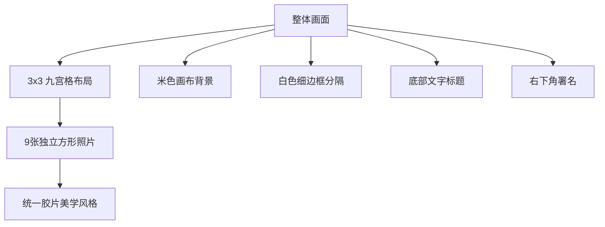

# 九宫格胶片风生活摄影提示词解析

本文详细解析一个用于生成**九宫格胶片风生活摄影拼贴画**的提示词，风格偏向日系小清新、怀旧胶片感。

## 一、原始提示词

```
A meticulously detailed collage featuring nine distinct square photographs arranged in a 3x3 grid on a pale, neutral beige, finely textured canvas background, each photo separated by a thin white border, depicting various scenes of a young Asian woman and related imagery, all imbued with a deeply soft, natural, and highly nostalgic film-like aesthetic. The top left image shows a young Asian woman with shoulder-length dark hair, wearing a loose white long-sleeved shirt and lightweight, flowing fabric shorts, captured in a medium shot as she smiles serenely with eyes gently closed, her dark hair naturally flowing and gracefully swaying in a lush grassy, sunlit field. The top middle image is a close-up of a slender hand, adorned with a silver patterned ring on the middle finger, delicately holding a clear glass bottle filled with cold, beaded water. The top right image presents the young Asian woman from behind, walking away down a narrow, intensely sun-drenched residential street lined with houses and utility poles, wearing the same loose white long-sleeved shirt and lightweight, flowing fabric shorts. The middle left image features the young Asian woman seated indoors on a tatami mat, wearing her white shirt and lightweight, flowing fabric shorts, holding a small yellow flower precisely in front of her right eye, smiling gently with her head slightly tilted. The middle middle image captures the young Asian woman lying on her back on a light grey fabric sofa, her legs bent and raised, with an open book covering her face, appearing deeply relaxed and contemplative, wearing the same white shirt and lightweight, flowing fabric shorts. The middle right image is a close-up of two bare feet, soles facing upwards, resting comfortably on a fluffy, light beige carpet. The bottom left image shows the young Asian woman from behind, her wet dark hair tied up, wearing a white camisole with delicate lace trim on the straps and neckline, enveloped in a thick steamy or misty atmosphere, possibly within a bathroom setting. The bottom middle image is a close-up of the young Asian woman in a bathtub filled with water, looking directly at the viewer with a serene expression, her face and shoulders visible above the rippling water, with a delicate thin spaghetti strap of a white camisole visible. The bottom right image is a close-up of a steamy, rectangular mirror, possibly in a bathroom, showing intricate streaks and condensation patterns on its surface. This entire composition embodies authentic lifestyle photography, candid, natural, exquisitely soft, warmly nostalgic, and a truly immersive film-like aesthetic, vividly evoking the essence of summer, deep relaxation, and cherished everyday moments. Each individual photo within the grid maintains a precise 1:1 aspect ratio, while the overall collage itself is approximately square. Predominantly natural light, consistently exquisitely soft and profoundly diffused throughout, with intense, ethereal warm backlighting and a vivid, dreamlike golden hour glow in the top left image, bright daylight with clear, crisp shadows in the top right, and exceptionally soft, highly diffused, and translucent indoor light for the remaining panels, significantly enhancing overall transparency and luminosity, creating a hazy, thick steamy atmosphere in the bottom left. Prominent and finely organic, seamlessly integrated film grain and a shallow to medium depth of field with beautifully soft bokeh are present throughout, contributing to the vintage feel. Warm, authentically desaturated color grading with natural, earthy tones and a strong vintage, film-like quality, meticulously emphasizing creamy whites, delicate muted greens, soft blues, and rich, warm skin tones, for a truly nostalgic palette with enhanced depth and harmonious vintage appeal. Below the 3x3 image grid, precisely centered, there is prominent, elegantly flowing, handwritten calligraphic style Chinese text reading "冬眠", followed by the English translation "BLUE SUMMER" in a distinctly smaller, well-spaced font directly beneath it, with the underlying canvas texture subtly subdued in this area to ensure optimal readability and seamless integration. In the bottom right corner of the overall composition, the credit text "By : 冬眠" in a refined, slender font is distinctly displayed.
```

---

## 二、整体结构分析

### 2.1 画面架构



### 2.2 布局示意图

```
┌─────────────────────────────────────────────┐
│              米色画布背景                    │
│  ┌───────────┬───────────┬───────────┐     │
│  │   左上    │   中上    │   右上    │     │
│  │  草地微笑  │  手部特写  │  街道背影  │     │
│  ├───────────┼───────────┼───────────┤     │
│  │   左中    │   中中    │   右中    │     │
│  │ 榻榻米花朵 │  沙发看书  │  脚部特写  │     │
│  ├───────────┼───────────┼───────────┤     │
│  │   左下    │   中下    │   右下    │     │
│  │ 浴室蒸汽  │  浴缸特写  │  镜面水珠  │     │
│  └───────────┴───────────┴───────────┘     │
│                                             │
│                  冬眠                        │
│              BLUE SUMMER                    │
│                                             │
│                            By : 冬眠        │
└─────────────────────────────────────────────┘
```

---

## 三、九宫格内容详解

### 3.1 内容速查表

| 位置 | 英文描述 | 中文翻译 | 关键元素 |
|:---:|---------|---------|---------|
| **左上** | top left | 草地上微笑的亚洲女性 | 白色长袖衬衫、轻薄短裤、闭眼微笑、阳光逆光、金色光晕 |
| **中上** | top middle | 手部特写 | 纤细手指、银色花纹戒指、透明玻璃瓶、冰凉水珠 |
| **右上** | top right | 背影行走 | 阳光洒落的住宅街道、电线杆、同款服装 |
| **左中** | middle left | 室内榻榻米坐姿 | 手持黄色小花遮眼、轻微侧头、温柔微笑 |
| **中中** | middle middle | 躺在沙发上 | 灰色布艺沙发、书本遮脸、腿部弯曲抬起、放松沉思 |
| **右中** | middle right | 脚部特写 | 赤脚脚底朝上、米色毛绒地毯 |
| **左下** | bottom left | 背影浴室场景 | 湿发盘起、白色吊带蕾丝边、蒸汽雾气环绕 |
| **中下** | bottom middle | 浴缸特写 | 直视镜头、平静表情、水面波纹、白色细肩带 |
| **右下** | bottom right | 浴室镜面 | 蒸汽水珠、凝结水纹、模糊效果 |

### 3.2 各格详细描述

#### 左上 (Top Left) - 草地微笑

```
原文：The top left image shows a young Asian woman with shoulder-length dark hair,
wearing a loose white long-sleeved shirt and lightweight, flowing fabric shorts,
captured in a medium shot as she smiles serenely with eyes gently closed,
her dark hair naturally flowing and gracefully swaying in a lush grassy, sunlit field.

翻译：左上图展示一位齐肩黑发的年轻亚洲女性，穿着宽松的白色长袖衬衫和轻盈飘逸的短裤，
中景拍摄，她闭着眼睛安详地微笑，黑发自然飘动，在郁郁葱葱、阳光普照的草地上优雅摇曳。

关键词：
- shoulder-length dark hair (齐肩黑发)
- loose white long-sleeved shirt (宽松白色长袖衬衫)
- lightweight flowing fabric shorts (轻盈飘逸短裤)
- medium shot (中景)
- smiles serenely with eyes gently closed (闭眼安详微笑)
- lush grassy sunlit field (阳光草地)
```

#### 中上 (Top Middle) - 手部特写

```
原文：The top middle image is a close-up of a slender hand, adorned with a silver
patterned ring on the middle finger, delicately holding a clear glass bottle
filled with cold, beaded water.

翻译：中上图是一只纤细手的特写，中指上戴着银色花纹戒指，
轻柔地握着一个装满冰凉水珠的透明玻璃瓶。

关键词：
- close-up (特写)
- slender hand (纤细的手)
- silver patterned ring (银色花纹戒指)
- clear glass bottle (透明玻璃瓶)
- cold beaded water (带水珠的冰水)
```

#### 右上 (Top Right) - 街道背影

```
原文：The top right image presents the young Asian woman from behind,
walking away down a narrow, intensely sun-drenched residential street
lined with houses and utility poles, wearing the same loose white
long-sleeved shirt and lightweight, flowing fabric shorts.

翻译：右上图呈现年轻亚洲女性的背影，沿着狭窄、阳光洒落的住宅街道走去，
两旁是房屋和电线杆，穿着同款宽松白色长袖衬衫和轻盈短裤。

关键词：
- from behind (背影)
- walking away (渐行渐远)
- sun-drenched residential street (阳光洒落的住宅街道)
- houses and utility poles (房屋和电线杆)
```

#### 左中 (Middle Left) - 榻榻米花朵

```
原文：The middle left image features the young Asian woman seated indoors
on a tatami mat, wearing her white shirt and lightweight, flowing fabric shorts,
holding a small yellow flower precisely in front of her right eye,
smiling gently with her head slightly tilted.

翻译：左中图展示年轻亚洲女性坐在室内榻榻米上，穿着白衬衫和轻盈短裤，
手持一朵小黄花正好挡在右眼前，轻微侧头温柔微笑。

关键词：
- seated indoors on tatami mat (坐在室内榻榻米上)
- small yellow flower (小黄花)
- in front of her right eye (在右眼前)
- head slightly tilted (轻微侧头)
```

#### 中中 (Middle Middle) - 沙发看书

```
原文：The middle middle image captures the young Asian woman lying on her back
on a light grey fabric sofa, her legs bent and raised, with an open book
covering her face, appearing deeply relaxed and contemplative,
wearing the same white shirt and lightweight, flowing fabric shorts.

翻译：中中图捕捉年轻亚洲女性仰躺在浅灰色布艺沙发上，腿部弯曲抬起，
一本打开的书遮住脸，显得十分放松和沉思，穿着同款白衬衫和轻盈短裤。

关键词：
- lying on her back (仰躺)
- light grey fabric sofa (浅灰色布艺沙发)
- legs bent and raised (腿部弯曲抬起)
- open book covering her face (书本遮脸)
- deeply relaxed and contemplative (放松沉思)
```

#### 右中 (Middle Right) - 脚部特写

```
原文：The middle right image is a close-up of two bare feet, soles facing upwards,
resting comfortably on a fluffy, light beige carpet.

翻译：右中图是两只赤脚的特写，脚底朝上，舒适地放在蓬松的浅米色地毯上。

关键词：
- close-up of bare feet (赤脚特写)
- soles facing upwards (脚底朝上)
- fluffy light beige carpet (蓬松浅米色地毯)
```

#### 左下 (Bottom Left) - 浴室蒸汽

```
原文：The bottom left image shows the young Asian woman from behind,
her wet dark hair tied up, wearing a white camisole with delicate lace trim
on the straps and neckline, enveloped in a thick steamy or misty atmosphere,
possibly within a bathroom setting.

翻译：左下图展示年轻亚洲女性的背影，湿润的黑发盘起，
穿着肩带和领口有精致蕾丝边的白色吊带，被浓厚的蒸汽或雾气包围，
可能在浴室场景中。

关键词：
- from behind (背影)
- wet dark hair tied up (湿发盘起)
- white camisole with lace trim (蕾丝边白色吊带)
- thick steamy/misty atmosphere (浓厚蒸汽氛围)
- bathroom setting (浴室场景)
```

#### 中下 (Bottom Middle) - 浴缸特写

```
原文：The bottom middle image is a close-up of the young Asian woman in a bathtub
filled with water, looking directly at the viewer with a serene expression,
her face and shoulders visible above the rippling water,
with a delicate thin spaghetti strap of a white camisole visible.

翻译：中下图是年轻亚洲女性在装满水的浴缸中的特写，
以平静的表情直视观众，脸部和肩膀露出水面波纹之上，
可见白色吊带的纤细肩带。

关键词：
- in a bathtub filled with water (在装满水的浴缸中)
- looking directly at the viewer (直视观众)
- serene expression (平静表情)
- rippling water (水面波纹)
- thin spaghetti strap (细肩带)
```

#### 右下 (Bottom Right) - 镜面水珠

```
原文：The bottom right image is a close-up of a steamy, rectangular mirror,
possibly in a bathroom, showing intricate streaks and condensation patterns
on its surface.

翻译：右下图是一面布满蒸汽的矩形镜子特写，可能在浴室中，
展示表面复杂的水痕和凝结图案。

关键词：
- steamy rectangular mirror (布满蒸汽的矩形镜子)
- intricate streaks (复杂水痕)
- condensation patterns (凝结图案)
```

---

## 四、视觉风格参数

### 4.1 光线设计

| 位置 | 光线类型 | 英文描述 |
|-----|---------|---------|
| 左上 | 强烈温暖逆光 + 梦幻金色时刻光晕 | intense ethereal warm backlighting, vivid dreamlike golden hour glow |
| 右上 | 明亮日光 + 清晰阴影 | bright daylight with clear crisp shadows |
| 其他室内 | 柔和漫射室内光 + 透明感增强 | exceptionally soft, highly diffused, translucent indoor light |
| 左下 | 朦胧蒸汽氛围 | hazy thick steamy atmosphere |

```
光线总结：
Predominantly natural light (主要自然光)
consistently exquisitely soft and profoundly diffused (始终极致柔和深度漫射)
significantly enhancing overall transparency and luminosity (显著增强整体透明度和光泽感)
```

### 4.2 色彩调性

```
色彩风格描述：
Warm, authentically desaturated color grading (温暖、自然去饱和调色)
with natural, earthy tones (自然大地色调)
and a strong vintage, film-like quality (强烈复古胶片质感)

主色调：
- creamy whites (奶油白)
- delicate muted greens (柔和绿)
- soft blues (淡蓝色)
- rich warm skin tones (温暖肤色)

整体感：
truly nostalgic palette (真正怀旧色盘)
with enhanced depth (增强深度)
and harmonious vintage appeal (和谐复古魅力)
```

### 4.3 质感效果

| 效果 | 英文 | 描述 |
|-----|------|------|
| **胶片颗粒** | film grain | Prominent and finely organic, seamlessly integrated (明显且有机融合) |
| **景深** | depth of field | shallow to medium (浅至中等) |
| **散景** | bokeh | beautifully soft (柔美散景) |
| **整体感** | vintage feel | contributing to the vintage feel (增强复古感) |

---

## 五、文字排版设计

### 5.1 排版结构

```
┌─────────────────────────────────────┐
│                                     │
│         [ 3 x 3 九宫格 ]            │
│                                     │
├─────────────────────────────────────┤
│                                     │
│            冬眠                     │  ← 手写书法风格中文 (handwritten calligraphic)
│         BLUE SUMMER                 │  ← 较小字体英文 (smaller well-spaced font)
│                                     │
│                      By : 冬眠      │  ← 右下角署名 (refined slender font)
└─────────────────────────────────────┘
```

### 5.2 文字描述原文

```
Below the 3x3 image grid, precisely centered,
there is prominent, elegantly flowing, handwritten calligraphic style Chinese text
reading "冬眠",
followed by the English translation "BLUE SUMMER"
in a distinctly smaller, well-spaced font directly beneath it,
with the underlying canvas texture subtly subdued in this area
to ensure optimal readability and seamless integration.

In the bottom right corner of the overall composition,
the credit text "By : 冬眠" in a refined, slender font is distinctly displayed.
```

---

## 六、核心关键词提取

### 6.1 构图关键词

| 英文 | 中文 |
|-----|------|
| 3x3 grid | 3x3网格 |
| square photographs | 方形照片 |
| thin white border | 白色细边框 |
| pale neutral beige canvas | 米色画布背景 |
| finely textured | 细腻纹理 |
| 1:1 aspect ratio | 1:1比例 |
| approximately square | 大致方形 |

### 6.2 风格关键词

| 英文 | 中文 |
|-----|------|
| soft natural nostalgic film-like aesthetic | 柔和自然怀旧胶片美学 |
| authentic lifestyle photography | 真实生活摄影 |
| candid natural | 抓拍自然 |
| warmly nostalgic | 温暖怀旧 |
| immersive film-like | 沉浸式胶片感 |
| essence of summer | 夏日本质 |
| deep relaxation | 深度放松 |
| cherished everyday moments | 珍贵日常时刻 |

### 6.3 光线关键词

| 英文 | 中文 |
|-----|------|
| natural light | 自然光 |
| soft diffused | 柔和漫射 |
| warm backlighting | 温暖逆光 |
| golden hour glow | 黄金时刻光晕 |
| ethereal | 空灵飘渺 |
| translucent | 半透明 |
| hazy steamy atmosphere | 朦胧蒸汽氛围 |

### 6.4 色彩关键词

| 英文 | 中文 |
|-----|------|
| warm desaturated color grading | 温暖去饱和调色 |
| natural earthy tones | 自然大地色调 |
| vintage film-like quality | 复古胶片质感 |
| creamy whites | 奶油白 |
| muted greens | 柔和绿 |
| soft blues | 淡蓝色 |
| warm skin tones | 温暖肤色 |

### 6.5 质感关键词

| 英文 | 中文 |
|-----|------|
| film grain | 胶片颗粒 |
| shallow to medium depth of field | 浅至中等景深 |
| soft bokeh | 柔美散景 |
| vintage feel | 复古感觉 |
| finely organic | 精细有机 |
| seamlessly integrated | 无缝融合 |

---

## 七、提示词结构模板

基于此提示词，提取通用模板：

```
A meticulously detailed collage featuring [数量] distinct square photographs
arranged in a [行x列] grid on a [背景颜色], finely textured canvas background,
each photo separated by a thin white border,
depicting various scenes of [主题人物/物品],
all imbued with a [风格描述] aesthetic.

[逐一描述每个格子的内容，使用 "The [位置] image shows/is/presents/features/captures..." 句式]

This entire composition embodies [整体风格关键词],
vividly evoking the essence of [主题氛围].
Each individual photo within the grid maintains a precise 1:1 aspect ratio,
while the overall collage itself is approximately square.

[光线描述：Predominantly natural light, ...]
[质感描述：Prominent film grain, shallow to medium depth of field, soft bokeh...]
[色彩描述：Warm, desaturated color grading with...]

Below the grid, precisely centered, there is [文字排版描述].
In the bottom right corner, the credit text "[署名]" is displayed.
```

---

## 八、中文简化版提示词

```
一张精心设计的九宫格拼贴画，3x3布局，米色画布背景，白色细边框分隔。

主题：年轻亚洲女性的夏日生活片段，日系胶片风格。

左上：草地上闭眼微笑，白衬衫轻薄短裤，阳光逆光金色光晕
中上：纤细手指戴银戒指，握透明玻璃瓶，水珠凝结
右上：背影行走在阳光街道，电线杆住宅
左中：榻榻米上坐姿，黄色小花遮眼，温柔微笑
中中：躺在灰色沙发，书本遮脸，放松姿态
右中：赤脚特写，脚底朝上，米色地毯
左下：浴室背影，湿发盘起，白色蕾丝吊带，蒸汽环绕
中下：浴缸中直视镜头，平静表情，水面波纹
右下：浴室镜面，蒸汽水珠凝结纹路

风格：柔和自然光，胶片颗粒，温暖去饱和色调，奶油白/柔绿/淡蓝主色，复古怀旧感，浅景深柔美散景

底部文字："冬眠" + "BLUE SUMMER"，右下署名 "By : 冬眠"
```

---

## 九、应用场景

此类提示词适合生成：

| 应用场景 | 说明 |
|---------|------|
| **个人写真集** | 日系小清新风格的生活照拼贴 |
| **社交媒体** | Instagram/小红书九宫格排版 |
| **品牌宣传** | 生活方式类产品展示 |
| **杂志排版** | 文艺感专题页面设计 |
| **相册设计** | 夏日/度假主题相册页 |
| **海报设计** | 文艺电影感宣传海报 |

---

## 十、变体创作建议

### 10.1 季节变体

| 季节 | 色调调整 | 场景替换 |
|-----|---------|---------|
| **春季** | 樱花粉、嫩绿 | 花田、樱花树下、野餐 |
| **夏季** | 原版（奶油白、淡蓝） | 草地、浴室、沙发 |
| **秋季** | 暖橙、金黄、枫红 | 落叶、咖啡馆、毛衣 |
| **冬季** | 冷蓝、灰白、米色 | 雪景、暖炉、热饮 |

### 10.2 主题变体

- **咖啡馆日常**：咖啡杯、书本、窗边光线
- **旅行记录**：行李箱、车窗、陌生街道
- **居家时光**：厨房、卧室、阳台植物
- **户外探索**：森林、海边、山野

---

## 参考资源

- **原始文件**：`/AI绘画/ComfyUI/111`
- **适用模型**：Stable Diffusion、Midjourney、ComfyUI
- **推荐风格**：日系胶片、小清新、生活摄影
