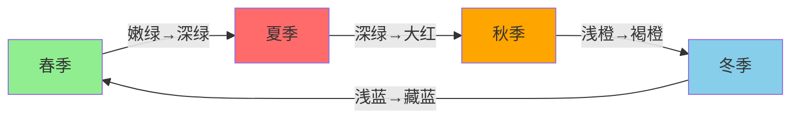
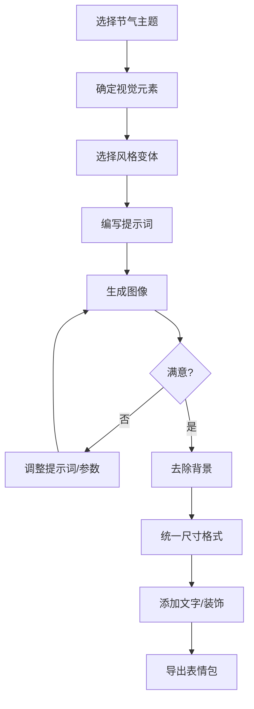

# 二十四节气表情包提示词指南

本文整理了使用 AI 绘画工具（Midjourney、Stable Diffusion）生成二十四节气主题表情包的完整提示词方案。

## 一、二十四节气概览

二十四节气是中国传统农历中标志季节变化的重要节气，被誉为"中国的第五大发明"。每个节气都有其独特的视觉元素和文化内涵。

### 1.1 节气信息速查表

| 季节 | 节气 | 英文/拼音 | 代表视觉元素 | 主色系 |
|:---:|------|----------|-------------|:------:|
| **春** | 立春 | Lichun / Start of Spring | 春牛、迎春花、燕子 | 🟢 嫩绿 |
| | 雨水 | Yushui / Rain Water | 春雨、柳枝、油纸伞 | 🟢 青绿 |
| | 惊蛰 | Jingzhe / Awakening of Insects | 桃花、春雷、蛰虫、黄鹂 | 🟢 粉绿 |
| | 春分 | Chunfen / Spring Equinox | 燕子、风筝、阴阳平衡 | 🟢 草绿 |
| | 清明 | Qingming / Clear and Bright | 柳枝、青团、雨滴、踏青 | 🟢 翠绿 |
| | 谷雨 | Guyu / Grain Rain | 牡丹、茶叶、春耕、雨丝 | 🟢 深绿 |
| **夏** | 立夏 | Lixia / Start of Summer | 蝉、荷叶、蚕豆 | 🔴 浅红 |
| | 小满 | Xiaoman / Grain Buds | 麦穗、蚕茧、枇杷 | 🔴 橙红 |
| | 芒种 | Mangzhong / Grain in Ear | 麦田、农耕、梅子 | 🔴 金黄 |
| | 夏至 | Xiazhi / Summer Solstice | 西瓜、荷花、蝉鸣、扇子 | 🔴 大红 |
| | 小暑 | Xiaoshu / Minor Heat | 莲蓬、蜻蜓、萤火虫 | 🔴 朱红 |
| | 大暑 | Dashu / Major Heat | 向日葵、冰棍、荷塘 | 🔴 深红 |
| **秋** | 立秋 | Liqiu / Start of Autumn | 落叶、梧桐、蟋蟀 | 🟠 浅橙 |
| | 处暑 | Chushu / End of Heat | 棉花、高粱、鸭子 | 🟠 橙黄 |
| | 白露 | Bailu / White Dew | 露珠、桂花、大雁 | 🟠 金橙 |
| | 秋分 | Qiufen / Autumn Equinox | 月亮、桂花、菊花 | 🟠 橘色 |
| | 寒露 | Hanlu / Cold Dew | 枫叶、菊花、柿子 | 🟠 深橙 |
| | 霜降 | Shuangjiang / Frost's Descent | 霜花、红叶、柿子、南瓜 | 🟠 褐橙 |
| **冬** | 立冬 | Lidong / Start of Winter | 白菜、饺子、初雪 | 🔵 浅蓝 |
| | 小雪 | Xiaoxue / Minor Snow | 雪花、腊肉、围炉 | 🔵 灰蓝 |
| | 大雪 | Daxue / Major Snow | 大雪、梅花、雪人 | 🔵 银白 |
| | 冬至 | Dongzhi / Winter Solstice | 饺子、汤圆、火锅、暖阳 | 🔵 深蓝 |
| | 小寒 | Xiaohan / Minor Cold | 冰凌、梅花、麻雀 | 🔵 冰蓝 |
| | 大寒 | Dahan / Major Cold | 雪景、年画、爆竹、年货 | 🔵 藏蓝 |

### 1.2 色彩设计原则



- **春季**：以绿色系为主，象征生机与希望
- **夏季**：由绿转红，表现热烈与活力
- **秋季**：橙黄色系，体现丰收与成熟
- **冬季**：蓝白色系，展现静谧与纯净

---

## 二、通用提示词模板

### 2.1 Midjourney 模板

#### 多表情组合模板
```
[节气名] solar term, cute chibi character, sticker style multiple poses and expressions, 9 images, kawaii emoji, [视觉元素], Chinese traditional style, [季节色系] color palette, white background --niji 5 --ar 1:1
```

#### 单张贴纸模板
```
A sticker of cute chibi [角色] celebrating [节气英文], [视觉元素], Chinese ink painting style, kawaii, pastel [季节色系], white background --ar 1:1 --niji 5 --s 180
```

#### 系列贴纸包模板
```
[节气名] solar term sticker sheet, cute chibi characters, multiple poses, [视觉元素], Chinese traditional elements, knolling layout, white border, [季节色系] --ar 1:1 --niji 5 --s 180
```

### 2.2 Stable Diffusion 模板

#### 基础模板
```
(chibi:1.3), cute character, [节气主题], [视觉元素], Chinese traditional style, simple background, white background, best quality, masterpiece, <lora:chinese_style:0.7>
```

#### 负面提示词（通用）
```
EasyNegativeV2, (badhandv4:1.2), lowres, bad anatomy, bad hands, text, error, missing fingers, extra digit, fewer digits, cropped, worst quality, low quality, normal quality, jpeg artifacts, signature, watermark, blurry
```

---

## 三、春季节气提示词

### 3.1 立春 (Lichun / Start of Spring)

**节气特点**：万物复苏，春回大地

**视觉元素**：春牛、迎春花、燕子、嫩芽、春风

**Midjourney 提示词：**
```
Lichun Start of Spring, cute chibi girl holding spring flowers, swallow birds flying, green sprouts emerging, Chinese traditional style, sticker, kawaii, fresh green colors, white background --ar 1:1 --niji 5 --s 180
```

**多表情版：**
```
Lichun Start of Spring, cute chibi child, sticker style multiple poses and expressions, 9 images, kawaii emoji, spring flowers, swallows, green sprouts, Chinese style, fresh green palette, white background --niji 5 --ar 1:1
```

---

### 3.2 雨水 (Yushui / Rain Water)

**节气特点**：春雨绵绵，润物无声

**视觉元素**：春雨、油纸伞、柳枝、水滴、池塘

**Midjourney 提示词：**
```
Yushui Rain Water, cute chibi child with oil paper umbrella, spring rain drops falling, willow branches swaying, Chinese ink style, sticker, kawaii, soft green and blue, white background --ar 1:1 --niji 5 --s 180
```

**多表情版：**
```
Yushui Rain Water, cute chibi character, sticker style multiple poses and expressions, 9 images, kawaii emoji, oil paper umbrella, rain drops, willow, Chinese style, cyan green palette, white background --niji 5 --ar 1:1
```

---

### 3.3 惊蛰 (Jingzhe / Awakening of Insects)

**节气特点**：春雷惊蛰，万物苏醒

**视觉元素**：桃花、春雷、蛰虫、黄鹂、布谷鸟

**Midjourney 提示词：**
```
Jingzhe Awakening of Insects, cute chibi character surrounded by peach blossoms, little insects waking up, spring thunder clouds, oriole bird, Chinese style, sticker, kawaii, pink and green, white background --ar 1:1 --niji 5 --s 180
```

**多表情版：**
```
Jingzhe Awakening of Insects, cute chibi child, sticker style multiple poses and expressions, 9 images, kawaii emoji, peach blossoms, thunder, insects, Chinese style, pink green palette, white background --niji 5 --ar 1:1
```

---

### 3.4 春分 (Chunfen / Spring Equinox)

**节气特点**：昼夜平分，阴阳平衡

**视觉元素**：燕子、风筝、阴阳符号、春耕、平衡意象

**Midjourney 提示词：**
```
Chunfen Spring Equinox, cute chibi child flying colorful kite, swallows returning, balanced yin yang symbol in background, Chinese traditional, sticker, kawaii, vibrant green, white background --ar 1:1 --niji 5 --s 180
```

**多表情版：**
```
Chunfen Spring Equinox, cute chibi character, sticker style multiple poses and expressions, 9 images, kawaii emoji, kite flying, swallows, yin yang, Chinese style, grass green palette, white background --niji 5 --ar 1:1
```

---

### 3.5 清明 (Qingming / Clear and Bright)

**节气特点**：踏青祭祖，万物清明

**视觉元素**：柳枝、青团、踏青、细雨、风筝

**Midjourney 提示词：**
```
Qingming Clear and Bright, cute chibi character having picnic outdoors, green grass field, willow trees, qingtuan green rice balls, Chinese style, sticker, kawaii, fresh emerald green, white background --ar 1:1 --niji 5 --s 180
```

**多表情版：**
```
Qingming Clear and Bright, cute chibi child, sticker style multiple poses and expressions, 9 images, kawaii emoji, willow branches, qingtuan, spring outing, Chinese style, emerald green palette, white background --niji 5 --ar 1:1
```

---

### 3.6 谷雨 (Guyu / Grain Rain)

**节气特点**：雨生百谷，春耕时节

**视觉元素**：牡丹、茶叶、春耕、雨丝、谷物

**Midjourney 提示词：**
```
Guyu Grain Rain, cute chibi farmer child planting seeds in field, peony flowers blooming, rain drops, tea leaves, Chinese style, sticker, kawaii, deep green, white background --ar 1:1 --niji 5 --s 180
```

**多表情版：**
```
Guyu Grain Rain, cute chibi character, sticker style multiple poses and expressions, 9 images, kawaii emoji, peony flowers, tea leaves, farming, rain, Chinese style, deep green palette, white background --niji 5 --ar 1:1
```

---

## 四、夏季节气提示词

### 4.1 立夏 (Lixia / Start of Summer)

**节气特点**：夏季开始，万物繁茂

**视觉元素**：蝉、荷叶、蚕豆、樱桃、蔷薇

**Midjourney 提示词：**
```
Lixia Start of Summer, cute chibi child playing with cicada, lotus leaves, broad beans, cherries, Chinese style, sticker, kawaii, light red and green, white background --ar 1:1 --niji 5 --s 180
```

---

### 4.2 小满 (Xiaoman / Grain Buds)

**节气特点**：麦穗初饱，蚕茧成熟

**视觉元素**：麦穗、蚕茧、枇杷、野花

**Midjourney 提示词：**
```
Xiaoman Grain Buds, cute chibi character in golden wheat field, silkworm cocoons, loquat fruits, Chinese rural style, sticker, kawaii, golden yellow, white background --ar 1:1 --niji 5 --s 180
```

---

### 4.3 芒种 (Mangzhong / Grain in Ear)

**节气特点**：麦收农忙，播种时节

**视觉元素**：麦田、农耕、梅子、青杏

**Midjourney 提示词：**
```
Mangzhong Grain in Ear, cute chibi farmer child harvesting wheat, plum fruits, busy farming scene, golden fields, Chinese style, sticker, kawaii, golden orange, white background --ar 1:1 --niji 5 --s 180
```

---

### 4.4 夏至 (Xiazhi / Summer Solstice)

**节气特点**：日长之至，阳气最盛

**视觉元素**：西瓜、荷花、蝉鸣、扇子、凉面

**Midjourney 提示词：**
```
Xiazhi Summer Solstice, cute chibi child eating watermelon slice, lotus flowers blooming, paper fan, cicada singing on tree, Chinese style, sticker, kawaii, bright red and green, white background --ar 1:1 --niji 5 --s 180
```

**多表情版：**
```
Xiazhi Summer Solstice, cute chibi character, sticker style multiple poses and expressions, 9 images, kawaii emoji, watermelon, lotus, fan, cicada, Chinese style, bright red palette, white background --niji 5 --ar 1:1
```

---

### 4.5 小暑 (Xiaoshu / Minor Heat)

**节气特点**：暑气渐盛，荷塘夏日

**视觉元素**：莲蓬、蜻蜓、萤火虫、荷塘

**Midjourney 提示词：**
```
Xiaoshu Minor Heat, cute chibi character catching dragonflies by lotus pond, lotus pods, fireflies glowing at dusk, Chinese summer scene, sticker, kawaii, warm red, white background --ar 1:1 --niji 5 --s 180
```

---

### 4.6 大暑 (Dashu / Major Heat)

**节气特点**：酷暑难耐，暑气最盛

**视觉元素**：向日葵、冰棍、荷塘、绿豆汤

**Midjourney 提示词：**
```
Dashu Major Heat, cute chibi child eating colorful ice pop, sunflowers blooming, lotus pond, extreme summer heat waves, Chinese style, sticker, kawaii, deep red and yellow, white background --ar 1:1 --niji 5 --s 180
```

---

## 五、秋季节气提示词

### 5.1 立秋 (Liqiu / Start of Autumn)

**节气特点**：秋风送爽，暑去凉来

**视觉元素**：落叶、梧桐、蟋蟀、秋风

**Midjourney 提示词：**
```
Liqiu Start of Autumn, cute chibi character with falling golden leaves, paulownia tree, cricket singing, first autumn breeze, Chinese style, sticker, kawaii, light orange, white background --ar 1:1 --niji 5 --s 180
```

---

### 5.2 处暑 (Chushu / End of Heat)

**节气特点**：暑气渐消，秋意渐浓

**视觉元素**：棉花、高粱、鸭子、稻田

**Midjourney 提示词：**
```
Chushu End of Heat, cute chibi child harvesting cotton, sorghum fields, ducks swimming in pond, Chinese rural autumn style, sticker, kawaii, orange yellow, white background --ar 1:1 --niji 5 --s 180
```

---

### 5.3 白露 (Bailu / White Dew)

**节气特点**：露凝而白，秋意渐浓

**视觉元素**：露珠、桂花、大雁南飞、芦苇

**Midjourney 提示词：**
```
Bailu White Dew, cute chibi character with crystal morning dew drops on grass, osmanthus flowers fragrant, wild geese flying south in V formation, Chinese style, sticker, kawaii, golden orange, white background --ar 1:1 --niji 5 --s 180
```

---

### 5.4 秋分 (Qiufen / Autumn Equinox)

**节气特点**：昼夜平分，丹桂飘香

**视觉元素**：满月、桂花、菊花、月饼、团圆

**Midjourney 提示词：**
```
Qiufen Autumn Equinox, cute chibi child admiring bright full moon, osmanthus and chrysanthemum flowers, mooncake, Chinese Mid-Autumn festival style, sticker, kawaii, warm orange, white background --ar 1:1 --niji 5 --s 180
```

**多表情版：**
```
Qiufen Autumn Equinox, cute chibi character, sticker style multiple poses and expressions, 9 images, kawaii emoji, full moon, osmanthus, mooncake, Chinese style, warm orange palette, white background --niji 5 --ar 1:1
```

---

### 5.5 寒露 (Hanlu / Cold Dew)

**节气特点**：露水寒凉，秋叶正红

**视觉元素**：枫叶、菊花、柿子、秋菊

**Midjourney 提示词：**
```
Hanlu Cold Dew, cute chibi character picking ripe persimmons, red maple leaves falling, chrysanthemum tea, Chinese autumn style, sticker, kawaii, deep orange and red, white background --ar 1:1 --niji 5 --s 180
```

---

### 5.6 霜降 (Shuangjiang / Frost's Descent)

**节气特点**：初霜降临，秋将尽

**视觉元素**：霜花、红叶、柿子、南瓜

**Midjourney 提示词：**
```
Shuangjiang Frost Descent, cute chibi child with frost crystals on leaves, brilliant red autumn leaves, ripe orange persimmons, pumpkins, Chinese style, sticker, kawaii, brown orange, white background --ar 1:1 --niji 5 --s 180
```

---

## 六、冬季节气提示词

### 6.1 立冬 (Lidong / Start of Winter)

**节气特点**：冬季开始，万物收藏

**视觉元素**：白菜、饺子、初雪、炉火

**Midjourney 提示词：**
```
Lidong Start of Winter, cute chibi character making dumplings with family, Chinese cabbage, first snow flakes falling, warm indoor scene with stove, Chinese style, sticker, kawaii, light blue and warm tones, white background --ar 1:1 --niji 5 --s 180
```

---

### 6.2 小雪 (Xiaoxue / Minor Snow)

**节气特点**：小雪初降，腌腊备冬

**视觉元素**：雪花、腊肉、围炉、暖炕

**Midjourney 提示词：**
```
Xiaoxue Minor Snow, cute chibi child in light snow, preserved meat hanging to dry, warming by fireplace, cozy winter scene, Chinese winter style, sticker, kawaii, grey blue, white background --ar 1:1 --niji 5 --s 180
```

---

### 6.3 大雪 (Daxue / Major Snow)

**节气特点**：大雪纷飞，银装素裹

**视觉元素**：大雪、梅花、雪人、雪景

**Midjourney 提示词：**
```
Daxue Major Snow, cute chibi character building adorable snowman, plum blossoms blooming in snow, heavy snowfall, Chinese winter wonderland scene, sticker, kawaii, silver white and pink, white background --ar 1:1 --niji 5 --s 180
```

**多表情版：**
```
Daxue Major Snow, cute chibi child, sticker style multiple poses and expressions, 9 images, kawaii emoji, snowman, plum blossoms, heavy snow, Chinese style, silver white palette, white background --niji 5 --ar 1:1
```

---

### 6.4 冬至 (Dongzhi / Winter Solstice)

**节气特点**：至阴之日，阳气始生

**视觉元素**：饺子、汤圆、火锅、团圆、暖阳

**Midjourney 提示词：**
```
Dongzhi Winter Solstice, cute chibi family eating dumplings and tangyuan rice balls together, hot pot steaming, warm sunshine through window, Chinese festival style, sticker, kawaii, deep blue and warm red, white background --ar 1:1 --niji 5 --s 180
```

**多表情版：**
```
Dongzhi Winter Solstice, cute chibi character, sticker style multiple poses and expressions, 9 images, kawaii emoji, dumplings, tangyuan, hot pot, family gathering, Chinese style, blue red palette, white background --niji 5 --ar 1:1
```

---

### 6.5 小寒 (Xiaohan / Minor Cold)

**节气特点**：寒气渐盛，冰凌初结

**视觉元素**：冰凌、梅花、麻雀、暖炉

**Midjourney 提示词：**
```
Xiaohan Minor Cold, cute chibi character with sparkling ice crystals, plum blossoms in snow, sparrows huddling for warmth, freezing cold winter scene, Chinese style, sticker, kawaii, ice blue, white background --ar 1:1 --niji 5 --s 180
```

---

### 6.6 大寒 (Dahan / Major Cold)

**节气特点**：寒气之极，年关将至

**视觉元素**：雪景、年画、爆竹、年货、春联

**Midjourney 提示词：**
```
Dahan Major Cold, cute chibi child with Chinese New Year elements, red firecrackers, nianhua new year paintings, preparing spring festival decorations, lucky red, Chinese style, sticker, kawaii, deep blue and festive red, white background --ar 1:1 --niji 5 --s 180
```

**多表情版：**
```
Dahan Major Cold, cute chibi character, sticker style multiple poses and expressions, 9 images, kawaii emoji, firecrackers, new year paintings, spring festival preparations, Chinese style, blue red palette, white background --niji 5 --ar 1:1
```

---

## 七、风格变体模板

### 7.1 国风水墨版

适合追求传统东方美学的设计。

```
[节气英文] solar term, Chinese ink wash painting style, cute chibi character, [视觉元素], traditional brush strokes, minimalist, elegant, Qi Baishi style, white background --ar 1:1 --niji 5
```

**示例 - 水墨立春：**
```
Lichun Start of Spring, Chinese ink wash painting style, cute chibi child, swallow birds, spring flowers, traditional brush strokes, minimalist, elegant, Qi Baishi style, white background --ar 1:1 --niji 5
```

---

### 7.2 3D 盲盒版

适合现代潮玩风格的设计。

```
[节气英文] solar term, cute chibi blind box toy figure, [视觉元素], 3D render, OC render, realistic PVC texture, fine luster, Chinese traditional elements, collectible figure style, pastel colors, white background --ar 1:1 --niji 5
```

**示例 - 盲盒冬至：**
```
Dongzhi Winter Solstice, cute chibi blind box toy figure, dumplings, tangyuan, warm scarf, 3D render, OC render, realistic PVC texture, fine luster, Chinese winter festival, collectible figure style, pastel blue and red, white background --ar 1:1 --niji 5
```

---

### 7.3 像素复古版

适合游戏风格或复古设计。

```
[节气英文] solar term, pixel art style, cute 8-bit chibi character, [视觉元素], retro game aesthetic, Chinese traditional theme, limited color palette, white background --ar 1:1 --niji 5
```

**示例 - 像素夏至：**
```
Xiazhi Summer Solstice, pixel art style, cute 8-bit chibi character, watermelon, lotus, paper fan, retro game aesthetic, Chinese summer theme, limited color palette, white background --ar 1:1 --niji 5
```

---

### 7.4 扁平插画版

适合现代简约风格设计。

```
[节气英文] solar term, flat illustration style, cute chibi character, [视觉元素], vector art, clean lines, modern Chinese style, geometric shapes, [季节色系] palette, white background --ar 1:1 --niji 5
```

**示例 - 扁平秋分：**
```
Qiufen Autumn Equinox, flat illustration style, cute chibi character, full moon, osmanthus flowers, mooncake, vector art, clean lines, modern Chinese style, geometric shapes, warm orange palette, white background --ar 1:1 --niji 5
```

---

## 八、Stable Diffusion 专用提示词

### 8.1 基础配置

**推荐模型**：
- 大模型：Counterfeit-V3.0 / MeinaMix / Anything V5
- LoRA：Chinese style / Chibi style

**推荐参数**：
- Steps: 25-30
- CFG Scale: 7-8
- Sampler: DPM++ 2M Karras

### 8.2 完整提示词示例

**立春：**
```
(chibi:1.3), cute little girl, holding spring flowers, swallow birds flying around, green sprouts, Chinese traditional spring festival style, Lichun Start of Spring theme, simple background, white background, best quality, masterpiece, <lora:chibi_style:0.7>, <lora:chinese_ink:0.5>
```

**夏至：**
```
(chibi:1.3), cute child eating watermelon, lotus flowers, paper fan, summer cicada, Chinese traditional summer style, Xiazhi Summer Solstice theme, simple background, white background, best quality, masterpiece, <lora:chibi_style:0.7>
```

**秋分：**
```
(chibi:1.3), cute child admiring full moon, osmanthus flowers, chrysanthemum, mooncake, Chinese Mid-Autumn festival style, Qiufen Autumn Equinox theme, simple background, white background, best quality, masterpiece, <lora:chibi_style:0.7>
```

**冬至：**
```
(chibi:1.3), cute child with family, eating dumplings, tangyuan rice balls, hot pot, warm indoor scene, Chinese winter festival style, Dongzhi Winter Solstice theme, simple background, white background, best quality, masterpiece, <lora:chibi_style:0.7>
```

**通用负面提示词：**
```
EasyNegativeV2, (badhandv4:1.2), lowres, bad anatomy, bad hands, text, error, missing fingers, extra digit, fewer digits, cropped, worst quality, low quality, normal quality, jpeg artifacts, signature, watermark, blurry, ugly, deformed
```

---

## 九、制作流程



### 9.1 批量生成技巧

1. **保持角色一致**：使用相同的角色描述词，只更换节气元素
2. **统一色调**：同一季节使用相近的色系
3. **固定构图**：使用相同的画面比例和布局
4. **批量处理**：使用 ADetailer 批量替换表情

### 9.2 后期处理

- **去除背景**：[remove.bg](https://remove.bg)
- **批量调整**：[iLoveIMG](https://www.iloveimg.com)
- **添加文字**：Figma / Canva / PS

---

## 参考资源

### 教程与灵感

- [Midjourney 二十四节气海报设计 - 站酷ZCOOL](https://www.zcool.com.cn/article/ZMTUzNzIzMg==.html)
- [二十四节气 AI 生成 - B站](https://www.bilibili.com/video/BV1NY4y1w7cn/)
- [不同设计师的二十四节气 - 数英](https://www.digitaling.com/articles/1037847.html)
- [24 Chinese Solar Terms Poster Series - Behance](https://www.behance.net/gallery/135720573/The-24-Chinese-Solar-Terms-Poster-Series)
- [Cara Ziruo Wang 二十四节气插画 - Creative Boom](https://www.creativeboom.com/inspiration/cara-ziruo-wang/)

### 提示词资源

- [AI绘画中国风提示词 - 知乎](https://zhuanlan.zhihu.com/p/661292759)
- [Midjourney 风格提示词大全 - 知乎](https://zhuanlan.zhihu.com/p/676955175)
- [24 Solar Terms LoRA - Shakker](https://www.shakker.ai/modelinfo/ab5a24fc381c4d448c458b15fb1d6ec0)

### 素材资源

- [二十四节气设计素材 - 觅知网](https://www.51miz.com/collections/ershisijieqi/)
- [24 Solar Terms Vector - Pikbest](https://pikbest.com/templates/chinese-style-vector-24-solar-terms_202391.html)
