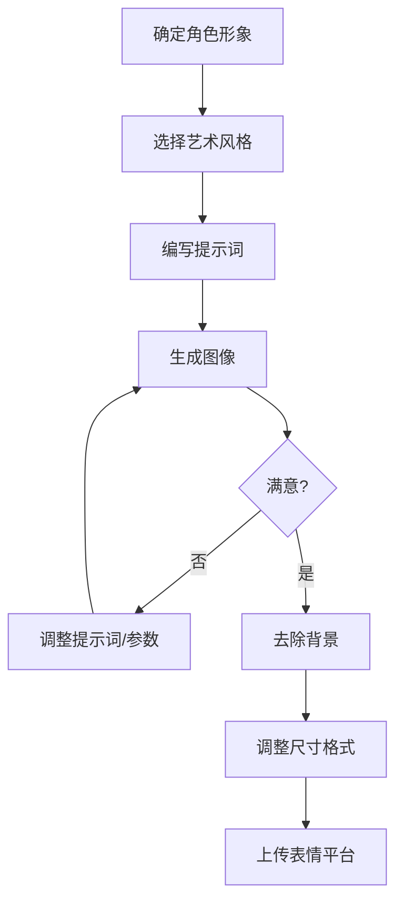

# AI绘画人物表情包提示词指南

本文汇总了使用 Stable Diffusion、Midjourney 等AI绘画工具制作人物表情包的提示词模板和技巧。

## 一、Stable Diffusion 表情包提示词

### 1.1 基础Q版表情包模板

```
(chibi), Simple graphic features, thick and cute limbs, simple and cute movements, Jean Julien
```

```
four cute poses and expressions, laughing, angry, speechless, sad
```

### 1.2 Sticker 专用提示词

```
stickers, emoji, biaoqing, chibi, cute, emotional, happy, love, simple background, calm, white background, best quality, <lora:some stickers:1>
```

### 1.3 人物表情基础模板

**正向提示词：**
```
1girl, face_prompt, Pure white background, professional photograph
```

**负面提示词：**
```
EasyNegativeV2, (badhandv4:1.2)
```

### 1.4 推荐LoRA模型

| 模型名称 | 触发词 | 说明 |
|---------|--------|------|
| some stickers | sticker, emoji | 搭配 dreamshaper 大模型使用 |
| Paimon's paintings style | chibi, white background, simple background, thick outline | Q版风格 |
| 筑梦工业 表情大师XL | ROFL, Grin, Laugh 等 | 3D渲染风格Emoji |

### 1.5 使用Emoji符号控制表情

对于使用 Danbooru 数据集的模型，西式颜文字也能控制生成图像的表情：

| 符号 | 效果 |
|-----|------|
| `:-)` | 微笑 |
| `:-(` | 不悦 |
| `;-)` | 使眼色 |
| `:-D` | 开心 |
| `:-P` | 吐舌头 |

---

## 二、Midjourney 表情包提示词

### 2.1 核心模板公式

```
A sticker of a [角色/物体], [艺术风格] style, [可选特征] --ar 1:1 --niji 5 --s 180
```

### 2.2 多表情组合模板

```
[[角色]], sticker style multiple poses and expressions, 9 images, [[外观形容词]] emoji, [[绘画风格]] style, different emotions, white background --v 5.1
```

> 💡 **提示**：如需更准确的人物手臂和腿部，可添加 `with 2 arms 2 legs`

### 2.3 表情包系列模板

```
[主体] sticker sheet/pack, with white border, knolling layout, [颜色-可选], [风格-可选] --ar 1:1 --niji 5 --s 180
```

### 2.4 实用示例

**Baby Yoda 表情包：**
```
baby yoda, sticker style multiple poses and expressions, 9 images, cute emoji, Disney style, different emotions, white background --v 5.1
```

**Q版雷神：**
```
A sticker of a cute Thor holding a hammer, chibi-style anime character --ar 1:1 --niji 5 --s 180
```

**可爱猫头鹰：**
```
sticker, Happy Colorful Owl wearing Headphones, kawaii, contour, vector, white background
```

**小狗贴纸包：**
```
Cute puppy sticker pack, with white border, knolling layout, harmonious colors --ar 1:1 --niji 5 --s 180 --style cute
```

---

## 三、常用表情关键词

### 3.1 情绪表情词汇

| 中文 | 英文提示词 |
|-----|-----------|
| 大笑 | ROFL, Laugh, Grin |
| 开心 | Happy, smile, :-D |
| 难过 | Sad, :-( |
| 生气 | Angry |
| 害怕 | Fear |
| 厌恶 | Disgust |
| 惊讶 | Surprise |
| 困惑 | Confused |
| 骄傲 | Proud |
| 可疑 | Suspicious |
| 轻蔑 | Contempt |
| 担忧 | Concerned |

### 3.2 面部表情词汇

| 英文 | 中文说明 |
|-----|---------|
| `looking at viewer` | 看向观众 |
| `closed mouth` | 闭嘴 |
| `smile` | 微笑 |
| `open mouth` | 张嘴 |
| `blush` | 脸红 |
| `tears` | 流泪 |
| `wink` | 眨眼 |
| `pout` | 嘟嘴 |

---

## 四、推荐艺术风格

| 风格名称 | 说明 |
|---------|------|
| **Pixar style** | 皮克斯3D动画风格 |
| **Kawaii** | 日系可爱风 |
| **Chibi** | Q版/小人风 |
| **Watercolor** | 水彩手绘风 |
| **Pop Art** | 波普艺术风格 |
| **Disney style** | 迪士尼动画风格 |
| **CandyCore** | 糖果色彩风 |
| **Whimsical** | 奇幻异想风 |
| **Graffiti art** | 涂鸦艺术风 |
| **Cyberpunk** | 赛博朋克风 |
| **Iridescent** | 炫彩光泽风 |

---

## 五、制作流程与技巧

### 5.1 制作流程



### 5.2 核心技巧

1. **白色背景**：在提示词末尾加 `white background` 可获得干净无背景的角色

2. **权重控制**：
   - `(关键词:1.5)` - 增强权重（更强调该特征）
   - `(关键词:0.8)` - 降低权重（弱化该特征）

3. **词序重要性**：Prompt中的词语顺序代表其权重，越靠前权重越大

4. **ADetailer技术**：通过替换 After Detailer 中的正向提示词，可以绘制出一组不同表情的人物，且除面部之外的头发、脸型都保持不变

5. **边框效果**：添加 `with white border` 可以让贴纸更加突出，适用于任何背景

### 5.3 后期处理

- **去除背景**：使用 [remove.bg](https://remove.bg) 一键去除背景
- **格式转换**：使用 [iloveimg.com](https://www.iloveimg.com) 批量调整尺寸和格式
- **微信表情要求**：按照微信表情开放平台的格式和尺寸要求进行调整

---

## 六、提示词构成要素

### 人物描述框架

| 要素 | 示例 |
|-----|------|
| **人物身份** | man, girl, boy, woman |
| **发型发色** | white long hair, short black hair |
| **五官特征** | big eyes, small nose |
| **面部表情** | smile, angry, sad |
| **肢体动作** | raise one's arm, sitting |
| **服装穿着** | dress, t-shirt, hoodie |

### 环境与氛围

| 要素 | 示例 |
|-----|------|
| **时间** | day, night, morning |
| **光线** | sunlight, bright, dark |
| **场景** | indoor, outdoor, white background |

---

## 七、可直接复制的提示词合集

以下是网络上收集的可直接复制使用的完整提示词，按类别整理。

### 7.1 Stable Diffusion 完整提示词

#### Q版表情包（配合 LoRA 使用）

**提示词 1 - 基础Q版：**
```
(chibi:1.3), Simple graphic features, thick and cute limbs, simple and cute movements, Jean Julien, four cute poses and expressions, laughing, angry, speechless, sad, white background, best quality
```

**提示词 2 - 使用 Paimon LoRA：**
```
chibi, white background, simple background, thick outline, 1girl, cute face, multiple expressions, happy, sad, angry, surprised, <lora:paimon_style:0.8>
```

**提示词 3 - 3D Emoji 风格：**
```
3d render, emoji style, cute character, (chibi:1.2), expressive face, Laugh, Grin, Happy, simple background, white background, high quality, <lora:emoji_master:1>
```

**提示词 4 - 贴纸风格：**
```
stickers, emoji, biaoqing, (chibi:1.2), cute, emotional, happy, love, simple background, calm, white background, best quality, masterpiece, <lora:some_stickers:1>
```

**负面提示词（通用）：**
```
EasyNegativeV2, (badhandv4:1.2), lowres, bad anatomy, bad hands, text, error, missing fingers, extra digit, fewer digits, cropped, worst quality, low quality, normal quality, jpeg artifacts, signature, watermark
```

---

### 7.2 Midjourney 完整提示词

#### 角色表情包系列

**皮卡丘表情包：**
```
pikachu, sticker style multiple poses and expressions, 9 images, cute emoji, pixar style, different emotions, white background --v 5.1
```

**Baby Yoda 表情包：**
```
baby yoda, sticker style multiple poses and expressions, 9 images, cute emoji, Disney style, different emotions, white background --v 5.1
```

**可爱女孩表情包：**
```
cute anime girl with pink hair, sticker style multiple poses and expressions, 9 images, kawaii emoji, chibi style, different emotions, white background --niji 5
```

**小熊表情包：**
```
cute teddy bear, sticker style multiple poses and expressions, 9 images, adorable emoji, watercolor style, different emotions, white background --v 5.1
```

#### 猫咪贴纸系列

**怀旧风猫咪：**
```
cat, Sticker, Nostalgic, Luminous Colors, Cartoon, Contour, Vector, White Background --ar 1:1 --niji 5
```

**可爱风猫咪：**
```
cat, Sticker, Exhilarated, Muted Color, Kawaii, Contour, Vector, White Background --ar 1:1 --niji 5
```

**好奇猫咪：**
```
cat, Sticker, Curious, Dark, Sketch, Contour, Vector, White Background --ar 1:1 --niji 5
```

**活力猫咪：**
```
cat, Sticker, Energetic, Monochrome, art toy style, Contour, Vector, White Background --ar 1:1 --niji 5
```

**波普风猫咪：**
```
cat, Sticker, Radiant, Iridescent Colors, Pop Art, Contour, Vector, White Background --ar 1:1 --niji 5
```

#### 单个贴纸

**戴耳机的猫头鹰：**
```
sticker, Happy Colorful Owl wearing Headphones, kawaii, contour, vector, white background --ar 1:1
```

**可爱苹果：**
```
cute apple with a face, sticker, happy, pastel, disney, white contour, vector, white background, detailed --ar 1:1
```

**Q版雷神：**
```
A sticker of a cute Thor holding a hammer, chibi-style anime character --ar 1:1 --niji 5 --s 180
```

**可爱独角兽：**
```
A sticker of a magical unicorn with rainbow mane, kawaii style, sparkles, pastel colors --ar 1:1 --niji 5 --s 180
```

#### 贴纸包/系列

**小狗贴纸包：**
```
Cute puppy sticker pack, with white border, knolling layout, harmonious colors --ar 1:1 --niji 5 --s 180 --style cute
```

**水果贴纸系列：**
```
Kawaii fruit sticker sheet, apple orange banana strawberry, with white border, knolling layout, pastel colors --ar 1:1 --niji 5 --s 180
```

**日程贴纸：**
```
sticker paper of dogs and cats for agenda reminders --style raw --s 50 --v 6.0
```

---

### 7.3 Chibi/Kawaii 风格完整提示词

**精致Q版女孩（Midjourney）：**
```
Cute Girl, Blue and purple hair, blue and purple rococo clothing, blind box style, collectable toy, full body, BJD makeup, realistic PVC texture, fine luster, chibi, transparent pastel color hair, 3d render, OC render, 3d model, blender render, good lighting, ultra detail, 8k --ar 9:16 --niji 5
```

**Kawaii 魅力风格：**
```
a young girl with blue hair is flying near a beach, in the style of intricate costumes, kawaii chic, kawaii charm, vibrant and lively hues, animated gifs, light bronze and bronze --s 50 --ar 3:4 --niji 5
```

**可爱兔子系列：**
```
cute bunny, pink bow, heart-shaped balloons, glittering stars, kawaii style, pastel colors, white background --ar 1:1 --niji 5
```

**魔法森林角色：**
```
a cute character in a magical forest, holding a tiny wand, surrounded by sparkling lights, chibi style, fantasy, pastel colors --ar 1:1 --niji 5
```

---

### 7.4 提示词组合公式

使用以下公式快速生成自定义提示词：

**Midjourney 多表情公式：**
```
[角色名], sticker style multiple poses and expressions, 9 images, [形容词] emoji, [风格] style, different emotions, white background --v 5.1
```

**Midjourney 单贴纸公式：**
```
A sticker of a [形容词] [角色/物品], [风格] style, [特征], white background --ar 1:1 --niji 5 --s 180
```

**Stable Diffusion 公式：**
```
(chibi:1.2), [角色描述], [表情], [动作], simple background, white background, best quality, <lora:[lora名称]:权重>
```

---

## 参考资源

### 教程与指南

- [Stable Diffusion人物表情提示词大全 - 草凡博客](https://caovan.com/tuwenduizhaostable-diffusionrenwubiaoqingtishicidaquan/.html)
- [SD提示词模板(emoji表情) - Stable Diffusion中文网](https://www.stablediffusion-cn.com/sd/sd-use/541.html)
- [用AI绘画做表情包教程 - CSDN](https://blog.csdn.net/m0_71745754/details/142628708)
- [创建专属表情包完整教程 - CSDN](https://blog.csdn.net/cxyxx12/article/details/137508000)
- [25 Midjourney Sticker Prompts - AIarty](https://www.aiarty.com/midjourney-prompts/midjourney-sticker-prompts.htm)
- [How to generate stickers in Midjourney - Medium](https://medium.com/@emreakcol/tutorial-how-to-generate-stickers-in-midjourney-for-whatsapp-telegram-imessage-and-wechat-in-3-f4e11dc000ad)
- [20+ Incredible Midjourney Sticker Prompts - Medium](https://medium.com/design-bootcamp/20-incredible-midjourney-sticker-prompts-that-sell-55d82def819b)
- [Best 25 Midjourney Prompts for Sticker - OpenArt](https://openart.ai/blog/post/midjourney-prompts-for-sticker)
- [Best 25 Midjourney Prompts for Kawaii - OpenArt](https://openart.ai/blog/post/midjourney-prompts-for-kawaii)

### 提示词生成工具

- [Free Midjourney Sticker Prompt Generator](https://www.howtoleverageai.com/post/free-midjourney-sticker-prompt-generator-create-super-cool-character-for-pod-nft-stories-emojis-more)
- [AI绘画提示词生成工具 - 松鼠盒子](https://www.songshuhezi.com/tools/prompt_generator.html)
- [PromptHero - Sticker Prompts](https://prompthero.com/sticker-prompts)
- [PromptBase 提示词商城](https://promptbase.cn/)

### 提示词资源网站

- [全网最全的AI绘画提示词网站 - 少数派](https://sspai.com/post/79392)
- [461 AI Art Prompts for Chibi Kawaii - Sevenstyles](https://sevenstyles.com/p/461-ai-art-prompts-images-for-chibi-kawaii-1370938/)
- [Midjourney绘画提示词Prompt大全 - 知乎](https://zhuanlan.zhihu.com/p/676955175)

### LoRA 模型资源

- [Paimon's paintings style LoRA - Civitai](https://civitai.com/models/26291/paimons-paintings-style-genshin-impact-stickers)
- [LoRA 触发词提取工具 - GitHub](https://github.com/a2569875/lora-prompt-tool)

### 后期处理工具

- [Remove.bg - 一键去除背景](https://remove.bg)
- [iLoveIMG - 批量图片处理](https://www.iloveimg.com)
