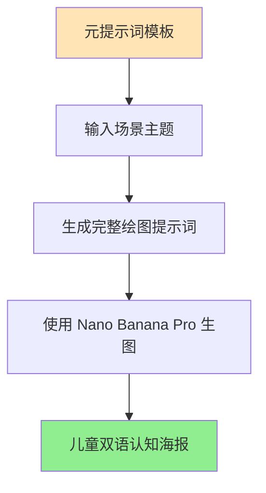

# 儿童认知海报元提示词指南

本文整理了一套专业的儿童双语认知海报元提示词系统，适用于生成面向2-5岁幼儿的教育类视觉内容。

> **来源**：Twitter @LufzzLiz
> **推荐模型**：Nano Banana Pro

## 一、概述

### 1.1 功能定位



### 1.2 核心特点

| 项目 | 说明 |
|-----|------|
| **目标用户** | 2-5岁幼儿（词汇爆发期） |
| **输出格式** | 竖版 A4 认知小报/海报 |
| **画面风格** | 黏土塑形 3D 风格 (Claymation) |
| **标注系统** | 三行双语标签（汉字 + 拼音 + 英文） |
| **色彩风格** | 莫兰迪/马卡龙色系 |

---

## 二、使用方式

### 2.1 两种生成方式

| 方式 | 操作流程 | 适用场景 |
|-----|---------|---------|
| **方式A** | 元提示词 + 场景名 → 生成提示词 → 喂给 Nano Pro | 需要精细控制 |
| **方式B** | 直接在元提示词写入具体场景 → Nano Pro 生图 | 快速出图 |

> **作者提示**：资源模型不降智的情况下，两种方式差别不大。

### 2.2 标签标错问题解决技巧

> 如果出现标签标错的情况，可以**让模型先把错误标签去掉，然后再让它打上去**，效果可能更好。

### 2.3 可调整参数

- 图标文字展示顺序
- 画面尺寸（竖版/横幅）
- 物体数量和分布

---

## 三、元提示词完整模板

### 3.1 变量定义

```
[SCENE_THEME] = {在此处填入场景，例如：繁忙的恐龙世界 / 热闹的超级市场 / 广阔的太空站}
[TARGET_AGE] = 2-5 岁 (词汇爆发期，需要丰富且清晰的指引)
```

### 3.2 完整提示词结构

```
绘图提示词 (Optimized Prompt Structure)

【全局设定】
一张极具视觉冲击力、内容丰富的儿童认知，主题为《[SCENE_THEME]》，竖版 A4。整体采用柔和、圆润的黏土塑形 3D 风格 (Soft Claymation/Plush 3D Sculpture)，就像一个巨大的、精心布置的实体玩具沙盘。光线明亮、温暖、纯净，带有细腻的体积光，营造出无与伦比的治愈感和触摸感。

一、小报标题区（顶部横幅）
大标题：在画面顶部横向展开标题：《[SCENE_THEME] 双语认知大发现》。
字体风格：超大、圆滚滚的彩色黏土气球字体，边缘带有柔和的描边和高光，像浮在空中的棉花糖。
装饰元素：标题两侧散落着与 [SCENE_THEME] 相关的可爱小型黏土装饰浮雕，增加横幅的热闹感。

二、小报主体（核心场景与构图）
场景气氛：一个广阔、充满活力且细节丰富的"玩具微缩世界"。色彩依然保持莫兰迪/马卡龙色系的柔和高饱和度，但画面信息量大幅增加。
构图要求（关键变化）：
采用广角微缩景观 (Wide-angle Miniature Landscape) 视角。
景深调整：不再是极浅景深。前景和中景（放置大量物体的主要区域）必须全焦段清晰锐利。只有最远处的背景才进行柔焦虚化处理，以交代环境氛围。
布局策略：由于物件增多，需要将物体分组、分区域散落在横幅的不同位置，物体之间保持舒适的"呼吸感"间距，避免视觉拥挤。
引导角色：
1-2 位圆润可爱的黏土卡通向导（如：探险家宝宝和机器小狗），在场景中处于活跃状态，用夸张、清晰的肢体语言引导视线浏览整个横幅。

三、必画物体与认知清单 (Rich Content Generation)
清晰、散点式地分布以下各类物体。所有物体都必须是极度圆润、无尖角、黏土玩具质感：
核心认知大件 (Major Objects)：
（数量增加到 5-8 个 大型标志性物体，分布在场景主要位置）
{在此填入 5-8 个核心大物体，例如：霸王龙、三角龙、火山、翼龙巢穴、原始人部落}
丰富认知小件 (Detailed Items)：
（数量增加到 8-9 个 中小型具体物品，散落在核心大件周围）
{在此填入 8-9 个具体小物品，例如：恐龙蛋、巨大的骨头、蕨类植物、小蜥蜴、石斧、蜻蜓}
环境元素 (Environmental Elements)：
（用于丰富背景和地面的元素，数量不限，但要简化）
{例如：圆润的石块、Q弹的河流、棉花糖般的云朵}

四、精准指示与双语标签系统 (Precise Labeling System)
这是本版优化的核心，用于处理多物体认知带来的混乱感。
对上述所有需要认知的物体进行标注，必须严格遵守以下规则：

标签样式 (Label Box Style)：
一个圆角矩形、具有厚实黏土或软胶质感的三行标签牌。底色为柔和的奶白色或浅黄色，以突出文字。
标签牌带有微微的 3D 浮雕效果，像贴在画面上的精美磁铁。

标签内容 (Three-Line Content)：
第一行：简体汉字（超粗圆体，颜色醒目）。
第二行：标准汉语拼音（带声调，字体稍小，清晰易读）。
第三行：英文单词（清晰的无衬线圆体，字体稍小）。

示例格式：
[ 恐 龙 ]
[ kǒng lóng ]
[ Dinosaur ]

精准指示箭头 (Precise Pointing Arrow)：
形态：必须使用一根粗壮、圆润、像挤出的牙膏或黏土条一样的 3D 箭头。颜色采用醒目的暖色调（如橙黄色或粉蓝色），与背景形成对比。
连接方式：箭头的一端连接标签牌边缘，另一端非常精准地、就近地指向或触碰对应的目标物体。
布局原则：箭头必须清晰、顺畅，严禁箭头之间相互交叉。标签牌应放置在离物体最近的空白区域，通过箭头连接，确保画面整洁有序。

五、画风参数总结 (Style Parameters Summary)
风格基调：Vertical A4 Claymation Diorama for Toddlers (竖版 A4 幼儿黏土透视场景)
关键修饰：Crowded but Organized Composition (丰富但有序的构图), Precise Labeling with Thick 3D Arrows (带粗 3D 箭头的精准标注), Soft Volumetric Lighting (柔和体积光).
色彩与质感：Rich Pastel Colors, Tactile Clay Texture, Smooth Edges.
渲染质量：8K Ultra HD, Cinema 4D cute render styles.
```

---

## 四、提示词结构详解

### 4.1 模块功能说明

| 模块 | 功能 | 关键要素 |
|-----|------|---------|
| **全局设定** | 定义整体风格基调 | 黏土3D风格、温暖光线、治愈感 |
| **标题区** | 顶部横幅设计 | 彩色气球字体、黏土装饰浮雕 |
| **主体场景** | 核心画面构图 | 广角微缩景观、分区布局、引导角色 |
| **物体清单** | 认知内容生成 | 大件5-8个、小件8-9个、环境元素 |
| **标签系统** | 双语标注规范 | 三行标签 + 3D箭头指示 |
| **画风参数** | 渲染质量设定 | 8K、Cinema 4D、马卡龙色系 |

### 4.2 双语标签系统详解

```
┌─────────────────────┐
│      恐 龙          │  ← 第一行：简体汉字（超粗圆体，颜色醒目）
│    kǒng lóng       │  ← 第二行：拼音带声调（字体稍小）
│    Dinosaur        │  ← 第三行：英文单词（无衬线圆体）
└─────────────────────┘
          │
          ▼  3D 黏土箭头（橙黄/粉蓝色）
        🦕 目标物体
```

**标签设计要点**：
- 圆角矩形，黏土/软胶质感
- 底色：柔和奶白色或浅黄色
- 3D浮雕效果，像精美磁铁
- 箭头粗壮圆润，像挤出的牙膏

### 4.3 构图策略

| 区域 | 处理方式 |
|-----|---------|
| **前景/中景** | 全焦段清晰锐利（物体主要分布区） |
| **远景背景** | 柔焦虚化（交代环境氛围） |
| **物体布局** | 分组分区、保持"呼吸感"间距 |
| **引导角色** | 1-2位黏土卡通向导引导视线 |

---

## 五、场景示例

### 5.1 恐龙世界

```
[SCENE_THEME] = 繁忙的恐龙世界

核心认知大件：霸王龙、三角龙、火山、翼龙巢穴、腕龙、剑龙、原始森林、恐龙蛋窝
丰富认知小件：恐龙蛋、巨大的骨头、蕨类植物、小蜥蜴、石斧、蜻蜓、翼龙宝宝、火山岩
环境元素：圆润的石块、Q弹的河流、棉花糖般的云朵、史前植物
```

### 5.2 超级市场

```
[SCENE_THEME] = 热闹的超级市场

核心认知大件：购物车、收银台、货架、水果摊、蔬菜区、冷柜、面包架、称重台
丰富认知小件：苹果、香蕉、牛奶、面包、鸡蛋、胡萝卜、西红柿、饼干、果汁
环境元素：价格标签、购物篮、地砖、灯光、促销海报
```

### 5.3 太空站

```
[SCENE_THEME] = 广阔的太空站

核心认知大件：宇宙飞船、空间站、地球、月球、火箭、卫星、太阳、星云
丰富认知小件：宇航员、太空服、星星、陨石、望远镜、控制台、氧气罐、太空食品
环境元素：银河、星空背景、光带、宇宙尘埃
```

### 5.4 海洋世界

```
[SCENE_THEME] = 神奇的海洋世界

核心认知大件：鲸鱼、海豚、鲨鱼、海龟、珊瑚礁、潜水艇、沉船、海底城堡
丰富认知小件：小丑鱼、海星、水母、章鱼、海马、贝壳、海草、珍珠
环境元素：气泡、水波纹、阳光透射、沙底
```

### 5.5 农场生活

```
[SCENE_THEME] = 快乐的农场生活

核心认知大件：谷仓、拖拉机、风车、农舍、果树、菜园、池塘、稻草人
丰富认知小件：奶牛、小猪、公鸡、小羊、鸭子、兔子、胡萝卜、玉米
环境元素：栅栏、草地、蓝天白云、小路、花丛
```

---

## 六、画风参数速查

### 6.1 风格关键词

```
风格基调: Vertical A4 Claymation Diorama for Toddlers
         (竖版 A4 幼儿黏土透视场景)

关键修饰:
  - Crowded but Organized Composition (丰富但有序的构图)
  - Precise Labeling with Thick 3D Arrows (带粗 3D 箭头的精准标注)
  - Soft Volumetric Lighting (柔和体积光)

色彩质感:
  - Rich Pastel Colors (丰富的粉彩色)
  - Tactile Clay Texture (可触摸的黏土质感)
  - Smooth Edges (圆润边缘)

渲染质量:
  - 8K Ultra HD
  - Cinema 4D cute render styles
```

### 6.2 中英对照速查表

| 中文 | 英文 |
|-----|------|
| 黏土塑形风格 | Soft Claymation / Plush 3D Sculpture |
| 玩具微缩世界 | Toy Miniature World |
| 广角微缩景观 | Wide-angle Miniature Landscape |
| 体积光 | Volumetric Lighting |
| 莫兰迪色系 | Morandi Color Palette |
| 马卡龙色系 | Macaron / Pastel Colors |
| 圆角矩形标签 | Rounded Rectangle Label |
| 3D浮雕效果 | 3D Embossed Effect |
| 气球字体 | Balloon Typography |
| 无尖角设计 | Smooth / Rounded Edges |

---

## 七、常见问题与技巧

### 7.1 标签标错问题

**问题**：生成的图片中标签指向错误的物体

**解决方案**：
1. 让模型先把错误标签去掉
2. 然后再让它重新打上标签
3. 分步操作效果更好

### 7.2 物体过于拥挤

**问题**：画面物体太多导致视觉混乱

**解决方案**：
- 减少物体数量
- 增加物体之间的间距
- 使用分组布局策略
- 保持"呼吸感"

### 7.3 横幅版本调整

如需生成横幅版本，调整以下参数：

```
原：竖版 A4
改：横版 16:9 / 横幅 Banner

原：Vertical A4
改：Horizontal 16:9 Banner
```

---

## 八、扩展应用场景

基于此元提示词框架，可快速生成以下主题认知海报：

| 类别 | 可选主题 |
|-----|---------|
| **动物类** | 恐龙世界、海洋生物、农场动物、森林动物、昆虫王国 |
| **场所类** | 超级市场、医院、消防站、学校、机场、游乐园 |
| **交通类** | 繁忙的马路、火车站、港口码头、建筑工地 |
| **自然类** | 四季变化、天气现象、太阳系、热带雨林 |
| **生活类** | 厨房用品、浴室物品、卧室家具、餐桌食物 |
| **节日类** | 春节、中秋节、圣诞节、生日派对 |

---

## 参考资源

- **推荐模型**：Nano Banana Pro
- **原作者**：Twitter @LufzzLiz
- **适用平台**：支持长提示词的AI绘图平台

---

## 附录：快速开始模板

复制以下模板，替换 `[SCENE_THEME]` 和物体清单即可使用：

```
[SCENE_THEME] = 【在此填入你的场景主题】

一张极具视觉冲击力、内容丰富的儿童认知海报，主题为《[SCENE_THEME]》，竖版 A4。
整体采用柔和、圆润的黏土塑形 3D 风格，光线明亮温暖。

标题：《[SCENE_THEME] 双语认知大发现》，彩色黏土气球字体。

核心大件（5-8个）：【填入大物体】
认知小件（8-9个）：【填入小物品】
环境元素：【填入背景元素】

所有物体配备三行双语标签（汉字+拼音+英文），用粗壮3D箭头精准指向。
引导角色：1-2位可爱黏土卡通向导。

风格：Claymation Diorama, Pastel Colors, 8K, Cinema 4D cute render
```
