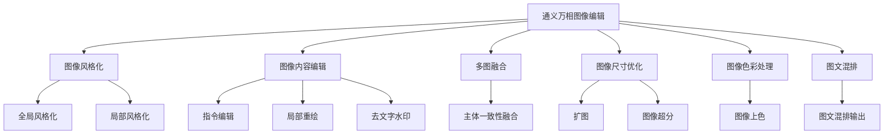
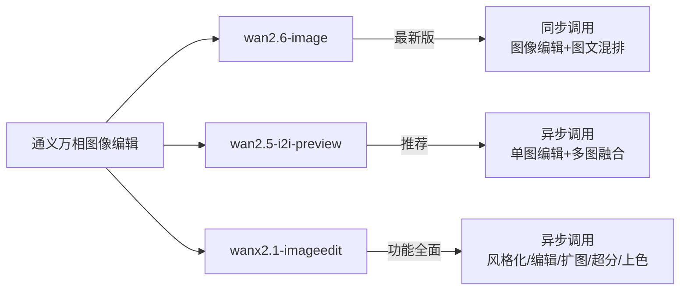
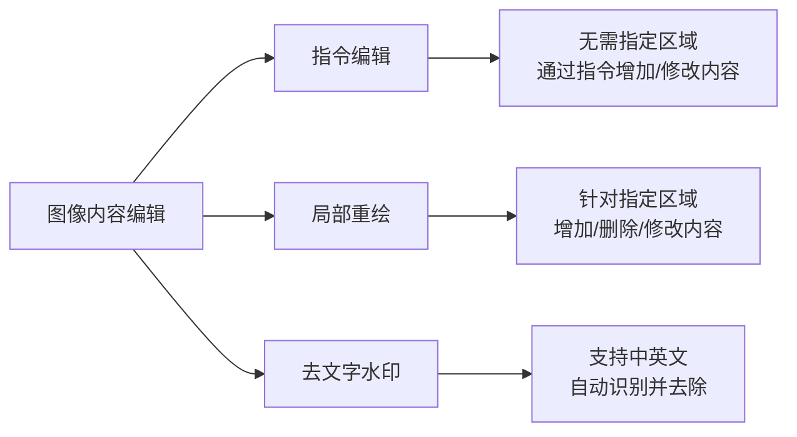
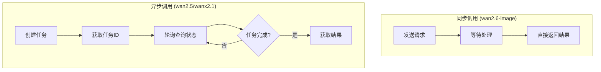

# 通义万相-通用图像编辑完全指南

> 通义万相图像编辑是阿里云推出的AI图像编辑模型系列，支持图像风格化、内容编辑、多图融合、扩图、超分、上色等多种功能。本文将全面介绍通义万相图像编辑的功能、API调用以及最佳实践。

## 一、概述

**通义万相图像编辑** 是阿里云百炼平台提供的AI图像编辑模型系列，能够根据用户提供的图片和编辑指令，智能地对图像进行各种复杂操作。目前提供三个主要版本：wan2.6-image、wan2.5-i2i-preview 和 wanx2.1-imageedit。

### 核心能力



### 核心优势

- **多功能支持**：从风格化到内容编辑，满足多样化图像处理需求
- **智能理解**：准确理解自然语言编辑指令
- **高质量输出**：生成图像细节丰富，画面精美
- **多版本选择**：根据需求选择同步或异步调用方式
- **完善的API支持**：提供Python和Java SDK

## 二、模型版本对比

通义万相图像编辑目前提供三个主要版本：

### 版本概览



### 详细对比

| 特性 | wan2.6-image | wan2.5-i2i-preview | wanx2.1-imageedit |
|-----|-------------|-------------------|-------------------|
| **版本定位** | 最新版 | 预览版 | 稳定版 |
| **调用方式** | HTTP同步 | HTTP异步 | HTTP异步 |
| **图像编辑** | ✅ | ✅ | ✅ |
| **多图融合** | ✅ | ✅ | ❌ |
| **图文混排** | ✅ | ❌ | ❌ |
| **风格化** | ✅ | ✅ | ✅ 全局/局部 |
| **扩图** | ❌ | ❌ | ✅ |
| **超分放大** | ❌ | ❌ | ✅ |
| **图像上色** | ❌ | ❌ | ✅ |
| **去水印** | ❌ | ❌ | ✅ 中英文 |
| **线稿生图** | ❌ | ❌ | ✅ |
| **价格** | - | - | 0.14元/张 |
| **免费额度** | - | - | 500张 |

### 版本选择建议

- **追求最新功能**：选择 `wan2.6-image`（支持同步调用和图文混排）
- **需要多图融合**：选择 `wan2.5-i2i-preview` 或 `wan2.6-image`
- **需要扩图/超分/上色**：选择 `wanx2.1-imageedit`
- **追求性价比**：选择 `wanx2.1-imageedit`（0.14元/张）

## 三、功能详解

### 3.1 图像风格化

将图像转换为不同的艺术风格。

**支持类型**：
- **全局风格化**：将整张图片转换为指定风格
- **局部风格化**：仅对图片的特定区域进行风格转换

**示例提示词**：
```
转换成法国绘本风格
转换成赛博朋克风格
将背景转换为水墨画风格
```

### 3.2 图像内容编辑

对图像内容进行智能修改。



**示例提示词**：
```
将花卉连衣裙换成一件复古风格的蕾丝长裙，领口和袖口有精致的刺绣细节
将图中的闹钟放置到图2的餐桌的花瓶旁边位置
去除图片中的水印文字
```

### 3.3 多图融合

将多张图片中的元素融合到一起，保持主体一致性。

| 功能 | 说明 |
|-----|------|
| 单图编辑 | 对单张图片进行编辑修改 |
| 多图融合 | 将多张图片的元素融合，保持主体一致 |

### 3.4 图像尺寸优化

**扩图**：按比例扩展图像画面
**超分放大**：高清放大图像，提升分辨率

### 3.5 图像色彩处理

**图像上色**：将黑白或灰度图像转换为彩色图像

### 3.6 基于参考图像生成

- **线稿生图**：先提取输入图像的线稿，再参考线稿生成图像
- **参考卡通形象生图**：基于卡通形象生成新图像

## 四、API调用方式

### 4.1 调用流程对比



### 4.2 API端点

#### wan2.6-image（同步调用）

| 地域 | 端点 |
|-----|------|
| 北京 | `POST https://dashscope.aliyuncs.com/api/v1/services/aigc/multimodal-generation/generation` |
| 新加坡 | `POST https://dashscope-intl.aliyuncs.com/api/v1/services/aigc/multimodal-generation/generation` |

#### wan2.5-i2i-preview / wanx2.1-imageedit（异步调用）

| 地域 | 端点 |
|-----|------|
| 北京 | `POST https://dashscope.aliyuncs.com/api/v1/services/aigc/image2image/image-synthesis` |
| 新加坡 | `POST https://dashscope-intl.aliyuncs.com/api/v1/services/aigc/image2image/image-synthesis` |

### 4.3 Python代码示例

#### wan2.6-image 同步调用

```python
import dashscope
import os

# 设置API Key
dashscope.api_key = os.getenv("DASHSCOPE_API_KEY")

# 同步调用
response = dashscope.MultiModalConversation.call(
    model="wan2.6-image",
    messages=[
        {
            "role": "user",
            "content": [
                {"text": "参考这个风格的图片，生成蕃茄炒蛋"},
                {"image": "https://img.alicdn.com/example.jpg"}
            ]
        }
    ],
    parameters={
        "prompt_extend": True,
        "watermark": False,
        "n": 1,
        "enable_interleave": False,  # 图像编辑模式
        "size": "1280*1280"
    }
)

if response.status_code == 200:
    print(response.output.choices[0].message.content)
else:
    print(f"错误: {response.code} - {response.message}")
```

#### wan2.5-i2i-preview 异步调用

```python
import dashscope
from dashscope import ImageSynthesis
import time
import os

dashscope.api_key = os.getenv("DASHSCOPE_API_KEY")

# 步骤1：创建任务
response = ImageSynthesis.async_call(
    model="wan2.5-i2i-preview",
    input={
        "prompt": "将花卉连衣裙换成一件复古风格的蕾丝长裙",
        "images": ["https://example.com/input.jpg"]
    },
    parameters={
        "size": "1280*1280"
    }
)

task_id = response.output.task_id
print(f"任务ID: {task_id}")

# 步骤2：轮询查询结果
while True:
    result = ImageSynthesis.fetch(task_id)
    if result.output.task_status == "SUCCEEDED":
        print(f"生成成功: {result.output.results}")
        break
    elif result.output.task_status == "FAILED":
        print(f"生成失败: {result.output.message}")
        break
    else:
        print(f"处理中... 状态: {result.output.task_status}")
        time.sleep(2)
```

#### wanx2.1-imageedit 示例

```python
import dashscope
from dashscope import ImageSynthesis
import os

dashscope.api_key = os.getenv("DASHSCOPE_API_KEY")

# 全局风格化
response = ImageSynthesis.async_call(
    model="wanx2.1-imageedit",
    input={
        "function": "stylization_all",  # 全局风格化
        "prompt": "转换成赛博朋克风格",
        "base_image_url": "https://example.com/input.jpg"
    }
)

print(f"任务ID: {response.output.task_id}")
```

### 4.4 Java代码示例

```java
import com.alibaba.dashscope.aigc.imagesynthesis.ImageSynthesis;
import com.alibaba.dashscope.aigc.imagesynthesis.ImageSynthesisParam;
import com.alibaba.dashscope.aigc.imagesynthesis.ImageSynthesisResult;

public class WanxImageEdit {
    public static void main(String[] args) {
        ImageSynthesis imageSynthesis = new ImageSynthesis();

        // 构建请求参数
        ImageSynthesisParam param = ImageSynthesisParam.builder()
            .apiKey(System.getenv("DASHSCOPE_API_KEY"))
            .model("wan2.5-i2i-preview")
            .prompt("将背景替换为海边场景")
            .build();

        // 异步调用
        try {
            ImageSynthesisResult result = imageSynthesis.asyncCall(param);
            System.out.println("任务ID: " + result.getOutput().getTaskId());

            // 轮询获取结果
            while (true) {
                result = imageSynthesis.fetch(result.getOutput().getTaskId(), null);
                String status = result.getOutput().getTaskStatus();

                if ("SUCCEEDED".equals(status)) {
                    System.out.println("生成成功: " + result.getOutput().getResults());
                    break;
                } else if ("FAILED".equals(status)) {
                    System.out.println("生成失败");
                    break;
                }

                Thread.sleep(2000);
            }
        } catch (Exception e) {
            e.printStackTrace();
        }
    }
}
```

## 五、参数详解

### 5.1 通用输入参数

| 参数名 | 类型 | 必选 | 说明 |
|-------|------|------|------|
| model | string | 是 | 模型名称 |
| prompt / text | string | 是 | 编辑指令/提示词 |
| image / images | string/array | 是 | 输入图像URL或Base64 |

### 5.2 wan2.6-image 参数

| 参数名 | 类型 | 默认值 | 说明 |
|-------|------|--------|------|
| enable_interleave | bool | false | false=图像编辑，true=图文混排 |
| negative_prompt | string | - | 反向提示词 |
| size | string | 1280*1280 | 输出分辨率 |
| n | int | 1 | 输出图片数量 |
| prompt_extend | bool | true | 是否开启提示词优化 |
| watermark | bool | false | 是否添加水印 |

**size 参数说明**：
- 总像素范围：[768×768, 1280×1280]（即589,824 至 1,638,400像素）
- 宽高比范围：[1:4, 4:1]

**常见分辨率推荐**：
| 比例 | 分辨率 |
|-----|-------|
| 1:1 | 1280×1280 或 1024×1024 |
| 2:3 | 800×1200 |
| 3:2 | 1200×800 |
| 3:4 | 960×1280 |
| 4:3 | 1280×960 |
| 9:16 | 720×1280 |
| 16:9 | 1280×720 |

### 5.3 wanx2.1-imageedit 功能参数

| function值 | 功能说明 |
|-----------|---------|
| stylization_all | 全局风格化 |
| stylization_local | 局部风格化 |
| description_edit | 指令编辑 |
| description_edit_with_mask | 局部重绘 |
| remove_watermark | 去文字水印 |
| expand | 扩图 |
| super_resolution | 图像超分 |
| colorization | 图像上色 |
| sketch_to_image | 线稿生图 |
| doodle_to_image | 参考卡通形象生图 |

### 5.4 图像格式要求

| 项目 | 要求 |
|-----|------|
| 支持格式 | JPEG、JPG、PNG、BMP、WEBP |
| 图像分辨率 | 建议宽高在384-5000像素之间 |
| 文件大小 | 单张不超过10MB |

### 5.5 输出说明

- 输出图片格式：PNG
- URL有效期：24小时（请及时下载保存）

## 六、价格与计费

### 计费规则

- 按成功生成的图片张数计费
- 失败不计费，也不占用免费额度

### 价格对比

| 模型 | 单价 | 免费额度 | RPS限制 |
|-----|------|----------|---------|
| wan2.6-image | - | - | - |
| wan2.5-i2i-preview | - | - | - |
| wanx2.1-imageedit | 0.14元/张 | 500张 | 2 |

> 注意：免费额度有效期为阿里云百炼开通后90天内。

## 七、最佳实践

### 7.1 提示词编写技巧

**好的提示词示例**：
```
# 具体描述目标效果
将花卉连衣裙换成一件复古风格的蕾丝长裙，领口和袖口有精致的刺绣细节

# 明确指定位置关系
将图1中的闹钟放置到图2的餐桌的花瓶旁边位置

# 清晰描述风格
转换成法国绘本风格，色彩柔和，线条简洁
```

**不好的提示词示例**：
```
# 太模糊
换个风格
修改一下

# 缺少细节
换衣服
```

### 7.2 常见问题

**Q: 同步调用和异步调用如何选择？**
A: 如果需要即时返回结果且处理时间短，选择wan2.6-image同步调用；如果是批量处理或复杂编辑，选择异步调用。

**Q: 生成的图片URL多久失效？**
A: 24小时内有效，请及时下载保存。

**Q: 如何提高生成质量？**
A:
1. 使用清晰、具体的提示词
2. 输入高质量的原图
3. 使用negative_prompt排除不想要的元素
4. 开启prompt_extend让模型优化提示词

## 八、相关资源

- [阿里云百炼控制台](https://bailian.console.aliyun.com/)
- [API Key获取](https://help.aliyun.com/zh/model-studio/get-api-key)
- [wan2.6-image API参考](https://help.aliyun.com/zh/model-studio/wan-image-generation-api-reference)
- [wan2.5-i2i-preview API参考](https://help.aliyun.com/zh/model-studio/wan2-5-image-edit-api-reference)
- [wanx2.1-imageedit API参考](https://help.aliyun.com/zh/model-studio/wanx-image-edit-api-reference)
- [DashScope SDK文档](https://help.aliyun.com/zh/model-studio/developer-reference/)
- [错误码参考](https://help.aliyun.com/zh/model-studio/error-code)
