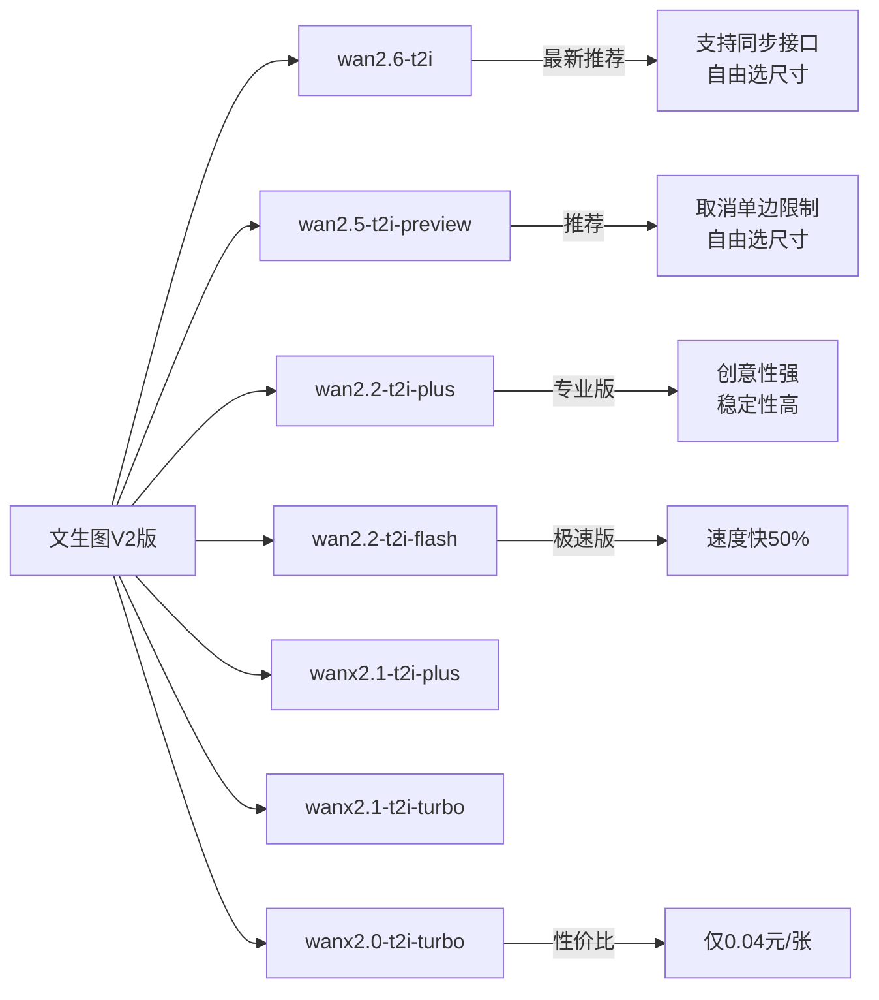
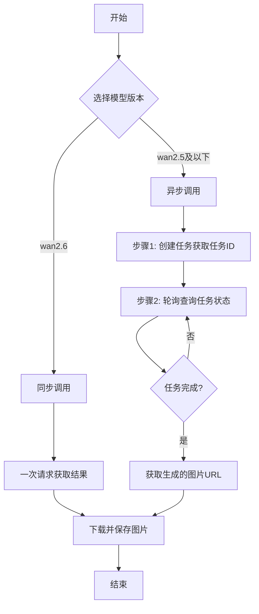
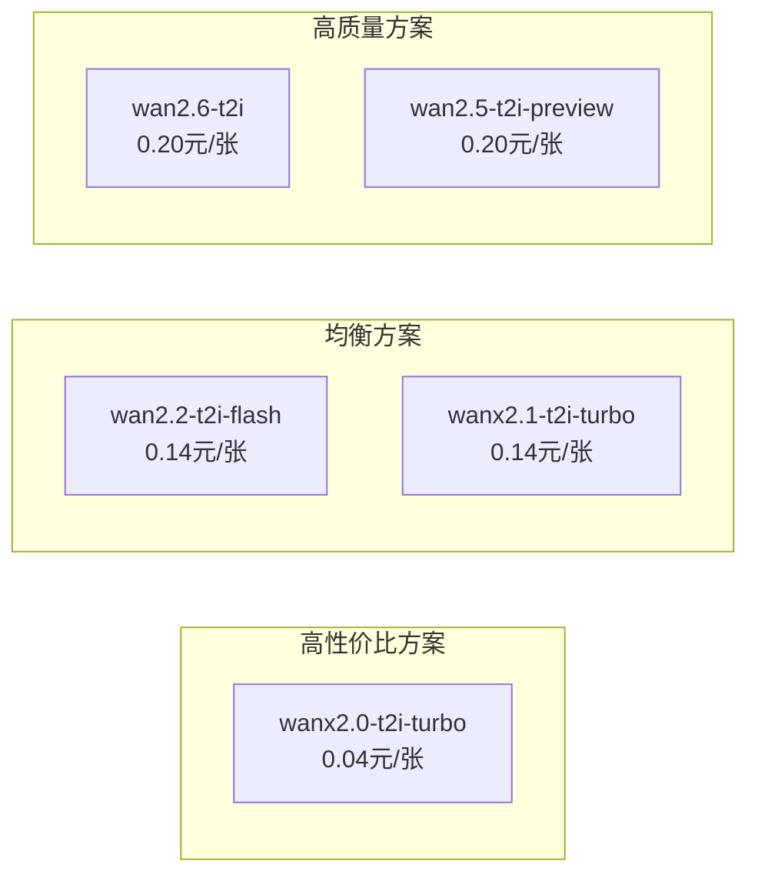

# 通义万象文生图完全指南：从入门到实战

> 通义万相是阿里云推出的AI图像生成大模型，能够根据文本描述生成高质量的图片。本文将全面介绍通义万象文生图的功能、使用方法、API调用以及价格计费等内容。

## 一、什么是通义万象

**通义万象（Wanx）** 是阿里云达摩院研发的多模态AI大模型，专注于图像和视频生成领域。其文生图功能可以根据用户输入的文本描述，智能生成符合描述的高质量图片，支持多种艺术风格与写实摄影效果。

### 核心优势

- **多风格支持**：从写实摄影到艺术创作，满足多样化创意需求
- **高质量输出**：生成图像细节丰富，画面精美
- **灵活的尺寸选择**：支持多种宽高比和分辨率
- **智能提示词优化**：自动改写和优化用户提示词
- **完善的API支持**：提供同步和异步两种调用方式

## 二、模型版本介绍

通义万象文生图目前提供多个版本，满足不同场景需求：

### 文生图 V2 版（推荐）



| 模型名称 | 版本说明 | 特点 | 单价 | 免费额度 |
|---------|---------|------|------|----------|
| **wan2.6-t2i** | 万象2.6（推荐） | 支持同步接口，自由选尺寸 | 0.20元/张 | 50张 |
| **wan2.5-t2i-preview** | 万象2.5预览版（推荐） | 取消单边限制，自由选尺寸 | 0.20元/张 | 50张 |
| wan2.2-t2i-plus | 万象2.2专业版 | 创意性、稳定性、写实感全面升级 | 0.20元/张 | 100张 |
| wan2.2-t2i-flash | 万象2.2极速版 | 速度提升50% | 0.14元/张 | 100张 |
| wanx2.1-t2i-plus | 万象2.1专业版 | 支持多种风格，细节丰富 | 0.20元/张 | 500张 |
| wanx2.1-t2i-turbo | 万象2.1极速版 | 支持多种风格，生成速度快 | 0.14元/张 | 500张 |
| wanx2.0-t2i-turbo | 万象2.0极速版 | 擅长质感人像与创意设计，**性价比最高** | **0.04元/张** | 500张 |

### 文生图 V1 版

| 模型名称 | 说明 | 单价 | 免费额度 |
|---------|------|------|----------|
| wanx-v1 | 支持参考图片风格进行图片生成 | 0.16元/张 | 500张 |

### 版本选择建议

- **追求最新效果**：选择 `wan2.6-t2i` 或 `wan2.5-t2i-preview`
- **追求极致性价比**：选择 `wanx2.0-t2i-turbo`（仅0.04元/张）
- **追求速度**：选择带 `flash` 或 `turbo` 后缀的极速版
- **追求质量**：选择带 `plus` 后缀的专业版

## 三、API 调用方式

### 调用流程



### API 端点

**北京地域**：
```
POST https://dashscope.aliyuncs.com/api/v1/services/aigc/multimodal-generation/generation
```

**新加坡地域**：
```
POST https://dashscope-intl.aliyuncs.com/api/v1/services/aigc/multimodal-generation/generation
```

> **注意**：北京和新加坡地域拥有独立的 API Key 与请求地址，不可混用。

### 请求参数说明

#### 必选参数

| 参数名 | 类型 | 说明 |
|-------|------|------|
| model | string | 模型名称，如 `wan2.6-t2i` |
| input.messages | array | 请求内容数组 |
| input.messages[0].role | string | 固定为 `user` |
| input.messages[0].content[0].text | string | 正向提示词，支持中英文，最长2100字符 |

#### 可选参数

| 参数名 | 类型 | 默认值 | 说明 |
|-------|------|-------|------|
| parameters.negative_prompt | string | - | 反向提示词，最长500字符 |
| parameters.size | string | 1280*1280 | 图像尺寸，格式为"宽*高" |
| parameters.n | integer | 4 | 生成图片数量，1-4张 |
| parameters.prompt_extend | boolean | true | 是否开启提示词智能改写 |
| parameters.watermark | boolean | false | 是否添加水印 |
| parameters.seed | integer | - | 随机数种子，0-2147483647 |

### 支持的图像尺寸

图像总像素需在 **[1280×1280, 1440×1440]** 范围内，宽高比范围为 **[1:4, 4:1]**。

**常用尺寸推荐**：

| 比例 | 推荐尺寸 | 适用场景 |
|-----|---------|---------|
| 1:1 | 1280×1280 | 头像、产品图 |
| 3:4 | 1104×1472 | 竖版海报 |
| 4:3 | 1472×1104 | 横版海报 |
| 9:16 | 960×1696 | 手机壁纸 |
| 16:9 | 1696×960 | 电脑壁纸 |

### 代码示例

#### Java 同步调用示例（wan2.6）

```java
import com.alibaba.dashscope.aigc.imagesynthesis.*;
import com.alibaba.dashscope.exception.*;

public class WanxTextToImage {
    public static void main(String[] args) throws ApiException, NoApiKeyException {
        ImageSynthesis imageSynthesis = new ImageSynthesis();

        ImageSynthesisParam param = ImageSynthesisParam.builder()
            .model("wan2.6-t2i")
            .prompt("一只坐着的橘黄色的猫，表情愉悦，活泼可爱，逼真准确")
            .n(1)
            .size("1280*1280")
            .build();

        ImageSynthesisResult result = imageSynthesis.call(param);

        // 获取生成的图片URL
        System.out.println("图片URL: " + result.getOutput().getResults().get(0).getUrl());
    }
}
```

#### Python 异步调用示例

```python
import dashscope
from dashscope import ImageSynthesis
import time

# 设置API Key
dashscope.api_key = "your-api-key"

# 步骤1：创建任务
response = ImageSynthesis.async_call(
    model="wan2.5-t2i-preview",
    prompt="一只坐着的橘黄色的猫，表情愉悦，活泼可爱，逼真准确",
    n=1,
    size="1280*1280"
)

task_id = response.output.task_id
print(f"任务ID: {task_id}")

# 步骤2：轮询获取结果
while True:
    result = ImageSynthesis.fetch(task_id)
    if result.output.task_status == "SUCCEEDED":
        print(f"图片URL: {result.output.results[0].url}")
        break
    elif result.output.task_status == "FAILED":
        print(f"生成失败: {result.output.message}")
        break
    time.sleep(2)  # 每2秒查询一次
```

#### cURL 请求示例

```bash
curl --location 'https://dashscope.aliyuncs.com/api/v1/services/aigc/multimodal-generation/generation' \
--header 'Content-Type: application/json' \
--header 'Authorization: Bearer $DASHSCOPE_API_KEY' \
--data '{
    "model": "wan2.6-t2i",
    "input": {
        "messages": [
            {
                "role": "user",
                "content": [
                    {
                        "text": "一只坐着的橘黄色的猫，表情愉悦，活泼可爱，逼真准确"
                    }
                ]
            }
        ]
    },
    "parameters": {
        "prompt_extend": true,
        "watermark": false,
        "n": 1,
        "size": "1280*1280"
    }
}'
```

## 四、提示词编写技巧

### 基本原则

1. **清晰具体**：描述要具体明确，避免模糊表述
2. **结构化描述**：按"主体+环境+风格+细节"的顺序组织
3. **适当使用修饰词**：增加形容词来丰富画面效果

### 提示词模板

```
[主体描述]，[场景/背景]，[艺术风格]，[光影效果]，[画面质量]
```

### 优秀提示词示例

**写实人像**：
```
一位年轻女性的半身照，长发飘逸，穿着白色连衣裙，站在樱花树下，
柔和的自然光，浅景深效果，高清摄影，8K画质
```

**创意插画**：
```
一座漂浮在云端的魔法城堡，周围环绕着彩虹桥，
奇幻风格，梦幻色彩，精细插画，艺术概念图
```

**产品展示**：
```
一瓶高端护肤品放置在大理石台面上，背景是淡粉色渐变，
产品摄影风格，柔和的工作室灯光，商业广告品质
```

### 反向提示词使用

反向提示词用于排除不想要的元素：

```
低分辨率，模糊，变形，低画质，肢体畸形，手指错误，
画面过饱和，文字水印，构图混乱
```

## 五、计费说明

### 计费规则

- **按张计费**：费用 = 单价 × 图片张数
- **免费额度**：新用户可享受免费试用额度
- **失败不计费**：生成失败不扣费，不占用免费额度
- **图片有效期**：生成的图片URL有效期为24小时，请及时下载保存

### 费用对比



### 成本优化建议

1. **测试阶段**：设置 `n=1`，减少测试成本
2. **批量生成**：利用异步接口并行提交多个任务
3. **合理选择模型**：根据实际需求选择合适的模型版本

## 六、常见问题

### Q1: 同步调用和异步调用有什么区别？

| 对比项 | 同步调用 | 异步调用 |
|-------|---------|---------|
| 支持模型 | 仅wan2.6 | 所有版本 |
| 调用流程 | 一次请求直接返回结果 | 创建任务→轮询获取 |
| 适用场景 | 简单场景，快速获取结果 | 对超时敏感的场景 |

### Q2: 提示词智能改写（prompt_extend）什么时候使用？

- **建议开启**：提示词较短（少于50字）时
- **建议关闭**：提示词已经很详细，或需要精确控制输出时
- **注意**：开启后会增加3-4秒耗时

### Q3: 如何提高生成质量？

1. 使用详细、具体的提示词
2. 选择专业版模型（plus后缀）
3. 合理使用反向提示词排除不想要的元素
4. 多次尝试不同的随机种子（seed）

### Q4: 生成的图片可以商用吗？

请参考阿里云百炼平台的服务协议和使用条款。一般情况下，通过API生成的图片可用于商业用途，但需遵守相关法律法规和平台规定。

## 七、相关链接

- [通义万象官网](https://wanx.biz.aliyun.com/wan)
- [文生图V2 API参考](https://help.aliyun.com/zh/model-studio/text-to-image-v2-api-reference)
- [文生图V1 API参考](https://help.aliyun.com/zh/model-studio/text-to-image-api-reference)
- [模型列表与价格](https://help.aliyun.com/zh/model-studio/models)
- [DashScope SDK下载](https://help.aliyun.com/zh/model-studio/install-sdk)

---

> 本文基于阿里云官方文档整理，如有更新请以官方文档为准。
