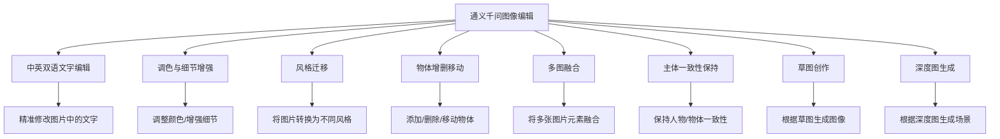
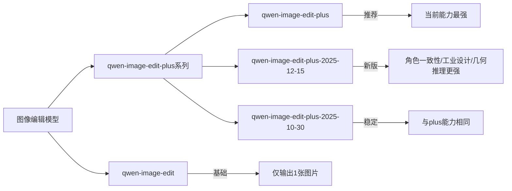
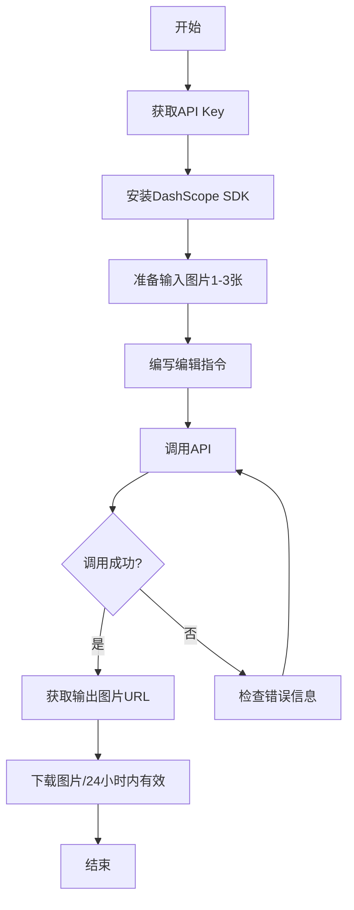

# 通义千问图像编辑完全指南：从入门到实战

> 通义千问图像编辑模型（Qwen-Image-Edit-Plus）是阿里云推出的强大AI图像编辑工具，支持多图输入和多图输出，可精确修改图内文字、增删或移动物体、改变主体动作、迁移图片风格及增强画面细节。

## 一、什么是通义千问图像编辑

**通义千问图像编辑** 是阿里云百炼平台提供的AI图像编辑模型，能够根据用户提供的图片和编辑指令，智能地对图像进行各种复杂操作。与传统的图像编辑工具不同，它基于大模型技术，可以理解自然语言指令并执行精准的图像修改。

### 核心能力



### 核心优势

- **多图输入输出**：支持1-3张图片输入，最多生成6张图片
- **精准编辑**：准确理解编辑指令，精确修改目标区域
- **主体一致性**：在不同场景中保持人物或物体的一致性
- **智能提示词优化**：自动优化简单的提示词，提升生成效果
- **多语言支持**：支持中英双语编辑指令

## 二、模型版本介绍

通义千问图像编辑目前提供多个版本，满足不同场景需求：

### 模型列表



### 价格与免费额度

| 模型名称 | 单价 | 免费额度 | 输出图片数量 | 特点 |
|---------|------|----------|-------------|------|
| **qwen-image-edit-plus** | 0.2元/张 | 100张 | 1-6张 | 推荐，能力最强 |
| qwen-image-edit-plus-2025-12-15 | 0.2元/张 | 100张 | 1-6张 | 角色一致性、工业设计能力更强 |
| qwen-image-edit-plus-2025-10-30 | 0.2元/张 | 100张 | 1-6张 | 与plus能力相同 |
| qwen-image-edit | 0.3元/张 | 100张 | 仅1张 | 基础版本 |

> **注意**：免费额度有效期为阿里云百炼开通后90天内。

### 版本选择建议

- **追求最佳效果**：选择 `qwen-image-edit-plus` 系列
- **需要多图输出**：选择 `qwen-image-edit-plus` 系列（支持1-6张）
- **角色一致性场景**：选择 `qwen-image-edit-plus-2025-12-15`
- **基础编辑需求**：选择 `qwen-image-edit`（单价较高但输出单张）

## 三、使用场景与效果展示

### 3.1 多图融合

将多张图片中的元素融合到一起，例如：

| 输入图像1 | 输入图像2 | 输入图像3 | 输出图像 |
|----------|----------|----------|----------|
| 女生照片 | 项链图片 | 手提包图片 | 女生戴着项链、拎着手提包 |

**指令示例**：`图1中的女生戴着图2中的项链，左肩挎着图3中的包`

### 3.2 主体一致性保持

保持人物或物体在不同场景、不同服装下的一致性：

| 输入图像 | 输出效果 |
|---------|---------|
| 人物照片 | 修改为蓝底证件照，人物穿上白色衬衫、黑色西装、打着条纹领带 |
| 人物照片 | 人物穿着"千问图像"T恤，依靠在护栏边，阳光照在发丝上，身后是大桥和海 |

### 3.3 草图创作

根据简单的线稿草图生成高质量图像：

| 输入 | 输出 |
|-----|------|
| 简笔画人物线稿 | 高清写实人物照片 |

### 3.4 文创生成

将设计图案应用到各种产品上：

| 输入设计 | 输出产品 |
|---------|---------|
| 小熊卡通形象 | 穿宇航服的小熊、穿舞裙跳舞的小熊、打篮球的小熊 |
| 简单Logo | 印在T恤上、手提袋上、产品模型上 |

### 3.5 深度图生成图像

根据输入图像的深度信息生成符合相同结构的新图像：

| 输入图像 | 输出图像 |
|---------|---------|
| 白色自行车 | 红色自行车在森林小路上 |

## 四、API 调用方式

### 调用流程



### API 端点

- **中国内地（北京）**：`https://dashscope.aliyuncs.com/api/v1`
- **新加坡**：`https://dashscope-intl.aliyuncs.com/api/v1`

### 前置准备

1. 获取API Key：访问 [阿里云百炼控制台](https://help.aliyun.com/zh/model-studio/get-api-key) 获取
2. 安装SDK：支持 Python 和 Java

```bash
# Python SDK 安装
pip install dashscope
```

### Python 代码示例

```python
import json
import os
from dashscope import MultiModalConversation
import dashscope

# 设置API端点（中国内地北京）
dashscope.base_http_api_url = 'https://dashscope.aliyuncs.com/api/v1'

# 获取API Key
api_key = os.getenv("DASHSCOPE_API_KEY")

# 准备输入消息（支持1-3张图片）
messages = [
    {
        "role": "user",
        "content": [
            {"image": "图1的公网URL或Base64数据"},
            {"image": "图2的公网URL或Base64数据"},
            {"image": "图3的公网URL或Base64数据"},
            {"text": "图1中的女生穿着图2中的黑色裙子按图3的姿势坐下"}
        ]
    }
]

# 调用API（qwen-image-edit-plus支持输出1-6张图片）
response = MultiModalConversation.call(
    api_key=api_key,
    model="qwen-image-edit-plus",
    messages=messages,
    stream=False,
    n=2,                          # 输出图片数量，1-6张
    watermark=False,              # 是否添加水印
    negative_prompt="低质量",      # 反向提示词
    prompt_extend=True,           # 是否开启提示词优化
    # size="1024*2048",           # 仅当n=1时可设置尺寸
)

# 处理响应
if response.status_code == 200:
    for i, content in enumerate(response.output.choices[0].message.content):
        print(f"输出图像{i+1}的URL:{content['image']}")
else:
    print(f"HTTP返回码：{response.status_code}")
    print(f"错误码：{response.code}")
    print(f"错误信息：{response.message}")
```

### Java 代码示例

```java
import com.alibaba.dashscope.aigc.multimodalconversation.MultiModalConversation;
import com.alibaba.dashscope.aigc.multimodalconversation.MultiModalConversationParam;
import com.alibaba.dashscope.aigc.multimodalconversation.MultiModalConversationResult;
import com.alibaba.dashscope.common.MultiModalMessage;
import com.alibaba.dashscope.common.Role;

import java.util.Arrays;
import java.util.Collections;
import java.util.HashMap;
import java.util.Map;

public class QwenImageEdit {
    public static void main(String[] args) {
        MultiModalConversation conv = new MultiModalConversation();

        // 准备输入内容
        Map<String, Object> image1 = new HashMap<>();
        image1.put("image", "图片1的URL");

        Map<String, Object> image2 = new HashMap<>();
        image2.put("image", "图片2的URL");

        Map<String, Object> text = new HashMap<>();
        text.put("text", "将图1中的人物服装替换为图2中的服装");

        MultiModalMessage userMessage = MultiModalMessage.builder()
            .role(Role.USER.getValue())
            .content(Arrays.asList(image1, image2, text))
            .build();

        // 构建请求参数
        MultiModalConversationParam param = MultiModalConversationParam.builder()
            .apiKey(System.getenv("DASHSCOPE_API_KEY"))
            .model("qwen-image-edit-plus")
            .messages(Collections.singletonList(userMessage))
            .build();

        // 调用API
        try {
            MultiModalConversationResult result = conv.call(param);
            System.out.println(result);
        } catch (Exception e) {
            e.printStackTrace();
        }
    }
}
```

## 五、参数详解

### 输入参数

#### 输入图像（messages）

| 参数 | 说明 | 要求 |
|-----|------|------|
| role | 角色 | 必须为 `user` |
| content | 内容数组 | 包含1-3张图片和1条编辑指令 |

**图片要求**：

| 项目 | 要求 |
|-----|------|
| 图片格式 | JPG、JPEG、PNG、BMP、TIFF、WEBP、GIF |
| 图片分辨率 | 建议宽高在384-3072像素之间 |
| 文件大小 | 单张不超过10MB |
| GIF处理 | 仅处理第一帧，输出为PNG格式 |

**图像传入方式**：

1. **公网URL**：提供HTTP/HTTPS协议的公网可访问地址
   ```
   https://example.com/image.png
   ```

2. **Base64编码**：
   ```
   data:image/jpeg;base64,/9j/4AAQSkZJRgABAQAA...
   ```

#### 可选参数

| 参数名 | 类型 | 默认值 | 说明 | 适用模型 |
|-------|------|--------|------|----------|
| n | int | 1 | 输出图片数量，plus系列支持1-6张 | 全部 |
| negative_prompt | string | - | 反向提示词，描述不希望出现的内容 | 全部 |
| watermark | bool | false | 是否添加"Qwen-Image"水印 | 全部 |
| seed | int | - | 随机种子，范围[0, 2147483647] | 全部 |
| size | string | - | 输出尺寸，如"1024*2048"，仅n=1时可用 | plus系列 |
| prompt_extend | bool | true | 是否开启提示词智能优化 | plus系列 |

### 输出说明

- 生成的图片以URL形式返回
- **URL有效期为24小时**，请及时下载保存
- 输出图像格式为PNG

## 六、最佳实践

### 6.1 编写有效的编辑指令

```mermaid
graph TD
    A[编写编辑指令] --> B[明确指定图像序号]
    B --> C[描述具体操作]
    C --> D[添加细节要求]

    B --> B1[使用"图1"/"图2"/"图3"指代]
    C --> C1[如"穿着"/"替换"/"添加"]
    D --> D1[如风格/颜色/位置等]
```

**好的指令示例**：
- `图1中的女生穿着图2中的黑色裙子按图3的姿势坐下`
- `将图1中的背景替换为图2中的海边场景`
- `让图1中的人物戴上图2中的帽子，保持表情不变`

**不好的指令示例**：
- `换个衣服`（没有指定哪张图的哪件衣服）
- `修改一下`（指令太模糊）

### 6.2 图像输入顺序

多图输入时，按照数组顺序定义图像顺序，编辑指令中的"图1"、"图2"、"图3"需要与content数组中的图像顺序对应。

```python
# 正确示例
messages = [
    {
        "role": "user",
        "content": [
            {"image": "人物照片URL"},    # 这是图1
            {"image": "衣服照片URL"},    # 这是图2
            {"image": "姿势参考URL"},    # 这是图3
            {"text": "图1中的人穿上图2的衣服，按图3的姿势站立"}
        ]
    }
]
```

### 6.3 使用反向提示词优化结果

通过 `negative_prompt` 参数排除不想要的内容：

```python
response = MultiModalConversation.call(
    # ... 其他参数
    negative_prompt="模糊, 低质量, 变形, 多余的手指, 水印",
)
```

### 6.4 保持结果稳定性

使用相同的 `seed` 值可以帮助生成内容保持相对稳定：

```python
response = MultiModalConversation.call(
    # ... 其他参数
    seed=42,  # 固定随机种子
)
```

## 七、错误处理

### 常见错误码

| 错误码 | 说明 | 解决方案 |
|-------|------|----------|
| InvalidParameter | 参数错误 | 检查参数格式和取值范围 |
| InvalidApiKey | API Key无效 | 检查API Key是否正确配置 |
| QuotaExceeded | 配额超限 | 充值或等待免费额度刷新 |
| ImageSizeExceeded | 图片太大 | 压缩图片至10MB以内 |

### 错误处理代码

```python
if response.status_code == 200:
    # 处理成功响应
    for content in response.output.choices[0].message.content:
        print(f"图片URL: {content['image']}")
else:
    print(f"HTTP返回码：{response.status_code}")
    print(f"错误码：{response.code}")
    print(f"错误信息：{response.message}")
    print("请参考文档：https://help.aliyun.com/zh/model-studio/error-code")
```

## 八、计费说明

### 计费规则

- **按成功生成的图片张数计费**
- 失败不计费，也不占用免费额度
- 多图输出时，按实际生成的图片数量计费

### 费用计算示例

| 场景 | 模型 | 输出数量 | 费用 |
|-----|------|---------|------|
| 单图编辑 | qwen-image-edit-plus | 1张 | 0.2元 |
| 多图输出 | qwen-image-edit-plus | 4张 | 0.8元 |
| 基础编辑 | qwen-image-edit | 1张 | 0.3元 |

## 九、相关资源

- [阿里云百炼控制台](https://bailian.console.aliyun.com/)
- [API Key获取](https://help.aliyun.com/zh/model-studio/get-api-key)
- [DashScope SDK文档](https://help.aliyun.com/zh/model-studio/developer-reference/)
- [错误码参考](https://help.aliyun.com/zh/model-studio/error-code)
- [通义千问图像编辑API参考](https://help.aliyun.com/zh/model-studio/developer-reference/tongyi-qianwen-vl-image-editing)

## 十、总结

通义千问图像编辑是一个功能强大的AI图像编辑工具，特别适合以下场景：

1. **电商场景**：商品图片换背景、换模特、添加文字
2. **创意设计**：草图转高清图、风格迁移、文创产品设计
3. **证件照处理**：更换背景、调整服装
4. **内容创作**：保持人物一致性的多场景图片生成

通过合理使用编辑指令和参数配置，可以实现精准的图像编辑效果。建议从免费额度开始体验，熟悉模型能力后再进行商业应用。
