# 第3篇：上下文管理系统

## 引言

在AI驱动的应用中，上下文(Context)是决定AI表现的关键因素。Claude Code需要处理大量的项目文件、对话历史、工具输出等信息，如何在有限的Token预算内，智能地选择、组织和传递这些信息，是上下文管理系统的核心挑战。

### 上下文的重要性

想象你在与一个失忆症患者对话，每次对话他都不记得之前说过什么。这就是没有上下文管理的AI应用的状态。

**上下文的作用**：
- ✅ **提供背景信息**：让AI理解当前任务的完整背景
- ✅ **保持对话连贯**：记住之前的对话内容
- ✅ **避免重复操作**：知道哪些文件已经读取过
- ✅ **提升准确性**：基于真实数据而非猜测

### Claude的上下文窗口

Claude 3.5 Sonnet拥有**200K tokens**的上下文窗口，这相当于：
- 约150,000个英文单词
- 约500页的文本
- 数百个中等大小的代码文件

但是，更大的上下文窗口并不意味着可以无节制地使用：
- ⚠️ **成本考虑**：每1M input tokens约$3
- ⚠️ **性能影响**：更大的上下文会增加响应延迟
- ⚠️ **信息冗余**：过多无关信息反而降低AI效果

### 上下文管理的挑战

```mermaid
graph TB
    A[上下文管理挑战] --> B[Token预算有限]
    A --> C[信息优先级]
    A --> D[动态变化]
    A --> E[多源整合]

    B --> B1[如何在预算内包含最重要的信息?]
    C --> C1[哪些信息最重要?]
    C --> C2[如何量化优先级?]
    D --> D1[文件内容变化]
    D --> D2[对话历史增长]
    E --> E1[文件内容]
    E --> E2[Git状态]
    E --> E3[工具输出]
    E --> E4[对话历史]

    style A fill:#ffe1f5,stroke:#333,stroke-width:3px
    style B fill:#fff4e1
    style C fill:#e1f5ff
```



---

## 一、上下文类型和来源

### 1.1 上下文分类体系

```mermaid
graph TB
    A[上下文来源] --> B[静态上下文]
    A --> C[动态上下文]
    A --> D[临时上下文]

    B --> B1[系统提示词]
    B --> B2[工具定义]
    B --> B3[项目配置]

    C --> C1[文件内容]
    C --> C2[Git状态]
    C --> C3[对话历史]

    D --> D1[工具执行结果]
    D --> D2[临时变量]
    D --> D3[用户指定文件]

    B1 --> B1A[固定不变<br/>高优先级]
    C1 --> C1A[频繁变化<br/>中优先级]
    D1 --> D1A[单次使用<br/>低优先级]

    style A fill:#e1f5ff,stroke:#333,stroke-width:3px
    style B fill:#e8f5e9
    style C fill:#fff4e1
    style D fill:#ffe1e1
```



### 1.2 上下文来源详解

#### **静态上下文**

**特点**：在会话期间基本不变

```typescript
/**
 * 静态上下文接口
 */
interface StaticContext {
  systemPrompt: string;           // 系统提示词
  toolDefinitions: ToolDef[];     // 工具定义列表
  projectConfig: ProjectConfig;   // 项目配置
  environmentInfo: EnvInfo;       // 环境信息
}

/**
 * 项目配置
 */
interface ProjectConfig {
  name: string;                   // 项目名称
  version: string;                // 版本号
  workspaceRoot: string;          // 工作区根目录
  language: string;               // 主要编程语言
  packageManager?: string;        // 包管理器
}

/**
 * 环境信息
 */
interface EnvInfo {
  platform: string;               // 操作系统
  nodeVersion: string;            // Node.js版本
  currentDate: string;            // 当前日期
  timezone: string;               // 时区
}
```

**示例**：
```typescript
const staticContext: StaticContext = {
  systemPrompt: loadSystemPrompt(),
  toolDefinitions: toolRegistry.getAllDefinitions(),
  projectConfig: {
    name: 'my-app',
    version: '1.0.0',
    workspaceRoot: '/Users/john/projects/my-app',
    language: 'TypeScript',
    packageManager: 'npm'
  },
  environmentInfo: {
    platform: 'darwin',
    nodeVersion: 'v18.17.0',
    currentDate: '2025-01-14',
    timezone: 'Asia/Shanghai'
  }
};
```

#### **动态上下文**

**特点**：随着用户操作和项目状态变化

```typescript
/**
 * 动态上下文接口
 */
interface DynamicContext {
  files: FileContext[];           // 文件上下文列表
  gitStatus: GitStatus;           // Git状态
  conversationHistory: Message[]; // 对话历史
  recentEdits: EditHistory[];     // 最近编辑记录
}

/**
 * 文件上下文
 */
interface FileContext {
  path: string;                   // 文件路径
  content: string;                // 文件内容
  language: string;               // 编程语言
  size: number;                   // 文件大小(bytes)
  lastModified: number;           // 最后修改时间
  relevanceScore?: number;        // 相关性评分(0-1)
}

/**
 * Git状态
 */
interface GitStatus {
  branch: string;                 // 当前分支
  modified: string[];             // 已修改文件
  untracked: string[];            // 未跟踪文件
  staged: string[];               // 已暂存文件
  commits: GitCommit[];           // 最近提交
}

/**
 * 编辑历史
 */
interface EditHistory {
  filePath: string;               // 文件路径
  timestamp: number;              // 编辑时间
  changeType: 'create' | 'modify' | 'delete'; // 变更类型
  linesBefore: number;            // 修改前行数
  linesAfter: number;             // 修改后行数
}
```

#### **临时上下文**

**特点**：仅在当前请求或对话轮次中有效

```typescript
/**
 * 临时上下文接口
 */
interface TemporaryContext {
  toolResults: ToolResult[];      // 工具执行结果
  userSpecifiedFiles: string[];   // 用户明确指定的文件
  sessionVariables: Map<string, any>; // 会话变量
  pendingOperations: Operation[]; // 待执行操作
}

/**
 * 工具执行结果
 */
interface ToolResult {
  toolName: string;               // 工具名称
  input: any;                     // 输入参数
  output: any;                    // 输出结果
  timestamp: number;              // 执行时间
  duration: number;               // 执行耗时(ms)
  success: boolean;               // 是否成功
}
```

### 1.3 上下文收集器实现

```typescript
/**
 * 上下文收集器 - 从各个来源收集上下文信息
 */
class ContextCollector {
  private workspaceRoot: string;
  private gitClient: GitClient;
  private fileWatcher: FileWatcher;

  constructor(workspaceRoot: string) {
    this.workspaceRoot = workspaceRoot;
    this.gitClient = new GitClient(workspaceRoot);
    this.fileWatcher = new FileWatcher(workspaceRoot);
  }

  /**
   * 收集完整上下文
   */
  async collectFullContext(options: CollectOptions): Promise<FullContext> {
    console.log('🔍 开始收集上下文...');

    // 并行收集各类上下文
    const [
      staticCtx,
      dynamicCtx,
      temporaryCtx
    ] = await Promise.all([
      this.collectStaticContext(),
      this.collectDynamicContext(options),
      this.collectTemporaryContext(options)
    ]);

    return {
      static: staticCtx,
      dynamic: dynamicCtx,
      temporary: temporaryCtx,
      timestamp: Date.now()
    };
  }

  /**
   * 收集静态上下文
   */
  private async collectStaticContext(): Promise<StaticContext> {
    return {
      systemPrompt: await this.loadSystemPrompt(),
      toolDefinitions: await this.loadToolDefinitions(),
      projectConfig: await this.loadProjectConfig(),
      environmentInfo: this.getEnvironmentInfo()
    };
  }

  /**
   * 收集动态上下文
   */
  private async collectDynamicContext(
    options: CollectOptions
  ): Promise<DynamicContext> {
    const files = await this.collectRelevantFiles(options);
    const gitStatus = await this.gitClient.getStatus();
    const recentEdits = await this.fileWatcher.getRecentEdits(10);

    return {
      files,
      gitStatus,
      conversationHistory: options.conversationHistory || [],
      recentEdits
    };
  }

  /**
   * 收集临时上下文
   */
  private async collectTemporaryContext(
    options: CollectOptions
  ): Promise<TemporaryContext> {
    return {
      toolResults: options.recentToolResults || [],
      userSpecifiedFiles: options.userFiles || [],
      sessionVariables: options.variables || new Map(),
      pendingOperations: []
    };
  }

  /**
   * 收集相关文件
   */
  private async collectRelevantFiles(
    options: CollectOptions
  ): Promise<FileContext[]> {
    const files: FileContext[] = [];

    // 1. 用户明确指定的文件(最高优先级)
    if (options.userFiles && options.userFiles.length > 0) {
      for (const filePath of options.userFiles) {
        const file = await this.readFileContext(filePath);
        if (file) {
          file.relevanceScore = 1.0; // 最高相关性
          files.push(file);
        }
      }
    }

    // 2. 最近编辑的文件
    const recentEdits = await this.fileWatcher.getRecentEdits(5);
    for (const edit of recentEdits) {
      if (!files.some(f => f.path === edit.filePath)) {
        const file = await this.readFileContext(edit.filePath);
        if (file) {
          // 基于时间计算相关性(时间越近相关性越高)
          const ageMinutes = (Date.now() - edit.timestamp) / 60000;
          file.relevanceScore = Math.max(0.5, 1 - ageMinutes / 60);
          files.push(file);
        }
      }
    }

    // 3. Git修改的文件
    const gitStatus = await this.gitClient.getStatus();
    const modifiedFiles = [...gitStatus.modified, ...gitStatus.staged];
    for (const filePath of modifiedFiles) {
      if (!files.some(f => f.path === filePath)) {
        const file = await this.readFileContext(filePath);
        if (file) {
          file.relevanceScore = 0.7; // 中等相关性
          files.push(file);
        }
      }
    }

    return files;
  }

  /**
   * 读取文件上下文
   */
  private async readFileContext(filePath: string): Promise<FileContext | null> {
    try {
      const absolutePath = path.join(this.workspaceRoot, filePath);
      const content = await fs.readFile(absolutePath, 'utf-8');
      const stats = await fs.stat(absolutePath);

      return {
        path: filePath,
        content,
        language: this.detectLanguage(filePath),
        size: stats.size,
        lastModified: stats.mtimeMs
      };
    } catch (error) {
      console.warn(`无法读取文件 ${filePath}:`, error.message);
      return null;
    }
  }

  /**
   * 检测文件语言
   */
  private detectLanguage(filePath: string): string {
    const ext = path.extname(filePath).toLowerCase();
    const languageMap: Record<string, string> = {
      '.ts': 'typescript',
      '.tsx': 'typescript',
      '.js': 'javascript',
      '.jsx': 'javascript',
      '.py': 'python',
      '.java': 'java',
      '.go': 'go',
      '.rs': 'rust',
      '.cpp': 'cpp',
      '.c': 'c',
      '.md': 'markdown',
      '.json': 'json',
      '.yaml': 'yaml',
      '.yml': 'yaml'
    };
    return languageMap[ext] || 'plaintext';
  }

  /**
   * 加载系统提示词
   */
  private async loadSystemPrompt(): Promise<string> {
    // 从文件加载或使用默认值
    return DEFAULT_SYSTEM_PROMPT;
  }

  /**
   * 加载工具定义
   */
  private async loadToolDefinitions(): Promise<ToolDef[]> {
    // 从工具注册表获取
    return toolRegistry.getAllDefinitions();
  }

  /**
   * 加载项目配置
   */
  private async loadProjectConfig(): Promise<ProjectConfig> {
    try {
      const pkgPath = path.join(this.workspaceRoot, 'package.json');
      const pkg = JSON.parse(await fs.readFile(pkgPath, 'utf-8'));
      return {
        name: pkg.name || 'unknown',
        version: pkg.version || '0.0.0',
        workspaceRoot: this.workspaceRoot,
        language: 'TypeScript', // 可以从package.json推断
        packageManager: 'npm'
      };
    } catch {
      return {
        name: path.basename(this.workspaceRoot),
        version: '0.0.0',
        workspaceRoot: this.workspaceRoot,
        language: 'unknown'
      };
    }
  }

  /**
   * 获取环境信息
   */
  private getEnvironmentInfo(): EnvInfo {
    return {
      platform: process.platform,
      nodeVersion: process.version,
      currentDate: new Date().toISOString().split('T')[0],
      timezone: Intl.DateTimeFormat().resolvedOptions().timeZone
    };
  }
}

/**
 * 收集选项
 */
interface CollectOptions {
  conversationHistory?: Message[];
  recentToolResults?: ToolResult[];
  userFiles?: string[];
  variables?: Map<string, any>;
}

/**
 * 完整上下文
 */
interface FullContext {
  static: StaticContext;
  dynamic: DynamicContext;
  temporary: TemporaryContext;
  timestamp: number;
}

export { ContextCollector, FullContext, CollectOptions };
```

---

## 二、Token计数和预算控制

### 2.1 Token计数原理

Token是LLM处理文本的基本单位。不同的文本有不同的Token数量：

**Token计数规则**（近似）：
- 英文：约4个字符 = 1 token
- 中文：约1.5个字符 = 1 token
- 代码：约3个字符 = 1 token
- 空格和标点：也计入token

**示例**：
```
文本：Hello, world!
Token数：3 (Hello, world, !)

文本：你好世界
Token数：约3 (你好, 世界)

代码：function hello() { return "world"; }
Token数：约10
```

### 2.2 Token计数器实现

```typescript
import { encoding_for_model } from 'tiktoken';

/**
 * Token计数器 - 使用tiktoken库精确计算token数
 */
class TokenCounter {
  private encoding: any;
  private cache: Map<string, number>;

  constructor(model: string = 'claude-3-5-sonnet-20250929') {
    // 初始化编码器
    // Claude使用cl100k_base编码(与GPT-4相同)
    this.encoding = encoding_for_model('gpt-4');
    this.cache = new Map();
  }

  /**
   * 计算文本的token数
   */
  count(text: string): number {
    // 检查缓存
    const cached = this.cache.get(text);
    if (cached !== undefined) {
      return cached;
    }

    // 编码文本
    const tokens = this.encoding.encode(text);
    const count = tokens.length;

    // 缓存结果(限制缓存大小)
    if (this.cache.size < 10000) {
      this.cache.set(text, count);
    }

    return count;
  }

  /**
   * 计算消息列表的token数
   */
  countMessages(messages: Message[]): number {
    let total = 0;

    for (const message of messages) {
      // 每条消息有固定的格式开销
      total += 4; // 消息边界tokens

      // 角色token
      total += this.count(message.role);

      // 内容tokens
      if (typeof message.content === 'string') {
        total += this.count(message.content);
      } else if (Array.isArray(message.content)) {
        for (const block of message.content) {
          if (block.type === 'text') {
            total += this.count(block.text);
          } else if (block.type === 'tool_use') {
            total += this.count(block.name);
            total += this.count(JSON.stringify(block.input));
          } else if (block.type === 'tool_result') {
            total += this.count(String(block.content));
          }
        }
      }
    }

    return total;
  }

  /**
   * 计算上下文的token数
   */
  countContext(context: FullContext): ContextTokenStats {
    const stats: ContextTokenStats = {
      static: 0,
      dynamic: 0,
      temporary: 0,
      total: 0,
      breakdown: {}
    };

    // 静态上下文
    stats.static += this.count(context.static.systemPrompt);
    stats.breakdown['systemPrompt'] = this.count(context.static.systemPrompt);

    // 工具定义
    const toolTokens = context.static.toolDefinitions.reduce(
      (sum, tool) => sum + this.count(JSON.stringify(tool)),
      0
    );
    stats.static += toolTokens;
    stats.breakdown['toolDefinitions'] = toolTokens;

    // 动态上下文 - 文件
    const fileTokens = context.dynamic.files.reduce(
      (sum, file) => sum + this.count(file.content),
      0
    );
    stats.dynamic += fileTokens;
    stats.breakdown['files'] = fileTokens;

    // 对话历史
    const conversationTokens = this.countMessages(
      context.dynamic.conversationHistory
    );
    stats.dynamic += conversationTokens;
    stats.breakdown['conversation'] = conversationTokens;

    // Git状态
    const gitTokens = this.count(JSON.stringify(context.dynamic.gitStatus));
    stats.dynamic += gitTokens;
    stats.breakdown['gitStatus'] = gitTokens;

    // 临时上下文 - 工具结果
    const toolResultTokens = context.temporary.toolResults.reduce(
      (sum, result) => sum + this.count(JSON.stringify(result)),
      0
    );
    stats.temporary += toolResultTokens;
    stats.breakdown['toolResults'] = toolResultTokens;

    // 总计
    stats.total = stats.static + stats.dynamic + stats.temporary;

    return stats;
  }

  /**
   * 估算文本的token数(快速但不精确)
   */
  estimate(text: string): number {
    // 统计中英文字符
    const chineseChars = (text.match(/[\u4e00-\u9fa5]/g) || []).length;
    const otherChars = text.length - chineseChars;

    // 粗略估算
    return Math.ceil(chineseChars / 1.5 + otherChars / 4);
  }

  /**
   * 清空缓存
   */
  clearCache(): void {
    this.cache.clear();
  }

  /**
   * 释放资源
   */
  dispose(): void {
    this.encoding.free();
    this.clearCache();
  }
}

/**
 * 上下文token统计
 */
interface ContextTokenStats {
  static: number;                 // 静态上下文tokens
  dynamic: number;                // 动态上下文tokens
  temporary: number;              // 临时上下文tokens
  total: number;                  // 总tokens
  breakdown: Record<string, number>; // 详细分解
}

export { TokenCounter, ContextTokenStats };
```

### 2.3 Token预算管理器

```mermaid
graph LR
    A[Token预算管理] --> B[设定预算]
    A --> C[实时监控]
    A --> D[智能分配]

    B --> B1[总预算: 100K]
    B --> B2[静态: 10K]
    B --> B3[动态: 70K]
    B --> B4[临时: 20K]

    C --> C1[计算当前使用]
    C --> C2[预测增长]
    C --> C3[触发警告]

    D --> D1[按优先级分配]
    D --> D2[动态调整]
    D --> D3[超限截断]

    style A fill:#e1f5ff,stroke:#333,stroke-width:3px
    style B fill:#e8f5e9
    style C fill:#fff4e1
    style D fill:#ffe1f5
```



```typescript
/**
 * Token预算管理器
 */
class TokenBudgetManager {
  private maxTokens: number;
  private tokenCounter: TokenCounter;
  private budgetAllocation: BudgetAllocation;

  constructor(maxTokens: number = 100000) {
    this.maxTokens = maxTokens;
    this.tokenCounter = new TokenCounter();
    this.budgetAllocation = this.calculateBudgetAllocation(maxTokens);
  }

  /**
   * 计算预算分配
   */
  private calculateBudgetAllocation(total: number): BudgetAllocation {
    return {
      total,
      static: Math.floor(total * 0.1),      // 10% 静态上下文
      dynamic: Math.floor(total * 0.7),     // 70% 动态上下文
      temporary: Math.floor(total * 0.2),   // 20% 临时上下文
      reserved: Math.floor(total * 0.1)     // 10% 预留(输出)
    };
  }

  /**
   * 检查上下文是否超出预算
   */
  checkBudget(context: FullContext): BudgetCheckResult {
    const stats = this.tokenCounter.countContext(context);

    // 计算可用于输出的tokens
    const availableForOutput = this.maxTokens - stats.total;

    const result: BudgetCheckResult = {
      isWithinBudget: stats.total <= (this.maxTokens - this.budgetAllocation.reserved),
      currentUsage: stats,
      budgetAllocation: this.budgetAllocation,
      availableForOutput,
      exceedBy: Math.max(0, stats.total - this.maxTokens),
      warnings: []
    };

    // 生成警告
    if (stats.static > this.budgetAllocation.static) {
      result.warnings.push(
        `静态上下文超出预算: ${stats.static} > ${this.budgetAllocation.static}`
      );
    }

    if (stats.dynamic > this.budgetAllocation.dynamic) {
      result.warnings.push(
        `动态上下文超出预算: ${stats.dynamic} > ${this.budgetAllocation.dynamic}`
      );
    }

    if (stats.temporary > this.budgetAllocation.temporary) {
      result.warnings.push(
        `临时上下文超出预算: ${stats.temporary} > ${this.budgetAllocation.temporary}`
      );
    }

    if (availableForOutput < 1000) {
      result.warnings.push(
        `可用输出空间不足: ${availableForOutput} tokens`
      );
    }

    return result;
  }

  /**
   * 优化上下文以适应预算
   */
  optimizeContext(
    context: FullContext,
    checkResult: BudgetCheckResult
  ): FullContext {
    // 如果在预算内,直接返回
    if (checkResult.isWithinBudget) {
      console.log('✅ 上下文在预算内,无需优化');
      return context;
    }

    console.log(`⚠️  上下文超出预算 ${checkResult.exceedBy} tokens,开始优化...`);

    let optimized = { ...context };

    // 1. 优化临时上下文(最低优先级)
    if (checkResult.currentUsage.temporary > this.budgetAllocation.temporary) {
      optimized = this.optimizeTemporaryContext(optimized);
    }

    // 2. 优化动态上下文
    if (checkResult.currentUsage.dynamic > this.budgetAllocation.dynamic) {
      optimized = this.optimizeDynamicContext(optimized);
    }

    // 3. 重新检查
    const newCheck = this.checkBudget(optimized);
    if (newCheck.isWithinBudget) {
      console.log(`✅ 优化完成,节省 ${checkResult.exceedBy - newCheck.exceedBy} tokens`);
      return optimized;
    }

    // 4. 如果还是超出,进行激进截断
    console.log('⚠️  常规优化不足,进行激进截断...');
    return this.aggressiveTruncate(optimized, this.maxTokens);
  }

  /**
   * 优化临时上下文
   */
  private optimizeTemporaryContext(context: FullContext): FullContext {
    const optimized = { ...context };

    // 限制工具结果数量(只保留最近5个)
    optimized.temporary = {
      ...context.temporary,
      toolResults: context.temporary.toolResults.slice(-5)
    };

    return optimized;
  }

  /**
   * 优化动态上下文
   */
  private optimizeDynamicContext(context: FullContext): FullContext {
    const optimized = { ...context };

    // 1. 截断对话历史(保留最近10轮)
    optimized.dynamic = {
      ...context.dynamic,
      conversationHistory: context.dynamic.conversationHistory.slice(-10)
    };

    // 2. 移除低相关性文件
    const sortedFiles = [...context.dynamic.files].sort(
      (a, b) => (b.relevanceScore || 0) - (a.relevanceScore || 0)
    );

    // 只保留相关性>0.5的文件,或最多5个文件
    optimized.dynamic.files = sortedFiles
      .filter(f => (f.relevanceScore || 0) > 0.5)
      .slice(0, 5);

    return optimized;
  }

  /**
   * 激进截断
   */
  private aggressiveTruncate(
    context: FullContext,
    maxTokens: number
  ): FullContext {
    // 保留静态上下文
    // 大幅减少动态和临时上下文
    return {
      ...context,
      dynamic: {
        ...context.dynamic,
        files: context.dynamic.files.slice(0, 2), // 只保留2个文件
        conversationHistory: context.dynamic.conversationHistory.slice(-5) // 只保留5轮对话
      },
      temporary: {
        ...context.temporary,
        toolResults: context.temporary.toolResults.slice(-2) // 只保留2个工具结果
      }
    };
  }

  /**
   * 生成预算报告
   */
  generateReport(context: FullContext): string {
    const stats = this.tokenCounter.countContext(context);
    const check = this.checkBudget(context);

    let report = '\n=== Token预算报告 ===\n';
    report += `总预算: ${this.maxTokens.toLocaleString()} tokens\n`;
    report += `当前使用: ${stats.total.toLocaleString()} tokens (${((stats.total / this.maxTokens) * 100).toFixed(1)}%)\n`;
    report += `\n--- 分类统计 ---\n`;
    report += `静态上下文: ${stats.static.toLocaleString()} / ${this.budgetAllocation.static.toLocaleString()} tokens\n`;
    report += `动态上下文: ${stats.dynamic.toLocaleString()} / ${this.budgetAllocation.dynamic.toLocaleString()} tokens\n`;
    report += `临时上下文: ${stats.temporary.toLocaleString()} / ${this.budgetAllocation.temporary.toLocaleString()} tokens\n`;
    report += `\n--- 详细分解 ---\n`;
    for (const [key, value] of Object.entries(stats.breakdown)) {
      report += `${key}: ${value.toLocaleString()} tokens\n`;
    }
    report += `\n可用输出空间: ${check.availableForOutput.toLocaleString()} tokens\n`;

    if (check.warnings.length > 0) {
      report += `\n⚠️  警告:\n`;
      check.warnings.forEach(w => report += `  - ${w}\n`);
    }

    return report;
  }
}

/**
 * 预算分配
 */
interface BudgetAllocation {
  total: number;                  // 总预算
  static: number;                 // 静态上下文预算
  dynamic: number;                // 动态上下文预算
  temporary: number;              // 临时上下文预算
  reserved: number;               // 预留(输出)
}

/**
 * 预算检查结果
 */
interface BudgetCheckResult {
  isWithinBudget: boolean;        // 是否在预算内
  currentUsage: ContextTokenStats; // 当前使用情况
  budgetAllocation: BudgetAllocation; // 预算分配
  availableForOutput: number;     // 可用输出空间
  exceedBy: number;               // 超出量
  warnings: string[];             // 警告信息
}

export { TokenBudgetManager, BudgetAllocation, BudgetCheckResult };
```

---

## 三、智能截断算法

### 3.1 截断策略

```mermaid
flowchart TD
    Start[开始截断] --> CalcTokens[计算总tokens]
    CalcTokens --> CheckBudget{超出预算?}

    CheckBudget -->|否| End[结束]
    CheckBudget -->|是| CalcExceed[计算超出量]

    CalcExceed --> Strategy1[策略1: 移除低优先级项]
    Strategy1 --> ReCheck1{达到预算?}

    ReCheck1 -->|是| End
    ReCheck1 -->|否| Strategy2[策略2: 截断大文件]

    Strategy2 --> ReCheck2{达到预算?}
    ReCheck2 -->|是| End
    ReCheck2 -->|否| Strategy3[策略3: 压缩对话历史]

    Strategy3 --> ReCheck3{达到预算?}
    ReCheck3 -->|是| End
    ReCheck3 -->|否| Strategy4[策略4: 激进截断]

    Strategy4 --> End

    style Start fill:#e8f5e9
    style End fill:#e8f5e9
    style CheckBudget fill:#fff4e1
    style Strategy1 fill:#e1f5ff
    style Strategy2 fill:#e1f5ff
    style Strategy3 fill:#e1f5ff
    style Strategy4 fill:#ffe1e1
```



### 3.2 智能截断器实现

```typescript
/**
 * 智能截断器
 */
class SmartTruncator {
  private tokenCounter: TokenCounter;
  private maxTokens: number;

  constructor(maxTokens: number = 100000) {
    this.tokenCounter = new TokenCounter();
    this.maxTokens = maxTokens;
  }

  /**
   * 截断上下文项列表
   */
  truncate(
    items: ContextItem[],
    targetTokens: number
  ): ContextItem[] {
    console.log(`🔪 开始截断: ${items.length}项 -> 目标${targetTokens} tokens`);

    // 1. 计算每项的token数
    const itemsWithTokens = items.map(item => ({
      ...item,
      tokens: this.tokenCounter.count(item.content)
    }));

    // 2. 按优先级排序(高优先级优先保留)
    const sorted = itemsWithTokens.sort((a, b) => b.priority - a.priority);

    // 3. 贪心算法:从高优先级开始累加
    const result: ContextItem[] = [];
    let totalTokens = 0;

    for (const item of sorted) {
      // 检查是否还有空间
      if (totalTokens + item.tokens <= targetTokens) {
        // 完整保留
        result.push(item);
        totalTokens += item.tokens;
      } else {
        // 检查剩余空间
        const remaining = targetTokens - totalTokens;

        if (remaining > 100) {
          // 有足够空间,尝试部分截断
          const truncated = this.truncateItem(item, remaining);
          if (truncated) {
            result.push(truncated);
            totalTokens += truncated.tokens;
          }
        }

        // 预算已满,停止
        break;
      }
    }

    console.log(`✅ 截断完成: ${result.length}项, ${totalTokens} tokens`);

    return result;
  }

  /**
   * 截断单个项
   */
  private truncateItem(
    item: ContextItem,
    maxTokens: number
  ): ContextItem | null {
    // 无法截断的类型
    if (item.type === 'system' || item.type === 'tool_definition') {
      return null;
    }

    // 文件内容可以截断
    if (item.type === 'file') {
      return this.truncateFileContent(item, maxTokens);
    }

    // 对话可以截断
    if (item.type === 'conversation') {
      return this.truncateConversation(item, maxTokens);
    }

    // 工具结果可以截断
    if (item.type === 'tool_result') {
      return this.truncateToolResult(item, maxTokens);
    }

    return null;
  }

  /**
   * 截断文件内容
   */
  private truncateFileContent(
    item: ContextItem,
    maxTokens: number
  ): ContextItem {
    const lines = item.content.split('\n');
    let truncated = '';
    let tokens = 0;

    // 保留文件头部
    for (const line of lines) {
      const lineTokens = this.tokenCounter.count(line + '\n');
      if (tokens + lineTokens > maxTokens - 50) {
        break;
      }
      truncated += line + '\n';
      tokens += lineTokens;
    }

    truncated += '\n... (truncated)\n';

    return {
      ...item,
      content: truncated,
      tokens,
      metadata: {
        ...item.metadata,
        truncated: true,
        originalTokens: item.tokens
      }
    };
  }

  /**
   * 截断对话
   */
  private truncateConversation(
    item: ContextItem,
    maxTokens: number
  ): ContextItem {
    // 解析对话消息
    const messages = JSON.parse(item.content) as Message[];

    // 保留最近的消息
    let truncated: Message[] = [];
    let tokens = 0;

    for (let i = messages.length - 1; i >= 0; i--) {
      const msgTokens = this.tokenCounter.count(
        JSON.stringify(messages[i])
      );

      if (tokens + msgTokens > maxTokens) {
        break;
      }

      truncated.unshift(messages[i]);
      tokens += msgTokens;
    }

    return {
      ...item,
      content: JSON.stringify(truncated),
      tokens,
      metadata: {
        ...item.metadata,
        truncated: true,
        keptMessages: truncated.length,
        totalMessages: messages.length
      }
    };
  }

  /**
   * 截断工具结果
   */
  private truncateToolResult(
    item: ContextItem,
    maxTokens: number
  ): ContextItem {
    // 工具结果通常是JSON或文本
    let truncated = item.content.slice(0, maxTokens * 4); // 粗略估算
    truncated += '\n... (truncated)';

    return {
      ...item,
      content: truncated,
      tokens: this.tokenCounter.count(truncated),
      metadata: {
        ...item.metadata,
        truncated: true
      }
    };
  }

  /**
   * 按类型分组截断
   */
  truncateByType(
    items: ContextItem[],
    budgets: Record<string, number>
  ): ContextItem[] {
    const result: ContextItem[] = [];

    // 按类型分组
    const grouped = new Map<string, ContextItem[]>();
    for (const item of items) {
      const list = grouped.get(item.type) || [];
      list.push(item);
      grouped.set(item.type, list);
    }

    // 对每个类型应用预算
    for (const [type, budget] of Object.entries(budgets)) {
      const typeItems = grouped.get(type) || [];
      const truncated = this.truncate(typeItems, budget);
      result.push(...truncated);
    }

    return result;
  }
}

/**
 * 上下文项接口
 */
interface ContextItem {
  type: 'system' | 'file' | 'conversation' | 'tool_result' | 'tool_definition';
  content: string;
  priority: number;               // 优先级(0-10)
  tokens: number;                 // token数
  metadata?: Record<string, any>; // 元数据
}

export { SmartTruncator, ContextItem };
```

---

## 四、上下文优先级排序

### 4.1 优先级矩阵

| 上下文类型 | 基础优先级 | 调整因素 | 最终范围 |
|-----------|----------|---------|---------|
| 系统提示词 | 10 | 固定 | 10 |
| 当前文件 | 9 | 用户明确指定+1 | 9-10 |
| 最近编辑 | 8 | 时间衰减 | 5-8 |
| 错误信息 | 8 | - | 8 |
| 用户指定文件 | 7-9 | 指定方式 | 7-9 |
| 相关文件 | 7 | 相关度评分 | 4-7 |
| 工具输出 | 6 | 最近使用+1 | 6-7 |
| Git状态 | 5 | 修改量 | 4-6 |
| 项目信息 | 5 | - | 5 |
| 历史对话 | 4 | 时间衰减 | 2-4 |
| 旧文件 | 3 | 相关度 | 1-3 |

### 4.2 优先级计算器

```typescript
/**
 * 优先级计算器
 */
class PriorityCalculator {
  /**
   * 计算上下文项的优先级
   */
  calculate(item: ContextItem, context: PriorityContext): number {
    let priority = item.basePriority || 5;

    // 1. 时间衰减
    if (item.timestamp) {
      priority *= this.calculateTimeDecay(item.timestamp);
    }

    // 2. 相关性加权
    if (item.relevanceScore !== undefined) {
      priority *= item.relevanceScore;
    }

    // 3. 用户明确指定
    if (item.explicitlyRequested) {
      priority += 2;
    }

    // 4. 最近使用加权
    if (this.isRecentlyUsed(item, context)) {
      priority += 1;
    }

    // 5. 错误相关加权
    if (this.isErrorRelated(item, context)) {
      priority += 1;
    }

    // 确保在有效范围内
    return Math.max(0, Math.min(10, priority));
  }

  /**
   * 计算时间衰减因子
   */
  private calculateTimeDecay(timestamp: number): number {
    const ageMs = Date.now() - timestamp;
    const ageHours = ageMs / (1000 * 60 * 60);

    // 指数衰减: 每小时衰减因子
    // 1小时: 1.0
    // 24小时: 0.5
    // 168小时(7天): 0.1
    return Math.exp(-ageHours / 24);
  }

  /**
   * 是否最近使用
   */
  private isRecentlyUsed(
    item: ContextItem,
    context: PriorityContext
  ): boolean {
    if (!item.filePath) return false;

    return context.recentlyAccessedFiles?.includes(item.filePath) || false;
  }

  /**
   * 是否与错误相关
   */
  private isErrorRelated(
    item: ContextItem,
    context: PriorityContext
  ): boolean {
    if (!context.recentError) return false;

    // 检查文件路径是否在错误堆栈中
    if (item.filePath && context.recentError.includes(item.filePath)) {
      return true;
    }

    // 检查内容是否包含错误关键字
    if (context.errorKeywords?.some(kw => item.content.includes(kw))) {
      return true;
    }

    return false;
  }

  /**
   * 批量计算优先级
   */
  calculateBatch(
    items: ContextItem[],
    context: PriorityContext
  ): ContextItemWithPriority[] {
    return items.map(item => ({
      ...item,
      calculatedPriority: this.calculate(item, context)
    }));
  }

  /**
   * 排序上下文项(按优先级降序)
   */
  sort(items: ContextItemWithPriority[]): ContextItemWithPriority[] {
    return [...items].sort((a, b) => b.calculatedPriority - a.calculatedPriority);
  }
}

/**
 * 优先级上下文(用于计算优先级的辅助信息)
 */
interface PriorityContext {
  recentlyAccessedFiles?: string[];  // 最近访问的文件
  recentError?: string;              // 最近的错误信息
  errorKeywords?: string[];          // 错误关键字
  currentTask?: string;              // 当前任务
}

/**
 * 带优先级的上下文项
 */
interface ContextItemWithPriority extends ContextItem {
  calculatedPriority: number;        // 计算后的优先级
  basePriority?: number;             // 基础优先级
  timestamp?: number;                // 时间戳
  relevanceScore?: number;           // 相关性评分(0-1)
  explicitlyRequested?: boolean;     // 是否用户明确请求
  filePath?: string;                 // 文件路径
}

export { PriorityCalculator, PriorityContext, ContextItemWithPriority };
```

### 4.3 动态优先级调整

```typescript
/**
 * 动态优先级调整器
 */
class DynamicPriorityAdjuster {
  private calculator: PriorityCalculator;
  private history: AdjustmentHistory[];

  constructor() {
    this.calculator = new PriorityCalculator();
    this.history = [];
  }

  /**
   * 根据AI反馈调整优先级
   */
  adjustBasedOnFeedback(
    items: ContextItemWithPriority[],
    feedback: AIFeedback
  ): ContextItemWithPriority[] {
    const adjusted = [...items];

    // 如果AI说上下文不足
    if (feedback.type === 'insufficient_context') {
      // 提升相关文件的优先级
      feedback.requestedFiles?.forEach(filePath => {
        const item = adjusted.find(i => i.filePath === filePath);
        if (item) {
          item.calculatedPriority += 1;
          this.recordAdjustment('boost', filePath, 1);
        }
      });
    }

    // 如果AI说上下文过多
    if (feedback.type === 'too_much_context') {
      // 降低不相关文件的优先级
      feedback.unusedFiles?.forEach(filePath => {
        const item = adjusted.find(i => i.filePath === filePath);
        if (item) {
          item.calculatedPriority -= 0.5;
          this.recordAdjustment('reduce', filePath, 0.5);
        }
      });
    }

    return adjusted;
  }

  /**
   * 根据用户行为调整
   */
  adjustBasedOnUserBehavior(
    items: ContextItemWithPriority[],
    behavior: UserBehavior
  ): ContextItemWithPriority[] {
    const adjusted = [...items];

    // 用户打开了某个文件
    if (behavior.action === 'file_opened') {
      const item = adjusted.find(i => i.filePath === behavior.filePath);
      if (item) {
        item.explicitlyRequested = true;
        item.calculatedPriority += 2;
        this.recordAdjustment('user_opened', behavior.filePath!, 2);
      }
    }

    // 用户编辑了某个文件
    if (behavior.action === 'file_edited') {
      const item = adjusted.find(i => i.filePath === behavior.filePath);
      if (item) {
        item.timestamp = Date.now();
        item.calculatedPriority += 1;
        this.recordAdjustment('user_edited', behavior.filePath!, 1);
      }
    }

    return adjusted;
  }

  /**
   * 记录调整历史
   */
  private recordAdjustment(
    type: string,
    target: string,
    amount: number
  ): void {
    this.history.push({
      type,
      target,
      amount,
      timestamp: Date.now()
    });

    // 限制历史记录数量
    if (this.history.length > 100) {
      this.history.shift();
    }
  }

  /**
   * 获取调整历史
   */
  getHistory(): AdjustmentHistory[] {
    return [...this.history];
  }
}

/**
 * AI反馈
 */
interface AIFeedback {
  type: 'insufficient_context' | 'too_much_context' | 'optimal';
  requestedFiles?: string[];      // AI请求的文件
  unusedFiles?: string[];         // AI未使用的文件
  message?: string;               // 反馈消息
}

/**
 * 用户行为
 */
interface UserBehavior {
  action: 'file_opened' | 'file_edited' | 'file_closed';
  filePath?: string;
  timestamp: number;
}

/**
 * 调整历史
 */
interface AdjustmentHistory {
  type: string;                   // 调整类型
  target: string;                 // 调整目标
  amount: number;                 // 调整量
  timestamp: number;              // 时间戳
}

export { DynamicPriorityAdjuster, AIFeedback, UserBehavior };
```

---

## 五、缓存机制设计

### 5.1 多级缓存架构

```mermaid
graph TB
    A[请求上下文] --> B{L1: 内存缓存}
    B -->|命中 95%| C[直接返回]
    B -->|未命中 5%| D{L2: 磁盘缓存}

    D -->|命中 80%| E[加载到L1]
    D -->|未命中 20%| F[从源读取]

    F --> G[写入L2]
    G --> H[写入L1]
    E --> H
    H --> C

    F --> I[文件系统]
    F --> J[Git仓库]
    F --> K[网络API]

    style A fill:#e8f5e9
    style B fill:#fff4e1
    style C fill:#e8f5e9
    style D fill:#e1f5ff
    style F fill:#ffe1e1
```



### 5.2 LRU缓存实现

```typescript
/**
 * LRU(最近最少使用)缓存
 */
class LRUCache<K, V> {
  private capacity: number;
  private cache: Map<K, CacheNode<K, V>>;
  private head: CacheNode<K, V> | null = null;
  private tail: CacheNode<K, V> | null = null;

  constructor(capacity: number = 100) {
    this.capacity = capacity;
    this.cache = new Map();
  }

  /**
   * 获取缓存值
   */
  get(key: K): V | undefined {
    const node = this.cache.get(key);
    if (!node) {
      return undefined;
    }

    // 移到链表头部(最近使用)
    this.moveToHead(node);

    return node.value;
  }

  /**
   * 设置缓存值
   */
  set(key: K, value: V, ttl?: number): void {
    let node = this.cache.get(key);

    if (node) {
      // 更新现有节点
      node.value = value;
      node.timestamp = Date.now();
      node.ttl = ttl;
      this.moveToHead(node);
    } else {
      // 创建新节点
      node = {
        key,
        value,
        timestamp: Date.now(),
        ttl,
        prev: null,
        next: null
      };

      this.cache.set(key, node);
      this.addToHead(node);

      // 检查容量
      if (this.cache.size > this.capacity) {
        // 移除最久未使用的节点
        const removed = this.removeTail();
        if (removed) {
          this.cache.delete(removed.key);
        }
      }
    }
  }

  /**
   * 删除缓存值
   */
  delete(key: K): boolean {
    const node = this.cache.get(key);
    if (!node) {
      return false;
    }

    this.removeNode(node);
    this.cache.delete(key);
    return true;
  }

  /**
   * 清空缓存
   */
  clear(): void {
    this.cache.clear();
    this.head = null;
    this.tail = null;
  }

  /**
   * 检查是否过期
   */
  private isExpired(node: CacheNode<K, V>): boolean {
    if (!node.ttl) {
      return false;
    }
    return Date.now() - node.timestamp > node.ttl;
  }

  /**
   * 清理过期项
   */
  cleanup(): number {
    let removed = 0;
    const toRemove: K[] = [];

    for (const [key, node] of this.cache.entries()) {
      if (this.isExpired(node)) {
        toRemove.push(key);
      }
    }

    for (const key of toRemove) {
      this.delete(key);
      removed++;
    }

    return removed;
  }

  /**
   * 移动节点到头部
   */
  private moveToHead(node: CacheNode<K, V>): void {
    this.removeNode(node);
    this.addToHead(node);
  }

  /**
   * 添加节点到头部
   */
  private addToHead(node: CacheNode<K, V>): void {
    node.prev = null;
    node.next = this.head;

    if (this.head) {
      this.head.prev = node;
    }

    this.head = node;

    if (!this.tail) {
      this.tail = node;
    }
  }

  /**
   * 移除节点
   */
  private removeNode(node: CacheNode<K, V>): void {
    if (node.prev) {
      node.prev.next = node.next;
    } else {
      this.head = node.next;
    }

    if (node.next) {
      node.next.prev = node.prev;
    } else {
      this.tail = node.prev;
    }
  }

  /**
   * 移除尾部节点
   */
  private removeTail(): CacheNode<K, V> | null {
    const node = this.tail;
    if (node) {
      this.removeNode(node);
    }
    return node;
  }

  /**
   * 获取缓存统计
   */
  getStats(): CacheStats {
    return {
      size: this.cache.size,
      capacity: this.capacity,
      usage: this.cache.size / this.capacity
    };
  }
}

/**
 * 缓存节点
 */
interface CacheNode<K, V> {
  key: K;
  value: V;
  timestamp: number;
  ttl?: number;
  prev: CacheNode<K, V> | null;
  next: CacheNode<K, V> | null;
}

/**
 * 缓存统计
 */
interface CacheStats {
  size: number;
  capacity: number;
  usage: number;
}

export { LRUCache, CacheNode, CacheStats };
```

### 5.3 多级缓存管理器

```typescript
import * as fs from 'fs/promises';
import * as path from 'path';
import * as crypto from 'crypto';

/**
 * 多级缓存管理器
 */
class MultiLevelCache {
  private l1Cache: LRUCache<string, string>;     // 内存缓存
  private l2Path: string;                        // 磁盘缓存路径
  private stats: MultiLevelCacheStats;

  constructor(config: CacheConfig) {
    this.l1Cache = new LRUCache(config.l1MaxSize || 100);
    this.l2Path = config.l2Path || './.cache/context';
    this.stats = {
      l1Hits: 0,
      l1Misses: 0,
      l2Hits: 0,
      l2Misses: 0
    };

    // 确保L2缓存目录存在
    this.ensureCacheDir();
  }

  /**
   * 获取缓存
   */
  async get(key: string): Promise<string | null> {
    // L1缓存
    const l1Result = this.l1Cache.get(key);
    if (l1Result !== undefined) {
      this.stats.l1Hits++;
      return l1Result;
    }
    this.stats.l1Misses++;

    // L2缓存
    const l2Result = await this.getFromL2(key);
    if (l2Result) {
      this.stats.l2Hits++;
      // 提升到L1
      this.l1Cache.set(key, l2Result);
      return l2Result;
    }
    this.stats.l2Misses++;

    return null;
  }

  /**
   * 设置缓存
   */
  async set(key: string, value: string, ttl?: number): Promise<void> {
    // 写入L1
    this.l1Cache.set(key, value, ttl);

    // 异步写入L2(不阻塞)
    this.saveToL2(key, value, ttl).catch(err => {
      console.error('L2缓存写入失败:', err);
    });
  }

  /**
   * 从L2缓存读取
   */
  private async getFromL2(key: string): Promise<string | null> {
    try {
      const filePath = this.getCacheFilePath(key);
      const data = await fs.readFile(filePath, 'utf-8');
      const cached: L2CacheEntry = JSON.parse(data);

      // 检查是否过期
      if (cached.ttl && Date.now() - cached.timestamp > cached.ttl) {
        await fs.unlink(filePath); // 删除过期文件
        return null;
      }

      return cached.value;
    } catch {
      return null;
    }
  }

  /**
   * 保存到L2缓存
   */
  private async saveToL2(
    key: string,
    value: string,
    ttl?: number
  ): Promise<void> {
    const filePath = this.getCacheFilePath(key);
    const entry: L2CacheEntry = {
      key,
      value,
      timestamp: Date.now(),
      ttl
    };

    await fs.writeFile(filePath, JSON.stringify(entry), 'utf-8');
  }

  /**
   * 获取缓存文件路径
   */
  private getCacheFilePath(key: string): string {
    // 使用key的哈希值作为文件名
    const hash = crypto.createHash('md5').update(key).digest('hex');
    return path.join(this.l2Path, `${hash}.json`);
  }

  /**
   * 确保缓存目录存在
   */
  private async ensureCacheDir(): Promise<void> {
    try {
      await fs.mkdir(this.l2Path, { recursive: true });
    } catch (err) {
      console.error('创建缓存目录失败:', err);
    }
  }

  /**
   * 清理过期缓存
   */
  async cleanup(): Promise<void> {
    // 清理L1
    const l1Removed = this.l1Cache.cleanup();
    console.log(`L1缓存清理: 移除${l1Removed}项`);

    // 清理L2
    try {
      const files = await fs.readdir(this.l2Path);
      let l2Removed = 0;

      for (const file of files) {
        const filePath = path.join(this.l2Path, file);
        try {
          const data = await fs.readFile(filePath, 'utf-8');
          const entry: L2CacheEntry = JSON.parse(data);

          if (entry.ttl && Date.now() - entry.timestamp > entry.ttl) {
            await fs.unlink(filePath);
            l2Removed++;
          }
        } catch {
          // 忽略无效文件
        }
      }

      console.log(`L2缓存清理: 移除${l2Removed}项`);
    } catch (err) {
      console.error('L2缓存清理失败:', err);
    }
  }

  /**
   * 获取统计信息
   */
  getStats(): MultiLevelCacheStats {
    const l1Stats = this.l1Cache.getStats();

    return {
      ...this.stats,
      l1Size: l1Stats.size,
      l1Capacity: l1Stats.capacity,
      l1HitRate: this.stats.l1Hits / (this.stats.l1Hits + this.stats.l1Misses) || 0,
      l2HitRate: this.stats.l2Hits / (this.stats.l2Hits + this.stats.l2Misses) || 0
    };
  }

  /**
   * 重置统计
   */
  resetStats(): void {
    this.stats = {
      l1Hits: 0,
      l1Misses: 0,
      l2Hits: 0,
      l2Misses: 0
    };
  }
}

/**
 * 缓存配置
 */
interface CacheConfig {
  l1MaxSize?: number;             // L1缓存最大容量
  l2Path?: string;                // L2缓存路径
}

/**
 * L2缓存条目
 */
interface L2CacheEntry {
  key: string;
  value: string;
  timestamp: number;
  ttl?: number;
}

/**
 * 多级缓存统计
 */
interface MultiLevelCacheStats {
  l1Hits: number;
  l1Misses: number;
  l2Hits: number;
  l2Misses: number;
  l1Size?: number;
  l1Capacity?: number;
  l1HitRate?: number;
  l2HitRate?: number;
}

export { MultiLevelCache, CacheConfig, MultiLevelCacheStats };
```

---

## 六、文件监听和增量更新

### 6.1 文件监听器

```typescript
import chokidar from 'chokidar';
import { EventEmitter } from 'events';

/**
 * 文件监听器
 */
class FileWatcher extends EventEmitter {
  private watcher: chokidar.FSWatcher | null = null;
  private editHistory: EditHistory[] = [];
  private maxHistorySize: number = 100;

  constructor(private workspaceRoot: string) {
    super();
  }

  /**
   * 启动监听
   */
  start(): void {
    console.log(`👀 开始监听文件变化: ${this.workspaceRoot}`);

    this.watcher = chokidar.watch(this.workspaceRoot, {
      ignored: /(^|[\/\\])\../, // 忽略隐藏文件
      persistent: true,
      ignoreInitial: true,
      awaitWriteFinish: {
        stabilityThreshold: 500,
        pollInterval: 100
      }
    });

    // 监听文件变化事件
    this.watcher
      .on('add', (path) => this.onFileAdded(path))
      .on('change', (path) => this.onFileChanged(path))
      .on('unlink', (path) => this.onFileDeleted(path));
  }

  /**
   * 停止监听
   */
  async stop(): Promise<void> {
    if (this.watcher) {
      await this.watcher.close();
      this.watcher = null;
      console.log('✅ 文件监听已停止');
    }
  }

  /**
   * 文件添加事件
   */
  private onFileAdded(filePath: string): void {
    console.log(`➕ 文件添加: ${filePath}`);

    const edit: EditHistory = {
      filePath,
      timestamp: Date.now(),
      changeType: 'create',
      linesBefore: 0,
      linesAfter: 0
    };

    this.addToHistory(edit);
    this.emit('file:added', edit);
  }

  /**
   * 文件修改事件
   */
  private onFileChanged(filePath: string): void {
    console.log(`✏️  文件修改: ${filePath}`);

    const edit: EditHistory = {
      filePath,
      timestamp: Date.now(),
      changeType: 'modify',
      linesBefore: 0,
      linesAfter: 0
    };

    this.addToHistory(edit);
    this.emit('file:changed', edit);
  }

  /**
   * 文件删除事件
   */
  private onFileDeleted(filePath: string): void {
    console.log(`❌ 文件删除: ${filePath}`);

    const edit: EditHistory = {
      filePath,
      timestamp: Date.now(),
      changeType: 'delete',
      linesBefore: 0,
      linesAfter: 0
    };

    this.addToHistory(edit);
    this.emit('file:deleted', edit);
  }

  /**
   * 添加到历史记录
   */
  private addToHistory(edit: EditHistory): void {
    this.editHistory.push(edit);

    // 限制历史记录大小
    if (this.editHistory.length > this.maxHistorySize) {
      this.editHistory.shift();
    }
  }

  /**
   * 获取最近编辑记录
   */
  getRecentEdits(count: number = 10): EditHistory[] {
    return this.editHistory.slice(-count);
  }

  /**
   * 获取特定文件的编辑历史
   */
  getFileEditHistory(filePath: string): EditHistory[] {
    return this.editHistory.filter(e => e.filePath === filePath);
  }

  /**
   * 清空历史记录
   */
  clearHistory(): void {
    this.editHistory = [];
  }
}

export { FileWatcher };
```

### 6.2 增量更新管理器

```typescript
/**
 * 增量更新管理器
 */
class IncrementalUpdateManager {
  private fileCache: Map<string, FileSnapshot>;
  private fileWatcher: FileWatcher;

  constructor(workspaceRoot: string) {
    this.fileCache = new Map();
    this.fileWatcher = new FileWatcher(workspaceRoot);

    // 监听文件变化
    this.fileWatcher.on('file:changed', (edit) => {
      this.handleFileChange(edit);
    });

    this.fileWatcher.start();
  }

  /**
   * 处理文件变化
   */
  private async handleFileChange(edit: EditHistory): Promise<void> {
    const oldSnapshot = this.fileCache.get(edit.filePath);
    if (!oldSnapshot) {
      // 首次读取,全量加载
      await this.loadFullFile(edit.filePath);
      return;
    }

    // 计算差异
    const newContent = await fs.readFile(edit.filePath, 'utf-8');
    const diff = this.calculateDiff(oldSnapshot.content, newContent);

    // 更新缓存
    this.fileCache.set(edit.filePath, {
      path: edit.filePath,
      content: newContent,
      timestamp: Date.now(),
      diff
    });

    console.log(`📝 增量更新: ${edit.filePath}`);
    console.log(`  添加: ${diff.added.length}行, 删除: ${diff.removed.length}行`);
  }

  /**
   * 加载完整文件
   */
  private async loadFullFile(filePath: string): Promise<void> {
    const content = await fs.readFile(filePath, 'utf-8');

    this.fileCache.set(filePath, {
      path: filePath,
      content,
      timestamp: Date.now()
    });
  }

  /**
   * 计算文件差异
   */
  private calculateDiff(
    oldContent: string,
    newContent: string
  ): FileDiff {
    const oldLines = oldContent.split('\n');
    const newLines = newContent.split('\n');

    const added: DiffLine[] = [];
    const removed: DiffLine[] = [];
    const modified: DiffLine[] = [];

    // 简单的逐行比较(实际应用中可使用diff算法如Myers)
    const maxLen = Math.max(oldLines.length, newLines.length);

    for (let i = 0; i < maxLen; i++) {
      const oldLine = oldLines[i];
      const newLine = newLines[i];

      if (oldLine === undefined) {
        // 新增行
        added.push({ lineNumber: i + 1, content: newLine });
      } else if (newLine === undefined) {
        // 删除行
        removed.push({ lineNumber: i + 1, content: oldLine });
      } else if (oldLine !== newLine) {
        // 修改行
        modified.push({
          lineNumber: i + 1,
          content: newLine,
          oldContent: oldLine
        });
      }
    }

    return { added, removed, modified };
  }

  /**
   * 获取文件快照
   */
  getFileSnapshot(filePath: string): FileSnapshot | undefined {
    return this.fileCache.get(filePath);
  }

  /**
   * 获取变化摘要
   */
  getChangesSummary(since: number): ChangesSummary {
    const changes: ChangesSummary = {
      filesChanged: 0,
      linesAdded: 0,
      linesRemoved: 0,
      files: []
    };

    for (const [path, snapshot] of this.fileCache.entries()) {
      if (snapshot.timestamp >= since && snapshot.diff) {
        changes.filesChanged++;
        changes.linesAdded += snapshot.diff.added.length;
        changes.linesRemoved += snapshot.diff.removed.length;
        changes.files.push(path);
      }
    }

    return changes;
  }

  /**
   * 清理缓存
   */
  clearCache(): void {
    this.fileCache.clear();
  }

  /**
   * 停止监听
   */
  async dispose(): Promise<void> {
    await this.fileWatcher.stop();
    this.clearCache();
  }
}

/**
 * 文件快照
 */
interface FileSnapshot {
  path: string;
  content: string;
  timestamp: number;
  diff?: FileDiff;
}

/**
 * 文件差异
 */
interface FileDiff {
  added: DiffLine[];
  removed: DiffLine[];
  modified: DiffLine[];
}

/**
 * 差异行
 */
interface DiffLine {
  lineNumber: number;
  content: string;
  oldContent?: string;
}

/**
 * 变化摘要
 */
interface ChangesSummary {
  filesChanged: number;
  linesAdded: number;
  linesRemoved: number;
  files: string[];
}

export { IncrementalUpdateManager, FileSnapshot, FileDiff, ChangesSummary };
```

---

## 七、上下文压缩技术

### 7.1 压缩策略

```typescript
/**
 * 上下文压缩器
 */
class ContextCompressor {
  /**
   * 压缩文件内容
   */
  compressFileContent(content: string, targetTokens: number): string {
    // 策略1: 移除注释
    let compressed = this.removeComments(content);

    // 策略2: 移除空行
    compressed = this.removeEmptyLines(compressed);

    // 策略3: 提取重要部分(类定义、函数签名等)
    if (this.estimateTokens(compressed) > targetTokens) {
      compressed = this.extractImportantParts(compressed);
    }

    return compressed;
  }

  /**
   * 移除注释
   */
  private removeComments(content: string): string {
    // 移除单行注释
    content = content.replace(/\/\/.*$/gm, '');

    // 移除多行注释
    content = content.replace(/\/\*[\s\S]*?\*\//g, '');

    return content;
  }

  /**
   * 移除空行
   */
  private removeEmptyLines(content: string): string {
    return content
      .split('\n')
      .filter(line => line.trim().length > 0)
      .join('\n');
  }

  /**
   * 提取重要部分
   */
  private extractImportantParts(content: string): string {
    const lines = content.split('\n');
    const important: string[] = [];

    // 提取: import语句、类定义、函数定义、接口定义
    const importantPatterns = [
      /^import\s/,
      /^export\s/,
      /^class\s/,
      /^interface\s/,
      /^type\s/,
      /^function\s/,
      /^const\s+\w+\s*=/,
      /^\s*async\s+function/,
      /^\s*public\s+/,
      /^\s*private\s+/
    ];

    for (const line of lines) {
      if (importantPatterns.some(pattern => pattern.test(line))) {
        important.push(line);
      }
    }

    return important.join('\n') + '\n\n// ... (other code omitted)';
  }

  /**
   * 生成代码摘要
   */
  generateCodeSummary(content: string): string {
    const summary: string[] = [];

    // 提取imports
    const imports = this.extractImports(content);
    if (imports.length > 0) {
      summary.push('**Imports:**');
      summary.push(imports.join('\n'));
      summary.push('');
    }

    // 提取类和函数定义
    const definitions = this.extractDefinitions(content);
    if (definitions.length > 0) {
      summary.push('**Definitions:**');
      definitions.forEach(def => {
        summary.push(`- ${def}`);
      });
      summary.push('');
    }

    return summary.join('\n');
  }

  /**
   * 提取import语句
   */
  private extractImports(content: string): string[] {
    const imports: string[] = [];
    const lines = content.split('\n');

    for (const line of lines) {
      if (/^import\s/.test(line)) {
        imports.push(line);
      }
    }

    return imports;
  }

  /**
   * 提取定义
   */
  private extractDefinitions(content: string): string[] {
    const definitions: string[] = [];
    const lines = content.split('\n');

    const definitionPatterns = [
      { pattern: /^class\s+(\w+)/, prefix: 'Class' },
      { pattern: /^interface\s+(\w+)/, prefix: 'Interface' },
      { pattern: /^type\s+(\w+)/, prefix: 'Type' },
      { pattern: /^function\s+(\w+)/, prefix: 'Function' },
      { pattern: /^const\s+(\w+)\s*=/, prefix: 'Const' }
    ];

    for (const line of lines) {
      for (const { pattern, prefix } of definitionPatterns) {
        const match = line.match(pattern);
        if (match) {
          definitions.push(`${prefix}: ${match[1]}`);
          break;
        }
      }
    }

    return definitions;
  }

  /**
   * 压缩对话历史
   */
  async compressConversationHistory(
    messages: Message[],
    targetTokens: number,
    aiClient?: any
  ): Promise<Message[]> {
    // 如果token数在预算内,直接返回
    const currentTokens = this.estimateTokens(JSON.stringify(messages));
    if (currentTokens <= targetTokens) {
      return messages;
    }

    // 策略1: 保留最近N条消息
    let compressed = messages.slice(-10);

    // 策略2: 如果还是超出,使用AI生成摘要
    if (this.estimateTokens(JSON.stringify(compressed)) > targetTokens && aiClient) {
      const summary = await this.generateConversationSummary(messages, aiClient);
      return [
        {
          role: 'system',
          content: `Previous conversation summary:\n${summary}`
        },
        ...messages.slice(-3) // 保留最近3条
      ];
    }

    return compressed;
  }

  /**
   * 生成对话摘要
   */
  private async generateConversationSummary(
    messages: Message[],
    aiClient: any
  ): Promise<string> {
    const response = await aiClient.messages.create({
      model: 'claude-3-5-sonnet-20250929',
      max_tokens: 500,
      messages: [
        {
          role: 'user',
          content: `请总结以下对话的主要内容:\n\n${JSON.stringify(messages)}`
        }
      ]
    });

    return response.content[0].text;
  }

  /**
   * 估算token数
   */
  private estimateTokens(text: string): number {
    // 粗略估算: 4字符 ≈ 1 token
    return Math.ceil(text.length / 4);
  }
}

export { ContextCompressor };
```

---

## 八、上下文管理器整合

### 8.1 完整的上下文管理器

```typescript
/**
 * 上下文管理器 - 整合所有上下文管理功能
 */
class ContextManager {
  private collector: ContextCollector;
  private tokenCounter: TokenCounter;
  private budgetManager: TokenBudgetManager;
  private truncator: SmartTruncator;
  private priorityCalculator: PriorityCalculator;
  private cache: MultiLevelCache;
  private compressor: ContextCompressor;

  constructor(config: ContextManagerConfig) {
    this.collector = new ContextCollector(config.workspaceRoot);
    this.tokenCounter = new TokenCounter();
    this.budgetManager = new TokenBudgetManager(config.maxTokens);
    this.truncator = new SmartTruncator(config.maxTokens);
    this.priorityCalculator = new PriorityCalculator();
    this.cache = new MultiLevelCache(config.cacheConfig || {});
    this.compressor = new ContextCompressor();
  }

  /**
   * 准备上下文 - 主入口
   */
  async prepareContext(options: PrepareOptions): Promise<PreparedContext> {
    console.log('🔄 开始准备上下文...');

    // 1. 收集原始上下文
    const rawContext = await this.collector.collectFullContext({
      conversationHistory: options.conversationHistory,
      recentToolResults: options.toolResults,
      userFiles: options.userFiles
    });

    // 2. 计算优先级
    const contextItems = this.convertToItems(rawContext);
    const prioritized = this.priorityCalculator.calculateBatch(
      contextItems,
      options.priorityContext || {}
    );

    // 3. 检查token预算
    const budgetCheck = this.budgetManager.checkBudget(rawContext);

    // 4. 如果超出预算,进行优化
    let optimizedItems = prioritized;
    if (!budgetCheck.isWithinBudget) {
      console.log('⚠️  超出预算,进行优化...');

      // 排序
      optimizedItems = this.priorityCalculator.sort(prioritized);

      // 截断
      const targetTokens = this.budgetManager.budgetAllocation.total -
        this.budgetManager.budgetAllocation.reserved;
      optimizedItems = this.truncator.truncate(optimizedItems, targetTokens);
    }

    // 5. 转换回完整上下文格式
    const finalContext = this.convertToFullContext(optimizedItems, rawContext);

    // 6. 生成报告
    const report = this.budgetManager.generateReport(finalContext);
    console.log(report);

    return {
      context: finalContext,
      metadata: {
        totalItems: contextItems.length,
        includedItems: optimizedItems.length,
        totalTokens: this.tokenCounter.countContext(finalContext).total,
        budgetUtilization: budgetCheck.currentUsage.total / budgetCheck.budgetAllocation.total,
        optimized: !budgetCheck.isWithinBudget
      }
    };
  }

  /**
   * 将FullContext转换为ContextItem数组
   */
  private convertToItems(context: FullContext): ContextItem[] {
    const items: ContextItem[] = [];

    // 静态上下文
    items.push({
      type: 'system',
      content: context.static.systemPrompt,
      priority: 10,
      tokens: this.tokenCounter.count(context.static.systemPrompt)
    });

    // 动态上下文 - 文件
    for (const file of context.dynamic.files) {
      items.push({
        type: 'file',
        content: file.content,
        priority: 7,
        tokens: this.tokenCounter.count(file.content),
        metadata: {
          path: file.path,
          language: file.language
        },
        filePath: file.path,
        relevanceScore: file.relevanceScore,
        timestamp: file.lastModified
      });
    }

    // 对话历史
    if (context.dynamic.conversationHistory.length > 0) {
      items.push({
        type: 'conversation',
        content: JSON.stringify(context.dynamic.conversationHistory),
        priority: 4,
        tokens: this.tokenCounter.countMessages(context.dynamic.conversationHistory)
      });
    }

    // 工具结果
    for (const result of context.temporary.toolResults) {
      items.push({
        type: 'tool_result',
        content: JSON.stringify(result),
        priority: 6,
        tokens: this.tokenCounter.count(JSON.stringify(result)),
        timestamp: result.timestamp
      });
    }

    return items;
  }

  /**
   * 将ContextItem数组转换回FullContext
   */
  private convertToFullContext(
    items: ContextItem[],
    original: FullContext
  ): FullContext {
    const result: FullContext = {
      static: { ...original.static },
      dynamic: {
        files: [],
        gitStatus: original.dynamic.gitStatus,
        conversationHistory: [],
        recentEdits: original.dynamic.recentEdits
      },
      temporary: {
        toolResults: [],
        userSpecifiedFiles: original.temporary.userSpecifiedFiles,
        sessionVariables: original.temporary.sessionVariables,
        pendingOperations: []
      },
      timestamp: Date.now()
    };

    // 重新组装
    for (const item of items) {
      if (item.type === 'system') {
        result.static.systemPrompt = item.content;
      } else if (item.type === 'file' && item.metadata?.path) {
        result.dynamic.files.push({
          path: item.metadata.path,
          content: item.content,
          language: item.metadata.language,
          size: item.content.length,
          lastModified: item.timestamp || Date.now(),
          relevanceScore: item.relevanceScore
        });
      } else if (item.type === 'conversation') {
        result.dynamic.conversationHistory = JSON.parse(item.content);
      } else if (item.type === 'tool_result') {
        result.temporary.toolResults.push(JSON.parse(item.content));
      }
    }

    return result;
  }

  /**
   * 清理缓存
   */
  async cleanup(): Promise<void> {
    await this.cache.cleanup();
  }

  /**
   * 获取统计信息
   */
  getStats(): ContextManagerStats {
    return {
      cache: this.cache.getStats(),
      budget: this.budgetManager.budgetAllocation
    };
  }
}

/**
 * 上下文管理器配置
 */
interface ContextManagerConfig {
  workspaceRoot: string;
  maxTokens?: number;
  cacheConfig?: CacheConfig;
}

/**
 * 准备选项
 */
interface PrepareOptions {
  conversationHistory?: Message[];
  toolResults?: ToolResult[];
  userFiles?: string[];
  priorityContext?: PriorityContext;
}

/**
 * 准备好的上下文
 */
interface PreparedContext {
  context: FullContext;
  metadata: {
    totalItems: number;
    includedItems: number;
    totalTokens: number;
    budgetUtilization: number;
    optimized: boolean;
  };
}

/**
 * 上下文管理器统计
 */
interface ContextManagerStats {
  cache: MultiLevelCacheStats;
  budget: BudgetAllocation;
}

export { ContextManager, ContextManagerConfig, PrepareOptions, PreparedContext };
```

---

## 九、最佳实践

### 9.1 设计建议

**1. 分层管理**
```typescript
// ✅ 好的做法: 按层级组织上下文
const context = {
  static: {
    systemPrompt: '...',
    toolDefs: [...]
  },
  dynamic: {
    files: [...],
    conversation: [...]
  },
  temporary: {
    toolResults: [...]
  }
};

// ❌ 不好的做法: 混在一起
const context = {
  systemPrompt: '...',
  files: [...],
  conversation: [...],
  toolResults: [...]
};
```

**2. 优先级明确**
```typescript
// ✅ 好的做法: 明确定义优先级策略
const priorityRules = {
  userExplicit: 10,
  currentFile: 9,
  recentEdit: 8,
  errorRelated: 8,
  relatedFile: 7
};

// ❌ 不好的做法: 硬编码或随意设置
const priority = 5; // 为什么是5?
```

**3. Token预算控制**
```typescript
// ✅ 好的做法: 预留输出空间
const budget = {
  input: maxTokens * 0.9,    // 90% 输入
  output: maxTokens * 0.1     // 10% 输出
};

// ❌ 不好的做法: 用满所有tokens
const budget = maxTokens; // 没有输出空间
```

### 9.2 性能优化建议

**1. 使用缓存**
```typescript
// ✅ 缓存文件内容
const cached = await cache.get(filePath);
if (cached) {
  return cached;
}

const content = await fs.readFile(filePath);
await cache.set(filePath, content);
return content;
```

**2. 懒加载**
```typescript
// ✅ 只在需要时加载
async getContext() {
  const files = await this.loadRequiredFiles(); // 只加载必要文件
  return { files };
}

// ❌ 预加载所有
async getContext() {
  const allFiles = await this.loadAllFiles(); // 可能很慢
  return { files: allFiles };
}
```

**3. 并行处理**
```typescript
// ✅ 并行收集
const [files, gitStatus, recentEdits] = await Promise.all([
  this.collectFiles(),
  this.getGitStatus(),
  this.getRecentEdits()
]);

// ❌ 串行处理
const files = await this.collectFiles();
const gitStatus = await this.getGitStatus();
const recentEdits = await this.getRecentEdits();
```

### 9.3 常见陷阱

**陷阱1: 忽略Token预算**
```typescript
// ❌ 问题代码
async prepareContext() {
  const files = await this.loadAllFiles(); // 可能超出预算
  return { files };
}

// ✅ 正确做法
async prepareContext() {
  let files = await this.loadAllFiles();
  const tokens = this.countTokens(files);

  if (tokens > this.maxTokens) {
    files = this.truncateFiles(files, this.maxTokens);
  }

  return { files };
}
```

**陷阱2: 缓存失效**
```typescript
// ❌ 问题代码
const content = cache.get(filePath); // 没有检查文件是否修改

// ✅ 正确做法
const cached = cache.get(filePath);
const stat = await fs.stat(filePath);

if (cached && cached.mtime === stat.mtimeMs) {
  return cached.content;
}

// 重新读取
const content = await fs.readFile(filePath);
cache.set(filePath, { content, mtime: stat.mtimeMs });
```

**陷阱3: 内存泄漏**
```typescript
// ❌ 问题代码
class ContextManager {
  private cache = new Map(); // 无限增长

  addToCache(key, value) {
    this.cache.set(key, value);
  }
}

// ✅ 正确做法
class ContextManager {
  private cache: LRUCache; // 限制大小

  constructor() {
    this.cache = new LRUCache(100); // 最多100项
  }
}
```

---

## 十、常见问题FAQ

### Q1: 如何选择合适的Token预算?

**建议**:
```typescript
// 根据任务复杂度调整
const budgetByTask = {
  simple: 50000,    // 简单任务(代码格式化等)
  medium: 100000,   // 中等任务(代码重构等)
  complex: 150000   // 复杂任务(架构设计等)
};

// 监控实际使用情况
const stats = contextManager.getStats();
if (stats.budgetUtilization > 0.9) {
  console.warn('预算使用率过高,考虑增加预算或优化上下文');
}
```

### Q2: 上下文过大导致响应慢怎么办?

**解决方案**:
1. **启用缓存**: 避免重复读取文件
2. **智能截断**: 移除低优先级内容
3. **压缩内容**: 移除注释、空行
4. **分批处理**: 将大任务拆分

```typescript
// 示例: 分批处理大量文件
async function processLargeCodebase(files: string[]) {
  const batchSize = 10;

  for (let i = 0; i < files.length; i += batchSize) {
    const batch = files.slice(i, i + batchSize);
    await processFiles(batch);
  }
}
```

### Q3: 如何处理频繁变化的文件?

**策略**:
```typescript
// 1. 使用文件监听
const watcher = new FileWatcher(workspaceRoot);
watcher.on('file:changed', async (edit) => {
  // 失效缓存
  cache.delete(edit.filePath);

  // 通知上下文管理器
  contextManager.onFileChanged(edit);
});

// 2. 设置较短的缓存TTL
cache.set(filePath, content, 60000); // 1分钟过期
```

### Q4: 多个用户共享上下文缓存是否安全?

**注意事项**:
```typescript
// ❌ 不安全: 直接共享
const sharedCache = new LRUCache(1000);

// ✅ 安全: 按用户隔离
class UserContextCache {
  private caches = new Map<string, LRUCache>();

  getCache(userId: string): LRUCache {
    if (!this.caches.has(userId)) {
      this.caches.set(userId, new LRUCache(100));
    }
    return this.caches.get(userId)!;
  }
}
```

### Q5: 如何调试上下文问题?

**调试技巧**:
```typescript
// 1. 启用详细日志
contextManager.setDebugMode(true);

// 2. 导出上下文快照
const snapshot = contextManager.exportSnapshot();
fs.writeFileSync('context-snapshot.json', JSON.stringify(snapshot, null, 2));

// 3. 分析Token分布
const report = budgetManager.generateReport(context);
console.log(report);
```

---

## 十一、实战练习

### 练习1: 实现基础上下文收集器

**目标**: 收集项目的基本上下文信息

```typescript
class BasicContextCollector {
  /**
   * 收集项目上下文
   * 要求:
   * 1. 读取package.json
   * 2. 获取git状态
   * 3. 列出src目录下的所有.ts文件
   * 4. 计算总Token数
   */
  async collect(workspaceRoot: string): Promise<ProjectContext> {
    // 你的实现...
  }
}

interface ProjectContext {
  name: string;
  files: string[];
  gitBranch: string;
  totalTokens: number;
}
```

### 练习2: 实现智能文件选择

**目标**: 根据用户查询选择最相关的文件

```typescript
class SmartFileSelector {
  /**
   * 选择相关文件
   * 要求:
   * 1. 分析用户查询中的关键词
   * 2. 在文件中搜索关键词
   * 3. 计算相关性评分
   * 4. 返回Top N个最相关的文件
   */
  async selectFiles(
    userQuery: string,
    allFiles: string[],
    topN: number = 5
  ): Promise<RankedFile[]> {
    // 你的实现...
  }
}

interface RankedFile {
  path: string;
  relevance: number;
  matchedKeywords: string[];
}
```

### 练习3: 实现Token预算优化器

**目标**: 在Token预算内最大化上下文价值

```typescript
class TokenBudgetOptimizer {
  /**
   * 优化上下文
   * 要求:
   * 1. 计算每个项的"价值密度"(优先级/Token数)
   * 2. 使用贪心算法选择项
   * 3. 确保不超出预算
   * 4. 返回优化后的项列表
   */
  optimize(
    items: ContextItem[],
    maxTokens: number
  ): ContextItem[] {
    // 你的实现...
  }

  /**
   * 计算价值密度
   */
  private calculateValueDensity(item: ContextItem): number {
    // 你的实现...
  }
}
```

**提示**:
- 练习1: 使用`fs.readFile`和`child_process.exec`
- 练习2: 可以使用简单的TF-IDF算法
- 练习3: 贪心算法按价值密度降序排序

---

## 总结

### 核心要点回顾

1. **上下文分类**
   - 静态上下文: 不变的基础信息
   - 动态上下文: 随项目状态变化
   - 临时上下文: 单次对话有效

2. **Token管理**
   - 精确计数: 使用tiktoken库
   - 预算分配: 静态10%、动态70%、临时20%
   - 预留空间: 至少10%用于输出

3. **智能截断**
   - 优先级排序: 系统>当前文件>最近编辑>历史对话
   - 分层截断: 先临时、再动态、保护静态
   - 部分保留: 大文件截取重要部分

4. **缓存优化**
   - 多级缓存: L1内存 + L2磁盘
   - LRU策略: 自动淘汰最久未用
   - TTL过期: 避免过期数据

5. **增量更新**
   - 文件监听: 实时感知变化
   - 差异计算: 只更新变化部分
   - 智能失效: 精准失效缓存

### 最佳实践总结

✅ **DO 应该做的**:
- 明确定义优先级策略
- 预留充足的输出Token空间
- 启用多级缓存
- 监控Token使用情况
- 定期清理过期缓存

❌ **DON'T 不应该做的**:
- 将所有文件都加入上下文
- 忽略Token预算限制
- 缓存永不过期
- 硬编码优先级值
- 阻塞主线程读取大文件

### 性能指标

优秀的上下文管理系统应该达到:
- Token预算利用率: 70-90%
- 缓存命中率: >90%
- 上下文准备时间: <1秒
- 内存占用: <500MB
- 文件变化响应: <100ms

### 下一步

在掌握了上下文管理系统后,你可以:

1. **深入学习第4篇**: 会话与状态管理
2. **实践项目**: 构建自己的上下文管理器
3. **性能优化**: 针对大型项目优化
4. **扩展功能**: 支持更多文件类型和数据源

---

## 扩展阅读

### 推荐资源

1. **Token化原理**
   - [Tiktoken库文档](https://github.com/openai/tiktoken)
   - [BPE算法详解](https://huggingface.co/learn/nlp-course/chapter6/5)

2. **缓存策略**
   - [LRU算法实现](https://leetcode.com/problems/lru-cache/)
   - [缓存设计模式](https://martinfowler.com/articles/patterns-of-distributed-systems/cache.html)

3. **文件监听**
   - [Chokidar库文档](https://github.com/paulmillr/chokidar)
   - [文件系统事件](https://nodejs.org/api/fs.html#fswatchfilename-options-listener)

4. **Diff算法**
   - [Myers Diff算法](https://blog.jcoglan.com/2017/02/12/the-myers-diff-algorithm-part-1/)
   - [Google Diff-Match-Patch](https://github.com/google/diff-match-patch)

---

**系列文章导航**:
- [第1篇: 整体架构设计](./01-整体架构设计.md)
- [第2篇: 核心引擎实现](./02-核心引擎实现.md)
- [第3篇: 上下文管理系统](./03-上下文管理系统.md) (当前)
- [第4篇: 会话与状态管理](./04-会话与状态管理.md) (即将发布)

---

**文档信息**:
- 字数统计: ~9,500字
- 代码示例: 20+
- Mermaid图: 5个
- 最后更新: 2025-01-14
